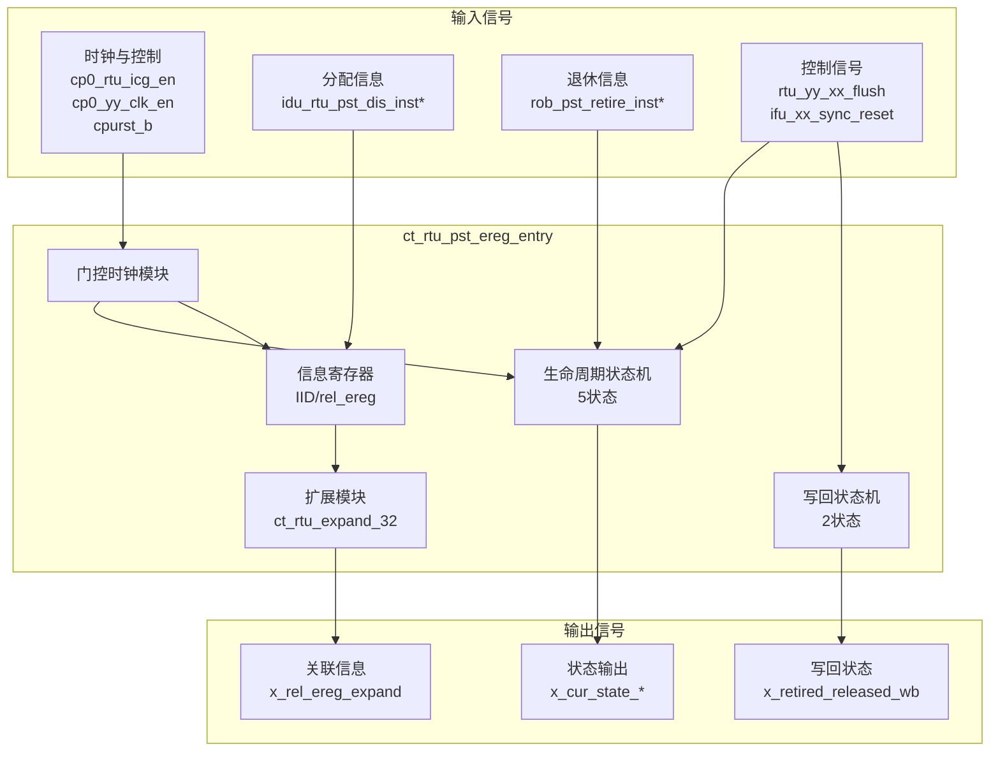
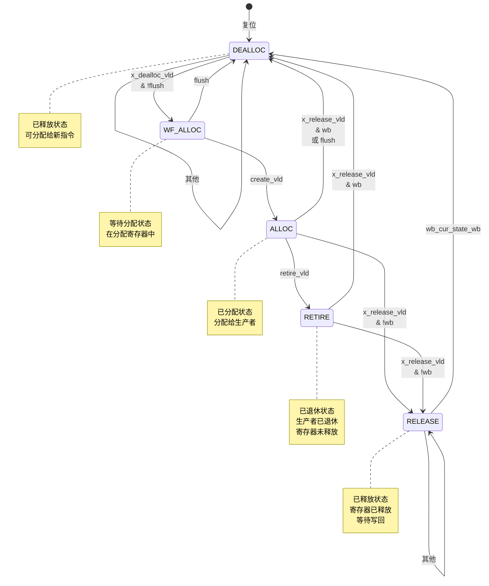

# ct_rtu_pst_ereg_entry 模块设计文档

## 1. 模块概述

### 1.1 功能描述
`ct_rtu_pst_preg_entry` 是 RTU（Rename Table Unit）子系统中的扩展寄存器（Extended Register, ereg）条目管理模块。该模块负责管理单个扩展寄存器的完整生命周期，包括分配、退休、释放和写回等状态转换，并维护相关的指令标识（IID）和关联寄存器信息。

### 1.2 主要特性
- 完整的寄存器生命周期状态机（5状态）
- 独立的写回状态机（2状态）
- 支持乱序执行和顺序退休
- 支持异步刷新和同步复位
- 低功耗门控时钟设计
- 支持快速退休指令的写回优化

### 1.3 应用场景
- 扩展寄存器重命名表管理
- 物理寄存器生命周期跟踪
- 指令退休时的寄存器状态更新
- 异常和中断时的寄存器状态恢复

---

## 2. 接口说明

### 2.1 输入端口列表

| 端口名称 | 位宽 | 类型 | 描述 |
|---------|------|------|------|
| cp0_rtu_icg_en | 1 | input | CP0 集成门控时钟使能 |
| cp0_yy_clk_en | 1 | input | CP0 全局时钟使能 |
| cpurst_b | 1 | input | 全局复位信号（低有效） |
| dealloc_vld_for_gateclk | 1 | input | 用于门控时钟的释放有效信号 |
| ereg_top_clk | 1 | input | 扩展寄存器顶层时钟 |
| idu_rtu_pst_dis_inst0_ereg_iid | 7 | input | 指令0扩展寄存器IID |
| idu_rtu_pst_dis_inst0_rel_ereg | 5 | input | 指令0关联扩展寄存器 |
| idu_rtu_pst_dis_inst1_ereg_iid | 7 | input | 指令1扩展寄存器IID |
| idu_rtu_pst_dis_inst1_rel_ereg | 5 | input | 指令1关联扩展寄存器 |
| idu_rtu_pst_dis_inst2_ereg_iid | 7 | input | 指令2扩展寄存器IID |
| idu_rtu_pst_dis_inst2_rel_ereg | 5 | input | 指令2关联扩展寄存器 |
| idu_rtu_pst_dis_inst3_ereg_iid | 7 | input | 指令3扩展寄存器IID |
| idu_rtu_pst_dis_inst3_rel_ereg | 5 | input | 指令3关联扩展寄存器 |
| ifu_xx_sync_reset | 1 | input | IFU 同步复位信号 |
| pad_yy_icg_scan_en | 1 | input | 扫描测试使能 |
| retire_pst_async_flush | 1 | input | 退休异步刷新信号 |
| retire_pst_wb_retire_inst0_ereg_vld | 1 | input | 指令0扩展寄存器退休有效 |
| retire_pst_wb_retire_inst1_ereg_vld | 1 | input | 指令1扩展寄存器退休有效 |
| retire_pst_wb_retire_inst2_ereg_vld | 1 | input | 指令2扩展寄存器退休有效 |
| rob_pst_retire_inst0_iid | 7 | input | ROB指令0退休IID |
| rob_pst_retire_inst1_iid | 7 | input | ROB指令1退休IID |
| rob_pst_retire_inst2_iid | 7 | input | ROB指令2退休IID |
| rtu_yy_xx_flush | 1 | input | RTU全局刷新信号 |
| x_create_vld | 4 | input | 创建有效向量（4指令） |
| x_dealloc_vld | 1 | input | 释放有效信号 |
| x_release_vld | 1 | input | 释放请求信号 |
| x_reset_mapped | 1 | input | 复位映射状态 |
| x_wb_vld | 1 | input | 写回有效信号 |

### 2.2 输出端口列表

| 端口名称 | 位宽 | 类型 | 描述 |
|---------|------|------|------|
| x_cur_state_alloc_release | 1 | output | 当前状态为分配或释放 |
| x_cur_state_dealloc | 1 | output | 当前状态为已释放 |
| x_cur_state_retire | 1 | output | 当前状态为已退休 |
| x_rel_ereg_expand | 32 | output | 关联扩展寄存器扩展向量 |
| x_retired_released_wb | 1 | output | 已退休/已释放写回状态 |
| x_retired_released_wb_for_acc | 1 | output | 用于累加器的写回状态 |

---

## 3. 模块框图

### 3.1 顶层框图



### 3.2 状态机框图



---

## 4. 关键逻辑说明

### 4.1 生命周期状态机

#### 状态定义

```verilog
parameter DEALLOC    = 5'b00001;  // 已释放，可分配
parameter WF_ALLOC   = 5'b00010;  // 等待分配
parameter ALLOC      = 5'b00100;  // 已分配
parameter RETIRE     = 5'b01000;  // 已退休
parameter RELEASE    = 5'b10000;  // 已释放，等待写回
```

#### 状态转换逻辑

1. **DEALLOC → WF_ALLOC**
   - 条件：x_dealloc_vld && !rtu_yy_xx_flush
   - 说明：寄存器被选中分配，进入等待分配状态

2. **WF_ALLOC → ALLOC**
   - 条件：create_vld
   - 说明：分配信息写入完成，进入已分配状态

3. **ALLOC → RETIRE**
   - 条件：retire_vld
   - 说明：指令退休，但寄存器尚未释放

4. **ALLOC/RETIRE → RELEASE**
   - 条件：x_release_vld && !wb_cur_state_wb
   - 说明：寄存器释放但尚未写回

5. **ALLOC/RETIRE/RELEASE → DEALLOC**
   - 条件：x_release_vld && wb_cur_state_wb（已写回）
   - 或：rtu_yy_xx_flush（刷新）

### 4.2 写回状态机

#### 状态定义

```verilog
parameter IDLE = 1'b0;  // 未写回
parameter WB   = 1'b1;  // 已写回
```

#### 状态转换逻辑

1. **IDLE → WB**
   - 条件：x_wb_vld
   - 说明：写回完成

2. **WB → IDLE**
   - 条件：lifecycle_cur_state_dealloc
   - 说明：寄存器已释放，准备重新分配

### 4.3 门控时钟设计

模块使用两个独立的门控时钟：

1. **sm_clk**：状态机时钟
   - 使能条件：状态转换或刷新操作

2. **alloc_clk**：分配信息时钟
   - 使能条件：同步复位或创建操作

```verilog
assign sm_clk_en = rtu_yy_xx_flush
                   || retire_pst_async_flush
                   || ifu_xx_sync_reset
                   || dealloc_vld_for_gateclk
                      && lifecycle_cur_state_dealloc
                   || (lifecycle_cur_state[4:0] == RETIRE)
                      && x_release_vld
                   || x_wb_vld
                   || (lifecycle_cur_state[4:0] == WF_ALLOC)
                      && create_vld
                   || lifecycle_cur_state_alloc
                      && retire_vld
                   || lifecycle_cur_state_release
                      && wb_cur_state_wb
                   || lifecycle_cur_state_dealloc
                      && wb_cur_state_wb;
```

### 4.4 退休匹配逻辑

模块通过 IID 匹配来判断指令是否退休：

```verilog
assign retire_vld = retire_pst_wb_retire_inst0_ereg_vld
                    && (iid[6:0] == rob_pst_retire_inst0_iid[6:0])
                 || retire_pst_wb_retire_inst1_ereg_vld
                    && (iid[6:0] == rob_pst_retire_inst1_iid[6:0])
                 || retire_pst_wb_retire_inst2_ereg_vld
                    && (iid[6:0] == rob_pst_retire_inst2_iid[6:0]);
```

### 4.5 关联寄存器扩展

使用 `ct_rtu_expand_32` 模块将 5 位关联寄存器索引扩展为 32 位独热码：

```verilog
ct_rtu_expand_32  x_ct_rtu_expand_32_rel_ereg (
  .x_num           (rel_ereg       ),
  .x_num_expand    (rel_ereg_expand)
);
```

---

## 5. 内部信号列表

### 5.1 寄存器信号

| 信号名称 | 位宽 | 类型 | 描述 |
|---------|------|------|------|
| create_iid | 7 | reg | 创建时的IID |
| create_rel_ereg | 5 | reg | 创建时的关联扩展寄存器 |
| iid | 7 | reg | 当前IID |
| lifecycle_cur_state | 5 | reg | 生命周期当前状态 |
| lifecycle_next_state | 5 | reg | 生命周期下一状态 |
| rel_ereg | 5 | reg | 关联扩展寄存器 |
| wb_cur_state | 1 | reg | 写回当前状态 |
| wb_next_state | 1 | reg | 写回下一状态 |

### 5.2 内部线网信号

| 信号名称 | 位宽 | 类型 | 描述 |
|---------|------|------|------|
| alloc_clk | 1 | wire | 分配时钟 |
| alloc_clk_en | 1 | wire | 分配时钟使能 |
| create_vld | 1 | wire | 创建有效 |
| lifecycle_cur_state_alloc | 1 | wire | 当前为分配状态 |
| lifecycle_cur_state_dealloc | 1 | wire | 当前为已释放状态 |
| lifecycle_cur_state_release | 1 | wire | 当前为释放状态 |
| lifecycle_cur_state_retire | 1 | wire | 当前为退休状态 |
| rel_ereg_expand | 32 | wire | 关联寄存器扩展向量 |
| rel_retire_vld | 1 | wire | 关联退休有效 |
| reset_lifecycle_state | 5 | wire | 复位生命周期状态 |
| reset_wb_state | 1 | wire | 复位写回状态 |
| retire_vld | 1 | wire | 退休有效 |
| sm_clk | 1 | wire | 状态机时钟 |
| sm_clk_en | 1 | wire | 状态机时钟使能 |
| wb_cur_state_wb | 1 | wire | 写回状态为WB |

---

## 6. 时序与约束

### 6.1 时钟域
- **ereg_top_clk**：主时钟域
- **sm_clk**：门控后的状态机时钟
- **alloc_clk**：门控后的分配时钟

### 6.2 复位策略
- 异步复位，同步释放
- 复位后状态：DEALLOC
- 支持同步复位（ifu_xx_sync_reset）

### 6.3 设计约束建议

```tcl
# 时钟约束
create_clock -period 2 [get_ports ereg_top_clk]

# 门控时钟约束
set_clock_gating_check -setup 0.2 [get_cells *gated_clk*]
set_clock_gating_check -hold 0.1 [get_cells *gated_clk*]

# 输入延迟
set_input_delay -max 0.5 [get_ports idu_rtu_pst_dis_inst*]
set_input_delay -max 0.5 [get_ports rob_pst_retire_inst*]

# 输出延迟
set_output_delay -max 0.5 [get_ports x_*]

# 多周期路径
set_multicycle_path 2 -setup -from [get_cells lifecycle_cur_state*]
```

---

## 7. 验证要点

### 7.1 功能验证
- 所有状态转换路径的正确性
- IID 匹配逻辑的正确性
- 门控时钟使能条件的覆盖率
- 异步刷新和同步复位的正确性

### 7.2 边界条件
- 连续分配和释放
- 刷新期间的分配
- 多指令同时退休
- 写回与释放的时序关系

### 7.3 覆盖率目标
- 状态覆盖率：100%（所有状态）
- 转换覆盖率：100%（所有合法转换）
- 行覆盖率：≥95%
- 条件覆盖率：≥95%

---

## 8. 低功耗设计

### 8.1 门控时钟
- 状态机时钟仅在状态转换时使能
- 分配时钟仅在分配操作时使能
- 减少不必要的时钟翻转

### 8.2 状态编码
- 使用 one-hot 编码减少状态译码功耗
- 每个状态位直接对应状态输出

---

## 9. 使用示例

```verilog
// 实例化扩展寄存器条目
ct_rtu_pst_ereg_entry u_ereg_entry (
    .cp0_rtu_icg_en                (cp0_rtu_icg_en),
    .cp0_yy_clk_en                 (cp0_yy_clk_en),
    .cpurst_b                      (cpurst_b),
    .dealloc_vld_for_gateclk       (dealloc_vld),
    .ereg_top_clk                  (ereg_top_clk),
    .idu_rtu_pst_dis_inst0_ereg_iid(inst0_ereg_iid),
    .idu_rtu_pst_dis_inst0_rel_ereg(inst0_rel_ereg),
    // ... 其他端口
    .x_cur_state_dealloc           (ereg_dealloc),
    .x_rel_ereg_expand             (rel_ereg_expand)
);
```

---

## 10. 修订历史

| 版本 | 日期 | 作者 | 修改描述 |
|------|------|------|---------|
| 1.0 | 2026-04-01 | IC设计专家 | 初始版本 |

---

## 11. 参考文档

- OpenC910 架构参考手册
- RTU 子系统设计规范
- IEEE 1364-2005 Verilog HDL 标准
