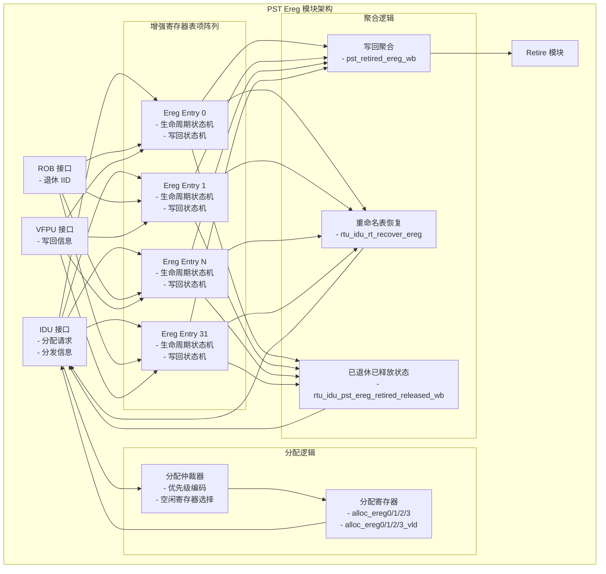
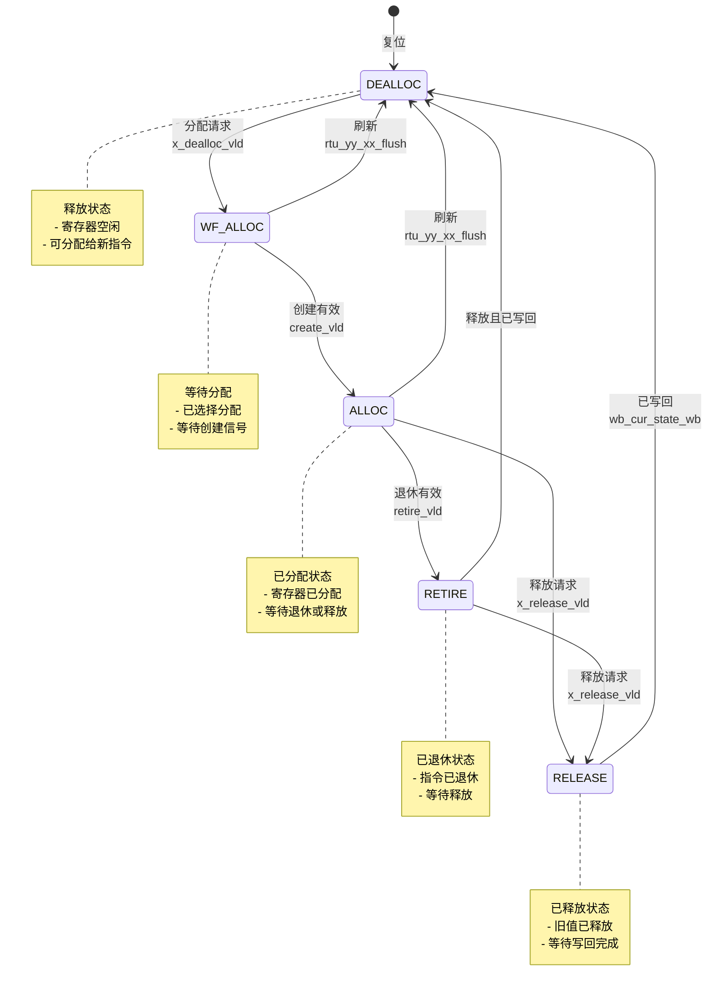
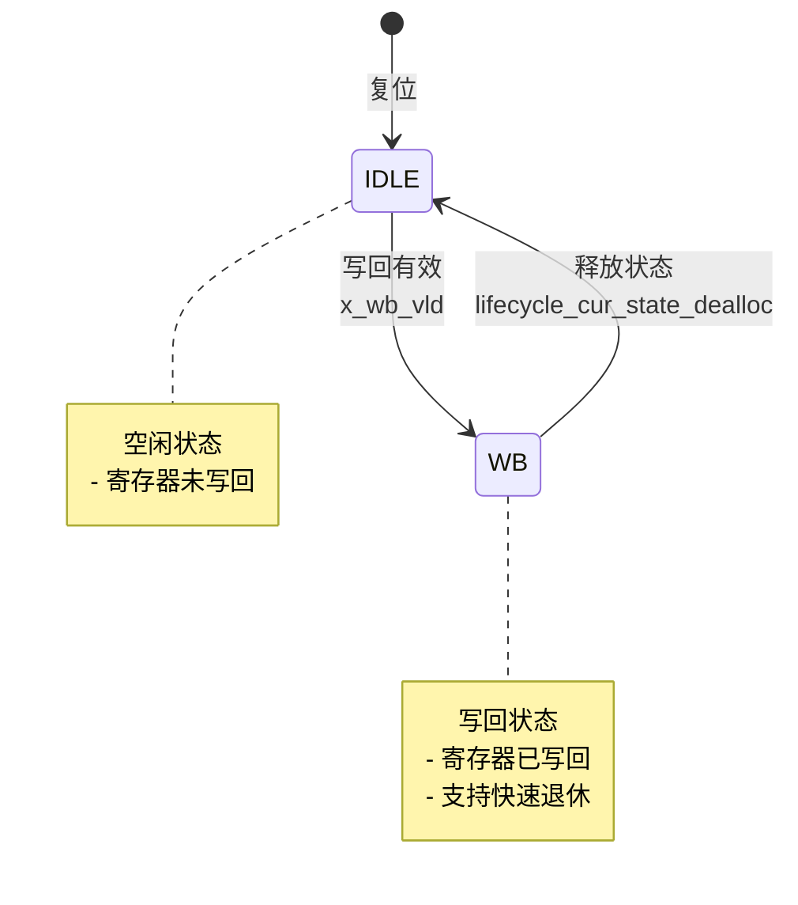

# RTU PST Ereg 模块详细设计文档

## 文档信息
- **模块名称**: ct_rtu_pst_ereg / ct_rtu_pst_ereg_entry
- **文档版本**: v1.0
- **生成日期**: 2026-04-01
- **作者**: IC 设计专家
- **文件路径**:
  - [ct_rtu_pst_ereg.v](file:///d:/code/openc910/C910_RTL_FACTORY/gen_rtl/rtu/rtl/ct_rtu_pst_ereg.v)
  - [ct_rtu_pst_ereg_entry.v](file:///d:/code/openc910/C910_RTL_FACTORY/gen_rtl/rtu/rtl/ct_rtu_pst_ereg_entry.v)

---

## 1. 模块概述

### 1.1 功能描述
ct_rtu_pst_ereg (Physical Status Table - Enhanced Register) 模块实现了增强寄存器(Enhanced Register)的物理寄存器状态表,用于管理浮点寄存器和向量寄存器的重命名和生命周期。该模块包含以下关键功能:

1. **寄存器分配**: 为 IDU 分发的指令分配空闲的增强寄存器
2. **生命周期管理**: 跟踪每个增强寄存器的状态(空闲、已分配、已退休、已释放)
3. **写回状态跟踪**: 记录寄存器是否已写回,支持快速退休优化
4. **重命名表恢复**: 在刷新时恢复重命名表到正确状态
5. **释放信号生成**: 当指令退休时释放旧的增强寄存器

### 1.2 架构特点
- **32 个增强寄存器**: 支持 32 个增强寄存器的状态管理
- **5 状态生命周期**: DEALLOC → WF_ALLOC → ALLOC → RETIRE → RELEASE → DEALLOC
- **快速写回优化**: 支持已写回寄存器的快速退休
- **并行分配**: 支持每周期分配最多 4 个增强寄存器

### 1.3 模块层次结构
```
ct_rtu_pst_ereg (顶层模块)
├── ct_rtu_pst_ereg_entry[0:31] (32 个增强寄存器表项)
│   ├── 生命周期状态机
│   └── 写回状态机
└── 分配逻辑
```

---

## 2. 接口说明

### 2.1 ct_rtu_pst_ereg 顶层模块接口

#### 2.1.1 输入端口

##### 时钟和复位
| 端口名称 | 位宽 | 描述 |
|---------|------|------|
| forever_cpuclk | 1 | 永久 CPU 时钟 |
| cpurst_b | 1 | 系统复位信号(低有效) |
| cp0_yy_clk_en | 1 | 全局时钟使能 |
| cp0_rtu_icg_en | 1 | RTU 模块门控时钟使能 |
| pad_yy_icg_scan_en | 1 | 扫描测试使能 |

##### IDU 分发接口
| 端口名称 | 位宽 | 描述 |
|---------|------|------|
| idu_rtu_ir_ereg0/1/2/3_alloc_vld | 1 | IDU 分配增强寄存器 0/1/2/3 有效 |
| idu_rtu_ir_ereg_alloc_gateclk_vld | 1 | IDU 分配门控时钟有效 |
| idu_rtu_pst_dis_inst0_ereg | 5 | IDU 分发指令 0 增强寄存器号 |
| idu_rtu_pst_dis_inst0_ereg_iid | 7 | IDU 分发指令 0 增强寄存器 IID |
| idu_rtu_pst_dis_inst0_ereg_vld | 1 | IDU 分发指令 0 增强寄存器有效 |
| idu_rtu_pst_dis_inst0_rel_ereg | 5 | IDU 分发指令 0 释放增强寄存器号 |
| idu_rtu_pst_dis_inst1_ereg | 5 | IDU 分发指令 1 增强寄存器号 |
| idu_rtu_pst_dis_inst1_ereg_iid | 7 | IDU 分发指令 1 增强寄存器 IID |
| idu_rtu_pst_dis_inst1_ereg_vld | 1 | IDU 分发指令 1 增强寄存器有效 |
| idu_rtu_pst_dis_inst1_rel_ereg | 5 | IDU 分发指令 1 释放增强寄存器号 |
| idu_rtu_pst_dis_inst2_ereg | 5 | IDU 分发指令 2 增强寄存器号 |
| idu_rtu_pst_dis_inst2_ereg_iid | 7 | IDU 分发指令 2 增强寄存器 IID |
| idu_rtu_pst_dis_inst2_ereg_vld | 1 | IDU 分发指令 2 增强寄存器有效 |
| idu_rtu_pst_dis_inst2_rel_ereg | 5 | IDU 分发指令 2 释放增强寄存器号 |
| idu_rtu_pst_dis_inst3_ereg | 5 | IDU 分发指令 3 增强寄存器号 |
| idu_rtu_pst_dis_inst3_ereg_iid | 7 | IDU 分发指令 3 增强寄存器 IID |
| idu_rtu_pst_dis_inst3_ereg_vld | 1 | IDU 分发指令 3 增强寄存器有效 |
| idu_rtu_pst_dis_inst3_rel_ereg | 5 | IDU 分发指令 3 释放增强寄存器号 |

##### ROB 退休接口
| 端口名称 | 位宽 | 描述 |
|---------|------|------|
| rob_pst_retire_inst0_iid | 7 | ROB 退休指令 0 IID |
| rob_pst_retire_inst1_iid | 7 | ROB 退休指令 1 IID |
| rob_pst_retire_inst2_iid | 7 | ROB 退休指令 2 IID |
| retire_pst_wb_retire_inst0_ereg_vld | 1 | 退休指令 0 增强寄存器写回有效 |
| retire_pst_wb_retire_inst1_ereg_vld | 1 | 退休指令 1 增强寄存器写回有效 |
| retire_pst_wb_retire_inst2_ereg_vld | 1 | 退休指令 2 增强寄存器写回有效 |

##### VFPU 写回接口
| 端口名称 | 位宽 | 描述 |
|---------|------|------|
| vfpu_rtu_ex5_pipe6_ereg_wb_vld | 1 | VFPU Pipe6 增强寄存器写回有效 |
| vfpu_rtu_ex5_pipe6_wb_ereg | 5 | VFPU Pipe6 写回增强寄存器号 |
| vfpu_rtu_ex5_pipe7_ereg_wb_vld | 1 | VFPU Pipe7 增强寄存器写回有效 |
| vfpu_rtu_ex5_pipe7_wb_ereg | 5 | VFPU Pipe7 写回增强寄存器号 |

##### 刷新和复位接口
| 端口名称 | 位宽 | 描述 |
|---------|------|------|
| rtu_yy_xx_flush | 1 | 全局刷新信号 |
| retire_pst_async_flush | 1 | 异步刷新信号 |
| ifu_xx_sync_reset | 1 | 同步复位信号 |

#### 2.1.2 输出端口

##### IDU 分配接口
| 端口名称 | 位宽 | 描述 |
|---------|------|------|
| rtu_idu_alloc_ereg0 | 5 | 分配给 IDU 的增强寄存器 0 |
| rtu_idu_alloc_ereg0_vld | 1 | 增强寄存器 0 分配有效 |
| rtu_idu_alloc_ereg1 | 5 | 分配给 IDU 的增强寄存器 1 |
| rtu_idu_alloc_ereg1_vld | 1 | 增强寄存器 1 分配有效 |
| rtu_idu_alloc_ereg2 | 5 | 分配给 IDU 的增强寄存器 2 |
| rtu_idu_alloc_ereg2_vld | 1 | 增强寄存器 2 分配有效 |
| rtu_idu_alloc_ereg3 | 5 | 分配给 IDU 的增强寄存器 3 |
| rtu_idu_alloc_ereg3_vld | 1 | 增强寄存器 3 分配有效 |

##### 重命名表恢复接口
| 端口名称 | 位宽 | 描述 |
|---------|------|------|
| rtu_idu_rt_recover_ereg | 5 | 重命名表恢复增强寄存器号 |
| rtu_idu_pst_ereg_retired_released_wb | 32 | 已退休已释放写回状态位图 |

##### 退休状态接口
| 端口名称 | 位宽 | 描述 |
|---------|------|------|
| pst_retired_ereg_wb | 1 | 所有增强寄存器已写回 |

### 2.2 ct_rtu_pst_ereg_entry 表项模块接口

#### 2.2.1 输入端口

| 端口名称 | 位宽 | 描述 |
|---------|------|------|
| ereg_top_clk | 1 | 增强寄存器顶层时钟 |
| dealloc_vld_for_gateclk | 1 | 释放有效(用于门控时钟) |
| x_create_vld | 4 | 创建有效向量(4 位 one-hot) |
| x_dealloc_vld | 1 | 释放有效 |
| x_release_vld | 1 | 释放请求 |
| x_wb_vld | 1 | 写回有效 |
| x_reset_mapped | 1 | 复位映射状态 |
| idu_rtu_pst_dis_inst0_ereg_iid | 7 | IDU 分发指令 0 增强寄存器 IID |
| idu_rtu_pst_dis_inst0_rel_ereg | 5 | IDU 分发指令 0 释放增强寄存器号 |
| idu_rtu_pst_dis_inst1_ereg_iid | 7 | IDU 分发指令 1 增强寄存器 IID |
| idu_rtu_pst_dis_inst1_rel_ereg | 5 | IDU 分发指令 1 释放增强寄存器号 |
| idu_rtu_pst_dis_inst2_ereg_iid | 7 | IDU 分发指令 2 增强寄存器 IID |
| idu_rtu_pst_dis_inst2_rel_ereg | 5 | IDU 分发指令 2 释放增强寄存器号 |
| idu_rtu_pst_dis_inst3_ereg_iid | 7 | IDU 分发指令 3 增强寄存器 IID |
| idu_rtu_pst_dis_inst3_rel_ereg | 5 | IDU 分发指令 3 释放增强寄存器号 |
| rob_pst_retire_inst0_iid | 7 | ROB 退休指令 0 IID |
| rob_pst_retire_inst1_iid | 7 | ROB 退休指令 1 IID |
| rob_pst_retire_inst2_iid | 7 | ROB 退休指令 2 IID |
| retire_pst_wb_retire_inst0_ereg_vld | 1 | 退休指令 0 增强寄存器写回有效 |
| retire_pst_wb_retire_inst1_ereg_vld | 1 | 退休指令 1 增强寄存器写回有效 |
| retire_pst_wb_retire_inst2_ereg_vld | 1 | 退休指令 2 增强寄存器写回有效 |
| retire_pst_async_flush | 1 | 异步刷新信号 |
| rtu_yy_xx_flush | 1 | 全局刷新信号 |
| ifu_xx_sync_reset | 1 | 同步复位信号 |

#### 2.2.2 输出端口

| 端口名称 | 位宽 | 描述 |
|---------|------|------|
| x_cur_state_dealloc | 1 | 当前状态为释放状态 |
| x_cur_state_alloc_release | 1 | 当前状态为分配或释放状态 |
| x_cur_state_retire | 1 | 当前状态为退休状态 |
| x_rel_ereg_expand | 32 | 释放增强寄存器扩展向量 |
| x_retired_released_wb | 1 | 已退休已释放写回状态 |
| x_retired_released_wb_for_acc | 1 | 已退休已释放写回状态(用于累加器) |

---

## 3. 模块框图

### 3.1 PST Ereg 顶层架构



### 3.2 Ereg Entry 生命周期状态机



### 3.3 Ereg Entry 写回状态机



---

## 4. 关键逻辑说明

### 4.1 寄存器分配机制

#### 4.1.1 分配优先级
PST Ereg 采用固定优先级分配策略,从低地址到高地址依次分配:
- 优先分配编号较小的空闲寄存器
- 使用优先级编码器实现

#### 4.1.2 分配流程
1. **检测空闲寄存器**: 收集所有 DEALLOC 状态的寄存器
2. **优先级编码**: 选择优先级最高的空闲寄存器
3. **状态转换**: 将选中寄存器从 DEALLOC 转换到 WF_ALLOC
4. **创建信息**: 记录 IID 和释放寄存器信息
5. **状态确认**: 收到 create_vld 后转换到 ALLOC 状态

#### 4.1.3 并行分配
支持每周期最多分配 4 个增强寄存器:
```verilog
// 分配 4 个寄存器的逻辑
assign alloc_ereg0_invalid = !dealloc0[0];
assign alloc_ereg1_invalid = !dealloc1[0];
assign alloc_ereg2_invalid = !dealloc2[0];
assign alloc_ereg3_invalid = !dealloc3[0];
```

### 4.2 生命周期管理

#### 4.2.1 状态转换条件
| 当前状态 | 下一状态 | 转换条件 |
|---------|---------|---------|
| DEALLOC | WF_ALLOC | x_dealloc_vld && !rtu_yy_xx_flush |
| WF_ALLOC | ALLOC | create_vld |
| WF_ALLOC | DEALLOC | rtu_yy_xx_flush |
| ALLOC | RETIRE | retire_vld |
| ALLOC | RELEASE | x_release_vld |
| ALLOC | DEALLOC | rtu_yy_xx_flush 或 (x_release_vld && wb_cur_state_wb) |
| RETIRE | RELEASE | x_release_vld |
| RETIRE | DEALLOC | x_release_vld && wb_cur_state_wb |
| RELEASE | DEALLOC | wb_cur_state_wb |

#### 4.2.2 退休匹配
每个表项通过 IID 匹配判断是否退休:
```verilog
assign retire_vld = retire_pst_wb_retire_inst0_ereg_vld
                    && (iid[6:0] == rob_pst_retire_inst0_iid[6:0])
                 || retire_pst_wb_retire_inst1_ereg_vld
                    && (iid[6:0] == rob_pst_retire_inst1_iid[6:0])
                 || retire_pst_wb_retire_inst2_ereg_vld
                    && (iid[6:0] == rob_pst_retire_inst2_iid[6:0]);
```

### 4.3 写回状态跟踪

#### 4.3.1 写回状态机设计
写回状态机采用 2 状态设计:
- **IDLE**: 寄存器未写回
- **WB**: 寄存器已写回

#### 4.3.2 快速退休优化
当寄存器已写回时,可以跳过等待写回的阶段:
```verilog
assign x_retired_released_wb = (lifecycle_cur_state_alloc
                                  && retire_vld
                             || lifecycle_cur_state_retire
                             || lifecycle_cur_state_release)
                               ? wb_cur_state_wb : 1'b1;
```

### 4.4 释放信号生成

#### 4.4.1 释放向量扩展
将 5 位释放寄存器号扩展为 32 位 one-hot 向量:
```verilog
ct_rtu_expand_32  x_ct_rtu_expand_32_rel_ereg (
  .x_num           (rel_ereg       ),
  .x_num_expand    (rel_ereg_expand)
);
```

#### 4.4.2 释放条件
释放信号在退休时生成:
```verilog
assign rel_retire_vld = lifecycle_cur_state_alloc && retire_vld;
assign x_rel_ereg_expand[31:0] = {32{rel_retire_vld}} & rel_ereg_expand[31:0];
```

### 4.5 重命名表恢复

#### 4.5.1 恢复机制
在刷新时,PST Ereg 提供已退休寄存器的信息用于恢复重命名表:
```verilog
assign x_cur_state_retire = lifecycle_cur_state_retire;
```

#### 4.5.2 恢复向量
所有处于 RETIRE 状态的寄存器形成恢复向量:
```verilog
assign rtu_idu_rt_recover_ereg[4:0] = /* 聚合所有 RETIRE 状态寄存器 */;
```

---

## 5. 内部信号列表

### 5.1 ct_rtu_pst_ereg 顶层信号

#### 5.1.1 寄存器
| 信号名称 | 位宽 | 描述 |
|---------|------|------|
| alloc_ereg0 | 5 | 分配寄存器 0 |
| alloc_ereg0_vld | 1 | 分配寄存器 0 有效 |
| alloc_ereg1 | 5 | 分配寄存器 1 |
| alloc_ereg1_vld | 1 | 分配寄存器 1 有效 |
| alloc_ereg2 | 5 | 分配寄存器 2 |
| alloc_ereg2_vld | 1 | 分配寄存器 2 有效 |
| alloc_ereg3 | 5 | 分配寄存器 3 |
| alloc_ereg3_vld | 1 | 分配寄存器 3 有效 |

#### 5.1.2 关键组合逻辑信号
| 信号名称 | 位宽 | 描述 |
|---------|------|------|
| dealloc | 32 | 释放向量(所有 DEALLOC 状态寄存器) |
| dealloc0/1/2/3 | 32 | 分配 0/1/2/3 的释放向量 |
| alloc_release | 32 | 分配或释放状态向量 |
| d0/1/2/3_ereg | 32 | 分配 0/1/2/3 的增强寄存器向量 |

### 5.2 ct_rtu_pst_ereg_entry 表项信号

#### 5.2.1 寄存器
| 信号名称 | 位宽 | 描述 |
|---------|------|------|
| iid | 7 | 指令 ID |
| rel_ereg | 5 | 释放增强寄存器号 |
| lifecycle_cur_state | 5 | 生命周期当前状态 |
| lifecycle_next_state | 5 | 生命周期下一状态 |
| wb_cur_state | 1 | 写回当前状态 |
| wb_next_state | 1 | 写回下一状态 |

#### 5.2.2 关键组合逻辑信号
| 信号名称 | 位宽 | 描述 |
|---------|------|------|
| create_vld | 1 | 创建有效 |
| retire_vld | 1 | 退休有效 |
| rel_retire_vld | 1 | 释放退休有效 |
| lifecycle_cur_state_dealloc | 1 | 当前状态为 DEALLOC |
| lifecycle_cur_state_alloc | 1 | 当前状态为 ALLOC |
| lifecycle_cur_state_retire | 1 | 当前状态为 RETIRE |
| lifecycle_cur_state_release | 1 | 当前状态为 RELEASE |
| wb_cur_state_wb | 1 | 写回状态为 WB |

---

## 6. 参数定义

### 6.1 生命周期状态参数
```verilog
parameter DEALLOC    = 5'b00001;  // 释放状态
parameter WF_ALLOC   = 5'b00010;  // 等待分配状态
parameter ALLOC      = 5'b00100;  // 已分配状态
parameter RETIRE     = 5'b01000;  // 已退休状态
parameter RELEASE    = 5'b10000;  // 已释放状态
```

### 6.2 写回状态参数
```verilog
parameter IDLE       = 1'b0;  // 空闲状态
parameter WB         = 1'b1;  // 写回状态
```

---

## 7. 设计要点

### 7.1 时序优化
- **退休 IID 匹配**: 提前进行 IID 比较,减少关键路径延迟
- **状态位提取**: 使用 one-hot 编码的状态位直接提取,避免译码延迟
- **写回状态缓存**: 写回状态独立状态机管理,支持快速查询

### 7.2 低功耗设计
- **门控时钟**: 对分配逻辑和状态机分别使用独立的门控时钟
- **时钟使能条件**: 仅在状态变化时开启时钟
```verilog
assign sm_clk_en = rtu_yy_xx_flush
                   || retire_pst_async_flush
                   || ifu_xx_sync_reset
                   || dealloc_vld_for_gateclk
                      && lifecycle_cur_state_dealloc
                   || (lifecycle_cur_state[4:0] == RETIRE)
                      && x_release_vld
                   || x_wb_vld
                   || (lifecycle_cur_state[4:0] == WF_ALLOC)
                      && create_vld
                   || lifecycle_cur_state_alloc
                      && retire_vld
                   || lifecycle_cur_state_release
                      && wb_cur_state_wb
                   || lifecycle_cur_state_dealloc
                      && wb_cur_state_wb;
```

### 7.3 可测试性设计
- **扫描链支持**: 所有寄存器支持扫描测试
- **同步复位**: 支持同步复位功能 (`ifu_xx_sync_reset`)
- **复位状态可配置**: 通过 `x_reset_mapped` 配置复位后的初始状态

### 7.4 快速退休优化
- **写回状态跟踪**: 独立跟踪每个寄存器的写回状态
- **快速退休判断**: 已写回的寄存器可以立即退休,无需等待
- **聚合信号**: 提供所有寄存器的写回状态聚合信号

---

## 8. 注意事项

### 8.1 分配逻辑
- 分配优先级固定,从低地址到高地址
- 需要等待 create_vld 信号才能完成分配
- 刷新会取消 WF_ALLOC 状态的分配

### 8.2 生命周期管理
- 刷新会将所有非 DEALLOC 状态的寄存器强制转换为 DEALLOC
- 释放信号只在退休时生成
- 已写回的寄存器可以快速完成生命周期

### 8.3 写回状态
- 写回状态独立于生命周期状态
- 异步刷新会强制所有寄存器进入 WB 状态
- 创建新分配时会清除写回状态

---

## 9. 版本历史

| 版本 | 日期 | 作者 | 修改描述 |
|------|------|------|---------|
| v1.0 | 2026-04-01 | IC 设计专家 | 初始版本 |

---

## 10. 参考资料
- RISC-V 特权架构规范
- T-Head C910 处理器设计规范
- IEEE 1800 SystemVerilog 标准
