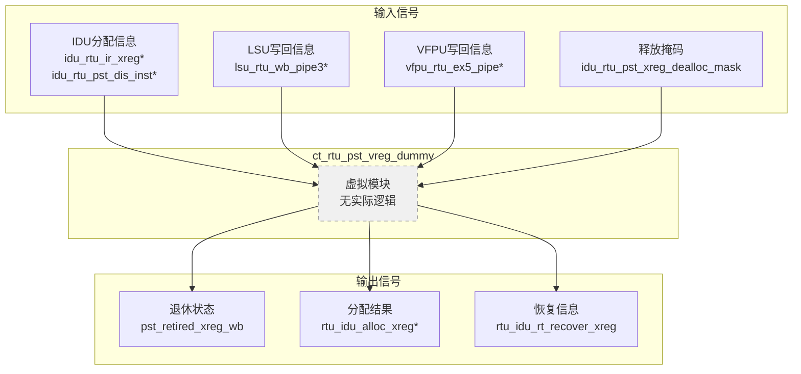
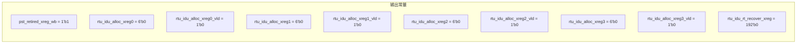

# ct_rtu_pst_vreg_dummy 模块设计文档

## 1. 模块概述

### 1.1 功能描述
`ct_rtu_pst_vreg_dummy` 是 RTU（Rename Table Unit）子系统中的向量寄存器虚拟模块。该模块是一个占位符（dummy）模块，用于在不支持向量扩展的配置中替代完整的向量寄存器管理模块。所有输出信号都被固定为常量值，不执行任何实际功能。

### 1.2 主要特性
- 纯组合逻辑实现
- 所有输出为固定常量
- 无内部状态和寄存器
- 用于条件编译或配置选项
- 零功能开销

### 1.3 应用场景
- 不支持向量扩展的处理器配置
- 节省面积和功耗的精简配置
- 测试和验证的简化环境
- 向量功能禁用时的占位实现

---

## 2. 接口说明

### 2.1 输入端口列表

| 端口名称 | 位宽 | 类型 | 描述 |
|---------|------|------|------|
| idu_rtu_ir_xreg0_alloc_vld | 1 | input | IDU向量寄存器0分配有效 |
| idu_rtu_ir_xreg1_alloc_vld | 1 | input | IDU向量寄存器1分配有效 |
| idu_rtu_ir_xreg2_alloc_vld | 1 | input | IDU向量寄存器2分配有效 |
| idu_rtu_ir_xreg3_alloc_vld | 1 | input | IDU向量寄存器3分配有效 |
| idu_rtu_ir_xreg_alloc_gateclk_vld | 1 | input | IDU向量寄存器分配门控时钟有效 |
| idu_rtu_pst_dis_inst0_dstv_reg | 5 | input | 指令0目标向量寄存器 |
| idu_rtu_pst_dis_inst0_rel_vreg | 6 | input | 指令0关联向量寄存器 |
| idu_rtu_pst_dis_inst0_vreg | 6 | input | 指令0向量寄存器 |
| idu_rtu_pst_dis_inst0_vreg_iid | 7 | input | 指令0向量寄存器IID |
| idu_rtu_pst_dis_inst0_xreg_vld | 1 | input | 指令0扩展向量寄存器有效 |
| idu_rtu_pst_dis_inst1_dstv_reg | 5 | input | 指令1目标向量寄存器 |
| idu_rtu_pst_dis_inst1_rel_vreg | 6 | input | 指令1关联向量寄存器 |
| idu_rtu_pst_dis_inst1_vreg | 6 | input | 指令1向量寄存器 |
| idu_rtu_pst_dis_inst1_vreg_iid | 7 | input | 指令1向量寄存器IID |
| idu_rtu_pst_dis_inst1_xreg_vld | 1 | input | 指令1扩展向量寄存器有效 |
| idu_rtu_pst_dis_inst2_dstv_reg | 5 | input | 指令2目标向量寄存器 |
| idu_rtu_pst_dis_inst2_rel_vreg | 6 | input | 指令2关联向量寄存器 |
| idu_rtu_pst_dis_inst2_vreg | 6 | input | 指令2向量寄存器 |
| idu_rtu_pst_dis_inst2_vreg_iid | 7 | input | 指令2向量寄存器IID |
| idu_rtu_pst_dis_inst2_xreg_vld | 1 | input | 指令2扩展向量寄存器有效 |
| idu_rtu_pst_dis_inst3_dstv_reg | 5 | input | 指令3目标向量寄存器 |
| idu_rtu_pst_dis_inst3_rel_vreg | 6 | input | 指令3关联向量寄存器 |
| idu_rtu_pst_dis_inst3_vreg | 6 | input | 指令3向量寄存器 |
| idu_rtu_pst_dis_inst3_vreg_iid | 7 | input | 指令3向量寄存器IID |
| idu_rtu_pst_dis_inst3_xreg_vld | 1 | input | 指令3扩展向量寄存器有效 |
| idu_rtu_pst_xreg_dealloc_mask | 64 | input | 扩展向量寄存器释放掩码 |
| lsu_rtu_wb_pipe3_wb_vreg_expand | 64 | input | LSU写回向量寄存器扩展 |
| lsu_rtu_wb_pipe3_wb_vreg_vld | 1 | input | LSU写回向量寄存器有效 |
| vfpu_rtu_ex5_pipe6_wb_vreg_expand | 64 | input | VFPU写回向量寄存器扩展（管道6） |
| vfpu_rtu_ex5_pipe6_wb_vreg_vld | 1 | input | VFPU写回向量寄存器有效（管道6） |
| vfpu_rtu_ex5_pipe7_wb_vreg_expand | 64 | input | VFPU写回向量寄存器扩展（管道7） |
| vfpu_rtu_ex5_pipe7_wb_vreg_vld | 1 | input | VFPU写回向量寄存器有效（管道7） |

### 2.2 输出端口列表

| 端口名称 | 位宽 | 类型 | 描述 |
|---------|------|------|------|
| pst_retired_xreg_wb | 1 | output | 退休扩展向量寄存器写回状态 |
| rtu_idu_alloc_xreg0 | 6 | output | 分配的扩展向量寄存器0 |
| rtu_idu_alloc_xreg0_vld | 1 | output | 扩展向量寄存器0分配有效 |
| rtu_idu_alloc_xreg1 | 6 | output | 分配的扩展向量寄存器1 |
| rtu_idu_alloc_xreg1_vld | 1 | output | 扩展向量寄存器1分配有效 |
| rtu_idu_alloc_xreg2 | 6 | output | 分配的扩展向量寄存器2 |
| rtu_idu_alloc_xreg2_vld | 1 | output | 扩展向量寄存器2分配有效 |
| rtu_idu_alloc_xreg3 | 6 | output | 分配的扩展向量寄存器3 |
| rtu_idu_alloc_xreg3_vld | 1 | output | 扩展向量寄存器3分配有效 |
| rtu_idu_rt_recover_xreg | 192 | output | 重命名表恢复扩展向量寄存器 |

---

## 3. 模块框图

### 3.1 顶层框图



### 3.2 输出常量映射



---

## 4. 关键逻辑说明

### 4.1 输出赋值

所有输出信号都被赋值为固定常量：

```verilog
assign pst_retired_xreg_wb            = 1'b1;
assign rtu_idu_alloc_xreg0[5:0]       = 6'b0;
assign rtu_idu_alloc_xreg0_vld        = 1'b0;
assign rtu_idu_alloc_xreg1[5:0]       = 6'b0;
assign rtu_idu_alloc_xreg1_vld        = 1'b0;
assign rtu_idu_alloc_xreg2[5:0]       = 6'b0;
assign rtu_idu_alloc_xreg2_vld        = 1'b0;
assign rtu_idu_alloc_xreg3[5:0]       = 6'b0;
assign rtu_idu_alloc_xreg3_vld        = 1'b0;
assign rtu_idu_rt_recover_xreg[191:0] = 192'b0;
```

### 4.2 设计特点

1. **零功能开销**：不执行任何实际操作
2. **接口兼容**：保持与完整模块相同的接口
3. **面积优化**：无寄存器和逻辑电路
4. **功耗优化**：无时钟和状态转换

### 4.3 输出常量含义

| 输出信号 | 常量值 | 含义 |
|---------|-------|------|
| pst_retired_xreg_wb | 1'b1 | 所有向量寄存器视为已写回 |
| rtu_idu_alloc_xreg* | 6'b0 | 无向量寄存器分配 |
| rtu_idu_alloc_xreg*_vld | 1'b0 | 分配无效 |
| rtu_idu_rt_recover_xreg | 192'b0 | 无恢复信息 |

---

## 5. 内部信号列表

### 5.1 无内部寄存器
本模块为纯组合逻辑虚拟模块，无内部寄存器或状态信号。

### 5.2 无内部线网
本模块不使用任何内部线网信号，所有输出直接赋值为常量。

---

## 6. 设计意图

### 6.1 为什么需要 Dummy 模块

1. **配置灵活性**
   - 支持向量扩展和非向量扩展两种配置
   - 通过模块替换而非代码修改实现配置切换

2. **接口一致性**
   - 保持顶层模块接口不变
   - 简化系统集成和验证

3. **资源优化**
   - 不支持向量扩展时节省面积
   - 减少不必要的功耗

### 6.2 使用场景

```verilog
// 条件编译示例
`ifdef SUPPORT_VECTOR_EXTENSION
    ct_rtu_pst_vreg_entry u_vreg_entry (
        // 完整端口连接
    );
`else
    ct_rtu_pst_vreg_dummy u_vreg_entry (
        // 虚拟端口连接
    );
`endif
```

---

## 7. 与 ct_rtu_pst_vreg_entry 的对比

| 特性 | ct_rtu_pst_vreg_dummy | ct_rtu_pst_vreg_entry |
|------|----------------------|----------------------|
| 功能 | 无（占位符） | 完整向量寄存器管理 |
| 状态机 | 无 | 生命周期+写回状态机 |
| 寄存器 | 无 | IID/dstv_reg/rel_vreg等 |
| 时钟 | 无 | vreg_top_clk |
| 面积 | 零 | 较大 |
| 功耗 | 零 | 有 |
| 输出 | 固定常量 | 动态计算 |

---

## 8. 验证要点

### 8.1 功能验证
- 验证所有输出为预期常量
- 验证输入信号不影响输出
- 验证接口连接的正确性

### 8.2 集成验证
- 验证与完整模块的接口兼容性
- 验证系统在不支持向量扩展时的行为
- 验证配置切换的正确性

### 8.3 覆盖率目标
- 行覆盖率：100%（所有赋值语句）
- 输出覆盖率：100%（所有输出信号）

---

## 9. 使用示例

### 9.1 模块实例化

```verilog
// 实例化虚拟向量寄存器模块
ct_rtu_pst_vreg_dummy u_vreg_dummy (
    .idu_rtu_ir_xreg0_alloc_vld       (xreg0_alloc_vld),
    .idu_rtu_ir_xreg1_alloc_vld       (xreg1_alloc_vld),
    .idu_rtu_ir_xreg2_alloc_vld       (xreg2_alloc_vld),
    .idu_rtu_ir_xreg3_alloc_vld       (xreg3_alloc_vld),
    // ... 其他端口
    .pst_retired_xreg_wb              (retired_xreg_wb),
    .rtu_idu_alloc_xreg0              (alloc_xreg0),
    .rtu_idu_rt_recover_xreg          (rt_recover_xreg)
);
```

### 9.2 配置选择示例

```verilog
// 根据配置选择模块
generate
    if (SUPPORT_VECTOR) begin : GEN_VREG_ENTRY
        ct_rtu_pst_vreg_entry u_vreg_entry (
            // 完整端口连接
        );
    end else begin : GEN_VREG_DUMMY
        ct_rtu_pst_vreg_dummy u_vreg_dummy (
            // 虚拟端口连接
        );
    end
endgenerate
```

---

## 10. 注意事项

### 10.1 输入信号处理

虽然模块接收大量输入信号，但这些信号不被使用。综合工具会自动优化掉这些输入连接。

### 10.2 综合优化

```verilog
// 综合工具会自动优化为常量
// 无需手动优化
assign pst_retired_xreg_wb = 1'b1;  // 直接替换为 VDD
assign rtu_idu_alloc_xreg0_vld = 1'b0;  // 直接替换为 VSS
```

### 10.3 时序约束

由于无时钟和状态逻辑，无需特殊的时序约束。

---

## 11. 修订历史

| 版本 | 日期 | 作者 | 修改描述 |
|------|------|------|---------|
| 1.0 | 2026-04-01 | IC设计专家 | 初始版本 |

---

## 12. 参考文档

- OpenC910 架构参考手册
- RTU 子系统设计规范
- IEEE 1364-2005 Verilog HDL 标准
