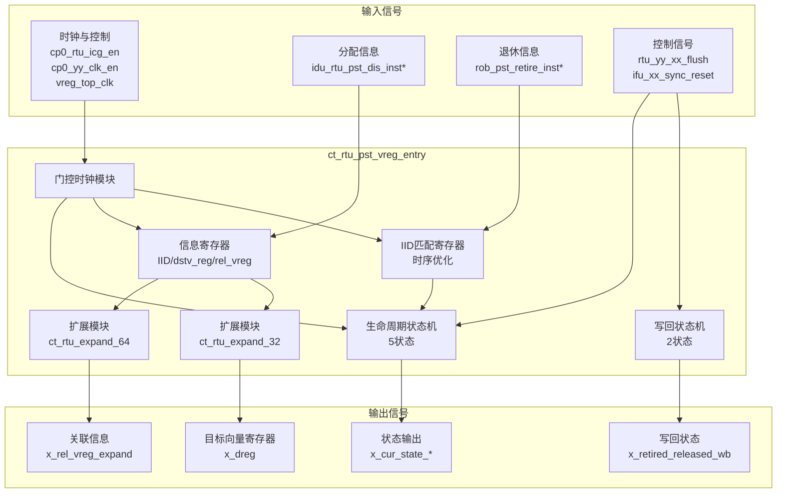
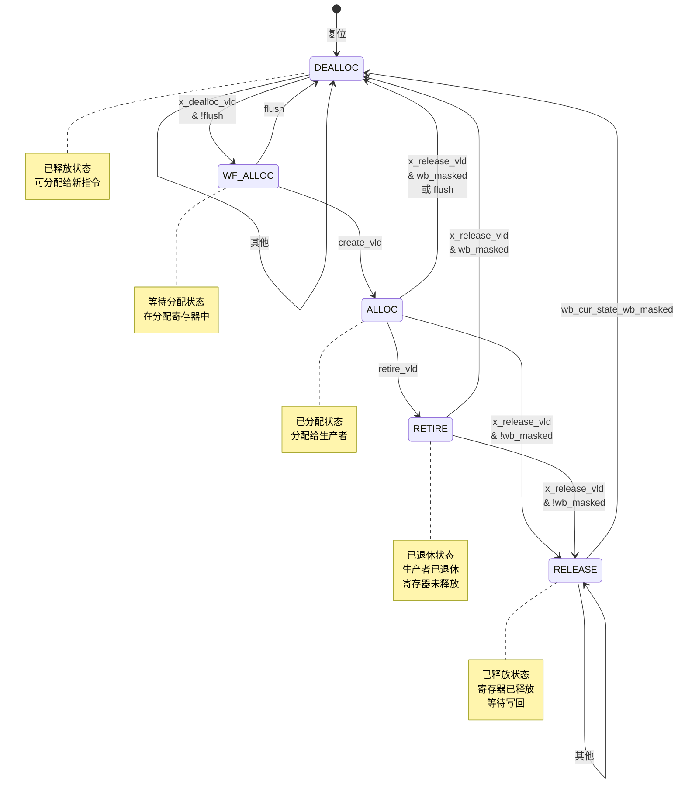

# ct_rtu_pst_vreg_entry 模块设计文档

## 1. 模块概述

### 1.1 功能描述
`ct_rtu_pst_vreg_entry` 是 RTU（Rename Table Unit）子系统中的向量寄存器（Vector Register, vreg）条目管理模块。该模块负责管理单个向量寄存器的完整生命周期，包括分配、退休、释放和写回等状态转换，并维护相关的指令标识（IID）、目标向量寄存器和关联向量寄存器信息。

### 1.2 主要特性
- 完整的寄存器生命周期状态机（5状态）
- 独立的写回状态机（2状态）
- 支持乱序执行和顺序退休
- 支持异步刷新和同步复位
- 低功耗门控时钟设计
- 退休IID预匹配优化（时序优化）
- 支持快速退休指令的写回优化
- 专门针对向量寄存器的优化设计

### 1.3 应用场景
- 向量寄存器重命名表管理
- 向量寄存器生命周期跟踪
- 向量指令退休时的寄存器状态更新
- 异常和中断时的向量寄存器状态恢复
- 向量重命名表的快速恢复

---

## 2. 接口说明

### 2.1 输入端口列表

| 端口名称 | 位宽 | 类型 | 描述 |
|---------|------|------|------|
| cp0_rtu_icg_en | 1 | input | CP0 集成门控时钟使能 |
| cp0_yy_clk_en | 1 | input | CP0 全局时钟使能 |
| cpurst_b | 1 | input | 全局复位信号（低有效） |
| dealloc_vld_for_gateclk | 1 | input | 用于门控时钟的释放有效信号 |
| idu_rtu_pst_dis_inst0_dstv_reg | 5 | input | 指令0目标向量寄存器 |
| idu_rtu_pst_dis_inst0_rel_vreg | 6 | input | 指令0关联向量寄存器 |
| idu_rtu_pst_dis_inst0_vreg_iid | 7 | input | 指令0向量寄存器IID |
| idu_rtu_pst_dis_inst1_dstv_reg | 5 | input | 指令1目标向量寄存器 |
| idu_rtu_pst_dis_inst1_rel_vreg | 6 | input | 指令1关联向量寄存器 |
| idu_rtu_pst_dis_inst1_vreg_iid | 7 | input | 指令1向量寄存器IID |
| idu_rtu_pst_dis_inst2_dstv_reg | 5 | input | 指令2目标向量寄存器 |
| idu_rtu_pst_dis_inst2_rel_vreg | 6 | input | 指令2关联向量寄存器 |
| idu_rtu_pst_dis_inst2_vreg_iid | 7 | input | 指令2向量寄存器IID |
| idu_rtu_pst_dis_inst3_dstv_reg | 5 | input | 指令3目标向量寄存器 |
| idu_rtu_pst_dis_inst3_rel_vreg | 6 | input | 指令3关联向量寄存器 |
| idu_rtu_pst_dis_inst3_vreg_iid | 7 | input | 指令3向量寄存器IID |
| ifu_xx_sync_reset | 1 | input | IFU 同步复位信号 |
| pad_yy_icg_scan_en | 1 | input | 扫描测试使能 |
| retire_pst_async_flush | 1 | input | 退休异步刷新信号 |
| retire_pst_wb_retire_inst0_vreg_vld | 1 | input | 指令0向量寄存器退休有效 |
| retire_pst_wb_retire_inst1_vreg_vld | 1 | input | 指令1向量寄存器退休有效 |
| retire_pst_wb_retire_inst2_vreg_vld | 1 | input | 指令2向量寄存器退休有效 |
| rob_pst_retire_inst0_gateclk_vld | 1 | input | ROB指令0门控时钟有效 |
| rob_pst_retire_inst0_iid_updt_val | 7 | input | ROB指令0退休IID更新值 |
| rob_pst_retire_inst1_gateclk_vld | 1 | input | ROB指令1门控时钟有效 |
| rob_pst_retire_inst1_iid_updt_val | 7 | input | ROB指令1退休IID更新值 |
| rob_pst_retire_inst2_gateclk_vld | 1 | input | ROB指令2门控时钟有效 |
| rob_pst_retire_inst2_iid_updt_val | 7 | input | ROB指令2退休IID更新值 |
| rtu_yy_xx_flush | 1 | input | RTU全局刷新信号 |
| vreg_top_clk | 1 | input | 向量寄存器顶层时钟 |
| x_create_vld | 4 | input | 创建有效向量（4指令） |
| x_dealloc_mask | 1 | input | 释放掩码 |
| x_dealloc_vld | 1 | input | 释放有效信号 |
| x_release_vld | 1 | input | 释放请求信号 |
| x_reset_dstv_reg | 5 | input | 复位目标向量寄存器 |
| x_reset_mapped | 1 | input | 复位映射状态 |
| x_wb_vld | 1 | input | 写回有效信号 |

### 2.2 输出端口列表

| 端口名称 | 位宽 | 类型 | 描述 |
|---------|------|------|------|
| x_cur_state_alloc_release | 1 | output | 当前状态为分配或释放 |
| x_cur_state_dealloc | 1 | output | 当前状态为已释放 |
| x_dreg | 32 | output | 目标向量寄存器扩展向量 |
| x_rel_vreg_expand | 64 | output | 关联向量寄存器扩展向量 |
| x_retired_released_wb | 1 | output | 已退休/已释放写回状态 |

---

## 3. 模块框图

### 3.1 顶层框图



### 3.2 状态机框图



---

## 4. 关键逻辑说明

### 4.1 生命周期状态机

#### 状态定义

```verilog
parameter DEALLOC    = 5'b00001;  // 已释放，可分配
parameter WF_ALLOC   = 5'b00010;  // 等待分配
parameter ALLOC      = 5'b00100;  // 已分配
parameter RETIRE     = 5'b01000;  // 已退休
parameter RELEASE    = 5'b10000;  // 已释放，等待写回
```

#### 状态转换逻辑

与 preg_entry 类似，vreg_entry 也使用 `wb_cur_state_wb_masked` 进行状态转换：

```verilog
assign wb_cur_state_wb_masked = (wb_cur_state == WB) && !x_dealloc_mask;
```

### 4.2 IID 匹配寄存器（时序优化）

vreg_entry 使用与 preg_entry 相同的 IID 匹配优化策略：

```verilog
// 提前计算匹配值
assign retire_inst0_iid_match_updt_val =
         lifecycle_cur_state_alloc
         && (iid[6:0] == rob_pst_retire_inst0_iid_updt_val[6:0]);

// 使用寄存器存储匹配结果
always @(posedge sm_clk or negedge cpurst_b)
begin
  if(!cpurst_b)
    retire_inst0_iid_match <= 1'b0;
  else if(ifu_xx_sync_reset)
    retire_inst0_iid_match <= 1'b0;
  else if(rob_pst_retire_inst0_gateclk_vld)
    retire_inst0_iid_match <= retire_inst0_iid_match_updt_val;
  else
    retire_inst0_iid_match <= retire_inst0_iid_match;
end
```

### 4.3 扩展模块使用

#### 关联向量寄存器扩展（64位）

```verilog
ct_rtu_expand_64  x_ct_rtu_expand_64_rel_vreg (
  .x_num           (rel_vreg       ),
  .x_num_expand    (rel_vreg_expand)
);
```

#### 目标向量寄存器扩展（32位）

```verilog
ct_rtu_expand_32  x_ct_rtu_expand_32_dstv_reg (
  .x_num           (dstv_reg       ),
  .x_num_expand    (dstv_reg_expand)
);
```

### 4.4 重命名表恢复信号

```verilog
assign x_dreg[31:0] = {32{lifecycle_cur_state_retire}}
                      & dstv_reg_expand[31:0];
```

当向量寄存器处于 RETIRE 状态时，输出目标向量寄存器的扩展向量，用于重命名表恢复。

### 4.5 状态输出

vreg_entry 提供了 `x_cur_state_alloc_release` 输出，这是 ereg_entry 有但 preg_entry 没有的：

```verilog
assign x_cur_state_alloc_release = lifecycle_cur_state_alloc
                                   || lifecycle_cur_state_release;
```

---

## 5. 内部信号列表

### 5.1 寄存器信号

| 信号名称 | 位宽 | 类型 | 描述 |
|---------|------|------|------|
| create_dstv_reg | 5 | reg | 创建时的目标向量寄存器 |
| create_iid | 7 | reg | 创建时的IID |
| create_rel_vreg | 6 | reg | 创建时的关联向量寄存器 |
| dstv_reg | 5 | reg | 当前目标向量寄存器 |
| iid | 7 | reg | 当前IID |
| lifecycle_cur_state | 5 | reg | 生命周期当前状态 |
| lifecycle_next_state | 5 | reg | 生命周期下一状态 |
| rel_vreg | 6 | reg | 关联向量寄存器 |
| retire_inst0_iid_match | 1 | reg | 指令0 IID匹配标志 |
| retire_inst1_iid_match | 1 | reg | 指令1 IID匹配标志 |
| retire_inst2_iid_match | 1 | reg | 指令2 IID匹配标志 |
| wb_cur_state | 1 | reg | 写回当前状态 |
| wb_next_state | 1 | reg | 写回下一状态 |

### 5.2 内部线网信号

| 信号名称 | 位宽 | 类型 | 描述 |
|---------|------|------|------|
| alloc_clk | 1 | wire | 分配时钟 |
| alloc_clk_en | 1 | wire | 分配时钟使能 |
| create_vld | 1 | wire | 创建有效 |
| dstv_reg_expand | 32 | wire | 目标向量寄存器扩展向量 |
| lifecycle_cur_state_alloc | 1 | wire | 当前为分配状态 |
| lifecycle_cur_state_dealloc | 1 | wire | 当前为已释放状态 |
| lifecycle_cur_state_release | 1 | wire | 当前为释放状态 |
| lifecycle_cur_state_retire | 1 | wire | 当前为退休状态 |
| rel_retire_vld | 1 | wire | 关联退休有效 |
| rel_vreg_expand | 64 | wire | 关联向量寄存器扩展向量 |
| reset_lifecycle_state | 5 | wire | 复位生命周期状态 |
| reset_wb_state | 1 | wire | 复位写回状态 |
| retire_gateclk_vld | 1 | wire | 退休门控时钟有效 |
| retire_inst0_iid_match_updt_val | 1 | wire | 指令0 IID匹配更新值 |
| retire_inst1_iid_match_updt_val | 1 | wire | 指令1 IID匹配更新值 |
| retire_inst2_iid_match_updt_val | 1 | wire | 指令2 IID匹配更新值 |
| retire_inst_iid_match_gateclk_en | 1 | wire | IID匹配门控时钟使能 |
| retire_vld | 1 | wire | 退休有效 |
| sm_clk | 1 | wire | 状态机时钟 |
| sm_clk_en | 1 | wire | 状态机时钟使能 |
| wb_cur_state_wb | 1 | wire | 写回状态为WB |
| wb_cur_state_wb_masked | 1 | wire | 写回状态为WB（带掩码） |

---

## 6. 与其他 Entry 模块的对比

### 6.1 功能对比表

| 特性 | ereg_entry | preg_entry | vreg_entry |
|------|-----------|-----------|-----------|
| 寄存器类型 | 扩展寄存器 | 物理寄存器 | 向量寄存器 |
| 关联寄存器位宽 | 5位 | 7位 | 6位 |
| 目标寄存器 | 无 | 5位 | 5位 |
| IID匹配方式 | 实时比较 | 寄存器存储 | 寄存器存储 |
| 关联扩展输出 | 32位 | 96位 | 64位 |
| 目标扩展输出 | 无 | 32位 | 32位 |
| 时钟源 | ereg_top_clk | forever_cpuclk | vreg_top_clk |
| 释放掩码 | 无 | 有 | 有 |
| 时序优化 | 无 | IID预匹配 | IID预匹配 |
| 状态输出 | alloc_release | 仅dealloc | alloc_release |

### 6.2 扩展模块对比

| 模块 | 关联扩展 | 目标扩展 |
|------|---------|---------|
| ereg_entry | ct_rtu_expand_32 (32位) | 无 |
| preg_entry | ct_rtu_expand_96 (96位) | ct_rtu_expand_32 (32位) |
| vreg_entry | ct_rtu_expand_64 (64位) | ct_rtu_expand_32 (32位) |

---

## 7. 时序与约束

### 7.1 时钟域
- **vreg_top_clk**：主时钟域
- **sm_clk**：门控后的状态机时钟
- **alloc_clk**：门控后的分配时钟

### 7.2 复位策略
- 异步复位，同步释放
- 复位后状态：DEALLOC
- 支持同步复位（ifu_xx_sync_reset）

### 7.3 设计约束建议

```tcl
# 时钟约束
create_clock -period 2 [get_ports vreg_top_clk]

# 门控时钟约束
set_clock_gating_check -setup 0.2 [get_cells *gated_clk*]
set_clock_gating_check -hold 0.1 [get_cells *gated_clk*]

# 输入延迟
set_input_delay -max 0.5 [get_ports idu_rtu_pst_dis_inst*]
set_input_delay -max 0.5 [get_ports rob_pst_retire_inst*]

# 输出延迟
set_output_delay -max 0.5 [get_ports x_*]

# 多周期路径
set_multicycle_path 2 -setup -from [get_cells lifecycle_cur_state*]
```

---

## 8. 验证要点

### 8.1 功能验证
- 所有状态转换路径的正确性
- IID 匹配寄存器的正确性
- 门控时钟使能条件的覆盖率
- 释放掩码的正确性
- 异步刷新和同步复位的正确性
- 向量寄存器特有的扩展逻辑

### 8.2 边界条件
- 连续分配和释放
- 刷新期间的分配
- 多指令同时退休
- 写回与释放的时序关系
- 释放掩码的影响

### 8.3 覆盖率目标
- 状态覆盖率：100%（所有状态）
- 转换覆盖率：100%（所有合法转换）
- 行覆盖率：≥95%
- 条件覆盖率：≥95%

---

## 9. 使用示例

```verilog
// 实例化向量寄存器条目
ct_rtu_pst_vreg_entry u_vreg_entry (
    .cp0_rtu_icg_en                (cp0_rtu_icg_en),
    .cp0_yy_clk_en                 (cp0_yy_clk_en),
    .cpurst_b                      (cpurst_b),
    .dealloc_vld_for_gateclk       (dealloc_vld),
    .vreg_top_clk                  (vreg_top_clk),
    .idu_rtu_pst_dis_inst0_dstv_reg(inst0_dstv_reg),
    .idu_rtu_pst_dis_inst0_rel_vreg(inst0_rel_vreg),
    .idu_rtu_pst_dis_inst0_vreg_iid(inst0_vreg_iid),
    // ... 其他端口
    .x_cur_state_dealloc           (vreg_dealloc),
    .x_dreg                        (dstv_reg_expand),
    .x_rel_vreg_expand             (rel_vreg_expand)
);
```

---

## 10. 设计考量

### 10.1 向量寄存器特殊性

1. **更大的关联寄存器空间**：6位支持64个向量寄存器
2. **独立的时钟域**：vreg_top_clk 与其他寄存器分离
3. **优化的扩展宽度**：64位扩展适合向量操作

### 10.2 性能优化

1. **IID预匹配**：减少退休关键路径延迟
2. **门控时钟**：降低功耗
3. **并行状态输出**：快速状态查询

---

## 11. 修订历史

| 版本 | 日期 | 作者 | 修改描述 |
|------|------|------|---------|
| 1.0 | 2026-04-01 | IC设计专家 | 初始版本 |

---

## 12. 参考文档

- OpenC910 架构参考手册
- RTU 子系统设计规范
- IEEE 1364-2005 Verilog HDL 标准
- RISC-V 向量扩展规范
