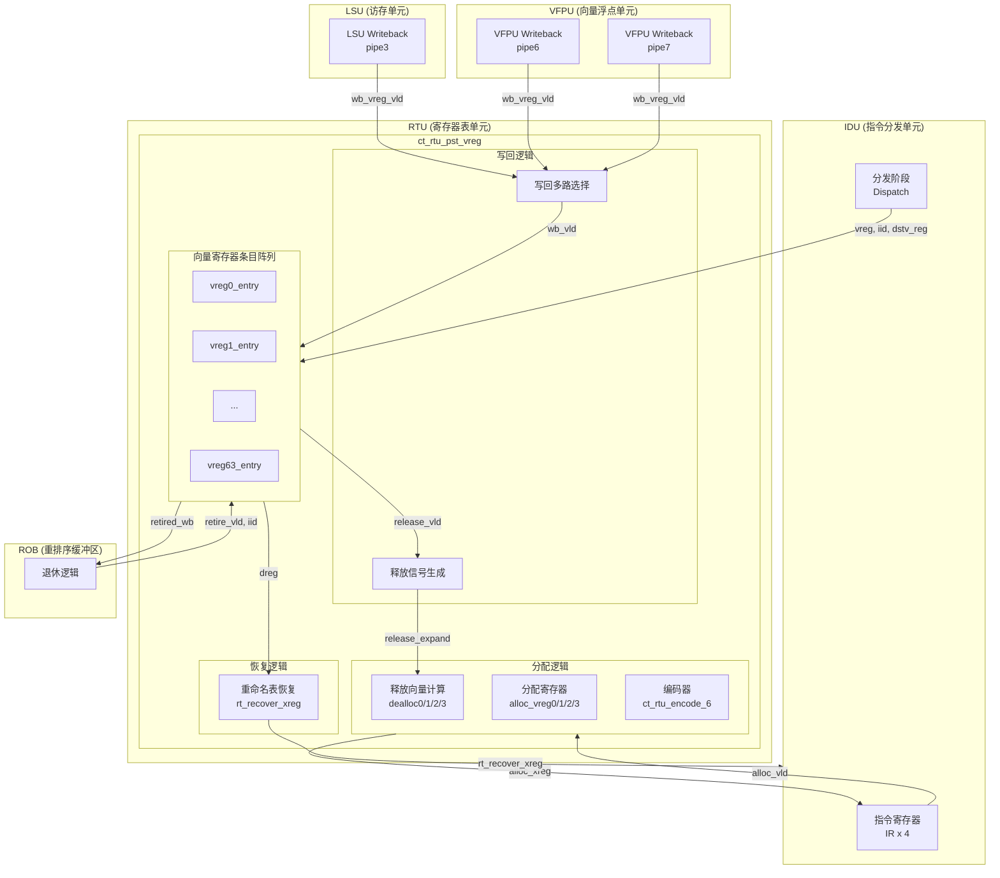
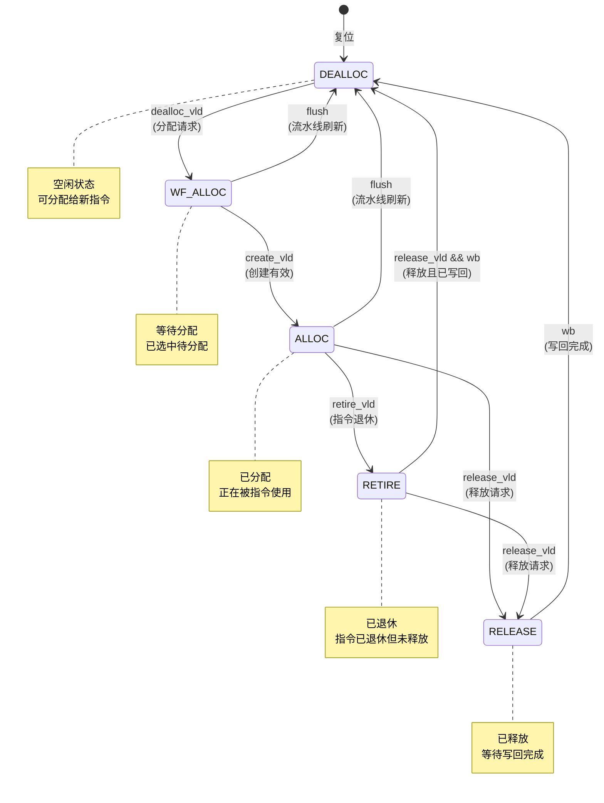
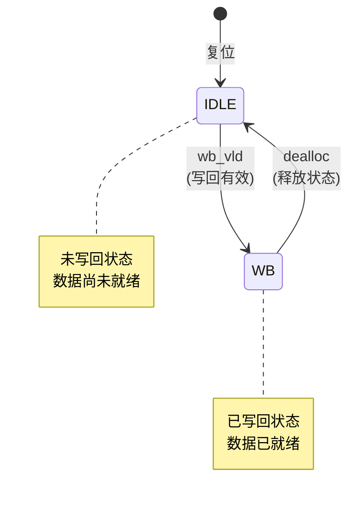

# RTU 向量寄存器状态表（PST VREG）模块设计方案

## 文档信息
- **模块名称**: ct_rtu_pst_vreg (Physical Status Table for Vector Registers)
- **创建日期**: 2026-04-01
- **文档版本**: v1.0
- **作者**: IC设计专家

---

## 1. 模块概述

### 1.1 功能描述

RTU（Register Table Unit）向量寄存器状态表模块是 C910 处理器中用于管理向量寄存器重命名的关键模块。该模块实现了以下核心功能：

1. **向量寄存器分配管理**: 支持 4 路并行分配，为发射阶段的指令提供空闲向量寄存器
2. **生命周期状态跟踪**: 跟踪每个向量寄存器的完整生命周期（DEALLOC -> WF_ALLOC -> ALLOC -> RETIRE -> RELEASE -> DEALLOC）
3. **写回状态管理**: 跟踪向量寄存器的写回状态，支持快速退休指令写回检测
4. **重命名表恢复**: 支持异常/中断后的重命名表恢复
5. **多端口写回支持**: 支持 LSU 和 VFPU 的写回端口

### 1.2 模块层次结构

```
ct_rtu_pst_vreg (顶层模块)
├── ct_rtu_pst_vreg_entry x 64 (向量寄存器条目)
│   ├── gated_clk_cell (状态机时钟门控)
│   ├── gated_clk_cell (分配时钟门控)
│   ├── ct_rtu_expand_64 (释放向量扩展)
│   └── ct_rtu_expand_32 (目标寄存器扩展)
├── ct_rtu_encode_6 (独热编码转二进制) x 4
└── gated_clk_cell (分配寄存器时钟门控)
```

### 1.3 关键特性

| 特性 | 描述 |
|------|------|
| 向量寄存器数量 | 64 个（vreg0 - vreg63） |
| 并行分配能力 | 4 路 |
| 退休带宽 | 3 条指令/周期 |
| 写回端口 | 3 个（LSU pipe3, VFPU pipe6, VFPU pipe7） |
| 状态机类型 | 生命周期状态机 + 写回状态机 |

---

## 2. 模块框图

### 2.1 顶层模块架构



### 2.2 向量寄存器条目状态机



### 2.3 写回状态机



---

## 3. 接口说明

### 3.1 ct_rtu_pst_vreg 顶层模块接口

#### 3.1.1 输入信号

| 信号名 | 位宽 | 来源 | 描述 |
|--------|------|------|------|
| `cp0_rtu_icg_en` | 1 | CP0 | 模块级时钟门控使能 |
| `cp0_yy_clk_en` | 1 | CP0 | 全局时钟使能 |
| `cpurst_b` | 1 | TOP | 系统复位信号（低有效） |
| `forever_cpuclk` | 1 | TOP | CPU 主时钟 |
| `ifu_xx_sync_reset` | 1 | IFU | 同步复位信号 |
| `rtu_yy_xx_flush` | 1 | RTU | 流水线刷新信号 |
| `retire_pst_async_flush` | 1 | RETIRE | 异步刷新信号 |

#### 3.1.2 IDU 分配接口

| 信号名 | 位宽 | 方向 | 描述 |
|--------|------|------|------|
| `idu_rtu_ir_xreg0_alloc_vld` | 1 | I | IR0 分配请求有效 |
| `idu_rtu_ir_xreg1_alloc_vld` | 1 | I | IR1 分配请求有效 |
| `idu_rtu_ir_xreg2_alloc_vld` | 1 | I | IR2 分配请求有效 |
| `idu_rtu_ir_xreg3_alloc_vld` | 1 | I | IR3 分配请求有效 |
| `idu_rtu_ir_xreg_alloc_gateclk_vld` | 1 | I | 分配门控时钟有效 |
| `rtu_idu_alloc_xreg0` | 6 | O | 分配给 IR0 的向量寄存器号 |
| `rtu_idu_alloc_xreg0_vld` | 1 | O | IR0 分配有效 |
| `rtu_idu_alloc_xreg1` | 6 | O | 分配给 IR1 的向量寄存器号 |
| `rtu_idu_alloc_xreg1_vld` | 1 | O | IR1 分配有效 |
| `rtu_idu_alloc_xreg2` | 6 | O | 分配给 IR2 的向量寄存器号 |
| `rtu_idu_alloc_xreg2_vld` | 1 | O | IR2 分配有效 |
| `rtu_idu_alloc_xreg3` | 6 | O | 分配给 IR3 的向量寄存器号 |
| `rtu_idu_alloc_xreg3_vld` | 1 | O | IR3 分配有效 |

#### 3.1.3 IDU 分发接口

| 信号名 | 位宽 | 方向 | 描述 |
|--------|------|------|------|
| `idu_rtu_pst_dis_inst0_vreg` | 6 | I | 指令0 目标向量寄存器号 |
| `idu_rtu_pst_dis_inst0_vreg_iid` | 7 | I | 指令0 实例ID |
| `idu_rtu_pst_dis_inst0_dstv_reg` | 5 | I | 指令0 目标向量寄存器（架构寄存器号） |
| `idu_rtu_pst_dis_inst0_rel_vreg` | 6 | I | 指令0 释放的旧向量寄存器 |
| `idu_rtu_pst_dis_inst0_xreg_vld` | 1 | I | 指令0 向量寄存器有效 |
| `idu_rtu_pst_dis_inst1_vreg` | 6 | I | 指令1 目标向量寄存器号 |
| `idu_rtu_pst_dis_inst1_vreg_iid` | 7 | I | 指令1 实例ID |
| `idu_rtu_pst_dis_inst1_dstv_reg` | 5 | I | 指令1 目标向量寄存器（架构寄存器号） |
| `idu_rtu_pst_dis_inst1_rel_vreg` | 6 | I | 指令1 释放的旧向量寄存器 |
| `idu_rtu_pst_dis_inst1_xreg_vld` | 1 | I | 指令1 向量寄存器有效 |
| `idu_rtu_pst_dis_inst2_vreg` | 6 | I | 指令2 目标向量寄存器号 |
| `idu_rtu_pst_dis_inst2_vreg_iid` | 7 | I | 指令2 实例ID |
| `idu_rtu_pst_dis_inst2_dstv_reg` | 5 | I | 指令2 目标向量寄存器（架构寄存器号） |
| `idu_rtu_pst_dis_inst2_rel_vreg` | 6 | I | 指令2 释放的旧向量寄存器 |
| `idu_rtu_pst_dis_inst2_xreg_vld` | 1 | I | 指令2 向量寄存器有效 |
| `idu_rtu_pst_dis_inst3_vreg` | 6 | I | 指令3 目标向量寄存器号 |
| `idu_rtu_pst_dis_inst3_vreg_iid` | 7 | I | 指令3 实例ID |
| `idu_rtu_pst_dis_inst3_dstv_reg` | 5 | I | 指令3 目标向量寄存器（架构寄存器号） |
| `idu_rtu_pst_dis_inst3_rel_vreg` | 6 | I | 指令3 释放的旧向量寄存器 |
| `idu_rtu_pst_dis_inst3_xreg_vld` | 1 | I | 指令3 向量寄存器有效 |
| `idu_rtu_pst_xreg_dealloc_mask` | 64 | I | 向量寄存器释放掩码 |

#### 3.1.4 ROB 退休接口

| 信号名 | 位宽 | 方向 | 描述 |
|--------|------|------|------|
| `rob_pst_retire_inst0_gateclk_vld` | 1 | I | 指令0 退休门控时钟有效 |
| `rob_pst_retire_inst0_iid_updt_val` | 7 | I | 指令0 退休 IID 更新值 |
| `retire_pst_wb_retire_inst0_vreg_vld` | 1 | I | 指令0 退休向量寄存器有效 |
| `rob_pst_retire_inst1_gateclk_vld` | 1 | I | 指令1 退休门控时钟有效 |
| `rob_pst_retire_inst1_iid_updt_val` | 7 | I | 指令1 退休 IID 更新值 |
| `retire_pst_wb_retire_inst1_vreg_vld` | 1 | I | 指令1 退休向量寄存器有效 |
| `rob_pst_retire_inst2_gateclk_vld` | 1 | I | 指令2 退休门控时钟有效 |
| `rob_pst_retire_inst2_iid_updt_val` | 7 | I | 指令2 退休 IID 更新值 |
| `retire_pst_wb_retire_inst2_vreg_vld` | 1 | I | 指令2 退休向量寄存器有效 |

#### 3.1.5 写回接口

| 信号名 | 位宽 | 方向 | 描述 |
|--------|------|------|------|
| `lsu_rtu_wb_pipe3_wb_vreg_vld` | 1 | I | LSU pipe3 写回有效 |
| `lsu_rtu_wb_pipe3_wb_vreg_expand` | 64 | I | LSU pipe3 写回向量寄存器扩展 |
| `vfpu_rtu_ex5_pipe6_wb_vreg_vld` | 1 | I | VFPU pipe6 写回有效 |
| `vfpu_rtu_ex5_pipe6_wb_vreg_expand` | 64 | I | VFPU pipe6 写回向量寄存器扩展 |
| `vfpu_rtu_ex5_pipe7_wb_vreg_vld` | 1 | I | VFPU pipe7 写回有效 |
| `vfpu_rtu_ex5_pipe7_wb_vreg_expand` | 64 | I | VFPU pipe7 写回向量寄存器扩展 |

#### 3.1.6 输出信号

| 信号名 | 位宽 | 目的地 | 描述 |
|--------|------|--------|------|
| `pst_retired_xreg_wb` | 1 | RETIRE | 所有退休向量寄存器已写回标志 |
| `rtu_idu_rt_recover_xreg` | 192 | IDU | 重命名表恢复数据（32 x 6位） |

---

## 4. 关键逻辑说明

### 4.1 向量寄存器分配机制

#### 4.1.1 分配优先级策略

模块采用 4 路并行分配机制，每路分配采用不同的优先级策略以避免冲突：

| 分配端口 | 优先级方向 | 描述 |
|----------|------------|------|
| dealloc0 | 从低到高 (vreg0 -> vreg63) | 优先分配编号较小的寄存器 |
| dealloc1 | 从高到低 (vreg63 -> vreg0) | 优先分配编号较大的寄存器 |
| dealloc2 | 从低到高 (排除 dealloc0) | 在 dealloc0 基础上分配次优寄存器 |
| dealloc3 | 从高到低 (排除 dealloc1) | 在 dealloc1 基础上分配次优寄存器 |

#### 4.1.2 分配逻辑代码示例

```verilog
// 一热编码的 dealloc0 向量计算
// 搜索优先级从 p0 到 p63
assign dealloc0[0]  = dealloc[0];
assign dealloc0[1]  = dealloc[1]  && !dealloc[0];
assign dealloc0[2]  = dealloc[2]  && !(|dealloc[1:0]);
// ... 依此类推
assign dealloc0[63] = dealloc[63] && !(|dealloc[62:0]);

// 一热编码的 dealloc1 向量计算
// 搜索优先级从 p63 到 p0
assign dealloc1[63] = dealloc[63];
assign dealloc1[62] = dealloc[62] && !dealloc[63];
// ... 依此类推
```

### 4.2 生命周期状态机详解

#### 4.2.1 状态编码

| 状态 | 编码 | 描述 |
|------|------|------|
| DEALLOC | 5'b00001 | 空闲状态，可分配 |
| WF_ALLOC | 5'b00010 | 等待分配确认 |
| ALLOC | 5'b00100 | 已分配，正在使用 |
| RETIRE | 5'b01000 | 指令已退休 |
| RELEASE | 5'b10000 | 已释放，等待写回 |

#### 4.2.2 状态转移条件

```verilog
// 状态转移逻辑
case(lifecycle_cur_state)
    DEALLOC: 
        if (x_dealloc_vld && !rtu_yy_xx_flush)
            next_state = WF_ALLOC;
        else
            next_state = DEALLOC;
            
    WF_ALLOC:
        if (rtu_yy_xx_flush)
            next_state = DEALLOC;
        else if (create_vld)
            next_state = ALLOC;
        else
            next_state = WF_ALLOC;
            
    ALLOC:
        if (rtu_yy_xx_flush)
            next_state = DEALLOC;
        else if (x_release_vld && wb_cur_state_wb_masked)
            next_state = DEALLOC;  // 快速路径：释放且已写回
        else if (x_release_vld)
            next_state = RELEASE;
        else if (retire_vld)
            next_state = RETIRE;
        else
            next_state = ALLOC;
            
    RETIRE:
        if (x_release_vld && wb_cur_state_wb_masked)
            next_state = DEALLOC;
        else if (x_release_vld)
            next_state = RELEASE;
        else
            next_state = RETIRE;
            
    RELEASE:
        if (wb_cur_state_wb_masked)
            next_state = DEALLOC;
        else
            next_state = RELEASE;
            
    default:
        next_state = DEALLOC;
endcase
```

### 4.3 写回状态管理

#### 4.3.1 写回状态机

写回状态机是一个简单的二状态机：

- **IDLE**: 数据未写回，寄存器内容无效
- **WB**: 数据已写回，寄存器内容有效

#### 4.3.2 快速退休检测

```verilog
// 快速退休指令写回检测
// 用于 FLUSH 状态机在退休周期使用
assign x_retired_released_wb = 
    (lifecycle_cur_state_alloc && retire_vld) ||
    lifecycle_cur_state_retire ||
    lifecycle_cur_state_release
    ? wb_cur_state_wb : 1'b1;
```

### 4.4 重命名表恢复机制

#### 4.4.1 恢复数据结构

恢复数据为 192 位，对应 32 个架构向量寄存器的物理映射：

```
rtu_idu_rt_recover_xreg[191:0] = {
    r31_vreg[5:0],  // 架构寄存器 31 的物理映射
    r30_vreg[5:0],  // 架构寄存器 30 的物理映射
    ...
    r1_vreg[5:0],   // 架构寄存器 1 的物理映射
    r0_vreg[5:0]    // 架构寄存器 0 的物理映射
}
```

#### 4.4.2 转置逻辑

PST 按物理寄存器索引，而重命名表按架构寄存器索引，需要进行转置：

```verilog
// 将 vreg 索引的映射转换为 reg 索引的映射
assign r0_vreg_expand[63:0] = {
    vreg63_dreg[0], vreg62_dreg[0], ..., vreg0_dreg[0]
};
// 通过编码器提取对应的物理寄存器号
```

---

## 5. 子模块说明

### 5.1 ct_rtu_pst_vreg_entry

#### 5.1.1 功能描述

单个向量寄存器条目模块，管理一个物理向量寄存器的状态信息。

#### 5.1.2 存储信息

| 寄存器 | 位宽 | 描述 |
|--------|------|------|
| `iid` | 7 | 指令实例ID |
| `dstv_reg` | 5 | 目标架构向量寄存器号 |
| `rel_vreg` | 6 | 释放的旧物理向量寄存器号 |
| `lifecycle_cur_state` | 5 | 生命周期状态 |
| `wb_cur_state` | 1 | 写回状态 |
| `retire_inst0/1/2_iid_match` | 1 | IID 匹配寄存器（时序优化） |

#### 5.1.3 接口信号

| 信号名 | 位宽 | 方向 | 描述 |
|--------|------|------|------|
| `x_create_vld` | 4 | I | 创建有效向量（支持 4 路创建） |
| `x_cur_state_dealloc` | 1 | O | 当前处于 DEALLOC 状态 |
| `x_cur_state_alloc_release` | 1 | O | 当前处于 ALLOC 或 RELEASE 状态 |
| `x_dealloc_vld` | 1 | I | 释放有效信号 |
| `x_dealloc_mask` | 1 | I | 释放掩码 |
| `x_release_vld` | 1 | I | 释放请求有效 |
| `x_wb_vld` | 1 | I | 写回有效 |
| `x_dreg` | 32 | O | 目标寄存器扩展（用于恢复） |
| `x_rel_vreg_expand` | 64 | O | 释放向量寄存器扩展 |
| `x_retired_released_wb` | 1 | O | 退休/释放状态下的写回标志 |

### 5.2 ct_rtu_encode_8

#### 5.2.1 功能描述

8 位独热编码转 3 位二进制编码器。

#### 5.2.2 接口信号

| 信号名 | 位宽 | 方向 | 描述 |
|--------|------|------|------|
| `x_num_expand` | 8 | I | 8 位独热编码输入 |
| `x_num` | 3 | O | 3 位二进制编码输出 |

#### 5.2.3 编码逻辑

```verilog
assign x_num[2:0] =
    {3{x_num_expand[0]}} & 3'd0 |
    {3{x_num_expand[1]}} & 3'd1 |
    {3{x_num_expand[2]}} & 3'd2 |
    {3{x_num_expand[3]}} & 3'd3 |
    {3{x_num_expand[4]}} & 3'd4 |
    {3{x_num_expand[5]}} & 3'd5 |
    {3{x_num_expand[6]}} & 3'd6 |
    {3{x_num_expand[7]}} & 3'd7;
```

### 5.3 ct_rtu_encode_32

#### 5.3.1 功能描述

32 位独热编码转 5 位二进制编码器。

#### 5.3.2 接口信号

| 信号名 | 位宽 | 方向 | 描述 |
|--------|------|------|------|
| `x_num_expand` | 32 | I | 32 位独热编码输入 |
| `x_num` | 5 | O | 5 位二进制编码输出 |

### 5.4 ct_rtu_pst_vreg_dummy

#### 5.4.1 功能描述

空模块，用于替代实际模块进行仿真或测试。所有输出信号固定为常量值。

#### 5.4.2 输出值

| 信号名 | 输出值 |
|--------|--------|
| `pst_retired_xreg_wb` | 1'b1 |
| `rtu_idu_alloc_xreg0/1/2/3` | 6'b0 |
| `rtu_idu_alloc_xreg0/1/2/3_vld` | 1'b0 |
| `rtu_idu_rt_recover_xreg` | 192'b0 |

---

## 6. 时序与优化

### 6.1 时钟门控策略

模块采用细粒度时钟门控以降低功耗：

1. **状态机时钟 (sm_clk)**: 仅在状态变化时使能
2. **分配时钟 (alloc_clk)**: 仅在分配操作时使能
3. **分配寄存器时钟 (alloc_vreg_clk)**: 仅在分配寄存器更新时使能

### 6.2 时序优化技术

#### 6.2.1 IID 匹配预计算

为避免在退休阶段进行 IID 比较，模块提前计算匹配结果：

```verilog
// 在退休前一周期预计算 IID 匹配
assign retire_inst0_iid_match_updt_val =
    lifecycle_cur_state_alloc &&
    (iid[6:0] == rob_pst_retire_inst0_iid_updt_val[6:0]);

// 使用寄存器存储匹配结果
always @(posedge sm_clk or negedge cpurst_b) begin
    if (!cpurst_b)
        retire_inst0_iid_match <= 1'b0;
    else if (rob_pst_retire_inst0_gateclk_vld)
        retire_inst0_iid_match <= retire_inst0_iid_match_updt_val;
end
```

#### 6.2.2 快速释放路径

当释放请求到来时，如果数据已经写回，可以直接从 ALLOC 或 RETIRE 状态转移到 DEALLOC 状态，跳过 RELEASE 状态：

```verilog
ALLOC:
    if (x_release_vld && wb_cur_state_wb_masked)
        next_state = DEALLOC;  // 快速路径
```

---

## 7. 设计约束

### 7.1 时序约束

| 路径 | 约束 | 描述 |
|------|------|------|
| 分配路径 | 单周期 | 从 dealloc 检测到分配输出 |
| 退休路径 | 单周期 | IID 匹配到状态更新 |
| 写回路径 | 单周期 | 写回信号到状态更新 |

### 7.2 面积约束

- 64 个向量寄存器条目
- 每个条目约 30 个寄存器位
- 总计约 1920 位寄存器

### 7.3 功耗约束

- 采用细粒度时钟门控
- 空闲条目不切换时钟
- 仅活跃条目消耗动态功耗

---

## 8. 验证要点

### 8.1 功能验证

1. **分配正确性**: 验证 4 路并行分配的正确性和优先级
2. **状态转移**: 验证所有状态转移路径
3. **写回管理**: 验证多端口写回的正确性
4. **恢复机制**: 验证重命名表恢复的正确性

### 8.2 边界条件

1. **满载分配**: 所有 64 个寄存器都被分配
2. **空载释放**: 没有可分配的寄存器
3. **并发冲突**: 多个端口同时访问同一寄存器
4. **刷新恢复**: 流水线刷新后的状态恢复

### 8.3 覆盖率目标

| 覆盖类型 | 目标 |
|----------|------|
| 代码覆盖率 | >= 95% |
| 功能覆盖率 | 100% |
| 状态机覆盖率 | 100% |
| 转移覆盖率 | 100% |

---

## 9. 修订历史

| 版本 | 日期 | 作者 | 描述 |
|------|------|------|------|
| v1.0 | 2026-04-01 | IC设计专家 | 初始版本 |

---

## 10. 参考资料

1. C910 处理器架构手册
2. RISC-V 向量扩展规范
3. Verilog RTL 编码规范
