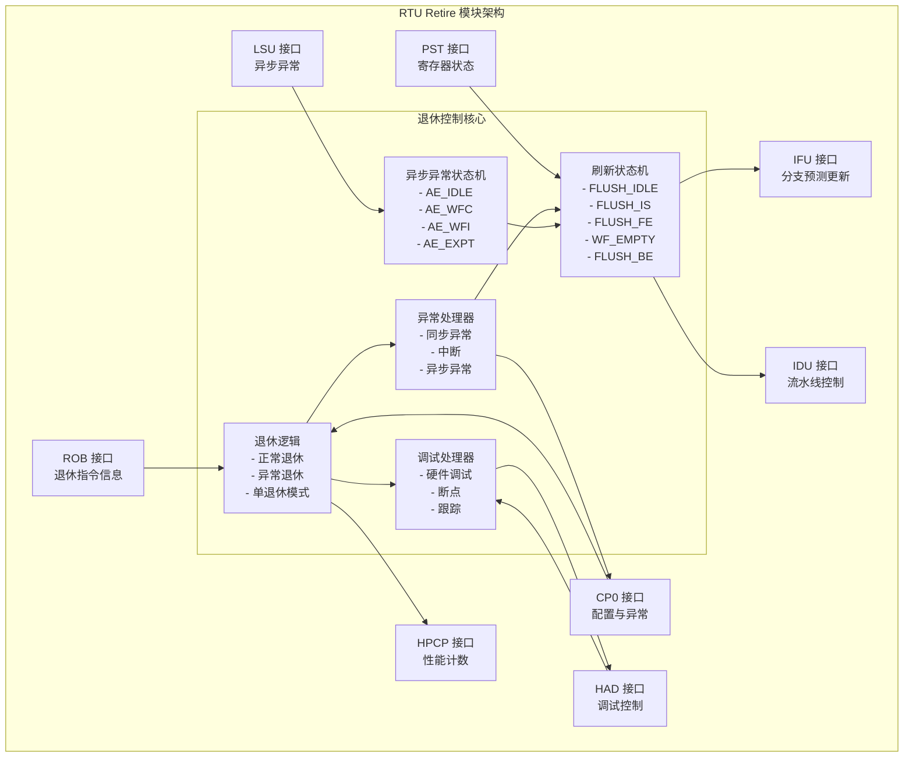
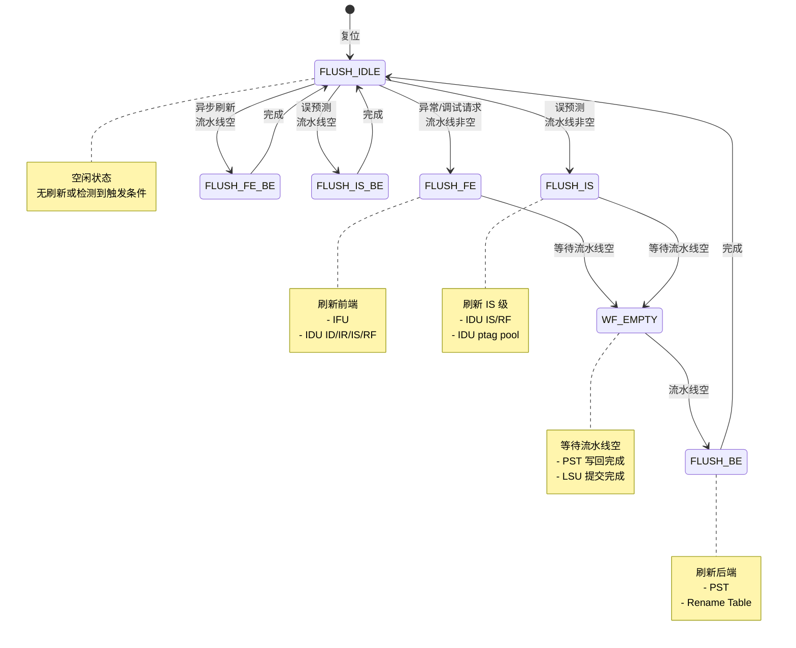
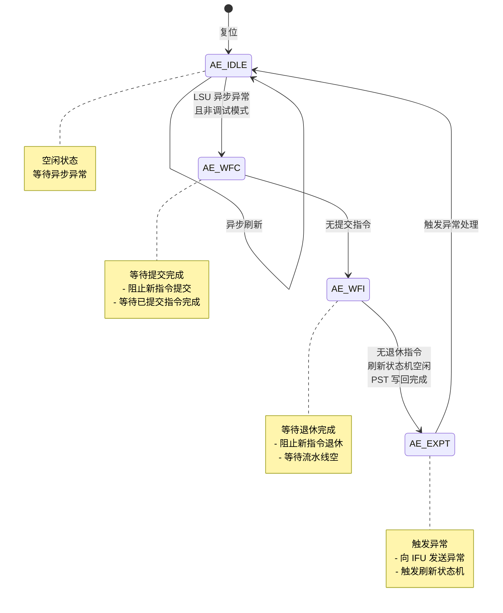

# RTU Retire 模块详细设计文档

## 文档信息
- **模块名称**: ct_rtu_retire
- **文档版本**: v1.0
- **生成日期**: 2026-04-01
- **作者**: IC 设计专家
- **文件路径**: [ct_rtu_retire.v](file:///d:/code/openc910/C910_RTL_FACTORY/gen_rtl/rtu/rtl/ct_rtu_retire.v)

---

## 1. 模块概述

### 1.1 功能描述
ct_rtu_retire 模块是 RTU (Retire Unit) 的核心退休控制模块,负责处理指令的退休逻辑、异常处理、调试接口、刷新控制以及异步异常管理。该模块实现了以下关键功能:

1. **指令退休控制**: 支持每周期最多 3 条指令的退休,处理正常退休和异常退休
2. **异常和中断处理**: 管理同步异常、异步异常和中断的优先级和处理流程
3. **调试支持**: 支持硬件调试请求、断点、跟踪调试等多种调试模式
4. **刷新控制**: 实现多级流水线刷新状态机,处理异常刷新、误预测刷新等场景
5. **异步异常管理**: 处理 LSU 产生的异步异常,确保提交指令的正确性
6. **性能监控**: 提供指令退休信息给 HPCP (Hardware Performance Counter) 模块

### 1.2 架构特点
- **多发射退休**: 支持 3 条指令同时退休,提高处理器吞吐量
- **单退休模式**: 支持调试模式下的单指令退休,便于调试
- **精确异常**: 确保异常发生在精确的指令位置,维护处理器状态一致性
- **低功耗设计**: 采用门控时钟技术,降低动态功耗

---

## 2. 接口说明

### 2.1 输入端口

#### 2.1.1 时钟和复位
| 端口名称 | 位宽 | 描述 |
|---------|------|------|
| forever_cpuclk | 1 | 永久 CPU 时钟 |
| cpurst_b | 1 | 系统复位信号(低有效) |
| cp0_yy_clk_en | 1 | 全局时钟使能 |
| cp0_rtu_icg_en | 1 | RTU 模块门控时钟使能 |
| pad_yy_icg_scan_en | 1 | 扫描测试使能 |

#### 2.1.2 ROB 接口
| 端口名称 | 位宽 | 描述 |
|---------|------|------|
| rob_retire_commit0/1/2 | 1 | ROB 提交指令 0/1/2 有效信号 |
| rob_retire_inst0_vld | 1 | ROB 退休指令 0 有效 |
| rob_retire_inst1_vld | 1 | ROB 退休指令 1 有效 |
| rob_retire_inst2_vld | 1 | ROB 退休指令 2 有效 |
| rob_retire_inst0_iid | 7 | 指令 0 的 IID (Instruction ID) |
| rob_retire_inst0_cur_pc | 39 | 指令 0 当前 PC |
| rob_retire_inst0_next_pc | 39 | 指令 0 下一条 PC |
| rob_retire_inst0_expt_vld | 1 | 指令 0 异常有效 |
| rob_retire_inst0_expt_vec | 4 | 指令 0 异常向量 |
| rob_retire_inst0_int_vld | 1 | 指令 0 中断有效 |
| rob_retire_inst0_int_vec | 5 | 指令 0 中断向量 |

#### 2.1.3 调试接口
| 端口名称 | 位宽 | 描述 |
|---------|------|------|
| had_rtu_hw_dbgreq | 1 | 硬件调试请求 |
| had_rtu_dbg_req_en | 1 | 调试请求使能 |
| had_rtu_dbg_disable | 1 | 调试禁用 |
| had_rtu_event_dbgreq | 1 | 事件触发调试请求 |
| had_rtu_trace_dbgreq | 1 | 跟踪调试请求 |
| had_rtu_xx_jdbreq | 1 | JTAG 调试请求 |
| had_yy_xx_exit_dbg | 1 | 退出调试模式 |
| rob_retire_inst0_bkpt | 1 | 指令 0 断点 |
| rob_retire_inst0_inst_bkpt | 1 | 指令断点 |
| rob_retire_inst0_data_bkpt | 1 | 数据断点 |

#### 2.1.4 LSU 接口
| 端口名称 | 位宽 | 描述 |
|---------|------|------|
| lsu_rtu_async_expt_vld | 1 | LSU 异步异常有效 |
| lsu_rtu_async_expt_addr | 40 | LSU 异步异常地址 |
| lsu_rtu_all_commit_data_vld | 1 | LSU 所有提交数据有效 |
| lsu_rtu_ctc_flush_vld | 1 | LSU CTC (Cache Timing Check) 刷新请求 |

#### 2.1.5 CP0 接口
| 端口名称 | 位宽 | 描述 |
|---------|------|------|
| cp0_rtu_srt_en | 1 | 单退休模式使能 |
| mmu_xx_mmu_en | 1 | MMU 使能 |

#### 2.1.6 PST 接口
| 端口名称 | 位宽 | 描述 |
|---------|------|------|
| pst_retire_retired_reg_wb | 1 | PST 已退休寄存器写回完成 |
| rob_retire_inst0_pst_preg_vld | 1 | 指令 0 物理寄存器有效 |
| rob_retire_inst0_pst_vreg_vld | 1 | 指令 0 向量寄存器有效 |
| rob_retire_inst0_pst_ereg_vld | 1 | 指令 0 增强寄存器有效 |

### 2.2 输出端口

#### 2.2.1 ROB 控制接口
| 端口名称 | 位宽 | 描述 |
|---------|------|------|
| retire_rob_flush | 1 | ROB 刷新请求 |
| retire_rob_flush_cur_state | 5 | 刷新状态机当前状态 |
| retire_rob_flush_gateclk | 1 | 刷新门控时钟 |
| retire_rob_srt_en | 1 | 单退休模式使能 |
| retire_rob_retire_empty | 1 | 退休队列为空 |
| retire_rob_rt_mask | 1 | 退休掩码 |

#### 2.2.2 IFU 接口
| 端口名称 | 位宽 | 描述 |
|---------|------|------|
| rtu_ifu_flush | 1 | IFU 刷新 |
| rtu_ifu_chgflw_vld | 1 | IFU 改变流有效 |
| rtu_ifu_chgflw_pc | 39 | IFU 改变流 PC |
| rtu_ifu_xx_expt_vld | 1 | IFU 异常有效 |
| rtu_ifu_xx_expt_vec | 6 | IFU 异常向量 |

#### 2.2.3 IDU 接口
| 端口名称 | 位宽 | 描述 |
|---------|------|------|
| rtu_idu_flush_fe | 1 | IDU 前端刷新 |
| rtu_idu_flush_is | 1 | IDU IS 级刷新 |
| rtu_idu_flush_stall | 1 | IDU 刷新停顿 |
| rtu_idu_retire0_inst_vld | 1 | IDU 退休指令 0 有效 |
| rtu_idu_srt_en | 1 | IDU 单退休模式使能 |

#### 2.2.4 CP0 接口
| 端口名称 | 位宽 | 描述 |
|---------|------|------|
| rtu_cp0_expt_vld | 1 | CP0 异常有效 |
| rtu_cp0_expt_vec | 6 | CP0 异常向量 |
| rtu_cp0_expt_mtval | 64 | CP0 异常 MTVAL 值 |
| rtu_cp0_epc | 64 | CP0 异常 PC |
| rtu_cp0_int_ack | 1 | CP0 中断确认 |

#### 2.2.5 LSU 接口
| 端口名称 | 位宽 | 描述 |
|---------|------|------|
| rtu_lsu_async_flush | 1 | LSU 异步刷新 |
| rtu_lsu_expt_flush | 1 | LSU 异常刷新 |
| rtu_lsu_eret_flush | 1 | LSU ERET 刷新 |
| rtu_lsu_spec_fail_flush | 1 | LSU Speculative Fail 刷新 |

#### 2.2.6 HAD 接口
| 端口名称 | 位宽 | 描述 |
|---------|------|------|
| rtu_had_dbgreq_ack | 1 | HAD 调试请求确认 |
| rtu_had_xx_dbgon | 1 | HAD 调试模式开启 |
| rtu_had_xx_pc | 39 | HAD PC 值 |

#### 2.2.7 HPCP 接口
| 端口名称 | 位宽 | 描述 |
|---------|------|------|
| rtu_hpcp_inst0_vld | 1 | HPCP 指令 0 有效 |
| rtu_hpcp_inst0_condbr | 1 | HPCP 指令 0 条件分支 |
| rtu_hpcp_inst0_jmp | 1 | HPCP 指令 0 跳转 |
| rtu_hpcp_inst0_bht_mispred | 1 | HPCP 指令 0 BHT 误预测 |

---

## 3. 模块框图

### 3.1 顶层架构图



### 3.2 刷新状态机



### 3.3 异步异常状态机



---

## 4. 关键逻辑说明

### 4.1 退休逻辑

#### 4.1.1 正常退休
- **退休条件**:
  - ROB 提交指令有效 (`rob_retire_commit0/1/2`)
  - 无异常或调试请求
  - PST 寄存器写回完成

- **退休流程**:
  1. ROB 发送退休指令信息
  2. RTU 验证指令有效性
  3. 更新架构状态(寄存器、PC)
  4. 通知 IFU 分支预测更新
  5. 通知 HPCP 性能计数

#### 4.1.2 异常退休
- **异常类型**:
  - 同步异常: 指令执行过程中检测到的异常
  - 中断: 外部中断请求
  - 异步异常: LSU 访问异常

- **异常优先级**:
  1. 中断 (最高优先级)
  2. 同步异常
  3. 异步异常 (最低优先级)

- **异常处理流程**:
  1. 检测异常有效 (`retire_expt_vld`)
  2. 计算异常向量 (`retire_expt_vec`)
  3. 准备异常信息 (EPC, MTVAL)
  4. 触发刷新状态机
  5. 通知 CP0 和 IFU

#### 4.1.3 单退休模式
- **触发条件**:
  - 调试模式开启 (`had_rtu_dbg_req_en`)
  - CP0 配置单退休 (`cp0_rtu_srt_en`)
  - HAD 禁止 pop1 (`had_rtu_pop1_disa`)
  - Speculative Fail (`rob_retire_split_spec_fail_srt`)
  - CTC Flush (`rob_retire_ctc_flush_srt_en`)

- **行为**:
  - 每周期只退休一条指令
  - 简化调试和异常处理逻辑

### 4.2 刷新控制

#### 4.2.1 刷新状态机设计
刷新状态机采用 5 状态设计,支持前端刷新、后端刷新和组合刷新:

| 状态 | 编码 | 描述 |
|------|------|------|
| FLUSH_IDLE | 5'b00001 | 空闲状态 |
| FLUSH_IS | 5'b00010 | 刷新 IS 级 |
| FLUSH_FE | 5'b00100 | 刷新前端 |
| WF_EMPTY | 5'b01000 | 等待流水线空 |
| FLUSH_BE | 5'b10000 | 刷新后端 |
| FLUSH_IS_BE | 5'b10010 | IS 和后端刷新 |
| FLUSH_FE_BE | 5'b10100 | 前端和后端刷新 |

#### 4.2.2 刷新触发条件
- **异常刷新**: 异常或中断触发,需要刷新前端和后端
- **误预测刷新**: 分支预测错误,只需刷新前端
- **异步刷新**: LSU 异步异常或调试请求,强制刷新前端和后端

#### 4.2.3 流水线空判断
刷新状态机需要等待流水线空才能进入后端刷新状态:
```verilog
assign retire_flush_pipeline_empty = pst_retire_retired_reg_wb
                                     && lsu_rtu_all_commit_data_vld;
```

### 4.3 调试支持

#### 4.3.1 调试请求类型
- **硬件调试请求** (`had_rtu_hw_dbgreq`): 外部硬件触发
- **断点调试** (`rob_retire_inst0_bkpt`): 软件断点
- **指令断点** (`rob_retire_inst0_inst_bkpt`): 指令地址断点
- **数据断点** (`rob_retire_inst0_data_bkpt`): 数据地址断点
- **跟踪调试** (`had_rtu_trace_dbgreq`): 跟踪模式调试
- **JTAG 调试** (`had_rtu_xx_jdbreq`): JTAG 接口调试

#### 4.3.2 调试模式管理
- **进入调试模式**:
  - 调试请求确认 (`dbgreq_ack`)
  - 设置调试模式标志 (`dbg_mode_on`)
  - 通知 IFU 停止取指 (`ifu_dbg_mode_on`)

- **退出调试模式**:
  - HAD 发送退出信号 (`had_yy_xx_exit_dbg`)
  - 清除调试模式标志
  - 恢复正常执行

### 4.4 异步异常处理

#### 4.4.1 异步异常状态机
异步异常状态机确保 LSU 产生的异步异常不会影响已提交指令的正确性:

| 状态 | 编码 | 描述 |
|------|------|------|
| AE_IDLE | 2'b00 | 空闲状态 |
| AE_WFC | 2'b01 | 等待提交完成 |
| AE_WFI | 2'b10 | 等待退休完成 |
| AE_EXPT | 2'b11 | 触发异常 |

#### 4.4.2 异步异常处理流程
1. **检测异步异常**: LSU 发送异步异常有效信号
2. **阻止新提交**: 设置 `retire_rob_async_expt_commit_mask`
3. **等待提交完成**: 等待所有已提交指令完成
4. **阻止新退休**: 设置 `retire_rob_rt_mask`
5. **等待流水线空**: 等待 PST 写回和 LSU 提交完成
6. **触发异常**: 向 IFU 和 CP0 发送异常信号

### 4.5 性能监控

#### 4.5.1 HPCP 接口
RTU 向 HPCP 提供以下信息用于性能计数:
- 指令退休数量
- 条件分支指令
- 跳转指令
- 分支预测错误
- Store 指令
- Split 指令
- 中断确认

#### 4.5.2 性能计数器时钟门控
```verilog
assign hpcp_clk_en = hpcp_rtu_cnt_en
                     && rob_retire_inst0_vld
                     || retire_retire_hpcp_inst0_vld
                     || retire_retire_hpcp_inst1_vld
                     || retire_retire_hpcp_inst2_vld;
```

---

## 5. 内部信号列表

### 5.1 状态寄存器

| 信号名称 | 位宽 | 描述 |
|---------|------|------|
| flush_cur_state | 5 | 刷新状态机当前状态 |
| flush_next_state | 5 | 刷新状态机下一状态 |
| ae_cur_state | 2 | 异步异常状态机当前状态 |
| ae_next_state | 2 | 异步异常状态机下一状态 |
| dbg_mode_on | 1 | 调试模式开启标志 |
| ifu_dbg_mode_on | 1 | IFU 调试模式开启标志 |
| async_flush_ff | 1 | 异步刷新标志寄存器 |
| flush_expt | 1 | 刷新异常标志 |
| flush_eret | 1 | 刷新 ERET 标志 |
| flush_spec_fail | 1 | 刷新 Speculative Fail 标志 |
| spec_fail_iid | 7 | Speculative Fail IID |

### 5.2 关键组合逻辑信号

| 信号名称 | 位宽 | 描述 |
|---------|------|------|
| retire_inst0_normal_retire | 1 | 指令 0 正常退休 |
| retire_inst1_normal_retire | 1 | 指令 1 正常退休 |
| retire_inst2_normal_retire | 1 | 指令 2 正常退休 |
| retire_expt_vld | 1 | 退休异常有效 |
| retire_expt_vec | 6 | 退休异常向量 |
| retire_expt_mtval | 64 | 退休异常 MTVAL |
| dbgreq_ack | 1 | 调试请求确认 |
| retire_flush_is | 1 | 刷新 IS 级 |
| retire_flush_fe | 1 | 刷新前端 |
| retire_flush_be | 1 | 刷新后端 |
| retire_async_expt_vld | 1 | 异步异常有效 |

### 5.3 时钟门控信号

| 信号名称 | 描述 |
|---------|------|
| retire_clk_en | 退休时钟使能 |
| sm_clk_en | 状态机时钟使能 |
| hpcp_clk_en | HPCP 时钟使能 |

---

## 6. 参数定义

### 6.1 刷新状态机参数
```verilog
parameter FLUSH_IDLE  = 5'b00001;  // 空闲状态
parameter FLUSH_IS    = 5'b00010;  // 刷新 IS 级
parameter FLUSH_FE    = 5'b00100;  // 刷新前端
parameter WF_EMPTY    = 5'b01000;  // 等待流水线空
parameter FLUSH_IS_BE = 5'b10010;  // IS 和后端刷新
parameter FLUSH_FE_BE = 5'b10100;  // 前端和后端刷新
parameter FLUSH_BE    = 5'b10000;  // 刷新后端
```

### 6.2 异步异常状态机参数
```verilog
parameter AE_IDLE = 2'b00;  // 空闲状态
parameter AE_WFC  = 2'b01;  // 等待提交完成
parameter AE_WFI  = 2'b10;  // 等待退休完成
parameter AE_EXPT = 2'b11;  // 触发异常
```

---

## 7. 设计要点

### 7.1 时序优化
- **退休 IID 匹配**: 提前进行 IID 匹配计算,减少关键路径延迟
- **异常向量计算**: 组合逻辑计算异常向量,避免额外时钟周期
- **刷新状态机**: 采用 one-hot 编码,简化状态译码逻辑

### 7.2 低功耗设计
- **门控时钟**: 对退休逻辑、状态机和 HPCP 分别使用独立的门控时钟
- **时钟使能条件**: 仅在需要时开启时钟,降低动态功耗

### 7.3 可测试性设计
- **扫描链支持**: 所有寄存器支持扫描测试
- **同步复位**: 支持同步复位功能 (`ifu_xx_sync_reset`)

### 7.4 调试支持
- **多调试模式**: 支持硬件调试、软件断点、指令/数据断点等多种调试方式
- **精确调试**: 确保调试发生在精确的指令位置

---

## 8. 注意事项

### 8.1 异常处理
- 异常和中断只能发生在退休指令 0
- 异步异常需要等待所有已提交指令完成
- 调试请求会屏蔽异常处理

### 8.2 刷新控制
- 刷新状态机需要等待流水线空才能进入后端刷新
- 异步刷新会强制刷新前端和后端
- 误预测刷新只需刷新前端

### 8.3 调试模式
- 进入调试模式会触发单退休模式
- 调试模式下不支持多指令退休
- JTAG 调试请求不受调试禁用信号影响

---

## 9. 版本历史

| 版本 | 日期 | 作者 | 修改描述 |
|------|------|------|---------|
| v1.0 | 2026-04-01 | IC 设计专家 | 初始版本 |

---

## 10. 参考资料
- RISC-V 特权架构规范
- T-Head C910 处理器设计规范
- IEEE 1800 SystemVerilog 标准
