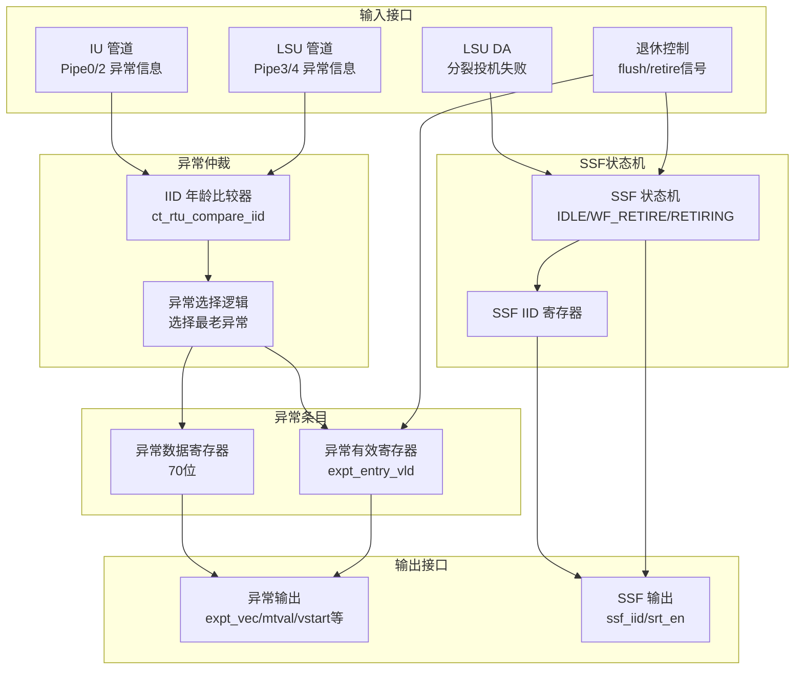
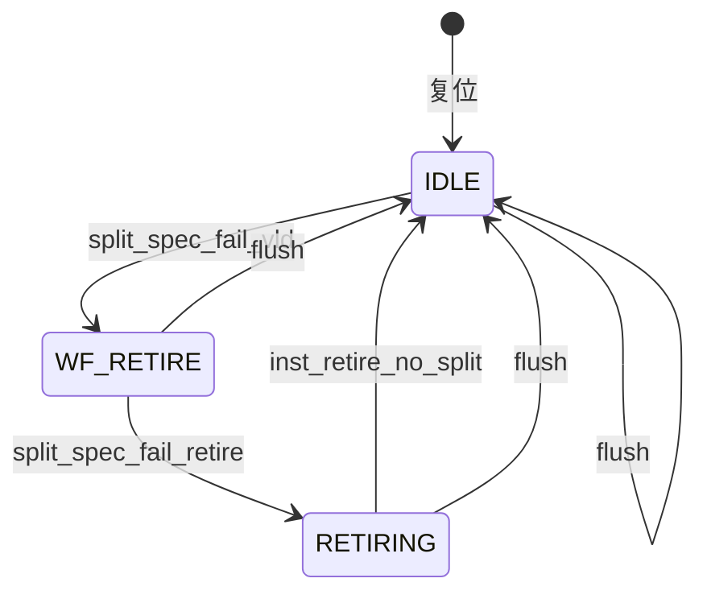

# ct_rtu_rob_expt 模块设计文档

## 1. 模块概述

### 1.1 基本信息

| 属性 | 值 |
|------|-----|
| 模块名称 | ct_rtu_rob_expt |
| 文件路径 | C910_RTL_FACTORY/gen_rtl/rtu/rtl/ct_rtu_rob_expt.v |
| 功能描述 | ROB 异常处理模块，管理异常指令的完成顺序和异常信息 |
| 设计特点 | 异常优先级仲裁、分裂指令投机失败处理、异常信息缓存 |

### 1.2 功能描述

ct_rtu_rob_expt 模块负责处理所有执行管道报告的异常，主要功能包括：

- **异常完成顺序管理**：确保异常按程序序（Program Order）处理
- **异常信息缓存**：存储最老异常指令的完整信息
- **分裂指令投机失败处理**：管理分裂指令的投机失败状态机
- **异常类型识别**：区分异常、刷新、误预测等不同类型

### 1.3 设计特点

- **多管道异常仲裁**：支持 IU Pipe0/2 和 LSU Pipe3/4 的异常报告
- **年龄比较机制**：通过 IID 比较确定最老异常
- **状态机管理**：分裂指令投机失败采用状态机控制
- **异常信息压缩**：70 位数据格式存储完整异常信息

## 2. 模块接口说明

### 2.1 输入端口

| 信号名 | 方向 | 位宽 | 描述 |
|--------|------|------|------|
| cp0_rtu_icg_en | input | 1 | CP0 模块时钟门控使能 |
| cp0_yy_clk_en | input | 1 | CP0 全局时钟使能 |
| cpurst_b | input | 1 | 系统复位信号（低有效） |
| forever_cpuclk | input | 1 | CPU 主时钟 |
| iu_rtu_pipe0_abnormal | input | 1 | IU Pipe0 异常标志 |
| iu_rtu_pipe0_bkpt | input | 1 | IU Pipe0 断点触发 |
| iu_rtu_pipe0_cmplt | input | 1 | IU Pipe0 完成信号 |
| iu_rtu_pipe0_efpc_vld | input | 1 | IU Pipe0 EFPC 有效 |
| iu_rtu_pipe0_expt_vec | input | 5 | IU Pipe0 异常向量 |
| iu_rtu_pipe0_expt_vld | input | 1 | IU Pipe0 异常有效 |
| iu_rtu_pipe0_flush | input | 1 | IU Pipe0 刷新请求 |
| iu_rtu_pipe0_high_hw_expt | input | 1 | IU Pipe0 高优先级硬件异常 |
| iu_rtu_pipe0_iid | input | 7 | IU Pipe0 指令 ID |
| iu_rtu_pipe0_immu_expt | input | 1 | IU Pipe0 IMMU 异常 |
| iu_rtu_pipe0_mtval | input | 32 | IU Pipe0 MTVAL 值 |
| iu_rtu_pipe0_vsetvl | input | 1 | IU Pipe0 VSETVL 标志 |
| iu_rtu_pipe0_vstart | input | 7 | IU Pipe0 VSTART 值 |
| iu_rtu_pipe0_vstart_vld | input | 1 | IU Pipe0 VSTART 有效 |
| iu_rtu_pipe2_abnormal | input | 1 | IU Pipe2 异常标志 |
| iu_rtu_pipe2_bht_mispred | input | 1 | IU Pipe2 BHT 误预测 |
| iu_rtu_pipe2_cmplt | input | 1 | IU Pipe2 完成信号 |
| iu_rtu_pipe2_iid | input | 7 | IU Pipe2 指令 ID |
| iu_rtu_pipe2_jmp_mispred | input | 1 | IU Pipe2 跳转误预测 |
| lsu_rtu_da_pipe3_split_spec_fail_iid | input | 7 | LSU Pipe3 分裂投机失败 IID |
| lsu_rtu_da_pipe3_split_spec_fail_vld | input | 1 | LSU Pipe3 分裂投机失败有效 |
| lsu_rtu_da_pipe4_split_spec_fail_iid | input | 7 | LSU Pipe4 分裂投机失败 IID |
| lsu_rtu_da_pipe4_split_spec_fail_vld | input | 1 | LSU Pipe4 分裂投机失败有效 |
| lsu_rtu_wb_pipe3_abnormal | input | 1 | LSU Pipe3 异常标志 |
| lsu_rtu_wb_pipe3_cmplt | input | 1 | LSU Pipe3 完成信号 |
| lsu_rtu_wb_pipe3_expt_vec | input | 5 | LSU Pipe3 异常向量 |
| lsu_rtu_wb_pipe3_expt_vld | input | 1 | LSU Pipe3 异常有效 |
| lsu_rtu_wb_pipe3_flush | input | 1 | LSU Pipe3 刷新请求 |
| lsu_rtu_wb_pipe3_iid | input | 7 | LSU Pipe3 指令 ID |
| lsu_rtu_wb_pipe3_mtval | input | 40 | LSU Pipe3 MTVAL 值 |
| lsu_rtu_wb_pipe3_spec_fail | input | 1 | LSU Pipe3 投机失败 |
| lsu_rtu_wb_pipe3_vsetvl | input | 1 | LSU Pipe3 VSETVL 标志 |
| lsu_rtu_wb_pipe3_vstart | input | 7 | LSU Pipe3 VSTART 值 |
| lsu_rtu_wb_pipe3_vstart_vld | input | 1 | LSU Pipe3 VSTART 有效 |
| lsu_rtu_wb_pipe4_abnormal | input | 1 | LSU Pipe4 异常标志 |
| lsu_rtu_wb_pipe4_cmplt | input | 1 | LSU Pipe4 完成信号 |
| lsu_rtu_wb_pipe4_expt_vec | input | 5 | LSU Pipe4 异常向量 |
| lsu_rtu_wb_pipe4_expt_vld | input | 1 | LSU Pipe4 异常有效 |
| lsu_rtu_wb_pipe4_flush | input | 1 | LSU Pipe4 刷新请求 |
| lsu_rtu_wb_pipe4_iid | input | 7 | LSU Pipe4 指令 ID |
| lsu_rtu_wb_pipe4_mtval | input | 40 | LSU Pipe4 MTVAL 值 |
| lsu_rtu_wb_pipe4_spec_fail | input | 1 | LSU Pipe4 投机失败 |
| lsu_rtu_wb_pipe4_vstart | input | 7 | LSU Pipe4 VSTART 值 |
| lsu_rtu_wb_pipe4_vstart_vld | input | 1 | LSU Pipe4 VSTART 有效 |
| pad_yy_icg_scan_en | input | 1 | 扫描测试使能 |
| retire_expt_inst0_abnormal | input | 1 | 退休指令 0 异常标志 |
| retire_expt_inst0_vld | input | 1 | 退休指令 0 有效 |
| retire_rob_flush | input | 1 | 退休刷新信号 |
| rob_expt_inst0_iid | input | 7 | ROB 异常指令 0 IID |
| rob_retire_inst0_split | input | 1 | ROB 退休指令 0 分裂标志 |
| rtu_yy_xx_flush | input | 1 | RTU 全局刷新信号 |

### 2.2 输出端口

| 信号名 | 方向 | 位宽 | 描述 |
|--------|------|------|------|
| expt_entry_expt_vld_updt_val | output | 1 | 异常条目异常有效更新值 |
| expt_entry_iid | output | 7 | 异常条目 IID |
| expt_entry_vld | output | 1 | 异常条目有效 |
| rob_retire_inst0_bht_mispred | output | 1 | 退休指令 0 BHT 误预测 |
| rob_retire_inst0_bkpt | output | 1 | 退休指令 0 断点触发 |
| rob_retire_inst0_efpc_vld | output | 1 | 退休指令 0 EFPC 有效 |
| rob_retire_inst0_expt_vec | output | 4 | 退休指令 0 异常向量 |
| rob_retire_inst0_expt_vld | output | 1 | 退休指令 0 异常有效 |
| rob_retire_inst0_high_hw_expt | output | 1 | 退休指令 0 高优先级硬件异常 |
| rob_retire_inst0_immu_expt | output | 1 | 退休指令 0 IMMU 异常 |
| rob_retire_inst0_inst_flush | output | 1 | 退休指令 0 指令刷新 |
| rob_retire_inst0_jmp_mispred | output | 1 | 退休指令 0 跳转误预测 |
| rob_retire_inst0_mtval | output | 40 | 退休指令 0 MTVAL 值 |
| rob_retire_inst0_spec_fail | output | 1 | 退休指令 0 投机失败 |
| rob_retire_inst0_spec_fail_no_ssf | output | 1 | 退休指令 0 投机失败（非 SSF） |
| rob_retire_inst0_spec_fail_ssf | output | 1 | 退休指令 0 投机失败（SSF） |
| rob_retire_inst0_split | output | 1 | 退休指令 0 分裂标志（已废弃） |
| rob_retire_inst0_vsetvl | output | 1 | 退休指令 0 VSETVL 标志 |
| rob_retire_inst0_vstart | output | 7 | 退休指令 0 VSTART 值 |
| rob_retire_inst0_vstart_vld | output | 1 | 退休指令 0 VSTART 有效 |
| rob_retire_split_spec_fail_srt | output | 1 | 分裂投机失败 SRT 使能 |
| rob_retire_ssf_iid | output | 7 | SSF IID |
| rob_top_ssf_cur_state | output | 2 | SSF 当前状态 |

## 3. 参数定义

### 3.1 异常数据宽度参数

| 参数名 | 值 | 描述 |
|--------|-----|------|
| EXPT_WIDTH | 70 | 异常条目数据总宽度 |

### 3.2 SSF 状态机状态定义

| 参数名 | 值 | 描述 |
|--------|-----|------|
| IDLE | 2'b00 | 空闲状态，无分裂投机失败 |
| WF_RETIRE | 2'b10 | 等待退休状态，等待分裂投机失败指令退休 |
| RETIRING | 2'b11 | 退休状态，分裂投机失败指令正在退休 |

## 4. 模块框图



## 5. 关键逻辑说明

### 5.1 异常完成顺序管理

**功能描述**：确保异常按程序序处理，最老的异常优先。

**实现方式**：
1. **IID 年龄比较**：使用 `ct_rtu_compare_iid` 模块比较不同管道的 IID
2. **异常选择逻辑**：根据年龄比较结果选择最老异常
3. **异常信息存储**：将最老异常信息存入异常条目

**年龄比较规则**：
- IID 是循环计数器，需要考虑回绕
- 比较器输出 `x_iid0_older` 表示 IID0 比 IID1 老

**关键代码**：
```verilog
// Pipe4 异常选择条件
assign expt_entry_write_sel[4] = pipe4_expt_cmplt
         && (!pipe3_expt_cmplt || pipe4_older_3)
         && (!pipe2_expt_cmplt || pipe4_older_2)
         && (!pipe0_expt_cmplt || pipe4_older_0)
         && (!expt_entry_vld   || pipe4_older_e);
```

### 5.2 异常条目管理

**功能描述**：存储和管理最老异常指令的完整信息。

**异常数据格式（70 位）**：

| 位域 | 名称 | 描述 |
|------|------|------|
| [69:63] | vstart | VSTART 值 |
| [62] | vstart_vld | VSTART 有效 |
| [61] | vsetvl | VSETVL 标志 |
| [60] | efpc_vld | EFPC 有效 |
| [59] | spec_fail | 投机失败 |
| [58] | bkpt | 断点触发 |
| [57] | flush | 刷新请求 |
| [56] | jmp_mispred | 跳转误预测 |
| [55] | bht_mispred | BHT 误预测 |
| [54:15] | mtval | MTVAL 值（40 位） |
| [14] | immu_expt | IMMU 异常 |
| [13] | high_hw_expt | 高优先级硬件异常 |
| [12:8] | expt_vec | 异常向量（5 位） |
| [7] | expt_vld | 异常有效 |
| [6:0] | iid | 指令 ID |

**异常条目生命周期**：
1. **创建**：最老异常完成时写入
2. **保持**：等待对应指令退休
3. **清除**：指令退休或全局刷新

**关键代码**：
```verilog
always @(posedge entry_clk or negedge cpurst_b) begin
  if(!cpurst_b)
    expt_entry_vld <= 1'b0;
  else if(retire_rob_flush || rtu_yy_xx_flush)
    expt_entry_vld <= 1'b0;
  else if(expt_cmplt)
    expt_entry_vld <= 1'b1;
  else if(retire_expt_inst0_vld && retire_expt_inst0_abnormal)
    expt_entry_vld <= 1'b0;
end
```

### 5.3 分裂指令投机失败（SSF）处理

**功能描述**：管理分裂指令的投机失败状态，确保正确处理。

**SSF 状态机**：



**状态说明**：
- **IDLE**：无分裂投机失败
- **WF_RETIRE**：等待分裂投机失败指令退休
- **RETIRING**：分裂投机失败指令正在退休

**关键逻辑**：
```verilog
// 状态转移
always @(*) begin
  case(ssf_cur_state)
    IDLE: 
      if(ssf_sm_start)
        ssf_next_state = WF_RETIRE;
      else
        ssf_next_state = IDLE;
    WF_RETIRE:
      if(ssf_split_spec_fail_retire)
        ssf_next_state = RETIRING;
      else
        ssf_next_state = WF_RETIRE;
    RETIRING:
      if(ssf_inst_retire_no_split)
        ssf_next_state = IDLE;
      else
        ssf_next_state = RETIRING;
  endcase
end
```

**SSF IID 管理**：
- 记录分裂投机失败指令的 IID
- 如果有多个分裂投机失败，保留最老的 IID
- 使用年龄比较器确定最老指令

### 5.4 异常输出逻辑

**功能描述**：根据退休指令状态输出异常信息。

**输出分类**：
1. **正常异常**：`retire_expt_inst0_abnormal` 为真
   - 输出异常条目中的异常信息
   - 包括异常向量、MTVAL、VSTART 等

2. **SSF 异常**：SSF 状态机在 RETIRING 状态
   - 输出投机失败刷新
   - 不输出异常向量

**关键代码**：
```verilog
assign rob_retire_inst0_expt_vld = retire_expt_inst0_abnormal
                                   && expt_entry_expt_vld;

assign rob_retire_inst0_inst_flush = retire_expt_inst0_abnormal
                                     && !expt_entry_expt_vld
                                     && expt_entry_flush
                                  || !retire_expt_inst0_abnormal
                                     && ssf_split_spec_fail_flush;
```

## 6. 内部信号列表

### 6.1 寄存器信号

| 信号名 | 位宽 | 描述 |
|--------|------|------|
| expt_entry_data | 70 | 异常条目数据 |
| expt_entry_updt_data | 70 | 异常条目更新数据 |
| expt_entry_vld | 1 | 异常条目有效 |
| ssf_cur_state | 2 | SSF 当前状态 |
| ssf_iid | 7 | SSF IID |
| ssf_next_state | 2 | SSF 下一状态 |

### 6.2 线网信号

| 信号名 | 位宽 | 描述 |
|--------|------|------|
| entry_clk_en | 1 | 条目时钟使能 |
| entry_clk | 1 | 条目门控时钟 |
| ssf_clk_en | 1 | SSF 时钟使能 |
| ssf_clk | 1 | SSF 门控时钟 |
| expt_cmplt | 1 | 异常完成信号 |
| pipe0_expt_cmplt | 1 | Pipe0 异常完成 |
| pipe2_expt_cmplt | 1 | Pipe2 异常完成 |
| pipe3_expt_cmplt | 1 | Pipe3 异常完成 |
| pipe4_expt_cmplt | 1 | Pipe4 异常完成 |
| expt_entry_write_sel | 5 | 异常条目写选择 |
| pipe0_expt_cmplt_data | 70 | Pipe0 异常数据 |
| pipe2_expt_cmplt_data | 70 | Pipe2 异常数据 |
| pipe3_expt_cmplt_data | 70 | Pipe3 异常数据 |
| pipe4_expt_cmplt_data | 70 | Pipe4 异常数据 |
| expt_entry_vstart | 7 | 异常条目 VSTART |
| expt_entry_vstart_vld | 1 | 异常条目 VSTART 有效 |
| expt_entry_vsetvl | 1 | 异常条目 VSETVL |
| expt_entry_efpc_vld | 1 | 异常条目 EFPC 有效 |
| expt_entry_spec_fail | 1 | 异常条目投机失败 |
| expt_entry_bkpt | 1 | 异常条目断点 |
| expt_entry_flush | 1 | 异常条目刷新 |
| expt_entry_jmp_mispred | 1 | 异常条目跳转误预测 |
| expt_entry_bht_mispred | 1 | 异常条目 BHT 误预测 |
| expt_entry_mtval | 40 | 异常条目 MTVAL |
| expt_entry_immu_expt | 1 | 异常条目 IMMU 异常 |
| expt_entry_high_hw_expt | 1 | 异常条目高优先级硬件异常 |
| expt_entry_expt_vec | 4 | 异常条目异常向量 |
| expt_entry_expt_vld | 1 | 异常条目异常有效 |
| expt_entry_iid | 7 | 异常条目 IID |
| ssf_sm_start | 1 | SSF 状态机启动 |
| ssf_split_spec_fail_retire | 1 | SSF 分裂投机失败退休 |
| ssf_inst_retire_no_split | 1 | SSF 非分裂指令退休 |
| ssf_split_spec_fail_flush | 1 | SSF 分裂投机失败刷新 |
| ssf_iid_updt_val | 7 | SSF IID 更新值 |
| ssf_pipe3_iid_updt_vld | 1 | SSF Pipe3 IID 更新有效 |
| ssf_pipe4_iid_updt_vld | 1 | SSF Pipe4 IID 更新有效 |
| ssf_sm_iid_updt_vld | 1 | SSF 状态机 IID 更新有效 |

## 7. 数据结构定义

### 7.1 异常条目数据格式（70 位）

| 位域 | 名称 | 描述 |
|------|------|------|
| [69:63] | vstart | VSTART 值（向量扩展） |
| [62] | vstart_vld | VSTART 有效标志 |
| [61] | vsetvl | VSETVL 指令标志 |
| [60] | efpc_vld | EFPC 有效标志（用于 RTE/RFI） |
| [59] | spec_fail | 投机失败标志 |
| [58] | bkpt | 断点触发标志 |
| [57] | flush | 刷新请求标志 |
| [56] | jmp_mispred | 跳转误预测标志 |
| [55] | bht_mispred | BHT 误预测标志 |
| [54:15] | mtval | MTVAL 值（异常辅助信息） |
| [14] | immu_expt | IMMU 异常标志 |
| [13] | high_hw_expt | 高优先级硬件异常标志 |
| [12:8] | expt_vec | 异常向量（异常类型） |
| [7] | expt_vld | 异常有效标志 |
| [6:0] | iid | 指令 ID |

### 7.2 SSF 状态机状态编码

| 状态名 | 编码 | 描述 |
|--------|------|------|
| IDLE | 2'b00 | 空闲状态 |
| WF_RETIRE | 2'b10 | 等待退休状态 |
| RETIRING | 2'b11 | 退休状态 |

## 8. 设计要点

### 8.1 异常优先级处理

**背景**：多个管道可能同时报告异常，需要确保最老异常优先处理。

**实现方式**：
- 使用 IID 年龄比较器确定指令年龄
- 多级比较确保选择最老异常
- 异常条目只存储最老异常信息

**优先级规则**：
1. 年龄优先：最老指令的异常优先
2. 管道优先：同年龄时，Pipe0 > Pipe2 > Pipe3 > Pipe4

### 8.2 分裂指令投机失败

**背景**：分裂指令（如向量指令）可能在执行过程中发现投机失败，需要特殊处理。

**处理流程**：
1. LSU 检测到分裂投机失败，发送 `split_spec_fail_vld`
2. SSF 状态机进入 WF_RETIRE 状态
3. 等待分裂指令退休
4. 进入 RETIRING 状态，等待后续非分裂指令退休
5. 生成投机失败刷新，状态机返回 IDLE

**关键点**：
- SSF IID 记录分裂投机失败指令的 IID
- 如果有多个分裂投机失败，保留最老的 IID
- SSF 刷新在非分裂指令退休时生成

### 8.3 异常与刷新的区别

**异常（Exception）**：
- 由指令执行错误引起
- 需要跳转到异常处理程序
- 输出异常向量、MTVAL 等信息

**刷新（Flush）**：
- 由分支误预测引起
- 需要刷新流水线并重新取指
- 不输出异常向量

**投机失败（Speculation Fail）**：
- 由投机执行失败引起
- 需要回滚并重新执行
- 特殊的刷新类型

## 9. 修订历史

| 版本 | 日期 | 作者 | 说明 |
|------|------|------|------|
| 1.0 | 2026-04-01 | Auto-generated | 初始版本 |
