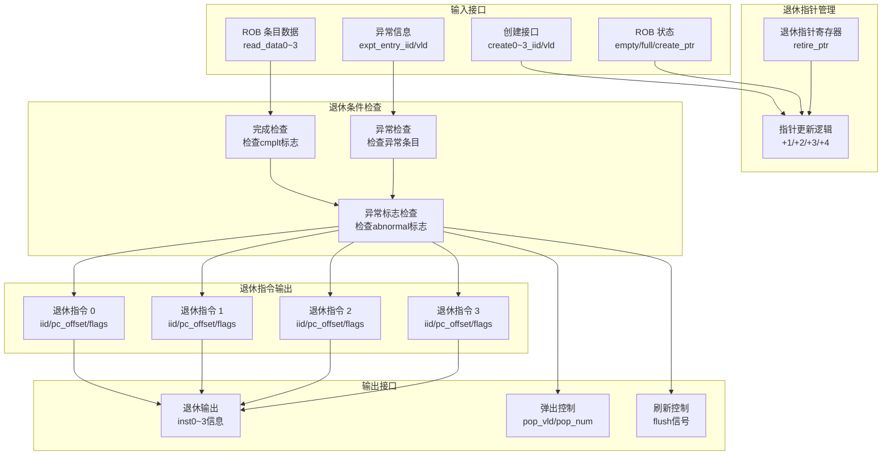

# ct_rtu_rob_rt 模块设计文档

## 1. 模块概述

### 1.1 基本信息

| 属性 | 值 |
|------|-----|
| 模块名称 | ct_rtu_rob_rt |
| 文件路径 | C910_RTL_FACTORY/gen_rtl/rtu/rtl/ct_rtu_rob_rt.v |
| 功能描述 | ROB 退休控制模块，管理指令退休逻辑和退休指针 |
| 设计特点 | 支持每周期最多 4 条指令退休、退休条件检查、退休指令信息输出 |

### 1.2 功能描述

ct_rtu_rob_rt 模块负责控制指令的退休过程，主要功能包括：

- **退休指针管理**：维护退休读指针，指向最老的未退休指令
- **退休条件检查**：检查指令是否满足退休条件（完成、无异常等）
- **退休指令输出**：输出退休指令的完整信息（PC、指令、异常等）
- **退休计数统计**：统计每周期退休的指令数量

### 1.3 设计特点

- **多指令退休**：支持每周期最多 4 条指令同时退休
- **顺序退休保证**：确保指令按程序序退休
- **异常处理**：遇到异常时停止退休，等待异常处理
- **向量扩展支持**：处理向量指令的特殊退休逻辑

## 2. 模块接口说明

### 2.1 输入端口

| 信号名 | 方向 | 位宽 | 描述 |
|--------|------|------|------|
| cp0_rtu_icg_en | input | 1 | CP0 模块时钟门控使能 |
| cp0_yy_clk_en | input | 1 | CP0 全局时钟使能 |
| cpurst_b | input | 1 | 系统复位信号（低有效） |
| forever_cpuclk | input | 1 | CPU 主时钟 |
| idu_rtu_rob_create0_iid | input | 7 | 创建端口 0 IID |
| idu_rtu_rob_create0_vld | input | 1 | 创建端口 0 有效 |
| idu_rtu_rob_create1_iid | input | 7 | 创建端口 1 IID |
| idu_rtu_rob_create1_vld | input | 1 | 创建端口 1 有效 |
| idu_rtu_rob_create2_iid | input | 7 | 创建端口 2 IID |
| idu_rtu_rob_create2_vld | input | 1 | 创建端口 2 有效 |
| idu_rtu_rob_create3_iid | input | 7 | 创建端口 3 IID |
| idu_rtu_rob_create3_vld | input | 1 | 创建端口 3 有效 |
| pad_yy_icg_scan_en | input | 1 | 扫描测试使能 |
| rob_entry_read_data0 | input | 40 | ROB 条目 0 读数据 |
| rob_entry_read_data1 | input | 40 | ROB 条目 1 读数据 |
| rob_entry_read_data2 | input | 40 | ROB 条目 2 读数据 |
| rob_entry_read_data3 | input | 40 | ROB 条目 3 读数据 |
| rob_expt_entry_expt_vld_updt_val | input | 1 | 异常条目异常有效更新值 |
| rob_expt_entry_iid | input | 7 | 异常条目 IID |
| rob_expt_entry_vld | input | 1 | 异常条目有效 |
| rob_top_create_ptr | input | 6 | 创建指针 |
| rob_top_create_ptr_after_create | input | 6 | 创建后指针 |
| rob_top_rob_empty | input | 1 | ROB 空标志 |
| rob_top_rob_full | input | 1 | ROB 满标志 |
| rtu_yy_xx_flush | input | 1 | RTU 全局刷新信号 |

### 2.2 输出端口

| 信号名 | 方向 | 位宽 | 描述 |
|--------|------|------|------|
| retire_rob_flush | output | 1 | 退休刷新信号 |
| retire_rob_flush_gateclk | output | 1 | 退休刷新门控时钟 |
| retire_rob_pop0_vld | output | 1 | 退休弹出 0 有效 |
| retire_rob_pop1_vld | output | 1 | 退休弹出 1 有效 |
| retire_rob_pop2_vld | output | 1 | 退休弹出 2 有效 |
| retire_rob_pop3_vld | output | 1 | 退休弹出 3 有效 |
| retire_rob_pop_vld | output | 4 | 退休弹出有效向量 |
| retire_rob_pop_num | output | 3 | 退休弹出数量 |
| rob_entry_read_ptr0 | output | 6 | ROB 条目读指针 0 |
| rob_entry_read_ptr1 | output | 6 | ROB 条目读指针 1 |
| rob_entry_read_ptr2 | output | 6 | ROB 条目读指针 2 |
| rob_entry_read_ptr3 | output | 6 | ROB 条目读指针 3 |
| rob_retire_inst0_abnormal | output | 1 | 退休指令 0 异常标志 |
| rob_retire_inst0_bht_mispred | output | 1 | 退休指令 0 BHT 误预测 |
| rob_retire_inst0_bkpta_data | output | 1 | 退休指令 0 数据断点 A |
| rob_retire_inst0_bkpta_inst | output | 1 | 退休指令 0 指令断点 A |
| rob_retire_inst0_bkptb_data | output | 1 | 退休指令 0 数据断点 B |
| rob_retire_inst0_bkptb_inst | output | 1 | 退休指令 0 指令断点 B |
| rob_retire_inst0_cmplt | output | 1 | 退休指令 0 完成标志 |
| rob_retire_inst0_fp_dirty | output | 1 | 退休指令 0 浮点脏标志 |
| rob_retire_inst0_iid | output | 7 | 退休指令 0 IID |
| rob_retire_inst0_intmask | output | 1 | 退休指令 0 中断屏蔽 |
| rob_retire_inst0_load | output | 1 | 退休指令 0 Load 标志 |
| rob_retire_inst0_no_spec_hit | output | 1 | 退休指令 0 非投机命中 |
| rob_retire_inst0_no_spec_mispred | output | 1 | 退休指令 0 非投机误预测 |
| rob_retire_inst0_no_spec_miss | output | 1 | 退休指令 0 非投机未命中 |
| rob_retire_inst0_pc_offset | output | 3 | 退休指令 0 PC 偏移 |
| rob_retire_inst0_ras | output | 1 | 退休指令 0 RAS 标志 |
| rob_retire_inst0_split | output | 1 | 退休指令 0 分裂标志 |
| rob_retire_inst0_store | output | 1 | 退休指令 0 Store 标志 |
| rob_retire_inst0_vec_dirty | output | 1 | 退休指令 0 向量脏标志 |
| rob_retire_inst0_vld | output | 1 | 退休指令 0 有效 |
| rob_retire_inst0_vl | output | 8 | 退休指令 0 VL 值 |
| rob_retire_inst0_vl_pred | output | 1 | 退休指令 0 VL 预测 |
| rob_retire_inst0_vlmul | output | 2 | 退休指令 0 VLMUL 值 |
| rob_retire_inst0_vsew | output | 3 | 退休指令 0 VSEW 值 |
| rob_retire_inst0_vsetvli | output | 1 | 退休指令 0 VSETVLI 标志 |
| rob_retire_inst1_abnormal | output | 1 | 退休指令 1 异常标志 |
| ... | ... | ... | （其他退休指令 1/2/3 输出类似） |
| rob_retire_num | output | 3 | 退休指令数量 |
| rob_top_retire_ptr | output | 6 | 退休指针 |

## 3. 参数定义

### 3.1 ROB 深度参数

| 参数名 | 值 | 描述 |
|--------|-----|------|
| ROB_DEPTH | 64 | ROB 条目数量 |
| ROB_PTR_WIDTH | 6 | ROB 指针位宽 |

### 3.2 退休指令数量参数

| 参数名 | 值 | 描述 |
|--------|-----|------|
| RETIRE_NUM_MAX | 4 | 最大退休指令数量 |

## 4. 模块框图



## 5. 关键逻辑说明

### 5.1 退休指针管理

**功能描述**：维护退休读指针，指向最老的未退休指令。

**指针更新规则**：
- 每周期根据退休指令数量更新指针
- 更新量：+1、+2、+3、+4 或 0（不退休）
- 指针循环：达到最大值后回绕到 0

**关键代码**：
```verilog
always @(posedge forever_cpuclk or negedge cpurst_b) begin
  if(!cpurst_b)
    retire_ptr <= 6'b0;
  else if(rtu_yy_xx_flush)
    retire_ptr <= rob_top_create_ptr;
  else if(retire_rob_pop0_vld)
    retire_ptr <= rob_entry_read_ptr0 + retire_rob_pop_num;
end
```

**读指针计算**：
```verilog
assign rob_entry_read_ptr0 = retire_ptr;
assign rob_entry_read_ptr1 = retire_ptr + 6'd1;
assign rob_entry_read_ptr2 = retire_ptr + 6'd2;
assign rob_entry_read_ptr3 = retire_ptr + 6'd3;
```

### 5.2 退休条件检查

**功能描述**：检查指令是否满足退休条件。

**退休条件**：
1. **完成条件**：指令已执行完成（`cmplt` 标志为真）
2. **无异常条件**：指令不是异常指令，或异常指令已处理
3. **顺序条件**：前面的指令都已退休

**检查逻辑**：
```verilog
// 指令 0 退休条件
assign inst0_retire_condition = rob_entry_read_data0[ROB_VLD]
                             && rob_entry_read_data0[ROB_CMPLT]
                             && !inst0_has_expt;

// 指令 1 退休条件（需要指令 0 先退休）
assign inst1_retire_condition = rob_entry_read_data1[ROB_VLD]
                             && rob_entry_read_data1[ROB_CMPLT]
                             && !inst1_has_expt
                             && retire_rob_pop0_vld;

// 指令 2/3 类似
```

**异常检查**：
```verilog
// 检查指令是否有异常
assign inst0_has_expt = rob_expt_entry_vld
                     && (rob_expt_entry_iid == rob_entry_read_ptr0);

assign inst0_abnormal = rob_entry_read_data0[ROB_BKPTA_INST]
                     || rob_entry_read_data0[ROB_BKPTB_INST]
                     || rob_entry_read_data0[ROB_BKPTA_DATA]
                     || rob_entry_read_data0[ROB_BKPTB_DATA]
                     || inst0_has_expt;
```

### 5.3 退休指令输出

**功能描述**：输出退休指令的完整信息。

**输出信息分类**：
1. **基本信息**：IID、PC 偏移、有效标志
2. **指令属性**：Load、Store、分支跳转等
3. **异常信息**：异常标志、断点信息
4. **向量信息**：VL、VSEW、VLMUL 等

**输出逻辑**：
```verilog
// 退休指令 0 输出
assign rob_retire_inst0_iid = rob_entry_read_ptr0;
assign rob_retire_inst0_vld = retire_rob_pop0_vld;
assign rob_retire_inst0_cmplt = rob_entry_read_data0[ROB_CMPLT];
assign rob_retire_inst0_pc_offset = rob_entry_read_data0[ROB_PC_OFFSET];
assign rob_retire_inst0_split = rob_entry_read_data0[ROB_SPLIT];
assign rob_retire_inst0_load = rob_entry_read_data0[ROB_LOAD];
assign rob_retire_inst0_store = rob_entry_read_data0[ROB_STORE];
// ... 其他字段
```

### 5.4 退休计数统计

**功能描述**：统计每周期退休的指令数量。

**计数逻辑**：
```verilog
assign retire_rob_pop_num[2:0] = retire_rob_pop3_vld ? 3'd4
                               : retire_rob_pop2_vld ? 3'd3
                               : retire_rob_pop1_vld ? 3'd2
                               : retire_rob_pop0_vld ? 3'd1
                               : 3'd0;

assign rob_retire_num[2:0] = retire_rob_pop_num;
```

### 5.5 刷新控制

**功能描述**：在异常或刷新时生成刷新信号。

**刷新条件**：
1. **异常刷新**：异常指令退休时
2. **全局刷新**：`rtu_yy_xx_flush` 信号有效

**关键代码**：
```verilog
assign retire_rob_flush = rtu_yy_xx_flush
                       || (retire_rob_pop0_vld && rob_retire_inst0_abnormal);

assign retire_rob_flush_gateclk = rtu_yy_xx_flush
                               || (rob_top_rob_full && rob_entry_read_data0[ROB_CMPLT]);
```

## 6. 内部信号列表

### 6.1 寄存器信号

| 信号名 | 位宽 | 描述 |
|--------|------|------|
| retire_ptr | 6 | 退休指针 |

### 6.2 线网信号

| 信号名 | 位宽 | 描述 |
|--------|------|------|
| rob_entry_read_ptr0 | 6 | ROB 条目读指针 0 |
| rob_entry_read_ptr1 | 6 | ROB 条目读指针 1 |
| rob_entry_read_ptr2 | 6 | ROB 条目读指针 2 |
| rob_entry_read_ptr3 | 6 | ROB 条目读指针 3 |
| inst0_retire_condition | 1 | 指令 0 退休条件 |
| inst1_retire_condition | 1 | 指令 1 退休条件 |
| inst2_retire_condition | 1 | 指令 2 退休条件 |
| inst3_retire_condition | 1 | 指令 3 退休条件 |
| inst0_has_expt | 1 | 指令 0 有异常 |
| inst1_has_expt | 1 | 指令 1 有异常 |
| inst2_has_expt | 1 | 指令 2 有异常 |
| inst3_has_expt | 1 | 指令 3 有异常 |
| inst0_abnormal | 1 | 指令 0 异常标志 |
| inst1_abnormal | 1 | 指令 1 异常标志 |
| inst2_abnormal | 1 | 指令 2 异常标志 |
| inst3_abnormal | 1 | 指令 3 异常标志 |
| retire_rob_pop0_vld | 1 | 退休弹出 0 有效 |
| retire_rob_pop1_vld | 1 | 退休弹出 1 有效 |
| retire_rob_pop2_vld | 1 | 退休弹出 2 有效 |
| retire_rob_pop3_vld | 1 | 退休弹出 3 有效 |
| retire_rob_pop_vld | 4 | 退休弹出有效向量 |
| retire_rob_pop_num | 3 | 退休弹出数量 |
| rob_retire_num | 3 | 退休指令数量 |
| retire_rob_flush | 1 | 退休刷新信号 |
| retire_rob_flush_gateclk | 1 | 退休刷新门控时钟 |

## 7. 数据结构定义

### 7.1 ROB 条目数据格式（40 位）

参见 ct_rtu_rob_entry 模块的 ROB 条目数据格式定义。

### 7.2 退休指令输出格式

每个退休指令输出包含以下字段：

| 字段名 | 位宽 | 描述 |
|--------|------|------|
| iid | 7 | 指令 ID |
| vld | 1 | 有效标志 |
| cmplt | 1 | 完成标志 |
| pc_offset | 3 | PC 偏移 |
| split | 1 | 分裂标志 |
| intmask | 1 | 中断屏蔽 |
| bju | 1 | 分支跳转单元标志 |
| pcfifo | 1 | PC FIFO 标志 |
| ras | 1 | RAS 标志 |
| store | 1 | Store 指令标志 |
| load | 1 | Load 指令标志 |
| fp_dirty | 1 | 浮点寄存器脏标志 |
| vec_dirty | 1 | 向量寄存器脏标志 |
| vsetvli | 1 | VSETVLI 指令标志 |
| vlmul | 2 | VLMUL 值 |
| vsew | 3 | VSEW 值 |
| vl | 8 | VL 值 |
| vl_pred | 1 | VL 预测标志 |
| bkpta_inst | 1 | 指令断点 A |
| bkptb_inst | 1 | 指令断点 B |
| bkpta_data | 1 | 数据断点 A |
| bkptb_data | 1 | 数据断点 B |
| no_spec_hit | 1 | 非投机命中 |
| no_spec_miss | 1 | 非投机未命中 |
| no_spec_mispred | 1 | 非投机误预测 |
| abnormal | 1 | 异常标志 |

## 8. 设计要点

### 8.1 顺序退休保证

**背景**：指令必须按程序序退休，即使后续指令已完成。

**实现方式**：
- 退休指针按顺序递增
- 每条指令退休前检查前面指令是否已退休
- 遇到未完成指令时停止后续退休

**关键逻辑**：
```verilog
// 指令 1 退休需要指令 0 先退休
assign retire_rob_pop1_vld = inst1_retire_condition && retire_rob_pop0_vld;

// 指令 2 退休需要指令 0/1 先退休
assign retire_rob_pop2_vld = inst2_retire_condition && retire_rob_pop1_vld;

// 指令 3 退休需要指令 0/1/2 先退休
assign retire_rob_pop3_vld = inst3_retire_condition && retire_rob_pop2_vld;
```

### 8.2 异常处理

**背景**：异常指令需要特殊处理，不能正常退休。

**处理流程**：
1. 检测到异常指令时停止退休
2. 等待异常处理模块处理
3. 异常处理完成后继续退休

**关键逻辑**：
```verilog
// 异常指令不退休
assign inst0_retire_condition = rob_entry_read_data0[ROB_VLD]
                             && rob_entry_read_data0[ROB_CMPLT]
                             && !inst0_has_expt;

// 异常指令生成刷新
assign retire_rob_flush = retire_rob_pop0_vld && rob_retire_inst0_abnormal;
```

### 8.3 向量指令处理

**背景**：向量指令有特殊的退休逻辑，需要处理 VL、VSEW 等信息。

**处理内容**：
- VL 值更新
- VSEW、VLMUL 配置
- 向量寄存器脏标志

**输出逻辑**：
```verilog
assign rob_retire_inst0_vl = rob_entry_read_data0[ROB_VL];
assign rob_retire_inst0_vsew = rob_entry_read_data0[ROB_VSEW];
assign rob_retire_inst0_vlmul = rob_entry_read_data0[ROB_VLMUL];
assign rob_retire_inst0_vsetvli = rob_entry_read_data0[ROB_VSETVLI];
assign rob_retire_inst0_vec_dirty = rob_entry_read_data0[ROB_VEC_DIRTY];
```

### 8.4 断点处理

**背景**：断点触发时需要特殊处理。

**断点类型**：
- **指令断点**：基于 PC 匹配
- **数据断点**：基于访存地址匹配

**处理流程**：
1. 检测断点触发标志
2. 设置异常标志
3. 生成刷新信号

**关键逻辑**：
```verilog
assign rob_retire_inst0_abnormal = rob_entry_read_data0[ROB_BKPTA_INST]
                                || rob_entry_read_data0[ROB_BKPTB_INST]
                                || rob_entry_read_data0[ROB_BKPTA_DATA]
                                || rob_entry_read_data0[ROB_BKPTB_DATA]
                                || inst0_has_expt;
```

## 9. 修订历史

| 版本 | 日期 | 作者 | 说明 |
|------|------|------|------|
| 1.0 | 2026-04-01 | Auto-generated | 初始版本 |
