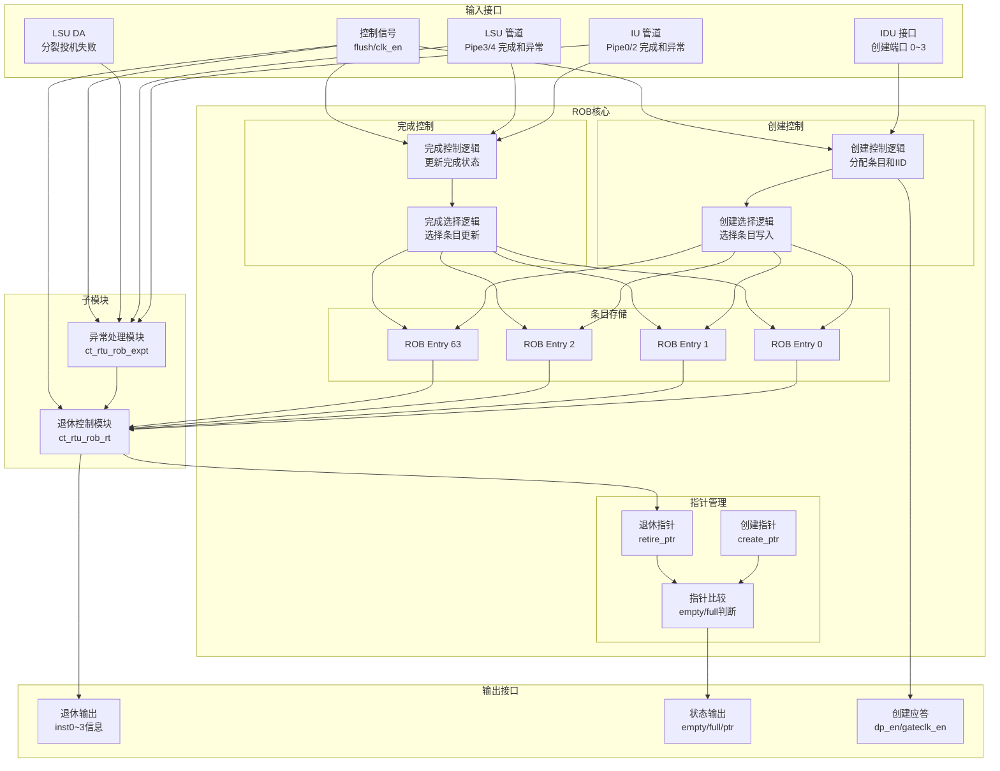

# ct_rtu_rob 模块设计文档

## 1. 模块概述

### 1.1 基本信息

| 属性 | 值 |
|------|-----|
| 模块名称 | ct_rtu_rob |
| 文件路径 | C910_RTL_FACTORY/gen_rtl/rtu/rtl/ct_rtu_rob.v |
| 功能描述 | ROB (Re-Order Buffer) 顶层模块，实现乱序执行指令的顺序退休 |
| 设计特点 | 64 条目深度、支持每周期 4 条指令创建和退休、完整的异常处理机制 |

### 1.2 功能描述

ct_rtu_rob 是 ROB 的顶层模块，负责管理指令的创建、完成和退休流程，主要功能包括：

- **指令创建管理**：从 IDU 接收指令，分配 ROB 条目
- **指令完成管理**：从各执行管道接收完成信号，更新条目状态
- **指令退休管理**：按程序序退休已完成的指令
- **异常处理**：管理异常指令的完成顺序和异常信息
- **状态查询**：提供 ROB 状态信息（空、满、条目数量等）

### 1.3 设计特点

- **大容量设计**：64 条目深度，支持大量指令在飞行状态
- **高吞吐量**：每周期最多 4 条指令创建和退休
- **完整的异常处理**：支持异常、断点、投机失败等多种异常类型
- **向量扩展支持**：支持向量指令的 VL、VSEW、VLMUL 管理
- **时钟门控优化**：分级时钟门控，降低功耗

## 2. 模块接口说明

### 2.1 输入端口（主要）

| 信号名 | 方向 | 位宽 | 描述 |
|--------|------|------|------|
| cp0_rtu_icg_en | input | 1 | CP0 模块时钟门控使能 |
| cp0_yy_clk_en | input | 1 | CP0 全局时钟使能 |
| cpurst_b | input | 1 | 系统复位信号（低有效） |
| forever_cpuclk | input | 1 | CPU 主时钟 |
| idu_rtu_rob_create0_data | input | 40 | 创建端口 0 数据 |
| idu_rtu_rob_create0_iid | input | 7 | 创建端口 0 IID |
| idu_rtu_rob_create0_vld | input | 1 | 创建端口 0 有效 |
| idu_rtu_rob_create1_data | input | 40 | 创建端口 1 数据 |
| idu_rtu_rob_create1_iid | input | 7 | 创建端口 1 IID |
| idu_rtu_rob_create1_vld | input | 1 | 创建端口 1 有效 |
| idu_rtu_rob_create2_data | input | 40 | 创建端口 2 数据 |
| idu_rtu_rob_create2_iid | input | 7 | 创建端口 2 IID |
| idu_rtu_rob_create2_vld | input | 1 | 创建端口 2 有效 |
| idu_rtu_rob_create3_data | input | 40 | 创建端口 3 数据 |
| idu_rtu_rob_create3_iid | input | 7 | 创建端口 3 IID |
| idu_rtu_rob_create3_vld | input | 1 | 创建端口 3 有效 |
| iu_rtu_pipe0_abnormal | input | 1 | IU Pipe0 异常标志 |
| iu_rtu_pipe0_bkpt | input | 1 | IU Pipe0 断点触发 |
| iu_rtu_pipe0_cmplt | input | 1 | IU Pipe0 完成信号 |
| iu_rtu_pipe0_efpc_vld | input | 1 | IU Pipe0 EFPC 有效 |
| iu_rtu_pipe0_expt_vec | input | 5 | IU Pipe0 异常向量 |
| iu_rtu_pipe0_expt_vld | input | 1 | IU Pipe0 异常有效 |
| iu_rtu_pipe0_flush | input | 1 | IU Pipe0 刷新请求 |
| iu_rtu_pipe0_high_hw_expt | input | 1 | IU Pipe0 高优先级硬件异常 |
| iu_rtu_pipe0_iid | input | 7 | IU Pipe0 指令 ID |
| iu_rtu_pipe0_immu_expt | input | 1 | IU Pipe0 IMMU 异常 |
| iu_rtu_pipe0_mtval | input | 32 | IU Pipe0 MTVAL 值 |
| iu_rtu_pipe0_vsetvl | input | 1 | IU Pipe0 VSETVL 标志 |
| iu_rtu_pipe0_vstart | input | 7 | IU Pipe0 VSTART 值 |
| iu_rtu_pipe0_vstart_vld | input | 1 | IU Pipe0 VSTART 有效 |
| iu_rtu_pipe2_abnormal | input | 1 | IU Pipe2 异常标志 |
| iu_rtu_pipe2_bht_mispred | input | 1 | IU Pipe2 BHT 误预测 |
| iu_rtu_pipe2_cmplt | input | 1 | IU Pipe2 完成信号 |
| iu_rtu_pipe2_iid | input | 7 | IU Pipe2 指令 ID |
| iu_rtu_pipe2_jmp_mispred | input | 1 | IU Pipe2 跳转误预测 |
| lsu_misc_cmplt_gateclk_en | input | 1 | LSU 完成门控使能 |
| lsu_rtu_da_pipe3_split_spec_fail_iid | input | 7 | LSU Pipe3 分裂投机失败 IID |
| lsu_rtu_da_pipe3_split_spec_fail_vld | input | 1 | LSU Pipe3 分裂投机失败有效 |
| lsu_rtu_da_pipe4_split_spec_fail_iid | input | 7 | LSU Pipe4 分裂投机失败 IID |
| lsu_rtu_da_pipe4_split_spec_fail_vld | input | 1 | LSU Pipe4 分裂投机失败有效 |
| lsu_rtu_wb_pipe3_abnormal | input | 1 | LSU Pipe3 异常标志 |
| lsu_rtu_wb_pipe3_bkpta_data | input | 1 | LSU Pipe3 数据断点 A |
| lsu_rtu_wb_pipe3_bkptb_data | input | 1 | LSU Pipe3 数据断点 B |
| lsu_rtu_wb_pipe3_cmplt | input | 1 | LSU Pipe3 完成信号 |
| lsu_rtu_wb_pipe3_expt_vec | input | 5 | LSU Pipe3 异常向量 |
| lsu_rtu_wb_pipe3_expt_vld | input | 1 | LSU Pipe3 异常有效 |
| lsu_rtu_wb_pipe3_flush | input | 1 | LSU Pipe3 刷新请求 |
| lsu_rtu_wb_pipe3_iid | input | 7 | LSU Pipe3 指令 ID |
| lsu_rtu_wb_pipe3_mtval | input | 40 | LSU Pipe3 MTVAL 值 |
| lsu_rtu_wb_pipe3_no_spec_hit | input | 1 | LSU Pipe3 非投机命中 |
| lsu_rtu_wb_pipe3_no_spec_mispred | input | 1 | LSU Pipe3 非投机误预测 |
| lsu_rtu_wb_pipe3_no_spec_miss | input | 1 | LSU Pipe3 非投机未命中 |
| lsu_rtu_wb_pipe3_spec_fail | input | 1 | LSU Pipe3 投机失败 |
| lsu_rtu_wb_pipe3_vsetvl | input | 1 | LSU Pipe3 VSETVL 标志 |
| lsu_rtu_wb_pipe3_vstart | input | 7 | LSU Pipe3 VSTART 值 |
| lsu_rtu_wb_pipe3_vstart_vld | input | 1 | LSU Pipe3 VSTART 有效 |
| lsu_rtu_wb_pipe4_abnormal | input | 1 | LSU Pipe4 异常标志 |
| lsu_rtu_wb_pipe4_bkpta_data | input | 1 | LSU Pipe4 数据断点 A |
| lsu_rtu_wb_pipe4_bkptb_data | input | 1 | LSU Pipe4 数据断点 B |
| lsu_rtu_wb_pipe4_cmplt | input | 1 | LSU Pipe4 完成信号 |
| lsu_rtu_wb_pipe4_expt_vec | input | 5 | LSU Pipe4 异常向量 |
| lsu_rtu_wb_pipe4_expt_vld | input | 1 | LSU Pipe4 异常有效 |
| lsu_rtu_wb_pipe4_flush | input | 1 | LSU Pipe4 刷新请求 |
| lsu_rtu_wb_pipe4_iid | input | 7 | LSU Pipe4 指令 ID |
| lsu_rtu_wb_pipe4_mtval | input | 40 | LSU Pipe4 MTVAL 值 |
| lsu_rtu_wb_pipe4_no_spec_hit | input | 1 | LSU Pipe4 非投机命中 |
| lsu_rtu_wb_pipe4_no_spec_mispred | input | 1 | LSU Pipe4 非投机误预测 |
| lsu_rtu_wb_pipe4_no_spec_miss | input | 1 | LSU Pipe4 非投机未命中 |
| lsu_rtu_wb_pipe4_spec_fail | input | 1 | LSU Pipe4 投机失败 |
| lsu_rtu_wb_pipe4_vstart | input | 7 | LSU Pipe4 VSTART 值 |
| lsu_rtu_wb_pipe4_vstart_vld | input | 1 | LSU Pipe4 VSTART 有效 |
| pad_yy_icg_scan_en | input | 1 | 扫描测试使能 |
| rtu_yy_xx_flush | input | 1 | RTU 全局刷新信号 |

### 2.2 输出端口（主要）

| 信号名 | 方向 | 位宽 | 描述 |
|--------|------|------|------|
| rob_idu_create0_dp_en | output | 1 | 创建端口 0 数据通路使能 |
| rob_idu_create1_dp_en | output | 1 | 创建端口 1 数据通路使能 |
| rob_idu_create2_dp_en | output | 1 | 创建端口 2 数据通路使能 |
| rob_idu_create3_dp_en | output | 1 | 创建端口 3 数据通路使能 |
| rob_idu_create0_gateclk_en | output | 1 | 创建端口 0 门控使能 |
| rob_idu_create1_gateclk_en | output | 1 | 创建端口 1 门控使能 |
| rob_idu_create2_gateclk_en | output | 1 | 创建端口 2 门控使能 |
| rob_idu_create3_gateclk_en | output | 1 | 创建端口 3 门控使能 |
| rob_retire_inst0_abnormal | output | 1 | 退休指令 0 异常标志 |
| rob_retire_inst0_bht_mispred | output | 1 | 退休指令 0 BHT 误预测 |
| rob_retire_inst0_bkpta_data | output | 1 | 退休指令 0 数据断点 A |
| rob_retire_inst0_bkpta_inst | output | 1 | 退休指令 0 指令断点 A |
| rob_retire_inst0_bkptb_data | output | 1 | 退休指令 0 数据断点 B |
| rob_retire_inst0_bkptb_inst | output | 1 | 退休指令 0 指令断点 B |
| rob_retire_inst0_cmplt | output | 1 | 退休指令 0 完成标志 |
| rob_retire_inst0_efpc_vld | output | 1 | 退休指令 0 EFPC 有效 |
| rob_retire_inst0_expt_vec | output | 4 | 退休指令 0 异常向量 |
| rob_retire_inst0_expt_vld | output | 1 | 退休指令 0 异常有效 |
| rob_retire_inst0_fp_dirty | output | 1 | 退休指令 0 浮点脏标志 |
| rob_retire_inst0_high_hw_expt | output | 1 | 退休指令 0 高优先级硬件异常 |
| rob_retire_inst0_iid | output | 7 | 退休指令 0 IID |
| rob_retire_inst0_immu_expt | output | 1 | 退休指令 0 IMMU 异常 |
| rob_retire_inst0_inst_flush | output | 1 | 退休指令 0 指令刷新 |
| rob_retire_inst0_intmask | output | 1 | 退休指令 0 中断屏蔽 |
| rob_retire_inst0_jmp_mispred | output | 1 | 退休指令 0 跳转误预测 |
| rob_retire_inst0_load | output | 1 | 退休指令 0 Load 标志 |
| rob_retire_inst0_mtval | output | 40 | 退休指令 0 MTVAL 值 |
| rob_retire_inst0_no_spec_hit | output | 1 | 退休指令 0 非投机命中 |
| rob_retire_inst0_no_spec_mispred | output | 1 | 退休指令 0 非投机误预测 |
| rob_retire_inst0_no_spec_miss | output | 1 | 退休指令 0 非投机未命中 |
| rob_retire_inst0_pc_offset | output | 3 | 退休指令 0 PC 偏移 |
| rob_retire_inst0_ras | output | 1 | 退休指令 0 RAS 标志 |
| rob_retire_inst0_spec_fail | output | 1 | 退休指令 0 投机失败 |
| rob_retire_inst0_spec_fail_no_ssf | output | 1 | 退休指令 0 投机失败（非 SSF） |
| rob_retire_inst0_spec_fail_ssf | output | 1 | 退休指令 0 投机失败（SSF） |
| rob_retire_inst0_split | output | 1 | 退休指令 0 分裂标志 |
| rob_retire_inst0_store | output | 1 | 退休指令 0 Store 标志 |
| rob_retire_inst0_vec_dirty | output | 1 | 退休指令 0 向量脏标志 |
| rob_retire_inst0_vld | output | 1 | 退休指令 0 有效 |
| rob_retire_inst0_vl | output | 8 | 退休指令 0 VL 值 |
| rob_retire_inst0_vl_pred | output | 1 | 退休指令 0 VL 预测 |
| rob_retire_inst0_vlmul | output | 2 | 退休指令 0 VLMUL 值 |
| rob_retire_inst0_vsew | output | 3 | 退休指令 0 VSEW 值 |
| rob_retire_inst0_vsetvl | output | 1 | 退休指令 0 VSETVL 标志 |
| rob_retire_inst0_vstart | output | 7 | 退休指令 0 VSTART 值 |
| rob_retire_inst0_vstart_vld | output | 1 | 退休指令 0 VSTART 有效 |
| rob_retire_inst1_* | output | - | 退休指令 1 信息（类似指令 0） |
| rob_retire_inst2_* | output | - | 退休指令 2 信息（类似指令 0） |
| rob_retire_inst3_* | output | - | 退休指令 3 信息（类似指令 0） |
| rob_retire_num | output | 3 | 退休指令数量 |
| rob_retire_split_spec_fail_srt | output | 1 | 分裂投机失败 SRT 使能 |
| rob_retire_ssf_iid | output | 7 | SSF IID |
| rob_top_create_ptr | output | 6 | 创建指针 |
| rob_top_create_ptr_after_create | output | 6 | 创建后指针 |
| rob_top_rob_empty | output | 1 | ROB 空标志 |
| rob_top_rob_full | output | 1 | ROB 满标志 |
| rob_top_retire_ptr | output | 6 | 退休指针 |
| rob_top_ssf_cur_state | output | 2 | SSF 当前状态 |

## 3. 参数定义

### 3.1 ROB 配置参数

| 参数名 | 值 | 描述 |
|--------|-----|------|
| ROB_DEPTH | 64 | ROB 条目数量 |
| ROB_PTR_WIDTH | 6 | ROB 指针位宽 |
| ROB_WIDTH | 40 | ROB 条目数据宽度 |

### 3.2 ROB 数据域定义

参见 ct_rtu_rob_entry 模块的 ROB 数据域定义。

## 4. 模块框图



## 5. 关键逻辑说明

### 5.1 指令创建管理

**功能描述**：从 IDU 接收指令，分配 ROB 条目。

**创建流程**：
1. IDU 发送创建请求（create_vld、create_data、create_iid）
2. ROB 检查是否有空闲条目
3. 分配条目，写入指令信息
4. 更新创建指针
5. 返回创建应答（dp_en、gateclk_en）

**关键代码**：
```verilog
// 创建指针更新
always @(posedge forever_cpuclk or negedge cpurst_b) begin
  if(!cpurst_b)
    create_ptr <= 6'b0;
  else if(rtu_yy_xx_flush)
    create_ptr <= retire_ptr;
  else
    create_ptr <= create_ptr_after_create;
end

// 创建后指针计算
assign create_ptr_after_create = create_ptr + create_num;

// 创建应答
assign rob_idu_create0_dp_en = idu_rtu_rob_create0_vld && !rob_top_rob_full;
assign rob_idu_create0_gateclk_en = idu_rtu_rob_create0_vld;
```

### 5.2 指令完成管理

**功能描述**：从各执行管道接收完成信号，更新 ROB 条目状态。

**完成管道映射**：
- **Pipe0**：IU ALU 管道 0
- **Pipe2**：IU ALU 管道 2（分支跳转）
- **Pipe3**：LSU 管道 3
- **Pipe4**：LSU 管道 4

**完成处理流程**：
1. 执行管道发送完成信号（cmplt、iid）
2. ROB 根据 IID 索引对应条目
3. 更新条目的完成状态
4. 如果是 LSU 指令，还需要更新断点和非投机信息

**关键代码**：
```verilog
// 完成信号路由
assign rob_entry_cmplt_vld[6:0] = {
  iu_rtu_pipe2_cmplt,   // Pipe2
  lsu_rtu_wb_pipe4_cmplt, // Pipe4
  lsu_rtu_wb_pipe3_cmplt, // Pipe3
  1'b0,                 // Pipe1 (未使用)
  iu_rtu_pipe0_cmplt,   // Pipe0
  1'b0,                 // Pipe5 (未使用)
  1'b0                  // Pipe6 (未使用)
};

// 完成条目选择
always @(*) begin
  case(iu_rtu_pipe0_iid)
    7'd0: rob_entry0_cmplt_sel = 1'b1;
    7'd1: rob_entry1_cmplt_sel = 1'b1;
    // ... 其他条目
  endcase
end
```

### 5.3 ROB 状态管理

**功能描述**：维护 ROB 的状态信息（空、满、条目数量等）。

**状态判断逻辑**：
- **空状态**：创建指针等于退休指针
- **满状态**：创建指针比退休指针多 60 或更多（留 4 个条目余量）
- **条目数量**：创建指针减去退休指针（考虑回绕）

**关键代码**：
```vermaid
// 空判断
assign rob_top_rob_empty = (create_ptr == retire_ptr);

// 满判断
assign rob_top_rob_full = (create_ptr[5:0] - retire_ptr[5:0] >= 6'd60);

// 条目数量
assign rob_entry_num = create_ptr - retire_ptr;
```

### 5.4 子模块实例化

**异常处理模块实例化**：
```verilog
ct_rtu_rob_expt x_ct_rtu_rob_expt (
  .cp0_rtu_icg_en               (cp0_rtu_icg_en),
  .cp0_yy_clk_en                (cp0_yy_clk_en),
  .cpurst_b                     (cpurst_b),
  .forever_cpuclk               (forever_cpuclk),
  // ... IU Pipe0 异常输入
  .iu_rtu_pipe0_abnormal        (iu_rtu_pipe0_abnormal),
  .iu_rtu_pipe0_bkpt            (iu_rtu_pipe0_bkpt),
  .iu_rtu_pipe0_cmplt           (iu_rtu_pipe0_cmplt),
  // ... IU Pipe2 异常输入
  .iu_rtu_pipe2_abnormal        (iu_rtu_pipe2_abnormal),
  // ... LSU Pipe3/4 异常输入
  .lsu_rtu_wb_pipe3_abnormal    (lsu_rtu_wb_pipe3_abnormal),
  .lsu_rtu_wb_pipe4_abnormal    (lsu_rtu_wb_pipe4_abnormal),
  // ... LSU DA 输入
  .lsu_rtu_da_pipe3_split_spec_fail_iid (lsu_rtu_da_pipe3_split_spec_fail_iid),
  .lsu_rtu_da_pipe3_split_spec_fail_vld (lsu_rtu_da_pipe3_split_spec_fail_vld),
  // ... 输出
  .expt_entry_vld               (rob_expt_entry_vld),
  .expt_entry_iid               (rob_expt_entry_iid),
  .rob_retire_inst0_expt_vld    (rob_retire_inst0_expt_vld),
  .rob_retire_inst0_expt_vec    (rob_retire_inst0_expt_vec),
  // ... 其他输出
);
```

**退休控制模块实例化**：
```verilog
ct_rtu_rob_rt x_ct_rtu_rob_rt (
  .cp0_rtu_icg_en               (cp0_rtu_icg_en),
  .cp0_yy_clk_en                (cp0_yy_clk_en),
  .cpurst_b                     (cpurst_b),
  .forever_cpuclk               (forever_cpuclk),
  // ... 创建输入
  .idu_rtu_rob_create0_iid      (idu_rtu_rob_create0_iid),
  .idu_rtu_rob_create0_vld      (idu_rtu_rob_create0_vld),
  // ... ROB 条目数据输入
  .rob_entry_read_data0         (rob_entry_read_data0),
  .rob_entry_read_data1         (rob_entry_read_data1),
  .rob_entry_read_data2         (rob_entry_read_data2),
  .rob_entry_read_data3         (rob_entry_read_data3),
  // ... 异常输入
  .rob_expt_entry_vld           (rob_expt_entry_vld),
  .rob_expt_entry_iid           (rob_expt_entry_iid),
  // ... ROB 状态输入
  .rob_top_create_ptr           (rob_top_create_ptr),
  .rob_top_rob_empty            (rob_top_rob_empty),
  .rob_top_rob_full             (rob_top_rob_full),
  // ... 输出
  .rob_retire_inst0_vld         (rob_retire_inst0_vld),
  .rob_retire_inst0_iid         (rob_retire_inst0_iid),
  .rob_retire_inst0_cmplt       (rob_retire_inst0_cmplt),
  // ... 其他输出
);
```

**ROB 条目实例化**：
```verilog
// 64 个 ROB 条目实例
ct_rtu_rob_entry x_ct_rtu_rob_entry0 (
  .forever_cpuclk               (forever_cpuclk),
  .cpurst_b                     (cpurst_b),
  .x_create_en                  (rob_entry0_create_en),
  .x_create_sel                 (rob_entry0_create_sel),
  .x_create_data                (rob_entry0_create_data),
  .x_cmplt_vld                  (rob_entry0_cmplt_vld),
  .x_read_data                  (rob_entry_read_data0),
  // ... 其他端口
);

ct_rtu_rob_entry x_ct_rtu_rob_entry1 (
  // ... 类似实例化
);

// ... 其他 62 个条目
```

## 6. 内部信号列表

### 6.1 寄存器信号

| 信号名 | 位宽 | 描述 |
|--------|------|------|
| create_ptr | 6 | 创建指针 |

### 6.2 线网信号（主要）

| 信号名 | 位宽 | 描述 |
|--------|------|------|
| create_ptr_after_create | 6 | 创建后指针 |
| create_num | 3 | 创建指令数量 |
| rob_top_rob_empty | 1 | ROB 空标志 |
| rob_top_rob_full | 1 | ROB 满标志 |
| rob_entry_read_data0 | 40 | ROB 条目 0 读数据 |
| rob_entry_read_data1 | 40 | ROB 条目 1 读数据 |
| rob_entry_read_data2 | 40 | ROB 条目 2 读数据 |
| rob_entry_read_data3 | 40 | ROB 条目 3 读数据 |
| rob_entry_read_ptr0 | 6 | ROB 条目读指针 0 |
| rob_entry_read_ptr1 | 6 | ROB 条目读指针 1 |
| rob_entry_read_ptr2 | 6 | ROB 条目读指针 2 |
| rob_entry_read_ptr3 | 6 | ROB 条目读指针 3 |
| rob_expt_entry_vld | 1 | 异常条目有效 |
| rob_expt_entry_iid | 7 | 异常条目 IID |
| rob_retire_num | 3 | 退休指令数量 |
| rob_top_retire_ptr | 6 | 退休指针 |

## 7. 子模块说明

### 7.1 子模块列表

| 层级 | 模块名 | 实例名 | 文件路径 | 功能描述 |
|------|--------|--------|----------|----------|
| 1 | ct_rtu_rob_entry | x_ct_rtu_rob_entry0~63 | ct_rtu_rob_entry.v | ROB 条目模块（64 个实例） |
| 1 | ct_rtu_rob_expt | x_ct_rtu_rob_expt | ct_rtu_rob_expt.v | 异常处理模块 |
| 1 | ct_rtu_rob_rt | x_ct_rtu_rob_rt | ct_rtu_rob_rt.v | 退休控制模块 |

### 7.2 子模块功能说明

**ct_rtu_rob_entry**：
- ROB 的基本存储单元
- 存储单条指令的完整状态信息
- 支持创建、完成、退休操作
- 详细文档：[ct_rtu_rob_entry_top.md](./ct_rtu_rob_entry_top.md)

**ct_rtu_rob_expt**：
- 管理异常指令的完成顺序
- 存储最老异常指令的完整信息
- 处理分裂指令投机失败
- 详细文档：[ct_rtu_rob_expt_top.md](./ct_rtu_rob_expt_top.md)

**ct_rtu_rob_rt**：
- 控制指令的退休过程
- 维护退休读指针
- 检查退休条件
- 输出退休指令信息
- 详细文档：[ct_rtu_rob_rt_top.md](./ct_rtu_rob_rt_top.md)

## 8. 设计要点

### 8.1 乱序执行顺序退休

**背景**：处理器采用乱序执行提高性能，但指令必须按程序序退休以确保精确异常。

**实现方式**：
- ROB 按程序序存储指令
- 指令可以乱序完成
- 退休指针按顺序递增
- 遇到未完成指令时停止退休

**关键点**：
- 创建指针和退休指针维护程序序
- 每个条目记录指令的完成状态
- 退休时检查前面的指令是否已完成

### 8.2 多端口创建和退休

**背景**：为了提高吞吐量，每周期需要支持多条指令创建和退休。

**实现方式**：
- 4 个创建端口对应 4 个发射队列
- 4 个退休端口对应 4 条退休指令
- 指针一次增加 1~4

**关键点**：
- 创建端口独立操作
- 退休端口顺序检查
- 指针更新考虑创建/退休数量

### 8.3 异常处理机制

**背景**：异常指令需要特殊处理，确保精确异常。

**处理流程**：
1. 执行管道检测异常，发送异常信息
2. 异常处理模块记录最老异常
3. 退休时检查异常标志
4. 异常指令退休时触发刷新
5. 流水线回滚到异常指令

**关键点**：
- 异常按程序序处理（最老异常优先）
- 异常指令之前的指令正常退休
- 异常指令触发流水线刷新

### 8.4 向量扩展支持

**背景**：向量指令需要特殊的 ROB 支持。

**支持内容**：
- VL（向量长度）值存储和更新
- VSEW（向量元素宽度）配置
- VLMUL（向量寄存器分组）配置
- VSTART（向量起始位置）异常处理

**关键点**：
- 向量配置信息存储在 ROB 条目中
- 退休时输出向量配置
- VSTART 异常需要特殊处理

## 9. 性能优化

### 9.1 时钟门控

**优化策略**：
- 分级时钟门控
- 仅在需要时激活时钟
- 减少不必要的时钟翻转

**门控级别**：
1. **模块级**：CP0 控制的全局门控
2. **功能级**：创建、完成、退休独立门控
3. **条目级**：每个条目独立门控

### 9.2 面积优化

**优化策略**：
- 数据压缩存储（40 位条目）
- 共享逻辑（完成选择逻辑共享）
- 参数化设计（可配置深度）

### 9.3 时序优化

**优化策略**：
- 关键路径优化（退休条件检查）
- 流水线化（创建、完成、退休分离）
- 并行处理（多端口并行操作）

## 10. 修订历史

| 版本 | 日期 | 作者 | 说明 |
|------|------|------|------|
| 1.0 | 2026-04-01 | Auto-generated | 初始版本 |
