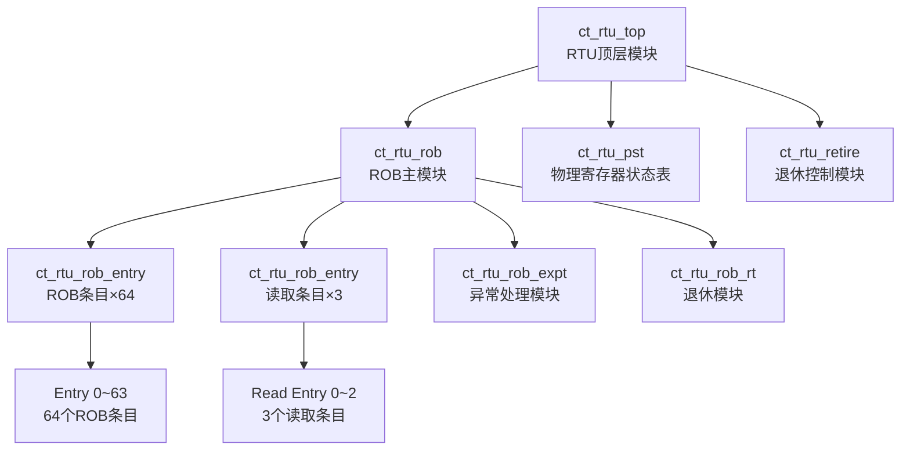
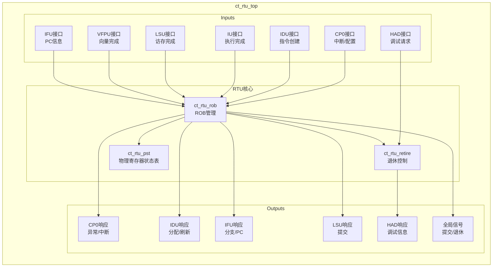
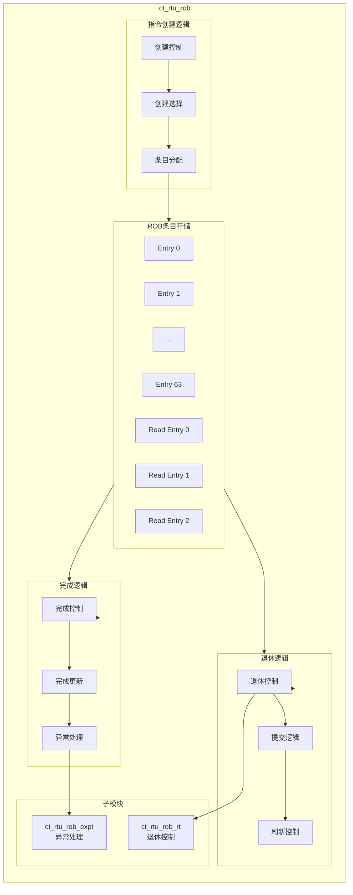
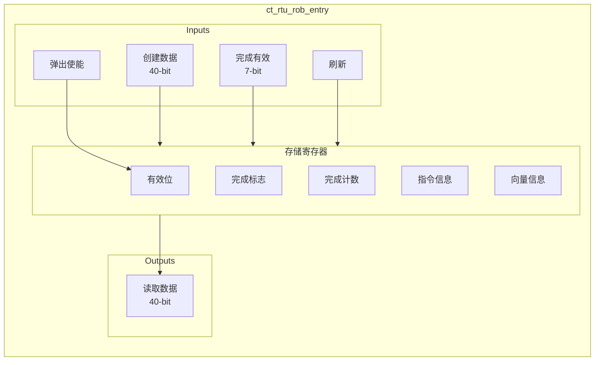
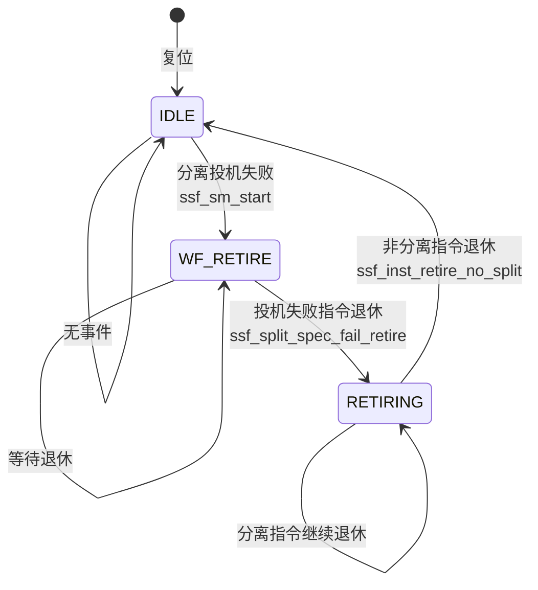
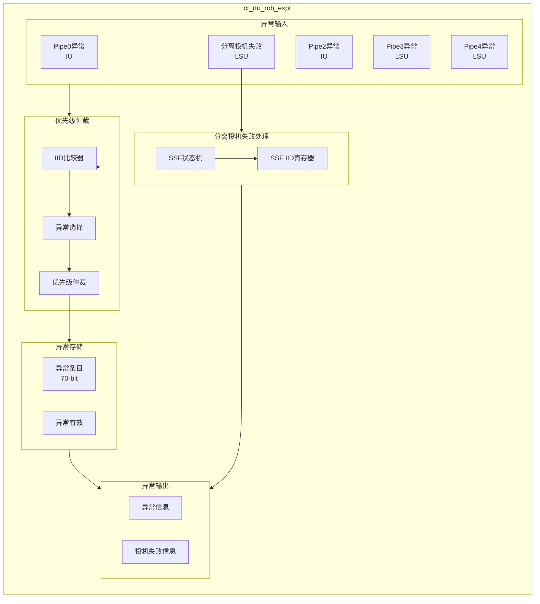
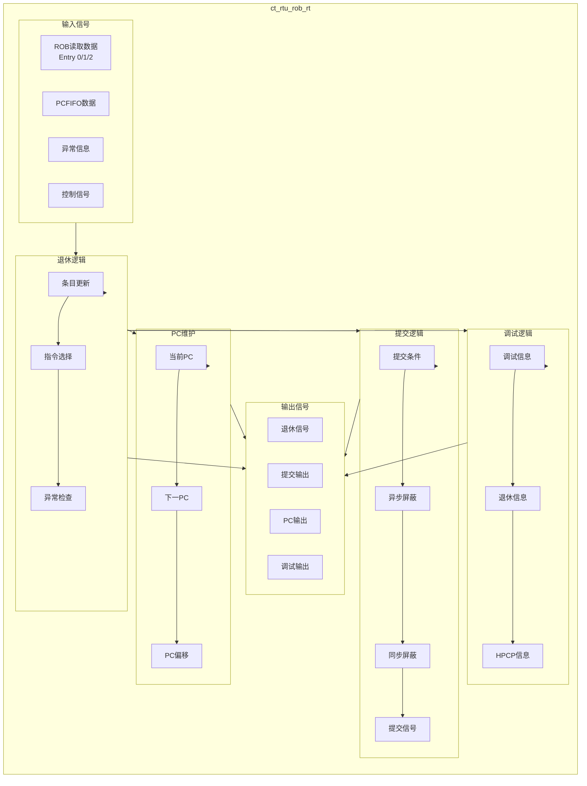

# RTU (Retire Unit) 模块详细设计方案

## 文档信息
- **模块名称**: RTU (Retire Unit)
- **文档版本**: v1.0
- **生成日期**: 2026-04-01
- **设计工程师**: IC设计专家
- **版权所有**: T-Head Semiconductor Co., Ltd.

---

## 目录
1. [模块概述](#1-模块概述)
2. [模块层次结构](#2-模块层次结构)
3. [ct_rtu_top 顶层模块](#3-ct_rtu_top-顶层模块)
4. [ct_rtu_rob ROB主模块](#4-ct_rtu_rob-rob主模块)
5. [ct_rtu_rob_entry ROB条目模块](#5-ct_rtu_rob_entry-rob条目模块)
6. [ct_rtu_rob_expt 异常处理模块](#6-ct_rtu_rob_expt-异常处理模块)
7. [ct_rtu_rob_rt 退休模块](#7-ct_rtu_rob_rt-退休模块)
8. [关键设计说明](#8-关键设计说明)

---

## 1. 模块概述

### 1.1 功能描述

RTU (Retire Unit) 是 C910 处理器的退休单元，负责指令的顺序退休、异常处理、重命名寄存器释放等功能。主要功能包括：

1. **指令顺序退休管理**
   - 维护指令完成顺序
   - 支持每周期最多3条指令退休
   - 管理指令提交和退休状态

2. **重排序缓冲区 (ROB) 管理**
   - 64项ROB条目管理
   - 支持每周期最多4条指令创建
   - 支持每周期最多3条指令读取

3. **异常处理**
   - 异常检测和记录
   - 异常优先级仲裁
   - 分离指令投机失败处理

4. **中断处理**
   - 中断请求响应
   - 中断向量管理
   - 单退休模式支持

5. **调试支持**
   - 断点处理（指令断点、数据断点）
   - 调试模式进入
   - 跟踪信息输出

6. **性能监控**
   - 指令退休计数
   - 分支预测信息
   - 性能计数器支持

### 1.2 关键特性

- **超标量支持**: 每周期最多4条指令创建，3条指令退休
- **乱序执行**: 支持乱序执行，顺序退休
- **异常精确**: 保证异常处理的精确性
- **低功耗设计**: 采用门控时钟技术
- **调试友好**: 完整的调试和跟踪支持

---

## 2. 模块层次结构

### 2.1 模块层次图



### 2.2 模块例化关系

| 父模块 | 子模块 | 例化名称 | 数量 | 功能描述 |
|--------|--------|----------|------|----------|
| ct_rtu_top | ct_rtu_rob | x_ct_rtu_rob | 1 | ROB主模块 |
| ct_rtu_rob | ct_rtu_rob_entry | x_ct_rtu_rob_entry[0-63] | 64 | ROB存储条目 |
| ct_rtu_rob | ct_rtu_rob_entry | x_ct_rtu_rob_read_entry[0-2] | 3 | ROB读取条目 |
| ct_rtu_rob | ct_rtu_rob_expt | x_ct_rtu_rob_expt | 1 | 异常处理 |
| ct_rtu_rob | ct_rtu_rob_rt | x_ct_rtu_rob_rt | 1 | 退休控制 |

---

## 3. ct_rtu_top 顶层模块

### 3.1 模块概述

ct_rtu_top 是 RTU 的顶层模块，负责整合所有子模块，提供与处理器其他单元的接口。

### 3.2 接口信号列表

#### 3.2.1 输入信号

| 信号名称 | 位宽 | 来源模块 | 功能描述 |
|----------|------|----------|----------|
| cp0_rtu_icg_en | 1 | CP0 | 门控时钟使能 |
| cp0_rtu_srt_en | 1 | CP0 | 单退休模式使能 |
| cp0_rtu_xx_int_b | 1 | CP0 | 中断请求（低有效） |
| cp0_rtu_xx_vec | 5 | CP0 | 中断向量 |
| cp0_yy_clk_en | 1 | CP0 | 全局时钟使能 |
| cpurst_b | 1 | TOP | 系统复位（低有效） |
| forever_cpuclk | 1 | TOP | CPU时钟 |
| had_rtu_data_bkpt_dbgreq | 1 | HAD | 数据断点调试请求 |
| had_rtu_dbg_disable | 1 | HAD | 调试禁用 |
| had_rtu_dbg_req_en | 1 | HAD | 调试请求使能 |
| had_rtu_debug_retire_info_en | 1 | HAD | 调试退休信息使能 |
| had_rtu_event_dbgreq | 1 | HAD | 事件调试请求 |
| had_rtu_fdb | 1 | HAD | 快速调试断点 |
| had_rtu_hw_dbgreq | 1 | HAD | 硬件调试请求 |
| had_rtu_hw_dbgreq_gateclk | 1 | HAD | 硬件调试请求门控时钟 |
| had_rtu_inst_bkpt_dbgreq | 1 | HAD | 指令断点调试请求 |
| had_rtu_non_irv_bkpt_dbgreq | 1 | HAD | 非IRV断点调试请求 |
| had_rtu_pop1_disa | 1 | HAD | POP1禁用 |
| had_rtu_trace_dbgreq | 1 | HAD | 跟踪调试请求 |
| had_rtu_trace_en | 1 | HAD | 跟踪使能 |
| had_rtu_xx_jdbreq | 1 | HAD | JTAG调试请求 |
| had_rtu_xx_tme | 1 | HAD | 跟踪模式使能 |
| had_yy_xx_exit_dbg | 1 | HAD | 退出调试模式 |
| hpcp_rtu_cnt_en | 1 | HPCP | 性能计数器使能 |
| idu_rtu_fence_idle | 1 | IDU | FENCE空闲 |
| idu_rtu_rob_create0_data | 40 | IDU | ROB创建数据0 |
| idu_rtu_rob_create0_dp_en | 1 | IDU | ROB创建数据通路使能0 |
| idu_rtu_rob_create0_en | 1 | IDU | ROB创建使能0 |
| idu_rtu_rob_create0_gateclk_en | 1 | IDU | ROB创建门控时钟使能0 |
| idu_rtu_rob_create1_data | 40 | IDU | ROB创建数据1 |
| idu_rtu_rob_create1_dp_en | 1 | IDU | ROB创建数据通路使能1 |
| idu_rtu_rob_create1_en | 1 | IDU | ROB创建使能1 |
| idu_rtu_rob_create1_gateclk_en | 1 | IDU | ROB创建门控时钟使能1 |
| idu_rtu_rob_create2_data | 40 | IDU | ROB创建数据2 |
| idu_rtu_rob_create2_dp_en | 1 | IDU | ROB创建数据通路使能2 |
| idu_rtu_rob_create2_en | 1 | IDU | ROB创建使能2 |
| idu_rtu_rob_create2_gateclk_en | 1 | IDU | ROB创建门控时钟使能2 |
| idu_rtu_rob_create3_data | 40 | IDU | ROB创建数据3 |
| idu_rtu_rob_create3_dp_en | 1 | IDU | ROB创建数据通路使能3 |
| idu_rtu_rob_create3_en | 1 | IDU | ROB创建使能3 |
| idu_rtu_rob_create3_gateclk_en | 1 | IDU | ROB创建门控时钟使能3 |
| ifu_rtu_cur_pc | 39 | IFU | 当前PC |
| ifu_rtu_cur_pc_load | 1 | IFU | 当前PC加载 |
| ifu_xx_sync_reset | 1 | IFU | 同步复位 |
| iu_rtu_pipe0_abnormal | 1 | IU | Pipe0异常 |
| iu_rtu_pipe0_bkpt | 1 | IU | Pipe0断点 |
| iu_rtu_pipe0_cmplt | 1 | IU | Pipe0完成 |
| iu_rtu_pipe0_efpc | 39 | IU | Pipe0异常PC |
| iu_rtu_pipe0_efpc_vld | 1 | IU | Pipe0异常PC有效 |
| iu_rtu_pipe0_expt_vec | 5 | IU | Pipe0异常向量 |
| iu_rtu_pipe0_expt_vld | 1 | IU | Pipe0异常有效 |
| iu_rtu_pipe0_flush | 1 | IU | Pipe0刷新 |
| iu_rtu_pipe0_high_hw_expt | 1 | IU | Pipe0高优先级硬件异常 |
| iu_rtu_pipe0_iid | 7 | IU | Pipe0指令ID |
| iu_rtu_pipe0_immu_expt | 1 | IU | Pipe0 IMMU异常 |
| iu_rtu_pipe0_mtval | 32 | IU | Pipe0异常值 |
| iu_rtu_pipe0_vsetvl | 1 | IU | Pipe0 VSETVL指令 |
| iu_rtu_pipe0_vstart | 7 | IU | Pipe0 VSTART值 |
| iu_rtu_pipe0_vstart_vld | 1 | IU | Pipe0 VSTART有效 |
| iu_rtu_pipe1_cmplt | 1 | IU | Pipe1完成 |
| iu_rtu_pipe1_iid | 7 | IU | Pipe1指令ID |
| iu_rtu_pipe2_abnormal | 1 | IU | Pipe2异常 |
| iu_rtu_pipe2_bht_mispred | 1 | IU | Pipe2 BHT误预测 |
| iu_rtu_pipe2_cmplt | 1 | IU | Pipe2完成 |
| iu_rtu_pipe2_iid | 7 | IU | Pipe2指令ID |
| iu_rtu_pipe2_jmp_mispred | 1 | IU | Pipe2跳转误预测 |
| lsu_rtu_all_commit_data_vld | 1 | LSU | 所有提交数据有效 |
| lsu_rtu_async_expt_addr | 40 | LSU | 异步异常地址 |
| lsu_rtu_async_expt_vld | 1 | LSU | 异步异常有效 |
| lsu_rtu_ctc_flush_vld | 1 | LSU | CTC刷新有效 |
| lsu_rtu_da_pipe3_split_spec_fail_iid | 7 | LSU | Pipe3分离投机失败IID |
| lsu_rtu_da_pipe3_split_spec_fail_vld | 1 | LSU | Pipe3分离投机失败有效 |
| lsu_rtu_da_pipe4_split_spec_fail_iid | 7 | LSU | Pipe4分离投机失败IID |
| lsu_rtu_da_pipe4_split_spec_fail_vld | 1 | LSU | Pipe4分离投机失败有效 |
| lsu_rtu_wb_pipe3_abnormal | 1 | LSU | Pipe3异常 |
| lsu_rtu_wb_pipe3_bkpta_data | 1 | LSU | Pipe3断点A数据 |
| lsu_rtu_wb_pipe3_bkptb_data | 1 | LSU | Pipe3断点B数据 |
| lsu_rtu_wb_pipe3_cmplt | 1 | LSU | Pipe3完成 |
| lsu_rtu_wb_pipe3_expt_vec | 5 | LSU | Pipe3异常向量 |
| lsu_rtu_wb_pipe3_expt_vld | 1 | LSU | Pipe3异常有效 |
| lsu_rtu_wb_pipe3_flush | 1 | LSU | Pipe3刷新 |
| lsu_rtu_wb_pipe3_iid | 7 | LSU | Pipe3指令ID |
| lsu_rtu_wb_pipe3_mtval | 40 | LSU | Pipe3异常值 |
| lsu_rtu_wb_pipe3_no_spec_hit | 1 | LSU | Pipe3非投机命中 |
| lsu_rtu_wb_pipe3_no_spec_mispred | 1 | LSU | Pipe3非投机误预测 |
| lsu_rtu_wb_pipe3_no_spec_miss | 1 | LSU | Pipe3非投机未命中 |
| lsu_rtu_wb_pipe3_spec_fail | 1 | LSU | Pipe3投机失败 |
| lsu_rtu_wb_pipe3_vsetvl | 1 | LSU | Pipe3 VSETVL指令 |
| lsu_rtu_wb_pipe3_vstart | 7 | LSU | Pipe3 VSTART值 |
| lsu_rtu_wb_pipe3_vstart_vld | 1 | LSU | Pipe3 VSTART有效 |
| lsu_rtu_wb_pipe4_abnormal | 1 | LSU | Pipe4异常 |
| lsu_rtu_wb_pipe4_bkpta_data | 1 | LSU | Pipe4断点A数据 |
| lsu_rtu_wb_pipe4_bkptb_data | 1 | LSU | Pipe4断点B数据 |
| lsu_rtu_wb_pipe4_cmplt | 1 | LSU | Pipe4完成 |
| lsu_rtu_wb_pipe4_expt_vec | 5 | LSU | Pipe4异常向量 |
| lsu_rtu_wb_pipe4_expt_vld | 1 | LSU | Pipe4异常有效 |
| lsu_rtu_wb_pipe4_flush | 1 | LSU | Pipe4刷新 |
| lsu_rtu_wb_pipe4_iid | 7 | LSU | Pipe4指令ID |
| lsu_rtu_wb_pipe4_mtval | 40 | LSU | Pipe4异常值 |
| lsu_rtu_wb_pipe4_no_spec_hit | 1 | LSU | Pipe4非投机命中 |
| lsu_rtu_wb_pipe4_no_spec_mispred | 1 | LSU | Pipe4非投机误预测 |
| lsu_rtu_wb_pipe4_no_spec_miss | 1 | LSU | Pipe4非投机未命中 |
| lsu_rtu_wb_pipe4_spec_fail | 1 | LSU | Pipe4投机失败 |
| lsu_rtu_wb_pipe4_vstart | 7 | LSU | Pipe4 VSTART值 |
| lsu_rtu_wb_pipe4_vstart_vld | 1 | LSU | Pipe4 VSTART有效 |
| mmu_xx_mmu_en | 1 | MMU | MMU使能 |
| pad_yy_icg_scan_en | 1 | PAD | 门控时钟扫描使能 |
| vfpu_rtu_pipe6_cmplt | 1 | VFPU | Pipe6完成 |
| vfpu_rtu_pipe6_iid | 7 | VFPU | Pipe6指令ID |
| vfpu_rtu_pipe7_cmplt | 1 | VFPU | Pipe7完成 |
| vfpu_rtu_pipe7_iid | 7 | VFPU | Pipe7指令ID |

#### 3.2.2 输出信号

| 信号名称 | 位宽 | 目标模块 | 功能描述 |
|----------|------|----------|----------|
| rtu_cp0_epc | 39 | CP0 | 异常PC |
| rtu_cp0_expt_gateclk_vld | 1 | CP0 | 异常门控时钟有效 |
| rtu_cp0_expt_mtval | 40 | CP0 | 异常值 |
| rtu_cp0_expt_vld | 1 | CP0 | 异常有效 |
| rtu_cp0_fp_dirty_vld | 1 | CP0 | 浮点脏位有效 |
| rtu_cp0_int_ack | 1 | CP0 | 中断响应 |
| rtu_cp0_vec_dirty_vld | 1 | CP0 | 向量脏位有效 |
| rtu_cp0_vsetvl_vill | 1 | CP0 | VSETVL VILL |
| rtu_cp0_vsetvl_vl | 8 | CP0 | VSETVL VL值 |
| rtu_cp0_vsetvl_vl_vld | 1 | CP0 | VSETVL VL有效 |
| rtu_cp0_vsetvl_vlmul | 2 | CP0 | VSETVL VLMUL |
| rtu_cp0_vsetvl_vsew | 3 | CP0 | VSETVL VSEW |
| rtu_cp0_vsetvl_vtype_vld | 1 | CP0 | VSETVL VTYPE有效 |
| rtu_cp0_vstart | 7 | CP0 | VSTART值 |
| rtu_cp0_vstart_vld | 1 | CP0 | VSTART有效 |
| rtu_cpu_no_retire | 1 | TOP | CPU无退休 |
| rtu_had_bkpt_data_st | 1 | HAD | 断点数据存储 |
| rtu_had_data_bkpta_vld | 1 | HAD | 数据断点A有效 |
| rtu_had_data_bkptb_vld | 1 | HAD | 数据断点B有效 |
| rtu_had_dbg_ack_info | 64 | HAD | 调试响应信息 |
| rtu_had_dbgreq_ack | 1 | HAD | 调试请求响应 |
| rtu_had_debug_info | 64 | HAD | 调试信息 |
| rtu_had_inst0_bkpt_inst | 1 | HAD | 指令0断点指令 |
| rtu_had_inst0_non_irv_bkpt | 4 | HAD | 指令0非IRV断点 |
| rtu_had_inst1_non_irv_bkpt | 4 | HAD | 指令1非IRV断点 |
| rtu_had_inst2_non_irv_bkpt | 4 | HAD | 指令2非IRV断点 |
| rtu_had_inst_bkpt_inst_vld | 1 | HAD | 指令断点指令有效 |
| rtu_had_inst_bkpta_vld | 1 | HAD | 指令断点A有效 |
| rtu_had_inst_bkptb_vld | 1 | HAD | 指令断点B有效 |
| rtu_had_inst_exe_dead | 1 | HAD | 指令执行死锁 |
| rtu_had_inst_not_wb | 1 | HAD | 指令未写回 |
| rtu_had_inst_split | 1 | HAD | 指令分离 |
| rtu_had_retire_inst0_info | 64 | HAD | 退休指令0信息 |
| rtu_had_retire_inst0_vld | 1 | HAD | 退休指令0有效 |
| rtu_had_retire_inst1_info | 64 | HAD | 退休指令1信息 |
| rtu_had_retire_inst1_vld | 1 | HAD | 退休指令1有效 |
| rtu_had_retire_inst2_info | 64 | HAD | 退休指令2信息 |
| rtu_had_retire_inst2_vld | 1 | HAD | 退休指令2有效 |
| rtu_had_rob_empty | 1 | HAD | ROB空 |
| rtu_had_xx_dbg_ack_pc | 39 | HAD | 调试响应PC |
| rtu_had_xx_mbkpt_chgflow | 1 | HAD | 多断点改变流 |
| rtu_had_xx_mbkpt_data_ack | 1 | HAD | 多断点数据响应 |
| rtu_had_xx_mbkpt_inst_ack | 1 | HAD | 多断点指令响应 |
| rtu_had_xx_pc | 39 | HAD | 当前PC |
| rtu_idu_flush_fe | 1 | IDU | 刷新前端 |
| rtu_idu_flush_is | 1 | IDU | 刷新IS级 |
| rtu_idu_flush_stall | 1 | IDU | 刷新停顿 |
| rtu_idu_pst_empty | 1 | IDU | PST空 |
| rtu_idu_retire0_inst_vld | 1 | IDU | 退休指令0有效 |
| rtu_idu_retire_int_vld | 1 | IDU | 退休中断有效 |
| rtu_idu_rob_empty | 1 | IDU | ROB空 |
| rtu_idu_rob_full | 1 | IDU | ROB满 |
| rtu_idu_rob_inst0_iid | 7 | IDU | ROB指令0 IID |
| rtu_idu_rob_inst1_iid | 7 | IDU | ROB指令1 IID |
| rtu_idu_rob_inst2_iid | 7 | IDU | ROB指令2 IID |
| rtu_idu_rob_inst3_iid | 7 | IDU | ROB指令3 IID |
| rtu_idu_srt_en | 1 | IDU | 单退休使能 |
| rtu_ifu_chgflw_pc | 39 | IFU | 改变流PC |
| rtu_ifu_chgflw_vld | 1 | IFU | 改变流有效 |
| rtu_ifu_flush | 1 | IFU | 刷新 |
| rtu_ifu_xx_dbgon | 1 | IFU | 调试模式开启 |
| rtu_ifu_xx_expt_vec | 5 | IFU | 异常向量 |
| rtu_ifu_xx_expt_vld | 1 | IFU | 异常有效 |
| rtu_yy_xx_commit0 | 1 | TOP | 提交0 |
| rtu_yy_xx_commit0_iid | 7 | TOP | 提交0 IID |
| rtu_yy_xx_commit1 | 1 | TOP | 提交1 |
| rtu_yy_xx_commit1_iid | 7 | TOP | 提交1 IID |
| rtu_yy_xx_commit2 | 1 | TOP | 提交2 |
| rtu_yy_xx_commit2_iid | 7 | TOP | 提交2 IID |
| rtu_yy_xx_dbgon | 1 | TOP | 调试模式开启 |
| rtu_yy_xx_expt_vec | 5 | TOP | 异常向量 |
| rtu_yy_xx_flush | 1 | TOP | 刷新 |
| rtu_yy_xx_retire0 | 1 | TOP | 退休0 |
| rtu_yy_xx_retire0_normal | 1 | TOP | 退休0正常 |
| rtu_yy_xx_retire1 | 1 | TOP | 退休1 |
| rtu_yy_xx_retire2 | 1 | TOP | 退休2 |

### 3.3 模块框图



---

## 4. ct_rtu_rob ROB主模块

### 4.1 模块概述

ct_rtu_rob 是重排序缓冲区(Reorder Buffer)的主控模块，负责管理指令的顺序退休。ROB 包含 64 个条目，支持每周期最多 4 条指令创建和 3 条指令退休。

### 4.2 主要功能

1. **ROB条目管理**
   - 64项ROB条目的分配和释放
   - 支持乱序执行，顺序退休
   - 维护指令的完成状态

2. **指令创建**
   - 接收来自IDU的指令创建请求
   - 分配ROB条目
   - 记录指令相关信息

3. **指令完成**
   - 接收来自各执行单元的完成信号
   - 更新ROB条目状态
   - 处理异常和误预测

4. **指令退休**
   - 顺序检查ROB头部的指令
   - 提交已完成的指令
   - 处理异常和中断

### 4.3 参数定义

```verilog
parameter ROB_WIDTH           = 40;  // ROB数据宽度

// ROB数据位定义
parameter ROB_VL_PRED         = 39;  // VL预测标志
parameter ROB_VL              = 38;  // VL值起始位
parameter ROB_VEC_DIRTY       = 30;  // 向量脏位
parameter ROB_VSETVLI         = 29;  // VSETVLI指令标志
parameter ROB_VSEW            = 28;  // VSEW值起始位
parameter ROB_VLMUL           = 25;  // VLMUL值起始位
parameter ROB_NO_SPEC_MISPRED = 23;  // 非投机误预测
parameter ROB_NO_SPEC_MISS    = 22;  // 非投机未命中
parameter ROB_NO_SPEC_HIT     = 21;  // 非投机命中
parameter ROB_LOAD            = 20;  // Load指令标志
parameter ROB_FP_DIRTY        = 19;  // 浮点脏位
parameter ROB_INST_NUM        = 18;  // 指令数量起始位
parameter ROB_BKPTB_INST      = 16;  // 断点B指令
parameter ROB_BKPTA_INST      = 15;  // 断点A指令
parameter ROB_BKPTB_DATA      = 14;  // 断点B数据
parameter ROB_BKPTA_DATA      = 13;  // 断点A数据
parameter ROB_STORE           = 12;  // Store指令标志
parameter ROB_RAS             = 11;  // RAS标志
parameter ROB_PCFIFO          = 10;  // PCFIFO标志
parameter ROB_BJU             = 9;   // 跳转指令标志
parameter ROB_INTMASK         = 8;   // 中断屏蔽
parameter ROB_SPLIT           = 7;   // 分离指令标志
parameter ROB_PC_OFFSET       = 6;   // PC偏移起始位
parameter ROB_CMPLT_CNT       = 3;   // 完成计数起始位
parameter ROB_CMPLT           = 1;   // 完成标志
parameter ROB_VLD             = 0;   // 有效标志
```

### 4.4 模块框图



---

## 5. ct_rtu_rob_entry ROB条目模块

### 5.1 模块概述

ct_rtu_rob_entry 是 ROB 的单个条目模块，存储一条指令的相关信息，包括指令ID、完成状态、异常信息等。

### 5.2 寄存器定义

| 寄存器名称 | 位宽 | 功能描述 |
|-----------|------|----------|
| vld | 1 | 条目有效标志 |
| cmplt | 1 | 指令完成标志 |
| cmplt_cnt | 2 | 完成计数器（用于融合指令） |
| pc_offset | 3 | PC偏移 |
| split | 1 | 分离指令标志 |
| intmask | 1 | 中断屏蔽 |
| bju | 1 | 跳转指令标志 |
| pcfifo | 1 | PCFIFO标志 |
| ras | 1 | RAS标志 |
| store | 1 | Store指令标志 |
| bkpta_inst | 1 | 指令断点A |
| bkptb_inst | 1 | 指令断点B |
| bkpta_data | 1 | 数据断点A |
| bkptb_data | 1 | 数据断点B |
| inst_num | 2 | 指令数量 |
| fp_dirty | 1 | 浮点脏位 |
| load | 1 | Load指令标志 |
| no_spec_hit | 1 | 非投机命中 |
| no_spec_miss | 1 | 非投机未命中 |
| no_spec_mispred | 1 | 非投机误预测 |
| vlmul | 2 | VLMUL值 |
| vsew | 3 | VSEW值 |
| vsetvli | 1 | VSETVLI指令标志 |
| vec_dirty | 1 | 向量脏位 |
| vl | 8 | VL值 |
| vl_pred | 1 | VL预测标志 |

### 5.3 关键逻辑

#### 5.3.1 条目创建逻辑

```verilog
// 创建数据选择
always @(*) begin
  case (x_create_sel[3:0])
    4'h1   : x_create_data = idu_rtu_rob_create0_data;
    4'h2   : x_create_data = idu_rtu_rob_create1_data;
    4'h4   : x_create_data = idu_rtu_rob_create2_data;
    4'h8   : x_create_data = idu_rtu_rob_create3_data;
    default: x_create_data = {ROB_WIDTH{1'bx}};
  endcase
end

// 有效位更新
always @(posedge entry_clk or negedge cpurst_b) begin
  if(!cpurst_b)
    vld <= 1'b0;
  else if(retire_rob_flush)
    vld <= 1'b0;
  else if(x_create_en)
    vld <= x_create_data[ROB_VLD];
  else if(x_pop_en)
    vld <= 1'b0;
  else
    vld <= vld;
end
```

#### 5.3.2 完成计数逻辑

```verilog
// 完成计数器更新
assign cmplt_cnt_with_create = x_create_en
                               ? x_create_data[ROB_CMPLT_CNT:ROB_CMPLT_CNT-1]
                               : cmplt_cnt;

always @(posedge entry_clk or negedge cpurst_b) begin
  if(!cpurst_b)
    cmplt_cnt <= 2'b0;
  else if(|x_cmplt_vld[6:0])
    cmplt_cnt <= cmplt_cnt_cmplt_exist;
  else if(x_create_en)
    cmplt_cnt <= x_create_data[ROB_CMPLT_CNT:ROB_CMPLT_CNT-1];
  else
    cmplt_cnt <= cmplt_cnt;
end
```

### 5.4 模块框图



---

## 6. ct_rtu_rob_expt 异常处理模块

### 6.1 模块概述

ct_rtu_rob_expt 负责处理指令执行过程中产生的异常，包括异常检测、优先级仲裁和异常信息记录。

### 6.2 主要功能

1. **异常检测**
   - 接收来自各执行单元的异常信号
   - 检测指令断点、数据断点
   - 检测硬件异常

2. **异常优先级仲裁**
   - 比较不同流水线的异常优先级
   - 选择最老的异常指令
   - 记录异常信息

3. **分离指令投机失败处理**
   - 检测分离指令的投机失败
   - 管理投机失败状态机
   - 生成刷新请求

### 6.3 状态机设计

#### 6.3.1 分离投机失败状态机

```verilog
parameter IDLE        = 2'b00;  // 空闲状态
parameter WF_RETIRE   = 2'b10;  // 等待退休
parameter RETIRING    = 2'b11;  // 正在退休
```

#### 6.3.2 状态转移图



### 6.4 异常数据结构

```verilog
parameter EXPT_WIDTH = 70;  // 异常数据宽度

// 异常数据位定义
// [69:63] - vstart[6:0]
// [62]    - vstart_vld
// [61]    - vsetvl
// [60]    - efpc_vld
// [59]    - spec_fail
// [58]    - bkpt
// [57]    - flush
// [56]    - jmp_mispred
// [55]    - bht_mispred
// [54:15] - mtval[39:0]
// [14]    - immu_expt
// [13]    - high_hw_expt
// [12:8]  - expt_vec[4:0]
// [7]     - expt_vld
// [6:0]   - iid[6:0]
```

### 6.5 模块框图



---

## 7. ct_rtu_rob_rt 退休模块

### 7.1 模块概述

ct_rtu_rob_rt 负责指令的退休控制，包括退休指令选择、PC维护、调试信息输出等功能。

### 7.2 主要功能

1. **退休指令选择**
   - 检查ROB头部的指令完成状态
   - 选择可以退休的指令
   - 处理异常和中断

2. **PC维护**
   - 维护当前PC值
   - 计算下一条指令PC
   - 处理分支跳转

3. **提交控制**
   - 生成提交信号
   - 处理异步异常屏蔽
   - 处理同步异常屏蔽

4. **调试信息输出**
   - 输出退休指令信息
   - 输出PC信息
   - 输出跳转偏移

### 7.3 退休条目数据结构

```verilog
parameter RT_WIDTH = 52;  // 退休条目数据宽度

// 退休条目数据位定义
// [51]    - vl_pred
// [50:43] - vl[7:0]
// [42]    - vec_dirty
// [41]    - vsetvli
// [40:38] - vsew[2:0]
// [37:36] - vlmul[1:0]
// [35]    - no_spec_mispred
// [34]    - no_spec_miss
// [33]    - no_spec_hit
// [32]    - load
// [31]    - fp_dirty
// [30]    - bkptb_inst
// [29]    - bkpta_inst
// [28]    - bkpta_data
// [27]    - bkptb_data
// [26]    - store
// [25:24] - inst_num[1:0]
// [23]    - pret
// [22:20] - pc_offset[2:0]
// [19]    - jmp
// [18]    - condbr_taken
// [17]    - condbr
// [16:9]  - chk_idx[7:0]
// [8]     - bju
// [7]     - split
// [6:0]   - iid[6:0]
```

### 7.4 PC维护逻辑

#### 7.4.1 当前PC计算

```verilog
// ROB当前PC计算
assign rob_cur_pc = rob_cur_pc_addend0 + {34'b0, rob_cur_pc_addend1};

// 当前PC更新
always @(posedge pc_clk or negedge cpurst_b) begin
  if(!cpurst_b) begin
    rob_cur_pc_addend0 <= 39'b0;
    rob_cur_pc_addend1 <= 5'b0;
  end
  else if(retire_rob_split_fof_flush) begin
    rob_cur_pc_addend0 <= rob_cur_pc_addend0;
    rob_cur_pc_addend1 <= rob_cur_pc_addend1 + 5'd2;
  end
  else if(retire_rob_flush) begin
    rob_cur_pc_addend0 <= rob_cur_pc_addend0;
    rob_cur_pc_addend1 <= rob_cur_pc_addend1;
  end
  else if(ifu_rtu_cur_pc_load) begin
    rob_cur_pc_addend0 <= ifu_rtu_cur_pc;
    rob_cur_pc_addend1 <= 5'b0;
  end
  else if(retire_entry2_updt_vld) begin
    rob_cur_pc_addend0 <= rob_read2_next_pc_addend0;
    rob_cur_pc_addend1 <= rob_read2_next_pc_addend1;
  end
  else if(retire_entry1_updt_vld) begin
    rob_cur_pc_addend0 <= rob_read2_cur_pc_addend0;
    rob_cur_pc_addend1 <= rob_read2_cur_pc_addend1;
  end
  else if(retire_entry0_updt_vld && rob_read0_rte) begin
    rob_cur_pc_addend0 <= iu_rtu_pipe0_efpc;
    rob_cur_pc_addend1 <= 5'b0;
  end
  else if(retire_entry0_updt_vld) begin
    rob_cur_pc_addend0 <= rob_read1_cur_pc_addend0;
    rob_cur_pc_addend1 <= rob_read1_cur_pc_addend1;
  end
  else begin
    rob_cur_pc_addend0 <= rob_cur_pc_addend0;
    rob_cur_pc_addend1 <= rob_cur_pc_addend1;
  end
end
```

### 7.5 提交控制逻辑

#### 7.5.1 提交条件

```verilog
// 指令提交条件
assign rob_read0_commit = rob_read0_inst_vld
                          && !had_rtu_inst_bkpt_dbgreq
                          && !retire_rob_rt_mask;

assign rob_read1_commit = rob_read1_inst_vld
                          && !had_rtu_inst_bkpt_dbgreq
                          && !retire_rob_rt_mask
                          && !retire_rob_srt_en
                          && rob_read0_cmplted
                          && !rob_read0_abnormal;

assign rob_read2_commit = rob_read2_inst_vld
                          && !had_rtu_inst_bkpt_dbgreq
                          && !retire_rob_rt_mask
                          && !retire_rob_srt_en
                          && rob_read0_cmplted
                          && rob_read1_cmplted
                          && !rob_read0_abnormal
                          && !rob_read1_abnormal;
```

#### 7.5.2 异步异常屏蔽

```verilog
// 异步异常屏蔽逻辑
assign rob_commit0_async_expt_mask =
         retire_rob_async_expt_commit_mask
         && !(rob_commit0 && (rob_read0_iid == rob_commit0_iid)
           || rob_commit1 && (rob_read0_iid == rob_commit1_iid)
           || rob_commit2 && (rob_read0_iid == rob_commit2_iid));

assign rob_commit1_async_expt_mask =
         retire_rob_async_expt_commit_mask
         && !(rob_commit1 && (rob_read1_iid == rob_commit1_iid)
           || rob_commit2 && (rob_read1_iid == rob_commit2_iid));

assign rob_commit2_async_expt_mask =
         retire_rob_async_expt_commit_mask
         && !(rob_commit2 && (rob_read2_iid == rob_commit2_iid));
```

### 7.6 模块框图



---

## 8. 关键设计说明

### 8.1 ROB条目管理

#### 8.1.1 条目分配策略

- **分配原则**: 按顺序分配，从头指针开始
- **分配数量**: 每周期最多分配4个条目
- **分配条件**: ROB未满，有有效的指令创建请求

#### 8.1.2 条目释放策略

- **释放原则**: 按顺序释放，从尾指针开始
- **释放数量**: 每周期最多释放3个条目
- **释放条件**: 指令已完成且无异常

### 8.2 异常处理机制

#### 8.2.1 异常优先级

1. **同步异常**: 指令执行过程中产生的异常
   - 指令断点
   - 非法指令
   - 特权级违规
   - 地址未对齐

2. **异步异常**: 外部事件产生的异常
   - 中断
   - 硬件错误

#### 8.2.2 异常精确性

- **精确异常**: 保证异常发生时的处理器状态精确
- **实现方式**:
  - 只在退休阶段处理异常
  - 刷新后续所有指令
  - 保存异常PC和异常信息

### 8.3 分离指令投机失败处理

#### 8.3.1 分离指令

分离指令(Split Instruction)是指需要多次执行的指令，如向量指令、访存指令等。

#### 8.3.2 投机失败处理

当分离指令的投机执行失败时：
1. 进入WF_RETIRE状态，等待指令退休
2. 在RETIRING状态，等待所有分离部分完成
3. 生成刷新请求，重新执行指令

### 8.4 中断处理

#### 8.4.1 中断响应条件

- 中断请求有效
- 不在跟踪模式
- 不在单退休模式
- 当前指令已提交

#### 8.4.2 中断处理流程

1. 检测中断请求
2. 进入单退休模式
3. 完成当前所有已提交指令
4. 响应中断，跳转到中断向量

### 8.5 调试支持

#### 8.5.1 断点类型

1. **指令断点**: 在特定地址的指令处触发
2. **数据断点**: 在特定地址的数据访问时触发
3. **硬件断点**: 由硬件事件触发

#### 8.5.2 调试模式进入

- 调试请求有效
- 当前指令退休后进入调试模式
- 保存当前PC和处理器状态

### 8.6 性能优化

#### 8.6.1 门控时钟

- **目的**: 降低功耗
- **实现**: 每个模块都有独立的门控时钟控制
- **控制信号**: 根据模块状态动态开关时钟

#### 8.6.2 时序优化

- **关键路径**: ROB读取 -> 异常检查 -> 提交判断
- **优化方法**:
  - 提前计算完成状态
  - 并行处理多个指令
  - 使用流水线寄存器

### 8.7 向量扩展支持

#### 8.7.1 VSETVL指令处理

- 记录VL、VSEW、VLMUL等向量配置
- 在退休时更新CP0的向量寄存器

#### 8.7.2 VSTART处理

- 记录向量指令的起始位置
- 支持向量指令的精确异常

---

## 附录A: 参数汇总表

| 参数名称 | 值 | 描述 |
|---------|---|------|
| ROB_WIDTH | 40 | ROB数据宽度 |
| EXPT_WIDTH | 70 | 异常数据宽度 |
| RT_WIDTH | 52 | 退休条目数据宽度 |
| PCFIFO_POP_WIDTH | 48 | PCFIFO弹出数据宽度 |
| ROB_ENTRY_NUM | 64 | ROB条目数量 |
| MAX_CREATE_NUM | 4 | 最大创建数量 |
| MAX_RETIRE_NUM | 3 | 最大退休数量 |

---

## 附录B: 信号命名规范

### B.1 信号前缀

| 前缀 | 含义 | 示例 |
|------|------|------|
| rtu_ | RTU输出信号 | rtu_yy_xx_flush |
| rob_ | ROB输出信号 | rob_retire_commit0 |
| retire_ | 退休控制信号 | retire_rob_flush |
| idu_rtu_ | IDU到RTU信号 | idu_rtu_rob_create0_en |
| iu_rtu_ | IU到RTU信号 | iu_rtu_pipe0_cmplt |
| lsu_rtu_ | LSU到RTU信号 | lsu_rtu_wb_pipe3_cmplt |
| had_rtu_ | HAD到RTU信号 | had_rtu_dbg_req_en |
| cp0_rtu_ | CP0到RTU信号 | cp0_rtu_xx_int_b |

### B.2 信号后缀

| 后缀 | 含义 | 示例 |
|------|------|------|
| _vld | 有效标志 | rob_retire_inst0_vld |
| _en | 使能信号 | idu_rtu_rob_create0_en |
| _clk | 时钟信号 | entry_clk |
| _gateclk_en | 门控时钟使能 | idu_rtu_rob_create0_gateclk_en |
| _data | 数据信号 | idu_rtu_rob_create0_data |
| _iid | 指令ID | iu_rtu_pipe0_iid |
| _vec | 向量 | cp0_rtu_xx_vec |
| _pc | PC值 | ifu_rtu_cur_pc |

---

## 附录C: 参考资料

1. **RISC-V指令集架构规范**
   - RISC-V ISA Specification v2.2
   - RISC-V Privileged Architecture v1.10

2. **C910处理器设计文档**
   - C910微架构设计规范
   - C910流水线设计文档

3. **相关模块文档**
   - IDU模块设计文档
   - IU模块设计文档
   - LSU模块设计文档
   - VFPU模块设计文档

---

**文档结束**
