# ct_vfalu_dp_pipe7 模块详细方案文档

## 1. 模块概述

### 1.1 基本信息

| 属性 | 值 |
|------|-----|
| 模块名称 | ct_vfalu_dp_pipe7 |
| 文件路径 | C910_RTL_FACTORY/gen_rtl/vfalu/rtl/ct_vfalu_dp_pipe7.v |
| 模块类型 | 数据通路模块 |
| 功能分类 | 向量浮点运算单元（VFALU）数据通路 |

### 1.2 功能描述

ct_vfalu_dp_pipe7 是向量浮点ALU的数据通路模块，专门用于Pipe7流水线。该模块负责从三个运算单元（FADD、FCNVT、FSPU）的结果中选择正确的输出数据。

主要功能包括：
1. **结果选择**：根据各运算单元的有效信号选择最终的浮点运算结果
2. **整数结果选择**：选择输出到整数寄存器的结果
3. **MFVR数据选择**：选择MFVR指令读取的数据

### 1.3 设计特点

- 纯组合逻辑设计，无时钟依赖
- 支持多路结果选择
- 优先级编码机制确保正确结果输出
- 低延迟设计

## 2. 模块接口说明

### 2.1 输入端口

| 信号名 | 方向 | 位宽 | 描述 |
|--------|------|------|------|
| dp_vfalu_ex1_pipex_sel | input | 3 | 运算单元选择信号 |
| fadd_ereg_ex3_forward_r_vld | input | 1 | FADD整数结果前递有效 |
| fadd_ereg_ex3_result | input | 5 | FADD整数结果数据 |
| fadd_forward_r_vld | input | 1 | FADD浮点结果前递有效 |
| fadd_forward_result | input | 64 | FADD浮点结果数据 |
| fadd_mfvr_cmp_result | input | 64 | FADD MFVR/比较结果 |
| fcnvt_ereg_forward_r_vld | input | 1 | FCNVT整数结果前递有效 |
| fcnvt_ereg_forward_result | input | 5 | FCNVT整数结果数据 |
| fcnvt_forward_r_vld | input | 1 | FCNVT浮点结果前递有效 |
| fcnvt_forward_result | input | 64 | FCNVT浮点结果数据 |
| fspu_forward_r_vld | input | 1 | FSPU浮点结果前递有效 |
| fspu_forward_result | input | 64 | FSPU浮点结果数据 |
| fspu_mfvr_data | input | 64 | FSPU MFVR数据 |

### 2.2 输出端口

| 信号名 | 方向 | 位宽 | 描述 |
|--------|------|------|------|
| pipex_dp_ex1_vfalu_mfvr_data | output | 64 | MFVR指令读取的数据 |
| pipex_dp_ex3_vfalu_ereg_data | output | 5 | EX3阶段整数寄存器数据 |
| pipex_dp_ex3_vfalu_freg_data | output | 64 | EX3阶段浮点寄存器数据 |

## 3. 模块框图

### 3.1 模块架构图

```mermaid
graph TB
    subgraph 输入信号
        SEL[dp_vfalu_ex1_pipex_sel<br/>单元选择]
        
        subgraph FADD结果
            FADD_VLD[fadd_forward_r_vld]
            FADD_DATA[fadd_forward_result]
            FADD_E_VLD[fadd_ereg_ex3_forward_r_vld]
            FADD_E_DATA[fadd_ereg_ex3_result]
            FADD_MFVR[fadd_mfvr_cmp_result]
        end
        
        subgraph FCNVT结果
            FCNVT_VLD[fcnvt_forward_r_vld]
            FCNVT_DATA[fcnvt_forward_result]
            FCNVT_E_VLD[fcnvt_ereg_forward_r_vld]
            FCNVT_E_DATA[fcnvt_ereg_forward_result]
        end
        
        subgraph FSPU结果
            FSPU_VLD[fspu_forward_r_vld]
            FSPU_DATA[fspu_forward_result]
            FSPU_MFVR[fspu_mfvr_data]
        end
    end

    subgraph ct_vfalu_dp_pipe7
        MFVR_SEL[MFVR数据选择器]
        EREG_SEL[整数结果选择器]
        FREG_SEL[浮点结果选择器]
    end

    subgraph 输出信号
        MFVR_OUT[pipex_dp_ex1_vfalu_mfvr_data]
        EREG_OUT[pipex_dp_ex3_vfalu_ereg_data]
        FREG_OUT[pipex_dp_ex3_vfalu_freg_data]
    end

    SEL --> MFVR_SEL
    FADD_MFVR --> MFVR_SEL
    FSPU_MFVR --> MFVR_SEL
    MFVR_SEL --> MFVR_OUT

    FADD_E_VLD --> EREG_SEL
    FADD_E_DATA --> EREG_SEL
    FCNVT_E_VLD --> EREG_SEL
    FCNVT_E_DATA --> EREG_SEL
    EREG_SEL --> EREG_OUT

    FADD_VLD --> FREG_SEL
    FADD_DATA --> FREG_SEL
    FCNVT_VLD --> FREG_SEL
    FCNVT_DATA --> FREG_SEL
    FSPU_VLD --> FREG_SEL
    FSPU_DATA --> FREG_SEL
    FREG_SEL --> FREG_OUT
```



### 3.2 主要数据连线

| 源 | 目标 | 信号名 | 位宽 | 说明 |
|------|------|--------|------|------|
| 输入 | MFVR选择器 | dp_vfalu_ex1_pipex_sel | 3 | 选择信号 |
| FADD | MFVR选择器 | fadd_mfvr_cmp_result | 64 | FADD MFVR数据 |
| FSPU | MFVR选择器 | fspu_mfvr_data | 64 | FSPU MFVR数据 |
| FADD | 整数选择器 | fadd_ereg_ex3_result | 5 | FADD整数结果 |
| FCNVT | 整数选择器 | fcnvt_ereg_forward_result | 5 | FCNVT整数结果 |
| FADD | 浮点选择器 | fadd_forward_result | 64 | FADD浮点结果 |
| FCNVT | 浮点选择器 | fcnvt_forward_result | 64 | FCNVT浮点结果 |
| FSPU | 浮点选择器 | fspu_forward_result | 64 | FSPU浮点结果 |

## 4. 模块实现方案

### 4.1 MFVR数据选择逻辑

MFVR数据根据 dp_vfalu_ex1_pipex_sel 信号的位1和位0进行选择：

```verilog
assign pipex_dp_ex1_vfalu_mfvr_data[63:0] = 
    {64{dp_vfalu_ex1_pipex_sel[1]}} & fadd_mfvr_cmp_result[63:0] |
    {64{dp_vfalu_ex1_pipex_sel[0]}} & fspu_mfvr_data[63:0];
```

**选择规则**：
- sel[1]=1：选择FADD的MFVR/比较结果
- sel[0]=1：选择FSPU的MFVR数据

### 4.2 整数结果选择逻辑

整数结果根据各单元的有效信号进行选择：

```verilog
assign pipex_dp_ex3_vfalu_ereg_data[4:0] = 
    {5{fadd_ereg_ex3_forward_r_vld}} & fadd_ereg_ex3_result[4:0] | 
    {5{fcnvt_ereg_forward_r_vld}} & fcnvt_ereg_forward_result[4:0];
```

**选择规则**：
- fadd_ereg_ex3_forward_r_vld=1：选择FADD整数结果
- fcnvt_ereg_forward_r_vld=1：选择FCNVT整数结果

### 4.3 浮点结果选择逻辑

浮点结果使用case语句根据有效信号组合进行选择：

```verilog
always @(fspu_forward_result or fspu_forward_r_vld or
         fadd_forward_r_vld or fadd_forward_result or
         fcnvt_forward_result or fcnvt_forward_r_vld)
begin
    case({fadd_forward_r_vld, fcnvt_forward_r_vld, fspu_forward_r_vld})
        3'b100  : pipex_dp_ex3_vfalu_freg_data[63:0] = fadd_forward_result[63:0];
        3'b010  : pipex_dp_ex3_vfalu_freg_data[63:0] = fcnvt_forward_result[63:0];
        3'b001  : pipex_dp_ex3_vfalu_freg_data[63:0] = fspu_forward_result[63:0];
        default : pipex_dp_ex3_vfalu_freg_data[63:0] = {64{1'bx}};
    endcase
end
```

**选择规则**：
- 3'b100：选择FADD浮点结果
- 3'b010：选择FCNVT浮点结果
- 3'b001：选择FSPU浮点结果
- 其他：输出不确定值

### 4.4 优先级设计

浮点结果选择采用独热编码方式，同一时刻只有一个运算单元的结果有效。这种设计确保：
1. 无优先级冲突
2. 低延迟路径
3. 简单的选择逻辑

## 5. 内部关键信号列表

### 5.1 寄存器信号

| 信号名 | 位宽 | 描述 |
|--------|------|------|
| pipex_dp_ex3_vfalu_freg_data | 64 | EX3阶段浮点寄存器数据（在always块中赋值） |

### 5.2 线网信号

| 信号名 | 位宽 | 描述 |
|--------|------|------|
| dp_vfalu_ex1_pipex_sel | 3 | 运算单元选择信号 |
| fadd_ereg_ex3_forward_r_vld | 1 | FADD整数结果前递有效 |
| fadd_ereg_ex3_result | 5 | FADD整数结果数据 |
| fadd_forward_r_vld | 1 | FADD浮点结果前递有效 |
| fadd_forward_result | 64 | FADD浮点结果数据 |
| fadd_mfvr_cmp_result | 64 | FADD MFVR/比较结果 |
| fcnvt_ereg_forward_r_vld | 1 | FCNVT整数结果前递有效 |
| fcnvt_ereg_forward_result | 5 | FCNVT整数结果数据 |
| fcnvt_forward_r_vld | 1 | FCNVT浮点结果前递有效 |
| fcnvt_forward_result | 64 | FCNVT浮点结果数据 |
| fspu_forward_r_vld | 1 | FSPU结果前递有效 |
| fspu_forward_result | 64 | FSPU结果数据 |
| fspu_mfvr_data | 64 | FSPU MFVR数据 |
| pipex_dp_ex1_vfalu_mfvr_data | 64 | MFVR输出数据 |
| pipex_dp_ex3_vfalu_ereg_data | 5 | 整数结果输出 |

## 6. 数据选择真值表

### 6.1 MFVR数据选择真值表

| sel[1] | sel[0] | 输出 |
|--------|--------|------|
| 1 | X | fadd_mfvr_cmp_result |
| 0 | 1 | fspu_mfvr_data |
| 0 | 0 | 0 |

### 6.2 整数结果选择真值表

| fadd_ereg_vld | fcnvt_ereg_vld | 输出 |
|---------------|----------------|------|
| 1 | X | fadd_ereg_ex3_result |
| 0 | 1 | fcnvt_ereg_forward_result |
| 0 | 0 | 0 |

### 6.3 浮点结果选择真值表

| fadd_vld | fcnvt_vld | fspu_vld | 输出 |
|----------|-----------|----------|------|
| 1 | 0 | 0 | fadd_forward_result |
| 0 | 1 | 0 | fcnvt_forward_result |
| 0 | 0 | 1 | fspu_forward_result |
| 其他 | - | - | X（不确定） |

## 7. 设计要点

### 7.1 时序特性

- 该模块为纯组合逻辑
- 所有输出在输入变化后立即更新
- 无时钟和复位信号

### 7.2 面积优化

- 使用位扩展技术减少多路选择器面积
- 使用case语句实现优先编码器
- 避免不必要的寄存器

### 7.3 功耗优化

- 无时钟翻转功耗
- 仅在输入变化时产生动态功耗

## 8. 与Pipe6版本的区别

| 特性 | Pipe7版本 | Pipe6版本 |
|------|-----------|-----------|
| FCNVT支持 | 支持 | 不支持 |
| 输入信号数量 | 13个 | 10个 |
| 整数结果来源 | FADD + FCNVT | 仅FADD |
| 浮点结果选择 | 3选1 | 2选1 |

## 9. 修订历史

| 版本 | 日期 | 作者 | 说明 |
|------|------|------|------|
| 1.0 | 2026-04-01 | Auto-generated | 初始版本 |
