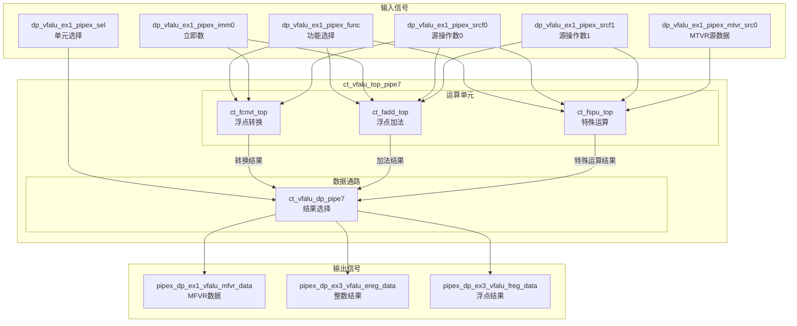
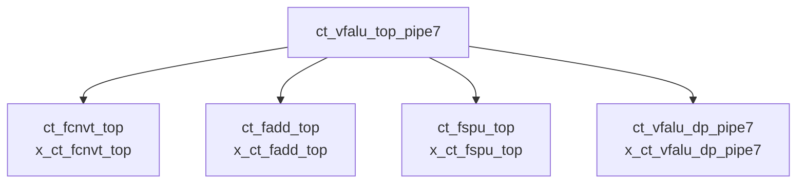

# ct_vfalu_top_pipe7 模块详细方案文档

## 1. 模块概述

### 1.1 基本信息

| 属性 | 值 |
|------|-----|
| 模块名称 | ct_vfalu_top_pipe7 |
| 文件路径 | C910_RTL_FACTORY/gen_rtl/vfalu/rtl/ct_vfalu_top_pipe7.v |
| 模块类型 | 顶层集成模块 |
| 功能分类 | 向量浮点运算单元（VFALU） |

### 1.2 功能描述

ct_vfalu_top_pipe7 是向量浮点ALU（Vector Floating-point ALU）的顶层模块，专门用于Pipe7流水线。该模块集成了三个主要的浮点运算子模块：

1. **ct_fcnvt_top** - 浮点转换模块，负责浮点数与整数之间的转换操作
2. **ct_fadd_top** - 浮点加法模块，负责浮点加减法运算和比较操作
3. **ct_fspu_top** - 浮点特殊运算单元，负责浮点特殊操作（如MTVR/MFVR等）

该模块接收来自译码单元的操作指令和源操作数，通过数据通路模块（ct_vfalu_dp_pipe7）选择并输出最终的运算结果。

### 1.3 设计特点

- 支持多流水线并行执行
- 集成多种浮点运算功能单元
- 支持数据前递机制
- 支持时钟门控以降低功耗
- 兼容IEEE 754浮点标准

## 2. 模块接口说明

### 2.1 输入端口

| 信号名 | 方向 | 位宽 | 描述 |
|--------|------|------|------|
| cp0_vfpu_icg_en | input | 1 | CP0浮点单元时钟门控使能信号 |
| cp0_yy_clk_en | input | 1 | CP0全局时钟使能信号 |
| cpurst_b | input | 1 | 全局复位信号，低电平有效 |
| dp_vfalu_ex1_pipex_func | input | 20 | 来自译码单元的功能选择信号 |
| dp_vfalu_ex1_pipex_imm0 | input | 3 | 来自译码单元的立即数 |
| dp_vfalu_ex1_pipex_mtvr_src0 | input | 64 | MTVR指令的源操作数0 |
| dp_vfalu_ex1_pipex_sel | input | 3 | 运算单元选择信号 |
| dp_vfalu_ex1_pipex_srcf0 | input | 64 | 浮点源操作数0 |
| dp_vfalu_ex1_pipex_srcf1 | input | 64 | 浮点源操作数1 |
| forever_cpuclk | input | 1 | CPU时钟信号 |
| pad_yy_icg_scan_en | input | 1 | 扫描测试时钟门控使能 |
| vfpu_yy_xx_dqnan | input | 1 | 静默NaN检测结果 |
| vfpu_yy_xx_rm | input | 3 | 浮点舍入模式 |

### 2.2 输出端口

| 信号名 | 方向 | 位宽 | 描述 |
|--------|------|------|------|
| pipex_dp_ex1_vfalu_mfvr_data | output | 64 | MFVR指令读取的数据 |
| pipex_dp_ex3_vfalu_ereg_data | output | 5 | EX3阶段整数寄存器数据 |
| pipex_dp_ex3_vfalu_freg_data | output | 64 | EX3阶段浮点寄存器数据 |

## 3. 模块框图

### 3.1 模块架构图

### 3.2 主要数据连线

| 源模块 | 目标模块 | 信号名 | 位宽 | 说明 |
|--------|----------|--------|------|------|
| ct_fcnvt_top | ct_vfalu_dp_pipe7 | fcnvt_forward_result | 64 | 转换结果数据 |
| ct_fcnvt_top | ct_vfalu_dp_pipe7 | fcnvt_forward_r_vld | 1 | 转换结果有效标志 |
| ct_fcnvt_top | ct_vfalu_dp_pipe7 | fcnvt_ereg_forward_result | 5 | 转换整数结果 |
| ct_fcnvt_top | ct_vfalu_dp_pipe7 | fcnvt_ereg_forward_r_vld | 1 | 转换整数结果有效 |
| ct_fadd_top | ct_vfalu_dp_pipe7 | fadd_forward_result | 64 | 加法结果数据 |
| ct_fadd_top | ct_vfalu_dp_pipe7 | fadd_forward_r_vld | 1 | 加法结果有效标志 |
| ct_fadd_top | ct_vfalu_dp_pipe7 | fadd_ereg_ex3_result | 5 | 加法整数结果 |
| ct_fadd_top | ct_vfalu_dp_pipe7 | fadd_ereg_ex3_forward_r_vld | 1 | 加法整数结果有效 |
| ct_fadd_top | ct_vfalu_dp_pipe7 | fadd_mfvr_cmp_result | 64 | MFVR/比较结果 |
| ct_fspu_top | ct_vfalu_dp_pipe7 | fspu_forward_result | 64 | 特殊运算结果 |
| ct_fspu_top | ct_vfalu_dp_pipe7 | fspu_forward_r_vld | 1 | 特殊运算结果有效 |
| ct_fspu_top | ct_vfalu_dp_pipe7 | fspu_mfvr_data | 64 | FSPU MFVR数据 |

## 4. 模块实现方案

### 4.1 整体架构

ct_vfalu_top_pipe7 采用模块化设计，将不同的浮点运算功能分配给专门的子模块处理：

1. **功能分配**：
   - 浮点转换操作（FCVT、FMV等）由 ct_fcnvt_top 处理
   - 浮点加减法、比较操作（FADD、FSUB、FEQ等）由 ct_fadd_top 处理
   - 特殊操作（MTVR、MFVR等）由 ct_fspu_top 处理

2. **数据流**：
   - 所有子模块并行接收输入操作数
   - 根据 dp_vfalu_ex1_pipex_sel 信号选择有效结果
   - 通过 ct_vfalu_dp_pipe7 进行结果选择和输出

### 4.2 时钟与复位

- **时钟信号**：forever_cpuclk 作为主时钟
- **时钟门控**：通过 cp0_vfpu_icg_en 和 cp0_yy_clk_en 控制时钟使能
- **复位信号**：cpurst_b 低电平复位

### 4.3 流水线设计

该模块支持多级流水线操作：
- EX1阶段：接收操作数，启动运算
- EX3阶段：输出最终结果

## 5. 内部关键信号列表

### 5.1 寄存器信号

该模块无内部寄存器信号。

### 5.2 线网信号

| 信号名 | 位宽 | 描述 |
|--------|------|------|
| fadd_ereg_ex3_forward_r_vld | 1 | FADD整数结果前递有效 |
| fadd_ereg_ex3_result | 5 | FADD整数结果数据 |
| fadd_forward_r_vld | 1 | FADD浮点结果前递有效 |
| fadd_forward_result | 64 | FADD浮点结果数据 |
| fadd_mfvr_cmp_result | 64 | FADD MFVR/比较结果 |
| fcnvt_ereg_forward_r_vld | 1 | FCNVT整数结果前递有效 |
| fcnvt_ereg_forward_result | 5 | FCNVT整数结果数据 |
| fcnvt_forward_r_vld | 1 | FCNVT浮点结果前递有效 |
| fcnvt_forward_result | 64 | FCNVT浮点结果数据 |
| fspu_forward_r_vld | 1 | FSPU结果前递有效 |
| fspu_forward_result | 64 | FSPU结果数据 |
| fspu_mfvr_data | 64 | FSPU MFVR数据 |

## 6. 子模块方案

### 6.1 模块例化层次结构

### 6.2 子模块列表

| 层级 | 模块名 | 实例名 | 文件路径 | 功能描述 |
|------|--------|--------|----------|----------|
| 1 | ct_fcnvt_top | x_ct_fcnvt_top | - | 浮点数与整数之间的转换操作 |
| 1 | ct_fadd_top | x_ct_fadd_top | - | 浮点加减法运算和比较操作 |
| 1 | ct_fspu_top | x_ct_fspu_top | - | 浮点特殊运算单元（MTVR/MFVR等） |
| 1 | ct_vfalu_dp_pipe7 | x_ct_vfalu_dp_pipe7 | ct_vfalu_dp_pipe7.v | 数据通路，结果选择和输出 |

### 6.3 子模块功能说明

#### 6.3.1 ct_fcnvt_top（浮点转换模块）

负责处理浮点数与整数之间的转换操作，包括：
- FCVT.S.W / FCVT.S.WU：整数转单精度浮点
- FCVT.D.W / FCVT.D.WU：整数转双精度浮点
- FCVT.W.S / FCVT.WU.S：单精度浮点转整数
- FCVT.W.D / FCVT.WU.D：双精度浮点转整数
- FMV.X.W / FMV.X.D：浮点位模式传送

#### 6.3.2 ct_fadd_top（浮点加法模块）

负责处理浮点加减法和比较操作，包括：
- FADD.S / FADD.D：浮点加法
- FSUB.S / FSUB.D：浮点减法
- FEQ.S / FEQ.D：浮点相等比较
- FLT.S / FLT.D：浮点小于比较
- FLE.S / FLE.D：浮点小于等于比较

#### 6.3.3 ct_fspu_top（浮点特殊运算单元）

负责处理浮点特殊操作，包括：
- MTVR：通用寄存器到向量寄存器传送
- MFVR：向量寄存器到通用寄存器传送
- 其他特殊浮点操作

#### 6.3.4 ct_vfalu_dp_pipe7（数据通路模块）

负责从多个运算单元的结果中选择正确的输出：
- 根据 dp_vfalu_ex1_pipex_sel 选择MFVR数据来源
- 根据各单元的 valid 信号选择最终结果
- 输出浮点寄存器数据和整数寄存器数据

## 7. 数据前递机制

### 7.1 前递路径

| 前递路径 | 源阶段 | 目标阶段 | 说明 |
|----------|--------|----------|------|
| fadd_forward | EX3 | EX1 | FADD结果前递 |
| fcnvt_forward | EX3 | EX1 | FCNVT结果前递 |
| fspu_forward | EX3 | EX1 | FSPU结果前递 |

### 7.2 前递控制

各运算单元独立产生前递有效信号：
- fadd_forward_r_vld：FADD结果有效
- fcnvt_forward_r_vld：FCNVT结果有效
- fspu_forward_r_vld：FSPU结果有效

## 8. 可测试性设计

### 8.1 扫描链支持

- 通过 pad_yy_icg_scan_en 支持扫描测试模式
- 时钟门控单元支持扫描链插入

### 8.2 调试接口

- 各子模块的中间结果可通过前递信号观察
- 支持单步调试模式

## 9. 修订历史

| 版本 | 日期 | 作者 | 说明 |
|------|------|------|------|
| 1.0 | 2026-04-01 | Auto-generated | 初始版本 |
