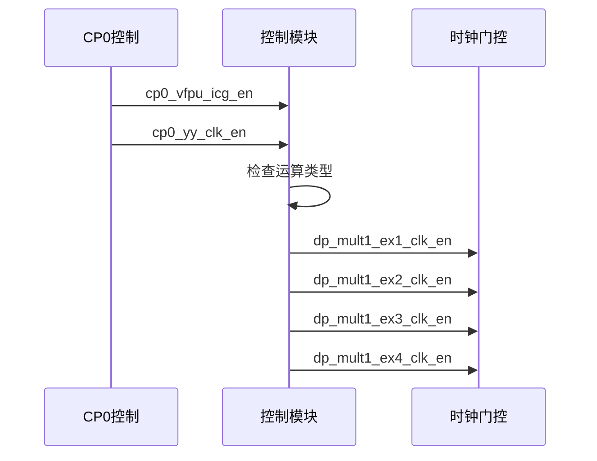
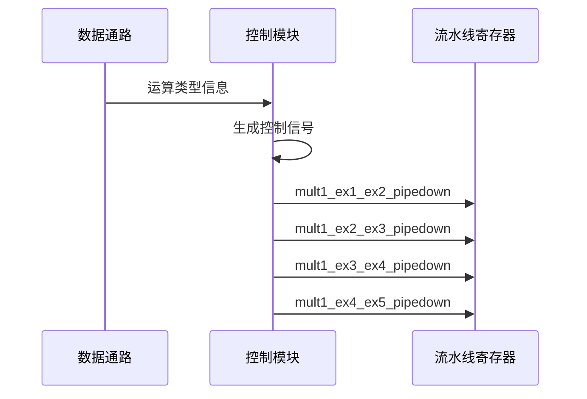
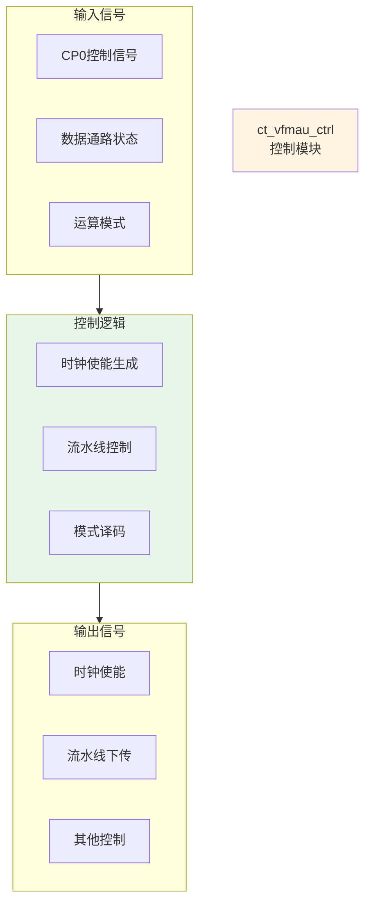
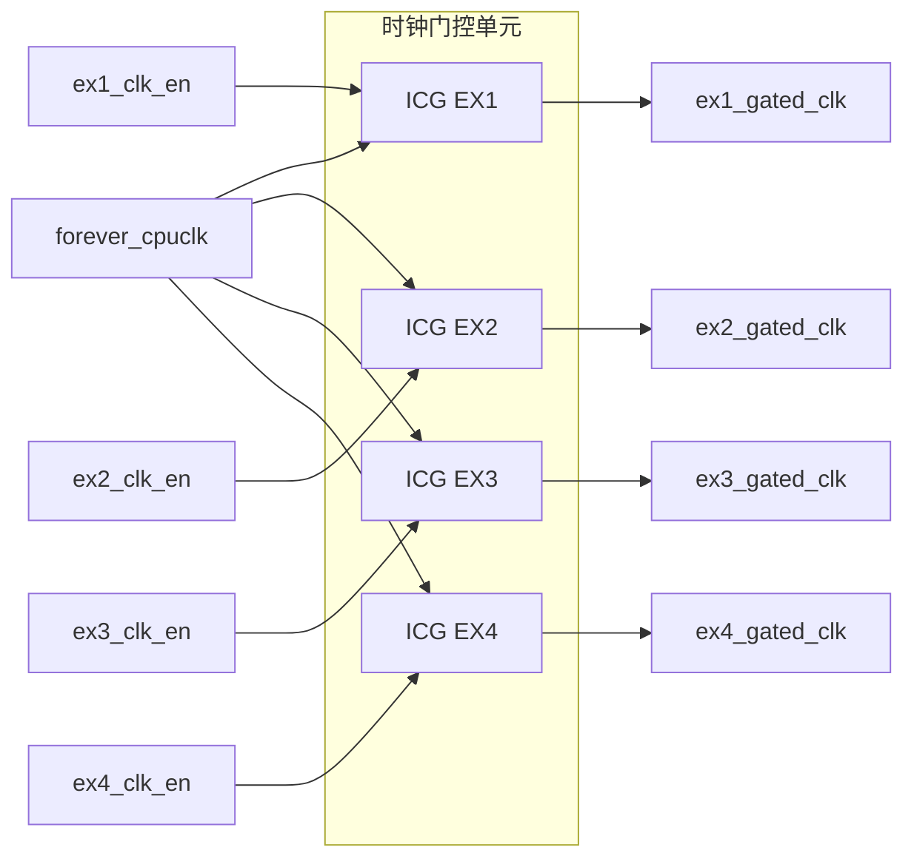
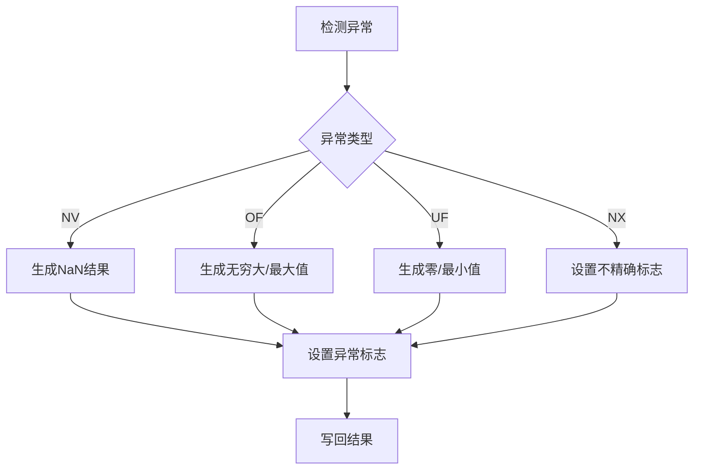

# VFMAU控制模块详细设计文档

## 1. 模块概述

### 1.1 基本信息

| 属性 | 值 |
|------|-----|
| 模块名称 | ct_vfmau_ctrl |
| 文件路径 | C910_RTL_FACTORY/gen_rtl/vfmau/rtl/ct_vfmau_ctrl.v |
| 模块类型 | 控制模块 |
| 功能分类 | 流水线控制与时钟管理 |

### 1.2 功能描述

VFMAU控制模块负责整个向量浮点乘累加单元的控制逻辑，主要功能包括：

1. **时钟门控控制**：生成各级流水线的时钟使能信号，降低功耗
2. **流水线控制**：管理流水线的停顿、刷新和下传操作
3. **异常处理**：处理浮点运算异常，生成异常标志
4. **模式控制**：控制运算模式（双精度、单精度、半精度、SIMD等）
5. **前递控制**：管理流水线间的数据前递逻辑

### 1.3 设计特点

- **细粒度时钟门控**：每级流水线独立的时钟使能控制
- **低功耗设计**：根据运算类型动态关闭不必要的时钟
- **灵活的流水线控制**：支持流水线停顿和刷新
- **完整的异常处理**：符合IEEE 754标准的异常处理机制

## 2. 模块接口说明

### 2.1 输入端口

| 信号名 | 方向 | 位宽 | 描述 |
|--------|------|------|------|
| cp0_vfpu_icg_en | input | 1 | CP0时钟门控使能 |
| cp0_yy_clk_en | input | 1 | CP0全局时钟使能 |
| cpurst_b | input | 1 | 系统复位信号，低有效 |
| forever_cpuclk | input | 1 | CPU主时钟 |
| pad_yy_icg_scan_en | input | 1 | 扫描测试使能 |
| dp_xx_ex1_double | input | 1 | EX1阶段双精度运算标志 |
| dp_xx_ex1_fma | input | 1 | EX1阶段FMA运算标志 |
| dp_xx_ex1_half | input | 1 | EX1阶段半精度运算标志 |
| dp_xx_ex1_simd | input | 1 | EX1阶段SIMD运算标志 |
| dp_xx_ex1_single | input | 1 | EX1阶段单精度运算标志 |
| dp_xx_ex1_widen | input | 1 | EX1阶段宽度扩展标志 |

### 2.2 输出端口

| 信号名 | 方向 | 位宽 | 描述 |
|--------|------|------|------|
| mult1_ex1_ex2_pipedown | output | 1 | EX1到EX2流水线下传使能 |
| mult1_ex2_ex3_pipedown | output | 1 | EX2到EX3流水线下传使能 |
| mult1_ex3_ex4_pipedown | output | 1 | EX3到EX4流水线下传使能 |
| mult1_ex4_ex5_pipedown | output | 1 | EX4到EX5流水线下传使能 |
| dp_mult1_ex1_clk_en | output | 1 | EX1阶段时钟使能 |
| dp_mult1_ex2_clk_en | output | 1 | EX2阶段时钟使能 |
| dp_mult1_ex3_clk_en | output | 1 | EX3阶段时钟使能 |
| dp_mult1_ex4_clk_en | output | 1 | EX4阶段时钟使能 |

### 2.3 接口时序图

#### 2.3.1 时钟门控控制时序



#### 2.3.2 流水线控制时序



## 3. 模块框图

### 3.1 模块架构图



### 3.2 时钟门控结构图



## 4. 模块实现方案

### 4.1 时钟使能生成逻辑

控制模块根据以下条件生成各级流水线的时钟使能信号：

1. **全局使能检查**：
   - cp0_yy_clk_en必须为1
   - cp0_vfpu_icg_en必须为1

2. **运算类型判断**：
   - 根据dp_xx_ex1_double/single/half判断精度
   - 根据dp_xx_ex1_simd判断是否为SIMD运算
   - 根据dp_xx_ex1_fma判断是否为FMA运算

3. **时钟使能生成**：
   - EX1阶段：有运算请求时使能
   - EX2-EX4阶段：根据前一流水级状态决定

### 4.2 流水线下传控制

流水线下传信号控制数据在流水线寄存器间的传递：

| 条件 | 动作 |
|------|------|
| 正常运算 | 下传使能有效，数据传递到下一级 |
| 流水线停顿 | 下传使能无效，数据保持在当前级 |
| 流水线刷新 | 下传使能无效，数据被清除 |

### 4.3 模式译码逻辑

根据输入的运算模式信号，生成相应的控制信号：

```verilog
// 运算模式译码示例
always @(*) begin
    case({dp_xx_ex1_double, dp_xx_ex1_single, dp_xx_ex1_half})
        3'b100: mode = DOUBLE;  // 双精度
        3'b010: mode = SINGLE;  // 单精度
        3'b001: mode = HALF;    // 半精度
        default: mode = IDLE;   // 空闲
    endcase
end
```

### 4.4 低功耗设计

控制模块采用以下低功耗技术：

1. **时钟门控**：
   - 每级流水线独立时钟门控
   - 无运算时关闭时钟
   - 减少动态功耗

2. **运算类型优化**：
   - 半精度运算时关闭高精度单元
   - SIMD运算时并行处理多个数据
   - 避免不必要的计算

3. **状态管理**：
   - 空闲状态进入低功耗模式
   - 快速唤醒机制
   - 状态保持电路

## 5. 内部关键信号列表

### 5.1 寄存器信号

| 信号名 | 位宽 | 描述 |
|--------|------|------|
| ctrl_ex1_clk_en_reg | 1 | EX1时钟使能寄存器 |
| ctrl_ex2_clk_en_reg | 1 | EX2时钟使能寄存器 |
| ctrl_ex3_clk_en_reg | 1 | EX3时钟使能寄存器 |
| ctrl_ex4_clk_en_reg | 1 | EX4时钟使能寄存器 |

### 5.2 线网信号

| 信号名 | 位宽 | 描述 |
|--------|------|------|
| global_clk_en | 1 | 全局时钟使能 |
| ex1_pipe_en | 1 | EX1流水线使能 |
| ex2_pipe_en | 1 | EX2流水线使能 |
| ex3_pipe_en | 1 | EX3流水线使能 |
| ex4_pipe_en | 1 | EX4流水线使能 |

## 6. 控制信号时序

### 6.1 正常运算流程

| 周期 | EX1 | EX2 | EX3 | EX4 | EX5 |
|------|-----|-----|-----|-----|-----|
| 1 | 运算开始 | - | - | - | - |
| 2 | 下传 | 运算 | - | - | - |
| 3 | - | 下传 | 运算 | - | - |
| 4 | - | - | 下传 | 运算 | - |
| 5 | - | - | - | 下传 | 运算 |
| 6 | - | - | - | - | 结果输出 |

### 6.2 流水线停顿场景

| 场景 | 停顿原因 | 处理方式 |
|------|----------|----------|
| 数据冒险 | 等待前递数据 | 暂停EX1阶段 |
| 资源冲突 | 多个运算同时请求 | 按优先级调度 |
| 异常处理 | 检测到异常 | 刷新流水线 |

## 7. 异常处理机制

### 7.1 浮点异常类型

| 异常类型 | 标志 | 触发条件 |
|----------|------|----------|
| 无效操作 (NV) | 1 | NaN运算、无穷大×0等 |
| 溢出 (OF) | 1 | 结果超出表示范围 |
| 下溢 (UF) | 1 | 结果太小无法表示 |
| 除零 (DZ) | 1 | 除数为零（FMA不涉及） |
| 不精确 (NX) | 1 | 结果需要舍入 |

### 7.2 异常处理流程



## 8. 可测试性设计

### 8.1 测试模式

| 模式 | 描述 |
|------|------|
| 正常模式 | 正常运算操作 |
| 扫描模式 | 扫描链测试 |
| BIST模式 | 内建自测试 |

### 8.2 测试点

- 各级流水线寄存器状态
- 时钟使能信号
- 流水线控制信号
- 异常标志

## 9. 性能指标

### 9.1 时序特性

| 参数 | 典型值 | 说明 |
|------|--------|------|
| 控制逻辑延迟 | < 0.5ns | 从输入到控制信号输出 |
| 时钟偏斜 | < 50ps | 各级时钟门控输出 |

### 9.2 功耗特性

| 模式 | 功耗 | 说明 |
|------|------|------|
| 全速运算 | 100% | 所有流水线使能 |
| 部分使能 | 50-80% | 部分流水线使能 |
| 空闲 | < 5% | 时钟门控关闭 |

## 10. 修订历史

| 版本 | 日期 | 作者 | 说明 |
|------|------|------|------|
| 1.0 | 2024-01-XX | Auto-generated | 初始版本 |
