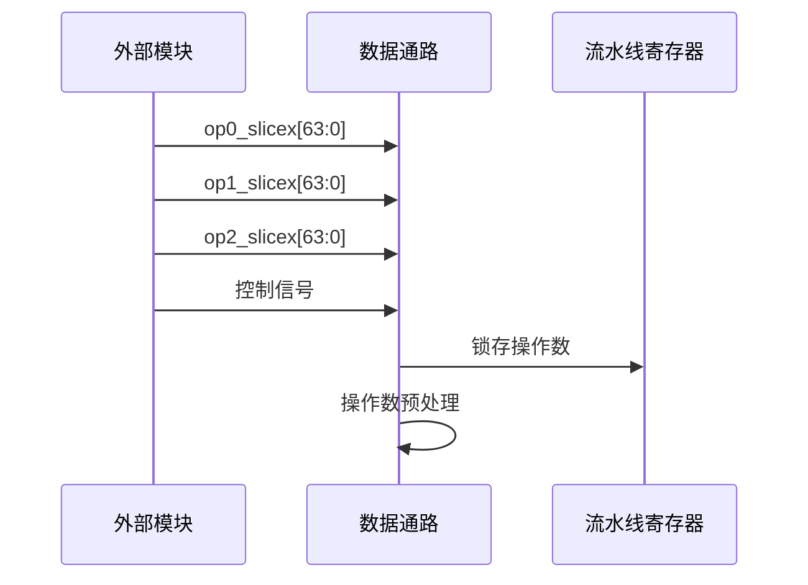
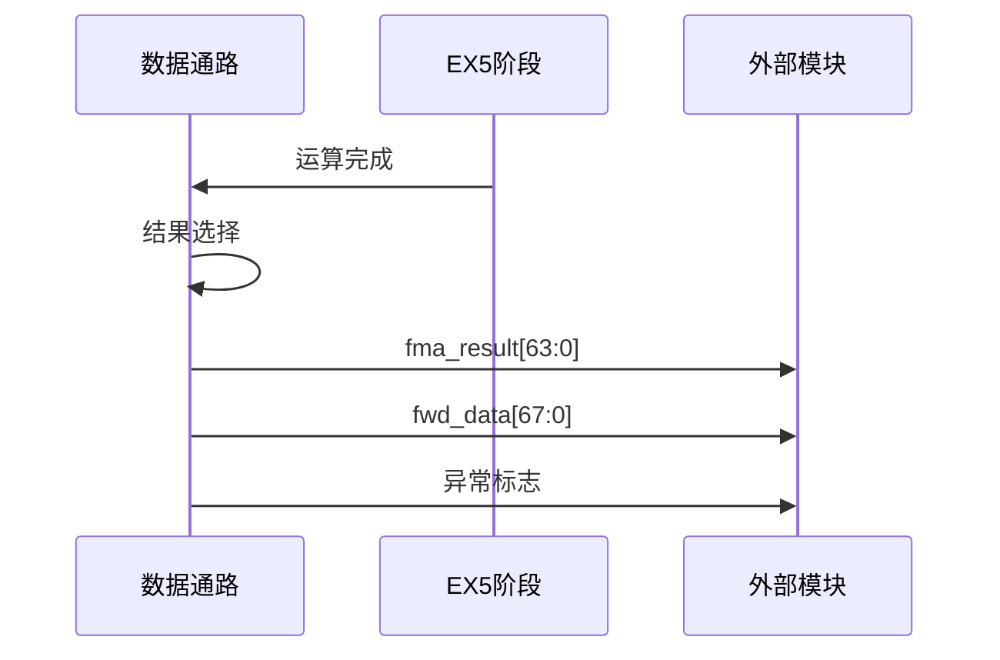
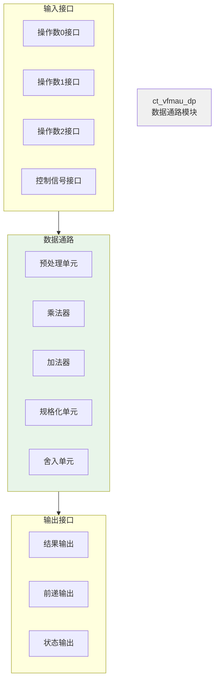
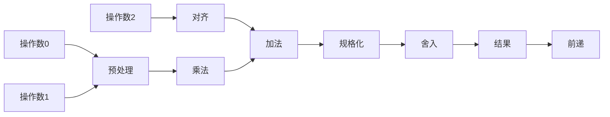

# VFMAU数据通路模块详细设计文档

## 1. 模块概述

### 1.1 基本信息

| 属性 | 值 |
|------|-----|
| 模块名称 | ct_vfmau_dp |
| 文件路径 | C910_RTL_FACTORY/gen_rtl/vfmau/rtl/ct_vfmau_dp.v |
| 模块类型 | 数据通路模块 |
| 功能分类 | 浮点运算数据通路 |

### 1.2 功能描述

VFMAU数据通路模块是向量浮点乘累加单元的核心运算模块，包含主要的运算数据通路。主要功能包括：

1. **操作数管理**：接收、存储和传递操作数数据
2. **运算执行**：执行浮点乘法和乘累加运算
3. **结果输出**：生成并输出运算结果
4. **前递支持**：支持流水线间的数据前递
5. **特殊值处理**：处理NaN、无穷大、零等特殊值

### 1.3 设计特点

- **完整的数据通路**：包含从输入到输出的完整数据路径
- **多精度支持**：支持双精度、单精度和半精度运算
- **SIMD优化**：支持单指令多数据并行运算
- **前递机制**：减少数据冒险，提高性能
- **IEEE 754兼容**：完全符合浮点运算标准

## 2. 模块接口说明

### 2.1 输入端口

| 信号名 | 方向 | 位宽 | 描述 |
|--------|------|------|------|
| dp_mult1_ex1_op0_slicex | input | 64 | 操作数0数据 |
| dp_mult1_ex1_op0_slicex_high | input | 32 | 操作数0高位数据（NaN-boxing） |
| dp_mult1_ex1_op1_slicex | input | 64 | 操作数1数据 |
| dp_mult1_ex1_op1_slicex_high | input | 32 | 操作数1高位数据 |
| dp_mult1_ex1_op2_slicex | input | 64 | 操作数2数据（FMA累加数） |
| dp_mult1_ex1_op2_slicex_high | input | 32 | 操作数2高位数据 |
| dp_xx_ex1_double | input | 1 | 双精度运算标志 |
| dp_xx_ex1_fma | input | 1 | FMA运算标志 |
| dp_xx_ex1_half | input | 1 | 半精度运算标志 |
| dp_xx_ex1_single | input | 1 | 单精度运算标志 |
| dp_xx_ex1_simd | input | 1 | SIMD运算标志 |
| dp_xx_ex1_widen | input | 1 | 宽度扩展标志 |
| dp_xx_ex1_neg | input | 1 | 取负标志 |
| dp_xx_ex1_sub | input | 1 | 减法标志 |
| dp_xx_ex1_rm | input | 3 | 舍入模式 |
| dp_xx_ex1_op0_frac | input | 52 | 操作数0尾数 |
| dp_xx_ex1_op1_frac | input | 52 | 操作数1尾数 |

### 2.2 输出端口

| 信号名 | 方向 | 位宽 | 描述 |
|--------|------|------|------|
| slicex_mult1_dp_ex5_fma_result | output | 64 | FMA运算结果 |
| slicex_mult1_dp_ex5_fwd_data | output | 68 | 前递数据 |
| slicex_mult1_dp_ex5_fma_expt | output | 5 | FMA运算指数 |
| slicex_mult1_dp_ex4_mult_result | output | 64 | EX4阶段乘法结果 |
| slicex_mult1_dp_ex4_expt | output | 5 | EX4阶段指数 |
| slicex_mult1_dp_ex3_mult_result | output | 64 | EX3阶段乘法结果 |
| slicex_mult1_dp_ex3_mult_expt | output | 5 | EX3阶段指数 |
| slicex_dp_mult1_mult_id | output | 1 | 乘法结果为非规格化数标志 |

### 2.3 接口时序图

#### 2.3.1 操作数输入时序



#### 2.3.2 结果输出时序



## 3. 模块框图

### 3.1 模块架构图



### 3.2 数据流图



## 4. 模块实现方案

### 4.1 操作数预处理

**功能描述**：
- 解析操作数的符号、指数和尾数
- 判断操作数类型（零、无穷大、NaN、规格化数、非规格化数）
- 处理NaN-boxing（单精度数据在双精度寄存器中的扩展）

**实现逻辑**：
```verilog
// 操作数分解
assign op0_sign = op0_slicex[63];
assign op0_expnt[10:0] = op0_slicex[62:52];
assign op0_frac[51:0] = op0_slicex[51:0];

// 操作数类型判断
assign op0_zero = (op0_expnt == 0) && (op0_frac == 0);
assign op0_inf = (op0_expnt == 11'b11111111111) && (op0_frac == 0);
assign op0_nan = (op0_expnt == 11'b11111111111) && (op0_frac != 0);
```

### 4.2 乘法运算

**功能描述**：
- 执行操作数0和操作数1的乘法
- 支持Booth编码和压缩树结构
- 支持SIMD并行乘法

**实现要点**：
1. **Booth编码**：将乘数编码为Booth码，减少部分积数量
2. **部分积压缩**：使用Wallace树或压缩器压缩部分积
3. **符号处理**：异或操作得到结果符号
4. **指数计算**：E_result = E0 + E1 - bias

### 4.3 累加运算（FMA）

**功能描述**：
- 将乘法结果与操作数2相加
- 支持加法和减法操作
- 处理对齐和移位

**实现要点**：
1. **移位对齐**：根据指数差对操作数2进行移位
2. **加法操作**：大位宽加法器执行加法
3. **进位处理**：处理进位传播和生成

### 4.4 规格化

**功能描述**：
- 前导零检测和移位
- 指数调整
- 处理进位导致的额外移位

**实现要点**：
1. **LZA计算**：并行计算前导零位置
2. **左移操作**：根据LZA结果进行左移
3. **指数修正**：指数减去前导零数量

### 4.5 舍入

**功能描述**：
- 根据舍入模式进行舍入
- 支持IEEE 754定义的5种舍入模式
- 生成舍入后的最终结果

**舍入模式**：
| RM[2:0] | 名称 | 描述 |
|---------|------|------|
| 000 | RNE | 向最近偶数舍入 |
| 001 | RTZ | 向零舍入 |
| 010 | RDN | 向负无穷舍入 |
| 011 | RUP | 向正无穷舍入 |
| 100 | RMM | 向最近最大值舍入 |

### 4.6 特殊值处理

**特殊值类型**：
1. **零**：零乘任何数为零
2. **无穷大**：无穷大乘非零数为无穷大
3. **NaN**：NaN参与运算结果为NaN
4. **非规格化数**：特殊处理或转换为规格化数

**处理逻辑**：
```verilog
// 特殊值结果选择
always @(*) begin
    if (op_nan)
        result = nan_result;
    else if (op_inf)
        result = inf_result;
    else if (op_zero)
        result = zero_result;
    else
        result = normal_result;
end
```

## 5. 内部关键信号列表

### 5.1 寄存器信号

| 信号名 | 位宽 | 描述 |
|--------|------|------|
| dp_ex1_op0_reg | 64 | EX1阶段操作数0寄存器 |
| dp_ex1_op1_reg | 64 | EX1阶段操作数1寄存器 |
| dp_ex1_op2_reg | 64 | EX1阶段操作数2寄存器 |
| dp_ex2_mult_result_reg | 64 | EX2阶段乘法结果寄存器 |
| dp_ex3_add_result_reg | 64 | EX3阶段加法结果寄存器 |
| dp_ex4_norm_result_reg | 64 | EX4阶段规格化结果寄存器 |
| dp_ex5_final_result_reg | 64 | EX5阶段最终结果寄存器 |

### 5.2 线网信号

| 信号名 | 位宽 | 描述 |
|--------|------|------|
| op0_sign | 1 | 操作数0符号 |
| op0_expnt | 11 | 操作数0指数 |
| op0_frac | 52 | 操作数0尾数 |
| mult_sign | 1 | 乘法结果符号 |
| mult_expnt | 13 | 乘法结果指数 |
| mult_frac | 105 | 乘法结果尾数 |

## 6. 数据前递机制

### 6.1 前递路径

| 前递源 | 前递目标 | 数据内容 | 延迟 |
|--------|----------|----------|------|
| EX4 | EX1 | 部分结果 | 3周期 |
| EX5 | EX1 | 完整结果 | 4周期 |
| EX5 | EX2 | 完整结果 | 3周期 |

### 6.2 前递数据格式

前递数据包含以下信息：
- 符号位（1位）
- 指数（11位）
- 尾数（52位）
- 特殊标志（4位）

总计：68位

### 6.3 前递控制逻辑

```verilog
// 前递数据选择
assign fwd_data[67:0] = {
    special_flag[3:0],  // 特殊标志
    sign,               // 符号
    expnt[10:0],        // 指数
    frac[51:0]          // 尾数
};

// 前递使能
assign fwd_vld = ex5_valid && fma_operation;
```

## 7. SIMD运算支持

### 7.1 SIMD模式

VFMAU支持以下SIMD模式：
- **双精度**：1个64位运算
- **单精度**：2个32位并行运算
- **半精度**：4个16位并行运算

### 7.2 SIMD数据组织

**单精度SIMD**：
```
[63:32] - 第1个单精度数据
[31:0]  - 第0个单精度数据
```

**半精度SIMD**：
```
[63:48] - 第3个半精度数据
[47:32] - 第2个半精度数据
[31:16] - 第1个半精度数据
[15:0]  - 第0个半精度数据
```

### 7.3 SIMD控制信号

| 信号 | 描述 |
|------|------|
| dp_xx_ex1_simd | SIMD模式使能 |
| dp_xx_ex1_half | 半精度SIMD |
| dp_xx_ex1_single | 单精度SIMD |

## 8. 异常处理

### 8.1 异常检测

数据通路模块检测以下异常：
1. **无效操作（NV）**：NaN运算、无穷大×0等
2. **溢出（OF）**：结果超出表示范围
3. **下溢（UF）**：结果太小无法表示
4. **不精确（NX）**：结果需要舍入

### 8.2 异常标志生成

```verilog
// 无效操作异常
assign nv_flag = op_snan || (op0_inf && op1_zero);

// 溢出异常
assign of_flag = (expnt_result > MAX_EXPNT);

// 下溢异常
assign uf_flag = (expnt_result < MIN_EXPNT);

// 不精确异常
assign nx_flag = (round_needed);
```

## 9. 性能优化

### 9.1 关键路径优化

1. **乘法器优化**：
   - 使用Booth编码减少部分积
   - 使用压缩树加速部分积压缩
   - 流水化乘法操作

2. **加法器优化**：
   - 使用超前进位加法器
   - 并行计算进位
   - 分段加法

3. **规格化优化**：
   - LZA并行计算
   - 提前开始移位操作

### 9.2 面积优化

1. **资源共享**：多个运算共享同一硬件
2. **SIMD复用**：不同精度使用同一硬件
3. **门控时钟**：减少不必要的翻转

## 10. 可测试性设计

### 10.1 测试点

- 操作数寄存器
- 中间结果寄存器
- 最终结果寄存器
- 异常标志寄存器

### 10.2 调试支持

- 关键信号可观测
- 支持单步执行
- 流水线状态可查询

## 11. 修订历史

| 版本 | 日期 | 作者 | 说明 |
|------|------|------|------|
| 1.0 | 2024-01-XX | Auto-generated | 初始版本 |
