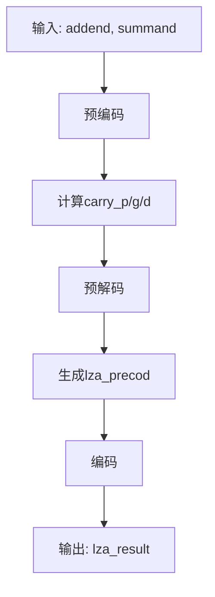
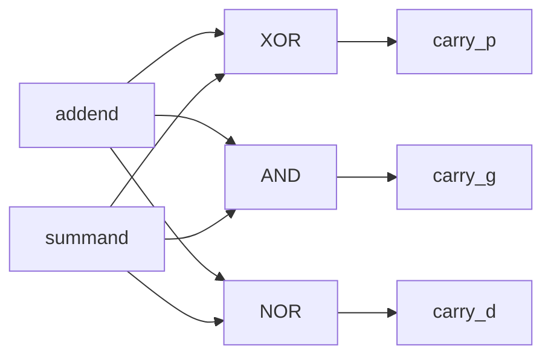

# VFMAU前导零预测模块详细设计文档

## 1. 模块概述

### 1.1 基本信息

| 属性 | 值 |
|------|-----|
| 模块名称 | ct_vfmau_lza |
| 文件路径 | C910_RTL_FACTORY/gen_rtl/vfmau/rtl/ct_vfmau_lza.v |
| 模块类型 | 组合逻辑模块 |
| 功能分类 | 前导零预测 |

### 1.2 功能描述

前导零预测（LZA，Leading Zero Anticipator）模块并行计算加法结果的前导零位置，无需等待加法完成即可预测规格化所需的移位量。主要功能包括：

1. **前导零预测**：并行计算前导零位置
2. **加法结果预测**：预测加法结果的前导零
3. **规格化加速**：提前开始规格化移位
4. **多精度支持**：支持不同位宽的前导零计算

### 1.3 设计特点

- **并行计算**：与加法操作并行执行
- **提前预测**：无需等待加法完成
- **高准确度**：预测结果准确度高
- **低延迟**：组合逻辑实现，延迟小

## 2. 模块接口说明

### 2.1 输入端口

| 信号名 | 方向 | 位宽 | 描述 |
|--------|------|------|------|
| addend | input | 107 | 加数 |
| summand | input | 107 | 被加数 |
| sub_vld | input | 1 | 减法有效标志 |

### 2.2 输出端口

| 信号名 | 方向 | 位宽 | 描述 |
|--------|------|------|------|
| lza_result | output | 7 | 前导零位置 |
| lza_result_zero | output | 1 | 结果为零标志 |

## 3. 模块框图

### 3.1 LZA算法流程图



### 3.2 预编码逻辑图



## 4. 模块实现方案

### 4.1 LZA算法原理

LZA算法基于以下观察：
- 加法结果的前导零可以通过分析操作数的carry propagate、generate和delete信号来预测
- 不需要等待加法完成即可得到预测结果

### 4.2 预编码实现

计算carry propagate、generate和delete信号：

```verilog
// carry_p: carry propagate - 进位传播
assign carry_p = summand ^ addend;

// carry_g: carry generate - 进位生成
assign carry_g = summand & addend;

// carry_d: carry delete - 进位消除
assign carry_d = ~(summand | addend);
```

### 4.3 预解码实现

根据carry_p、carry_g、carry_d生成预解码信号：

```verilog
// 最低位预解码
assign lza_precod[0] = 
     carry_p[1] && (carry_g[0] && sub_vld || carry_d[0])
  || !carry_p[1] && (carry_d[0] && sub_vld || carry_g[0]);

// 中间位预解码
assign lza_precod[i] = 
     carry_p[i+1] && (carry_g[i] && ~carry_d[i-1] || carry_d[i] && ~carry_g[i-1])
  || !carry_p[i+1] && (carry_g[i] && ~carry_g[i-1] || carry_d[i] && ~carry_d[i-1]);

// 最高位预解码
assign lza_precod[N] = 
     sub_vld && (carry_g[N] && !carry_d[N-1] || carry_d[N] && !carry_g[N-1])
  || !sub_vld && (carry_d[N] && !carry_d[N-1] || !carry_d[N]);
```

### 4.4 编码实现

根据预解码信号计算前导零位置：

```verilog
// 优先编码器
always @(*) begin
    casez(lza_precod)
        107'b1????...?: lza_result = 7'd0;
        107'b01???...?: lza_result = 7'd1;
        107'b001??...?: lza_result = 7'd2;
        // ... 其他情况
        default: lza_result = 7'd106;
    endcase
end

// 结果为零标志
assign lza_result_zero = ~|lza_precod;
```

## 5. LZA模块系列

VFMAU包含多个LZA模块，用于不同位宽和精度：

### 5.1 ct_vfmau_lza_32

32位前导零预测模块：

| 属性 | 值 |
|------|-----|
| 输入位宽 | 32位 |
| 输出位宽 | 5位 |
| 用途 | 单精度运算 |

### 5.2 ct_vfmau_lza_42

42位前导零预测模块：

| 属性 | 值 |
|------|-----|
| 输入位宽 | 42位 |
| 输出位宽 | 6位 |
| 用途 | 扩展精度运算 |

实现逻辑：
```verilog
assign lza_vld = |lza_precod[3:0];
assign lza_p0 = !lza_precod[3] && (lza_precod[2] || !lza_precod[1]);
assign lza_p1 = !(lza_precod[2] || lza_precod[3]);
```

### 5.3 ct_vfmau_lza_simd_half

SIMD半精度前导零预测模块：

| 属性 | 值 |
|------|-----|
| 输入位宽 | 24位 |
| 输出位宽 | 5位 |
| 用途 | 半精度SIMD运算 |

实现逻辑：
```verilog
// 24位优先编码器
always @(*) begin
    casez(lza_precod[23:0])
        24'b1???????????????????????: lza_result = 5'd0;
        24'b01??????????????????????: lza_result = 5'd1;
        // ... 其他情况
        24'b000000000000000000000001: lza_result = 5'd23;
        default: lza_result = 5'd24;
    endcase
end
```

## 6. 性能分析

### 6.1 延迟分析

| 模块 | 延迟（门级） | 说明 |
|------|--------------|------|
| 预编码 | 2级 | XOR/AND/NOR门 |
| 预解码 | 3级 | 组合逻辑 |
| 编码 | 4级 | 优先编码器 |
| 总延迟 | 9级 | 约0.3ns @ 28nm |

### 6.2 准确度分析

LZA预测可能存在以下误差：

| 误差类型 | 原因 | 处理方式 |
|----------|------|----------|
| 预测值偏大 | 进位链影响 | EX4阶段修正 |
| 预测值偏小 | 特殊模式 | EX4阶段修正 |
| 预测失败 | 全零输入 | 使用lza_result_zero标志 |

## 7. 修订历史

| 版本 | 日期 | 作者 | 说明 |
|------|------|------|------|
| 1.0 | 2024-01-XX | Auto-generated | 初始版本 |
