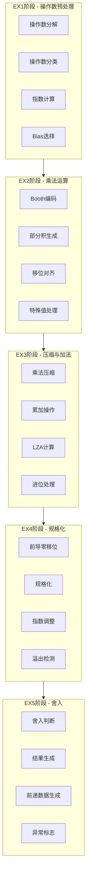
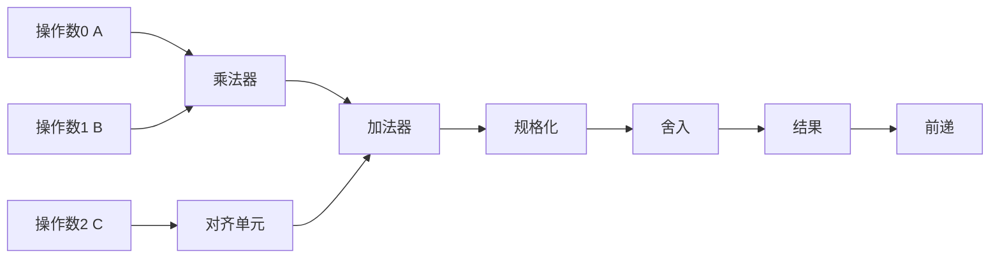

# VFMAU乘法器模块详细设计文档

## 1. 模块概述

### 1.1 基本信息

| 属性 | 值 |
|------|-----|
| 模块名称 | ct_vfmau_mult1 |
| 文件路径 | C910_RTL_FACTORY/gen_rtl/vfmau/rtl/ct_vfmau_mult1.v |
| 模块类型 | 乘法器模块 |
| 功能分类 | 浮点乘法与乘累加运算 |

### 1.2 功能描述

VFMAU乘法器模块是向量浮点乘累加单元的核心运算模块，实现了完整的5级流水线浮点乘法和乘累加运算。主要功能包括：

1. **浮点乘法运算**：执行双操作数乘法A×B
2. **浮点乘累加运算**：执行三操作数乘累加A×B+C
3. **多精度支持**：支持双精度、单精度和半精度浮点运算
4. **SIMD运算**：支持单指令多数据并行运算
5. **特殊值处理**：处理NaN、无穷大、零、非规格化数
6. **前导零预测**：并行计算前导零位置，加速规格化
7. **IEEE 754舍入**：支持5种舍入模式
8. **数据前递**：支持流水线间数据前递

### 1.3 设计特点

- **5级流水线**：EX1→EX2→EX3→EX4→EX5，实现高吞吐率
- **Booth编码**：使用Booth编码减少部分积数量
- **压缩树结构**：使用Wallace树或压缩器加速部分积压缩
- **LZA技术**：前导零预测技术加速规格化过程
- **前递机制**：支持EX4和EX5阶段的数据前递
- **IEEE 754兼容**：完全符合IEEE 754浮点运算标准

## 2. 模块接口说明

### 2.1 输入端口

#### 2.1.1 时钟与复位

| 信号名 | 方向 | 位宽 | 描述 |
|--------|------|------|------|
| forever_cpuclk | input | 1 | CPU主时钟 |
| cpurst_b | input | 1 | 系统复位，低有效 |
| cp0_vfpu_icg_en | input | 1 | CP0时钟门控使能 |
| cp0_yy_clk_en | input | 1 | CP0全局时钟使能 |
| pad_yy_icg_scan_en | input | 1 | 扫描测试使能 |

#### 2.1.2 操作数输入

| 信号名 | 方向 | 位宽 | 描述 |
|--------|------|------|------|
| dp_mult1_ex1_op0_slicex | input | 64 | 操作数0（乘数A） |
| dp_mult1_ex1_op0_slicex_high | input | 32 | 操作数0高位（NaN-boxing） |
| dp_mult1_ex1_op1_slicex | input | 64 | 操作数1（被乘数B） |
| dp_mult1_ex1_op1_slicex_high | input | 32 | 操作数1高位 |
| dp_mult1_ex1_op2_slicex | input | 64 | 操作数2（累加数C） |
| dp_mult1_ex1_op2_slicex_high | input | 32 | 操作数2高位 |
| dp_xx_ex1_op0_frac | input | 52 | 操作数0尾数 |
| dp_xx_ex1_op1_frac | input | 52 | 操作数1尾数 |

#### 2.1.3 控制信号

| 信号名 | 方向 | 位宽 | 描述 |
|--------|------|------|------|
| dp_xx_ex1_double | input | 1 | 双精度运算标志 |
| dp_xx_ex1_fma | input | 1 | FMA运算标志 |
| dp_xx_ex1_half | input | 1 | 半精度运算标志 |
| dp_xx_ex1_single | input | 1 | 单精度运算标志 |
| dp_xx_ex1_simd | input | 1 | SIMD运算标志 |
| dp_xx_ex1_widen | input | 1 | 宽度扩展标志 |
| dp_xx_ex1_neg | input | 1 | 取负标志 |
| dp_xx_ex1_sub | input | 1 | 减法标志 |
| dp_xx_ex1_rm | input | 3 | 舍入模式 |
| dp_xx_ex2_rm | input | 3 | EX2阶段舍入模式 |
| dp_xx_ex3_rm | input | 3 | EX3阶段舍入模式 |
| dp_xx_ex4_rm | input | 3 | EX4阶段舍入模式 |

#### 2.1.4 流水线控制

| 信号名 | 方向 | 位宽 | 描述 |
|--------|------|------|------|
| dp_mult1_ex1_clk_en | input | 1 | EX1时钟使能 |
| dp_mult1_ex2_clk_en | input | 1 | EX2时钟使能 |
| dp_mult1_ex3_clk_en | input | 1 | EX3时钟使能 |
| dp_mult1_ex4_clk_en | input | 1 | EX4时钟使能 |
| mult1_ex1_ex2_pipedown | input | 1 | EX1→EX2下传使能 |
| mult1_ex2_ex3_pipedown | input | 1 | EX2→EX3下传使能 |
| mult1_ex3_ex4_pipedown | input | 1 | EX3→EX4下传使能 |
| mult1_ex4_ex5_pipedown | input | 1 | EX4→EX5下传使能 |

#### 2.1.5 前递输入

| 信号名 | 方向 | 位宽 | 描述 |
|--------|------|------|------|
| pipe6_pipex_ex4_fmla_fwd_vld | input | 1 | Pipe6 EX4前递有效 |
| pipe6_pipex_ex5_ex1_fmla_fwd_vld | input | 1 | Pipe6 EX5→EX1前递有效 |
| pipe6_pipex_ex5_ex2_fmla_fwd_vld | input | 1 | Pipe6 EX5→EX2前递有效 |
| pipe6_vfmau_ex4_fmla_slicex_half0_data | input | 16 | Pipe6 EX4前递数据（半精度） |
| pipe6_vfmau_ex5_fmla_slicex_data | input | 68 | Pipe6 EX5前递数据 |
| pipe7_pipex_ex4_fmla_fwd_vld | input | 1 | Pipe7 EX4前递有效 |
| pipe7_pipex_ex5_ex1_fmla_fwd_vld | input | 1 | Pipe7 EX5→EX1前递有效 |
| pipe7_pipex_ex5_ex2_fmla_fwd_vld | input | 1 | Pipe7 EX5→EX2前递有效 |
| pipe7_vfmau_ex4_fmla_slicex_half0_data | input | 16 | Pipe7 EX4前递数据（半精度） |
| pipe7_vfmau_ex5_fmla_slicex_data | input | 68 | Pipe7 EX5前递数据 |

### 2.2 输出端口

| 信号名 | 方向 | 位宽 | 描述 |
|--------|------|------|------|
| slicex_mult1_dp_ex5_fma_result | output | 64 | FMA运算结果 |
| slicex_mult1_dp_ex5_fwd_data | output | 68 | 前递数据 |
| slicex_mult1_dp_ex5_fma_expt | output | 5 | FMA运算指数 |
| slicex_mult1_dp_ex4_mult_result | output | 64 | EX4阶段乘法结果 |
| slicex_mult1_dp_ex4_expt | output | 5 | EX4阶段指数 |
| slicex_mult1_dp_ex4_half_fma_result | output | 16 | EX4半精度FMA结果 |
| slicex_mult1_dp_ex3_mult_result | output | 64 | EX3阶段乘法结果 |
| slicex_mult1_dp_ex3_mult_expt | output | 5 | EX3阶段指数 |
| slicex_dp_mult1_mult_id | output | 1 | 乘法结果为非规格化数标志 |
| slicex_dp_half0_mult_id | output | 1 | 半精度通道0非规格化数标志 |

## 3. 模块框图

### 3.1 流水线架构图



### 3.2 数据通路框图



## 4. 流水线详细设计

### 4.1 EX1阶段 - 操作数预处理

#### 4.1.1 功能描述

EX1阶段主要负责操作数的预处理，包括操作数分解、类型判断和指数计算。

#### 4.1.2 操作数分解

将64位浮点数分解为符号、指数和尾数三部分：

```verilog
// 操作数0分解
assign mult1_ex1_op0_sign = dp_mult1_ex1_op0_slicex[63];
assign mult1_ex1_op0_expnt[10:0] = dp_mult1_ex1_op0_slicex[62:52];
assign mult1_ex1_op0_frac[51:0] = dp_mult1_ex1_op0_slicex[51:0];

// 操作数1分解
assign mult1_ex1_op1_sign = dp_mult1_ex1_op1_slicex[63];
assign mult1_ex1_op1_expnt[10:0] = dp_mult1_ex1_op1_slicex[62:52];
assign mult1_ex1_op1_frac[51:0] = dp_mult1_ex1_op1_slicex[51:0];

// 操作数2分解（FMA时使用）
assign mult1_ex1_op2_sign = dp_mult1_ex1_op2_slicex[63];
assign mult1_ex1_op2_expnt[10:0] = dp_mult1_ex1_op2_slicex[62:52];
assign mult1_ex1_op2_frac[51:0] = dp_mult1_ex1_op2_slicex[51:0];
```

#### 4.1.3 操作数类型判断

判断操作数是否为特殊值：

```verilog
// 指数为无穷大（全1）
assign mult1_ex1_expnt0_inf = &mult1_ex1_op0_expnt[10:0];
assign mult1_ex1_expnt1_inf = &mult1_ex1_op1_expnt[10:0];
assign mult1_ex1_expnt2_inf = &mult1_ex1_op2_expnt[10:0];

// 指数为零
assign mult1_ex1_expnt0_zero = ~|mult1_ex1_op0_expnt[10:0];
assign mult1_ex1_expnt1_zero = ~|mult1_ex1_op1_expnt[10:0];
assign mult1_ex1_expnt2_zero = ~|mult1_ex1_op2_expnt[10:0];

// 尾数为零
assign mult1_ex1_frac0_all_zero = ~|mult1_ex1_op0_frac[51:0];
assign mult1_ex1_frac1_all_zero = ~|mult1_ex1_op1_frac[51:0];
assign mult1_ex1_frac2_all_zero = ~|mult1_ex1_op2_frac[51:0];

// 规格化数
assign mult1_ex1_op0_norm = !mult1_ex1_op0_zero 
                         && !mult1_ex1_expnt0_inf 
                         && !mult1_ex1_op0_cnan;

// 无穷大
assign mult1_ex1_op0_inf = mult1_ex1_expnt0_inf 
                        && mult1_ex1_frac0_all_zero 
                        && !mult1_ex1_op0_cnan;

// 零
assign mult1_ex1_op0_zero = mult1_ex1_expnt0_zero 
                         && mult1_ex1_frac0_all_zero 
                         && !mult1_ex1_op0_cnan;

// 非规格化数
assign mult1_ex1_op0_id = mult1_ex1_expnt0_zero 
                       && ~mult1_ex1_frac0_all_zero 
                       && !mult1_ex1_op0_cnan;

// NaN
assign mult1_ex1_op0_qnan = mult1_ex1_expnt0_inf 
                         && mult1_ex1_op0_frac[51] 
                         || mult1_ex1_op0_cnan;

assign mult1_ex1_op0_snan = mult1_ex1_expnt0_inf 
                         && !mult1_ex1_op0_cnan
                         && !mult1_ex1_frac0_all_zero
                         && !mult1_ex1_op0_frac[51];
```

#### 4.1.4 指数计算

计算乘法结果的初始指数：

```verilog
// Bias选择
// 双精度: bias = -1023
// 单精度: bias = -127
// 单精度扩展: bias = 769
always @(*) begin
    case({dp_xx_ex1_double, dp_xx_ex1_single, dp_xx_ex1_widen})
        3'b100: mult1_ex1_expnt_bias = 13'h1c01;  // -1023
        3'b010: mult1_ex1_expnt_bias = 13'h1f81;  // -127
        3'b001: mult1_ex1_expnt_bias = 13'h0301;  // 769
        default: mult1_ex1_expnt_bias = 13'bx;
    endcase
end

// 乘法指数计算: E_mult = E0 + E1 - bias
assign mult1_ex1_mult_expnt_result = {2'b0, mult1_ex1_op0_expnt}
                                   + {2'b0, mult1_ex1_op1_expnt}
                                   + mult1_ex1_expnt_bias;
```

#### 4.1.5 前递数据处理

处理来自其他流水线的前递数据：

```verilog
// EX5前递数据选择
assign mult1_ex1_op2_fwd_data[63:0] = 
    {64{pipe6_pipex_ex5_ex1_fmla_fwd_vld}} & pipe6_vfmau_ex5_fmla_slicex_data[63:0]
  | {64{pipe7_pipex_ex5_ex1_fmla_fwd_vld}} & pipe7_vfmau_ex5_fmla_slicex_data[63:0];

// 前递有效标志
assign mult1_ex1_fmla_ex5_fwd_vld = dp_xx_ex1_fma
                                 && (pipe6_pipex_ex5_ex1_fmla_fwd_vld
                                  || pipe7_pipex_ex5_ex1_fmla_fwd_vld);
```

### 4.2 EX2阶段 - 乘法运算

#### 4.2.1 功能描述

EX2阶段执行乘法运算的核心操作，包括Booth编码、部分积生成和移位对齐。

#### 4.2.2 Booth编码

使用Booth编码减少部分积数量：

- **Booth-2编码**：每2位乘数生成1个部分积
- **部分积数量**：52位尾数 → 27个部分积（含符号位）

#### 4.2.3 部分积压缩

使用压缩器对部分积进行压缩：

```verilog
// 调用乘法压缩器
ct_vfmau_mult_compressor x_ct_vfmau_mult_compressor (
    .op0_frac    (dp_xx_ex1_op0_frac),
    .op1_frac    (dp_xx_ex1_op1_frac),
    .sum         (compressor_mult1_sum),
    .carry       (compressor_mult1_carry),
    ...
);
```

#### 4.2.4 移位对齐

计算操作数2的移位量，用于FMA运算：

```verilog
// 移位量计算: SA = E0 + E1 - E2 - bias + offset
assign mult1_ex1_expnt_sa_pre = mult1_ex1_mult_expnt_result
                              + mult1_ex1_mult_id_adjust
                              + 13'd56;  // offset

// 移位对齐
assign mult1_ex2_op2_shift_sel = mult1_ex2_op2_l1_shift
                              | mult1_ex2_op2_l2_shift
                              | mult1_ex2_op2_l3_shift;
```

#### 4.2.5 特殊值检测

检测特殊值组合并生成相应结果：

```verilog
// 无效操作: 无穷大 × 0
assign mult1_ex2_nv = (mult1_ex2_op0_inf && mult1_ex2_op1_zero)
                   || (mult1_ex2_op0_zero && mult1_ex2_op1_inf);

// 结果为无穷大
assign mult1_ex2_result_inf = mult1_ex2_op0_inf 
                           || mult1_ex2_op1_inf;

// 结果为零
assign mult1_ex2_result_zero = mult1_ex2_op0_zero 
                            || mult1_ex2_op1_zero;

// 结果为NaN
assign mult1_ex2_result_qnan = mult1_ex2_op_qnan
                            || mult1_ex2_nv;
```

### 4.3 EX3阶段 - 压缩与加法

#### 4.3.1 功能描述

EX3阶段完成乘法压缩、累加操作和前导零预测。

#### 4.3.2 乘法结果计算

将压缩器的sum和carry相加得到乘法结果：

```verilog
// 乘法结果计算
assign mult1_ex3_mult_frac = compressor_mult1_sum 
                          + compressor_mult1_carry;
```

#### 4.3.3 累加操作

对于FMA运算，将乘法结果与操作数2相加：

```verilog
// 累加操作
assign mult1_ex3_addr_result = mult1_ex3_mult_frac 
                             + mult1_ex2_op2_sa_result;

// 处理进位
assign mult1_ex3_addr_plus_1_result = mult1_ex3_addr_result + 1;
```

#### 4.3.4 LZA计算

并行计算前导零位置：

```verilog
// 调用LZA模块
ct_vfmau_lza x_ct_vfmau_lza (
    .addend      (mult1_ex3_lza_addend),
    .summand     (mult1_ex3_lza_summand),
    .sub_vld     (mult1_ex3_sub_vld),
    .lza_result  (mult1_ex3_lza_result),
    ...
);
```

### 4.4 EX4阶段 - 规格化

#### 4.4.1 功能描述

EX4阶段执行规格化操作，包括前导零移位和指数调整。

#### 4.4.2 前导零移位

根据LZA结果进行左移：

```verilog
// 左移操作
assign mult1_ex4_fma_norm_temp = mult1_ex4_fma_lza_shift 
                               | mult1_ex4_fma_expnt_shift;

// 移位量计算
assign mult1_ex4_expnt_lza_shift = mult1_ex4_expnt_result 
                                 - {7'b0, mult1_ex4_lza_result};
```

#### 4.4.3 指数调整

根据移位量调整指数：

```verilog
// 指数调整
assign mult1_ex4_fma_expnt_temp = mult1_ex4_expnt_result 
                                - mult1_ex4_lza_result;

// 处理进位导致的额外移位
assign mult1_ex4_expnt_plus1 = mult1_ex4_fma_norm_temp[110];

assign mult1_ex4_fma_expnt0_result = mult1_ex4_expnt_result 
                                   + mult1_ex4_expnt_plus1;
```

#### 4.4.4 溢出检测

检测结果是否溢出：

```verilog
// 溢出检测
assign mult1_ex4_expnt1_of = mult1_ex4_fma_expnt1_result[10]
                          && !mult1_ex4_fma_expnt1_result[9];

// 下溢检测
assign mult1_ex4_fma_expnt0_uf = mult1_ex4_fma_expnt0_result[10];

// 生成溢出结果
assign mult1_ex4_rst_inf = mult1_ex4_fma_result_inf;
assign mult1_ex4_rst_lfn = mult1_ex4_fma_of_result_lfn;
```

### 4.5 EX5阶段 - 舍入

#### 4.5.1 功能描述

EX5阶段执行舍入操作，生成最终结果和前递数据。

#### 4.5.2 舍入判断

根据舍入模式判断是否需要舍入：

```verilog
// 舍入位提取
assign mult1_ex5_rst_lsb = mult1_ex5_fma_frac_result[0];
assign mult1_ex5_rst_gr = mult1_ex4_frac0_nx;

// 舍入判断（RNE模式）
assign mult1_ex5_fma_rst0_sel = mult1_ex5_rst_gr 
                             || (mult1_ex5_rst_lsb && mult1_ex5_rst_gr);

// 舍入增量
assign mult1_ex5_fma_frac0_round_add = {52'b0, mult1_ex5_fma_rst0_sel}
                                     + mult1_ex5_fma_frac_result;
```

#### 4.5.3 结果生成

生成最终结果：

```verilog
// 结果选择
always @(*) begin
    if (mult1_ex5_result_abnorm)
        mult1_ex5_fma_result = mult1_ex5_rst_abnorm;
    else if (mult1_ex5_fma_of)
        mult1_ex5_fma_result = mult1_ex5_rst_inf;
    else
        mult1_ex5_fma_result = mult1_ex5_rst_norm;
end

// 组装结果
assign mult1_ex5_rst_norm = {mult1_ex5_fma_sign,
                             mult1_ex5_fma_expnt_result[10:0],
                             mult1_ex5_fma_frac_result[51:0]};
```

#### 4.5.4 前递数据生成

生成前递数据：

```verilog
// 前递数据组装
assign mult1_ex5_fwd_data[67:0] = {
    mult1_ex5_special_type[3:0],  // 特殊值标志
    mult1_ex5_fma_sign,           // 符号
    mult1_ex5_fma_expnt_result,   // 指数
    mult1_ex5_fma_frac_result     // 尾数
};
```

## 5. 关键算法

### 5.1 Booth编码算法

Booth编码将乘法运算转换为加减法运算，减少部分积数量：

| 乘数位对 | 操作 |
|----------|------|
| 000 | +0 |
| 001 | +A |
| 010 | +A |
| 011 | +2A |
| 100 | -2A |
| 101 | -A |
| 110 | -A |
| 111 | -0 |

### 5.2 LZA算法

前导零预测算法并行计算前导零位置：

1. **预编码**：计算carry_p、carry_g、carry_d
2. **预解码**：生成lza_precod
3. **编码**：根据lza_precod计算前导零位置

```verilog
// 预编码
assign carry_p = summand ^ addend;
assign carry_g = summand & addend;
assign carry_d = ~(summand | addend);

// 预解码
assign lza_precod[0] = carry_p[1] && (carry_g[0] && sub_vld || carry_d[0])
                    || !carry_p[1] && (carry_d[0] && sub_vld || carry_g[0]);
```

### 5.3 IEEE 754舍入算法

支持5种舍入模式：

| 模式 | 描述 | 实现 |
|------|------|------|
| RNE | 向最近偶数舍入 | 根据GR位判断，相等时向偶数舍入 |
| RTZ | 向零舍入 | 直接截断 |
| RDN | 向负无穷舍入 | 负数且有余数时加1 |
| RUP | 向正无穷舍入 | 正数且有余数时加1 |
| RMM | 向最近最大值舍入 | 根据GR位判断，相等时向上舍入 |

## 6. 性能优化

### 6.1 关键路径优化

1. **乘法器优化**：
   - Booth编码减少部分积
   - Wallace树加速压缩
   - 流水化设计

2. **加法器优化**：
   - 超前进位加法器
   - 并行计算进位

3. **规格化优化**：
   - LZA并行计算
   - 提前开始移位

### 6.2 面积优化

1. **资源共享**：乘法器和加法器共享硬件
2. **SIMD复用**：不同精度使用同一硬件
3. **门控时钟**：减少不必要的翻转

## 7. 子模块调用

### 7.1 乘法压缩器

```verilog
ct_vfmau_mult_compressor x_ct_vfmau_mult_compressor (
    .op0_frac (dp_xx_ex1_op0_frac),
    .op1_frac (dp_xx_ex1_op1_frac),
    .sum      (compressor_mult1_sum),
    .carry    (compressor_mult1_carry)
);
```

### 7.2 LZA模块

```verilog
ct_vfmau_lza x_ct_vfmau_lza (
    .addend     (mult1_ex3_lza_addend),
    .summand    (mult1_ex3_lza_summand),
    .sub_vld    (mult1_ex3_sub_vld),
    .lza_result (mult1_ex3_lza_result)
);
```

## 8. 修订历史

| 版本 | 日期 | 作者 | 说明 |
|------|------|------|------|
| 1.0 | 2024-01-XX | Auto-generated | 初始版本 |
