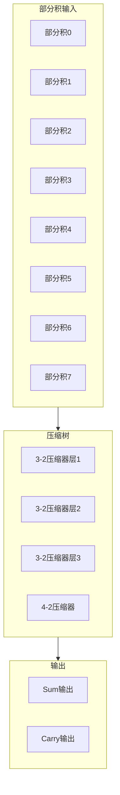
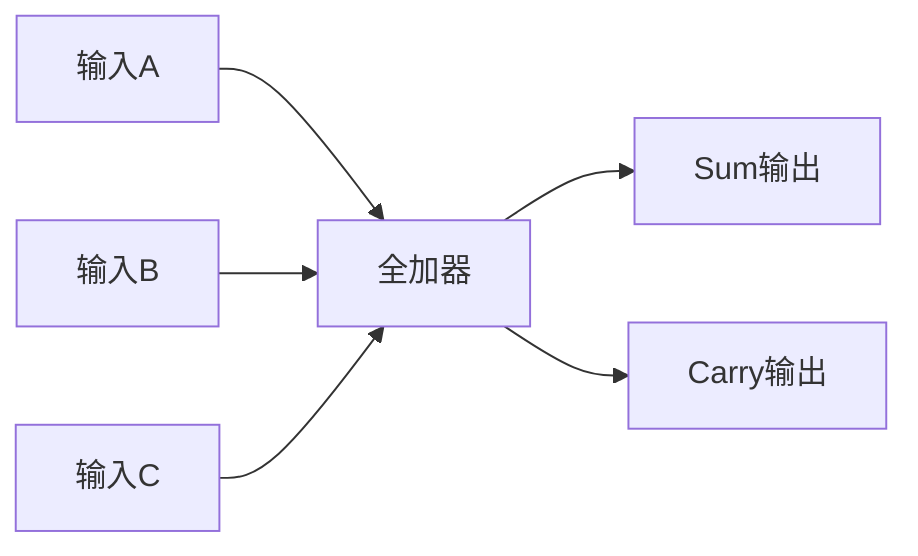

# VFMAU乘法压缩器模块详细设计文档

## 1. 模块概述

### 1.1 基本信息

| 属性 | 值 |
|------|-----|
| 模块名称 | ct_vfmau_mult_compressor |
| 文件路径 | C910_RTL_FACTORY/gen_rtl/vfmau/rtl/ct_vfmau_mult_compressor.v |
| 模块类型 | 组合逻辑模块 |
| 功能分类 | 部分积压缩 |

### 1.2 功能描述

乘法压缩器模块负责将Booth编码生成的多个部分积压缩为sum和carry两个输出，是浮点乘法器的核心组件。主要功能包括：

1. **部分积压缩**：使用压缩树结构将多个部分积压缩为两个输出
2. **Booth编码支持**：处理Booth编码生成的部分积
3. **符号位处理**：正确处理部分积的符号扩展
4. **SIMD支持**：支持SIMD模式下的并行压缩

### 1.3 设计特点

- **Wallace树结构**：使用Wallace树或Dadda树进行压缩
- **3-2压缩器**：使用全加器作为基本压缩单元
- **4-2压缩器**：使用4-2压缩器提高效率
- **并行处理**：所有压缩操作并行执行

## 2. 模块接口说明

### 2.1 输入端口

| 信号名 | 方向 | 位宽 | 描述 |
|--------|------|------|------|
| op0_frac | input | 52 | 操作数0尾数 |
| op1_frac | input | 52 | 操作数1尾数 |

### 2.2 输出端口

| 信号名 | 方向 | 位宽 | 描述 |
|--------|------|------|------|
| sum | output | 106 | 压缩结果sum |
| carry | output | 106 | 压缩结果carry |

## 3. 模块框图

### 3.1 压缩树结构图



### 3.2 3-2压缩器结构



## 4. 模块实现方案

### 4.1 压缩算法

使用Wallace树压缩算法：

1. **第一层**：将部分积分组，每组3个使用3-2压缩器
2. **第二层**：继续压缩上一层的结果
3. **第三层**：直到只剩下2个输出（sum和carry）

### 4.2 3-2压缩器实现

3-2压缩器（全加器）的真值表：

| A | B | C | Sum | Carry |
|---|---|---|-----|-------|
| 0 | 0 | 0 | 0 | 0 |
| 0 | 0 | 1 | 1 | 0 |
| 0 | 1 | 0 | 1 | 0 |
| 0 | 1 | 1 | 0 | 1 |
| 1 | 0 | 0 | 1 | 0 |
| 1 | 0 | 1 | 0 | 1 |
| 1 | 1 | 0 | 0 | 1 |
| 1 | 1 | 1 | 1 | 1 |

实现逻辑：
```verilog
// 3-2压缩器
assign sum = a ^ b ^ c;
assign carry = (a & b) | (b & c) | (a & c);
```

### 4.3 4-2压缩器实现

4-2压缩器将4个输入压缩为2个输出：

```verilog
// 4-2压缩器
assign sum = a ^ b ^ c ^ d ^ cin;
assign cout = (a & b) | (c & d) | ((a ^ b) & (c ^ d));
```

### 4.4 符号位处理

处理Booth编码产生的负部分积：

```verilog
// 符号扩展处理
assign pp_sign_extended = {{width{pp_sign}}, pp_data};

// 符号位补偿
assign sign_compensation = pp_sign ? -1 : 0;
```

## 5. 性能优化

### 5.1 延迟优化

- 使用4-2压缩器减少压缩层数
- 并行处理所有压缩操作
- 优化进位传播路径

### 5.2 面积优化

- 复用压缩器单元
- 优化部分积排列
- 减少中间信号

## 6. 修订历史

| 版本 | 日期 | 作者 | 说明 |
|------|------|------|------|
| 1.0 | 2024-01-XX | Auto-generated | 初始版本 |
