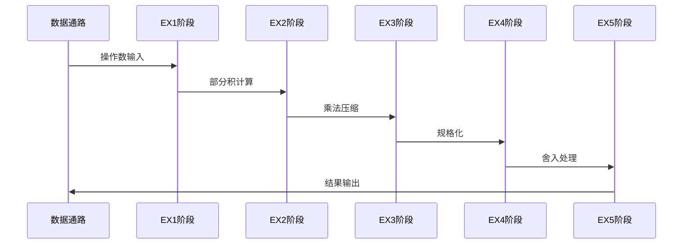
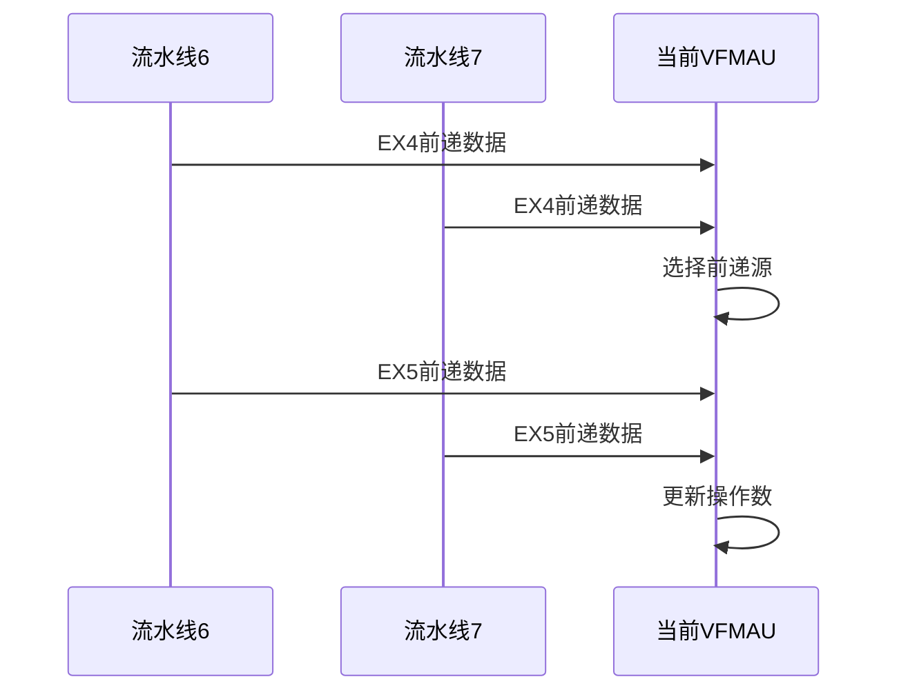
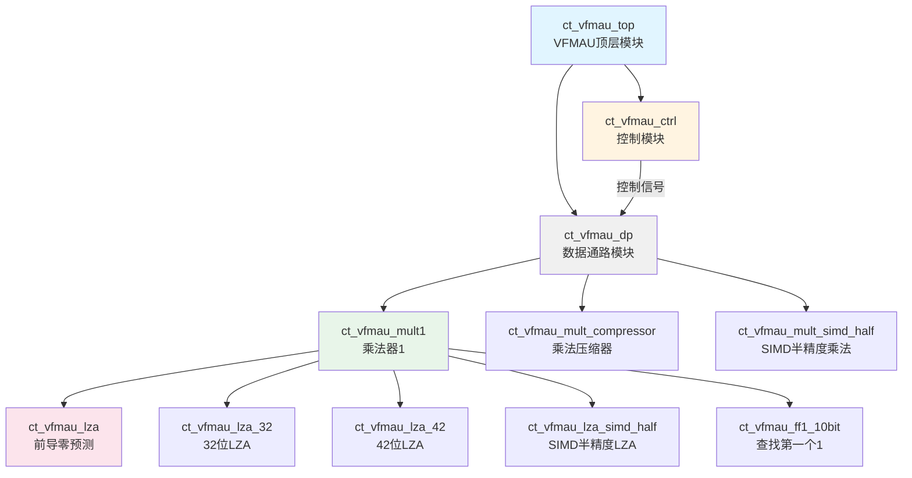
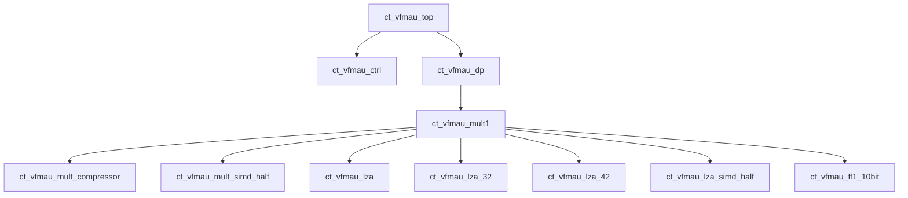

# VFMAU顶层模块详细设计文档

## 1. 模块概述

### 1.1 基本信息

| 属性 | 值 |
|------|-----|
| 模块名称 | ct_vfmau_top |
| 文件路径 | C910_RTL_FACTORY/gen_rtl/vfmau/rtl/ct_vfmau_top.v |
| 模块类型 | 顶层模块 |
| 功能分类 | 向量浮点乘累加单元 |

### 1.2 功能描述

VFMAU（Vector Fused Multiply-Add Unit）顶层模块是C910处理器向量浮点运算单元的核心组成部分，主要负责执行向量浮点乘累加（FMA）运算。该模块支持以下功能：

1. **浮点乘累加运算**：执行A×B+C的融合运算
2. **浮点乘法运算**：执行A×B的乘法运算
3. **多精度支持**：支持双精度（64位）、单精度（32位）和半精度（16位）浮点运算
4. **SIMD运算**：支持单指令多数据操作，可同时处理多个浮点数据
5. **数据宽度扩展**：支持单精度到双精度的宽度扩展运算
6. **前递机制**：支持流水线间的数据前递，提高运算效率

### 1.3 设计特点

- **5级流水线设计**：EX1→EX2→EX3→EX4→EX5，提高运算吞吐率
- **双通道支持**：支持两个独立的乘法通道（mult0和mult1）
- **前导零预测（LZA）**：采用LZA技术加速规格化过程
- **IEEE 754兼容**：完全符合IEEE 754浮点运算标准
- **特殊值处理**：支持无穷大、NaN、非规格化数的处理
- **前递优化**：支持EX4和EX5阶段的前递，减少数据冒险

## 2. 模块接口说明

### 2.1 输入端口

| 信号名 | 方向 | 位宽 | 描述 |
|--------|------|------|------|
| cp0_vfpu_icg_en | input | 1 | CP0时钟门控使能信号 |
| cp0_yy_clk_en | input | 1 | CP0全局时钟使能信号 |
| cpurst_b | input | 1 | 系统复位信号，低有效 |
| forever_cpuclk | input | 1 | CPU主时钟信号 |
| pad_yy_icg_scan_en | input | 1 | 扫描测试使能信号 |
| vfpu_yy_xx_dqnan | input | 1 | 默认NaN使能信号 |

### 2.2 输出端口

本模块作为顶层模块，主要通过内部子模块的端口与外部交互，无直接输出端口。

### 2.3 接口时序图

#### 2.3.1 流水线操作时序



#### 2.3.2 前递机制时序



## 3. 模块框图

### 3.1 模块架构图



### 3.2 流水线结构图


### 3.3 主要数据连线

| 源模块 | 目标模块 | 信号名 | 位宽 | 说明 |
|--------|----------|--------|------|------|
| DP | MULT1 | dp_mult1_ex1_op0_slicex | 64 | 操作数0数据 |
| DP | MULT1 | dp_mult1_ex1_op1_slicex | 64 | 操作数1数据 |
| DP | MULT1 | dp_mult1_ex1_op2_slicex | 64 | 操作数2数据（累加数） |
| MULT1 | DP | slicex_mult1_dp_ex5_fma_result | 64 | FMA运算结果 |
| MULT1 | DP | slicex_mult1_dp_ex5_fwd_data | 68 | 前递数据 |
| CTRL | DP | 控制信号组 | - | 流水线控制、时钟使能等 |

## 4. 模块实现方案

### 4.1 流水线设计

#### 4.1.1 流水线概述

VFMAU采用5级流水线设计，各级功能如下：

| 流水级 | 名称 | 主要功能 | 关键操作 |
|--------|------|----------|----------|
| EX1 | 操作数预处理 | 操作数分类、指数计算、隐藏位处理 | 操作数类型判断、指数加减 |
| EX2 | 乘法运算 | 部分积生成、移位对齐、特殊值检测 | Booth编码、移位计算 |
| EX3 | 压缩与加法 | 乘法压缩、累加操作、LZA计算 | Wallace树压缩、前导零预测 |
| EX4 | 规格化 | 前导零移位、指数调整、溢出检测 | 规格化移位、指数修正 |
| EX5 | 舍入 | 舍入判断、结果生成、异常标志 | IEEE舍入、结果选择 |

#### 4.1.2 各流水线详细说明

**EX1阶段 - 操作数预处理**

1. **操作数分类**：
   - 判断操作数是否为：零、无穷大、NaN（信号NaN、安静NaN）、非规格化数、规格化数
   - 检测NaN-boxing有效性（单精度数据在双精度寄存器中的扩展）

2. **指数计算**：
   - 计算乘法结果的初始指数：E_mult = E0 + E1 - bias
   - 计算FMA运算的偏移指数：E_fma = E0 + E1 - bias + offset
   - 根据数据类型选择不同的bias值

3. **隐藏位处理**：
   - 规格化数：隐藏位为1
   - 非规格化数：隐藏位为0
   - 特殊值：根据IEEE 754标准处理

**EX2阶段 - 乘法运算**

1. **部分积生成**：
   - 使用Booth编码生成部分积
   - 支持SIMD模式下的并行乘法

2. **移位对齐**：
   - 计算操作数2的移位量：SA = E0 + E1 - E2 - bias + offset
   - 根据指数差进行右移对齐

3. **特殊值检测**：
   - 检测无穷大×零等非法操作
   - 检测NaN传播条件
   - 生成特殊值结果

**EX3阶段 - 压缩与加法**

1. **乘法压缩**：
   - 使用Wallace树或压缩器对部分积进行压缩
   - 生成sum和carry两个输出

2. **累加操作**：
   - 将乘法结果与操作数2相加（FMA操作）
   - 处理加法的进位传播

3. **LZA计算**：
   - 并行计算前导零位置
   - 为下一阶段的规格化做准备

**EX4阶段 - 规格化**

1. **前导零移位**：
   - 根据LZA结果进行左移
   - 处理进位导致的额外移位

2. **指数调整**：
   - 根据移位量调整指数
   - 处理指数溢出和下溢

3. **溢出检测**：
   - 检测结果是否溢出
   - 生成最大规范数或无穷大

**EX5阶段 - 舍入**

1. **舍入判断**：
   - 根据舍入模式（RNE、RTZ、RDN、RUP、RMM）进行舍入
   - 计算舍入增量

2. **结果生成**：
   - 选择最终结果（正常结果或特殊值）
   - 生成前递数据

3. **异常标志**：
   - 生成IEEE 754异常标志（无效操作、溢出、下溢、不精确）

### 4.2 关键逻辑描述

#### 4.2.1 操作数类型判断逻辑

```verilog
// 规格化数判断
assign mult1_ex1_op0_norm = !mult1_ex1_op0_zero 
                         && !mult1_ex1_expnt0_inf 
                         && !mult1_ex1_op0_cnan;

// 无穷大判断
assign mult1_ex1_op0_inf = mult1_ex1_expnt0_inf 
                        && mult1_ex1_frac0_all_zero 
                        && !mult1_ex1_op0_cnan;

// NaN判断
assign mult1_ex1_op0_qnan = mult1_ex1_expnt0_inf 
                         && mult1_ex1_op0_frac[51] 
                         || mult1_ex1_op0_cnan;
```

#### 4.2.2 指数计算逻辑

```verilog
// 乘法指数计算
assign mult1_ex1_mult_expnt_result[12:0] = 
    {2'b0, mult1_ex1_expnt_addr_op0[10:0]}
  + {2'b0, mult1_ex1_expnt_addr_op1[10:0]}
  + mult1_ex1_expnt_bias[12:0];
```

#### 4.2.3 前递数据选择逻辑

```verilog
// EX5前递数据选择
assign mult1_ex1_op2_fwd_data[63:0] = 
    {64{pipe6_pipex_ex5_ex1_fmla_fwd_vld}} & pipe6_vfmau_ex5_fmla_slicex_data[63:0]
  | {64{pipe7_pipex_ex5_ex1_fmla_fwd_vld}} & pipe7_vfmau_ex5_fmla_slicex_data[63:0];
```

### 4.3 数据前递机制

VFMAU支持两级前递机制，减少数据冒险带来的流水线停顿：

| 前递路径 | 源阶段 | 目标阶段 | 说明 |
|----------|--------|----------|------|
| EX4→EX1 | EX4 | EX1 | EX4阶段的部分结果前递到EX1作为操作数2 |
| EX5→EX1 | EX5 | EX1 | EX5阶段的完整结果前递到EX1作为操作数2 |
| EX5→EX2 | EX5 | EX2 | EX5阶段的结果前递到EX2 |

**前递优先级**：
1. EX5前递优先级高于EX4
2. Pipe6和Pipe7的前递按优先级选择
3. 前递数据包含符号、指数和尾数

### 4.4 流水线控制信号

| 信号 | 说明 |
|------|------|
| mult1_ex1_ex2_pipedown | EX1到EX2流水线下传使能 |
| mult1_ex2_ex3_pipedown | EX2到EX3流水线下传使能 |
| mult1_ex3_ex4_pipedown | EX3到EX4流水线下传使能 |
| mult1_ex4_ex5_pipedown | EX4到EX5流水线下传使能 |
| dp_mult1_ex1_clk_en | EX1阶段时钟使能 |
| dp_mult1_ex2_clk_en | EX2阶段时钟使能 |
| dp_mult1_ex3_clk_en | EX3阶段时钟使能 |
| dp_mult1_ex4_clk_en | EX4阶段时钟使能 |

## 5. 内部关键信号列表

### 5.1 寄存器信号

| 信号名 | 位宽 | 描述 |
|--------|------|------|
| mult1_ex2_expnt | 13 | EX2阶段指数值 |
| mult1_ex2_mult_result_sign | 1 | EX2阶段乘法结果符号 |
| mult1_ex3_frac_result | 164 | EX3阶段尾数结果 |
| mult1_ex3_expnt | 13 | EX3阶段指数值 |
| mult1_ex4_expnt_result | 13 | EX4阶段指数结果 |
| mult1_ex4_fma_sign | 1 | EX4阶段FMA结果符号 |

### 5.2 线网信号

| 信号名 | 位宽 | 描述 |
|--------|------|------|
| mult1_ex1_op0_sign | 1 | 操作数0符号 |
| mult1_ex1_op0_expnt | 11 | 操作数0指数 |
| mult1_ex1_op0_frac | 52 | 操作数0尾数 |
| mult1_ex1_mult_result_sign | 1 | 乘法结果符号 |
| mult1_ex1_expnt0_inf | 1 | 操作数0指数为无穷大标志 |
| mult1_ex1_expnt0_zero | 1 | 操作数0指数为零标志 |

## 6. 数据结构定义

### 6.1 浮点数格式

**双精度浮点数（64位）**：

| 位域 | 名称 | 描述 |
|------|------|------|
| [63] | S | 符号位 |
| [62:52] | E | 指数位（11位，bias=1023） |
| [51:0] | F | 尾数位（52位） |

**单精度浮点数（32位）**：

| 位域 | 名称 | 描述 |
|------|------|------|
| [31] | S | 符号位 |
| [30:23] | E | 指数位（8位，bias=127） |
| [22:0] | F | 尾数位（23位） |

**半精度浮点数（16位）**：

| 位域 | 名称 | 描述 |
|------|------|------|
| [15] | S | 符号位 |
| [14:10] | E | 指数位（5位，bias=15） |
| [9:0] | F | 尾数位（10位） |

### 6.2 特殊值编码

| 类型 | 指数 | 尾数 | 说明 |
|------|------|------|------|
| 零 | 全0 | 全0 | +0或-0 |
| 非规格化数 | 全0 | 非零 | 隐藏位为0 |
| 规格化数 | 非全0且非全1 | 任意 | 隐藏位为1 |
| 无穷大 | 全1 | 全0 | +∞或-∞ |
| 安静NaN | 全1 | 最高位为1 | qNaN |
| 信号NaN | 全1 | 最高位为0，其余非零 | sNaN |

### 6.3 舍入模式

| RM[2:0] | 名称 | 描述 |
|---------|------|------|
| 000 | RNE | 向最近偶数舍入 |
| 001 | RTZ | 向零舍入 |
| 010 | RDN | 向负无穷舍入 |
| 011 | RUP | 向正无穷舍入 |
| 100 | RMM | 向最近最大值舍入 |

## 7. 子模块方案

### 7.1 模块例化层次结构



### 7.2 子模块列表

| 层级 | 模块名 | 实例名 | 文件路径 | 功能描述 |
|------|--------|--------|----------|----------|
| 1 | ct_vfmau_ctrl | x_ct_vfmau_ctrl | ct_vfmau_ctrl.v | 控制模块，生成流水线控制信号 |
| 1 | ct_vfmau_dp | x_ct_vfmau_dp | ct_vfmau_dp.v | 数据通路模块，包含主要运算逻辑 |
| 2 | ct_vfmau_mult1 | x_ct_vfmau_mult1 | ct_vfmau_mult1.v | 乘法器模块，执行浮点乘法 |
| 2 | ct_vfmau_mult_compressor | x_ct_vfmau_mult_compressor | ct_vfmau_mult_compressor.v | 乘法压缩器，压缩部分积 |
| 2 | ct_vfmau_mult_simd_half | x_ct_vfmau_mult_simd_half | ct_vfmau_mult_simd_half.v | SIMD半精度乘法器 |
| 2 | ct_vfmau_lza | x_ct_vfmau_lza | ct_vfmau_lza.v | 前导零预测模块 |
| 2 | ct_vfmau_lza_32 | x_ct_vfmau_lza_32 | ct_vfmau_lza_32.v | 32位前导零预测 |
| 2 | ct_vfmau_lza_42 | x_ct_vfmau_lza_42 | ct_vfmau_lza_42.v | 42位前导零预测 |
| 2 | ct_vfmau_lza_simd_half | x_ct_vfmau_lza_simd_half | ct_vfmau_lza_simd_half.v | SIMD半精度前导零预测 |
| 2 | ct_vfmau_ff1_10bit | x_ct_vfmau_ff1_10bit | ct_vfmau_ff1_10bit.v | 查找第一个1模块 |

### 7.3 子模块功能说明

**ct_vfmau_ctrl（控制模块）**：
- 生成流水线各级的时钟使能信号
- 控制流水线的停顿和刷新
- 管理异常和中断响应

**ct_vfmau_dp（数据通路模块）**：
- 包含主要的运算数据通路
- 管理操作数的传递和选择
- 生成最终运算结果

**ct_vfmau_mult1（乘法器模块）**：
- 执行浮点乘法运算
- 处理特殊值和异常
- 支持多精度和SIMD运算

**ct_vfmau_mult_compressor（乘法压缩器）**：
- 使用压缩树结构压缩部分积
- 生成sum和carry输出
- 支持SIMD模式

**ct_vfmau_lza系列（前导零预测模块）**：
- 并行计算前导零位置
- 加速规格化过程
- 支持不同位宽和SIMD模式

**ct_vfmau_ff1_10bit（查找第一个1模块）**：
- 在10位数据中查找第一个1的位置
- 用于小位宽的LZA计算

## 8. 可测试性设计

### 8.1 测试信号

| 信号名 | 方向 | 位宽 | 描述 |
|--------|------|------|------|
| pad_yy_icg_scan_en | input | 1 | 扫描测试使能信号 |

### 8.2 调试接口

VFMAU通过以下方式支持调试：
- 流水线寄存器可扫描
- 关键内部信号可观测
- 支持单步执行模式

### 8.3 扫描链支持

- 所有流水线寄存器支持扫描链插入
- 使用pad_yy_icg_scan_en控制扫描模式
- 支持MBIST（存储器内建自测试）

## 9. 性能指标

### 9.1 时序特性

| 参数 | 典型值 | 说明 |
|------|--------|------|
| 工作频率 | 1.0 GHz | 典型工作频率 |
| 流水线深度 | 5级 | EX1→EX2→EX3→EX4→EX5 |
| 运算延迟 | 5周期 | 从输入到结果输出 |
| 吞吐率 | 1结果/周期 | 全流水化操作 |

### 9.2 面积估算

| 模块 | 相对面积 | 说明 |
|------|----------|------|
| ct_vfmau_mult1 | 60% | 主要运算逻辑 |
| ct_vfmau_ctrl | 5% | 控制逻辑 |
| ct_vfmau_dp | 30% | 数据通路 |
| LZA模块 | 5% | 前导零预测 |

## 10. 修订历史

| 版本 | 日期 | 作者 | 说明 |
|------|------|------|------|
| 1.0 | 2024-01-XX | Auto-generated | 初始版本，基于RTL代码自动生成 |
