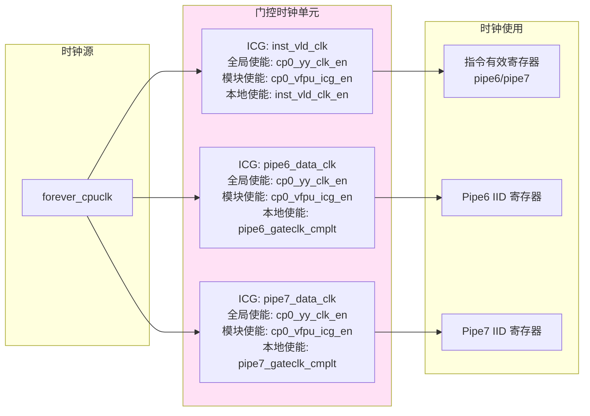
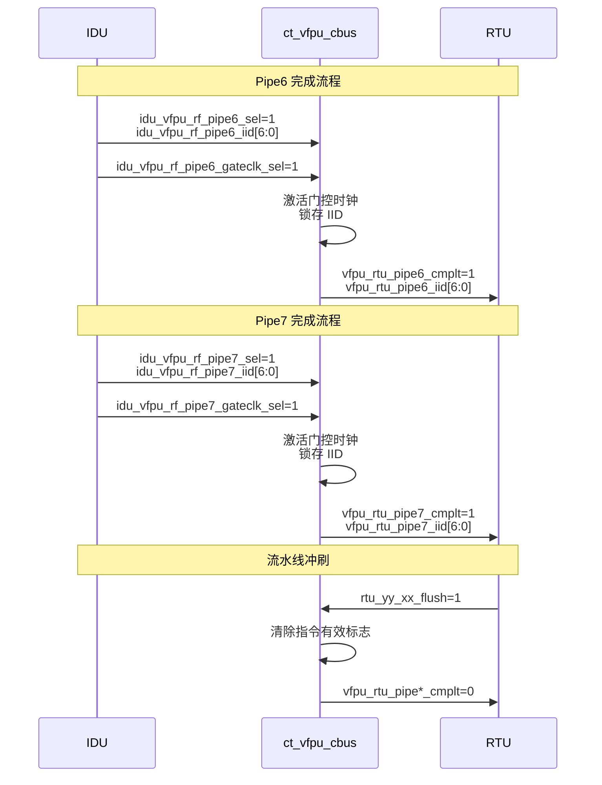

# ct_vfpu_cbus 模块设计方案

## 1. 模块概述

### 1.1 模块名称
**ct_vfpu_cbus** - VFPU 完成总线模块（Completion Bus）

### 1.2 功能描述
ct_vfpu_cbus 模块是向量浮点处理单元（VFPU）中的完成总线控制模块，主要负责：

1. **指令完成管理**：处理来自 IDU（指令分发单元）的两条流水线（Pipe6 和 Pipe7）的指令完成信号
2. **指令 ID 跟踪**：锁存并传递指令标识符（IID）到退休单元（RTU）
3. **低功耗设计**：采用门控时钟技术，根据流水线活动状态动态控制时钟
4. **流水线冲刷支持**：响应 RTU 的冲刷信号，清除未完成的指令

### 1.3 设计特点
- 支持双流水线并行处理（Pipe6 和 Pipe7）
- 采用三级门控时钟结构，优化功耗
- 异步复位，同步释放设计
- 支持扫描测试模式

### 1.4 模块位置
```
VFPU (向量浮点处理单元)
  └── ct_vfpu_cbus (完成总线模块)
```

---

## 2. 接口说明

### 2.1 输入端口

| 端口名称 | 位宽 | 类型 | 功能描述 | 来源模块 |
|---------|------|------|---------|---------|
| cp0_vfpu_icg_en | 1 | input | CP0 VFPU 门控时钟模块使能信号 | CP0 |
| cp0_yy_clk_en | 1 | input | CP0 全局时钟使能信号 | CP0 |
| cpurst_b | 1 | input | 全局复位信号（低有效） | 系统 |
| forever_cpuclk | 1 | input | CPU 主时钟 | 时钟系统 |
| idu_vfpu_rf_pipe6_gateclk_sel | 1 | input | Pipe6 门控时钟选择信号 | IDU |
| idu_vfpu_rf_pipe6_iid | 7 | input | Pipe6 指令标识符 | IDU |
| idu_vfpu_rf_pipe6_sel | 1 | input | Pipe6 指令选择信号 | IDU |
| idu_vfpu_rf_pipe7_gateclk_sel | 1 | input | Pipe7 门控时钟选择信号 | IDU |
| idu_vfpu_rf_pipe7_iid | 7 | input | Pipe7 指令标识符 | IDU |
| idu_vfpu_rf_pipe7_sel | 1 | input | Pipe7 指令选择信号 | IDU |
| pad_yy_icg_scan_en | 1 | input | 扫描测试使能信号 | PAD |
| rtu_yy_xx_flush | 1 | input | 流水线冲刷信号 | RTU |

### 2.2 输出端口

| 端口名称 | 位宽 | 类型 | 功能描述 | 目标模块 |
|---------|------|------|---------|---------|
| vfpu_rtu_pipe6_cmplt | 1 | output | Pipe6 指令完成信号 | RTU |
| vfpu_rtu_pipe6_iid | 7 | output | Pipe6 指令标识符 | RTU |
| vfpu_rtu_pipe7_cmplt | 1 | output | Pipe7 指令完成信号 | RTU |
| vfpu_rtu_pipe7_iid | 7 | output | Pipe7 指令标识符 | RTU |

### 2.3 参数定义
本模块无参数定义。

---

## 3. 模块框图

### 3.1 顶层架构图

```mermaid
graph TB
    subgraph "输入信号"
        IDU_P6[IDU Pipe6<br/>sel/iid/gateclk_sel]
        IDU_P7[IDU Pipe7<br/>sel/iid/gateclk_sel]
        CP0[CP0<br/>icg_en/clk_en]
        RST[复位/冲刷<br/>cpurst_b/flush]
        CLK[时钟<br/>forever_cpuclk]
        SCAN[扫描<br/>pad_yy_icg_scan_en]
    end

    subgraph "ct_vfpu_cbus"
        subgraph "Pipe6 完成逻辑"
            P6_CLK1[门控时钟1<br/>inst_vld_clk]
            P6_REG1[指令有效寄存器<br/>cbus_pipe6_inst_vld]
            P6_CLK2[门控时钟2<br/>pipe6_data_clk]
            P6_REG2[IID 寄存器<br/>cbus_pipe6_iid]
        end

        subgraph "Pipe7 完成逻辑"
            P7_CLK1[门控时钟1<br/>inst_vld_clk]
            P7_REG1[指令有效寄存器<br/>cbus_pipe7_inst_vld]
            P7_CLK2[门控时钟2<br/>pipe7_data_clk]
            P7_REG2[IID 寄存器<br/>cbus_pipe7_iid]
        end

        CLK_CTRL[时钟使能控制<br/>vfpu_inst_vld_clk_en]
    end

    subgraph "输出信号"
        RTU_P6[RTU Pipe6<br/>cmplt/iid]
        RTU_P7[RTU Pipe7<br/>cmplt/iid]
    end

    IDU_P6 --> P6_REG2
    IDU_P7 --> P7_REG2
    CP0 --> P6_CLK1
    CP0 --> P6_CLK2
    CP0 --> P7_CLK1
    CP0 --> P7_CLK2
    CLK --> P6_CLK1
    CLK --> P6_CLK2
    CLK --> P7_CLK1
    CLK --> P7_CLK2
    RST --> P6_REG1
    RST --> P6_REG2
    RST --> P7_REG1
    RST --> P7_REG2
    SCAN --> P6_CLK1
    SCAN --> P6_CLK2
    SCAN --> P7_CLK1
    SCAN --> P7_CLK2

    IDU_P6 --> P6_REG1
    P6_CLK1 --> P6_REG1
    P6_REG1 --> RTU_P6
    P6_CLK2 --> P6_REG2
    P6_REG2 --> RTU_P6

    IDU_P7 --> P7_REG1
    P7_CLK1 --> P7_REG1
    P7_REG1 --> RTU_P7
    P7_CLK2 --> P7_REG2
    P7_REG2 --> RTU_P7

    IDU_P6 --> CLK_CTRL
    IDU_P7 --> CLK_CTRL
    P6_REG1 --> CLK_CTRL
    P7_REG1 --> CLK_CTRL
    CLK_CTRL --> P6_CLK1
    CLK_CTRL --> P7_CLK1

    style ct_vfpu_cbus fill:#e1f5ff
    style Pipe6 完成逻辑 fill:#fff4e1
    style Pipe7 完成逻辑 fill:#fff4e1
```

### 3.2 门控时钟结构图



---

## 4. 完成总线逻辑说明

### 4.1 整体工作流程

ct_vfpu_cbus 模块采用双流水线架构，每条流水线的完成逻辑包含以下步骤：



### 4.2 Pipe6 完成逻辑

#### 4.2.1 完成信号生成
```verilog
assign cbus_pipe6_cmplt         = idu_vfpu_rf_pipe6_sel;
assign cbus_pipe6_gateclk_cmplt = idu_vfpu_rf_pipe6_gateclk_sel;
```

**逻辑说明**：
- `cbus_pipe6_cmplt`：直接来自 IDU 的 Pipe6 选择信号，表示指令在 Pipe6 中完成执行
- `cbus_pipe6_gateclk_cmplt`：门控时钟选择信号，用于提前激活时钟以减少延迟

#### 4.2.2 指令有效寄存器
```verilog
always @(posedge vfpu_inst_vld_clk or negedge cpurst_b)
begin
  if(!cpurst_b)
    cbus_pipe6_inst_vld <= 1'b0;
  else if(rtu_yy_xx_flush)
    cbus_pipe6_inst_vld <= 1'b0;
  else
    cbus_pipe6_inst_vld <= cbus_pipe6_cmplt;
end
```

**寄存器行为**：
- **复位**：异步复位为 0
- **冲刷**：同步清除为 0（响应 RTU 冲刷信号）
- **正常操作**：锁存完成信号

#### 4.2.3 IID 寄存器
```verilog
always @(posedge vfpu_pipe6_data_clk or negedge cpurst_b)
begin
  if(!cpurst_b)
    cbus_pipe6_iid[6:0] <= 7'b0;
  else if(cbus_pipe6_cmplt)
    cbus_pipe6_iid[6:0] <= idu_vfpu_rf_pipe6_iid[6:0];
  else
    cbus_pipe6_iid[6:0] <= cbus_pipe6_iid[6:0];
end
```

**寄存器行为**：
- **复位**：异步复位为 0
- **完成时**：锁存来自 IDU 的 IID
- **保持**：无完成信号时保持原值

### 4.3 Pipe7 完成逻辑

Pipe7 的完成逻辑与 Pipe6 完全对称，采用相同的结构和控制流程。

#### 4.3.1 完成信号生成
```verilog
assign cbus_pipe7_cmplt         = idu_vfpu_rf_pipe7_sel;
assign cbus_pipe7_gateclk_cmplt = idu_vfpu_rf_pipe7_gateclk_sel;
```

#### 4.3.2 指令有效寄存器
```verilog
always @(posedge vfpu_inst_vld_clk or negedge cpurst_b)
begin
  if(!cpurst_b)
    cbus_pipe7_inst_vld <= 1'b0;
  else if(rtu_yy_xx_flush)
    cbus_pipe7_inst_vld <= 1'b0;
  else
    cbus_pipe7_inst_vld <= cbus_pipe7_cmplt;
end
```

#### 4.3.3 IID 寄存器
```verilog
always @(posedge vfpu_pipe7_data_clk or negedge cpurst_b)
begin
  if(!cpurst_b)
    cbus_pipe7_iid[6:0] <= 7'b0;
  else if(cbus_pipe7_cmplt)
    cbus_pipe7_iid[6:0] <= idu_vfpu_rf_pipe7_iid[6:0];
  else
    cbus_pipe7_iid[6:0] <= cbus_pipe7_iid[6:0];
end
```

### 4.4 时钟门控策略

#### 4.4.1 指令有效时钟（vfpu_inst_vld_clk）
```verilog
assign vfpu_inst_vld_clk_en = cbus_pipe6_gateclk_cmplt
                           || cbus_pipe7_gateclk_cmplt
                           || cbus_pipe6_inst_vld
                           || cbus_pipe7_inst_vld;
```

**使能条件**：
- Pipe6 或 Pipe7 有门控时钟完成信号（提前激活）
- Pipe6 或 Pipe7 已有有效指令（保持激活）

**设计目的**：
- 仅在有指令活动时激活时钟
- 避免不必要的时钟翻转以节省功耗

#### 4.4.2 数据时钟（vfpu_pipe6_data_clk / vfpu_pipe7_data_clk）
```verilog
assign vfpu_pipe6_data_clk_en = cbus_pipe6_gateclk_cmplt;
assign vfpu_pipe7_data_clk_en = cbus_pipe7_gateclk_cmplt;
```

**使能条件**：
- 仅在对应流水线有门控时钟完成信号时激活

**设计目的**：
- 精确控制每条流水线的时钟
- 最大化功耗节省效果

### 4.5 输出逻辑

```verilog
assign vfpu_rtu_pipe6_cmplt = cbus_pipe6_inst_vld;
assign vfpu_rtu_pipe6_iid[6:0] = cbus_pipe6_iid[6:0];

assign vfpu_rtu_pipe7_cmplt = cbus_pipe7_inst_vld;
assign vfpu_rtu_pipe7_iid[6:0] = cbus_pipe7_iid[6:0];
```

**输出说明**：
- 完成信号来自指令有效寄存器
- IID 来自 IID 寄存器
- 输出直接连接到 RTU

---

## 5. 内部信号列表

### 5.1 寄存器信号

| 信号名称 | 位宽 | 类型 | 功能描述 | 时钟域 | 复位值 |
|---------|------|------|---------|--------|--------|
| cbus_pipe6_iid | 7 | reg | Pipe6 指令 ID 寄存器 | vfpu_pipe6_data_clk | 7'b0 |
| cbus_pipe6_inst_vld | 1 | reg | Pipe6 指令有效标志 | vfpu_inst_vld_clk | 1'b0 |
| cbus_pipe7_iid | 7 | reg | Pipe7 指令 ID 寄存器 | vfpu_pipe7_data_clk | 7'b0 |
| cbus_pipe7_inst_vld | 1 | reg | Pipe7 指令有效标志 | vfpu_inst_vld_clk | 1'b0 |

### 5.2 组合逻辑信号

| 信号名称 | 位宽 | 类型 | 功能描述 | 生成逻辑 |
|---------|------|------|---------|---------|
| cbus_pipe6_cmplt | 1 | wire | Pipe6 完成信号 | idu_vfpu_rf_pipe6_sel |
| cbus_pipe6_gateclk_cmplt | 1 | wire | Pipe6 门控时钟完成信号 | idu_vfpu_rf_pipe6_gateclk_sel |
| cbus_pipe7_cmplt | 1 | wire | Pipe7 完成信号 | idu_vfpu_rf_pipe7_sel |
| cbus_pipe7_gateclk_cmplt | 1 | wire | Pipe7 门控时钟完成信号 | idu_vfpu_rf_pipe7_gateclk_sel |
| vfpu_inst_vld_clk_en | 1 | wire | 指令有效时钟使能 | pipe6/7 gateclk_cmplt OR inst_vld |
| vfpu_pipe6_data_clk_en | 1 | wire | Pipe6 数据时钟使能 | cbus_pipe6_gateclk_cmplt |
| vfpu_pipe7_data_clk_en | 1 | wire | Pipe7 数据时钟使能 | cbus_pipe7_gateclk_cmplt |

### 5.3 门控时钟信号

| 信号名称 | 位宽 | 类型 | 功能描述 | 来源 |
|---------|------|------|---------|------|
| vfpu_inst_vld_clk | 1 | wire | 指令有效寄存器时钟 | ICG 输出 |
| vfpu_pipe6_data_clk | 1 | wire | Pipe6 数据寄存器时钟 | ICG 输出 |
| vfpu_pipe7_data_clk | 1 | wire | Pipe7 数据寄存器时钟 | ICG 输出 |

### 5.4 输入信号（Wire 类型）

| 信号名称 | 位宽 | 类型 | 功能描述 |
|---------|------|------|---------|
| cp0_vfpu_icg_en | 1 | wire | CP0 VFPU ICG 使能 |
| cp0_yy_clk_en | 1 | wire | CP0 全局时钟使能 |
| cpurst_b | 1 | wire | 全局复位 |
| forever_cpuclk | 1 | wire | CPU 主时钟 |
| idu_vfpu_rf_pipe6_gateclk_sel | 1 | wire | Pipe6 门控时钟选择 |
| idu_vfpu_rf_pipe6_iid | 7 | wire | Pipe6 IID |
| idu_vfpu_rf_pipe6_sel | 1 | wire | Pipe6 选择 |
| idu_vfpu_rf_pipe7_gateclk_sel | 1 | wire | Pipe7 门控时钟选择 |
| idu_vfpu_rf_pipe7_iid | 7 | wire | Pipe7 IID |
| idu_vfpu_rf_pipe7_sel | 1 | wire | Pipe7 选择 |
| pad_yy_icg_scan_en | 1 | wire | 扫描使能 |
| rtu_yy_xx_flush | 1 | wire | 流水线冲刷 |

---

## 6. 设计要点

### 6.1 低功耗设计

#### 6.1.1 三级门控时钟
1. **全局使能**：`cp0_yy_clk_en` - 由 CP0 控制的全局时钟使能
2. **模块使能**：`cp0_vfpu_icg_en` - VFPU 模块级别的时钟使能
3. **本地使能**：动态生成的本地使能信号

#### 6.1.2 动态时钟控制
- 指令有效时钟：仅在有任何流水线活动时激活
- 数据时钟：仅在对应流水线有数据更新时激活

### 6.2 时序考虑

#### 6.2.1 时钟延迟
- 门控时钟单元引入约 1 个门延迟
- `gateclk_sel` 信号提前于 `sel` 信号，用于补偿门控时钟延迟

#### 6.2.2 复位策略
- 采用异步复位、同步释放策略
- 复位信号直接连接到寄存器的异步复位端

### 6.3 可测试性设计

#### 6.3.1 扫描链支持
- 通过 `pad_yy_icg_scan_en` 信号支持扫描测试模式
- 门控时钟单元在扫描模式下强制开启

#### 6.3.2 复位测试
- 复位后所有寄存器清零
- 可通过软件读取 IID 验证复位功能

---

## 7. 使用说明

### 7.1 典型工作流程

1. **指令分发**：IDU 向 Pipe6/Pipe7 发送指令选择信号和 IID
2. **时钟激活**：门控时钟选择信号提前激活相应时钟
3. **数据锁存**：在时钟上升沿锁存 IID 和完成标志
4. **完成通知**：向 RTU 发送完成信号和 IID
5. **流水线冲刷**：RTU 发送冲刷信号时清除有效标志

### 7.2 时序要求

| 参数 | 最小值 | 典型值 | 最大值 | 单位 |
|------|--------|--------|--------|------|
| idu_vfpu_rf_pipe*_sel 建立时间 | - | - | 0.5 | ns |
| idu_vfpu_rf_pipe*_sel 保持时间 | 0.1 | - | - | ns |
| idu_vfpu_rf_pipe*_gateclk_sel 提前时间 | 0.2 | 0.3 | - | ns |
| 复位脉冲宽度 | 2 | - | - | 周期 |

### 7.3 注意事项

1. **时钟使能优先级**：全局使能 > 模块使能 > 本地使能
2. **冲刷响应**：冲刷信号优先级高于完成信号
3. **IID 唯一性**：确保同一时刻不会有重复的 IID
4. **时钟门控安全**：门控时钟单元需确保无毛刺

---

## 8. 验证要点

### 8.1 功能验证

- [ ] Pipe6 单独完成测试
- [ ] Pipe7 单独完成测试
- [ ] Pipe6 和 Pipe7 同时完成测试
- [ ] 流水线冲刷测试
- [ ] 复位测试
- [ ] IID 正确性测试

### 8.2 功耗验证

- [ ] 空闲状态时钟门控验证
- [ ] 单流水线活动时钟门控验证
- [ ] 双流水线活动时钟门控验证
- [ ] 功耗测量

### 8.3 时序验证

- [ ] 建立时间检查
- [ ] 保持时间检查
- [ ] 门控时钟延迟检查
- [ ] 复位恢复时间检查

---

## 9. 修改历史

| 版本 | 日期 | 作者 | 修改内容 |
|------|------|------|---------|
| 1.0 | 2026-04-01 | IC 设计专家 | 初始版本 |

---

## 10. 参考资料

1. OpenC910 技术手册
2. RISC-V 指令集规范
3. 低功耗设计方法论
4. 门控时钟设计指南
