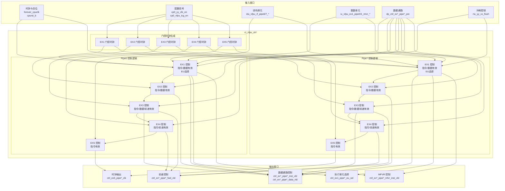
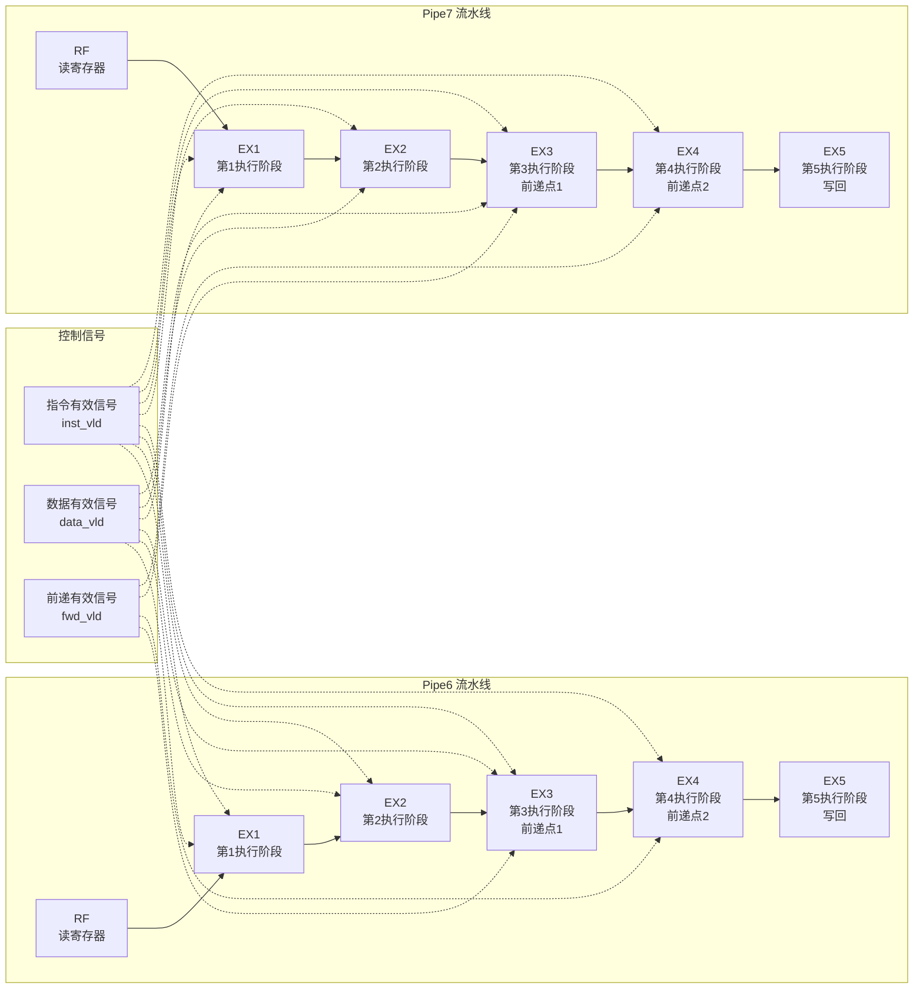
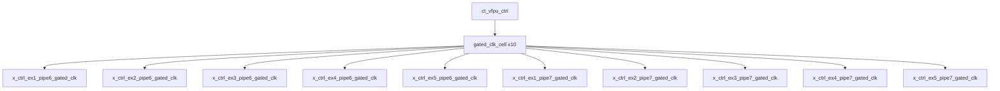

# ct_vfpu_ctrl 模块详细设计文档

## 1. 模块概述

### 1.1 基本信息

| 属性 | 值 |
|------|-----|
| 模块名称 | ct_vfpu_ctrl |
| 文件路径 | C910_RTL_FACTORY/gen_rtl/vfpu/rtl/ct_vfpu_ctrl.v |
| 功能分类 | 流水线控制 |
| 参数 | EU_WIDTH = 12 |

### 1.2 功能描述

ct_vfpu_ctrl 是向量浮点单元（VFPU）的控制模块，负责管理两条独立的浮点运算流水线（Pipe6 和 Pipe7）的控制信号。该模块实现了完整的流水线控制逻辑，包括指令有效性管理、数据有效性管理、前递控制以及功耗管理。

**主要功能：**

1. **双流水线控制**：独立控制 Pipe6 和 Pipe7 两条浮点运算流水线
2. **流水线阶段管理**：控制 EX1 至 EX5 共 5 个执行阶段的指令流转
3. **指令有效性控制**：管理各阶段指令有效信号，支持流水线冲刷
4. **数据有效性控制**：跟踪各阶段数据有效性，支持数据前递
5. **特殊指令支持**：支持 MTVR（Move to Vector Register）和 MFVR（Move from Vector Register）指令
6. **功耗管理**：使用门控时钟技术降低动态功耗
7. **执行单元选择**：根据指令类型选择合适的执行单元

### 1.3 设计特点

- **对称设计**：Pipe6 和 Pipe7 采用对称的控制逻辑，便于维护和验证
- **门控时钟**：每个流水线阶段独立使用门控时钟，有效降低功耗
- **信号复制**：关键控制信号使用多份复制（dup0-dup3），提高时序收敛性和可靠性
- **前递机制**：支持 EX3 和 EX4 阶段的数据前递，减少流水线停顿
- **冲刷支持**：支持全局冲刷信号（rtu_yy_xx_flush），快速清空流水线

## 2. 模块接口说明

### 2.1 输入端口

| 信号名 | 方向 | 位宽 | 描述 |
|--------|------|------|------|
| forever_cpuclk | input | 1 | CPU 主时钟 |
| cpurst_b | input | 1 | 全局复位信号（低有效） |
| cp0_yy_clk_en | input | 1 | 全局时钟使能 |
| cp0_vfpu_icg_en | input | 1 | VFPU 门控时钟使能 |
| pad_yy_icg_scan_en | input | 1 | 扫描测试使能 |
| rtu_yy_xx_flush | input | 1 | 全局冲刷信号 |
| idu_vfpu_rf_pipe6_sel | input | 1 | Pipe6 RF 阶段指令选择 |
| idu_vfpu_rf_pipe6_gateclk_sel | input | 1 | Pipe6 RF 阶段门控时钟选择 |
| idu_vfpu_rf_pipe6_eu_sel | input | 12 | Pipe6 RF 阶段执行单元选择 |
| idu_vfpu_rf_pipe7_sel | input | 1 | Pipe7 RF 阶段指令选择 |
| idu_vfpu_rf_pipe7_gateclk_sel | input | 1 | Pipe7 RF 阶段门控时钟选择 |
| idu_vfpu_rf_pipe7_eu_sel | input | 12 | Pipe7 RF 阶段执行单元选择 |
| iu_vfpu_ex1_pipe0_mtvr_inst | input | 5 | Pipe0 EX1 阶段 MTVR 指令信息 |
| iu_vfpu_ex1_pipe0_mtvr_vld | input | 1 | Pipe0 EX1 阶段 MTVR 指令有效 |
| iu_vfpu_ex1_pipe1_mtvr_inst | input | 5 | Pipe1 EX1 阶段 MTVR 指令信息 |
| iu_vfpu_ex1_pipe1_mtvr_vld | input | 1 | Pipe1 EX1 阶段 MTVR 指令有效 |
| dp_ctrl_ex1_pipe6_data_vld_pre | input | 1 | Pipe6 EX1 数据有效预信号 |
| dp_ctrl_ex1_pipe7_data_vld_pre | input | 1 | Pipe7 EX1 数据有效预信号 |
| dp_ctrl_ex2_pipe6_data_vld_pre | input | 1 | Pipe6 EX2 数据有效预信号 |
| dp_ctrl_ex2_pipe7_data_vld_pre | input | 1 | Pipe7 EX2 数据有效预信号 |
| dp_ctrl_ex3_pipe6_data_vld_pre | input | 1 | Pipe6 EX3 数据有效预信号 |
| dp_ctrl_ex3_pipe6_fwd_vld_pre | input | 1 | Pipe6 EX3 前递有效预信号 |
| dp_ctrl_ex3_pipe7_data_vld_pre | input | 1 | Pipe7 EX3 数据有效预信号 |
| dp_ctrl_ex3_pipe7_fwd_vld_pre | input | 1 | Pipe7 EX3 前递有效预信号 |
| dp_ctrl_ex4_pipe6_fwd_vld_pre | input | 1 | Pipe6 EX4 前递有效预信号 |
| dp_ctrl_ex4_pipe7_fwd_vld_pre | input | 1 | Pipe7 EX4 前递有效预信号 |
| dp_ctrl_pipe6_vfdsu_inst_vld | input | 1 | Pipe6 VFDSU 指令有效 |
| dp_ex1_pipe6_dst_vld_pre | input | 1 | Pipe6 EX1 目标寄存器有效预信号 |
| dp_ex1_pipe7_dst_vld_pre | input | 1 | Pipe7 EX1 目标寄存器有效预信号 |
| pipe6_dp_vfdsu_inst_vld | input | 1 | Pipe6 VFDSU 指令有效（反馈） |
| vdivu_vfpu_ex1_pipe6_result_vld | input | 1 | Pipe6 EX1 除法结果有效 |

### 2.2 输出端口

| 信号名 | 方向 | 位宽 | 描述 |
|--------|------|------|------|
| ctrl_ex1_pipe6_inst_vld | output | 1 | Pipe6 EX1 指令有效 |
| ctrl_ex1_pipe6_data_vld | output | 1 | Pipe6 EX1 数据有效 |
| ctrl_ex1_pipe6_data_vld_dup0 | output | 1 | Pipe6 EX1 数据有效（复制0） |
| ctrl_ex1_pipe6_data_vld_dup1 | output | 1 | Pipe6 EX1 数据有效（复制1） |
| ctrl_ex1_pipe6_data_vld_dup2 | output | 1 | Pipe6 EX1 数据有效（复制2） |
| ctrl_ex1_pipe6_eu_sel | output | 12 | Pipe6 EX1 执行单元选择 |
| ctrl_ex1_pipe6_mfvr_inst_vld | output | 1 | Pipe6 EX1 MFVR 指令有效 |
| ctrl_ex1_pipe6_mfvr_inst_vld_dup0 | output | 1 | Pipe6 EX1 MFVR 指令有效（复制0） |
| ctrl_ex1_pipe6_mfvr_inst_vld_dup1 | output | 1 | Pipe6 EX1 MFVR 指令有效（复制1） |
| ctrl_ex1_pipe6_mfvr_inst_vld_dup2 | output | 1 | Pipe6 EX1 MFVR 指令有效（复制2） |
| ctrl_ex1_pipe6_mfvr_inst_vld_dup3 | output | 1 | Pipe6 EX1 MFVR 指令有效（复制3） |
| ctrl_ex1_pipe7_inst_vld | output | 1 | Pipe7 EX1 指令有效 |
| ctrl_ex1_pipe7_data_vld | output | 1 | Pipe7 EX1 数据有效 |
| ctrl_ex1_pipe7_data_vld_dup0 | output | 1 | Pipe7 EX1 数据有效（复制0） |
| ctrl_ex1_pipe7_data_vld_dup1 | output | 1 | Pipe7 EX1 数据有效（复制1） |
| ctrl_ex1_pipe7_data_vld_dup2 | output | 1 | Pipe7 EX1 数据有效（复制2） |
| ctrl_ex1_pipe7_eu_sel | output | 12 | Pipe7 EX1 执行单元选择 |
| ctrl_ex1_pipe7_mfvr_inst_vld | output | 1 | Pipe7 EX1 MFVR 指令有效 |
| ctrl_ex1_pipe7_mfvr_inst_vld_dup0 | output | 1 | Pipe7 EX1 MFVR 指令有效（复制0） |
| ctrl_ex1_pipe7_mfvr_inst_vld_dup1 | output | 1 | Pipe7 EX1 MFVR 指令有效（复制1） |
| ctrl_ex1_pipe7_mfvr_inst_vld_dup2 | output | 1 | Pipe7 EX1 MFVR 指令有效（复制2） |
| ctrl_ex1_pipe7_mfvr_inst_vld_dup3 | output | 1 | Pipe7 EX1 MFVR 指令有效（复制3） |
| ctrl_ex2_pipe6_inst_vld | output | 1 | Pipe6 EX2 指令有效 |
| ctrl_ex2_pipe6_data_vld | output | 1 | Pipe6 EX2 数据有效 |
| ctrl_ex2_pipe6_data_vld_dup0 | output | 1 | Pipe6 EX2 数据有效（复制0） |
| ctrl_ex2_pipe6_data_vld_dup1 | output | 1 | Pipe6 EX2 数据有效（复制1） |
| ctrl_ex2_pipe6_data_vld_dup2 | output | 1 | Pipe6 EX2 数据有效（复制2） |
| ctrl_ex2_pipe6_mfvr_inst_vld | output | 1 | Pipe6 EX2 MFVR 指令有效 |
| ctrl_ex2_pipe7_inst_vld | output | 1 | Pipe7 EX2 指令有效 |
| ctrl_ex2_pipe7_data_vld | output | 1 | Pipe7 EX2 数据有效 |
| ctrl_ex2_pipe7_data_vld_dup0 | output | 1 | Pipe7 EX2 数据有效（复制0） |
| ctrl_ex2_pipe7_data_vld_dup1 | output | 1 | Pipe7 EX2 数据有效（复制1） |
| ctrl_ex2_pipe7_data_vld_dup2 | output | 1 | Pipe7 EX2 数据有效（复制2） |
| ctrl_ex2_pipe7_mfvr_inst_vld | output | 1 | Pipe7 EX2 MFVR 指令有效 |
| ctrl_dp_ex2_pipe7_inst_vld | output | 1 | Pipe7 EX2 指令有效（送数据通路） |
| ctrl_ex3_pipe6_inst_vld | output | 1 | Pipe6 EX3 指令有效 |
| ctrl_ex3_pipe6_data_vld | output | 1 | Pipe6 EX3 数据有效 |
| ctrl_ex3_pipe6_data_vld_dup0 | output | 1 | Pipe6 EX3 数据有效（复制0） |
| ctrl_ex3_pipe6_data_vld_dup1 | output | 1 | Pipe6 EX3 数据有效（复制1） |
| ctrl_ex3_pipe6_data_vld_dup2 | output | 1 | Pipe6 EX3 数据有效（复制2） |
| ctrl_ex3_pipe6_fwd_vld | output | 1 | Pipe6 EX3 前递有效 |
| ctrl_ex3_pipe7_inst_vld | output | 1 | Pipe7 EX3 指令有效 |
| ctrl_ex3_pipe7_data_vld | output | 1 | Pipe7 EX3 数据有效 |
| ctrl_ex3_pipe7_data_vld_dup0 | output | 1 | Pipe7 EX3 数据有效（复制0） |
| ctrl_ex3_pipe7_data_vld_dup1 | output | 1 | Pipe7 EX3 数据有效（复制1） |
| ctrl_ex3_pipe7_data_vld_dup2 | output | 1 | Pipe7 EX3 数据有效（复制2） |
| ctrl_ex3_pipe7_fwd_vld | output | 1 | Pipe7 EX3 前递有效 |
| ctrl_ex4_pipe6_inst_vld | output | 1 | Pipe6 EX4 指令有效 |
| ctrl_ex4_pipe6_fwd_vld | output | 1 | Pipe6 EX4 前递有效 |
| ctrl_ex4_pipe7_inst_vld | output | 1 | Pipe7 EX4 指令有效 |
| ctrl_ex4_pipe7_fwd_vld | output | 1 | Pipe7 EX4 前递有效 |
| ctrl_ex5_pipe6_clk | output | 1 | Pipe6 EX5 时钟 |
| ctrl_ex5_pipe7_clk | output | 1 | Pipe7 EX5 时钟 |
| dp_vfmau_rf_pipe6_sel | output | 1 | Pipe6 VFMAU 选择信号 |
| dp_vfmau_rf_pipe7_sel | output | 1 | Pipe7 VFMAU 选择信号 |

## 3. 模块框图

### 3.1 模块架构图



### 3.2 流水线结构图



### 3.3 主要数据连线

| 源模块 | 目标模块 | 信号名 | 位宽 | 说明 |
|--------|----------|--------|------|------|
| IDU | ct_vfpu_ctrl | idu_vfpu_rf_pipe6_sel | 1 | Pipe6 指令选择 |
| IDU | ct_vfpu_ctrl | idu_vfpu_rf_pipe7_sel | 1 | Pipe7 指令选择 |
| IDU | ct_vfpu_ctrl | idu_vfpu_rf_pipe6_eu_sel | 12 | Pipe6 执行单元选择 |
| IDU | ct_vfpu_ctrl | idu_vfpu_rf_pipe7_eu_sel | 12 | Pipe7 执行单元选择 |
| IU | ct_vfpu_ctrl | iu_vfpu_ex1_pipe0_mtvr_vld | 1 | Pipe0 MTVR 指令有效 |
| IU | ct_vfpu_ctrl | iu_vfpu_ex1_pipe1_mtvr_vld | 1 | Pipe1 MTVR 指令有效 |
| ct_vfpu_ctrl | DP | ctrl_ex1_pipe6_inst_vld | 1 | Pipe6 EX1 指令有效 |
| ct_vfpu_ctrl | DP | ctrl_ex1_pipe7_inst_vld | 1 | Pipe7 EX1 指令有效 |
| ct_vfpu_ctrl | DP | ctrl_ex3_pipe6_fwd_vld | 1 | Pipe6 EX3 前递有效 |
| ct_vfpu_ctrl | DP | ctrl_ex3_pipe7_fwd_vld | 1 | Pipe7 EX3 前递有效 |

## 4. 模块实现方案

### 4.1 流水线设计

#### 4.1.1 流水线概述

ct_vfpu_ctrl 模块管理两条独立的浮点运算流水线，每条流水线包含 5 个执行阶段：

| 流水线 | 执行单元 | 级数 | 支持指令 | 特殊功能 |
|--------|----------|------|----------|----------|
| Pipe6 | VFALU/VFDIV/VFDSU | 5 | 浮点运算、除法、特殊运算 | 支持 MTVR（来自 Pipe0） |
| Pipe7 | VFALU/VFMAU | 5 | 浮点运算、乘加运算 | 支持 MTVR（来自 Pipe1） |

#### 4.1.2 各流水线详细说明

**Pipe6 流水线：**

- **EX1 阶段**：
  - 指令来源：RF 阶段正常下推、IU Pipe0 MTVR 指令、VFDSU 重发
  - 功能：指令译码、操作数读取、执行单元选择
  - 控制信号：inst_vld、data_vld、eu_sel、mfvr_inst_vld

- **EX2 阶段**：
  - 功能：第一级运算执行
  - 特殊支持：VFDSU 指令、除法结果注入
  - 控制信号：inst_vld、data_vld、mfvr_inst_vld

- **EX3 阶段**：
  - 功能：第二级运算执行、前递点 1
  - 前递支持：支持数据前递到后续指令
  - 控制信号：inst_vld、data_vld、fwd_vld

- **EX4 阶段**：
  - 功能：第三级运算执行、前递点 2
  - 前递支持：支持数据前递到后续指令
  - 控制信号：inst_vld、fwd_vld

- **EX5 阶段**：
  - 功能：结果写回
  - 控制信号：inst_vld

**Pipe7 流水线：**

- **EX1 阶段**：
  - 指令来源：RF 阶段正常下推、IU Pipe1 MTVR 指令
  - 功能：指令译码、操作数读取、执行单元选择
  - 控制信号：inst_vld、data_vld、eu_sel、mfvr_inst_vld

- **EX2 阶段**：
  - 功能：第一级运算执行
  - 控制信号：inst_vld、data_vld、mfvr_inst_vld

- **EX3 阶段**：
  - 功能：第二级运算执行、前递点 1
  - 前递支持：支持数据前递到后续指令
  - 控制信号：inst_vld、data_vld、fwd_vld

- **EX4 阶段**：
  - 功能：第三级运算执行、前递点 2
  - 前递支持：支持数据前递到后续指令
  - 控制信号：inst_vld、fwd_vld

- **EX5 阶段**：
  - 功能：结果写回
  - 控制信号：inst_vld

### 4.2 关键逻辑描述

#### 4.2.1 指令有效性控制

每个流水线阶段的指令有效信号采用统一的控制模式：

```verilog
// EX1 阶段指令有效控制
always @(posedge ctrl_ex1_pipe6_clk or negedge cpurst_b) begin
    if(!cpurst_b)
        ctrl_ex1_pipe6_inst_vld <= 1'b0;
    else if(rtu_yy_xx_flush)
        ctrl_ex1_pipe6_inst_vld <= 1'b0;
    else
        ctrl_ex1_pipe6_inst_vld <= ctrl_ex1_pipe6_inst_vld_pre;
end
```

**控制逻辑特点：**
1. 异步复位：复位时清零所有有效信号
2. 同步冲刷：收到冲刷信号时立即清零
3. 正常流转：无复位和冲刷时，指令有效信号按流水线流转

#### 4.2.2 数据有效性控制

数据有效信号跟踪指令的运算结果是否已就绪：

```verilog
// EX1 阶段数据有效控制
ctrl_ex1_pipe6_data_vld <= dp_ctrl_ex1_pipe6_data_vld_pre && idu_vfpu_rf_pipe6_sel 
                          || iu_vfpu_ex1_pipe0_mtvr_vld;
```

**数据有效来源：**
1. 正常流水线：数据通路预信号 && 指令选择信号
2. MTVR 指令：IU 发送的 MTVR 指令有效信号
3. 特殊路径：除法单元结果、VFDSU 指令

#### 4.2.3 前递控制逻辑

前递信号用于支持数据前递机制，减少流水线停顿：

```verilog
// EX3 阶段前递有效控制
always @(posedge ctrl_ex3_pipe6_clk or negedge cpurst_b) begin
    if(!cpurst_b)
        ctrl_ex3_pipe6_fwd_vld <= 1'b0;
    else if(rtu_yy_xx_flush)
        ctrl_ex3_pipe6_fwd_vld <= 1'b0;
    else
        ctrl_ex3_pipe6_fwd_vld <= dp_ctrl_ex3_pipe6_fwd_vld_pre && ctrl_ex2_pipe6_inst_vld;
end
```

**前递机制：**
- EX3 和 EX4 阶段提供前递支持
- 前递有效 = 数据通路前递预信号 && 前一阶段指令有效

#### 4.2.4 执行单元选择

执行单元选择信号决定指令使用哪个功能单元：

```verilog
// Pipe6 执行单元选择
assign pipe6_eu_sel[EU_WIDTH-1:0] = iu_vfpu_ex1_pipe0_mtvr_vld 
                                   ? pipe6_mtvr_eu_sel[EU_WIDTH-1:0]
                                   : idu_vfpu_rf_pipe6_eu_sel[EU_WIDTH-1:0];
```

**EU_SEL 编码（12位）：**
- Bit 0: VFALU（向量浮点 ALU）
- Bit 4: VFMAU（向量浮点乘加单元）
- 其他位：其他执行单元

#### 4.2.5 门控时钟控制

每个流水线阶段使用独立的门控时钟，降低功耗：

```verilog
// EX1 阶段门控时钟使能
assign ctrl_ex1_pipe6_en = idu_vfpu_rf_pipe6_gateclk_sel
                        || iu_vfpu_ex1_pipe0_mtvr_vld
                        || ctrl_ex1_pipe6_inst_vld;

// 实例化门控时钟单元
gated_clk_cell x_ctrl_ex1_pipe6_gated_clk (
    .clk_in             (forever_cpuclk    ),
    .clk_out            (ctrl_ex1_pipe6_clk),
    .external_en        (1'b0              ),
    .global_en          (cp0_yy_clk_en     ),
    .local_en           (ctrl_ex1_pipe6_en ),
    .module_en          (cp0_vfpu_icg_en   ),
    .pad_yy_icg_scan_en (pad_yy_icg_scan_en)
);
```

**门控时钟使能条件：**
1. 当前阶段有新指令进入（gateclk_sel）
2. 当前阶段有特殊指令（MTVR）
3. 当前阶段指令有效（inst_vld）

### 4.3 数据前递机制

| 前递路径 | 源阶段 | 目标阶段 | 说明 |
|----------|--------|----------|------|
| Pipe6 EX3 前递 | EX3 | EX1/EX2 | 支持 EX3 结果前递 |
| Pipe6 EX4 前递 | EX4 | EX1/EX2 | 支持 EX4 结果前递 |
| Pipe7 EX3 前递 | EX3 | EX1/EX2 | 支持 EX3 结果前递 |
| Pipe7 EX4 前递 | EX4 | EX1/EX2 | 支持 EX4 结果前递 |

### 4.4 流水线控制信号

| 信号类别 | 信号名模式 | 说明 |
|----------|------------|------|
| 指令有效 | ctrl_ex*_pipe*_inst_vld | 标识各阶段是否有有效指令 |
| 数据有效 | ctrl_ex*_pipe*_data_vld | 标识各阶段运算结果是否就绪 |
| 前递有效 | ctrl_ex*_pipe*_fwd_vld | 标识各阶段是否可前递数据 |
| EU 选择 | ctrl_ex1_pipe*_eu_sel | EX1 阶段执行单元选择 |
| MFVR 有效 | ctrl_ex*_pipe*_mfvr_inst_vld | 标识 MFVR 指令有效性 |
| 时钟输出 | ctrl_ex5_pipe*_clk | EX5 阶段时钟输出 |

## 5. 状态转移图

该模块为纯组合逻辑控制的流水线模块，不包含状态机。所有控制逻辑基于流水线阶段和输入信号，采用同步时序设计。

## 6. 内部关键信号列表

### 6.1 寄存器信号

| 信号名 | 位宽 | 描述 |
|--------|------|------|
| ctrl_ex1_pipe6_inst_vld | 1 | Pipe6 EX1 指令有效寄存器 |
| ctrl_ex1_pipe6_data_vld | 1 | Pipe6 EX1 数据有效寄存器 |
| ctrl_ex1_pipe6_data_vld_dup0/1/2 | 1 | Pipe6 EX1 数据有效寄存器（复制） |
| ctrl_ex1_pipe6_eu_sel_tmp | 12 | Pipe6 EX1 执行单元选择寄存器 |
| ctrl_ex1_pipe6_mfvr_inst_vld | 1 | Pipe6 EX1 MFVR 指令有效寄存器 |
| ctrl_ex1_pipe6_mfvr_inst_vld_dup0/1/2/3 | 1 | Pipe6 EX1 MFVR 指令有效寄存器（复制） |
| ctrl_ex1_pipe7_inst_vld | 1 | Pipe7 EX1 指令有效寄存器 |
| ctrl_ex1_pipe7_data_vld | 1 | Pipe7 EX1 数据有效寄存器 |
| ctrl_ex1_pipe7_data_vld_dup0/1/2 | 1 | Pipe7 EX1 数据有效寄存器（复制） |
| ctrl_ex1_pipe7_eu_sel_tmp | 12 | Pipe7 EX1 执行单元选择寄存器 |
| ctrl_ex1_pipe7_mfvr_inst_vld | 1 | Pipe7 EX1 MFVR 指令有效寄存器 |
| ctrl_ex1_pipe7_mfvr_inst_vld_dup0/1/2/3 | 1 | Pipe7 EX1 MFVR 指令有效寄存器（复制） |
| ctrl_ex2_pipe6_inst_vld | 1 | Pipe6 EX2 指令有效寄存器 |
| ctrl_ex2_pipe6_data_vld | 1 | Pipe6 EX2 数据有效寄存器 |
| ctrl_ex2_pipe6_data_vld_dup0/1/2 | 1 | Pipe6 EX2 数据有效寄存器（复制） |
| ctrl_ex2_pipe6_mfvr_inst_vld | 1 | Pipe6 EX2 MFVR 指令有效寄存器 |
| ctrl_ex2_pipe7_inst_vld | 1 | Pipe7 EX2 指令有效寄存器 |
| ctrl_ex2_pipe7_data_vld | 1 | Pipe7 EX2 数据有效寄存器 |
| ctrl_ex2_pipe7_data_vld_dup0/1/2 | 1 | Pipe7 EX2 数据有效寄存器（复制） |
| ctrl_ex2_pipe7_mfvr_inst_vld | 1 | Pipe7 EX2 MFVR 指令有效寄存器 |
| ctrl_ex3_pipe6_inst_vld | 1 | Pipe6 EX3 指令有效寄存器 |
| ctrl_ex3_pipe6_data_vld | 1 | Pipe6 EX3 数据有效寄存器 |
| ctrl_ex3_pipe6_data_vld_dup0/1/2 | 1 | Pipe6 EX3 数据有效寄存器（复制） |
| ctrl_ex3_pipe6_fwd_vld | 1 | Pipe6 EX3 前递有效寄存器 |
| ctrl_ex3_pipe7_inst_vld | 1 | Pipe7 EX3 指令有效寄存器 |
| ctrl_ex3_pipe7_data_vld | 1 | Pipe7 EX3 数据有效寄存器 |
| ctrl_ex3_pipe7_data_vld_dup0/1/2 | 1 | Pipe7 EX3 数据有效寄存器（复制） |
| ctrl_ex3_pipe7_fwd_vld | 1 | Pipe7 EX3 前递有效寄存器 |
| ctrl_ex4_pipe6_inst_vld | 1 | Pipe6 EX4 指令有效寄存器 |
| ctrl_ex4_pipe6_fwd_vld | 1 | Pipe6 EX4 前递有效寄存器 |
| ctrl_ex4_pipe7_inst_vld | 1 | Pipe7 EX4 指令有效寄存器 |
| ctrl_ex4_pipe7_fwd_vld | 1 | Pipe7 EX4 前递有效寄存器 |
| ctrl_ex5_pipe6_inst_vld | 1 | Pipe6 EX5 指令有效寄存器 |
| ctrl_ex5_pipe7_inst_vld | 1 | Pipe7 EX5 指令有效寄存器 |

### 6.2 线网信号

| 信号名 | 位宽 | 描述 |
|--------|------|------|
| ctrl_ex1_pipe6_clk | 1 | Pipe6 EX1 门控时钟 |
| ctrl_ex1_pipe6_en | 1 | Pipe6 EX1 时钟使能 |
| ctrl_ex1_pipe6_inst_vld_pre | 1 | Pipe6 EX1 指令有效预信号 |
| ctrl_ex1_pipe6_mfvr_inst_vld_pre | 1 | Pipe6 EX1 MFVR 指令有效预信号 |
| ctrl_ex1_pipe6_eu_sel | 12 | Pipe6 EX1 执行单元选择（输出） |
| ctrl_ex1_pipe7_clk | 1 | Pipe7 EX1 门控时钟 |
| ctrl_ex1_pipe7_en | 1 | Pipe7 EX1 时钟使能 |
| ctrl_ex1_pipe7_inst_vld_pre | 1 | Pipe7 EX1 指令有效预信号 |
| ctrl_ex1_pipe7_mfvr_inst_vld_pre | 1 | Pipe7 EX1 MFVR 指令有效预信号 |
| ctrl_ex1_pipe7_eu_sel | 12 | Pipe7 EX1 执行单元选择（输出） |
| ctrl_ex2_pipe6_clk | 1 | Pipe6 EX2 门控时钟 |
| ctrl_ex2_pipe6_en | 1 | Pipe6 EX2 时钟使能 |
| ctrl_ex2_pipe6_inst_vld_pre | 1 | Pipe6 EX2 指令有效预信号 |
| ctrl_ex2_pipe6_data_vld_pre | 1 | Pipe6 EX2 数据有效预信号 |
| ctrl_ex2_pipe7_clk | 1 | Pipe7 EX2 门控时钟 |
| ctrl_ex2_pipe7_en | 1 | Pipe7 EX2 时钟使能 |
| ctrl_ex2_pipe7_inst_vld_pre | 1 | Pipe7 EX2 指令有效预信号 |
| ctrl_ex3_pipe6_clk | 1 | Pipe6 EX3 门控时钟 |
| ctrl_ex3_pipe6_en | 1 | Pipe6 EX3 时钟使能 |
| ctrl_ex3_pipe7_clk | 1 | Pipe7 EX3 门控时钟 |
| ctrl_ex3_pipe7_en | 1 | Pipe7 EX3 时钟使能 |
| ctrl_ex4_pipe6_clk | 1 | Pipe6 EX4 门控时钟 |
| ctrl_ex4_pipe6_en | 1 | Pipe6 EX4 时钟使能 |
| ctrl_ex4_pipe7_clk | 1 | Pipe7 EX4 门控时钟 |
| ctrl_ex4_pipe7_en | 1 | Pipe7 EX4 时钟使能 |
| ctrl_ex5_pipe6_clk | 1 | Pipe6 EX5 门控时钟 |
| ctrl_ex5_pipe6_en | 1 | Pipe6 EX5 时钟使能 |
| ctrl_ex5_pipe6_inst_vld_pre | 1 | Pipe6 EX5 指令有效预信号 |
| ctrl_ex5_pipe7_clk | 1 | Pipe7 EX5 门控时钟 |
| ctrl_ex5_pipe7_en | 1 | Pipe7 EX5 时钟使能 |
| pipe6_eu_sel | 12 | Pipe6 执行单元选择（内部） |
| pipe6_mtvr_eu_sel | 12 | Pipe6 MTVR 执行单元选择 |
| pipe7_eu_sel | 12 | Pipe7 执行单元选择（内部） |
| pipe7_mtvr_eu_sel | 12 | Pipe7 MTVR 执行单元选择 |

## 7. 数据结构定义

### 7.1 执行单元选择编码

| 位域 | 名称 | 描述 |
|------|------|------|
| [0] | VFALU | 向量浮点 ALU |
| [1] | Reserved | 保留 |
| [2] | VFDIV | 向量浮点除法单元 |
| [3] | Reserved | 保留 |
| [4] | VFMAU | 向量浮点乘加单元 |
| [5:11] | Reserved | 保留 |

### 7.2 MTVR 指令编码

MTVR 指令根据源寄存器类型选择不同的执行单元：

| 条件 | EU_SEL 编码 | 说明 |
|------|-------------|------|
| iu_vfpu_ex1_pipe*_mtvr_inst[1:0] != 0 或 inst[4] == 1 | 12'b000000000001 | 选择 VFALU |
| 其他情况 | 12'b000000010000 | 选择 VFMAU |

## 8. 子模块方案

### 8.1 模块例化层次结构



### 8.2 子模块列表

| 层级 | 模块名 | 实例名 | 文件路径 | 功能描述 |
|------|--------|--------|----------|----------|
| 1 | gated_clk_cell | x_ctrl_ex1_pipe6_gated_clk | - | Pipe6 EX1 门控时钟单元 |
| 1 | gated_clk_cell | x_ctrl_ex2_pipe6_gated_clk | - | Pipe6 EX2 门控时钟单元 |
| 1 | gated_clk_cell | x_ctrl_ex3_pipe6_gated_clk | - | Pipe6 EX3 门控时钟单元 |
| 1 | gated_clk_cell | x_ctrl_ex4_pipe6_gated_clk | - | Pipe6 EX4 门控时钟单元 |
| 1 | gated_clk_cell | x_ctrl_ex5_pipe6_gated_clk | - | Pipe6 EX5 门控时钟单元 |
| 1 | gated_clk_cell | x_ctrl_ex1_pipe7_gated_clk | - | Pipe7 EX1 门控时钟单元 |
| 1 | gated_clk_cell | x_ctrl_ex2_pipe7_gated_clk | - | Pipe7 EX2 门控时钟单元 |
| 1 | gated_clk_cell | x_ctrl_ex3_pipe7_gated_clk | - | Pipe7 EX3 门控时钟单元 |
| 1 | gated_clk_cell | x_ctrl_ex4_pipe7_gated_clk | - | Pipe7 EX4 门控时钟单元 |
| 1 | gated_clk_cell | x_ctrl_ex5_pipe7_gated_clk | - | Pipe7 EX5 门控时钟单元 |

### 8.3 子模块功能说明

**gated_clk_cell（门控时钟单元）**

门控时钟单元用于降低芯片动态功耗。当 local_en 信号为低时，时钟输出保持为低电平，阻止时钟翻转，从而降低功耗。

**接口信号：**
- clk_in：输入时钟
- clk_out：输出时钟（门控后）
- external_en：外部使能
- global_en：全局使能
- local_en：本地使能
- module_en：模块使能
- pad_yy_icg_scan_en：扫描测试使能

**工作原理：**
1. 当所有使能信号有效时，clk_out 跟随 clk_in
2. 当任一使能信号无效时，clk_out 保持低电平
3. 支持扫描测试模式

## 9. 可测试性设计

### 9.1 测试信号

| 信号名 | 方向 | 位宽 | 描述 |
|--------|------|------|------|
| pad_yy_icg_scan_en | input | 1 | 扫描测试使能，用于测试模式下绕过门控时钟 |

### 9.2 调试接口

该模块通过输出大量的流水线状态信号支持调试：

1. **指令跟踪**：通过 ctrl_ex*_pipe*_inst_vld 信号跟踪指令在各阶段的流转
2. **数据跟踪**：通过 ctrl_ex*_pipe*_data_vld 信号跟踪数据有效性
3. **前递跟踪**：通过 ctrl_ex*_pipe*_fwd_vld 信号跟踪前递操作

### 9.3 扫描链支持

所有寄存器均支持扫描链插入：
- 使用门控时钟单元的扫描使能信号
- 复位信号 cpurst_b 支持异步复位
- 所有寄存器具有统一的复位和冲刷逻辑

## 10. 设计考虑

### 10.1 时序优化

1. **信号复制**：关键控制信号使用多份复制（dup0-dup3），减少扇出，改善时序
2. **门控时钟**：每个流水线阶段独立门控时钟，减少时钟偏移
3. **预信号机制**：使用预信号（_pre）提前计算下一周期值，减少关键路径延迟

### 10.2 功耗优化

1. **门控时钟**：10 个独立的门控时钟单元，精细控制各阶段时钟
2. **时钟使能条件**：仅在需要时打开门控时钟，避免不必要的时钟翻转
3. **流水线停顿**：通过门控时钟自然实现流水线停顿时的功耗降低

### 10.3 可靠性设计

1. **异步复位**：所有寄存器支持异步复位，确保可靠的初始化
2. **同步冲刷**：冲刷信号同步处理，避免毛刺
3. **冗余信号**：关键信号的多份复制提高抗干扰能力

## 11. 修订历史

| 版本 | 日期 | 作者 | 说明 |
|------|------|------|------|
| 1.0 | 2026-04-01 | Auto-generated | 初始版本，基于 RTL 代码自动生成 |
