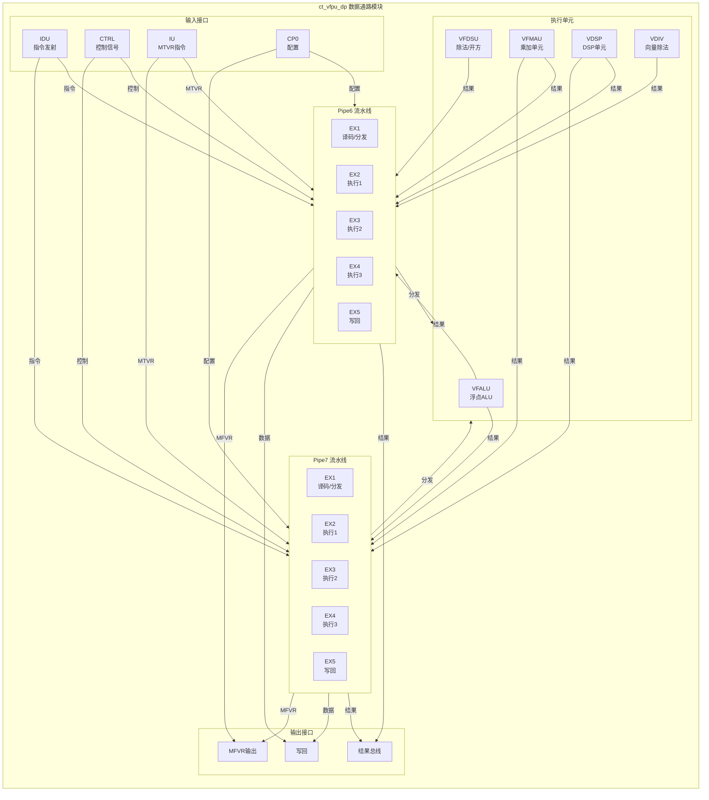
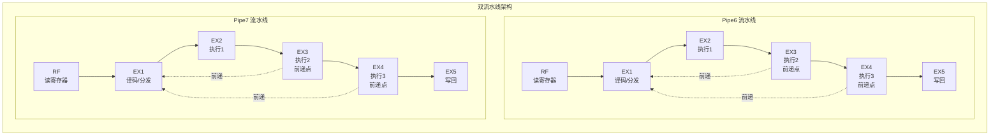
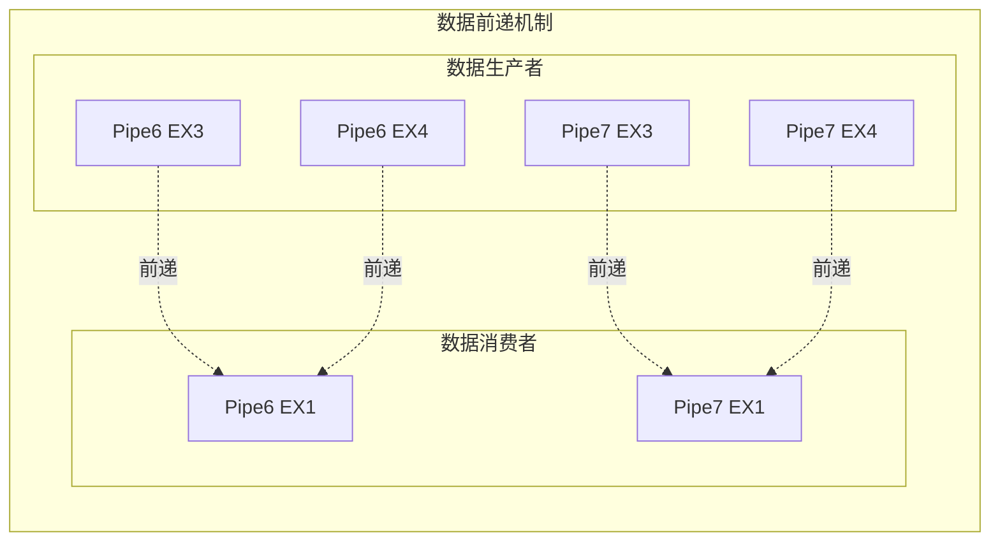

# ct_vfpu_dp 模块详细设计方案

## 文档信息

| 项目 | 内容 |
|------|------|
| 模块名称 | ct_vfpu_dp |
| 文件路径 | C910_RTL_FACTORY/gen_rtl/vfpu/rtl/ct_vfpu_dp.v |
| 文档版本 | 1.0 |
| 生成日期 | 2026-04-01 |
| 作者 | Auto-generated |

---

## 1. 模块概述

### 1.1 基本信息

| 属性 | 值 |
|------|-----|
| 模块名称 | ct_vfpu_dp |
| 模块类型 | 数据通路模块 |
| 所属子系统 | 向量浮点单元 (VFPU) |
| 主要功能 | 向量浮点数据通路管理 |
| 流水线级数 | 5级 (EX1-EX5) |
| 流水线数量 | 2条 (Pipe6, Pipe7) |

### 1.2 功能描述

ct_vfpu_dp 是向量浮点单元(VFPU)的核心数据通路模块,负责管理和调度两条独立的向量浮点流水线(Pipe6 和 Pipe7)。该模块实现了以下主要功能:

1. **指令分发与调度**
   - 接收来自 IDU(指令译码单元)的向量浮点指令
   - 根据指令类型分发到不同的执行单元(VFALU/VFDSU/VFMAU/VDSP)
   - 管理指令在流水线中的流动

2. **数据通路管理**
   - 管理源操作数的数据通路
   - 处理数据前递(Forwarding)机制
   - 维护目的寄存器信息

3. **执行单元接口**
   - VFALU: 向量浮点ALU,处理加减、比较、转换等运算
   - VFDSU: 向量浮点除法/开方单元
   - VFMAU: 向量浮点乘加单元
   - VDSP: 向量DSP处理单元
   - VDIV: 向量除法单元

4. **结果总线管理**
   - 收集各执行单元的运算结果
   - 实现写回(Write Back)控制
   - 支持MFVR(Move from Vector Register)指令

5. **特殊指令支持**
   - MTVR(Move to Vector Register): 整数到向量寄存器传输
   - MFVR(Move from Vector Register): 向量寄存器到整数传输
   - 向量乘累加(MLA)指令

### 1.3 设计特点

- **双流水线架构**: 支持两条独立的5级流水线并行执行
- **多执行单元**: 集成多种浮点运算单元,支持丰富的向量指令
- **数据前递**: 实现EX3/EX4级数据前递,减少流水线停顿
- **时钟门控**: 采用细粒度时钟门控技术,降低功耗
- **复制的寄存器索引**: 为避免时序冲突,关键寄存器索引信号采用多份复制

---

## 2. 模块接口说明

### 2.1 输入端口

#### 2.1.1 时钟与复位

| 信号名 | 位宽 | 描述 |
|--------|------|------|
| forever_cpuclk | 1 | CPU主时钟 |
| cpurst_b | 1 | 系统复位信号(低有效) |
| cp0_yy_clk_en | 1 | 全局时钟使能 |
| cp0_vfpu_icg_en | 1 | VFPU模块时钟门控使能 |
| pad_yy_icg_scan_en | 1 | 扫描测试使能 |

#### 2.1.2 CP0 配置信号

| 信号名 | 位宽 | 描述 |
|--------|------|------|
| cp0_vfpu_fxcr | 32 | 浮点扩展控制寄存器 |

#### 2.1.3 IDU 指令发射信号 (Pipe6)

| 信号名 | 位宽 | 描述 |
|--------|------|------|
| idu_vfpu_rf_pipe6_gateclk_sel | 1 | Pipe6门控时钟选择 |
| idu_vfpu_rf_pipe6_eu_sel | 12 | Pipe6执行单元选择 |
| idu_vfpu_rf_pipe6_func | 20 | Pipe6功能码 |
| idu_vfpu_rf_pipe6_iid | 7 | Pipe6指令ID |
| idu_vfpu_rf_pipe6_dst_vreg | 7 | Pipe6目的向量寄存器 |
| idu_vfpu_rf_pipe6_dst_ereg | 5 | Pipe6目的整数寄存器 |
| idu_vfpu_rf_pipe6_dst_preg | 7 | Pipe6目的物理寄存器 |
| idu_vfpu_rf_pipe6_dstv_vld | 1 | Pipe6目的向量寄存器有效 |
| idu_vfpu_rf_pipe6_dste_vld | 1 | Pipe6目的整数寄存器有效 |
| idu_vfpu_rf_pipe6_dst_vld | 1 | Pipe6目的寄存器有效 |
| idu_vfpu_rf_pipe6_srcv0_fr | 64 | Pipe6源操作数0 |
| idu_vfpu_rf_pipe6_srcv1_fr | 64 | Pipe6源操作数1 |
| idu_vfpu_rf_pipe6_imm0 | 3 | Pipe6立即数 |
| idu_vfpu_rf_pipe6_ready_stage | 3 | Pipe6就绪阶段 |
| idu_vfpu_rf_pipe6_inst_type | 6 | Pipe6指令类型 |
| idu_vfpu_rf_pipe6_vmla_type | 3 | Pipe6向量MLA类型 |
| idu_vfpu_rf_pipe6_mla_srcv2_vld | 1 | Pipe6 MLA源2有效 |
| idu_vfpu_rf_pipe6_mla_srcv2_vreg | 7 | Pipe6 MLA源2寄存器 |

#### 2.1.4 IDU 指令发射信号 (Pipe7)

| 信号名 | 位宽 | 描述 |
|--------|------|------|
| idu_vfpu_rf_pipe7_gateclk_sel | 1 | Pipe7门控时钟选择 |
| idu_vfpu_rf_pipe7_eu_sel | 12 | Pipe7执行单元选择 |
| idu_vfpu_rf_pipe7_func | 20 | Pipe7功能码 |
| idu_vfpu_rf_pipe7_dst_vreg | 7 | Pipe7目的向量寄存器 |
| idu_vfpu_rf_pipe7_dst_ereg | 5 | Pipe7目的整数寄存器 |
| idu_vfpu_rf_pipe7_dst_preg | 7 | Pipe7目的物理寄存器 |
| idu_vfpu_rf_pipe7_dstv_vld | 1 | Pipe7目的向量寄存器有效 |
| idu_vfpu_rf_pipe7_dste_vld | 1 | Pipe7目的整数寄存器有效 |
| idu_vfpu_rf_pipe7_dst_vld | 1 | Pipe7目的寄存器有效 |
| idu_vfpu_rf_pipe7_srcv0_fr | 64 | Pipe7源操作数0 |
| idu_vfpu_rf_pipe7_srcv1_fr | 64 | Pipe7源操作数1 |
| idu_vfpu_rf_pipe7_imm0 | 3 | Pipe7立即数 |
| idu_vfpu_rf_pipe7_ready_stage | 3 | Pipe7就绪阶段 |
| idu_vfpu_rf_pipe7_inst_type | 6 | Pipe7指令类型 |
| idu_vfpu_rf_pipe7_vmla_type | 3 | Pipe7向量MLA类型 |
| idu_vfpu_rf_pipe7_mla_srcv2_vld | 1 | Pipe7 MLA源2有效 |
| idu_vfpu_rf_pipe7_mla_srcv2_vreg | 7 | Pipe7 MLA源2寄存器 |

#### 2.1.5 控制信号

| 信号名 | 位宽 | 描述 |
|--------|------|------|
| ctrl_ex1_pipe6_inst_vld | 1 | Pipe6 EX1级指令有效 |
| ctrl_ex1_pipe6_eu_sel | 12 | Pipe6 EX1级执行单元选择 |
| ctrl_ex1_pipe6_mfvr_inst_vld | 1 | Pipe6 EX1级MFVR指令有效 |
| ctrl_ex2_pipe6_inst_vld | 1 | Pipe6 EX2级指令有效 |
| ctrl_ex2_pipe6_mfvr_inst_vld | 1 | Pipe6 EX2级MFVR指令有效 |
| ctrl_ex3_pipe6_inst_vld | 1 | Pipe6 EX3级指令有效 |
| ctrl_ex4_pipe6_inst_vld | 1 | Pipe6 EX4级指令有效 |
| ctrl_dp_ex2_pipe7_inst_vld | 1 | Pipe7 EX2级指令有效 |
| ctrl_ex1_pipe7_eu_sel | 12 | Pipe7 EX1级执行单元选择 |
| ctrl_ex1_pipe7_mfvr_inst_vld | 1 | Pipe7 EX1级MFVR指令有效 |
| ctrl_ex2_pipe7_inst_vld | 1 | Pipe7 EX2级指令有效 |
| ctrl_ex2_pipe7_mfvr_inst_vld | 1 | Pipe7 EX2级MFVR指令有效 |
| ctrl_ex3_pipe7_inst_vld | 1 | Pipe7 EX3级指令有效 |

#### 2.1.6 MTVR 指令信号

| 信号名 | 位宽 | 描述 |
|--------|------|------|
| iu_vfpu_ex1_pipe0_mtvr_vld | 1 | Pipe0 MTVR指令有效 |
| iu_vfpu_ex1_pipe0_mtvr_inst | 5 | Pipe0 MTVR指令类型 |
| iu_vfpu_ex1_pipe0_mtvr_vreg | 7 | Pipe0 MTVR目标寄存器 |
| iu_vfpu_ex2_pipe0_mtvr_src0 | 64 | Pipe0 MTVR源数据 |
| iu_vfpu_ex1_pipe1_mtvr_vld | 1 | Pipe1 MTVR指令有效 |
| iu_vfpu_ex1_pipe1_mtvr_inst | 5 | Pipe1 MTVR指令类型 |
| iu_vfpu_ex1_pipe1_mtvr_vreg | 7 | Pipe1 MTVR目标寄存器 |
| iu_vfpu_ex2_pipe1_mtvr_src0 | 64 | Pipe1 MTVR源数据 |

#### 2.1.7 执行单元反馈信号

**VFALU 反馈:**

| 信号名 | 位宽 | 描述 |
|--------|------|------|
| pipe6_dp_ex1_vfalu_mfvr_data | 64 | Pipe6 VFALU MFVR数据 |
| pipe6_dp_ex3_vfalu_freg_data | 64 | Pipe6 VFALU浮点结果 |
| pipe6_dp_ex3_vfalu_ereg_data | 5 | Pipe6 VFALU整数结果 |
| pipe7_dp_ex1_vfalu_mfvr_data | 64 | Pipe7 VFALU MFVR数据 |
| pipe7_dp_ex3_vfalu_freg_data | 64 | Pipe7 VFALU浮点结果 |
| pipe7_dp_ex3_vfalu_ereg_data | 5 | Pipe7 VFALU整数结果 |

**VFMAU 反馈:**

| 信号名 | 位宽 | 描述 |
|--------|------|------|
| pipe6_dp_ex3_vfmau_freg_data | 64 | Pipe6 VFMAU EX3浮点结果 |
| pipe6_dp_ex3_vfmau_ereg_data | 5 | Pipe6 VFMAU EX3整数结果 |
| pipe6_dp_ex4_vfmau_freg_data | 64 | Pipe6 VFMAU EX4浮点结果 |
| pipe6_dp_ex4_vfmau_ereg_data | 5 | Pipe6 VFMAU EX4整数结果 |
| pipe7_dp_ex3_vfmau_freg_data | 64 | Pipe7 VFMAU EX3浮点结果 |
| pipe7_dp_ex3_vfmau_ereg_data | 5 | Pipe7 VFMAU EX3整数结果 |
| pipe7_dp_ex4_vfmau_freg_data | 64 | Pipe7 VFMAU EX4浮点结果 |
| pipe7_dp_ex4_vfmau_ereg_data | 5 | Pipe7 VFMAU EX4整数结果 |

**VFDSU 反馈:**

| 信号名 | 位宽 | 描述 |
|--------|------|------|
| pipe6_dp_vfdsu_inst_vld | 1 | Pipe6 VFDSU指令有效 |
| pipe6_dp_vfdsu_vreg | 7 | Pipe6 VFDSU目标寄存器 |
| pipe6_dp_vfdsu_ereg | 5 | Pipe6 VFDSU目标整数寄存器 |
| pipe6_dp_vfdsu_freg_data | 64 | Pipe6 VFDSU浮点结果 |
| pipe6_dp_vfdsu_ereg_data | 5 | Pipe6 VFDSU整数结果 |
| vfdsu_dp_fdiv_busy | 1 | VFDSU除法忙标志 |
| vfdsu_dp_inst_wb_req | 1 | VFDSU写回请求 |

**VDIV 反馈:**

| 信号名 | 位宽 | 描述 |
|--------|------|------|
| vdivu_vfpu_ex1_pipe6_dst_vreg | 7 | VDIV目标寄存器 |
| vdivu_vfpu_ex1_pipe6_result_vld | 1 | VDIV结果有效 |
| vdivu_vfpu_pipe6_req_for_bubble | 1 | VDIV请求气泡 |
| vdivu_vfpu_pipe6_vdiv_busy | 1 | VDIV忙标志 |

**VDSP 反馈:**

| 信号名 | 位宽 | 描述 |
|--------|------|------|
| vdsp_vfpu_ex1_pipe6_mfvr_data | 64 | VDSP Pipe6 MFVR数据 |
| vdsp_vfpu_ex1_pipe7_mfvr_data | 64 | VDSP Pipe7 MFVR数据 |

**其他反馈:**

| 信号名 | 位宽 | 描述 |
|--------|------|------|
| pipe6_dp_ex1_mult_id | 1 | Pipe6多周期指令标志 |
| pipe7_dp_ex1_mult_id | 1 | Pipe7多周期指令标志 |
| idu_vfpu_is_vdiv_issue | 1 | IDU发射向量除法 |
| idu_vfpu_is_vdiv_gateclk_issue | 1 | IDU发射向量除法门控 |

### 2.2 输出端口

#### 2.2.1 控制信号输出

| 信号名 | 位宽 | 描述 |
|--------|------|------|
| dp_ctrl_ex1_pipe6_data_vld_pre | 1 | Pipe6 EX1数据有效预信号 |
| dp_ctrl_ex1_pipe7_data_vld_pre | 1 | Pipe7 EX1数据有效预信号 |
| dp_ctrl_ex2_pipe6_data_vld_pre | 1 | Pipe6 EX2数据有效预信号 |
| dp_ctrl_ex2_pipe7_data_vld_pre | 1 | Pipe7 EX2数据有效预信号 |
| dp_ctrl_ex3_pipe6_data_vld_pre | 1 | Pipe6 EX3数据有效预信号 |
| dp_ctrl_ex3_pipe7_data_vld_pre | 1 | Pipe7 EX3数据有效预信号 |
| dp_ctrl_ex3_pipe6_fwd_vld_pre | 1 | Pipe6 EX3前递有效预信号 |
| dp_ctrl_ex3_pipe7_fwd_vld_pre | 1 | Pipe7 EX3前递有效预信号 |
| dp_ctrl_ex4_pipe6_fwd_vld_pre | 1 | Pipe6 EX4前递有效预信号 |
| dp_ctrl_ex4_pipe7_fwd_vld_pre | 1 | Pipe7 EX4前递有效预信号 |
| dp_ctrl_pipe6_vfdsu_inst_vld | 1 | Pipe6 VFDSU指令有效 |

#### 2.2.2 目的寄存器信息

| 信号名 | 位宽 | 描述 |
|--------|------|------|
| dp_ex1_pipe6_dst_vld_pre | 1 | Pipe6 EX1目的有效预信号 |
| dp_ex1_pipe7_dst_vld_pre | 1 | Pipe7 EX1目的有效预信号 |
| dp_ex3_pipe6_dst_vreg | 7 | Pipe6 EX3目的向量寄存器 |
| dp_ex3_pipe6_freg_data | 64 | Pipe6 EX3浮点数据 |
| dp_ex3_pipe7_dst_vreg | 7 | Pipe7 EX3目的向量寄存器 |
| dp_ex3_pipe7_freg_data | 64 | Pipe7 EX3浮点数据 |
| dp_ex4_pipe6_dst_ereg | 5 | Pipe6 EX4目的整数寄存器 |
| dp_ex4_pipe6_dst_vreg | 7 | Pipe6 EX4目的向量寄存器 |
| dp_ex4_pipe6_normal_dste_wb_vld | 1 | Pipe6正常整数写回有效 |
| dp_ex4_pipe6_normal_dstv_wb_vld | 1 | Pipe6正常向量写回有效 |
| dp_ex4_pipe7_dst_ereg | 5 | Pipe7 EX4目的整数寄存器 |
| dp_ex4_pipe7_dst_vreg | 7 | Pipe7 EX4目的向量寄存器 |
| dp_ex4_pipe7_dste_vld | 1 | Pipe7 EX4目的整数有效 |
| dp_ex4_pipe7_dstv_vld | 1 | Pipe7 EX4目的向量有效 |

#### 2.2.3 写回数据

| 信号名 | 位宽 | 描述 |
|--------|------|------|
| dp_ex5_pipe6_ereg_data_pre | 5 | Pipe6 EX5整数数据预信号 |
| dp_ex5_pipe6_freg_data_pre | 64 | Pipe6 EX5浮点数据预信号 |
| dp_ex5_pipe7_ereg_data_pre | 5 | Pipe7 EX5整数数据预信号 |
| dp_ex5_pipe7_freg_data_pre | 64 | Pipe7 EX5浮点数据预信号 |

#### 2.2.4 结果总线

| 信号名 | 位宽 | 描述 |
|--------|------|------|
| dp_rbus_pipe6_ex1_vreg | 7 | Pipe6 EX1向量寄存器 |
| dp_rbus_pipe6_ex2_vreg | 7 | Pipe6 EX2向量寄存器 |
| dp_rbus_pipe6_ex3_vreg_dup0-3 | 7 | Pipe6 EX3向量寄存器(复制) |
| dp_rbus_pipe7_ex1_vreg | 7 | Pipe7 EX1向量寄存器 |
| dp_rbus_pipe7_ex2_vreg | 7 | Pipe7 EX2向量寄存器 |
| dp_rbus_pipe7_ex3_vreg_dup0-3 | 7 | Pipe7 EX3向量寄存器(复制) |

#### 2.2.5 执行单元接口

**VFALU 接口:**

| 信号名 | 位宽 | 描述 |
|--------|------|------|
| dp_vfalu_ex1_pipe6_sel | 3 | Pipe6 VFALU选择信号 |
| dp_vfalu_ex1_pipe6_func | 20 | Pipe6 VFALU功能码 |
| dp_vfalu_ex1_pipe6_imm0 | 3 | Pipe6 VFALU立即数 |
| dp_vfalu_ex1_pipe6_srcf0 | 64 | Pipe6 VFALU源操作数0 |
| dp_vfalu_ex1_pipe6_srcf1 | 64 | Pipe6 VFALU源操作数1 |
| dp_vfalu_ex1_pipe6_mtvr_src0 | 64 | Pipe6 VFALU MTVR源数据 |
| dp_vfalu_ex1_pipe7_sel | 3 | Pipe7 VFALU选择信号 |
| dp_vfalu_ex1_pipe7_func | 20 | Pipe7 VFALU功能码 |
| dp_vfalu_ex1_pipe7_imm0 | 3 | Pipe7 VFALU立即数 |
| dp_vfalu_ex1_pipe7_srcf0 | 64 | Pipe7 VFALU源操作数0 |
| dp_vfalu_ex1_pipe7_srcf1 | 64 | Pipe7 VFALU源操作数1 |
| dp_vfalu_ex1_pipe7_mtvr_src0 | 64 | Pipe7 VFALU MTVR源数据 |

**VFDSU 接口:**

| 信号名 | 位宽 | 描述 |
|--------|------|------|
| dp_vfdsu_ex1_pipe6_sel | 1 | Pipe6 VFDSU选择信号 |
| dp_vfdsu_ex1_pipe6_iid | 7 | Pipe6 VFDSU指令ID |
| dp_vfdsu_ex1_pipe6_dst_vreg | 7 | Pipe6 VFDSU目的寄存器 |
| dp_vfdsu_ex1_pipe6_dst_ereg | 5 | Pipe6 VFDSU目的整数寄存器 |
| dp_vfdsu_ex1_pipe6_imm0 | 3 | Pipe6 VFDSU立即数 |
| dp_vfdsu_ex1_pipe6_srcf0 | 64 | Pipe6 VFDSU源操作数0 |
| dp_vfdsu_ex1_pipe6_srcf1 | 64 | Pipe6 VFDSU源操作数1 |
| dp_vfdsu_fdiv_gateclk_issue | 1 | 浮点除法门控发射 |
| dp_vfdsu_idu_fdiv_issue | 1 | 浮点除法发射 |

**VFMAU 接口:**

| 信号名 | 位宽 | 描述 |
|--------|------|------|
| dp_vfmau_ex1_pipe6_sel | 1 | Pipe6 VFMAU选择信号 |
| dp_vfmau_ex1_pipe6_dst_vreg | 7 | Pipe6 VFMAU目的寄存器 |
| dp_vfmau_ex1_pipe6_imm0 | 3 | Pipe6 VFMAU立即数 |
| dp_vfmau_pipe6_inst_type | 6 | Pipe6 VFMAU指令类型 |
| dp_vfmau_pipe6_mla_type | 3 | Pipe6 VFMAU MLA类型 |
| dp_vfmau_pipe6_mla_srcv2_vld | 1 | Pipe6 VFMAU MLA源2有效 |
| dp_vfmau_pipe6_mla_srcv2_vreg | 7 | Pipe6 VFMAU MLA源2寄存器 |
| dp_vfmau_pipe6_sel | 1 | Pipe6 VFMAU选择 |
| dp_vfmau_pipe6_vfmau_sel | 1 | Pipe6 VFMAU单元选择 |
| dp_vfmau_ex1_pipe7_sel | 1 | Pipe7 VFMAU选择信号 |
| dp_vfmau_ex1_pipe7_dst_vreg | 7 | Pipe7 VFMAU目的寄存器 |
| dp_vfmau_ex1_pipe7_imm0 | 3 | Pipe7 VFMAU立即数 |
| dp_vfmau_pipe7_inst_type | 6 | Pipe7 VFMAU指令类型 |
| dp_vfmau_pipe7_mla_type | 3 | Pipe7 VFMAU MLA类型 |
| dp_vfmau_pipe7_mla_srcv2_vld | 1 | Pipe7 VFMAU MLA源2有效 |
| dp_vfmau_pipe7_mla_srcv2_vreg | 7 | Pipe7 VFMAU MLA源2寄存器 |
| dp_vfmau_pipe7_sel | 1 | Pipe7 VFMAU选择 |
| dp_vfmau_pipe7_vfmau_sel | 1 | Pipe7 VFMAU单元选择 |

#### 2.2.6 MFVR 指令输出

| 信号名 | 位宽 | 描述 |
|--------|------|------|
| vfpu_idu_ex1_pipe6_mfvr_inst_vld_dup0-4 | 1 | Pipe6 MFVR指令有效(复制) |
| vfpu_idu_ex1_pipe6_preg_dup0-4 | 7 | Pipe6物理寄存器(复制) |
| vfpu_idu_ex1_pipe7_mfvr_inst_vld_dup0-4 | 1 | Pipe7 MFVR指令有效(复制) |
| vfpu_idu_ex1_pipe7_preg_dup0-4 | 7 | Pipe7物理寄存器(复制) |
| vfpu_iu_ex2_pipe6_mfvr_data | 64 | Pipe6 MFVR数据输出 |
| vfpu_iu_ex2_pipe6_mfvr_data_vld | 1 | Pipe6 MFVR数据有效 |
| vfpu_iu_ex2_pipe6_mfvr_preg | 7 | Pipe6 MFVR物理寄存器 |
| vfpu_iu_ex2_pipe7_mfvr_data | 64 | Pipe7 MFVR数据输出 |
| vfpu_iu_ex2_pipe7_mfvr_data_vld | 1 | Pipe7 MFVR数据有效 |
| vfpu_iu_ex2_pipe7_mfvr_preg | 7 | Pipe7 MFVR物理寄存器 |

#### 2.2.7 状态信号

| 信号名 | 位宽 | 描述 |
|--------|------|------|
| vfpu_idu_vdiv_busy | 1 | 向量除法忙标志 |
| vfpu_idu_vdiv_wb_stall | 1 | 向量除法写回停顿 |
| vfpu_yy_xx_rm | 3 | 舍入模式 |
| vfpu_yy_xx_dqnan | 1 | 默认NaN使能 |

---

## 3. 模块框图

### 3.1 顶层架构图



### 3.2 执行单元选择逻辑

```mermaid
graph LR
    subgraph EU_SEL["执行单元选择"]
        EU_CODE["eu_sel[11:0]"]

        EU_CODE -->|bit[2:0]| VFALU_SEL["VFALU选择"]
        EU_CODE -->|bit[3]| VFDSU_SEL["VFDSU选择"]
        EU_CODE -->|bit[4]| VFMAU_SEL["VFMAU选择"]
        EU_CODE -->|bit[10:5]| VDSP_SEL["VDSP选择"]
        EU_CODE -->|bit[11]| VFDSU_RET["VFDSU返回"]
    end

    VFALU_SEL --> VFALU
    VFDSU_SEL --> VFDSU
    VFMAU_SEL --> VFMAU
    VDSP_SEL --> VDSP
```

**执行单元编码说明:**

| 位域 | 执行单元 | 说明 |
|------|----------|------|
| [2:0] | VFALU | 浮点ALU(加减、比较、转换等) |
| [3] | VFDSU | 浮点除法/开方单元(无数据返回) |
| [4] | VFMAU | 浮点乘加单元 |
| [10:5] | VDSP | 向量DSP处理单元 |
| [11] | VFDSU_RET | 浮点除法/开方单元(有数据返回) |

---

## 4. 流水线设计

### 4.1 流水线结构图



### 4.2 流水线阶段详细说明

#### 4.2.1 RF 阶段 (寄存器读取)

**主要功能:**
- 从寄存器堆读取源操作数
- 接收IDU发射的指令信息
- 准备指令执行所需的控制信号

**关键信号:**
- `idu_vfpu_rf_pipe6_gateclk_sel`: Pipe6门控时钟选择
- `idu_vfpu_rf_pipe6_srcv0_fr`: Pipe6源操作数0
- `idu_vfpu_rf_pipe6_srcv1_fr`: Pipe6源操作数1
- `idu_vfpu_rf_pipe6_dst_vreg`: Pipe6目的寄存器

#### 4.2.2 EX1 阶段 (译码/分发)

**主要功能:**
- 指令译码,确定执行单元类型
- 分发指令到相应的执行单元
- 锁存源操作数和目的寄存器信息
- 处理MTVR指令

**关键逻辑:**
```verilog
// 执行单元选择信号重建
dp_ex2_pipe6_eu_sel_pre[0] = |ctrl_ex1_pipe6_eu_sel[2:0];  // VFALU
dp_ex2_pipe6_eu_sel_pre[1] = ctrl_ex1_pipe6_eu_sel[3] || ctrl_ex1_pipe6_eu_sel[11];  // VFDSU
dp_ex2_pipe6_eu_sel_pre[2] = ctrl_ex1_pipe6_eu_sel[4];  // VFMAU
dp_ex2_pipe6_eu_sel_pre[3] = |ctrl_ex1_pipe6_eu_sel[10:5];  // VDSP
dp_ex2_pipe6_eu_sel_pre[4] = pipe6_dp_vfdsu_inst_vld || vdivu_vfpu_ex1_pipe6_result_vld;  // VFDSU返回
```

**MTVR指令处理:**
- 支持half/single/double精度
- 支持vmove(移动到元素0)和vcopy(复制到所有元素)

#### 4.2.3 EX2 阶段 (执行1)

**主要功能:**
- 执行单元开始运算
- 处理MFVR指令数据输出
- 准备前递数据

**关键逻辑:**
```verilog
// MFVR数据选择
dp_ex1_pipe6_mfvr_data[63:0] = ex1_pipe6_eu_sel_vec_mtvr
                             ? vdsp_vfpu_ex1_pipe6_mfvr_data[63:0]
                             : pipe6_dp_ex1_vfalu_mfvr_data[63:0];

// MFVR输出
vfpu_iu_ex2_pipe6_mfvr_data_vld = ctrl_ex2_pipe6_mfvr_inst_vld;
vfpu_iu_ex2_pipe6_mfvr_data[63:0] = dp_ex2_pipe6_mfvr_data[63:0];
```

#### 4.2.4 EX3 阶段 (执行2)

**主要功能:**
- 接收VFALU/VFMAU的EX3结果
- 实现第一级数据前递
- 选择最终结果数据

**关键逻辑:**
```verilog
// 浮点结果选择
case({dp_ex3_pipe6_eu_sel[2],dp_ex3_pipe6_eu_sel[0]})
  2'b10: dp_ex3_pipe6_freg_data = pipe6_dp_ex3_vfmau_freg_data;  // VFMAU
  2'b01: dp_ex3_pipe6_freg_data = pipe6_dp_ex3_vfalu_freg_data;  // VFALU
  default: dp_ex3_pipe6_freg_data = dp_ex3_pipe6_freg_data_raw;  // 其他
endcase

// 前递有效信号
dp_ex3_pipe6_vreg_fwd_vld_pre = dp_ex2_pipe6_ready_stage[0] && dp_ex2_pipe6_dstv_vld;
```

#### 4.2.5 EX4 阶段 (执行3)

**主要功能:**
- 接收VFMAU的EX4结果(乘加指令需要更多周期)
- 实现第二级数据前递
- 准备写回数据

**关键逻辑:**
```verilog
// 前递有效信号
dp_ex4_pipe6_vreg_fwd_vld_pre = dp_ex3_pipe6_vreg_fwd_vld
                              || dp_ex3_pipe6_ready_stage[1] && dp_ex3_pipe6_dstv_vld;

// 写回有效信号
dp_ex4_pipe6_wb_vld_pre[0] = !dp_ex3_pipe6_ready_stage[1] && dp_ex3_pipe6_dstv_vld;
dp_ex4_pipe6_wb_vld_pre[1] = dp_ex3_pipe6_ready_stage[1] && dp_ex3_pipe6_eu_sel[2] && dp_ex3_pipe6_dstv_vld;
```

#### 4.2.6 EX5 阶段 (写回)

**主要功能:**
- 最终数据写回
- 输出到寄存器堆

**关键逻辑:**
```verilog
// 浮点数据选择
dp_ex5_pipe6_freg_data_pre = (dp_ex4_pipe6_wb_vld[1])
                           ? pipe6_dp_ex4_vfmau_freg_data
                           : dp_ex4_pipe6_freg_data;

// 整数数据选择
dp_ex5_pipe6_ereg_data_pre = (|dp_ex4_pipe6_ereg_sel[1:0])
                           ? dp_ex4_pipe6_ereg_data_new
                           : dp_ex4_pipe6_ereg_data;
```

### 4.3 流水线控制信号

#### 4.3.1 就绪阶段 (ready_stage)

`ready_stage[2:0]` 用于标识指令在哪个阶段完成:

| 值 | 含义 | 说明 |
|----|------|------|
| 3'b001 | EX3完成 | 单周期指令 |
| 3'b010 | EX4完成 | 双周期指令 |
| 3'b100 | EX5完成 | 多周期指令 |

#### 4.3.2 数据有效信号

| 信号名 | 含义 |
|--------|------|
| dp_ctrl_ex1_pipe6_data_vld_pre | EX1级数据有效(用于前递) |
| dp_ctrl_ex2_pipe6_data_vld_pre | EX2级数据有效(用于前递) |
| dp_ctrl_ex3_pipe6_data_vld_pre | EX3级数据有效(用于前递) |
| dp_ctrl_ex3_pipe6_fwd_vld_pre | EX3级前递有效 |
| dp_ctrl_ex4_pipe6_fwd_vld_pre | EX4级前递有效 |

---

## 5. 数据前递机制

### 5.1 前递路径图



### 5.2 前递控制逻辑

#### 5.2.1 EX3 前递

**触发条件:**
```verilog
dp_ex3_pipe6_vreg_fwd_vld_pre = dp_ex2_pipe6_ready_stage[0]  // EX3完成
                              && dp_ex2_pipe6_dstv_vld;      // 目的有效
```

**前递数据:**
- 浮点数据: `dp_ex3_pipe6_freg_data[63:0]`
- 整数数据: `dp_ex3_pipe6_ereg_data[4:0]`

#### 5.2.2 EX4 前递

**触发条件:**
```verilog
dp_ex4_pipe6_vreg_fwd_vld_pre = dp_ex3_pipe6_vreg_fwd_vld     // EX3已前递
                              || (dp_ex3_pipe6_ready_stage[1]  // EX4完成
                                  && dp_ex3_pipe6_dstv_vld);   // 目的有效
```

**前递数据:**
- 浮点数据: `dp_ex4_pipe6_freg_data[63:0]` 或 `pipe6_dp_ex4_vfmau_freg_data[63:0]`
- 整数数据: `dp_ex4_pipe6_ereg_data[4:0]` 或 `pipe6_dp_ex4_vfmau_ereg_data[4:0]`

### 5.3 前递数据选择

**浮点数据选择:**
```verilog
case({dp_ex3_pipe6_eu_sel[2], dp_ex3_pipe6_eu_sel[0]})
  2'b10: dp_ex3_pipe6_freg_data = pipe6_dp_ex3_vfmau_freg_data;  // VFMAU结果
  2'b01: dp_ex3_pipe6_freg_data = pipe6_dp_ex3_vfalu_freg_data;  // VFALU结果
  default: dp_ex3_pipe6_freg_data = dp_ex3_pipe6_freg_data_raw;  // 其他
endcase
```

**整数数据选择:**
```verilog
case({dp_ex3_pipe6_eu_sel[2], dp_ex3_pipe6_eu_sel[0]})
  2'b10: dp_ex3_pipe6_ereg_data = pipe6_dp_ex3_vfmau_ereg_data;  // VFMAU结果
  2'b01: dp_ex3_pipe6_ereg_data = pipe6_dp_ex3_vfalu_ereg_data;  // VFALU结果
  default: dp_ex3_pipe6_ereg_data = dp_ex3_pipe6_ereg_data_raw;  // 其他
endcase
```

### 5.4 前递时机

| 前递源 | 前递目标 | 触发条件 | 数据来源 |
|--------|----------|----------|----------|
| EX3 | EX1 | ready_stage[0]=1 && dstv_vld=1 | VFALU/VFMAU EX3结果 |
| EX4 | EX1 | ready_stage[1]=1 && dstv_vld=1 | VFMAU EX4结果 |

---

## 6. 内部关键信号列表

### 6.1 寄存器信号

#### 6.1.1 Pipe6 EX1 阶段寄存器

| 信号名 | 位宽 | 描述 |
|--------|------|------|
| dp_ex1_pipe6_func | 20 | 功能码 |
| dp_ex1_pipe6_iid | 7 | 指令ID |
| dp_ex1_pipe6_dst_vreg | 7 | 目的向量寄存器 |
| dp_ex1_pipe6_dst_ereg | 5 | 目的整数寄存器 |
| dp_ex1_pipe6_dst_preg | 7 | 目的物理寄存器 |
| dp_ex1_pipe6_dstv_vld | 1 | 目的向量有效 |
| dp_ex1_pipe6_dste_vld | 1 | 目的整数有效 |
| dp_ex1_pipe6_imm0 | 3 | 立即数 |
| dp_ex1_pipe6_ready_stage | 3 | 就绪阶段 |
| dp_ex1_pipe6_vfpu_srcf0 | 64 | 源操作数0 |
| dp_ex1_pipe6_vfpu_srcf1 | 64 | 源操作数1 |
| dp_ex1_pipe6_mla_srcv2_vreg | 7 | MLA源2寄存器 |

#### 6.1.2 Pipe6 EX2 阶段寄存器

| 信号名 | 位宽 | 描述 |
|--------|------|------|
| dp_ex2_pipe6_eu_sel | 5 | 执行单元选择 |
| dp_ex2_pipe6_dst_vreg | 7 | 目的向量寄存器 |
| dp_ex2_pipe6_dst_ereg | 5 | 目的整数寄存器 |
| dp_ex2_pipe6_dst_preg | 7 | 目的物理寄存器 |
| dp_ex2_pipe6_dstv_vld | 1 | 目的向量有效 |
| dp_ex2_pipe6_dste_vld | 1 | 目的整数有效 |
| dp_ex2_pipe6_ready_stage | 3 | 就绪阶段 |
| dp_ex2_pipe6_freg_data | 64 | 浮点数据 |
| dp_ex2_pipe6_ereg_data | 5 | 整数数据 |
| dp_ex2_pipe6_mfvr_data | 64 | MFVR数据 |

#### 6.1.3 Pipe6 EX3 阶段寄存器

| 信号名 | 位宽 | 描述 |
|--------|------|------|
| dp_ex3_pipe6_eu_sel | 5 | 执行单元选择 |
| dp_ex3_pipe6_dst_vreg | 7 | 目的向量寄存器 |
| dp_ex3_pipe6_dst_ereg | 5 | 目的整数寄存器 |
| dp_ex3_pipe6_dstv_vld | 1 | 目的向量有效 |
| dp_ex3_pipe6_dste_vld | 1 | 目的整数有效 |
| dp_ex3_pipe6_ready_stage | 3 | 就绪阶段 |
| dp_ex3_pipe6_freg_data | 64 | 浮点数据 |
| dp_ex3_pipe6_ereg_data | 5 | 整数数据 |
| dp_ex3_pipe6_vreg_fwd_vld | 1 | 向量前递有效 |

#### 6.1.4 Pipe6 EX4 阶段寄存器

| 信号名 | 位宽 | 描述 |
|--------|------|------|
| dp_ex4_pipe6_eu_sel | 4 | 执行单元选择 |
| dp_ex4_pipe6_dst_vreg | 7 | 目的向量寄存器 |
| dp_ex4_pipe6_dst_ereg | 5 | 目的整数寄存器 |
| dp_ex4_pipe6_dstv_vld | 1 | 目的向量有效 |
| dp_ex4_pipe6_dste_vld | 1 | 目的整数有效 |
| dp_ex4_pipe6_ready_stage | 3 | 就绪阶段 |
| dp_ex4_pipe6_freg_data | 64 | 浮点数据 |
| dp_ex4_pipe6_ereg_data | 5 | 整数数据 |
| dp_ex4_pipe6_vreg_fwd_vld | 1 | 向量前递有效 |
| dp_ex4_pipe6_wb_vld | 2 | 写回有效 |

#### 6.1.5 Pipe7 寄存器

Pipe7 的寄存器结构与 Pipe6 类似,命名规则为 `dp_ex*_pipe7_*`。

### 6.2 线网信号

#### 6.2.1 时钟门控信号

| 信号名 | 描述 |
|--------|------|
| dp_ex1_pipe6_pipe_en | Pipe6 EX1时钟使能 |
| dp_ex1_pipe6_pipe_clk | Pipe6 EX1门控时钟 |
| dp_ex2_pipe6_en | Pipe6 EX2时钟使能 |
| dp_ex2_pipe6_clk | Pipe6 EX2门控时钟 |
| dp_ex3_pipe6_en | Pipe6 EX3时钟使能 |
| dp_ex3_pipe6_clk | Pipe6 EX3门控时钟 |
| dp_ex4_pipe6_en | Pipe6 EX4时钟使能 |
| dp_ex4_pipe6_clk | Pipe6 EX4门控时钟 |

#### 6.2.2 MTVR 功能编码

| 信号名 | 描述 |
|--------|------|
| pipe6_mtvr_func | Pipe6 MTVR功能码 |
| pipe6_mtvr_vreg | Pipe6 MTVR目标寄存器 |
| pipe7_mtvr_func | Pipe7 MTVR功能码 |
| pipe7_mtvr_vreg | Pipe7 MTVR目标寄存器 |

**MTVR功能码定义:**

| inst[4:0] | 功能码[19:0] | 操作 |
|-----------|--------------|------|
| [4]=1 | 20'b0010_0000_0000_0010_0001 | half精度 |
| [0]=1 | 20'b0010_1000_0000_0010_0001 | single精度 |
| [1]=1 | 20'b0011_0000_0000_0010_0001 | double精度 |
| [2]=1 | 20'b0000_0000_0000_0010_0100 | vmove到元素0 |
| [3]=1 | 20'b0000_0000_0000_0100_0100 | vcopy到所有元素 |

---

## 7. 参数定义

| 参数名 | 值 | 描述 |
|--------|-----|------|
| VLEN | 128 | 向量长度 |
| EU_WIDTH | 12 | 执行单元选择位宽 |
| SILEN | 64 | 单指令长度 |
| FPR_MSB | 63 | 浮点寄存器最高位 |
| VREG | 7 | 向量寄存器索引位宽 |
| VL | 8 | 向量长度寄存器位宽 |
| XLEN | 64 | 整数寄存器位宽 |
| FUNC_WIDTH | 20 | 功能码位宽 |

---

## 8. 设计要点

### 8.1 时钟门控设计

模块采用细粒度时钟门控技术,每个流水线阶段都有独立的门控时钟:

```verilog
gated_clk_cell x_dp_ex1_pipe6_pipe_gated_clk (
  .clk_in      (forever_cpuclk),
  .clk_out     (dp_ex1_pipe6_pipe_clk),
  .external_en (1'b0),
  .global_en   (cp0_yy_clk_en),
  .local_en    (dp_ex1_pipe6_pipe_en),
  .module_en   (cp0_vfpu_icg_en),
  .pad_yy_icg_scan_en (pad_yy_icg_scan_en)
);
```

**时钟使能条件:**
- EX1: `idu_vfpu_rf_pipe6_gateclk_sel || iu_vfpu_ex1_pipe0_mtvr_vld`
- EX2: `ctrl_ex1_pipe6_inst_vld || pipe6_dp_vfdsu_inst_vld || vdivu_vfpu_ex1_pipe6_result_vld`
- EX3: `ctrl_ex2_pipe6_inst_vld`
- EX4: `ctrl_ex3_pipe6_inst_vld`

### 8.2 寄存器索引复制

为避免时序冲突,关键寄存器索引信号采用多份复制:

```verilog
// 目的寄存器复制
dp_ex1_pipe6_dst_vreg_dup0[VREG-1:0]
dp_ex1_pipe6_dst_vreg_dup1[VREG-1:0]
dp_ex1_pipe6_dst_vreg_dup2[VREG-1:0]

// 物理寄存器复制
dp_ex1_pipe6_dst_preg_dup0[6:0]
dp_ex1_pipe6_dst_preg_dup1[6:0]
dp_ex1_pipe6_dst_preg_dup2[6:0]
dp_ex1_pipe6_dst_preg_dup3[6:0]
```

### 8.3 MFVR指令处理

MFVR(Move from Vector Register)指令需要将向量寄存器数据传送到整数寄存器:

**处理流程:**
1. EX1: 检测MFVR指令,锁存目标物理寄存器
2. EX2: 从执行单元获取数据,输出到IU

**关键信号:**
```verilog
// MFVR指令有效(复制多份)
vfpu_idu_ex1_pipe6_mfvr_inst_vld_dup0-4

// MFVR物理寄存器(复制多份)
vfpu_idu_ex1_pipe6_preg_dup0-4

// MFVR数据输出
vfpu_iu_ex2_pipe6_mfvr_data[63:0]
vfpu_iu_ex2_pipe6_mfvr_data_vld
vfpu_iu_ex2_pipe6_mfvr_preg[6:0]
```

### 8.4 除法指令处理

除法指令需要特殊处理,因为执行周期较长:

**关键信号:**
```verilog
// 除法忙标志
vfpu_idu_vdiv_busy = vdivu_vfpu_pipe6_vdiv_busy || vfdsu_dp_fdiv_busy;

// 除法写回停顿
vfpu_idu_vdiv_wb_stall = vdivu_vfpu_pipe6_req_for_bubble || vfdsu_dp_inst_wb_req;

// 除法发射
dp_vfdsu_fdiv_gateclk_issue = idu_vfpu_is_vdiv_gateclk_issue;
dp_vfdsu_idu_fdiv_issue = idu_vfpu_is_vdiv_issue;
```

### 8.5 舍入模式与NaN处理

从CP0配置寄存器提取浮点运算控制信息:

```verilog
// 舍入模式
vfpu_yy_xx_rm[2:0] = cp0_vfpu_fxcr[26:24];

// 默认NaN使能
vfpu_yy_xx_dqnan = cp0_vfpu_fxcr[23];
```

---

## 9. 时序分析

### 9.1 关键路径

1. **前递路径**: EX3/EX4 -> EX1
   - 前递数据选择逻辑
   - 寄存器索引比较

2. **执行单元结果选择**: EX3/EX4
   - 多路选择器(VFALU/VFMAU/其他)
   - 数据位宽64位

3. **MTVR指令路径**: IU -> EX1 -> EX2
   - 功能码生成
   - 数据传递

### 9.2 时序优化建议

1. **寄存器复制**: 已实现,避免时序冲突
2. **门控时钟**: 已实现,降低功耗
3. **流水线平衡**: EX1-EX5各级逻辑基本均衡

---

## 10. 验证要点

### 10.1 功能验证

1. **指令分发正确性**
   - 各执行单元选择正确
   - 功能码传递正确

2. **数据前递正确性**
   - EX3前递触发条件
   - EX4前递触发条件
   - 前递数据选择正确

3. **MFVR指令正确性**
   - 数据输出正确
   - 物理寄存器索引正确

4. **MTVR指令正确性**
   - 功能码生成正确
   - 数据传递正确

### 10.2 边界条件

1. **复位时序**: 验证所有寄存器正确复位
2. **流水线停顿**: 验证除法指令导致的停顿
3. **前递冲突**: 验证多条指令同时前递的情况

### 10.3 性能验证

1. **吞吐率**: 验证双流水线并行执行
2. **延迟**: 验证各类型指令的执行周期
3. **前递效率**: 验证前递机制减少停顿的效果

---

## 11. 修订历史

| 版本 | 日期 | 作者 | 说明 |
|------|------|------|------|
| 1.0 | 2026-04-01 | Auto-generated | 初始版本 |

---

## 附录A: 信号命名规则

### A.1 前缀说明

| 前缀 | 含义 |
|------|------|
| idu_ | 来自IDU的信号 |
| ctrl_ | 来自控制单元的信号 |
| dp_ | 数据通路内部信号 |
| vfpu_ | VFPU输出信号 |
| iu_ | 来自IU的信号 |
| cp0_ | 来自CP0的信号 |
| pipe*_ | 流水线特定信号 |

### A.2 后缀说明

| 后缀 | 含义 |
|------|------|
| _vld | 有效信号 |
| _pre | 预信号 |
| _dup* | 复制信号 |
| _en | 使能信号 |
| _clk | 时钟信号 |
| _data | 数据信号 |
| _sel | 选择信号 |
| _fwd | 前递信号 |
| _wb | 写回信号 |

---

## 附录B: 执行单元功能

### B.1 VFALU (Vector Floating-point ALU)

**支持操作:**
- 浮点加减法
- 浮点比较
- 浮点转换(精度转换)
- 浮点取绝对值/取反
- 浮点最大/最小值

**延迟:** 1-2周期

### B.2 VFDSU (Vector Floating-point Divide/Sqrt Unit)

**支持操作:**
- 浮点除法
- 浮点开方

**延迟:** 多周期(可配置)

### B.3 VFMAU (Vector Floating-point Multiply-Add Unit)

**支持操作:**
- 浮点乘法
- 浮点乘加(FMA)
- 浮点乘减
- 向量乘累加(MLA)

**延迟:** 2-3周期

### B.4 VDSP (Vector DSP)

**支持操作:**
- 向量运算
- DSP特定操作

**延迟:** 可变

### B.5 VDIV (Vector Divide)

**支持操作:**
- 向量除法

**延迟:** 多周期

---

**文档结束**
