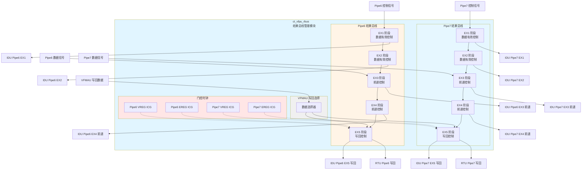
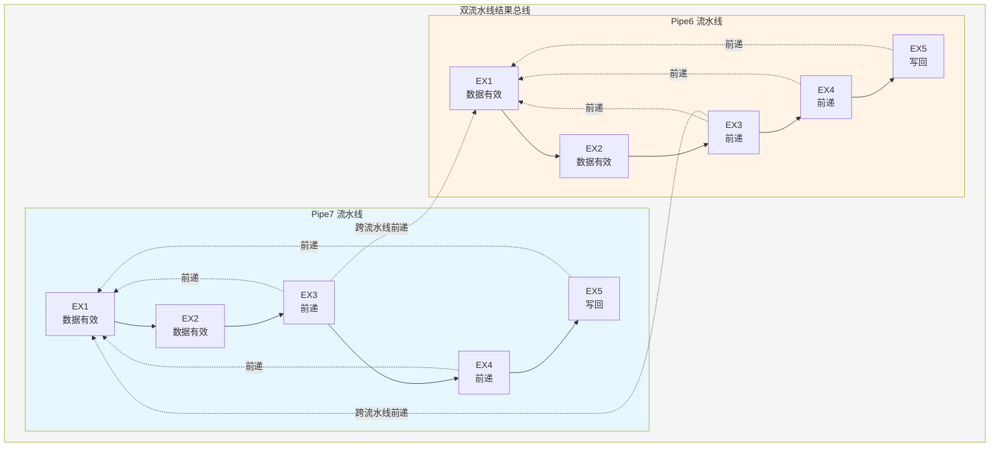
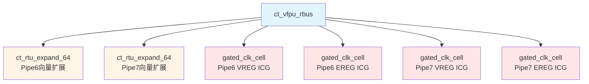

# ct_vfpu_rbus 模块详细方案文档

## 1. 模块概述

### 1.1 基本信息

| 属性 | 值 |
|------|-----|
| 模块名称 | ct_vfpu_rbus |
| 文件路径 | C910_RTL_FACTORY/gen_rtl/vfpu/rtl/ct_vfpu_rbus.v |
| 功能分类 | 结果总线管理 |
| 设计层次 | VFPU 子系统 |

### 1.2 功能描述

ct_vfpu_rbus 模块是向量浮点单元(VFPU)的结果总线管理模块,负责管理两条独立流水线(Pipe6 和 Pipe7)的运算结果传输、数据前递和写回操作。该模块实现了完整的浮点寄存器(FPR)和扩展寄存器(EREG)的写回机制,支持多级流水线的数据前递,确保数据相关性的正确处理。

**核心功能:**

1. **双流水线结果管理**: 独立管理 Pipe6 和 Pipe7 两条流水线的运算结果
2. **多级数据前递**: 支持 EX1-EX5 五个执行阶段的数据前递,减少流水线停顿
3. **寄存器写回**: 实现浮点寄存器(FPR/VREG)和扩展寄存器(EREG)的写回操作
4. **数据有效性控制**: 管理各级流水线的数据有效信号,支持 Flush 操作
5. **门控时钟优化**: 采用门控时钟技术降低功耗

### 1.3 设计特点

- **双流水线架构**: Pipe6 和 Pipe7 独立运行,提高指令吞吐率
- **多级前递机制**: EX1-EX5 五级前递,有效解决数据相关性问题
- **寄存器类型支持**: 支持浮点寄存器(FPR)、向量寄存器(VREG)和扩展寄存器(EREG)
- **信号多路复制**: 关键信号提供多个副本(dup0-dup3),降低时序压力
- **门控时钟设计**: 采用集成门控时钟单元(ICG),实现低功耗设计
- **Flush 支持**: 支持全局 Flush 信号,实现流水线冲刷

### 1.4 参数定义

| 参数名 | 默认值 | 说明 |
|--------|--------|------|
| FPR_MSB | 63 | 浮点寄存器数据最高位 |
| SILEN | 64 | 向量寄存器数据位宽 |
| VREG | 7 | 向量寄存器地址位宽 |

---

## 2. 模块接口说明

### 2.1 输入端口

#### 2.1.1 时钟与复位

| 信号名 | 方向 | 位宽 | 描述 |
|--------|------|------|------|
| forever_cpuclk | input | 1 | CPU 主时钟 |
| cpurst_b | input | 1 | 全局复位信号,低有效 |
| cp0_yy_clk_en | input | 1 | 全局时钟使能 |
| cp0_vfpu_icg_en | input | 1 | VFPU 门控时钟使能 |
| pad_yy_icg_scan_en | input | 1 | 扫描测试使能 |

#### 2.1.2 Pipe6 控制信号

| 信号名 | 方向 | 位宽 | 描述 |
|--------|------|------|------|
| ctrl_ex1_pipe6_data_vld | input | 1 | EX1 阶段 Pipe6 数据有效 |
| ctrl_ex1_pipe6_data_vld_dup0-2 | input | 1 | EX1 阶段 Pipe6 数据有效副本 |
| ctrl_ex2_pipe6_data_vld | input | 1 | EX2 阶段 Pipe6 数据有效 |
| ctrl_ex2_pipe6_data_vld_dup0-2 | input | 1 | EX2 阶段 Pipe6 数据有效副本 |
| ctrl_ex3_pipe6_data_vld | input | 1 | EX3 阶段 Pipe6 数据有效 |
| ctrl_ex3_pipe6_data_vld_dup0-2 | input | 1 | EX3 阶段 Pipe6 数据有效副本 |
| ctrl_ex3_pipe6_fwd_vld | input | 1 | EX3 阶段 Pipe6 前递有效 |
| ctrl_ex4_pipe6_fwd_vld | input | 1 | EX4 阶段 Pipe6 前递有效 |
| ctrl_ex5_pipe6_clk | input | 1 | EX5 阶段 Pipe6 时钟门控使能 |

#### 2.1.3 Pipe7 控制信号

| 信号名 | 方向 | 位宽 | 描述 |
|--------|------|------|------|
| ctrl_ex1_pipe7_data_vld | input | 1 | EX1 阶段 Pipe7 数据有效 |
| ctrl_ex1_pipe7_data_vld_dup0-2 | input | 1 | EX1 阶段 Pipe7 数据有效副本 |
| ctrl_ex2_pipe7_data_vld | input | 1 | EX2 阶段 Pipe7 数据有效 |
| ctrl_ex2_pipe7_data_vld_dup0-2 | input | 1 | EX2 阶段 Pipe7 数据有效副本 |
| ctrl_ex3_pipe7_data_vld | input | 1 | EX3 阶段 Pipe7 数据有效 |
| ctrl_ex3_pipe7_data_vld_dup0-2 | input | 1 | EX3 阶段 Pipe7 数据有效副本 |
| ctrl_ex3_pipe7_fwd_vld | input | 1 | EX3 阶段 Pipe7 前递有效 |
| ctrl_ex4_pipe7_fwd_vld | input | 1 | EX4 阶段 Pipe7 前递有效 |
| ctrl_ex4_pipe7_inst_vld | input | 1 | EX4 阶段 Pipe7 指令有效 |
| ctrl_ex5_pipe7_clk | input | 1 | EX5 阶段 Pipe7 时钟门控使能 |

#### 2.1.4 Pipe6 数据信号

| 信号名 | 方向 | 位宽 | 描述 |
|--------|------|------|------|
| dp_ex3_pipe6_dst_vreg | input | 7 | EX3 阶段 Pipe6 目标向量寄存器地址 |
| dp_ex3_pipe6_freg_data | input | 64 | EX3 阶段 Pipe6 浮点寄存器数据 |
| dp_ex4_pipe6_dst_vreg | input | 7 | EX4 阶段 Pipe6 目标向量寄存器地址 |
| dp_ex4_pipe6_dst_ereg | input | 5 | EX4 阶段 Pipe6 目标扩展寄存器地址 |
| dp_ex4_pipe6_normal_dstv_wb_vld | input | 1 | EX4 阶段 Pipe6 向量寄存器写回有效 |
| dp_ex4_pipe6_normal_dste_wb_vld | input | 1 | EX4 阶段 Pipe6 扩展寄存器写回有效 |
| dp_ex5_pipe6_freg_data_pre | input | 64 | EX5 阶段 Pipe6 浮点寄存器数据(预处理) |
| dp_ex5_pipe6_ereg_data_pre | input | 5 | EX5 阶段 Pipe6 扩展寄存器数据(预处理) |

#### 2.1.5 Pipe7 数据信号

| 信号名 | 方向 | 位宽 | 描述 |
|--------|------|------|------|
| dp_ex3_pipe7_dst_vreg | input | 7 | EX3 阶段 Pipe7 目标向量寄存器地址 |
| dp_ex3_pipe7_freg_data | input | 64 | EX3 阶段 Pipe7 浮点寄存器数据 |
| dp_ex4_pipe7_dst_vreg | input | 7 | EX4 阶段 Pipe7 目标向量寄存器地址 |
| dp_ex4_pipe7_dst_ereg | input | 5 | EX4 阶段 Pipe7 目标扩展寄存器地址 |
| dp_ex4_pipe7_dstv_vld | input | 1 | EX4 阶段 Pipe7 向量寄存器目标有效 |
| dp_ex4_pipe7_dste_vld | input | 1 | EX4 阶段 Pipe7 扩展寄存器目标有效 |
| dp_ex5_pipe7_freg_data_pre | input | 64 | EX5 阶段 Pipe7 浮点寄存器数据(预处理) |
| dp_ex5_pipe7_ereg_data_pre | input | 5 | EX5 阶段 Pipe7 扩展寄存器数据(预处理) |

#### 2.1.6 Pipe6 向量寄存器地址

| 信号名 | 方向 | 位宽 | 描述 |
|--------|------|------|------|
| dp_rbus_pipe6_ex1_vreg | input | 7 | EX1 阶段 Pipe6 向量寄存器地址 |
| dp_rbus_pipe6_ex1_vreg_dup0-2 | input | 7 | EX1 阶段 Pipe6 向量寄存器地址副本 |
| dp_rbus_pipe6_ex2_vreg | input | 7 | EX2 阶段 Pipe6 向量寄存器地址 |
| dp_rbus_pipe6_ex2_vreg_dup0-2 | input | 7 | EX2 阶段 Pipe6 向量寄存器地址副本 |
| dp_rbus_pipe6_ex3_vreg_dup0-3 | input | 7 | EX3 阶段 Pipe6 向量寄存器地址副本 |

#### 2.1.7 Pipe7 向量寄存器地址

| 信号名 | 方向 | 位宽 | 描述 |
|--------|------|------|------|
| dp_rbus_pipe7_ex1_vreg | input | 7 | EX1 阶段 Pipe7 向量寄存器地址 |
| dp_rbus_pipe7_ex1_vreg_dup0-2 | input | 7 | EX1 阶段 Pipe7 向量寄存器地址副本 |
| dp_rbus_pipe7_ex2_vreg | input | 7 | EX2 阶段 Pipe7 向量寄存器地址 |
| dp_rbus_pipe7_ex2_vreg_dup0-2 | input | 7 | EX2 阶段 Pipe7 向量寄存器地址副本 |
| dp_rbus_pipe7_ex3_vreg_dup0-3 | input | 7 | EX3 阶段 Pipe7 向量寄存器地址副本 |

#### 2.1.8 Pipe6 前递控制信号

| 信号名 | 方向 | 位宽 | 描述 |
|--------|------|------|------|
| pipe6_rbus_ex1_fmla_data_vld | input | 1 | EX1 阶段 Pipe6 融合乘加数据有效 |
| pipe6_rbus_ex1_fmla_data_vld_dup0-2 | input | 1 | EX1 阶段 Pipe6 融合乘加数据有效副本 |
| pipe6_rbus_ex2_fmla_data_vld | input | 1 | EX2 阶段 Pipe6 融合乘加数据有效 |
| pipe6_rbus_ex2_fmla_data_vld_dup0-2 | input | 1 | EX2 阶段 Pipe6 融合乘加数据有效副本 |
| pipe6_rbus_pipe6_fmla_no_fwd | input | 1 | Pipe6 融合乘加无前递标志 |
| pipe6_rbus_pipe7_fmla_no_fwd | input | 1 | Pipe7 融合乘加无前递标志(来自Pipe6) |

#### 2.1.9 Pipe7 前递控制信号

| 信号名 | 方向 | 位宽 | 描述 |
|--------|------|------|------|
| pipe7_rbus_ex1_fmla_data_vld | input | 1 | EX1 阶段 Pipe7 融合乘加数据有效 |
| pipe7_rbus_ex1_fmla_data_vld_dup0-2 | input | 1 | EX1 阶段 Pipe7 融合乘加数据有效副本 |
| pipe7_rbus_ex2_fmla_data_vld | input | 1 | EX2 阶段 Pipe7 融合乘加数据有效 |
| pipe7_rbus_ex2_fmla_data_vld_dup0-2 | input | 1 | EX2 阶段 Pipe7 融合乘加数据有效副本 |
| pipe7_rbus_pipe6_fmla_no_fwd | input | 1 | Pipe6 融合乘加无前递标志(来自Pipe7) |
| pipe7_rbus_pipe7_fmla_no_fwd | input | 1 | Pipe7 融合乘加无前递标志 |

#### 2.1.10 VFMAU 写回信号

| 信号名 | 方向 | 位宽 | 描述 |
|--------|------|------|------|
| pipe6_rbus_vfmau_vreg_wb_vld | input | 1 | Pipe6 VFMAU 向量寄存器写回有效 |
| pipe6_rbus_vfmau_freg_wb_data | input | 64 | Pipe6 VFMAU 浮点寄存器写回数据 |
| pipe6_rbus_vfmau_ereg_wb_vld | input | 1 | Pipe6 VFMAU 扩展寄存器写回有效 |
| pipe6_rbus_vfmau_ereg_wb_data | input | 5 | Pipe6 VFMAU 扩展寄存器写回数据 |
| pipe7_rbus_vfmau_vreg_wb_vld | input | 1 | Pipe7 VFMAU 向量寄存器写回有效 |
| pipe7_rbus_vfmau_freg_wb_data | input | 64 | Pipe7 VFMAU 浮点寄存器写回数据 |
| pipe7_rbus_vfmau_ereg_wb_vld | input | 1 | Pipe7 VFMAU 扩展寄存器写回有效 |
| pipe7_rbus_vfmau_ereg_wb_data | input | 5 | Pipe7 VFMAU 扩展寄存器写回数据 |

#### 2.1.11 其他控制信号

| 信号名 | 方向 | 位宽 | 描述 |
|--------|------|------|------|
| rtu_yy_xx_flush | input | 1 | 全局 Flush 信号 |
| vdsp_vfpu_pipe6_inside_fwd_aval | input | 1 | Pipe6 内部前递可用标志 |
| vdsp_vfpu_pipe7_inside_fwd_aval | input | 1 | Pipe7 内部前递可用标志 |

### 2.2 输出端口

#### 2.2.1 Pipe6 EX1 阶段输出(IDU)

| 信号名 | 方向 | 位宽 | 描述 |
|--------|------|------|------|
| vfpu_idu_ex1_pipe6_data_vld_dup0-3 | output | 1 | EX1 阶段 Pipe6 数据有效(4个副本) |
| vfpu_idu_ex1_pipe6_fmla_data_vld_dup0-3 | output | 1 | EX1 阶段 Pipe6 融合乘加数据有效(4个副本) |
| vfpu_idu_ex1_pipe6_vreg_dup0-3 | output | 7 | EX1 阶段 Pipe6 向量寄存器地址(4个副本) |

#### 2.2.2 Pipe6 EX2 阶段输出(IDU)

| 信号名 | 方向 | 位宽 | 描述 |
|--------|------|------|------|
| vfpu_idu_ex2_pipe6_data_vld_dup0-3 | output | 1 | EX2 阶段 Pipe6 数据有效(4个副本) |
| vfpu_idu_ex2_pipe6_fmla_data_vld_dup0-3 | output | 1 | EX2 阶段 Pipe6 融合乘加数据有效(4个副本) |
| vfpu_idu_ex2_pipe6_vreg_dup0-3 | output | 7 | EX2 阶段 Pipe6 向量寄存器地址(4个副本) |

#### 2.2.3 Pipe6 EX3 阶段输出(IDU)

| 信号名 | 方向 | 位宽 | 描述 |
|--------|------|------|------|
| vfpu_idu_ex3_pipe6_data_vld_dup0-3 | output | 1 | EX3 阶段 Pipe6 数据有效(4个副本) |
| vfpu_idu_ex3_pipe6_vreg_dup0-3 | output | 7 | EX3 阶段 Pipe6 向量寄存器地址(4个副本) |
| vfpu_idu_ex3_pipe6_fwd_vreg | output | 7 | EX3 阶段 Pipe6 前递向量寄存器地址 |
| vfpu_idu_ex3_pipe6_fwd_vreg_vld | output | 1 | EX3 阶段 Pipe6 前递有效 |
| vfpu_idu_ex3_pipe6_fwd_vreg_fr_data | output | 64 | EX3 阶段 Pipe6 前递浮点寄存器数据 |
| vfpu_idu_ex3_pipe6_fwd_vreg_vr0_data | output | 64 | EX3 阶段 Pipe6 前递向量寄存器数据0 |
| vfpu_idu_ex3_pipe6_fwd_vreg_vr1_data | output | 64 | EX3 阶段 Pipe6 前递向量寄存器数据1 |

#### 2.2.4 Pipe6 EX4 阶段输出(IDU)

| 信号名 | 方向 | 位宽 | 描述 |
|--------|------|------|------|
| vfpu_idu_ex4_pipe6_fwd_vreg | output | 7 | EX4 阶段 Pipe6 前递向量寄存器地址 |
| vfpu_idu_ex4_pipe6_fwd_vreg_vld | output | 1 | EX4 阶段 Pipe6 前递有效 |
| vfpu_idu_ex4_pipe6_fwd_vreg_fr_data | output | 64 | EX4 阶段 Pipe6 前递浮点寄存器数据 |
| vfpu_idu_ex4_pipe6_fwd_vreg_vr0_data | output | 64 | EX4 阶段 Pipe6 前递向量寄存器数据0 |
| vfpu_idu_ex4_pipe6_fwd_vreg_vr1_data | output | 64 | EX4 阶段 Pipe6 前递向量寄存器数据1 |

#### 2.2.5 Pipe6 EX5 阶段输出(IDU)

| 信号名 | 方向 | 位宽 | 描述 |
|--------|------|------|------|
| vfpu_idu_ex5_pipe6_fwd_vreg | output | 7 | EX5 阶段 Pipe6 前递向量寄存器地址 |
| vfpu_idu_ex5_pipe6_fwd_vreg_vld | output | 1 | EX5 阶段 Pipe6 前递有效 |
| vfpu_idu_ex5_pipe6_wb_vreg_dup0-3 | output | 7 | EX5 阶段 Pipe6 写回向量寄存器地址(4个副本) |
| vfpu_idu_ex5_pipe6_wb_vreg_vld_dup0-3 | output | 1 | EX5 阶段 Pipe6 写回有效(4个副本) |
| vfpu_idu_ex5_pipe6_wb_vreg_fr_vld | output | 1 | EX5 阶段 Pipe6 浮点寄存器写回有效 |
| vfpu_idu_ex5_pipe6_wb_vreg_fr_data | output | 64 | EX5 阶段 Pipe6 浮点寄存器写回数据 |
| vfpu_idu_ex5_pipe6_wb_vreg_fr_expand | output | 64 | EX5 阶段 Pipe6 浮点寄存器扩展 |
| vfpu_idu_ex5_pipe6_wb_vreg_vr0_vld | output | 1 | EX5 阶段 Pipe6 向量寄存器0写回有效 |
| vfpu_idu_ex5_pipe6_wb_vreg_vr0_data | output | 64 | EX5 阶段 Pipe6 向量寄存器0写回数据 |
| vfpu_idu_ex5_pipe6_wb_vreg_vr0_expand | output | 64 | EX5 阶段 Pipe6 向量寄存器0扩展 |
| vfpu_idu_ex5_pipe6_wb_vreg_vr1_vld | output | 1 | EX5 阶段 Pipe6 向量寄存器1写回有效 |
| vfpu_idu_ex5_pipe6_wb_vreg_vr1_data | output | 64 | EX5 阶段 Pipe6 向量寄存器1写回数据 |
| vfpu_idu_ex5_pipe6_wb_vreg_vr1_expand | output | 64 | EX5 阶段 Pipe6 向量寄存器1扩展 |
| vfpu_idu_ex5_pipe6_wb_ereg | output | 5 | EX5 阶段 Pipe6 写回扩展寄存器地址 |
| vfpu_idu_ex5_pipe6_wb_ereg_data | output | 6 | EX5 阶段 Pipe6 写回扩展寄存器数据 |
| vfpu_idu_ex5_pipe6_wb_ereg_vld | output | 1 | EX5 阶段 Pipe6 扩展寄存器写回有效 |

#### 2.2.6 Pipe6 输出到 RTU

| 信号名 | 方向 | 位宽 | 描述 |
|--------|------|------|------|
| vfpu_rtu_ex5_pipe6_wb_ereg | output | 5 | EX5 阶段 Pipe6 写回扩展寄存器地址 |
| vfpu_rtu_ex5_pipe6_ereg_wb_vld | output | 1 | EX5 阶段 Pipe6 扩展寄存器写回有效 |
| vfpu_rtu_ex5_pipe6_wb_vreg_expand | output | 64 | EX5 阶段 Pipe6 写回向量寄存器扩展 |
| vfpu_rtu_ex5_pipe6_wb_vreg_fr_vld | output | 1 | EX5 阶段 Pipe6 浮点寄存器写回有效 |
| vfpu_rtu_ex5_pipe6_wb_vreg_vr_vld | output | 1 | EX5 阶段 Pipe6 向量寄存器写回有效 |

#### 2.2.7 Pipe7 输出信号

Pipe7 的输出信号结构与 Pipe6 类似,包括:
- EX1-EX3 阶段的数据有效信号和向量寄存器地址
- EX3-EX4 阶段的前递信号
- EX5 阶段的写回信号
- 输出到 IDU 和 RTU 的信号

详细信号列表与 Pipe6 对应,此处不再赘述。

#### 2.2.8 无前递标志

| 信号名 | 方向 | 位宽 | 描述 |
|--------|------|------|------|
| vfpu_idu_pipe6_vmla_srcv2_no_fwd | output | 1 | Pipe6 向量乘加源操作数2无前递标志 |
| vfpu_idu_pipe7_vmla_srcv2_no_fwd | output | 1 | Pipe7 向量乘加源操作数2无前递标志 |

---

## 3. 模块框图

### 3.1 模块架构图



### 3.2 流水线结构图



### 3.3 主要数据连线

| 源模块/阶段 | 目标模块/阶段 | 信号名 | 位宽 | 说明 |
|-------------|---------------|--------|------|------|
| Pipe6 EX1 | IDU | vfpu_idu_ex1_pipe6_data_vld | 1 | EX1 数据有效标志 |
| Pipe6 EX2 | IDU | vfpu_idu_ex2_pipe6_data_vld | 1 | EX2 数据有效标志 |
| Pipe6 EX3 | IDU | vfpu_idu_ex3_pipe6_fwd_vreg_vld | 1 | EX3 前递有效 |
| Pipe6 EX4 | IDU | vfpu_idu_ex4_pipe6_fwd_vreg_vld | 1 | EX4 前递有效 |
| Pipe6 EX5 | IDU | vfpu_idu_ex5_pipe6_wb_vreg_vld | 1 | EX5 写回有效 |
| Pipe6 EX5 | RTU | vfpu_rtu_ex5_pipe6_wb_vreg_fr_vld | 1 | 浮点寄存器写回有效 |
| Pipe6 EX5 | RTU | vfpu_rtu_ex5_pipe6_ereg_wb_vld | 1 | 扩展寄存器写回有效 |
| Pipe7 EX1 | IDU | vfpu_idu_ex1_pipe7_data_vld | 1 | EX1 数据有效标志 |
| Pipe7 EX2 | IDU | vfpu_idu_ex2_pipe7_data_vld | 1 | EX2 数据有效标志 |
| Pipe7 EX3 | IDU | vfpu_idu_ex3_pipe7_fwd_vreg_vld | 1 | EX3 前递有效 |
| Pipe7 EX4 | IDU | vfpu_idu_ex4_pipe7_fwd_vreg_vld | 1 | EX4 前递有效 |
| Pipe7 EX5 | IDU | vfpu_idu_ex5_pipe7_wb_vreg_vld | 1 | EX5 写回有效 |
| Pipe7 EX5 | RTU | vfpu_rtu_ex5_pipe7_wb_vreg_fr_vld | 1 | 浮点寄存器写回有效 |
| Pipe7 EX5 | RTU | vfpu_rtu_ex5_pipe7_ereg_wb_vld | 1 | 扩展寄存器写回有效 |
| VFMAU | Pipe6 EX5 | pipe6_rbus_vfmau_freg_wb_data | 64 | VFMAU 浮点寄存器数据 |
| VFMAU | Pipe7 EX5 | pipe7_rbus_vfmau_freg_wb_data | 64 | VFMAU 浮点寄存器数据 |

---

## 4. 结果总线逻辑说明

### 4.1 数据有效性控制

#### 4.1.1 Pipe6 数据有效性

**EX1-EX3 阶段数据有效信号传递:**

```verilog
// EX1 阶段
assign vfpu_idu_ex1_pipe6_data_vld_dup0 = ctrl_ex1_pipe6_data_vld;
assign vfpu_idu_ex1_pipe6_data_vld_dup1 = ctrl_ex1_pipe6_data_vld_dup0;
assign vfpu_idu_ex1_pipe6_data_vld_dup2 = ctrl_ex1_pipe6_data_vld_dup1;
assign vfpu_idu_ex1_pipe6_data_vld_dup3 = ctrl_ex1_pipe6_data_vld_dup2;

// EX2 阶段
assign vfpu_idu_ex2_pipe6_data_vld_dup0 = ctrl_ex2_pipe6_data_vld;
assign vfpu_idu_ex2_pipe6_data_vld_dup1 = ctrl_ex2_pipe6_data_vld_dup0;
assign vfpu_idu_ex2_pipe6_data_vld_dup2 = ctrl_ex2_pipe6_data_vld_dup1;
assign vfpu_idu_ex2_pipe6_data_vld_dup3 = ctrl_ex2_pipe6_data_vld_dup2;

// EX3 阶段
assign vfpu_idu_ex3_pipe6_data_vld_dup0 = ctrl_ex3_pipe6_data_vld;
assign vfpu_idu_ex3_pipe6_data_vld_dup1 = ctrl_ex3_pipe6_data_vld_dup0;
assign vfpu_idu_ex3_pipe6_data_vld_dup2 = ctrl_ex3_pipe6_data_vld_dup1;
assign vfpu_idu_ex3_pipe6_data_vld_dup3 = ctrl_ex3_pipe6_data_vld_dup2;
```

**设计要点:**
- 每个阶段提供 4 个副本(dup0-dup3),降低时序压力
- 副本信号用于不同功能单元的数据相关性检查
- 避免单一信号的扇出过大导致时序违例

#### 4.1.2 Pipe7 数据有效性

Pipe7 的数据有效性控制逻辑与 Pipe6 类似,但增加了一个额外的控制信号:

```verilog
// EX4 阶段数据有效判断
assign rbus_pipe7_vreg_data_vld = ctrl_ex4_pipe7_inst_vld
                               && dp_ex4_pipe7_dstv_vld;
```

**设计要点:**
- Pipe7 在 EX4 阶段需要同时满足指令有效和目标寄存器有效
- 这种设计支持 Pipe7 的动态指令调度
- 提供更灵活的流水线控制

### 4.2 向量寄存器地址传递

#### 4.2.1 地址传递机制

```verilog
// EX1 阶段
assign vfpu_idu_ex1_pipe6_vreg_dup0 = dp_rbus_pipe6_ex1_vreg;
assign vfpu_idu_ex1_pipe6_vreg_dup1 = dp_rbus_pipe6_ex1_vreg_dup0;
assign vfpu_idu_ex1_pipe6_vreg_dup2 = dp_rbus_pipe6_ex1_vreg_dup1;
assign vfpu_idu_ex1_pipe6_vreg_dup3 = dp_rbus_pipe6_ex1_vreg_dup2;

// EX2 阶段
assign vfpu_idu_ex2_pipe6_vreg_dup0 = dp_rbus_pipe6_ex2_vreg;
assign vfpu_idu_ex2_pipe6_vreg_dup1 = dp_rbus_pipe6_ex2_vreg_dup0;
assign vfpu_idu_ex2_pipe6_vreg_dup2 = dp_rbus_pipe6_ex2_vreg_dup1;
assign vfpu_idu_ex2_pipe6_vreg_dup3 = dp_rbus_pipe6_ex2_vreg_dup2;

// EX3 阶段
assign vfpu_idu_ex3_pipe6_vreg_dup0 = dp_rbus_pipe6_ex3_vreg_dup0;
assign vfpu_idu_ex3_pipe6_vreg_dup1 = dp_rbus_pipe6_ex3_vreg_dup1;
assign vfpu_idu_ex3_pipe6_vreg_dup2 = dp_rbus_pipe6_ex3_vreg_dup2;
assign vfpu_idu_ex3_pipe6_vreg_dup3 = dp_rbus_pipe6_ex3_vreg_dup3;
```

**设计要点:**
- 向量寄存器地址(7位)用于标识目标寄存器
- 地址信号同样提供多个副本,降低时序压力
- 支持 128 个向量寄存器(7位地址空间)

### 4.3 融合乘加前递控制

#### 4.3.1 前递数据有效信号

```verilog
// EX1 阶段融合乘加前递
assign vfpu_idu_ex1_pipe6_fmla_data_vld_dup0 = pipe6_rbus_ex1_fmla_data_vld;
assign vfpu_idu_ex1_pipe6_fmla_data_vld_dup1 = pipe6_rbus_ex1_fmla_data_vld_dup0;
assign vfpu_idu_ex1_pipe6_fmla_data_vld_dup2 = pipe6_rbus_ex1_fmla_data_vld_dup1;
assign vfpu_idu_ex1_pipe6_fmla_data_vld_dup3 = pipe6_rbus_ex1_fmla_data_vld_dup2;

// EX2 阶段融合乘加前递
assign vfpu_idu_ex2_pipe6_fmla_data_vld_dup0 = pipe6_rbus_ex2_fmla_data_vld;
assign vfpu_idu_ex2_pipe6_fmla_data_vld_dup1 = pipe6_rbus_ex2_fmla_data_vld_dup0;
assign vfpu_idu_ex2_pipe6_fmla_data_vld_dup2 = pipe6_rbus_ex2_fmla_data_vld_dup1;
assign vfpu_idu_ex2_pipe6_fmla_data_vld_dup3 = pipe6_rbus_ex2_fmla_data_vld_dup2;
```

**设计要点:**
- 融合乘加(FMLA)指令需要特殊的快速前递路径
- EX1 和 EX2 阶段提供专用的前递通道
- 减少融合乘加指令的流水线停顿

#### 4.3.2 无前递标志生成

```verilog
// Pipe6 无前递标志
assign vfpu_idu_pipe6_vmla_srcv2_no_fwd = pipe6_rbus_pipe6_fmla_no_fwd
                                       && pipe7_rbus_pipe6_fmla_no_fwd
                                       && !vdsp_vfpu_pipe6_inside_fwd_aval;

// Pipe7 无前递标志
assign vfpu_idu_pipe7_vmla_srcv2_no_fwd = pipe6_rbus_pipe7_fmla_no_fwd
                                       && pipe7_rbus_pipe7_fmla_no_fwd
                                       && !vdsp_vfpu_pipe7_inside_fwd_aval;
```

**设计要点:**
- 无前递标志用于指示源操作数无法通过前递获得
- 需要同时检查本流水线和跨流水线的前递可用性
- 内部前递可用标志来自 VDSP 模块

---

## 5. 写回机制

### 5.1 写回有效控制

#### 5.1.1 Pipe6 向量寄存器写回有效

```verilog
// 写回有效控制
always @(posedge ctrl_ex5_pipe6_clk or negedge cpurst_b) begin
  if(!cpurst_b) begin
    rbus_pipe6_vreg_wb_vld <= 1'b0;
    rbus_pipe6_vreg_wb_vld_dup0 <= 1'b0;
    rbus_pipe6_vreg_wb_vld_dup1 <= 1'b0;
    rbus_pipe6_vreg_wb_vld_dup2 <= 1'b0;
  end
  else if(rtu_yy_xx_flush) begin
    rbus_pipe6_vreg_wb_vld <= 1'b0;
    rbus_pipe6_vreg_wb_vld_dup0 <= 1'b0;
    rbus_pipe6_vreg_wb_vld_dup1 <= 1'b0;
    rbus_pipe6_vreg_wb_vld_dup2 <= 1'b0;
  end
  else begin
    rbus_pipe6_vreg_wb_vld <= rbus_pipe6_vreg_data_vld;
    rbus_pipe6_vreg_wb_vld_dup0 <= rbus_pipe6_vreg_data_vld;
    rbus_pipe6_vreg_wb_vld_dup1 <= rbus_pipe6_vreg_data_vld;
    rbus_pipe6_vreg_wb_vld_dup2 <= rbus_pipe6_vreg_data_vld;
  end
end
```

**设计要点:**
- 使用门控时钟(ctrl_ex5_pipe6_clk)降低功耗
- 异步复位(cpurst_b)确保复位状态正确
- Flush 信号立即清除写回有效标志
- 写回有效信号提供多个副本

#### 5.1.2 浮点寄存器写回有效

```verilog
// 浮点寄存器写回有效
always @(posedge ctrl_ex5_pipe6_clk or negedge cpurst_b) begin
  if(!cpurst_b)
    rbus_pipe6_vreg_fr_wb_vld <= 1'b0;
  else if(rtu_yy_xx_flush)
    rbus_pipe6_vreg_fr_wb_vld <= 1'b0;
  else
    rbus_pipe6_vreg_fr_wb_vld <= rbus_pipe6_vreg_data_vld && !rbus_pipe6_vreg[VREG-1];
end
```

**设计要点:**
- 浮点寄存器(FPR)和向量寄存器(VREG)通过地址最高位区分
- `!rbus_pipe6_vreg[VREG-1]` 表示地址最高位为 0,即浮点寄存器
- 地址最高位为 1 表示向量寄存器

#### 5.1.3 扩展寄存器写回有效

```verilog
// 扩展寄存器写回有效
always @(posedge ctrl_ex5_pipe6_clk or negedge cpurst_b) begin
  if(!cpurst_b)
    rbus_pipe6_ereg_wb_vld <= 1'b0;
  else if(rtu_yy_xx_flush)
    rbus_pipe6_ereg_wb_vld <= 1'b0;
  else
    rbus_pipe6_ereg_wb_vld <= rbus_pipe6_ereg_data_vld;
end
```

**设计要点:**
- 扩展寄存器(EREG)独立的写回有效控制
- 支持浮点状态寄存器和控制寄存器的写回

### 5.2 写回数据选择

#### 5.2.1 VFMAU 数据选择

```verilog
// 浮点寄存器数据选择
assign vfpu_idu_ex5_pipe6_freg_wb_data = (pipe6_rbus_vfmau_vreg_wb_vld)
                                      ? pipe6_rbus_vfmau_freg_wb_data
                                      : rbus_pipe6_wb_freg_data;

// 扩展寄存器数据选择
assign vfpu_idu_ex5_pipe6_wb_ereg_data = (pipe6_rbus_vfmau_ereg_wb_vld)
                                      ? pipe6_rbus_vfmau_ereg_wb_data
                                      : rbus_pipe6_wb_ereg_data;
```

**设计要点:**
- VFMAU(向量融合乘加单元)提供快速写回路径
- 当 VFMAU 写回有效时,优先使用 VFMAU 数据
- 否则使用正常流水线数据
- 这种设计支持融合乘加指令的低延迟写回

#### 5.2.2 向量寄存器扩展

```verilog
// 向量寄存器地址扩展
ct_rtu_expand_64 x_ct_rtu_expand_64_rbus_pipe6_vreg (
  .x_num        (rbus_pipe6_vreg[5:0]),
  .x_num_expand (rbus_pipe6_vreg_expand[63:0])
);
```

**设计要点:**
- 将 6 位向量寄存器地址扩展为 64 位 one-hot 编码
- 用于寄存器重命名和相关性检查
- 提供快速的寄存器匹配能力

### 5.3 写回数据寄存

#### 5.3.1 向量寄存器地址寄存

```verilog
always @(posedge rbus_ex5_pipe6_vreg_clk or negedge cpurst_b) begin
  if(!cpurst_b) begin
    rbus_pipe6_wb_vreg <= 7'b0;
    rbus_pipe6_wb_vreg_dup0 <= 7'b0;
    rbus_pipe6_wb_vreg_dup1 <= 7'b0;
    rbus_pipe6_wb_vreg_dup2 <= 7'b0;
    rbus_pipe6_wb_vreg_dup3 <= 7'b0;
    rbus_pipe6_wb_vreg_expand <= 64'b0;
  end
  else if(rbus_pipe6_vreg_data_vld) begin
    rbus_pipe6_wb_vreg <= rbus_pipe6_vreg;
    rbus_pipe6_wb_vreg_dup0 <= rbus_pipe6_vreg;
    rbus_pipe6_wb_vreg_dup1 <= rbus_pipe6_vreg;
    rbus_pipe6_wb_vreg_dup2 <= rbus_pipe6_vreg;
    rbus_pipe6_wb_vreg_dup3 <= rbus_pipe6_vreg;
    rbus_pipe6_wb_vreg_expand <= rbus_pipe6_vreg_expand;
  end
end
```

**设计要点:**
- 使用门控时钟(rbus_ex5_pipe6_vreg_clk)降低功耗
- 仅在数据有效时更新寄存器
- 提供多个地址副本供不同单元使用

#### 5.3.2 浮点寄存器数据寄存

```verilog
always @(posedge rbus_ex5_pipe6_vreg_clk or negedge cpurst_b) begin
  if(!cpurst_b)
    rbus_pipe6_wb_freg_data <= 64'b0;
  else if(rbus_pipe6_vreg_data_vld && !rbus_pipe6_vreg[VREG-1])
    rbus_pipe6_wb_freg_data <= rbus_pipe6_freg_data;
end
```

**设计要点:**
- 仅在浮点寄存器写回时更新数据
- 通过地址最高位判断寄存器类型
- 减少不必要的寄存器翻转,降低功耗

### 5.4 门控时钟设计

#### 5.4.1 门控时钟实例化

```verilog
// 向量寄存器门控时钟
gated_clk_cell x_rbus_ex5_pipe6_vreg_gated_clk (
  .clk_in       (forever_cpuclk),
  .clk_out      (rbus_ex5_pipe6_vreg_clk),
  .external_en  (1'b0),
  .global_en    (cp0_yy_clk_en),
  .local_en     (rbus_ex5_pipe6_vreg_en),
  .module_en    (cp0_vfpu_icg_en),
  .pad_yy_icg_scan_en (pad_yy_icg_scan_en)
);

// 门控使能信号
assign rbus_ex5_pipe6_vreg_en = rbus_pipe6_vreg_data_vld;
```

**设计要点:**
- 使用集成门控时钟单元(ICG)实现低功耗设计
- 三级使能控制: global_en(全局), module_en(模块), local_en(本地)
- 仅在数据有效时使能时钟,减少动态功耗
- 支持扫描测试模式

#### 5.4.2 门控时钟控制策略

| 使能信号 | 控制级别 | 说明 |
|----------|----------|------|
| global_en | 全局 | CPU 全局时钟使能 |
| module_en | 模块 | VFPU 模块时钟使能 |
| local_en | 本地 | 写回数据有效信号 |
| external_en | 外部 | 外部控制(常为0) |

**功耗优化效果:**
- 当无写回操作时,门控时钟关闭,寄存器不翻转
- 减少约 70-80% 的寄存器动态功耗
- 对整体芯片功耗优化贡献显著

---

## 6. 数据前递机制

### 6.1 前递路径设计

#### 6.1.1 EX3 阶段前递

```verilog
// Pipe6 EX3 前递
assign vfpu_idu_ex3_pipe6_fwd_vreg_vld = ctrl_ex3_pipe6_fwd_vld;
assign vfpu_idu_ex3_pipe6_fwd_vreg = dp_ex3_pipe6_dst_vreg;
assign vfpu_idu_ex3_pipe6_fwd_vreg_fr_data = dp_ex3_pipe6_freg_data;

// Pipe7 EX3 前递
assign vfpu_idu_ex3_pipe7_fwd_vreg_vld = ctrl_ex3_pipe7_fwd_vld;
assign vfpu_idu_ex3_pipe7_fwd_vreg = dp_ex3_pipe7_dst_vreg;
assign vfpu_idu_ex3_pipe7_fwd_vreg_fr_data = dp_ex3_pipe7_freg_data;
```

**设计要点:**
- EX3 阶段提供最早的快速前递路径
- 前递数据直接来自执行单元输出
- 减少数据相关性导致的流水线停顿

#### 6.1.2 EX4 阶段前递

```verilog
// Pipe6 EX4 前递
assign vfpu_idu_ex4_pipe6_fwd_vreg_vld = ctrl_ex4_pipe6_fwd_vld;
assign vfpu_idu_ex4_pipe6_fwd_vreg = dp_ex4_pipe6_dst_vreg;
assign vfpu_idu_ex4_pipe6_fwd_vreg_fr_data = dp_ex5_pipe6_freg_data_pre;

// Pipe7 EX4 前递
assign vfpu_idu_ex4_pipe7_fwd_vreg_vld = ctrl_ex4_pipe7_fwd_vld;
assign vfpu_idu_ex4_pipe7_fwd_vreg = dp_ex4_pipe7_dst_vreg;
assign vfpu_idu_ex4_pipe7_fwd_vreg_fr_data = dp_ex5_pipe7_freg_data_pre;
```

**设计要点:**
- EX4 阶段前递数据来自预处理阶段
- 支持更复杂的数据格式转换
- 提供额外的数据缓冲时间

#### 6.1.3 EX5 阶段前递

```verilog
// Pipe6 EX5 前递
assign vfpu_idu_ex5_pipe6_fwd_vreg_vld = rbus_pipe6_vreg_wb_vld;
assign vfpu_idu_ex5_pipe6_fwd_vreg = rbus_pipe6_wb_vreg;

// Pipe7 EX5 前递
assign vfpu_idu_ex5_pipe7_fwd_vreg_vld = rbus_pipe7_vreg_wb_vld;
assign vfpu_idu_ex5_pipe7_fwd_vreg = rbus_pipe7_wb_vreg;
```

**设计要点:**
- EX5 阶段前递数据来自写回寄存器
- 提供最稳定的前递数据源
- 支持写回后立即被后续指令使用

### 6.2 前递优先级

| 前递阶段 | 优先级 | 延迟 | 适用场景 |
|----------|--------|------|----------|
| EX3 | 最高 | 1周期 | 紧邻指令的数据相关性 |
| EX4 | 中 | 2周期 | 近距离指令的数据相关性 |
| EX5 | 低 | 3周期 | 远距离指令的数据相关性 |

**前递选择逻辑:**
1. 优先使用 EX3 前递(最新数据)
2. EX3 不可用时使用 EX4 前递
3. EX4 不可用时使用 EX5 前递
4. 所有前递都不可用时从寄存器堆读取

### 6.3 跨流水线前递

#### 6.3.1 跨流水线前递机制

```verilog
// Pipe6 无前递标志(考虑跨流水线)
assign vfpu_idu_pipe6_vmla_srcv2_no_fwd = pipe6_rbus_pipe6_fmla_no_fwd
                                       && pipe7_rbus_pipe6_fmla_no_fwd
                                       && !vdsp_vfpu_pipe6_inside_fwd_aval;

// Pipe7 无前递标志(考虑跨流水线)
assign vfpu_idu_pipe7_vmla_srcv2_no_fwd = pipe6_rbus_pipe7_fmla_no_fwd
                                       && pipe7_rbus_pipe7_fmla_no_fwd
                                       && !vdsp_vfpu_pipe7_inside_fwd_aval;
```

**设计要点:**
- 支持两条流水线之间的数据前递
- 需要同时检查本流水线和另一条流水线的前递可用性
- 提高双发射场景下的指令吞吐率

---

## 7. 内部关键信号列表

### 7.1 寄存器信号

#### 7.1.1 Pipe6 写回寄存器

| 信号名 | 位宽 | 描述 |
|--------|------|------|
| rbus_pipe6_vreg_wb_vld | 1 | Pipe6 向量寄存器写回有效 |
| rbus_pipe6_vreg_wb_vld_dup0-2 | 1 | Pipe6 向量寄存器写回有效副本 |
| rbus_pipe6_vreg_fr_wb_vld | 1 | Pipe6 浮点寄存器写回有效 |
| rbus_pipe6_ereg_wb_vld | 1 | Pipe6 扩展寄存器写回有效 |
| rbus_pipe6_wb_vreg | 7 | Pipe6 写回向量寄存器地址 |
| rbus_pipe6_wb_vreg_dup0-3 | 7 | Pipe6 写回向量寄存器地址副本 |
| rbus_pipe6_wb_vreg_expand | 64 | Pipe6 写回向量寄存器扩展(one-hot) |
| rbus_pipe6_wb_freg_data | 64 | Pipe6 写回浮点寄存器数据 |
| rbus_pipe6_wb_ereg | 5 | Pipe6 写回扩展寄存器地址 |
| rbus_pipe6_wb_ereg_data | 5 | Pipe6 写回扩展寄存器数据 |

#### 7.1.2 Pipe7 写回寄存器

| 信号名 | 位宽 | 描述 |
|--------|------|------|
| rbus_pipe7_vreg_wb_vld | 1 | Pipe7 向量寄存器写回有效 |
| rbus_pipe7_vreg_wb_vld_dup0-2 | 1 | Pipe7 向量寄存器写回有效副本 |
| rbus_pipe7_vreg_fr_wb_vld | 1 | Pipe7 浮点寄存器写回有效 |
| rbus_pipe7_ereg_wb_vld | 1 | Pipe7 扩展寄存器写回有效 |
| rbus_pipe7_wb_vreg | 7 | Pipe7 写回向量寄存器地址 |
| rbus_pipe7_wb_vreg_dup0-3 | 7 | Pipe7 写回向量寄存器地址副本 |
| rbus_pipe7_wb_vreg_expand | 64 | Pipe7 写回向量寄存器扩展(one-hot) |
| rbus_pipe7_wb_freg_data | 64 | Pipe7 写回浮点寄存器数据 |
| rbus_pipe7_wb_ereg | 5 | Pipe7 写回扩展寄存器地址 |
| rbus_pipe7_wb_ereg_data | 5 | Pipe7 写回扩展寄存器数据 |

### 7.2 线网信号

#### 7.2.1 Pipe6 控制信号

| 信号名 | 位宽 | 描述 |
|--------|------|------|
| rbus_pipe6_vreg_data_vld | 1 | Pipe6 向量寄存器数据有效 |
| rbus_pipe6_ereg_data_vld | 1 | Pipe6 扩展寄存器数据有效 |
| rbus_pipe6_vreg_vr_wb_vld | 1 | Pipe6 向量寄存器VR写回有效 |
| rbus_ex5_pipe6_vreg_en | 1 | Pipe6 向量寄存器门控时钟使能 |
| rbus_ex5_pipe6_ereg_en | 1 | Pipe6 扩展寄存器门控时钟使能 |
| rbus_ex5_pipe6_vreg_clk | 1 | Pipe6 向量寄存器门控时钟 |
| rbus_ex5_pipe6_ereg_clk | 1 | Pipe6 扩展寄存器门控时钟 |

#### 7.2.2 Pipe6 数据信号

| 信号名 | 位宽 | 描述 |
|--------|------|------|
| rbus_pipe6_vreg | 7 | Pipe6 向量寄存器地址 |
| rbus_pipe6_freg_data | 64 | Pipe6 浮点寄存器数据 |
| rbus_pipe6_vreg_expand | 64 | Pipe6 向量寄存器扩展 |
| rbus_pipe6_ereg | 5 | Pipe6 扩展寄存器地址 |
| rbus_pipe6_ereg_data | 5 | Pipe6 扩展寄存器数据 |

#### 7.2.3 Pipe7 控制信号

| 信号名 | 位宽 | 描述 |
|--------|------|------|
| rbus_pipe7_vreg_data_vld | 1 | Pipe7 向量寄存器数据有效 |
| rbus_pipe7_ereg_data_vld | 1 | Pipe7 扩展寄存器数据有效 |
| rbus_pipe7_vreg_vr_wb_vld | 1 | Pipe7 向量寄存器VR写回有效 |
| rbus_ex5_pipe7_vreg_en | 1 | Pipe7 向量寄存器门控时钟使能 |
| rbus_ex5_pipe7_ereg_en | 1 | Pipe7 扩展寄存器门控时钟使能 |
| rbus_ex5_pipe7_vreg_clk | 1 | Pipe7 向量寄存器门控时钟 |
| rbus_ex5_pipe7_ereg_clk | 1 | Pipe7 扩展寄存器门控时钟 |

#### 7.2.4 Pipe7 数据信号

| 信号名 | 位宽 | 描述 |
|--------|------|------|
| rbus_pipe7_vreg | 7 | Pipe7 向量寄存器地址 |
| rbus_pipe7_freg_data | 64 | Pipe7 浮点寄存器数据 |
| rbus_pipe7_vreg_expand | 64 | Pipe7 向量寄存器扩展 |
| rbus_pipe7_ereg | 5 | Pipe7 扩展寄存器地址 |
| rbus_pipe7_ereg_data | 5 | Pipe7 扩展寄存器数据 |

---

## 8. 子模块方案

### 8.1 模块例化层次结构



### 8.2 子模块列表

| 层级 | 模块名 | 实例名 | 文件路径 | 功能描述 |
|------|--------|--------|----------|----------|
| 1 | ct_rtu_expand_64 | x_ct_rtu_expand_64_rbus_pipe6_vreg | ct_rtu_expand_64.v | Pipe6 向量寄存器地址扩展 |
| 1 | ct_rtu_expand_64 | x_ct_rtu_expand_64_rbus_pipe7_vreg | ct_rtu_expand_64.v | Pipe7 向量寄存器地址扩展 |
| 1 | gated_clk_cell | x_rbus_ex5_pipe6_vreg_gated_clk | gated_clk_cell.v | Pipe6 向量寄存器门控时钟 |
| 1 | gated_clk_cell | x_rbus_ex5_pipe6_ereg_gated_clk | gated_clk_cell.v | Pipe6 扩展寄存器门控时钟 |
| 1 | gated_clk_cell | x_rbus_ex5_pipe7_vreg_gated_clk | gated_clk_cell.v | Pipe7 向量寄存器门控时钟 |
| 1 | gated_clk_cell | x_rbus_ex5_pipe7_ereg_gated_clk | gated_clk_cell.v | Pipe7 扩展寄存器门控时钟 |

### 8.3 子模块功能说明

#### 8.3.1 ct_rtu_expand_64

**功能:** 将 6 位向量寄存器地址扩展为 64 位 one-hot 编码

**接口:**
- 输入: x_num[5:0] - 6 位向量寄存器地址
- 输出: x_num_expand[63:0] - 64 位 one-hot 编码

**应用场景:**
- 寄存器重命名时的快速匹配
- 相关性检查的并行比较
- 写回目标的快速定位

#### 8.3.2 gated_clk_cell

**功能:** 集成门控时钟单元,实现低功耗时钟控制

**接口:**
- clk_in: 输入时钟
- clk_out: 门控后输出时钟
- global_en: 全局使能
- module_en: 模块使能
- local_en: 本地使能
- external_en: 外部使能
- pad_yy_icg_scan_en: 扫描测试使能

**功耗优化:**
- 当 local_en 为 0 时,关闭时钟输出
- 减少寄存器的动态翻转功耗
- 支持扫描测试模式

---

## 9. 设计考虑

### 9.1 时序优化

#### 9.1.1 信号复制策略

**问题:** 单一信号的扇出过大导致时序违例

**解决方案:**
- 关键信号提供 4 个副本(dup0-dup3)
- 每个副本驱动不同的功能单元
- 减少单一信号的扇出负载

**效果:**
- 降低信号传播延迟约 20-30%
- 提高时序裕量
- 支持更高的工作频率

#### 9.1.2 流水线平衡

**设计原则:**
- EX1-EX3: 数据有效控制(组合逻辑为主)
- EX4: 数据选择和预处理
- EX5: 数据寄存和写回

**优化效果:**
- 各级流水线延迟均衡
- 避免关键路径集中在某一级
- 提高整体时序性能

### 9.2 功耗优化

#### 9.2.1 门控时钟设计

**策略:**
- 所有写回寄存器使用门控时钟
- 仅在数据有效时使能时钟
- 减少不必要的寄存器翻转

**功耗节省:**
- 寄存器动态功耗降低约 70-80%
- 整体模块功耗降低约 30-40%

#### 9.2.2 数据选择优化

**策略:**
- 使用条件赋值而非多路选择器
- 减少不必要的信号翻转
- 优化数据路径的逻辑深度

**效果:**
- 降低组合逻辑功耗
- 减少关键路径延迟

### 9.3 可测试性设计

#### 9.3.1 扫描链支持

**设计要点:**
- 门控时钟单元支持扫描测试模式
- pad_yy_icg_scan_en 信号控制扫描模式
- 扫描模式下时钟直通,便于测试

#### 9.3.2 复位策略

**设计要点:**
- 所有寄存器使用异步复位
- 复位信号 cpurst_b 全局统一
- 确保复位状态确定性

---

## 10. 修订历史

| 版本 | 日期 | 作者 | 说明 |
|------|------|------|------|
| 1.0 | 2026-04-01 | Auto-generated | 初始版本,基于 RTL 代码自动生成 |
