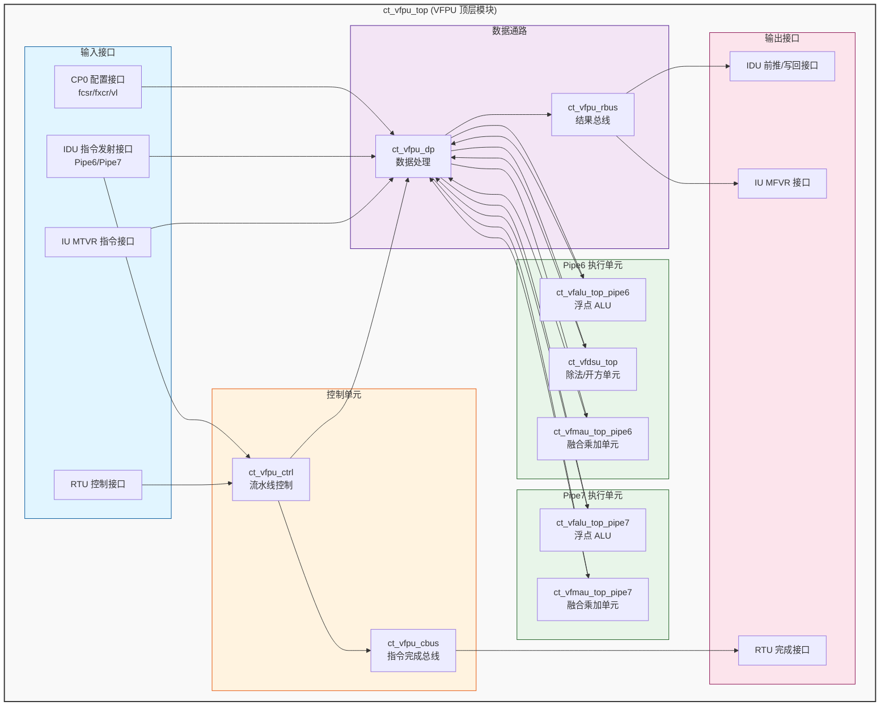
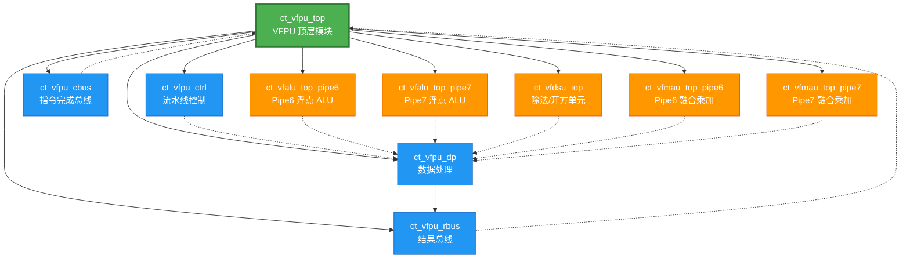

# ct_vfpu_top 模块详细方案文档

## 1. 模块概述

### 1.1 模块功能

`ct_vfpu_top` 是玄铁 C910 处理器的向量浮点单元（Vector Floating Point Unit, VFPU）顶层模块。该模块实现了完整的向量浮点运算功能，支持 RISC-V 向量扩展指令集。

**主要功能特性：**

1. **双流水线架构**：支持 Pipe6 和 Pipe7 两条独立的执行流水线，提高指令吞吐率
2. **多类型运算单元**：
   - VFALU（Vector Floating-point ALU）：向量浮点算术逻辑单元
   - VFMAU（Vector Fused Multiply-Add Unit）：向量融合乘加单元
   - VFDSU（Vector Floating-point Divide/Sqrt Unit）：向量浮点除法/开方单元
3. **数据前推机制**：支持多级流水线数据前推，减少数据冒险
4. **寄存器写回**：支持向量寄存器（VREG）和标量寄存器（EREG）写回
5. **指令完成控制**：与 RTU（Retire Unit）交互，管理指令提交

### 1.2 架构特点

- **流水线深度**：5 级流水线（EX1-EX5）
- **并行执行**：两条流水线可并行执行独立指令
- **数据旁路**：支持 EX3/EX4/EX5 级数据前推
- **MLA 指令优化**：支持融合乘加指令的累加器前推

---

## 2. 接口说明

### 2.1 输入端口

#### 2.1.1 时钟与复位

| 端口名称 | 位宽 | 说明 |
|---------|------|------|
| `forever_cpuclk` | 1 | CPU 主时钟 |
| `cpurst_b` | 1 | 全局复位信号（低有效） |
| `cp0_yy_clk_en` | 1 | 时钟使能信号 |
| `cp0_vfpu_icg_en` | 1 | VFPU 时钟门控使能 |
| `pad_yy_icg_scan_en` | 1 | 扫描测试使能 |

#### 2.1.2 CP0 配置接口

| 端口名称 | 位宽 | 说明 |
|---------|------|------|
| `cp0_vfpu_fcsr` | 64 | 浮点控制状态寄存器 |
| `cp0_vfpu_fxcr` | 32 | 浮点扩展控制寄存器 |
| `cp0_vfpu_vl` | 8 | 向量长度寄存器 |

#### 2.1.3 IDU 指令发射接口（Pipe6）

| 端口名称 | 位宽 | 说明 |
|---------|------|------|
| `idu_vfpu_rf_pipe6_sel` | 1 | Pipe6 指令选择 |
| `idu_vfpu_rf_pipe6_gateclk_sel` | 1 | Pipe6 门控时钟选择 |
| `idu_vfpu_rf_pipe6_iid` | 7 | Pipe6 指令 ID |
| `idu_vfpu_rf_pipe6_eu_sel` | 12 | Pipe6 执行单元选择 |
| `idu_vfpu_rf_pipe6_func` | 20 | Pipe6 功能码 |
| `idu_vfpu_rf_pipe6_inst_type` | 6 | Pipe6 指令类型 |
| `idu_vfpu_rf_pipe6_imm0` | 3 | Pipe6 立即数 |
| `idu_vfpu_rf_pipe6_dst_vld` | 1 | Pipe6 目标寄存器有效 |
| `idu_vfpu_rf_pipe6_dst_vreg` | 7 | Pipe6 目标向量寄存器 |
| `idu_vfpu_rf_pipe6_dst_ereg` | 5 | Pipe6 目标标量寄存器 |
| `idu_vfpu_rf_pipe6_dst_preg` | 7 | Pipe6 目标物理寄存器 |
| `idu_vfpu_rf_pipe6_dstv_vld` | 1 | Pipe6 目标向量寄存器有效 |
| `idu_vfpu_rf_pipe6_dste_vld` | 1 | Pipe6 目标标量寄存器有效 |
| `idu_vfpu_rf_pipe6_srcv0_fr` | 64 | Pipe6 源操作数 0（前推数据） |
| `idu_vfpu_rf_pipe6_srcv1_fr` | 64 | Pipe6 源操作数 1（前推数据） |
| `idu_vfpu_rf_pipe6_srcv2_fr` | 64 | Pipe6 源操作数 2（前推数据） |
| `idu_vfpu_rf_pipe6_vmla_type` | 3 | Pipe6 向量 MLA 类型 |
| `idu_vfpu_rf_pipe6_mla_srcv2_vld` | 1 | Pipe6 MLA 源操作数 2 有效 |
| `idu_vfpu_rf_pipe6_mla_srcv2_vreg` | 7 | Pipe6 MLA 源操作数 2 寄存器 |
| `idu_vfpu_rf_pipe6_ready_stage` | 3 | Pipe6 就绪阶段 |

#### 2.1.4 IDU 指令发射接口（Pipe7）

| 端口名称 | 位宽 | 说明 |
|---------|------|------|
| `idu_vfpu_rf_pipe7_sel` | 1 | Pipe7 指令选择 |
| `idu_vfpu_rf_pipe7_gateclk_sel` | 1 | Pipe7 门控时钟选择 |
| `idu_vfpu_rf_pipe7_iid` | 7 | Pipe7 指令 ID |
| `idu_vfpu_rf_pipe7_eu_sel` | 12 | Pipe7 执行单元选择 |
| `idu_vfpu_rf_pipe7_func` | 20 | Pipe7 功能码 |
| `idu_vfpu_rf_pipe7_inst_type` | 6 | Pipe7 指令类型 |
| `idu_vfpu_rf_pipe7_imm0` | 3 | Pipe7 立即数 |
| `idu_vfpu_rf_pipe7_dst_vld` | 1 | Pipe7 目标寄存器有效 |
| `idu_vfpu_rf_pipe7_dst_vreg` | 7 | Pipe7 目标向量寄存器 |
| `idu_vfpu_rf_pipe7_dst_ereg` | 5 | Pipe7 目标标量寄存器 |
| `idu_vfpu_rf_pipe7_dst_preg` | 7 | Pipe7 目标物理寄存器 |
| `idu_vfpu_rf_pipe7_dstv_vld` | 1 | Pipe7 目标向量寄存器有效 |
| `idu_vfpu_rf_pipe7_dste_vld` | 1 | Pipe7 目标标量寄存器有效 |
| `idu_vfpu_rf_pipe7_srcv0_fr` | 64 | Pipe7 源操作数 0（前推数据） |
| `idu_vfpu_rf_pipe7_srcv1_fr` | 64 | Pipe7 源操作数 1（前推数据） |
| `idu_vfpu_rf_pipe7_srcv2_fr` | 64 | Pipe7 源操作数 2（前推数据） |
| `idu_vfpu_rf_pipe7_vmla_type` | 3 | Pipe7 向量 MLA 类型 |
| `idu_vfpu_rf_pipe7_mla_srcv2_vld` | 1 | Pipe7 MLA 源操作数 2 有效 |
| `idu_vfpu_rf_pipe7_mla_srcv2_vreg` | 7 | Pipe7 MLA 源操作数 2 寄存器 |
| `idu_vfpu_rf_pipe7_ready_stage` | 3 | Pipe7 就绪阶段 |

#### 2.1.5 IU MTVR 指令接口

| 端口名称 | 位宽 | 说明 |
|---------|------|------|
| `iu_vfpu_ex1_pipe0_mtvr_inst` | 5 | Pipe0 MTVR 指令 |
| `iu_vfpu_ex1_pipe0_mtvr_vld` | 1 | Pipe0 MTVR 指令有效 |
| `iu_vfpu_ex1_pipe0_mtvr_vreg` | 7 | Pipe0 MTVR 目标寄存器 |
| `iu_vfpu_ex1_pipe0_mtvr_vl` | 8 | Pipe0 MTVR 向量长度 |
| `iu_vfpu_ex1_pipe0_mtvr_vlmul` | 2 | Pipe0 MTVR 向量乘数 |
| `iu_vfpu_ex1_pipe0_mtvr_vsew` | 3 | Pipe0 MTVR 元素宽度 |
| `iu_vfpu_ex2_pipe0_mtvr_src0` | 64 | Pipe0 MTVR 源数据 |
| `iu_vfpu_ex2_pipe0_mtvr_vld` | 1 | Pipe0 MTVR 源数据有效 |
| `iu_vfpu_ex1_pipe1_mtvr_inst` | 5 | Pipe1 MTVR 指令 |
| `iu_vfpu_ex1_pipe1_mtvr_vld` | 1 | Pipe1 MTVR 指令有效 |
| `iu_vfpu_ex1_pipe1_mtvr_vreg` | 7 | Pipe1 MTVR 目标寄存器 |
| `iu_vfpu_ex1_pipe1_mtvr_vl` | 8 | Pipe1 MTVR 向量长度 |
| `iu_vfpu_ex1_pipe1_mtvr_vlmul` | 2 | Pipe1 MTVR 向量乘数 |
| `iu_vfpu_ex1_pipe1_mtvr_vsew` | 3 | Pipe1 MTVR 元素宽度 |
| `iu_vfpu_ex2_pipe1_mtvr_src0` | 64 | Pipe1 MTVR 源数据 |
| `iu_vfpu_ex2_pipe1_mtvr_vld` | 1 | Pipe1 MTVR 源数据有效 |

#### 2.1.6 其他控制接口

| 端口名称 | 位宽 | 说明 |
|---------|------|------|
| `rtu_yy_xx_flush` | 1 | RTU 流水线刷新信号 |
| `idu_vfpu_is_vdiv_issue` | 1 | IDU 向量除法指令发射 |
| `idu_vfpu_is_vdiv_gateclk_issue` | 1 | IDU 向量除法门控时钟发射 |

### 2.2 输出端口

#### 2.2.1 IDU 数据前推接口（Pipe6）

| 端口名称 | 位宽 | 说明 |
|---------|------|------|
| `vfpu_idu_ex1_pipe6_data_vld_dup0~3` | 1 | EX1 级数据有效（多份拷贝） |
| `vfpu_idu_ex1_pipe6_fmla_data_vld_dup0~3` | 1 | EX1 级 FMLA 数据有效（多份拷贝） |
| `vfpu_idu_ex1_pipe6_mfvr_inst_vld_dup0~4` | 1 | EX1 级 MFVR 指令有效（多份拷贝） |
| `vfpu_idu_ex1_pipe6_vreg_dup0~3` | 7 | EX1 级向量寄存器号（多份拷贝） |
| `vfpu_idu_ex1_pipe6_preg_dup0~4` | 7 | EX1 级物理寄存器号（多份拷贝） |
| `vfpu_idu_ex2_pipe6_data_vld_dup0~3` | 1 | EX2 级数据有效（多份拷贝） |
| `vfpu_idu_ex2_pipe6_fmla_data_vld_dup0~3` | 1 | EX2 级 FMLA 数据有效（多份拷贝） |
| `vfpu_idu_ex2_pipe6_vreg_dup0~3` | 7 | EX2 级向量寄存器号（多份拷贝） |
| `vfpu_idu_ex3_pipe6_data_vld_dup0~3` | 1 | EX3 级数据有效（多份拷贝） |
| `vfpu_idu_ex3_pipe6_fwd_vreg` | 7 | EX3 级前推向量寄存器号 |
| `vfpu_idu_ex3_pipe6_fwd_vreg_vld` | 1 | EX3 级前推数据有效 |
| `vfpu_idu_ex3_pipe6_fwd_vreg_fr_data` | 64 | EX3 级前推 FR 数据 |
| `vfpu_idu_ex3_pipe6_fwd_vreg_vr0_data` | 64 | EX3 级前推 VR0 数据 |
| `vfpu_idu_ex3_pipe6_fwd_vreg_vr1_data` | 64 | EX3 级前推 VR1 数据 |
| `vfpu_idu_ex3_pipe6_vreg_dup0~3` | 7 | EX3 级向量寄存器号（多份拷贝） |
| `vfpu_idu_ex4_pipe6_fwd_vreg` | 7 | EX4 级前推向量寄存器号 |
| `vfpu_idu_ex4_pipe6_fwd_vreg_vld` | 1 | EX4 级前推数据有效 |
| `vfpu_idu_ex4_pipe6_fwd_vreg_fr_data` | 64 | EX4 级前推 FR 数据 |
| `vfpu_idu_ex4_pipe6_fwd_vreg_vr0_data` | 64 | EX4 级前推 VR0 数据 |
| `vfpu_idu_ex4_pipe6_fwd_vreg_vr1_data` | 64 | EX4 级前推 VR1 数据 |
| `vfpu_idu_ex5_pipe6_fwd_vreg` | 7 | EX5 级前推向量寄存器号 |
| `vfpu_idu_ex5_pipe6_fwd_vreg_vld` | 1 | EX5 级前推数据有效 |

#### 2.2.2 IDU 数据前推接口（Pipe7）

| 端口名称 | 位宽 | 说明 |
|---------|------|------|
| `vfpu_idu_ex1_pipe7_data_vld_dup0~3` | 1 | EX1 级数据有效（多份拷贝） |
| `vfpu_idu_ex1_pipe7_fmla_data_vld_dup0~3` | 1 | EX1 级 FMLA 数据有效（多份拷贝） |
| `vfpu_idu_ex1_pipe7_mfvr_inst_vld_dup0~4` | 1 | EX1 级 MFVR 指令有效（多份拷贝） |
| `vfpu_idu_ex1_pipe7_vreg_dup0~3` | 7 | EX1 级向量寄存器号（多份拷贝） |
| `vfpu_idu_ex1_pipe7_preg_dup0~4` | 7 | EX1 级物理寄存器号（多份拷贝） |
| `vfpu_idu_ex2_pipe7_data_vld_dup0~3` | 1 | EX2 级数据有效（多份拷贝） |
| `vfpu_idu_ex2_pipe7_fmla_data_vld_dup0~3` | 1 | EX2 级 FMLA 数据有效（多份拷贝） |
| `vfpu_idu_ex2_pipe7_vreg_dup0~3` | 7 | EX2 级向量寄存器号（多份拷贝） |
| `vfpu_idu_ex3_pipe7_data_vld_dup0~3` | 1 | EX3 级数据有效（多份拷贝） |
| `vfpu_idu_ex3_pipe7_fwd_vreg` | 7 | EX3 级前推向量寄存器号 |
| `vfpu_idu_ex3_pipe7_fwd_vreg_vld` | 1 | EX3 级前推数据有效 |
| `vfpu_idu_ex3_pipe7_fwd_vreg_fr_data` | 64 | EX3 级前推 FR 数据 |
| `vfpu_idu_ex3_pipe7_fwd_vreg_vr0_data` | 64 | EX3 级前推 VR0 数据 |
| `vfpu_idu_ex3_pipe7_fwd_vreg_vr1_data` | 64 | EX3 级前推 VR1 数据 |
| `vfpu_idu_ex3_pipe7_vreg_dup0~3` | 7 | EX3 级向量寄存器号（多份拷贝） |
| `vfpu_idu_ex4_pipe7_fwd_vreg` | 7 | EX4 级前推向量寄存器号 |
| `vfpu_idu_ex4_pipe7_fwd_vreg_vld` | 1 | EX4 级前推数据有效 |
| `vfpu_idu_ex4_pipe7_fwd_vreg_fr_data` | 64 | EX4 级前推 FR 数据 |
| `vfpu_idu_ex4_pipe7_fwd_vreg_vr0_data` | 64 | EX4 级前推 VR0 数据 |
| `vfpu_idu_ex4_pipe7_fwd_vreg_vr1_data` | 64 | EX4 级前推 VR1 数据 |
| `vfpu_idu_ex5_pipe7_fwd_vreg` | 7 | EX5 级前推向量寄存器号 |
| `vfpu_idu_ex5_pipe7_fwd_vreg_vld` | 1 | EX5 级前推数据有效 |

#### 2.2.3 IDU 写回接口（Pipe6）

| 端口名称 | 位宽 | 说明 |
|---------|------|------|
| `vfpu_idu_ex5_pipe6_wb_ereg` | 5 | EX5 级写回标量寄存器号 |
| `vfpu_idu_ex5_pipe6_wb_ereg_data` | 6 | EX5 级写回标量数据 |
| `vfpu_idu_ex5_pipe6_wb_ereg_vld` | 1 | EX5 级写回标量有效 |
| `vfpu_idu_ex5_pipe6_wb_vreg_dup0~3` | 7 | EX5 级写回向量寄存器号（多份拷贝） |
| `vfpu_idu_ex5_pipe6_wb_vreg_vld_dup0~3` | 1 | EX5 级写回向量有效（多份拷贝） |
| `vfpu_idu_ex5_pipe6_wb_vreg_fr_data` | 64 | EX5 级写回 FR 数据 |
| `vfpu_idu_ex5_pipe6_wb_vreg_fr_expand` | 64 | EX5 级写回 FR 扩展数据 |
| `vfpu_idu_ex5_pipe6_wb_vreg_fr_vld` | 1 | EX5 级写回 FR 有效 |
| `vfpu_idu_ex5_pipe6_wb_vreg_vr0_data` | 64 | EX5 级写回 VR0 数据 |
| `vfpu_idu_ex5_pipe6_wb_vreg_vr0_expand` | 64 | EX5 级写回 VR0 扩展数据 |
| `vfpu_idu_ex5_pipe6_wb_vreg_vr0_vld` | 1 | EX5 级写回 VR0 有效 |
| `vfpu_idu_ex5_pipe6_wb_vreg_vr1_data` | 64 | EX5 级写回 VR1 数据 |
| `vfpu_idu_ex5_pipe6_wb_vreg_vr1_expand` | 64 | EX5 级写回 VR1 扩展数据 |
| `vfpu_idu_ex5_pipe6_wb_vreg_vr1_vld` | 1 | EX5 级写回 VR1 有效 |

#### 2.2.4 IDU 写回接口（Pipe7）

| 端口名称 | 位宽 | 说明 |
|---------|------|------|
| `vfpu_idu_ex5_pipe7_wb_ereg` | 5 | EX5 级写回标量寄存器号 |
| `vfpu_idu_ex5_pipe7_wb_ereg_data` | 6 | EX5 级写回标量数据 |
| `vfpu_idu_ex5_pipe7_wb_ereg_vld` | 1 | EX5 级写回标量有效 |
| `vfpu_idu_ex5_pipe7_wb_vreg_dup0~3` | 7 | EX5 级写回向量寄存器号（多份拷贝） |
| `vfpu_idu_ex5_pipe7_wb_vreg_vld_dup0~3` | 1 | EX5 级写回向量有效（多份拷贝） |
| `vfpu_idu_ex5_pipe7_wb_vreg_fr_data` | 64 | EX5 级写回 FR 数据 |
| `vfpu_idu_ex5_pipe7_wb_vreg_fr_expand` | 64 | EX5 级写回 FR 扩展数据 |
| `vfpu_idu_ex5_pipe7_wb_vreg_fr_vld` | 1 | EX5 级写回 FR 有效 |
| `vfpu_idu_ex5_pipe7_wb_vreg_vr0_data` | 64 | EX5 级写回 VR0 数据 |
| `vfpu_idu_ex5_pipe7_wb_vreg_vr0_expand` | 64 | EX5 级写回 VR0 扩展数据 |
| `vfpu_idu_ex5_pipe7_wb_vreg_vr0_vld` | 1 | EX5 级写回 VR0 有效 |
| `vfpu_idu_ex5_pipe7_wb_vreg_vr1_data` | 64 | EX5 级写回 VR1 数据 |
| `vfpu_idu_ex5_pipe7_wb_vreg_vr1_expand` | 64 | EX5 级写回 VR1 扩展数据 |
| `vfpu_idu_ex5_pipe7_wb_vreg_vr1_vld` | 1 | EX5 级写回 VR1 有效 |

#### 2.2.5 IU MFVR 接口

| 端口名称 | 位宽 | 说明 |
|---------|------|------|
| `vfpu_iu_ex2_pipe6_mfvr_data` | 64 | Pipe6 MFVR 数据 |
| `vfpu_iu_ex2_pipe6_mfvr_data_vld` | 1 | Pipe6 MFVR 数据有效 |
| `vfpu_iu_ex2_pipe6_mfvr_preg` | 7 | Pipe6 MFVR 物理寄存器 |
| `vfpu_iu_ex2_pipe7_mfvr_data` | 64 | Pipe7 MFVR 数据 |
| `vfpu_iu_ex2_pipe7_mfvr_data_vld` | 1 | Pipe7 MFVR 数据有效 |
| `vfpu_iu_ex2_pipe7_mfvr_preg` | 7 | Pipe7 MFVR 物理寄存器 |

#### 2.2.6 RTU 接口

| 端口名称 | 位宽 | 说明 |
|---------|------|------|
| `vfpu_rtu_pipe6_cmplt` | 1 | Pipe6 指令完成 |
| `vfpu_rtu_pipe6_iid` | 7 | Pipe6 指令 ID |
| `vfpu_rtu_pipe7_cmplt` | 1 | Pipe7 指令完成 |
| `vfpu_rtu_pipe7_iid` | 7 | Pipe7 指令 ID |
| `vfpu_rtu_ex5_pipe6_ereg_wb_vld` | 1 | Pipe6 标量寄存器写回有效 |
| `vfpu_rtu_ex5_pipe6_wb_ereg` | 5 | Pipe6 写回标量寄存器号 |
| `vfpu_rtu_ex5_pipe6_wb_vreg_expand` | 64 | Pipe6 写回向量扩展数据 |
| `vfpu_rtu_ex5_pipe6_wb_vreg_fr_vld` | 1 | Pipe6 写回 FR 有效 |
| `vfpu_rtu_ex5_pipe6_wb_vreg_vr_vld` | 1 | Pipe6 写回 VR 有效 |
| `vfpu_rtu_ex5_pipe7_ereg_wb_vld` | 1 | Pipe7 标量寄存器写回有效 |
| `vfpu_rtu_ex5_pipe7_wb_ereg` | 5 | Pipe7 写回标量寄存器号 |
| `vfpu_rtu_ex5_pipe7_wb_vreg_expand` | 64 | Pipe7 写回向量扩展数据 |
| `vfpu_rtu_ex5_pipe7_wb_vreg_fr_vld` | 1 | Pipe7 写回 FR 有效 |
| `vfpu_rtu_ex5_pipe7_wb_vreg_vr_vld` | 1 | Pipe7 写回 VR 有效 |

#### 2.2.7 其他输出接口

| 端口名称 | 位宽 | 说明 |
|---------|------|------|
| `vfpu_idu_pipe6_vmla_srcv2_no_fwd` | 1 | Pipe6 MLA 源操作数 2 无前推 |
| `vfpu_idu_pipe7_vmla_srcv2_no_fwd` | 1 | Pipe7 MLA 源操作数 2 无前推 |
| `vfpu_idu_vdiv_busy` | 1 | 向量除法忙 |
| `vfpu_idu_vdiv_wb_stall` | 1 | 向量除法写回暂停 |
| `vfdsu_ifu_debug_ex2_wait` | 1 | VFDSU EX2 等待（调试） |
| `vfdsu_ifu_debug_idle` | 1 | VFDSU 空闲（调试） |
| `vfdsu_ifu_debug_pipe_busy` | 1 | VFDSU 流水线忙（调试） |

---

## 3. 模块框图

---

## 4. 子模块说明

### 4.1 ct_vfpu_ctrl（流水线控制模块）

**功能描述：**
- 管理两条流水线的指令有效性控制
- 生成各级流水线的门控时钟使能信号
- 处理流水线刷新和暂停控制
- 管理 MFVR 指令的特殊控制逻辑

**主要接口：**
- 输入：IDU 指令选择信号、IU MTVR 指令、RTU 刷新信号
- 输出：各级流水线指令有效信号、门控时钟使能

**关键特性：**
- 支持 EX1-EX5 五级流水线控制
- 实现指令取消和刷新逻辑
- 生成多份拷贝的控制信号用于时序优化

### 4.2 ct_vfpu_dp（数据处理模块）

**功能描述：**
- 接收并处理来自 IDU 的指令信息
- 分发指令到相应的执行单元（VFALU/VFDSU/VFMAU）
- 管理源操作数的读取和前推
- 处理 MTVR/MFVR 指令的数据传输

**主要接口：**
- 输入：IDU 指令信息、IU MTVR 数据、执行单元结果
- 输出：执行单元控制信号、目的寄存器信息

**关键特性：**
- 支持向量寄存器和标量寄存器操作
- 实现数据前推逻辑
- 管理 MLA 指令的累加器操作数

### 4.3 ct_vfpu_cbus（指令完成总线模块）

**功能描述：**
- 管理指令完成信号的生成
- 维护指令 ID（IID）信息
- 与 RTU 交互完成指令提交

**主要接口：**
- 输入：IDU 指令选择和 IID、RTU 刷新信号
- 输出：RTU 指令完成信号和 IID

**关键特性：**
- 支持两条流水线的独立完成控制
- 实现指令 ID 的锁存和传递
- 支持乱序完成的指令管理

### 4.4 ct_vfpu_rbus（结果总线模块）

**功能描述：**
- 收集各执行单元的运算结果
- 生成数据前推信号
- 管理写回数据的格式化和分发
- 实现 FMLA 指令的特殊前推逻辑

**主要接口：**
- 输入：执行单元结果、控制信号
- 输出：IDU 前推数据、IU MFVR 数据、RTU 写回信息

**关键特性：**
- 支持多级流水线数据前推（EX3/EX4/EX5）
- 实现向量数据的扩展和格式化
- 生成多份拷贝的前推信号用于时序优化
- 支持 FR/VR0/VR1 三种数据格式

### 4.5 ct_vfalu_top_pipe6/pipe7（向量浮点 ALU）

**功能描述：**
- 执行向量浮点算术运算（加减、比较、转换等）
- 执行 MTVR/MFVR 指令的数据传输
- 处理浮点异常

**主要运算：**
- 浮点加减法
- 浮点比较
- 浮点格式转换
- 浮点与整数转换

### 4.6 ct_vfdsu_top（向量浮点除法/开方单元）

**功能描述：**
- 执行向量浮点除法和开方运算
- 实现迭代算法，需要多个周期完成
- 管理除法指令的流水线占用

**主要特性：**
- 支持单精度和双精度浮点除法
- 支持浮点开方运算
- 实现非阻塞式流水线设计

### 4.7 ct_vfmau_top_pipe6/pipe7（向量融合乘加单元）

**功能描述：**
- 执行向量融合乘加（FMLA）运算
- 支持累加器操作数的前推优化
- 实现 MLA 指令的特殊处理

**主要运算：**
- 融合乘加：a × b + c
- 融合乘减：a × b - c
- 融合负乘加：-a × b + c
- 融合负乘减：-a × b - c

**关键特性：**
- 支持跨流水线的累加器前推
- 实现 FMLA 切片数据处理
- 优化 MLA 指令的数据依赖

---

## 5. 模块层次结构

---

## 6. 内部信号列表

### 6.1 控制信号

| 信号名称 | 位宽 | 方向 | 说明 |
|---------|------|------|------|
| `ctrl_ex1_pipe6_inst_vld` | 1 | CTRL -> DP | Pipe6 EX1 级指令有效 |
| `ctrl_ex1_pipe6_data_vld` | 1 | CTRL -> DP | Pipe6 EX1 级数据有效 |
| `ctrl_ex1_pipe6_eu_sel` | 12 | CTRL -> DP | Pipe6 EX1 级执行单元选择 |
| `ctrl_ex1_pipe6_mfvr_inst_vld` | 1 | CTRL -> DP | Pipe6 EX1 级 MFVR 指令有效 |
| `ctrl_ex2_pipe6_inst_vld` | 1 | CTRL -> DP | Pipe6 EX2 级指令有效 |
| `ctrl_ex2_pipe6_data_vld` | 1 | CTRL -> DP | Pipe6 EX2 级数据有效 |
| `ctrl_ex3_pipe6_inst_vld` | 1 | CTRL -> DP | Pipe6 EX3 级指令有效 |
| `ctrl_ex3_pipe6_data_vld` | 1 | CTRL -> DP | Pipe6 EX3 级数据有效 |
| `ctrl_ex3_pipe6_fwd_vld` | 1 | CTRL -> DP | Pipe6 EX3 级前推有效 |
| `ctrl_ex4_pipe6_inst_vld` | 1 | CTRL -> DP | Pipe6 EX4 级指令有效 |
| `ctrl_ex4_pipe6_fwd_vld` | 1 | CTRL -> DP | Pipe6 EX4 级前推有效 |
| `ctrl_ex5_pipe6_clk` | 1 | CTRL -> DP | Pipe6 EX5 级时钟使能 |
| `ctrl_dp_ex2_pipe7_inst_vld` | 1 | CTRL -> DP | Pipe7 EX2 级指令有效 |

### 6.2 数据通路信号

| 信号名称 | 位宽 | 方向 | 说明 |
|---------|------|------|------|
| `dp_ex3_pipe6_dst_vreg` | 7 | DP -> RBUS | Pipe6 EX3 级目的向量寄存器 |
| `dp_ex3_pipe6_freg_data` | 64 | DP -> RBUS | Pipe6 EX3 级浮点寄存器数据 |
| `dp_ex4_pipe6_dst_ereg` | 5 | DP -> RBUS | Pipe6 EX4 级目的标量寄存器 |
| `dp_ex4_pipe6_dst_vreg` | 7 | DP -> RBUS | Pipe6 EX4 级目的向量寄存器 |
| `dp_ex4_pipe6_normal_dste_wb_vld` | 1 | DP -> RBUS | Pipe6 EX4 级标量写回有效 |
| `dp_ex4_pipe6_normal_dstv_wb_vld` | 1 | DP -> RBUS | Pipe6 EX4 级向量写回有效 |
| `dp_ex5_pipe6_ereg_data_pre` | 5 | DP -> RBUS | Pipe6 EX5 级标量数据（预处理） |
| `dp_ex5_pipe6_freg_data_pre` | 64 | DP -> RBUS | Pipe6 EX5 级浮点数据（预处理） |

### 6.3 执行单元接口信号

#### 6.3.1 VFALU 接口

| 信号名称 | 位宽 | 方向 | 说明 |
|---------|------|------|------|
| `dp_vfalu_ex1_pipe6_func` | 20 | DP -> VFALU | Pipe6 VFALU 功能码 |
| `dp_vfalu_ex1_pipe6_imm0` | 3 | DP -> VFALU | Pipe6 VFALU 立即数 |
| `dp_vfalu_ex1_pipe6_sel` | 1 | DP -> VFALU | Pipe6 VFALU 选择 |
| `dp_vfalu_ex1_pipe6_srcf0` | 64 | DP -> VFALU | Pipe6 VFALU 源操作数 0 |
| `dp_vfalu_ex1_pipe6_srcf1` | 64 | DP -> VFALU | Pipe6 VFALU 源操作数 1 |
| `dp_vfalu_ex1_pipe6_mtvr_src0` | 64 | DP -> VFALU | Pipe6 VFALU MTVR 源数据 |
| `pipe6_dp_ex1_vfalu_mfvr_data` | 64 | VFALU -> DP | Pipe6 VFALU MFVR 数据 |
| `pipe6_dp_ex3_vfalu_ereg_data` | 5 | VFALU -> DP | Pipe6 VFALU 标量结果 |
| `pipe6_dp_ex3_vfalu_freg_data` | 64 | VFALU -> DP | Pipe6 VFALU 浮点结果 |

#### 6.3.2 VFDSU 接口

| 信号名称 | 位宽 | 方向 | 说明 |
|---------|------|------|------|
| `dp_vfdsu_ex1_pipe6_sel` | 1 | DP -> VFDSU | Pipe6 VFDSU 选择 |
| `dp_vfdsu_ex1_pipe6_iid` | 7 | DP -> VFDSU | Pipe6 VFDSU 指令 ID |
| `dp_vfdsu_ex1_pipe6_imm0` | 3 | DP -> VFDSU | Pipe6 VFDSU 立即数 |
| `dp_vfdsu_ex1_pipe6_srcf0` | 64 | DP -> VFDSU | Pipe6 VFDSU 源操作数 0 |
| `dp_vfdsu_ex1_pipe6_srcf1` | 64 | DP -> VFDSU | Pipe6 VFDSU 源操作数 1 |
| `dp_vfdsu_ex1_pipe6_dst_vreg` | 7 | DP -> VFDSU | Pipe6 VFDSU 目的向量寄存器 |
| `dp_vfdsu_ex1_pipe6_dst_ereg` | 5 | DP -> VFDSU | Pipe6 VFDSU 目的标量寄存器 |
| `dp_vfdsu_fdiv_gateclk_issue` | 1 | DP -> VFDSU | 除法门控时钟发射 |
| `dp_vfdsu_idu_fdiv_issue` | 1 | DP -> VFDSU | 除法指令发射 |
| `pipe6_dp_vfdsu_inst_vld` | 1 | VFDSU -> DP | Pipe6 VFDSU 指令有效 |
| `pipe6_dp_vfdsu_vreg` | 7 | VFDSU -> DP | Pipe6 VFDSU 向量寄存器 |
| `pipe6_dp_vfdsu_ereg` | 5 | VFDSU -> DP | Pipe6 VFDSU 标量寄存器 |
| `pipe6_dp_vfdsu_freg_data` | 64 | VFDSU -> DP | Pipe6 VFDSU 浮点数据 |
| `pipe6_dp_vfdsu_ereg_data` | 5 | VFDSU -> DP | Pipe6 VFDSU 标量数据 |
| `vfdsu_dp_fdiv_busy` | 1 | VFDSU -> DP | VFDSU 除法忙 |
| `vfdsu_dp_inst_wb_req` | 1 | VFDSU -> DP | VFDSU 写回请求 |

#### 6.3.3 VFMAU 接口

| 信号名称 | 位宽 | 方向 | 说明 |
|---------|------|------|------|
| `dp_vfmau_ex1_pipe6_sel` | 1 | DP -> VFMAU | Pipe6 VFMAU 选择 |
| `dp_vfmau_ex1_pipe6_imm0` | 3 | DP -> VFMAU | Pipe6 VFMAU 立即数 |
| `dp_vfmau_ex1_pipe6_dst_vreg` | 7 | DP -> VFMAU | Pipe6 VFMAU 目的向量寄存器 |
| `dp_vfmau_pipe6_inst_type` | 6 | DP -> VFMAU | Pipe6 VFMAU 指令类型 |
| `dp_vfmau_pipe6_sel` | 1 | DP -> VFMAU | Pipe6 VFMAU 选择 |
| `dp_vfmau_pipe6_vfmau_sel` | 1 | DP -> VFMAU | Pipe6 VFMAU 单元选择 |
| `dp_vfmau_pipe6_mla_type` | 3 | DP -> VFMAU | Pipe6 VFMAU MLA 类型 |
| `dp_vfmau_pipe6_mla_srcv2_vld` | 1 | DP -> VFMAU | Pipe6 VFMAU MLA 源 2 有效 |
| `dp_vfmau_pipe6_mla_srcv2_vreg` | 7 | DP -> VFMAU | Pipe6 VFMAU MLA 源 2 寄存器 |
| `pipe6_dp_ex1_mult_id` | 1 | VFMAU -> DP | Pipe6 VFMAU 乘法器 ID |
| `pipe6_dp_ex3_vfmau_ereg_data` | 5 | VFMAU -> DP | Pipe6 VFMAU 标量结果 |
| `pipe6_dp_ex3_vfmau_freg_data` | 64 | VFMAU -> DP | Pipe6 VFMAU 浮点结果 |
| `pipe6_dp_ex4_vfmau_ereg_data` | 5 | VFMAU -> DP | Pipe6 VFMAU 标量结果（EX4） |
| `pipe6_dp_ex4_vfmau_freg_data` | 64 | VFMAU -> DP | Pipe6 VFMAU 浮点结果（EX4） |

### 6.4 FMLA 前推信号

| 信号名称 | 位宽 | 方向 | 说明 |
|---------|------|------|------|
| `pipe6_rbus_ex1_fmla_data_vld` | 1 | VFMAU -> RBUS | Pipe6 EX1 级 FMLA 数据有效 |
| `pipe6_rbus_ex2_fmla_data_vld` | 1 | VFMAU -> RBUS | Pipe6 EX2 级 FMLA 数据有效 |
| `pipe6_pipe6_ex4_fmla_fwd_vld` | 1 | VFMAU -> VFMAU | Pipe6 EX4 级自前推有效 |
| `pipe6_pipe7_ex4_fmla_fwd_vld` | 1 | VFMAU -> VFMAU | Pipe6 到 Pipe7 EX4 级前推有效 |
| `pipe6_pipe6_ex5_ex1_fmla_fwd_vld` | 1 | VFMAU -> VFMAU | Pipe6 EX5 到 EX1 前推有效 |
| `pipe6_pipe6_ex5_ex2_fmla_fwd_vld` | 1 | VFMAU -> VFMAU | Pipe6 EX5 到 EX2 前推有效 |
| `pipe6_vfmau_ex4_fmla_slice0_half0_data` | 16 | VFMAU -> VFMAU | Pipe6 EX4 级 FMLA 切片数据 |
| `pipe6_vfmau_ex5_fmla_slice0_data` | 68 | VFMAU -> VFMAU | Pipe6 EX5 级 FMLA 切片数据 |
| `pipe6_rbus_pipe6_fmla_no_fwd` | 1 | VFMAU -> RBUS | Pipe6 无 FMLA 前推 |
| `pipe6_rbus_pipe7_fmla_no_fwd` | 1 | VFMAU -> RBUS | Pipe6 到 Pipe7 无 FMLA 前推 |

### 6.5 结果总线信号

| 信号名称 | 位宽 | 方向 | 说明 |
|---------|------|------|------|
| `pipe6_rbus_vfmau_ereg_wb_data` | 5 | VFMAU -> RBUS | Pipe6 VFMAU 标量写回数据 |
| `pipe6_rbus_vfmau_freg_wb_data` | 64 | VFMAU -> RBUS | Pipe6 VFMAU 浮点写回数据 |
| `pipe6_rbus_vfmau_ereg_wb_vld` | 1 | VFMAU -> RBUS | Pipe6 VFMAU 标量写回有效 |
| `pipe6_rbus_vfmau_vreg_wb_vld` | 1 | VFMAU -> RBUS | Pipe6 VFMAU 向量写回有效 |

### 6.6 配置与状态信号

| 信号名称 | 位宽 | 方向 | 说明 |
|---------|------|------|------|
| `vfpu_yy_xx_dqnan` | 1 | 内部 | 默认 NaN 模式 |
| `vfpu_yy_xx_rm` | 3 | 内部 | 舍入模式 |

---

## 7. 设计要点

### 7.1 流水线设计

VFPU 采用 5 级流水线设计：

1. **EX1 级**：指令译码、操作数读取、前推选择
2. **EX2 级**：运算执行（VFALU）、迭代启动（VFDSU）
3. **EX3 级**：运算完成（VFALU）、结果前推
4. **EX4 级**：结果格式化、写回准备
5. **EX5 级**：结果写回、指令完成

### 7.2 数据前推机制

VFPU 实现了多级数据前推以减少数据冒险：

- **EX3 级前推**：VFALU 运算结果可前推到 EX1 级
- **EX4 级前推**：VFMAU 运算结果可前推到 EX1/EX2 级
- **EX5 级前推**：写回数据可前推到 EX1 级
- **FMLA 前推**：支持跨流水线的累加器前推

### 7.3 MLA 指令优化

融合乘加指令采用特殊的优化策略：

- 累加器操作数（srcv2）支持专用前推路径
- 实现 FMLA 切片数据处理，提高吞吐率
- 支持跨流水线的累加器数据共享

### 7.4 多拷贝信号

为满足时序要求，关键控制信号生成多份拷贝：

- 数据有效信号：4 份拷贝（dup0~3）
- MFVR 指令有效信号：5 份拷贝（dup0~4）
- 寄存器号信号：4 份拷贝（dup0~3）

---

## 8. 时序考虑

### 8.1 关键路径

1. **前推路径**：EX3/EX4/EX5 级结果到 EX1 级操作数选择
2. **MLA 累加器路径**：跨流水线的累加器前推
3. **写回路径**：EX5 级到寄存器堆写端口

### 8.2 时钟门控

VFPU 实现了细粒度的时钟门控：

- 每条流水线独立的门控时钟控制
- 每级流水线独立的门控时钟使能
- 执行单元级别的门控时钟

---

## 9. 验证要点

### 9.1 功能验证

1. 各类浮点运算的正确性
2. 数据前推逻辑的正确性
3. MLA 指令的累加器处理
4. MTVR/MFVR 指令的数据传输
5. 异常处理和浮点异常标志

### 9.2 边界情况

1. 流水线刷新时的状态处理
2. 跨流水线数据依赖
3. 除法指令的流水线占用
4. 多周期指令的暂停处理

### 9.3 性能验证

1. 指令吞吐率测试
2. 数据前推效率测试
3. 流水线停顿周期统计

---

## 10. 文件依赖

| 文件名 | 说明 |
|--------|------|
| `ct_vfpu_top.v` | VFPU 顶层模块 |
| `ct_vfpu_ctrl.v` | 流水线控制模块 |
| `ct_vfpu_dp.v` | 数据处理模块 |
| `ct_vfpu_cbus.v` | 指令完成总线模块 |
| `ct_vfpu_rbus.v` | 结果总线模块 |
| `ct_vfalu_top_pipe6.v` | Pipe6 浮点 ALU 模块 |
| `ct_vfalu_top_pipe7.v` | Pipe7 浮点 ALU 模块 |
| `ct_vfdsu_top.v` | 除法/开方单元模块 |
| `ct_vfmau_top.v` | 融合乘加单元模块 |
| `cpu_cfig.h` | CPU 配置头文件 |

---

## 11. 参考资料

1. RISC-V 指令集手册
2. RISC-V 向量扩展规范
3. IEEE 754 浮点运算标准
4. 玄铁 C910 用户手册

---

**文档版本：** 1.0
**创建日期：** 2026-04-01
**作者：** IC 设计专家
**模块路径：** `d:\code\openc910\C910_RTL_FACTORY\gen_rtl\vfpu\rtl\ct_vfpu_top.v`
