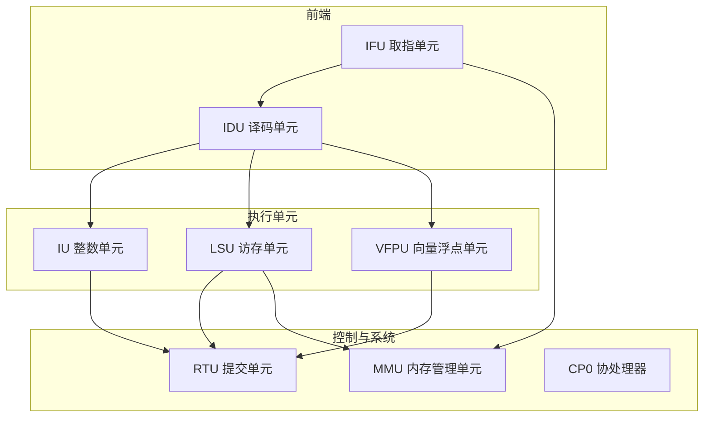

# OpenC910 模块文档索引

本文档提供 OpenC910 处理器各主要模块的文档索引和概览。

## 模块架构图

## 模块列表

| 模块 | 全称 | 功能描述 | 文档链接 |
|------|------|----------|----------|
| IFU | Instruction Fetch Unit | 取指单元，负责指令获取和分支预测 | [ifu_top.md](ifu_top.md) |
| IDU | Instruction Decode Unit | 译码单元，负责指令译码和分发 | [idu_top.md](idu_top.md) |
| IU | Integer Unit | 整数单元，执行整数运算和分支 | [iu_top.md](iu_top.md) |
| LSU | Load Store Unit | 访存单元，处理内存访问操作 | [lsu_top.md](lsu_top.md) |
| MMU | Memory Management Unit | 内存管理单元，地址翻译和保护 | [mmu_top.md](mmu_top.md) |
| RTU | Retire Unit | 提交单元，指令顺序提交和异常处理 | [rtu_top.md](rtu_top.md) |

## 模块详细说明

### IFU (取指单元)

IFU 是处理器的取指单元，负责从指令存储器获取指令并传递给 IDU 译码。

**主要特性：**
- 16KB 4路组相联指令缓存
- BTB/BHT/RAS 分支预测机制
- 支持 RVC 压缩指令预译码
- 支持 RVV 向量长度预测

**详细文档：** [ifu_top.md](ifu_top.md)

---

### IDU (译码单元)

IDU 是处理器的译码单元，负责将 IFU 获取的指令译码并分发到各执行单元。

**主要特性：**
- 多发射译码支持
- 寄存器重命名
- 指令队列管理
- 操作数准备和转发

**详细文档：** [idu_top.md](idu_top.md)

---

### IU (整数单元)

IU 是处理器的整数执行单元，执行所有整数运算、分支处理和特殊指令。

**主要特性：**
- 2 个 ALU (Pipe0, Pipe1)
- 1 个分支单元 (Pipe2)
- 65×65 位乘法器，3 级流水线
- SRT 基数16 除法器
- 支持 RV64IMAC + RVV 扩展

**详细文档：** [iu_top.md](iu_top.md)

---

### LSU (访存单元)

LSU 是处理器的访存单元，处理所有内存加载和存储操作。

**主要特性：**
- 数据缓存管理
- 加载/存储队列
- 地址计算和对齐处理
- 内存一致性维护

**详细文档：** [lsu_top.md](lsu_top.md)

---

### MMU (内存管理单元)

MMU 是处理器的内存管理单元，负责虚拟地址到物理地址的翻译。

**主要特性：**
- Sv39 虚拟地址模式
- ITLB/DTLB/JTLB 三级 TLB
- 硬件页表遍历
- 内存保护和权限检查

**详细文档：** [mmu_top.md](mmu_top.md)

---

### RTU (提交单元)

RTU 是处理器的提交单元，负责指令的顺序提交和异常处理。

**主要特性：**
- 顺序提交保证
- 异常和中断处理
- 架构状态更新
- 精确异常支持

**详细文档：** [rtu_top.md](rtu_top.md)

---

## 相关文档

- [设计文档](../design_docs/) - 详细设计说明
- [OpenC910 数据手册](../openc910_datasheet.pdf)
- [玄铁C910用户手册](../玄铁C910用户手册_20240627.pdf)
- [RISC-V 向量规范 v1.0](../riscv-v-spec-1.0.pdf)
