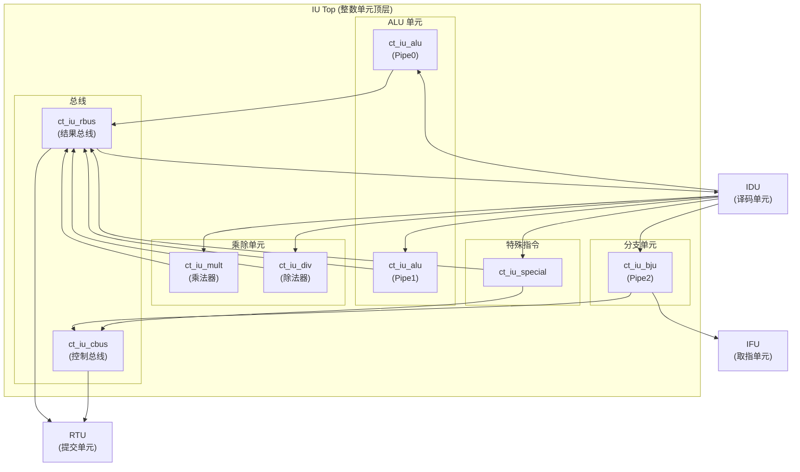
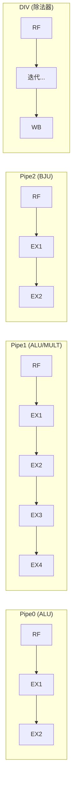

# IU (Integer Unit) 整数单元

## 1. 模块功能说明

IU (Integer Unit) 是 OpenC910 处理器的整数执行单元，负责执行所有整数运算、分支处理和特殊指令。IU 采用多发射架构，支持乱序执行，是处理器性能的关键组件。

### 主要功能

- **整数运算**: 执行加、减、逻辑运算、移位等整数操作
- **分支处理**: 执行分支指令，计算分支目标，处理分支误预测
- **乘法运算**: 执行整数乘法，支持 65×65 位乘法
- **除法运算**: 执行整数除法和取余，采用基数16 SRT 算法
- **特殊指令**: 执行 CSR 访问、系统调用、vsetvli 等特殊指令
- **向量寄存器传输**: 支持 MTVR/MFVR 指令进行标量-向量寄存器数据传输

### 主要特性

| 特性 | 描述 |
|------|------|
| ALU 数量 | 2 个 (Pipe0, Pipe1) |
| ALU 延迟 | 1 周期 (大部分运算) |
| 乘法器延迟 | 3-4 周期 |
| 除法器延迟 | 可变 (SRT 算法) |
| 分支单元 | 1 个 (Pipe2) |
| PC FIFO 深度 | 16 条目 |
| 支持指令集 | RV64IMAC + RVV 扩展 |

## 2. 模块接口说明

### 2.1 接口列表

#### 与 IDU (译码单元) 的接口 - Pipe0 (ALU)

| 信号名 | 方向 | 位宽 | 描述 |
|--------|------|------|------|
| idu_iu_rf_pipe0_sel | I | 1 | Pipe0 选择信号 |
| idu_iu_rf_pipe0_gateclk_sel | I | 1 | Pipe0 门控时钟选择 |
| idu_iu_rf_pipe0_src0 | I | 64 | Pipe0 源操作数0 |
| idu_iu_rf_pipe0_src1 | I | 64 | Pipe0 源操作数1 |
| idu_iu_rf_pipe0_src2 | I | 64 | Pipe0 源操作数2 |
| idu_iu_rf_pipe0_func | I | 5 | Pipe0 功能码 |
| idu_iu_rf_pipe0_imm | I | 6 | Pipe0 立即数 |
| idu_iu_rf_pipe0_dst_preg | I | 7 | Pipe0 目标物理寄存器 |
| idu_iu_rf_pipe0_dst_vld | I | 1 | Pipe0 目标有效 |
| idu_iu_rf_pipe0_dst_vreg | I | 7 | Pipe0 目标向量寄存器 |
| idu_iu_rf_pipe0_dstv_vld | I | 1 | Pipe0 目标向量有效 |
| idu_iu_rf_pipe0_iid | I | 7 | Pipe0 指令ID |
| idu_iu_rf_pipe0_alu_short | I | 1 | Pipe0 短 ALU 指令标志 |
| idu_iu_rf_pipe0_vl | I | 8 | Pipe0 向量长度 |
| idu_iu_rf_pipe0_vlmul | I | 2 | Pipe0 向量乘数 |
| idu_iu_rf_pipe0_vsew | I | 3 | Pipe0 向量元素宽度 |

#### 与 IDU (译码单元) 的接口 - Pipe1 (ALU/MULT)

| 信号名 | 方向 | 位宽 | 描述 |
|--------|------|------|------|
| idu_iu_rf_pipe1_sel | I | 1 | Pipe1 选择信号 |
| idu_iu_rf_pipe1_src0 | I | 64 | Pipe1 源操作数0 |
| idu_iu_rf_pipe1_src1 | I | 64 | Pipe1 源操作数1 |
| idu_iu_rf_pipe1_src2 | I | 64 | Pipe1 源操作数2 |
| idu_iu_rf_pipe1_func | I | 5 | Pipe1 功能码 |
| idu_iu_rf_pipe1_mult_func | I | 8 | Pipe1 乘法功能码 |
| idu_iu_rf_pipe1_dst_preg | I | 7 | Pipe1 目标物理寄存器 |
| idu_iu_rf_pipe1_iid | I | 7 | Pipe1 指令ID |
| idu_iu_rf_mult_sel | I | 1 | 乘法选择信号 |
| idu_iu_rf_pipe1_mla_src2_preg | I | 7 | MLA 源2物理寄存器 |
| idu_iu_rf_pipe1_mla_src2_vld | I | 1 | MLA 源2有效 |

#### 与 IDU (译码单元) 的接口 - Pipe2 (BJU)

| 信号名 | 方向 | 位宽 | 描述 |
|--------|------|------|------|
| idu_iu_rf_bju_sel | I | 1 | BJU 选择信号 |
| idu_iu_rf_pipe2_func | I | 8 | Pipe2 功能码 |
| idu_iu_rf_pipe2_src0 | I | 64 | Pipe2 源操作数0 |
| idu_iu_rf_pipe2_src1 | I | 64 | Pipe2 源操作数1 |
| idu_iu_rf_pipe2_iid | I | 7 | Pipe2 指令ID |
| idu_iu_rf_pipe2_offset | I | 21 | Pipe2 分支偏移量 |
| idu_iu_rf_pipe2_pcall | I | 1 | PCALL 指令标志 |
| idu_iu_rf_pipe2_rts | I | 1 | RTS 指令标志 |
| idu_iu_rf_pipe2_length | I | 1 | 分支长度标志 |

#### 与 IDU (译码单元) 的接口 - DIV

| 信号名 | 方向 | 位宽 | 描述 |
|--------|------|------|------|
| idu_iu_rf_div_sel | I | 1 | 除法选择信号 |
| idu_iu_is_div_issue | I | 1 | 除法发射信号 |
| idu_iu_is_div_gateclk_issue | I | 1 | 除法门控时钟发射 |

#### 与 IDU (译码单元) 的接口 - Special

| 信号名 | 方向 | 位宽 | 描述 |
|--------|------|------|------|
| idu_iu_rf_special_sel | I | 1 | 特殊指令选择信号 |
| idu_iu_rf_pipe0_opcode | I | 32 | Pipe0 操作码 |
| idu_iu_rf_pipe0_special_imm | I | 20 | 特殊指令立即数 |
| idu_iu_rf_pipe0_high_hw_expt | I | 1 | 高优先级硬件异常 |

#### 与 IFU (取指单元) 的接口

| 信号名 | 方向 | 位宽 | 描述 |
|--------|------|------|------|
| iu_ifu_chgflw_vld | O | 1 | 控制流改变有效 |
| iu_ifu_chgflw_pc | O | 63 | 控制流改变目标PC |
| iu_ifu_mispred_stall | O | 1 | 分支误预测暂停 |
| iu_ifu_bht_check_vld | O | 1 | BHT 检查有效 |
| iu_ifu_bht_pred | O | 1 | BHT 预测值 |
| iu_ifu_bht_condbr_taken | O | 1 | 条件分支实际结果 |
| iu_ifu_cur_pc | O | 39 | 当前PC |
| iu_ifu_chk_idx | O | 25 | 检查索引 |
| iu_ifu_pcfifo_full | O | 1 | PC FIFO 满 |
| ifu_iu_pcfifo_create0_en | I | 1 | PC FIFO 创建0使能 |
| ifu_iu_pcfifo_create0_cur_pc | I | 40 | 当前PC |
| ifu_iu_pcfifo_create0_tar_pc | I | 40 | 目标PC |
| ifu_iu_pcfifo_create0_bht_pred | I | 1 | BHT 预测值 |
| ifu_iu_pcfifo_create0_jal | I | 1 | JAL 指令标志 |
| ifu_iu_pcfifo_create0_jalr | I | 1 | JALR 指令标志 |

#### 与 RTU (提交单元) 的接口

| 信号名 | 方向 | 位宽 | 描述 |
|--------|------|------|------|
| iu_rtu_pipe0_cmplt | O | 1 | Pipe0 完成 |
| iu_rtu_pipe0_iid | O | 7 | Pipe0 指令ID |
| iu_rtu_pipe0_expt_vld | O | 1 | Pipe0 异常有效 |
| iu_rtu_pipe0_expt_vec | O | 5 | Pipe0 异常向量 |
| iu_rtu_pipe0_flush | O | 1 | Pipe0 冲刷 |
| iu_rtu_pipe0_abnormal | O | 1 | Pipe0 异常标志 |
| iu_rtu_pipe0_bkpt | O | 1 | Pipe0 断点 |
| iu_rtu_pipe0_mtval | O | 32 | Pipe0 MTVAL |
| iu_rtu_pipe0_vsetvl | O | 1 | vsetvl 指令标志 |
| iu_rtu_pipe0_vstart | O | 7 | vstart 值 |
| iu_rtu_pipe1_cmplt | O | 1 | Pipe1 完成 |
| iu_rtu_pipe2_cmplt | O | 1 | Pipe2 (分支) 完成 |
| iu_rtu_pipe2_bht_mispred | O | 1 | BHT 误预测 |
| iu_rtu_pipe2_jmp_mispred | O | 1 | 跳转误预测 |
| rtu_yy_xx_flush | I | 1 | 全局冲刷 |
| rtu_iu_flush_fe | I | 1 | 前端冲刷 |
| rtu_iu_flush_chgflw_mask | I | 1 | 冲刷控制流掩码 |

#### 与 IDU 的前递接口

| 信号名 | 方向 | 位宽 | 描述 |
|--------|------|------|------|
| iu_idu_ex1_pipe0_fwd_preg | O | 7 | Pipe0 前递物理寄存器 |
| iu_idu_ex1_pipe0_fwd_preg_data | O | 64 | Pipe0 前递数据 |
| iu_idu_ex1_pipe0_fwd_preg_vld | O | 1 | Pipe0 前递有效 |
| iu_idu_ex1_pipe1_fwd_preg | O | 7 | Pipe1 前递物理寄存器 |
| iu_idu_ex1_pipe1_fwd_preg_data | O | 64 | Pipe1 前递数据 |
| iu_idu_ex1_pipe1_fwd_preg_vld | O | 1 | Pipe1 前递有效 |
| iu_idu_ex2_pipe0_wb_preg | O | 7 | Pipe0 写回物理寄存器 |
| iu_idu_ex2_pipe0_wb_preg_data | O | 64 | Pipe0 写回数据 |
| iu_idu_ex2_pipe0_wb_preg_vld | O | 1 | Pipe0 写回有效 |
| iu_idu_ex2_pipe1_wb_preg | O | 7 | Pipe1 写回物理寄存器 |
| iu_idu_ex2_pipe1_wb_preg_data | O | 64 | Pipe1 写回数据 |
| iu_idu_ex2_pipe1_wb_preg_vld | O | 1 | Pipe1 写回有效 |

#### 与 IDU 的除法接口

| 信号名 | 方向 | 位宽 | 描述 |
|--------|------|------|------|
| iu_idu_div_busy | O | 1 | 除法器忙 |
| iu_idu_div_inst_vld | O | 1 | 除法指令有效 |
| iu_idu_div_preg_dup0~4 | O | 7 | 除法目标寄存器(多份复制) |
| iu_idu_div_wb_stall | O | 1 | 除法写回暂停 |

#### 与 IDU 的乘法接口

| 信号名 | 方向 | 位宽 | 描述 |
|--------|------|------|------|
| iu_idu_ex1_pipe1_mult_stall | O | 1 | Pipe1 乘法暂停 |
| iu_idu_ex2_pipe1_mult_inst_vld_dup0~4 | O | 1 | 乘法指令有效(多份复制) |
| iu_idu_pipe1_mla_src2_no_fwd | O | 1 | MLA 源2无前递 |

#### 与 CP0 (协处理器) 的接口

| 信号名 | 方向 | 位宽 | 描述 |
|--------|------|------|------|
| cp0_iu_icg_en | I | 1 | 时钟门控使能 |
| cp0_iu_vl | I | 8 | 向量长度 |
| cp0_iu_vill | I | 1 | 向量非法 |
| cp0_iu_vstart | I | 7 | 向量起始位置 |
| cp0_iu_vsetvli_pre_decd_disable | I | 1 | vsetvli 预译码禁用 |
| cp0_iu_div_entry_disable | I | 1 | 除法条目禁用 |
| cp0_iu_div_entry_disable_clr | I | 1 | 除法条目禁用清除 |
| cp0_iu_ex3_abnormal | I | 1 | EX3 异常 |
| cp0_iu_ex3_efpc | I | 39 | EX3 EPC |
| cp0_iu_ex3_efpc_vld | I | 1 | EX3 EPC 有效 |
| cp0_iu_ex3_expt_vec | I | 5 | EX3 异常向量 |
| cp0_iu_ex3_expt_vld | I | 1 | EX3 异常有效 |
| cp0_iu_ex3_flush | I | 1 | EX3 冲刷 |
| cp0_iu_ex3_iid | I | 7 | EX3 指令ID |
| cp0_iu_ex3_inst_vld | I | 1 | EX3 指令有效 |
| cp0_iu_ex3_mtval | I | 32 | EX3 MTVAL |
| cp0_iu_ex3_rslt_data | I | 64 | EX3 结果数据 |
| cp0_iu_ex3_rslt_preg | I | 7 | EX3 结果物理寄存器 |
| cp0_iu_ex3_rslt_vld | I | 1 | EX3 结果有效 |
| cp0_yy_priv_mode | I | 2 | 特权模式 |
| cp0_yy_clk_en | I | 1 | 时钟使能 |

#### 与 VFPU (向量浮点单元) 的接口

| 信号名 | 方向 | 位宽 | 描述 |
|--------|------|------|------|
| iu_vfpu_ex1_pipe0_mtvr_vld | O | 1 | Pipe0 MTVR 指令有效 |
| iu_vfpu_ex1_pipe0_mtvr_vreg | O | 7 | Pipe0 MTVR 目标向量寄存器 |
| iu_vfpu_ex1_pipe0_mtvr_inst | O | 5 | Pipe0 MTVR 指令类型 |
| iu_vfpu_ex1_pipe0_mtvr_vl | O | 8 | Pipe0 MTVR 向量长度 |
| iu_vfpu_ex1_pipe0_mtvr_vlmul | O | 2 | Pipe0 MTVR 向量乘数 |
| iu_vfpu_ex1_pipe0_mtvr_vsew | O | 3 | Pipe0 MTVR 向量元素宽度 |
| iu_vfpu_ex2_pipe0_mtvr_src0 | O | 64 | Pipe0 MTVR 源数据 |
| iu_vfpu_ex2_pipe0_mtvr_vld | O | 1 | Pipe0 MTVR 数据有效 |
| vfpu_iu_ex2_pipe6_mfvr_data | I | 64 | Pipe6 MFVR 数据 |
| vfpu_iu_ex2_pipe6_mfvr_data_vld | I | 1 | Pipe6 MFVR 有效 |
| vfpu_iu_ex2_pipe6_mfvr_preg | I | 7 | Pipe6 MFVR 物理寄存器 |

#### 与 HAD (硬件调试) 的接口

| 信号名 | 方向 | 位宽 | 描述 |
|--------|------|------|------|
| iu_had_debug_info | O | 10 | 调试信息 |
| had_idu_wbbr_data | I | 64 | 写回旁路数据 |
| had_idu_wbbr_vld | I | 1 | 写回旁路有效 |

#### 系统接口

| 信号名 | 方向 | 位宽 | 描述 |
|--------|------|------|------|
| forever_cpuclk | I | 1 | CPU 时钟 |
| cpurst_b | I | 1 | 复位信号 (低有效) |
| mmu_xx_mmu_en | I | 1 | MMU 使能 |
| pad_yy_icg_scan_en | I | 1 | 扫描使能 |
| iu_yy_xx_cancel | O | 1 | 取消信号 |

### 2.2 模块参数

| 参数名 | 默认值 | 描述 |
|--------|--------|------|
| ALU_SEL | 21 | ALU 选择信号位宽 |

## 3. 模块框图

## 4. 模块实现方案

### 4.1 执行流水线架构

IU 采用多条独立的执行流水线，支持并行执行：

**各级功能说明**：

| 流水线 | 阶段 | 功能描述 |
|--------|------|----------|
| Pipe0 | EX1 | ALU 运算执行 |
| Pipe0 | EX2 | 结果写回、前递 |
| Pipe1 | EX1 | ALU 运算执行 / 乘法 Booth 编码 |
| Pipe1 | EX2 | 乘法部分积压缩 |
| Pipe1 | EX3 | 乘法最终加法 |
| Pipe1 | EX4 | 乘法结果写回 |
| Pipe2 | EX1 | 分支目标计算 |
| Pipe2 | EX2 | 分支结果确认、误预测处理 |
| DIV | 迭代 | SRT 除法迭代 (可变周期) |
| DIV | WB | 除法结果写回 |

### 4.2 ALU 实现方案

ALU 支持以下运算类型：

| 类型 | 操作 | 延迟 |
|------|------|------|
| 加减法 | ADD, ADDI, SUB | 1 周期 |
| 逻辑运算 | AND, OR, XOR, ANDI, ORI, XORI | 1 周期 |
| 移位运算 | SLL, SRL, SRA, SLLI, SRLI, SRAI | 1 周期 |
| 比较运算 | SLT, SLTI, SLTU, SLTIU | 1 周期 |
| 条件分支 | BEQ, BNE, BLT, BGE, BLTU, BGEU | 1 周期 |

### 4.3 乘法器实现方案

乘法器特性：
- 支持 65×65 位乘法
- 采用 Booth 编码算法
- 3 级流水线结构
- 支持 MLA (乘累加) 指令
- 支持 SIMD 操作

### 4.4 除法器实现方案 (SRT 基数16)

| 特性 | 描述 |
|------|------|
| 算法 | SRT 基数16 |
| 每次迭代 | 产生 4 位商 |
| 迭代次数 | 可变 (取决于操作数) |
| 支持指令 | DIV, DIVU, REM, REMU, DIVW, DIVUW, REMW, REMUW |
| 异常处理 | 除零异常 |

### 4.5 分支处理单元 (BJU)

BJU 负责：
- 分支目标计算
- 分支条件判断
- 分支误预测检测
- PC FIFO 管理 (16 条目)
- 与 IFU 的分支预测器交互

### 4.6 结果总线 (RBUS)

RBUS 负责：
- 收集各执行单元的结果
- 前递数据到 IDU
- 写回数据到物理寄存器堆
- 支持多份复制用于软错误防护

### 4.7 控制总线 (CBUS)

CBUS 负责：
- 收集各执行单元的完成信号
- 异常信号仲裁
- 生成到 RTU 的控制信号

## 5. 内部关键信号列表

| 信号名 | 位宽 | 描述 |
|--------|------|------|
| alu_rbus_ex1_pipe0_data | 64 | ALU Pipe0 结果数据 |
| alu_rbus_ex1_pipe0_data_vld | 1 | ALU Pipe0 结果有效 |
| alu_rbus_ex1_pipe0_fwd_data | 64 | ALU Pipe0 前递数据 |
| alu_rbus_ex1_pipe0_fwd_vld | 1 | ALU Pipe0 前递有效 |
| alu_rbus_ex1_pipe0_preg | 7 | ALU Pipe0 物理寄存器 |
| alu_rbus_ex1_pipe1_data | 64 | ALU Pipe1 结果数据 |
| alu_rbus_ex1_pipe1_fwd_data | 64 | ALU Pipe1 前递数据 |
| mult_rbus_ex3_data_vld | 1 | 乘法 EX3 结果有效 |
| mult_rbus_ex3_preg | 7 | 乘法 EX3 物理寄存器 |
| mult_rbus_ex4_data | 64 | 乘法 EX4 结果数据 |
| mult_rbus_ex4_data_vld | 1 | 乘法 EX4 结果有效 |
| div_rbus_data | 64 | 除法结果数据 |
| div_rbus_pipe0_data_vld | 1 | 除法结果有效 |
| div_rbus_preg | 7 | 除法物理寄存器 |
| div_top_div_no_idle | 1 | 除法器非空闲 |
| div_top_div_wf_wb | 1 | 除法器等待写回 |
| bju_cbus_ex2_pipe2_abnormal | 1 | BJU 异常标志 |
| bju_cbus_ex2_pipe2_bht_mispred | 1 | BHT 误预测 |
| bju_cbus_ex2_pipe2_jmp_mispred | 1 | 跳转误预测 |
| bju_cbus_ex2_pipe2_iid | 7 | BJU 指令ID |
| bju_special_pc | 40 | 特殊指令 PC |
| bju_top_pcfifo_full | 1 | PC FIFO 满 |
| bju_top_mispred_iid | 7 | 误预测指令ID |
| special_cbus_ex1_abnormal | 1 | 特殊指令异常 |
| special_cbus_ex1_expt_vld | 1 | 特殊指令异常有效 |
| special_cbus_ex1_expt_vec | 5 | 特殊指令异常向量 |
| special_rbus_ex1_data | 64 | 特殊指令结果数据 |
| special_rbus_ex1_data_vld | 1 | 特殊指令结果有效 |

## 6. 模块表项设置

| 表项名称 | 域段内容 | RAM资源 |
|----------|----------|---------|
| PC FIFO | PC[39:0], Target[39:0], BHT info, ChkIdx[24:0] | 16×48 |
| Div Entry | Dividend[63:0], Divisor[63:0], Quotient[63:0], State | 8×128 |

## 7. 子模块方案

| 子模块名称 | 功能描述 | 文档链接 |
|------------|----------|----------|
| ct_iu_alu | 算术逻辑单元 (Pipe0/Pipe1) | [alu.md](./iu/ct_iu_alu.md) |
| ct_iu_bju | 分支处理单元 (Pipe2) | [bju.md](./iu/ct_iu_bju.md) |
| ct_iu_mult | 乘法器 | [mult.md](./iu/ct_iu_mult.md) |
| ct_iu_div | 除法器 | [div.md](./iu/ct_iu_div.md) |
| ct_iu_special | 特殊指令处理单元 | [special.md](./iu/ct_iu_special.md) |
| ct_iu_cbus | 控制总线 | [cbus.md](./iu/ct_iu_cbus.md) |
| ct_iu_rbus | 结果总线 | [rbus.md](./iu/ct_iu_rbus.md) |

## 8. 可测试性设计

### 8.1 扫描链设计

- 所有触发器支持扫描链插入
- 除法器支持单独测试模式
- 乘法器支持单独测试模式

### 8.2 调试支持

- 支持 HAD (Hardware Assisted Debug) 接口
- 支持除法器状态读取
- 支持分支误预测信息输出
- 调试信息输出 (iu_had_debug_info):
  - bit[0]: PC FIFO 满状态
  - bit[1]: 除法器非空闲
  - bit[2]: 除法器等待写回
  - bit[9:3]: 误预测指令ID

### 8.3 性能计数

- ALU 指令计数
- 乘法指令计数
- 除法指令计数
- 分支指令计数
- 分支误预测计数
- PC FIFO 满周期

### 8.4 时钟门控

- 支持 ALU 门控时钟 (idu_iu_rf_pipe0/1_gateclk_sel)
- 支持乘法器门控时钟 (idu_iu_rf_mult_gateclk_sel)
- 支持除法器门控时钟 (idu_iu_rf_div_gateclk_sel)
- 支持 BJU 门控时钟 (idu_iu_rf_bju_gateclk_sel)
- 支持特殊指令门控时钟 (idu_iu_rf_special_gateclk_sel)

---

*文档生成时间: 2026-03-11*
*基于 OpenC910 RTL 代码自动生成*
