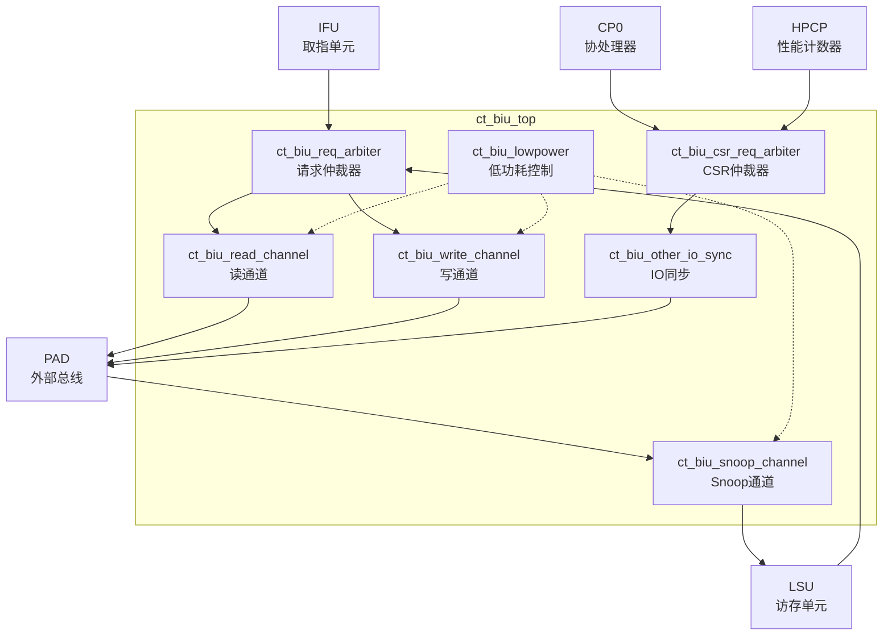

# ct_biu_top 模块方案文档

## 1. 模块概述

### 1.1 模块简介

ct_biu_top 是 OpenC910 处理器的总线接口单元（Bus Interface Unit）顶层模块，负责处理器核心与外部总线系统之间的通信接口。该模块实现了 AXI4 总线协议，处理指令获取、数据加载存储、缓存一致性维护以及 CSR 访问等总线事务。

### 1.2 主要特性

- 支持 AXI4 总线协议，包含独立的读写通道
- 支持 ACE 协议扩展，实现缓存一致性（Snoop通道）
- 多主设备仲裁，支持 IFU 取指请求和 LSU 数据访问
- 支持低功耗管理，包含时钟门控控制
- 支持 CSR 访问接口，用于 CP0 和 HPCP 寄存器访问
- 支持多核同步控制

### 1.3 模块层次

- **层次级别**: Level 1
- **父模块**: ct_top
- **子模块**: ct_biu_req_arbiter, ct_biu_read_channel, ct_biu_write_channel, ct_biu_snoop_channel, ct_biu_lowpower, ct_biu_csr_req_arbiter, ct_biu_other_io_sync

## 2. 模块接口说明

### 2.1 时钟与复位接口

| 信号名 | 方向 | 位宽 | 描述 |
|--------|------|------|------|
| coreclk | input | 1 | 核心时钟 |
| forever_coreclk | input | 1 | 永久核心时钟（不受门控） |
| cpurst_b | input | 1 | 核心复位信号，低有效 |

### 2.2 IFU 取指接口

| 信号名 | 方向 | 位宽 | 描述 |
|--------|------|------|------|
| ifu_biu_rd_req | input | 1 | 取指读请求 |
| ifu_biu_rd_addr | input | 40 | 取指地址 |
| ifu_biu_rd_len | input | 2 | 突发传输长度 |
| ifu_biu_rd_size | input | 3 | 传输大小 |
| ifu_biu_rd_cache | input | 4 | 缓存属性 |
| biu_ifu_rd_grnt | output | 1 | 读请求授权 |
| biu_ifu_rd_data | output | 128 | 读数据 |
| biu_ifu_rd_data_vld | output | 1 | 读数据有效 |

### 2.3 LSU 数据访问接口

| 信号名 | 方向 | 位宽 | 描述 |
|--------|------|------|------|
| lsu_biu_ar_req | input | 1 | 读地址请求 |
| lsu_biu_ar_addr | input | 40 | 读地址 |
| lsu_biu_aw_st_req | input | 1 | 存储写地址请求 |
| lsu_biu_aw_st_addr | input | 40 | 写地址 |
| biu_lsu_ar_ready | output | 1 | 读通道就绪 |
| biu_lsu_r_data | output | 128 | 读数据 |
| biu_lsu_b_vld | output | 1 | 写响应有效 |

### 2.4 AXI 总线接口

| 信号名 | 方向 | 位宽 | 描述 |
|--------|------|------|------|
| biu_pad_arvalid | output | 1 | 读地址有效 |
| biu_pad_araddr | output | 40 | 读地址 |
| biu_pad_arid | output | 5 | 读事务ID |
| biu_pad_awvalid | output | 1 | 写地址有效 |
| biu_pad_awaddr | output | 40 | 写地址 |
| biu_pad_wvalid | output | 1 | 写数据有效 |
| biu_pad_wdata | output | 128 | 写数据 |
| pad_biu_arready | input | 1 | 读地址就绪 |
| pad_biu_rdata | input | 128 | 读数据 |
| pad_biu_rvalid | input | 1 | 读数据有效 |

### 2.5 Snoop 一致性接口

| 信号名 | 方向 | 位宽 | 描述 |
|--------|------|------|------|
| pad_biu_acvalid | input | 1 | Snoop地址有效 |
| pad_biu_acaddr | input | 40 | Snoop地址 |
| biu_pad_acready | output | 1 | Snoop就绪 |
| biu_lsu_ac_req | output | 1 | Snoop请求到LSU |

### 2.6 CSR 访问接口

| 信号名 | 方向 | 位宽 | 描述 |
|--------|------|------|------|
| cp0_biu_sel | input | 1 | CP0 CSR选择 |
| cp0_biu_op | input | 16 | CSR操作码 |
| cp0_biu_wdata | input | 64 | CSR写数据 |
| biu_cp0_cmplt | output | 1 | CSR操作完成 |
| biu_cp0_rdata | output | 128 | CSR读数据 |

## 3. 模块框图

## 4. 模块实现方案

### 4.1 总体架构

ct_biu_top 采用多通道并行架构，包含以下主要组件：

1. **请求仲裁器（ct_biu_req_arbiter）**: 仲裁来自 IFU 和 LSU 的总线请求，支持优先级调度和公平性保证。

2. **读通道（ct_biu_read_channel）**: 处理 AXI 读事务，包含地址通道和数据通道控制。

3. **写通道（ct_biu_write_channel）**: 处理 AXI 写事务，支持存储写和驱逐写两种模式。

4. **Snoop通道（ct_biu_snoop_channel）**: 处理 ACE 协议的缓存一致性 snoop 请求。

5. **低功耗控制（ct_biu_lowpower）**: 管理各通道的时钟门控，实现动态功耗优化。

6. **CSR仲裁器（ct_biu_csr_req_arbiter）**: 仲裁来自 CP0 和 HPCP 的 CSR 访问请求。

### 4.2 请求仲裁机制

请求仲裁器采用轮询优先级机制：
- LSU 请求具有较高优先级，确保数据访问的及时性
- IFU 请求在 LSU 空闲时获得总线使用权
- 支持请求门控，在低功耗模式下可暂停请求

### 4.3 写通道设计

写通道支持两种写模式：
- **存储写（Store Write）**: 处理 CPU 存储指令产生的写请求
- **驱逐写（Victim Write）**: 处理缓存行驱逐产生的写回请求

两种写请求通过独立的地址和数据通道，避免相互阻塞。

### 4.4 缓存一致性支持

通过 ACE 协议扩展实现多核缓存一致性：
- 支持 Snoop 请求接收和响应
- 支持 Clean/MakeInvalid 等一致性操作
- 与 LSU 的缓存控制器协同维护一致性状态

## 5. 内部关键信号列表

| 信号名 | 位宽 | 类型 | 描述 |
|--------|------|------|------|
| arvalid | 1 | wire | 仲裁后的读地址有效信号 |
| arready | 1 | wire | 读地址就绪信号 |
| awvalid | 1 | wire | 仲裁后的写地址有效信号 |
| read_busy | 1 | wire | 读通道忙标志 |
| write_busy | 1 | wire | 写通道忙标志 |
| st_awaddr | 40 | wire | 存储写地址 |
| vict_awaddr | 40 | wire | 驱逐写地址 |
| biu_csr_sel | 1 | wire | CSR选择信号 |
| biu_csr_op | 16 | wire | CSR操作码 |

## 6. 子模块方案

### 6.1 ct_biu_req_arbiter

**功能描述**: 总线请求仲裁器，仲裁来自 IFU 和 LSU 的总线访问请求。

**主要接口**:
- IFU 取指请求接口
- LSU 读写请求接口
- 仲裁后的 AXI 请求接口

**设计要点**:
- 支持多主设备仲裁
- 实现优先级和公平性调度
- 支持请求门控控制

### 6.2 ct_biu_read_channel

**功能描述**: AXI 读通道控制器，处理所有读事务。

**主要接口**:
- 仲裁后的读地址通道
- AXI 读数据通道
- IFU/LSU 读响应接口

**设计要点**:
- 支持突发传输
- 实现读数据路由
- 支持时钟门控

### 6.3 ct_biu_write_channel

**功能描述**: AXI 写通道控制器，处理所有写事务。

**主要接口**:
- 存储写地址/数据通道
- 驱逐写地址/数据通道
- AXI 写响应通道

**设计要点**:
- 支持双写通道并行
- 实现写数据缓冲
- 支持 N/S 域分离

### 6.4 ct_biu_snoop_channel

**功能描述**: ACE Snoop 通道控制器，处理缓存一致性请求。

**主要接口**:
- Snoop 地址/控制通道（AC）
- Snoop 数据通道（CD）
- Snoop 响应通道（CR）

**设计要点**:
- 支持 ACE 协议
- 与 LSU 缓存控制器协同
- 实现 snoop 响应生成

### 6.5 ct_biu_lowpower

**功能描述**: 低功耗管理模块，控制各通道的时钟门控。

**设计要点**:
- 检测通道空闲状态
- 生成时钟使能信号
- 支持快速唤醒

### 6.6 ct_biu_csr_req_arbiter

**功能描述**: CSR 访问仲裁器，仲裁来自 CP0 和 HPCP 的 CSR 访问请求。

**设计要点**:
- 支持 CP0 和 HPCP 访问
- 实现 CSR 访问序列化
- 生成 CSR 操作响应

### 6.7 ct_biu_other_io_sync

**功能描述**: 其他 IO 信号同步模块，处理中断、调试等信号的同步。

**设计要点**:
- 中断信号同步
- 调试信号处理
- 时间戳传递

## 7. 修订历史

| 版本 | 日期 | 作者 | 描述 |
|------|------|------|------|
| 1.0 | 2024-01 | OpenC910 Team | 初始版本 |
