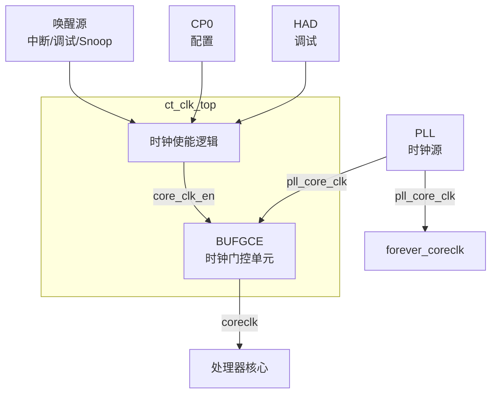

# ct_clk_top 模块方案文档

## 1. 模块概述

### 1.1 模块简介

ct_clk_top 是 OpenC910 处理器的时钟控制顶层模块，负责处理器核心时钟的生成和管理。该模块实现了全局时钟门控，支持低功耗模式下的时钟控制，为处理器核心提供可控的核心时钟。

### 1.2 主要特性

- 支持全局时钟门控（ICG）
- 支持多种唤醒源
- 支持低功耗模式
- 支持调试模式时钟控制
- 生成永久时钟和可控时钟

### 1.3 模块层次

- **层次级别**: Level 1
- **父模块**: ct_top
- **子模块**: 无（该模块使用 BUFGCE 原语）

## 2. 模块接口说明

### 2.1 时钟输入接口

| 信号名 | 方向 | 位宽 | 描述 |
|--------|------|------|------|
| pll_core_clk | input | 1 | PLL输出的核心时钟 |

### 2.2 时钟输出接口

| 信号名 | 方向 | 位宽 | 描述 |
|--------|------|------|------|
| forever_coreclk | output | 1 | 永久核心时钟（不受门控） |
| coreclk | output | 1 | 可控核心时钟 |

### 2.3 时钟使能接口

| 信号名 | 方向 | 位宽 | 描述 |
|--------|------|------|------|
| biu_xx_normal_work | input | 1 | 正常工作状态 |
| biu_xx_int_wakeup | input | 1 | 中断唤醒请求 |
| biu_xx_dbg_wakeup | input | 1 | 调试唤醒请求 |
| biu_xx_snoop_vld | input | 1 | Snoop有效（缓存一致性） |
| had_xx_clk_en | input | 1 | 调试模块时钟使能 |
| biu_xx_pmp_sel | input | 1 | PMP选择 |
| cp0_xx_core_icg_en | input | 1 | CP0核心ICG使能 |

## 3. 模块框图



## 4. 模块实现方案

### 4.1 总体架构

ct_clk_top 采用简单的时钟门控架构：

1. **永久时钟（forever_coreclk）**: 直接来自 PLL，不受门控，用于需要持续运行的逻辑（如调试、唤醒检测）。

2. **可控时钟（coreclk）**: 通过 BUFGCE 门控，根据工作状态动态使能/禁用，实现低功耗。

### 4.2 时钟使能逻辑

时钟使能信号由多个源组合生成：

```verilog
assign core_clk_en = biu_xx_normal_work |
                     biu_xx_int_wakeup | 
                     biu_xx_dbg_wakeup | 
                     biu_xx_snoop_vld |
                     had_xx_clk_en | 
                     biu_xx_pmp_sel |
                     cp0_xx_core_icg_en;
```

**各使能源说明**:

| 信号 | 描述 |
|------|------|
| biu_xx_normal_work | 处理器正常工作状态，保持时钟使能 |
| biu_xx_int_wakeup | 中断唤醒，从中断低功耗模式唤醒 |
| biu_xx_dbg_wakeup | 调试唤醒，从调试低功耗模式唤醒 |
| biu_xx_snoop_vld | Snoop有效，多核一致性需要时钟 |
| had_xx_clk_en | 调试模块时钟使能，调试时需要时钟 |
| biu_xx_pmp_sel | PMP选择，PMP访问需要时钟 |
| cp0_xx_core_icg_en | CP0控制的全局ICG使能 |

### 4.3 BUFGCE 时钟门控

使用 Xilinx BUFGCE 原语实现全局时钟门控：

```verilog
BUFGCE core_clk_buf
(
  .O   (coreclk),
  .I   (forever_coreclk),
  .CE  (core_clk_en)
);
```

**BUFGCE 特性**:
- 全局时钟缓冲器，低偏斜
- 内置时钟使能控制
- 无毛刺时钟门控

### 4.4 低功耗模式支持

时钟控制支持以下低功耗模式：

1. **时钟停止**: 当所有使能源无效时，核心时钟停止
2. **快速唤醒**: 任何唤醒源可立即恢复时钟
3. **调试支持**: 调试模式下保持时钟运行

### 4.5 多核同步支持

在多核系统中：
- **Snoop 时钟**: 缓存一致性操作需要时钟支持
- **PMP 时钟**: PMP 配置访问需要时钟

## 5. 内部关键信号列表

| 信号名 | 位宽 | 类型 | 描述 |
|--------|------|------|------|
| core_clk_en | 1 | wire | 核心时钟使能 |
| forever_coreclk | 1 | wire | 永久核心时钟 |
| coreclk | 1 | wire | 可控核心时钟 |

## 6. 子模块方案

该模块为扁平化设计，使用 BUFGCE 原语实现时钟门控，无独立子模块。

### 6.1 时钟使能逻辑

**功能描述**: 组合多个时钟使能源，生成全局时钟使能信号。

**设计要点**:
- 多源或逻辑组合
- 支持快速唤醒
- 支持调试模式

### 6.2 BUFGCE 时钟门控单元

**功能描述**: 实现无毛刺的全局时钟门控。

**设计要点**:
- 使用专用时钟资源
- 低偏斜全局时钟
- 内置使能同步

## 7. 修订历史

| 版本 | 日期 | 作者 | 描述 |
|------|------|------|------|
| 1.0 | 2024-01 | OpenC910 Team | 初始版本 |
