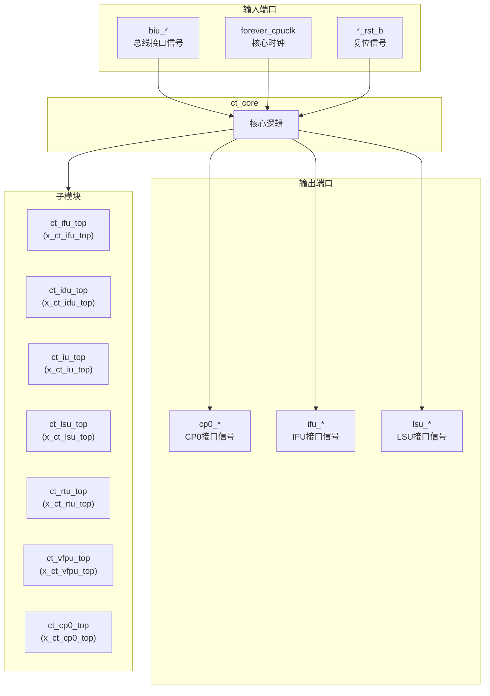
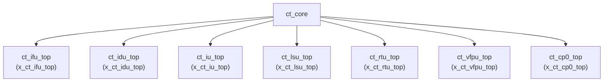

# ct_core 模块设计文档

## 1. 模块概述

### 1.1 基本信息

| 属性 | 值 |
|------|-----|
| 模块名称 | ct_core |
| 文件路径 | C910_RTL_FACTORY/gen_rtl/cpu/rtl/ct_core.v |
| 层级 | Level 1 |

### 1.2 功能描述

ct_core 是 OpenC910 处理器的核心模块，集成了处理器的主要功能单元。该模块包含取指单元(IFU)、译码单元(IDU)、整数单元(IU)、访存单元(LSU)、退休单元(RTU)、向量浮点单元(VFPU)和协处理器0(CP0)等子模块。

主要功能包括：
- 指令获取和预取
- 指令译码和分发
- 整数运算执行
- 内存访问操作
- 指令退休和异常处理
- 浮点和向量运算
- 系统控制和状态管理

### 1.3 设计特点

- 包含 7 个主要子模块实例
- 支持乱序执行和超标量架构
- 支持多发射流水线
- 集成调试和性能监控接口

## 2. 模块接口说明

### 2.1 输入端口

| 信号名 | 方向 | 位宽 | 描述 |
|--------|------|------|------|
| biu_cp0_apb_base | input | 40 | APB基地址 |
| biu_cp0_cmplt | input | 1 | CP0访问完成 |
| biu_cp0_coreid | input | 3 | 核心ID |
| biu_cp0_me_int | input | 1 | 机器模式外部中断 |
| biu_cp0_ms_int | input | 1 | 机器模式软件中断 |
| biu_cp0_mt_int | input | 1 | 机器模式定时器中断 |
| biu_cp0_rdata | input | 128 | CP0读数据 |
| biu_cp0_rvba | input | 40 | 复位向量基地址 |
| biu_cp0_se_int | input | 1 | 超级用户模式外部中断 |
| biu_cp0_ss_int | input | 1 | 超级用户模式软件中断 |
| biu_cp0_st_int | input | 1 | 超级用户模式定时器中断 |
| biu_ifu_rd_data | input | 128 | IFU读数据 |
| biu_ifu_rd_data_vld | input | 1 | IFU读数据有效 |
| biu_ifu_rd_grnt | input | 1 | IFU读授权 |
| biu_ifu_rd_id | input | 1 | IFU读ID |
| biu_ifu_rd_last | input | 1 | IFU读最后标志 |
| biu_ifu_rd_resp | input | 2 | IFU读响应 |
| biu_lsu_ac_addr | input | 40 | LSU访问地址 |
| biu_lsu_ac_prot | input | 3 | LSU访问保护 |
| biu_lsu_ac_req | input | 1 | LSU访问请求 |
| biu_lsu_ac_snoop | input | 4 | LSU访问snoop |
| biu_lsu_ar_ready | input | 1 | LSU AR就绪 |
| biu_lsu_aw_vb_grnt | input | 1 | LSU AW VB授权 |
| biu_lsu_aw_wmb_grnt | input | 1 | LSU AW WMB授权 |
| biu_lsu_b_id | input | 5 | LSU B ID |
| biu_lsu_b_resp | input | 2 | LSU B响应 |
| biu_lsu_b_vld | input | 1 | LSU B有效 |
| biu_lsu_cd_ready | input | 1 | LSU CD就绪 |
| biu_lsu_cr_ready | input | 1 | LSU CR就绪 |
| biu_lsu_r_data | input | 128 | LSU R数据 |
| biu_lsu_r_id | input | 5 | LSU R ID |
| biu_lsu_r_last | input | 1 | LSU R最后 |
| biu_lsu_r_resp | input | 4 | LSU R响应 |
| biu_lsu_r_vld | input | 1 | LSU R有效 |
| biu_lsu_w_vb_grnt | input | 1 | LSU W VB授权 |
| biu_lsu_w_wmb_grnt | input | 1 | LSU W WMB授权 |
| biu_yy_xx_no_op | input | 1 | 无操作标志 |
| forever_cpuclk | input | 1 | 核心时钟 |
| fpu_rst_b | input | 1 | FPU复位 |
| idu_rst_b | input | 1 | IDU复位 |
| ifu_rst_b | input | 1 | IFU复位 |
| lsu_rst_b | input | 1 | LSU复位 |

### 2.2 输出端口

| 信号名 | 方向 | 位宽 | 描述 |
|--------|------|------|------|
| cp0_biu_icg_en | output | 1 | BIU时钟门控使能 |
| cp0_biu_lpmd_b | output | 2 | 低功耗模式 |
| cp0_biu_op | output | 16 | BIU操作 |
| cp0_biu_sel | output | 1 | BIU选择 |
| cp0_biu_wdata | output | 64 | BIU写数据 |
| cp0_had_cpuid_0 | output | 32 | CPU ID |
| cp0_had_debug_info | output | 4 | 调试信息 |
| cp0_had_lpmd_b | output | 2 | 低功耗模式 |
| cp0_had_trace_pm_wdata | output | 2 | 跟踪电源管理数据 |
| cp0_had_trace_pm_wen | output | 1 | 跟踪电源管理使能 |
| cp0_hpcp_icg_en | output | 1 | HPCP时钟门控使能 |
| cp0_hpcp_index | output | 12 | HPCP索引 |
| cp0_hpcp_int_disable | output | 1 | HPCP中断禁用 |
| cp0_hpcp_mcntwen | output | 32 | HPCP计数器写使能 |
| cp0_hpcp_op | output | 4 | HPCP操作 |
| cp0_hpcp_pmdm | output | 1 | HPCP PMDM |
| cp0_hpcp_pmds | output | 1 | HPCP PMDS |
| cp0_hpcp_pmdu | output | 1 | HPCP PMDU |
| cp0_hpcp_sel | output | 1 | HPCP选择 |
| cp0_hpcp_src0 | output | 64 | HPCP源0 |
| cp0_hpcp_wdata | output | 64 | HPCP写数据 |
| cp0_mmu_cskyee | output | 1 | MMU CSKY扩展使能 |
| cp0_mmu_icg_en | output | 1 | MMU时钟门控使能 |
| cp0_mmu_maee | output | 1 | MMU MAEE使能 |
| cp0_mmu_mpp | output | 2 | MMU权限模式 |
| cp0_mmu_mprv | output | 1 | MMU权限修改 |
| cp0_mmu_mxr | output | 1 | MMU MXR |
| cp0_mmu_no_op_req | output | 1 | MMU无操作请求 |
| cp0_mmu_ptw_en | output | 1 | MMU PTW使能 |
| cp0_mmu_reg_num | output | 2 | MMU寄存器号 |
| cp0_mmu_satp_sel | output | 1 | MMU SATP选择 |
| cp0_mmu_sum | output | 1 | MMU SUM |
| cp0_mmu_tlb_all_inv | output | 1 | MMU TLB全失效 |
| cp0_mmu_wdata | output | 64 | MMU写数据 |
| cp0_mmu_wreg | output | 1 | MMU写寄存器 |
| cp0_pad_mstatus | output | 64 | MSTATUS寄存器 |
| cp0_pmp_icg_en | output | 1 | PMP时钟门控使能 |
| cp0_pmp_mpp | output | 2 | PMP权限模式 |
| cp0_pmp_mprv | output | 1 | PMP权限修改 |
| cp0_pmp_reg_num | output | 5 | PMP寄存器号 |
| cp0_pmp_wdata | output | 64 | PMP写数据 |
| cp0_pmp_wreg | output | 1 | PMP写寄存器 |
| cp0_xx_core_icg_en | output | 1 | 核心时钟门控使能 |
| cp0_yy_priv_mode | output | 2 | 特权模式 |
| ifu_biu_r_ready | output | 1 | IFU R就绪 |
| ifu_biu_rd_addr | output | 40 | IFU读地址 |
| ifu_biu_rd_burst | output | 2 | IFU读突发类型 |
| ifu_biu_rd_cache | output | 4 | IFU读缓存属性 |
| ifu_biu_rd_domain | output | 2 | IFU读域属性 |
| ifu_biu_rd_id | output | 1 | IFU读ID |
| ifu_biu_rd_len | output | 2 | IFU读长度 |
| ifu_biu_rd_prot | output | 3 | IFU读保护属性 |
| ifu_biu_rd_req | output | 1 | IFU读请求 |
| ifu_biu_rd_req_gate | output | 1 | IFU读请求门控 |
| ifu_biu_rd_size | output | 3 | IFU读大小 |
| ifu_biu_rd_snoop | output | 4 | IFU读snoop |
| ifu_biu_rd_user | output | 2 | IFU读用户信号 |
| ifu_mmu_abort | output | 1 | IFU MMU中止 |
| ifu_mmu_va | output | 63 | IFU MMU虚拟地址 |
| ifu_mmu_va_vld | output | 1 | IFU MMU VA有效 |

## 3. 模块框图

### 3.1 模块架构图

### 3.2 主要数据连线

| 源模块 | 目标模块 | 信号名 | 位宽 | 说明 |
|--------|----------|--------|------|------|
| ct_core | ct_ifu_top | mmu_ifu_pa | 28 | MMU物理地址 |
| ct_core | ct_ifu_top | mmu_ifu_pavld | 1 | 物理地址有效 |
| ct_core | ct_idu_top | ifu_idu_inst | 128 | 指令数据 |
| ct_core | ct_iu_top | idu_iu_inst | 64 | 译码后指令 |
| ct_core | ct_lsu_top | iu_lsu_addr | 40 | 访存地址 |
| ct_core | ct_rtu_top | iu_rtu_result | 64 | 执行结果 |
| ct_core | ct_vfpu_top | idu_vfpu_inst | 64 | 浮点指令 |
| ct_core | ct_cp0_top | rtu_cp0_cause | 32 | 异常原因 |

## 4. 模块实现方案

### 4.1 关键逻辑描述

ct_core 模块主要是子模块实例化和信号连接，不包含复杂的逻辑处理：

1. **时钟分配**：将 forever_cpuclk 分配到各子模块
2. **复位分配**：将各复位信号分配到相应的子模块
3. **信号路由**：在各子模块之间路由数据和控制信号

### 4.2 流水线架构

| 流水线级 | 功能 | 模块 |
|----------|------|------|
| IF | 取指 | ct_ifu_top |
| ID | 译码 | ct_idu_top |
| IS | 发射 | ct_idu_top |
| EX | 执行 | ct_iu_top, ct_vfpu_top |
| MEM | 访存 | ct_lsu_top |
| WB | 写回 | ct_rtu_top |

## 5. 内部关键信号列表

### 5.1 寄存器信号

无寄存器信号。

### 5.2 线网信号

| 信号名 | 位宽 | 描述 |
|--------|------|------|
| cp0_biu_icg_en | 1 | BIU时钟门控使能 |
| cp0_biu_lpmd_b | 2 | 低功耗模式 |
| cp0_biu_op | 16 | BIU操作 |
| cp0_biu_sel | 1 | BIU选择 |
| cp0_biu_wdata | 64 | BIU写数据 |
| cp0_had_cpuid_0 | 32 | CPU ID |
| cp0_had_debug_info | 4 | 调试信息 |
| cp0_had_lpmd_b | 2 | 低功耗模式 |
| cp0_had_trace_pm_wdata | 2 | 跟踪电源管理数据 |
| cp0_had_trace_pm_wen | 1 | 跟踪电源管理使能 |
| cp0_hpcp_icg_en | 1 | HPCP时钟门控使能 |
| cp0_hpcp_index | 12 | HPCP索引 |
| cp0_hpcp_int_disable | 1 | HPCP中断禁用 |
| cp0_hpcp_mcntwen | 32 | HPCP计数器写使能 |
| cp0_hpcp_op | 4 | HPCP操作 |
| cp0_hpcp_pmdm | 1 | HPCP PMDM |
| cp0_hpcp_pmds | 1 | HPCP PMDS |
| cp0_hpcp_pmdu | 1 | HPCP PMDU |
| cp0_hpcp_sel | 1 | HPCP选择 |
| cp0_hpcp_src0 | 64 | HPCP源0 |
| cp0_hpcp_wdata | 64 | HPCP写数据 |
| cp0_mmu_cskyee | 1 | MMU CSKY扩展使能 |
| cp0_mmu_icg_en | 1 | MMU时钟门控使能 |
| cp0_mmu_maee | 1 | MMU MAEE使能 |
| cp0_mmu_mpp | 2 | MMU权限模式 |
| cp0_mmu_mprv | 1 | MMU权限修改 |
| cp0_mmu_mxr | 1 | MMU MXR |
| cp0_mmu_no_op_req | 1 | MMU无操作请求 |
| cp0_mmu_ptw_en | 1 | MMU PTW使能 |
| cp0_mmu_reg_num | 2 | MMU寄存器号 |
| cp0_mmu_satp_sel | 1 | MMU SATP选择 |
| cp0_mmu_sum | 1 | MMU SUM |
| cp0_mmu_tlb_all_inv | 1 | MMU TLB全失效 |
| cp0_mmu_wdata | 64 | MMU写数据 |
| cp0_mmu_wreg | 1 | MMU写寄存器 |
| cp0_pad_mstatus | 64 | MSTATUS寄存器 |
| cp0_pmp_icg_en | 1 | PMP时钟门控使能 |
| cp0_pmp_mpp | 2 | PMP权限模式 |
| cp0_pmp_mprv | 1 | PMP权限修改 |
| cp0_pmp_reg_num | 5 | PMP寄存器号 |
| cp0_pmp_wdata | 64 | PMP写数据 |
| cp0_pmp_wreg | 1 | PMP写寄存器 |
| cp0_xx_core_icg_en | 1 | 核心时钟门控使能 |
| cp0_yy_priv_mode | 2 | 特权模式 |

## 6. 子模块方案

### 6.1 模块例化层次结构

### 6.2 子模块列表

| 层级 | 模块名 | 实例名 | 功能描述 |
|------|--------|--------|----------|
| 2 | ct_ifu_top | x_ct_ifu_top | 取指单元，负责从内存获取指令 |
| 2 | ct_idu_top | x_ct_idu_top | 译码单元，负责指令译码和分发 |
| 2 | ct_iu_top | x_ct_iu_top | 整数单元，负责整数运算 |
| 2 | ct_lsu_top | x_ct_lsu_top | 访存单元，负责内存访问操作 |
| 2 | ct_rtu_top | x_ct_rtu_top | 退休单元，负责指令退休 |
| 2 | ct_vfpu_top | x_ct_vfpu_top | 向量浮点单元，负责浮点和向量运算 |
| 2 | ct_cp0_top | x_ct_cp0_top | 协处理器0，负责系统控制 |

### 6.3 子模块功能说明

#### ct_ifu_top
取指单元，负责从内存获取指令。包含：
- PC生成逻辑
- 分支预测
- 指令缓存接口
- 指令缓冲

#### ct_idu_top
译码单元，负责指令译码和分发。包含：
- 指令译码器
- 发射队列
- 寄存器文件
- 前递逻辑

#### ct_iu_top
整数单元，负责整数运算。包含：
- ALU
- 乘法器
- 除法器
- 分支单元

#### ct_lsu_top
访存单元，负责内存访问操作。包含：
- 地址生成
- 数据缓存
- 存储队列
- 写缓冲

#### ct_rtu_top
退休单元，负责指令退休。包含：
- 重排序缓冲
- 退休逻辑
- 异常处理

#### ct_vfpu_top
向量浮点单元，负责浮点和向量运算。包含：
- 浮点运算单元
- 向量运算单元

#### ct_cp0_top
协处理器0，负责系统控制。包含：
- CSR寄存器
- 中断控制
- 异常处理

## 7. 修订历史

| 版本 | 日期 | 作者 | 说明 |
|------|------|------|------|
| 1.0 | 2026-03-12 | Auto-generated | 初始版本 |
