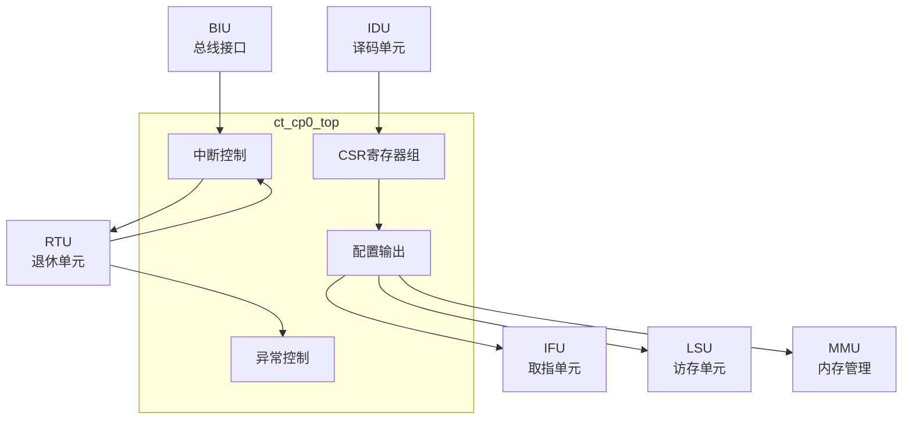

# ct_cp0_top 模块方案文档

## 1. 模块概述

### 1.1 模块简介

ct_cp0_top 是 OpenC910 处理器的协处理器0（Coprocessor 0）顶层模块，实现了 RISC-V 特权架构规范中定义的控制和状态寄存器（CSR）。该模块负责处理器配置、异常处理、中断管理、性能监控配置等功能。

### 1.2 主要特性

- 实现 RISC-V CSR 寄存器
- 支持机器模式（M-Mode）
- 支持用户模式（U-Mode）
- 支持异常和中断处理
- 支持性能计数器配置
- 支持调试支持

### 1.3 模块层次

- **层次级别**: Level 2
- **父模块**: ct_core
- **子模块**: 包含CSR寄存器组、中断控制等

## 2. 模块接口说明

### 2.1 时钟与复位接口

| 信号名 | 方向 | 位宽 | 描述 |
|--------|------|------|------|
| forever_cpuclk | input | 1 | 永久CPU时钟 |
| cpurst_b | input | 1 | 核心复位信号，低有效 |

### 2.2 IDU访问接口

| 信号名 | 方向 | 位宽 | 描述 |
|--------|------|------|------|
| idu_cp0_rf_sel | input | 1 | CSR选择 |
| idu_cp0_rf_opcode | input | 32 | 操作码 |
| idu_cp0_rf_func | input | 5 | 功能码 |
| idu_cp0_rf_src0 | input | 64 | 源数据 |
| idu_cp0_rf_preg | input | 7 | 目的物理寄存器 |
| idu_cp0_rf_iid | input | 7 | 指令ID |

### 2.3 RTU接口

| 信号名 | 方向 | 位宽 | 描述 |
|--------|------|------|------|
| rtu_cp0_epc | input | 64 | 异常PC |
| rtu_cp0_expt_vld | input | 1 | 异常有效 |
| rtu_cp0_expt_mtval | input | 64 | 异常值 |
| rtu_cp0_int_ack | input | 1 | 中断确认 |
| cp0_rtu_xx_int_b | output | 1 | 中断请求 |
| cp0_rtu_xx_vec | output | 1 | 中断向量 |

### 2.4 IFU配置接口

| 信号名 | 方向 | 位宽 | 描述 |
|--------|------|------|------|
| cp0_ifu_icache_en | output | 1 | ICache使能 |
| cp0_ifu_btb_en | output | 1 | BTB使能 |
| cp0_ifu_bht_en | output | 1 | BHT使能 |
| cp0_ifu_vbr | output | 40 | 向量基地址 |
| cp0_yy_priv_mode | output | 2 | 特权模式 |

### 2.5 LSU配置接口

| 信号名 | 方向 | 位宽 | 描述 |
|--------|------|------|------|
| cp0_lsu_dcache_en | output | 1 | DCache使能 |
| cp0_lsu_dcache_inv | output | 1 | DCache无效化 |
| cp0_lsu_mm | output | 1 | 内存管理使能 |

### 2.6 MMU配置接口

| 信号名 | 方向 | 位宽 | 描述 |
|--------|------|------|------|
| cp0_mmu_mprv | output | 1 | 内存特权 |
| cp0_mmu_mxr | output | 1 | 可执行读 |
| cp0_mmu_sum | output | 1 | 用户模式访问 |
| cp0_mmu_satp_sel | output | 1 | SATP选择 |

### 2.7 BIU接口

| 信号名 | 方向 | 位宽 | 描述 |
|--------|------|------|------|
| biu_cp0_coreid | input | 3 | 核心ID |
| biu_cp0_me_int | input | 1 | 机器外部中断 |
| biu_cp0_ms_int | input | 1 | 机器软件中断 |
| biu_cp0_mt_int | input | 1 | 机器定时器中断 |

## 3. 模块框图

## 4. 模块实现方案

### 4.1 总体架构

ct_cp0_top 实现了 RISC-V 特权架构的核心功能：

1. **CSR寄存器组**: 存储所有控制和状态寄存器
2. **中断控制**: 管理中断请求和响应
3. **异常控制**: 处理异常信息
4. **配置输出**: 向各模块输出配置信号

### 4.2 CSR寄存器

实现的主要CSR寄存器：

**机器信息寄存器**:
- mvendorid, marchid, mimpid, mhartid

**机器配置寄存器**:
- mstatus, misa, medeleg, mideleg
- mie, mtvec, mcounteren

**机器异常处理寄存器**:
- mscratch, mepc, mcause, mtval, mip

**性能计数器寄存器**:
- mcycle, minstret, mhpmcounter*

**向量寄存器**:
- vstart, vxsat, vxrm, vcsr, vlenb

### 4.3 中断处理

支持的中断类型：
- 机器软件中断（MSI）
- 机器定时器中断（MTI）
- 机器外部中断（MEI）
- 用户软件/定时器/外部中断

### 4.4 特权模式

支持的特权模式：
- Machine Mode (M-Mode): 最高特权级
- User Mode (U-Mode): 最低特权级

### 4.5 CSR访问

支持的CSR访问指令：
- CSRRW: 读后写
- CSRRS: 读后置位
- CSRRC: 读后清零
- CSRRWI/CSRRSI/CSRRCI: 立即数版本

## 5. 内部关键信号列表

| 信号名 | 位宽 | 类型 | 描述 |
|--------|------|------|------|
| mstatus | 64 | reg | 机器状态寄存器 |
| mie | 64 | reg | 中断使能寄存器 |
| mip | 64 | reg | 中断挂起寄存器 |
| mtvec | 64 | reg | 机器陷阱向量 |
| mepc | 64 | reg | 机器异常PC |
| mcause | 64 | reg | 机器原因寄存器 |
| priv_mode | 2 | reg | 当前特权模式 |

## 6. 子模块方案

### 6.1 CSR寄存器组

**功能描述**: 存储所有CSR寄存器。

**设计要点**:
- 支持原子访问
- 支持特权级检查
- 支持WARL/WPRI字段

### 6.2 中断控制

**功能描述**: 管理中断请求和响应。

**设计要点**:
- 中断优先级
- 中断使能控制
- 中断挂起管理

### 6.3 异常控制

**功能描述**: 处理异常信息。

**设计要点**:
- 异常原因记录
- 异常PC保存
- 异常值记录

## 7. 修订历史

| 版本 | 日期 | 作者 | 描述 |
|------|------|------|------|
| 1.0 | 2024-01 | OpenC910 Team | 初始版本 |
