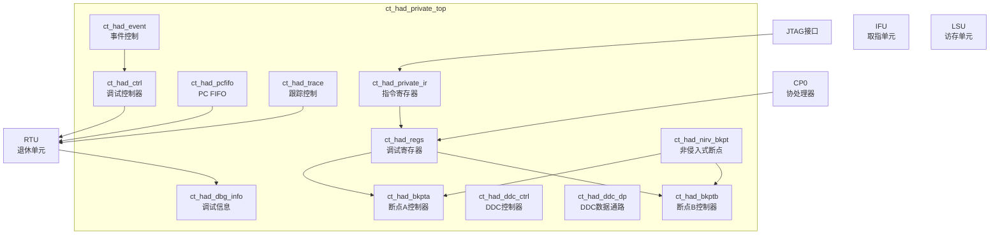

# ct_had_private_top 模块方案文档

## 1. 模块概述

### 1.1 模块简介

ct_had_private_top 是 OpenC910 处理器的硬件调试（Hardware Debug）私有模块顶层，实现了 RISC-V 调试规范中定义的调试功能。该模块支持断点设置、单步执行、程序跟踪、调试寄存器访问等调试特性，为软件开发和系统调试提供硬件支持。

### 1.2 主要特性

- 支持 RISC-V 调试规范（Debug Spec）
- 支持硬件断点（指令断点和数据断点）
- 支持非侵入式断点（Non-Intrusive Breakpoint）
- 支持程序计数器（PC）跟踪
- 支持调试事件触发
- 支持 JTAG 调试接口
- 支持多核调试同步

### 1.3 模块层次

- **层次级别**: Level 1
- **父模块**: ct_top
- **子模块**: ct_had_bkpta, ct_had_bkptb, ct_had_ctrl, ct_had_ddc_ctrl, ct_had_ddc_dp, ct_had_pcfifo, ct_had_regs, ct_had_trace, ct_had_event, ct_had_dbg_info, ct_had_nirv_bkpt, ct_had_private_ir

## 2. 模块接口说明

### 2.1 时钟与复位接口

| 信号名 | 方向 | 位宽 | 描述 |
|--------|------|------|------|
| cpuclk | input | 1 | CPU时钟 |
| forever_coreclk | input | 1 | 永久核心时钟 |
| cpurst_b | input | 1 | 核心复位信号，低有效 |

### 2.2 调试控制接口

| 信号名 | 方向 | 位宽 | 描述 |
|--------|------|------|------|
| biu_had_sdb_req_b | input | 1 | 外部调试请求 |
| had_yy_xx_exit_dbg | output | 1 | 退出调试模式 |
| had_cp0_xx_dbg | output | 1 | 调试模式指示 |
| rtu_yy_xx_dbgon | input | 1 | 调试模式激活状态 |

### 2.3 断点接口

| 信号名 | 方向 | 位宽 | 描述 |
|--------|------|------|------|
| had_yy_xx_bkpta_base | output | 40 | 断点A基地址 |
| had_yy_xx_bkpta_mask | output | 8 | 断点A地址掩码 |
| had_yy_xx_bkpta_rc | output | 1 | 断点A读/写控制 |
| had_yy_xx_bkptb_base | output | 40 | 断点B基地址 |
| had_yy_xx_bkptb_mask | output | 8 | 断点B地址掩码 |
| had_yy_xx_bkptb_rc | output | 1 | 断点B读/写控制 |

### 2.4 调试请求接口

| 信号名 | 方向 | 位宽 | 描述 |
|--------|------|------|------|
| had_rtu_hw_dbgreq | output | 1 | 硬件调试请求 |
| had_rtu_inst_bkpt_dbgreq | output | 1 | 指令断点调试请求 |
| had_rtu_data_bkpt_dbgreq | output | 1 | 数据断点调试请求 |
| had_rtu_trace_dbgreq | output | 1 | 跟踪调试请求 |
| had_rtu_event_dbgreq | output | 1 | 事件调试请求 |

### 2.5 RTU 接口

| 信号名 | 方向 | 位宽 | 描述 |
|--------|------|------|------|
| rtu_had_dbgreq_ack | input | 1 | 调试请求确认 |
| rtu_had_xx_pc | input | 39 | 当前PC值 |
| rtu_had_retire_inst0_vld | input | 1 | 指令0退休有效 |
| rtu_had_retire_inst0_info | input | 64 | 指令0退休信息 |

### 2.6 JTAG 接口

| 信号名 | 方向 | 位宽 | 描述 |
|--------|------|------|------|
| sm_update_ir | input | 1 | IR更新信号 |
| sm_update_dr | input | 1 | DR更新信号 |
| ir_corex_wdata | input | 64 | JTAG写数据 |
| x_regs_serial_data | output | 64 | JTAG读数据 |

## 3. 模块框图



## 4. 模块实现方案

### 4.1 总体架构

ct_had_private_top 采用模块化设计，包含以下主要功能单元：

1. **断点控制器（ct_had_bkpt）**: 实现硬件断点功能，支持指令断点和数据断点，两个独立实例（A和B）。

2. **调试控制器（ct_had_ctrl）**: 核心控制逻辑，管理调试状态机、处理调试请求和响应。

3. **调试寄存器（ct_had_regs）**: 存储调试配置和状态信息，支持 JTAG 访问。

4. **PC FIFO（ct_had_pcfifo）**: 记录程序执行轨迹，支持程序跟踪功能。

5. **事件控制器（ct_had_event）**: 处理调试事件触发，支持进入/退出调试的事件控制。

6. **非侵入式断点（ct_had_nirv_bkpt）**: 实现不影响程序执行的断点功能。

### 4.2 调试状态机

调试控制器实现以下状态转换：

```
正常运行 -> 调试请求 -> 进入调试模式 -> 调试执行 -> 退出调试 -> 正常运行
```

状态转换条件：
- 进入调试：硬件断点命中、外部调试请求、单步完成
- 退出调试：调试命令完成、继续执行命令

### 4.3 断点机制

支持两种断点类型：

**指令断点**:
- 基于指令地址匹配
- 支持地址掩码实现范围断点
- 在指令退休时检测

**数据断点**:
- 基于数据访问地址匹配
- 支持读/写/读写条件
- 在 LSU 操作时检测

**非侵入式断点**:
- 不触发调试模式切换
- 仅记录断点命中事件
- 用于性能分析和统计

### 4.4 PC 跟踪功能

PC FIFO 记录程序执行轨迹：
- 记录每条退休指令的 PC 和下一条 PC
- 支持条件分支、跳转、函数调用/返回标记
- FIFO 深度可配置，支持 JTAG 读取

### 4.5 JTAG 调试接口

支持标准 JTAG 调试协议：
- IR（Instruction Register）: 选择访问的调试寄存器
- DR（Data Register）: 传输寄存器数据
- 支持多种调试寄存器访问

## 5. 内部关键信号列表

| 信号名 | 位宽 | 类型 | 描述 |
|--------|------|------|------|
| ctrl_bkpta_en | 1 | wire | 断点A使能 |
| ctrl_bkptb_en | 1 | wire | 断点B使能 |
| ctrl_trace_en | 1 | wire | 跟踪使能 |
| ctrl_xx_dbg_disable | 1 | wire | 调试禁用 |
| regs_ctrl_tme | 1 | wire | 触发模式使能 |
| regs_ctrl_sqa | 1 | wire | 序列A启动 |
| regs_ctrl_sqb | 1 | wire | 序列B启动 |
| event_ctrl_enter_dbg | 1 | wire | 进入调试事件 |
| event_ctrl_exit_dbg | 1 | wire | 退出调试事件 |
| inst_bkpt_dbgreq | 1 | wire | 指令断点调试请求 |
| nirv_bkpta | 1 | wire | 非侵入式断点A命中 |

## 6. 子模块方案

### 6.1 ct_had_bkpt

**功能描述**: 硬件断点控制器，实现指令和数据断点功能。

**主要接口**:
- 断点配置接口（基地址、掩码、控制）
- 断点匹配检测接口
- 断点确认接口

**设计要点**:
- 支持地址范围匹配
- 支持读/写条件选择
- 支持特权模式过滤

### 6.2 ct_had_ctrl

**功能描述**: 调试核心控制器，管理调试状态和请求。

**主要接口**:
- 断点请求接口
- 调试请求/响应接口
- 控制信号接口

**设计要点**:
- 实现调试状态机
- 处理多种调试触发源
- 生成调试控制信号

### 6.3 ct_had_regs

**功能描述**: 调试寄存器组，存储调试配置和状态。

**主要接口**:
- JTAG 访问接口
- 配置输出接口
- 状态输入接口

**设计要点**:
- 支持多种调试寄存器
- 实现 JTAG 访问协议
- 支持寄存器更新同步

### 6.4 ct_had_pcfifo

**功能描述**: PC 跟踪 FIFO，记录程序执行轨迹。

**主要接口**:
- PC 写入接口
- FIFO 读取接口
- 控制接口

**设计要点**:
- 支持多指令并行写入
- 实现 FIFO 缓冲
- 支持冻结和读取控制

### 6.5 ct_had_event

**功能描述**: 调试事件控制器，处理事件触发的调试。

**主要接口**:
- 进入/退出调试事件
- 外部事件输入
- 事件输出

**设计要点**:
- 支持内部和外部事件
- 实现事件同步
- 支持事件使能控制

### 6.6 ct_had_trace

**功能描述**: 跟踪控制器，管理跟踪功能。

**设计要点**:
- 控制跟踪使能
- 处理跟踪触发
- 管理跟踪计数器

### 6.7 ct_had_dbg_info

**功能描述**: 调试信息收集模块，汇总各模块的调试信息。

**设计要点**:
- 收集流水线状态
- 汇总断点状态
- 生成调试 FIFO 数据

### 6.8 ct_had_nirv_bkpt

**功能描述**: 非侵入式断点控制器，实现不影响执行的断点。

**设计要点**:
- 检测断点条件
- 不触发调试模式
- 记录命中事件

### 6.9 ct_had_private_ir

**功能描述**: JTAG 指令寄存器，处理 JTAG IR/DR 访问。

**设计要点**:
- 实现 JTAG IR 解码
- 生成寄存器选择信号
- 处理 DR 数据传输

### 6.10 ct_had_ddc_ctrl / ct_had_ddc_dp

**功能描述**: 调试数据控制器和数据通路，支持调试模式下的数据访问。

**设计要点**:
- 支持调试模式 CSR 访问
- 支持 WBBR（Write Back Buffer Register）访问
- 实现数据通路选择

## 7. 修订历史

| 版本 | 日期 | 作者 | 描述 |
|------|------|------|------|
| 1.0 | 2024-01 | OpenC910 Team | 初始版本 |
