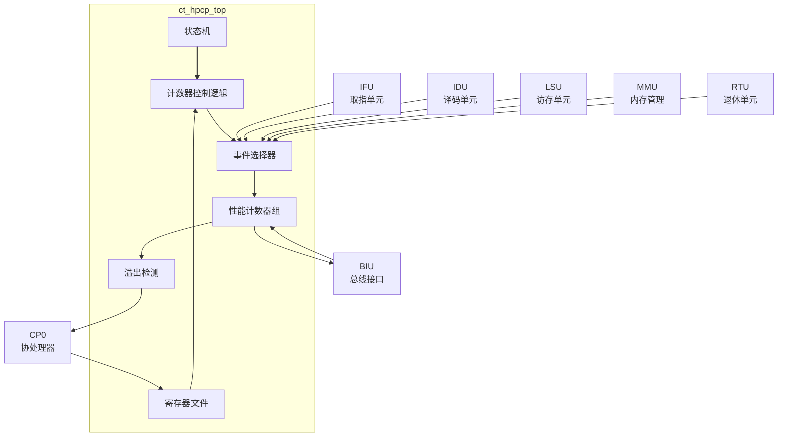

# ct_hpcp_top 模块方案文档

## 1. 模块概述

### 1.1 模块简介

ct_hpcp_top 是 OpenC910 处理器的硬件性能计数器（Hardware Performance Counter）顶层模块，实现了 RISC-V 特权架构规范中定义的性能监控单元（PMU）。该模块支持多种硬件性能事件的计数，为性能分析、优化和监控提供硬件支持。

### 1.2 主要特性

- 支持 RISC-V 性能计数器扩展
- 支持多个可编程性能计数器
- 支持多种硬件性能事件
- 支持事件溢出中断
- 支持计数器使能和过滤控制
- 支持 L2 缓存性能监控

### 1.3 模块层次

- **层次级别**: Level 1
- **父模块**: ct_top
- **子模块**: 该模块为扁平化设计，无独立子模块

## 2. 模块接口说明

### 2.1 时钟与复位接口

| 信号名 | 方向 | 位宽 | 描述 |
|--------|------|------|------|
| forever_cpuclk | input | 1 | 永久CPU时钟 |
| cpurst_b | input | 1 | 核心复位信号，低有效 |
| pad_yy_icg_scan_en | input | 1 | 扫描测试使能 |

### 2.2 CP0 访问接口

| 信号名 | 方向 | 位宽 | 描述 |
|--------|------|------|------|
| cp0_hpcp_sel | input | 1 | CP0选择信号 |
| cp0_hpcp_op | input | 4 | 操作码 |
| cp0_hpcp_index | input | 12 | 寄存器索引 |
| cp0_hpcp_wdata | input | 64 | 写数据 |
| hpcp_cp0_cmplt | output | 1 | 操作完成 |
| hpcp_cp0_data | output | 64 | 读数据 |
| hpcp_cp0_int_vld | output | 1 | 中断有效 |

### 2.3 BIU 接口（L2性能监控）

| 信号名 | 方向 | 位宽 | 描述 |
|--------|------|------|------|
| biu_hpcp_cmplt | input | 1 | L2操作完成 |
| biu_hpcp_rdata | input | 128 | L2读数据 |
| biu_hpcp_time | input | 64 | 时间戳 |
| biu_hpcp_l2of_int | input | 4 | L2溢出中断 |
| hpcp_biu_sel | output | 1 | BIU选择 |
| hpcp_biu_op | output | 16 | BIU操作码 |
| hpcp_biu_wdata | output | 64 | BIU写数据 |
| hpcp_biu_cnt_en | output | 4 | 计数器使能 |

### 2.4 性能事件输入接口

#### IFU 事件
| 信号名 | 方向 | 位宽 | 描述 |
|--------|------|------|------|
| ifu_hpcp_frontend_stall | input | 1 | 前端停顿 |
| ifu_hpcp_icache_access | input | 1 | ICache访问 |
| ifu_hpcp_icache_miss | input | 1 | ICache缺失 |
| ifu_hpcp_btb_inst | input | 1 | BTB指令 |
| ifu_hpcp_btb_mispred | input | 1 | BTB误预测 |

#### IDU 事件
| 信号名 | 方向 | 位宽 | 描述 |
|--------|------|------|------|
| idu_hpcp_backend_stall | input | 1 | 后端停顿 |
| idu_hpcp_rf_inst_vld | input | 1 | RF指令有效 |
| idu_hpcp_ir_inst0_vld | input | 1 | IR指令0有效 |

#### LSU 事件
| 信号名 | 方向 | 位宽 | 描述 |
|--------|------|------|------|
| lsu_hpcp_cache_read_access | input | 1 | DCache读访问 |
| lsu_hpcp_cache_read_miss | input | 1 | DCache读缺失 |
| lsu_hpcp_cache_write_access | input | 1 | DCache写访问 |
| lsu_hpcp_cache_write_miss | input | 1 | DCache写缺失 |
| lsu_hpcp_fence_stall | input | 1 | FENCE停顿 |

#### MMU 事件
| 信号名 | 方向 | 位宽 | 描述 |
|--------|------|------|------|
| mmu_hpcp_iutlb_miss | input | 1 | IUTLB缺失 |
| mmu_hpcp_dutlb_miss | input | 1 | DUTLB缺失 |
| mmu_hpcp_jtlb_miss | input | 1 | JTLB缺失 |

#### RTU 事件
| 信号名 | 方向 | 位宽 | 描述 |
|--------|------|------|------|
| rtu_hpcp_inst0_vld | input | 1 | 指令0退休有效 |
| rtu_hpcp_inst0_condbr | input | 1 | 指令0条件分支 |
| rtu_hpcp_inst0_bht_mispred | input | 1 | BHT误预测 |
| rtu_hpcp_inst0_store | input | 1 | 存储指令 |

### 2.5 计数器使能输出

| 信号名 | 方向 | 位宽 | 描述 |
|--------|------|------|------|
| hpcp_idu_cnt_en | output | 1 | IDU计数使能 |
| hpcp_ifu_cnt_en | output | 1 | IFU计数使能 |
| hpcp_lsu_cnt_en | output | 1 | LSU计数使能 |
| hpcp_mmu_cnt_en | output | 1 | MMU计数使能 |
| hpcp_rtu_cnt_en | output | 1 | RTU计数使能 |

## 3. 模块框图

## 4. 模块实现方案

### 4.1 总体架构

ct_hpcp_top 实现了 RISC-V 特权架构规范中定义的性能监控单元，主要包含：

1. **性能计数器组**: 多个64位可编程计数器，可配置监控不同事件。

2. **事件选择器**: 根据配置选择要计数的事件源。

3. **溢出检测**: 检测计数器溢出并生成中断。

4. **寄存器文件**: 存储计数器值、事件选择和控制配置。

5. **状态机**: 管理计数器操作和 L2 监控访问。

### 4.2 支持的性能事件

模块支持以下类别的性能事件：

**周期和指令计数**:
- 时钟周期
- 退休指令数
- 压缩指令数

**缓存事件**:
- ICache 访问/缺失
- DCache 读/写访问/缺失
- 缓存一致性事件

**分支预测事件**:
- 分支指令数
- 分支误预测数
- BTB/BHT 事件

**TLB 事件**:
- IUTLB 缺失
- DUTLB 缺失
- JTLB 缺失

**流水线事件**:
- 前端停顿
- 后端停顿
- FENCE 停顿

**存储事件**:
- 加载/存储指令数
- 跨4K边界访问
- 非对齐访问

### 4.3 计数器配置

每个性能计数器可配置：
- **事件选择（Event Select）**: 选择要计数的事件
- **计数器使能（Counter Enable）**: 控制计数器是否工作
- **特权模式过滤**: 可配置只在特定特权模式下计数
- **溢出中断使能**: 控制溢出时是否产生中断

### 4.4 L2 性能监控

通过 BIU 接口访问外部 L2 缓存的性能计数器：
- 支持读取 L2 计数器值
- 支持 L2 计数器溢出中断
- 支持时间戳同步

### 4.5 状态机设计

状态机管理计数器操作：
- **IDLE**: 空闲状态
- **READ**: 读操作状态
- **WRITE**: 写操作状态
- **L2_ACCESS**: L2 访问状态

## 5. 内部关键信号列表

| 信号名 | 位宽 | 类型 | 描述 |
|--------|------|------|------|
| cnt0_event_index | 6 | reg | 计数器0事件索引 |
| cnt_mask | 32 | reg | 计数器掩码 |
| cnt_mode_dis | 1 | reg | 计数模式禁用 |
| hpm | 29 | reg | 硬件性能监控寄存器 |
| hpmep_reg | 63 | reg | 事件匹配地址寄存器 |
| hpmsp_reg | 63 | reg | 事件匹配起始地址寄存器 |
| counter_overflow | 32 | wire | 计数器溢出标志 |
| cur_state | 2 | reg | 当前状态 |
| next_state | 2 | reg | 下一状态 |
| sce | 1 | reg | 系统计数使能 |
| tme | 2 | reg | 触发模式使能 |

## 6. 子模块方案

该模块采用扁平化设计，所有功能在同一模块内实现，无独立子模块。主要功能单元包括：

### 6.1 计数器控制逻辑

**功能描述**: 管理计数器的使能、递增和读取操作。

**设计要点**:
- 支持计数器使能控制
- 实现事件计数递增
- 支持计数器读写访问

### 6.2 事件选择器

**功能描述**: 根据配置选择要计数的事件源。

**设计要点**:
- 支持多事件源选择
- 实现事件组合逻辑
- 支持事件过滤

### 6.3 溢出检测逻辑

**功能描述**: 检测计数器溢出并生成中断。

**设计要点**:
- 检测最高位翻转
- 生成溢出中断
- 支持中断屏蔽

### 6.4 寄存器文件

**功能描述**: 存储计数器配置和值。

**设计要点**:
- 实现 CSR 访问接口
- 支持计数器读写
- 实现寄存器复位

## 7. 修订历史

| 版本 | 日期 | 作者 | 描述 |
|------|------|------|------|
| 1.0 | 2024-01 | OpenC910 Team | 初始版本 |
