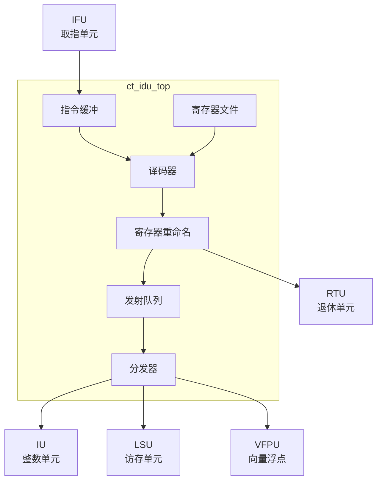

# ct_idu_top 模块方案文档

## 1. 模块概述

### 1.1 模块简介

ct_idu_top 是 OpenC910 处理器的指令译码单元（Instruction Decode Unit）顶层模块，负责从取指单元接收指令，进行译码、重命名和分发。该模块实现了超标量译码、寄存器重命名、指令队列管理和多发射调度等功能。

### 1.2 主要特性

- 支持超标量译码（每周期最多4条指令）
- 实现寄存器重命名（物理寄存器映射）
- 支持乱序执行调度
- 支持向量指令译码
- 支持指令融合优化

### 1.3 模块层次

- **层次级别**: Level 2
- **父模块**: ct_core
- **子模块**: 包含译码、重命名、发射队列等子模块

## 2. 模块接口说明

### 2.1 时钟与复位接口

| 信号名 | 方向 | 位宽 | 描述 |
|--------|------|------|------|
| forever_cpuclk | input | 1 | 永久CPU时钟 |
| cpurst_b | input | 1 | 核心复位信号，低有效 |

### 2.2 指令输入接口（来自IFU）

| 信号名 | 方向 | 位宽 | 描述 |
|--------|------|------|------|
| ifu_idu_ib_inst0_data | input | 32 | 指令0数据 |
| ifu_idu_ib_inst0_vld | input | 1 | 指令0有效 |
| ifu_idu_ib_inst1_data | input | 32 | 指令1数据 |
| ifu_idu_ib_inst1_vld | input | 1 | 指令1有效 |

### 2.3 IU发射接口

| 信号名 | 方向 | 位宽 | 描述 |
|--------|------|------|------|
| idu_iu_rf_pipe0_sel | output | 1 | Pipe0选择 |
| idu_iu_rf_pipe0_func | output | 32 | Pipe0功能码 |
| idu_iu_rf_pipe0_src0 | output | 64 | Pipe0源操作数0 |
| idu_iu_rf_pipe0_src1 | output | 64 | Pipe0源操作数1 |
| idu_iu_rf_pipe1_sel | output | 1 | Pipe1选择 |
| idu_iu_rf_pipe1_func | output | 32 | Pipe1功能码 |

### 2.4 LSU发射接口

| 信号名 | 方向 | 位宽 | 描述 |
|--------|------|------|------|
| idu_lsu_rf_pipe3_sel | output | 1 | Pipe3选择（加载） |
| idu_lsu_rf_pipe3_inst_type | output | 4 | 指令类型 |
| idu_lsu_rf_pipe3_offset | output | 12 | 地址偏移 |
| idu_lsu_rf_pipe4_sel | output | 1 | Pipe4选择（存储） |
| idu_lsu_rf_pipe4_inst_str | output | 1 | 存储指令标志 |

### 2.5 VFPU发射接口

| 信号名 | 方向 | 位宽 | 描述 |
|--------|------|------|------|
| idu_vfpu_rf_pipe6_sel | output | 1 | Pipe6选择 |
| idu_vfpu_rf_pipe6_func | output | 20 | Pipe6功能码 |
| idu_vfpu_rf_pipe7_sel | output | 1 | Pipe7选择 |

### 2.6 RTU接口

| 信号名 | 方向 | 位宽 | 描述 |
|--------|------|------|------|
| idu_rtu_rob_create0_en | output | 1 | ROB创建0使能 |
| idu_rtu_rob_create0_data | output | 88 | ROB创建0数据 |
| idu_rtu_ir_preg0_alloc_vld | output | 1 | 物理寄存器分配有效 |

## 3. 模块框图

## 4. 模块实现方案

### 4.1 总体架构

ct_idu_top 采用多级流水译码架构：

1. **指令缓冲**: 缓存来自IFU的指令
2. **译码器**: 解析指令格式，提取操作码和操作数
3. **寄存器重命名**: 将逻辑寄存器映射到物理寄存器
4. **发射队列**: 缓存就绪指令，等待执行资源
5. **分发器**: 将指令分发到各执行单元

### 4.2 寄存器重命名机制

采用统一的物理寄存器重命名：
- 支持整数、浮点、向量寄存器重命名
- 维护空闲寄存器列表
- 支持重命名表恢复（分支误预测）

### 4.3 发射队列设计

支持多个发射队列：
- ALU队列：整数运算指令
- LSU队列：访存指令
- VFPU队列：向量/浮点指令
- 特殊队列：分支、除法等

### 4.4 多发射调度

支持每周期发射多条指令：
- Pipe0/1：整数ALU
- Pipe2：分支跳转
- Pipe3：加载
- Pipe4：存储
- Pipe5：向量存储数据
- Pipe6/7：向量/浮点运算

## 5. 内部关键信号列表

| 信号名 | 位宽 | 类型 | 描述 |
|--------|------|------|------|
| decode_inst0_vld | 1 | wire | 指令0译码有效 |
| rename_inst0_dst_preg | 7 | wire | 指令0目的物理寄存器 |
| iq_pipe0_ready | 1 | wire | Pipe0发射队列就绪 |
| dispatch_inst0_vld | 1 | wire | 指令0分发有效 |
| src0_ready | 1 | wire | 源操作数0就绪 |

## 6. 子模块方案

### 6.1 译码器

**功能描述**: 解析指令格式，提取操作信息。

**设计要点**:
- 支持RISC-V所有指令格式
- 支持压缩指令扩展
- 生成功能码和控制信号

### 6.2 寄存器重命名

**功能描述**: 将逻辑寄存器映射到物理寄存器。

**设计要点**:
- 维护重命名映射表
- 分配空闲物理寄存器
- 支持检查点恢复

### 6.3 发射队列

**功能描述**: 缓存就绪指令，等待执行。

**设计要点**:
- 支持年龄排序
- 支持唤醒机制
- 支持指令取消

### 6.4 寄存器文件

**功能描述**: 存储物理寄存器值。

**设计要点**:
- 多端口读写
- 支持旁路转发
- 支持向量寄存器

## 7. 修订历史

| 版本 | 日期 | 作者 | 描述 |
|------|------|------|------|
| 1.0 | 2024-01 | OpenC910 Team | 初始版本 |
