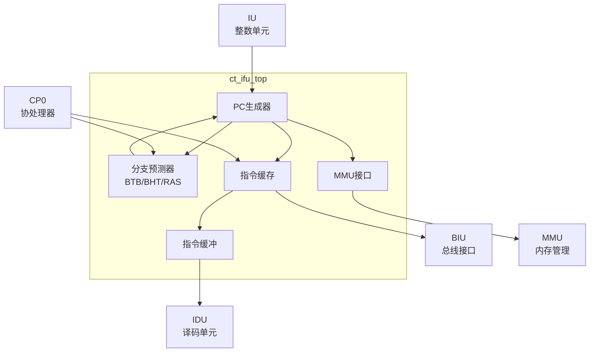

# ct_ifu_top 模块方案文档

## 1. 模块概述

### 1.1 模块简介

ct_ifu_top 是 OpenC910 处理器的取指单元（Instruction Fetch Unit）顶层模块，负责从指令缓存或外部存储器获取指令，并将指令传递给译码单元。该模块实现了指令预取、分支预测、指令缓存管理等功能。

### 1.2 主要特性

- 支持 RISC-V 指令集架构
- 实现指令缓存（ICache）
- 支持分支预测（BTB/BHT/RAS）
- 支持指令预取
- 支持虚拟地址到物理地址转换
- 支持调试模式下的指令获取

### 1.3 模块层次

- **层次级别**: Level 2
- **父模块**: ct_core
- **子模块**: 包含取指、分支预测、ICache等子模块

## 2. 模块接口说明

### 2.1 时钟与复位接口

| 信号名 | 方向 | 位宽 | 描述 |
|--------|------|------|------|
| forever_cpuclk | input | 1 | 永久CPU时钟 |
| cpurst_b | input | 1 | 核心复位信号，低有效 |

### 2.2 指令输出接口（到IDU）

| 信号名 | 方向 | 位宽 | 描述 |
|--------|------|------|------|
| ifu_idu_ib_inst0_data | output | 32 | 指令0数据 |
| ifu_idu_ib_inst0_vld | output | 1 | 指令0有效 |
| ifu_idu_ib_inst1_data | output | 32 | 指令1数据 |
| ifu_idu_ib_inst1_vld | output | 1 | 指令1有效 |
| ifu_idu_ib_inst2_data | output | 32 | 指令2数据 |
| ifu_idu_ib_inst2_vld | output | 1 | 指令2有效 |

### 2.3 总线接口（到BIU）

| 信号名 | 方向 | 位宽 | 描述 |
|--------|------|------|------|
| ifu_biu_rd_req | output | 1 | 取指读请求 |
| ifu_biu_rd_addr | output | 40 | 取指地址 |
| biu_ifu_rd_data | input | 128 | 读数据 |
| biu_ifu_rd_data_vld | input | 1 | 读数据有效 |
| biu_ifu_rd_grnt | input | 1 | 读请求授权 |

### 2.4 MMU接口

| 信号名 | 方向 | 位宽 | 描述 |
|--------|------|------|------|
| ifu_mmu_va | output | 40 | 虚拟地址 |
| ifu_mmu_va_vld | output | 1 | 虚拟地址有效 |
| mmu_ifu_pa | input | 28 | 物理地址 |
| mmu_ifu_pavld | input | 1 | 物理地址有效 |
| mmu_ifu_pgflt | input | 1 | 页错误 |

### 2.5 分支预测接口

| 信号名 | 方向 | 位宽 | 描述 |
|--------|------|------|------|
| iu_ifu_chgflw_vld | input | 1 | 控制流改变有效 |
| iu_ifu_chgflw_pc | input | 63 | 新PC值 |
| iu_ifu_mispred_stall | input | 1 | 误预测停顿 |

### 2.6 CP0配置接口

| 信号名 | 方向 | 位宽 | 描述 |
|--------|------|------|------|
| cp0_ifu_icache_en | input | 1 | ICache使能 |
| cp0_ifu_btb_en | input | 1 | BTB使能 |
| cp0_ifu_bht_en | input | 1 | BHT使能 |
| cp0_ifu_ras_en | input | 1 | RAS使能 |

## 3. 模块框图

## 4. 模块实现方案

### 4.1 总体架构

ct_ifu_top 采用多级流水取指架构：

1. **PC生成器**: 产生取指地址，支持顺序递增和分支跳转
2. **分支预测器**: 预测分支方向和目标地址
3. **指令缓存**: 缓存已取指令，减少总线访问
4. **指令缓冲**: 缓冲取回的指令，支持多指令发射

### 4.2 分支预测机制

采用多级分支预测：

- **BTB（Branch Target Buffer）**: 存储分支目标地址
- **BHT（Branch History Table）**: 预测条件分支方向
- **RAS（Return Address Stack）**: 预测函数返回地址

### 4.3 指令缓存设计

ICache 特性：
- 容量可配置
- 支持虚拟索引物理标签（VIPT）
- 支持缓存失效和无效化操作
- 支持预取

### 4.4 多指令发射

支持每周期发射多条指令：
- 最多支持3条指令并行发射
- 支持压缩指令（C扩展）对齐处理
- 支持跨缓存行取指

## 5. 内部关键信号列表

| 信号名 | 位宽 | 类型 | 描述 |
|--------|------|------|------|
| cur_pc | 39 | wire | 当前PC |
| next_pc | 39 | wire | 下一PC |
| bht_pred | 1 | wire | BHT预测结果 |
| btb_hit | 1 | wire | BTB命中 |
| icache_miss | 1 | wire | ICache缺失 |
| ib_full | 1 | wire | 指令缓冲满 |

## 6. 子模块方案

### 6.1 PC生成器

**功能描述**: 生成取指地址，处理控制流改变。

**设计要点**:
- 支持顺序PC递增
- 支持分支跳转
- 支持异常向量跳转
- 支持调试模式PC加载

### 6.2 分支预测器

**功能描述**: 预测分支行为，减少流水线停顿。

**设计要点**:
- BTB存储分支目标
- BHT使用2位饱和计数器
- RAS支持函数调用/返回预测

### 6.3 指令缓存

**功能描述**: 缓存指令数据，加速取指。

**设计要点**:
- 组相联结构
- 支持读/无效化操作
- 支持奇偶校验

### 6.4 指令缓冲

**功能描述**: 缓冲取回的指令，支持多发射。

**设计要点**:
- FIFO结构
- 支持压缩指令对齐
- 支持部分有效

## 7. 修订历史

| 版本 | 日期 | 作者 | 描述 |
|------|------|------|------|
| 1.0 | 2024-01 | OpenC910 Team | 初始版本 |
