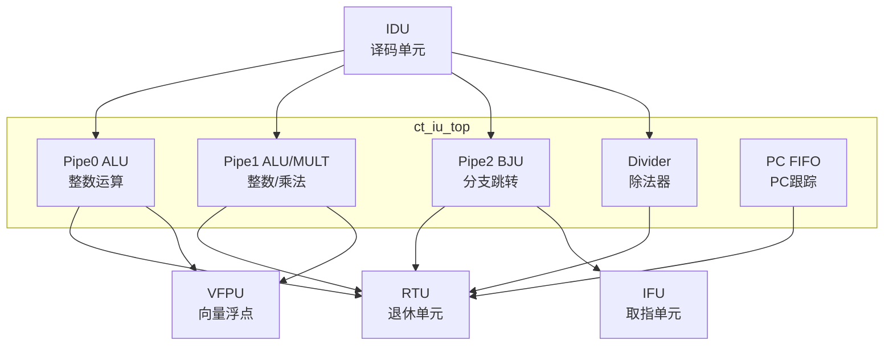

# ct_iu_top 模块方案文档

## 1. 模块概述

### 1.1 模块简介

ct_iu_top 是 OpenC910 处理器的整数单元（Integer Unit）顶层模块，负责执行整数运算、分支处理、乘除法运算等操作。该模块实现了双ALU流水线、乘法器、除法器和分支处理单元。

### 1.2 主要特性

- 支持双ALU并行执行
- 实现硬件乘法器
- 实现硬件除法器
- 支持分支执行和预测验证
- 支持向量配置指令（VSETVLI）

### 1.3 模块层次

- **层次级别**: Level 2
- **父模块**: ct_core
- **子模块**: 包含ALU、乘法器、除法器、分支单元等

## 2. 模块接口说明

### 2.1 时钟与复位接口

| 信号名 | 方向 | 位宽 | 描述 |
|--------|------|------|------|
| forever_cpuclk | input | 1 | 永久CPU时钟 |
| cpurst_b | input | 1 | 核心复位信号，低有效 |

### 2.2 IDU发射接口

| 信号名 | 方向 | 位宽 | 描述 |
|--------|------|------|------|
| idu_iu_rf_pipe0_sel | input | 1 | Pipe0选择 |
| idu_iu_rf_pipe0_func | input | 32 | Pipe0功能码 |
| idu_iu_rf_pipe0_src0 | input | 64 | Pipe0源操作数0 |
| idu_iu_rf_pipe0_src1 | input | 64 | Pipe0源操作数1 |
| idu_iu_rf_pipe0_imm | input | 64 | Pipe0立即数 |
| idu_iu_rf_pipe1_sel | input | 1 | Pipe1选择 |
| idu_iu_rf_pipe1_func | input | 32 | Pipe1功能码 |

### 2.3 RTU写回接口

| 信号名 | 方向 | 位宽 | 描述 |
|--------|------|------|------|
| iu_rtu_pipe0_cmplt | output | 1 | Pipe0完成 |
| iu_rtu_pipe0_iid | output | 7 | Pipe0指令ID |
| iu_rtu_ex2_pipe0_wb_preg_vld | output | 1 | Pipe0写回有效 |
| iu_rtu_ex2_pipe0_wb_preg | output | 7 | Pipe0写回物理寄存器 |
| iu_rtu_ex2_pipe0_wb_preg_data | output | 64 | Pipe0写回数据 |

### 2.4 分支接口

| 信号名 | 方向 | 位宽 | 描述 |
|--------|------|------|------|
| iu_ifu_chgflw_vld | output | 1 | 控制流改变有效 |
| iu_ifu_chgflw_pc | output | 63 | 新PC值 |
| iu_ifu_mispred_stall | output | 1 | 误预测停顿 |
| iu_rtu_pipe2_bht_mispred | output | 1 | BHT误预测 |
| iu_rtu_pipe2_jmp_mispred | output | 1 | 跳转误预测 |

### 2.5 IDU转发接口

| 信号名 | 方向 | 位宽 | 描述 |
|--------|------|------|------|
| iu_idu_ex1_pipe0_fwd_preg_vld | output | 1 | Pipe0转发有效 |
| iu_idu_ex1_pipe0_fwd_preg | output | 7 | Pipe0转发物理寄存器 |
| iu_idu_ex1_pipe0_fwd_preg_data | output | 64 | Pipe0转发数据 |

## 3. 模块框图

## 4. 模块实现方案

### 4.1 总体架构

ct_iu_top 采用多流水线并行执行架构：

1. **Pipe0 ALU**: 主整数ALU，执行加减、逻辑、移位等操作
2. **Pipe1 ALU/MULT**: 辅助ALU和乘法器，执行整数乘法
3. **Pipe2 BJU**: 分支跳转单元，执行分支和跳转指令
4. **Divider**: 除法器，执行整数除法

### 4.2 ALU设计

ALU 支持的操作：
- 加减法运算
- 逻辑运算（AND/OR/XOR）
- 移位操作
- 比较操作
- 条件移动

### 4.3 乘法器设计

乘法器特性：
- 支持有符号/无符号乘法
- 支持乘累加（MUL/MULH/MULHSU/MULHU）
- 多周期流水线实现

### 4.4 除法器设计

除法器特性：
- 支持有符号/无符号除法
- 支持取余运算
- 迭代除法算法
- 可中断执行

### 4.5 分支处理

分支单元功能：
- 执行分支指令
- 验证分支预测
- 计算分支目标
- 更新分支预测器

## 5. 内部关键信号列表

| 信号名 | 位宽 | 类型 | 描述 |
|--------|------|------|------|
| pipe0_alu_result | 64 | wire | Pipe0 ALU结果 |
| pipe1_mult_result | 64 | wire | Pipe1 乘法结果 |
| div_result | 64 | wire | 除法结果 |
| branch_taken | 1 | wire | 分支 Taken |
| mispred_detected | 1 | wire | 检测到误预测 |

## 6. 子模块方案

### 6.1 ALU

**功能描述**: 执行整数算术和逻辑运算。

**设计要点**:
- 支持所有RISC-V整数操作
- 单周期执行
- 支持条件码生成

### 6.2 乘法器

**功能描述**: 执行整数乘法运算。

**设计要点**:
- 高性能乘法器设计
- 支持部分积压缩
- 多周期流水线

### 6.3 除法器

**功能描述**: 执行整数除法运算。

**设计要点**:
- 迭代除法算法
- 支持提前终止
- 处理除零异常

### 6.4 分支单元

**功能描述**: 执行分支和跳转指令。

**设计要点**:
- 计算分支目标
- 验证分支预测
- 更新预测器状态

## 7. 修订历史

| 版本 | 日期 | 作者 | 描述 |
|------|------|------|------|
| 1.0 | 2024-01 | OpenC910 Team | 初始版本 |
