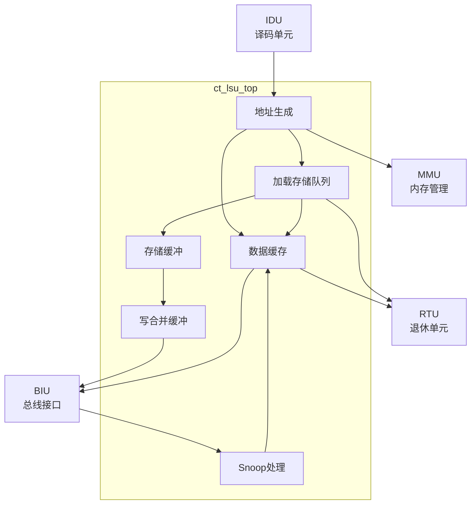

# ct_lsu_top 模块方案文档

## 1. 模块概述

### 1.1 模块简介

ct_lsu_top 是 OpenC910 处理器的访存单元（Load Store Unit）顶层模块，负责执行所有内存访问操作，包括加载、存储、缓存管理、原子操作等。该模块实现了数据缓存、存储缓冲、地址计算和内存一致性维护等功能。

### 1.2 主要特性

- 支持数据缓存（DCache）
- 实现存储缓冲（Store Buffer）
- 支持加载存储队列（LSQ）
- 支持原子操作（AMO）
- 支持向量访存
- 支持缓存一致性协议（ACE）

### 1.3 模块层次

- **层次级别**: Level 2
- **父模块**: ct_core
- **子模块**: 包含DCache、LSQ、Store Buffer等

## 2. 模块接口说明

### 2.1 时钟与复位接口

| 信号名 | 方向 | 位宽 | 描述 |
|--------|------|------|------|
| forever_cpuclk | input | 1 | 永久CPU时钟 |
| cpurst_b | input | 1 | 核心复位信号，低有效 |

### 2.2 IDU发射接口

| 信号名 | 方向 | 位宽 | 描述 |
|--------|------|------|------|
| idu_lsu_rf_pipe3_sel | input | 1 | Pipe3选择（加载） |
| idu_lsu_rf_pipe3_inst_type | input | 4 | 指令类型 |
| idu_lsu_rf_pipe3_offset | input | 12 | 地址偏移 |
| idu_lsu_rf_pipe3_src0 | input | 64 | 基地址 |
| idu_lsu_rf_pipe3_src1 | input | 64 | 索引 |
| idu_lsu_rf_pipe4_sel | input | 1 | Pipe4选择（存储） |
| idu_lsu_rf_pipe4_inst_str | input | 1 | 存储标志 |

### 2.3 BIU总线接口

| 信号名 | 方向 | 位宽 | 描述 |
|--------|------|------|------|
| lsu_biu_ar_req | output | 1 | 读地址请求 |
| lsu_biu_ar_addr | output | 40 | 读地址 |
| biu_lsu_r_data | input | 128 | 读数据 |
| lsu_biu_aw_st_req | output | 1 | 写地址请求 |
| lsu_biu_aw_st_addr | output | 40 | 写地址 |
| lsu_biu_w_st_data | output | 128 | 写数据 |

### 2.4 Snoop接口

| 信号名 | 方向 | 位宽 | 描述 |
|--------|------|------|------|
| biu_lsu_ac_req | input | 1 | Snoop请求 |
| biu_lsu_ac_addr | input | 40 | Snoop地址 |
| lsu_biu_ac_ready | output | 1 | Snoop就绪 |
| lsu_biu_cd_data | output | 128 | Snoop数据 |

### 2.5 RTU写回接口

| 信号名 | 方向 | 位宽 | 描述 |
|--------|------|------|------|
| lsu_rtu_wb_pipe3_cmplt | output | 1 | Pipe3完成 |
| lsu_rtu_wb_pipe3_iid | output | 7 | Pipe3指令ID |
| lsu_rtu_wb_pipe3_wb_preg_vld | output | 1 | 写回有效 |

### 2.6 MMU接口

| 信号名 | 方向 | 位宽 | 描述 |
|--------|------|------|------|
| lsu_mmu_va | output | 40 | 虚拟地址 |
| mmu_lsu_pa | input | 28 | 物理地址 |
| mmu_lsu_pgflt | input | 1 | 页错误 |

## 3. 模块框图

## 4. 模块实现方案

### 4.1 总体架构

ct_lsu_top 采用多级缓冲架构：

1. **地址生成（AG）**: 计算内存访问地址
2. **数据缓存（DCache）**: 缓存数据，加速访问
3. **加载存储队列（LSQ）**: 管理待完成的访存操作
4. **存储缓冲（SB）**: 缓存存储数据
5. **写合并缓冲（WMB）**: 合并连续写操作
6. **Snoop处理**: 处理缓存一致性请求

### 4.2 数据缓存设计

DCache 特性：
- 组相联结构
- 支持读写操作
- 支持缓存无效化
- 支持预取

### 4.3 加载存储队列

LSQ 功能：
- 跟踪待完成的加载和存储
- 检测存储-加载冲突
- 支持乱序完成
- 支持指令取消

### 4.4 存储缓冲

存储缓冲功能：
- 缓存存储数据和地址
- 支持存储转发
- 支持存储合并
- 支持顺序写回

### 4.5 缓存一致性

支持 ACE 协议：
- 处理 Snoop 请求
- 维护缓存行状态
- 支持缓存行回写
- 支持缓存行无效化

## 5. 内部关键信号列表

| 信号名 | 位宽 | 类型 | 描述 |
|--------|------|------|------|
| ag_addr | 40 | wire | 生成的地址 |
| dcache_hit | 1 | wire | DCache命中 |
| lsq_full | 1 | wire | LSQ满 |
| sb_empty | 1 | wire | 存储缓冲空 |
| snoop_vld | 1 | wire | Snoop有效 |

## 6. 子模块方案

### 6.1 地址生成器

**功能描述**: 计算内存访问地址。

**设计要点**:
- 支持多种寻址模式
- 支持地址对齐检查
- 支持边界检查

### 6.2 数据缓存

**功能描述**: 缓存数据，加速访存。

**设计要点**:
- 组相联结构
- 支持读写操作
- 支持替换策略

### 6.3 加载存储队列

**功能描述**: 管理待完成的访存操作。

**设计要点**:
- 支持乱序执行
- 支持依赖检测
- 支持指令取消

### 6.4 存储缓冲

**功能描述**: 缓存存储操作。

**设计要点**:
- 支持存储转发
- 支持存储合并
- 支持顺序提交

## 7. 修订历史

| 版本 | 日期 | 作者 | 描述 |
|------|------|------|------|
| 1.0 | 2024-01 | OpenC910 Team | 初始版本 |
