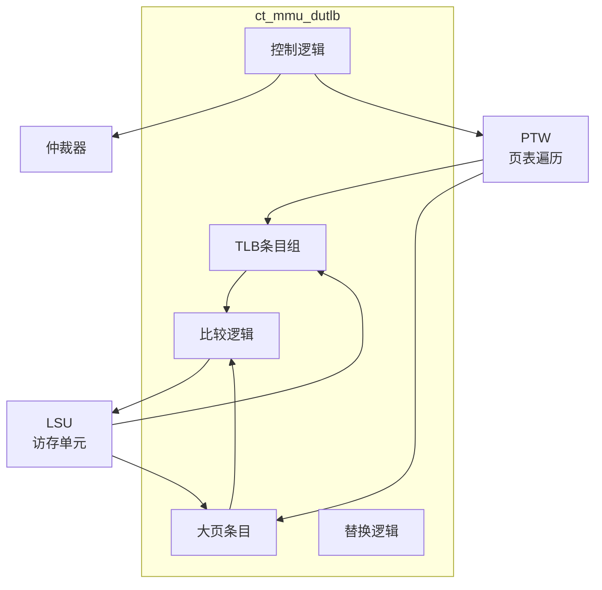

# ct_mmu_dutlb 模块方案文档

## 1. 模块概述

### 1.1 模块简介

ct_mmu_dutlb 是 OpenC910 处理器的数据 TLB（Data Translation Lookaside Buffer）模块，负责缓存数据访问的虚拟地址到物理地址的转换结果。该模块支持加载和存储操作的地址转换。

### 1.2 主要特性

- 支持虚拟地址到物理地址的快速转换
- 支持加载和存储操作
- 支持大页（Huge Page）
- 支持TLB失效和无效化

### 1.3 模块层次

- **层次级别**: Level 2
- **父模块**: ct_mmu_top
- **子模块**: TLB条目、替换逻辑、大页支持

## 2. 模块接口说明

### 2.1 时钟与复位接口

| 信号名 | 方向 | 位宽 | 描述 |
|--------|------|------|------|
| forever_cpuclk | input | 1 | 永久CPU时钟 |
| cpurst_b | input | 1 | 核心复位信号 |

### 2.2 LSU接口

| 信号名 | 方向 | 位宽 | 描述 |
|--------|------|------|------|
| lsu_mmu_va0 | input | 40 | 虚拟地址0 |
| lsu_mmu_va0_vld | input | 1 | 虚拟地址0有效 |
| mmu_lsu_pa0 | output | 28 | 物理地址0 |
| mmu_lsu_pa0_vld | output | 1 | 物理地址0有效 |
| mmu_lsu_page_fault0 | output | 1 | 页错误0 |

### 2.3 仲裁器接口

| 信号名 | 方向 | 位宽 | 描述 |
|--------|------|------|------|
| dutlb_arb_req | output | 1 | TLB请求 |
| dutlb_arb_vpn | output | 27 | 虚拟页号 |
| dutlb_arb_load | output | 1 | 加载操作 |
| arb_dutlb_grant | input | 1 | 仲裁授权 |

### 2.4 PTW接口

| 信号名 | 方向 | 位宽 | 描述 |
|--------|------|------|------|
| dutlb_ptw_wfc | output | 1 | 等待PTW完成 |
| ptw_dutlb_fill | input | 1 | TLB填充 |

## 3. 模块框图

## 4. 模块实现方案

### 4.1 TLB结构

DUTLB 采用两级结构：
- 常规页TLB条目
- 大页TLB条目
- 支持并行查找

### 4.2 大页支持

支持的大页类型：
- 2MB大页
- 1GB大页
- 独立的大页条目

### 4.3 权限检查

检查的权限：
- 读权限（R）
- 写权限（W）
- 执行权限（X）
- 用户/超级用户权限

## 5. 内部关键信号列表

| 信号名 | 位宽 | 类型 | 描述 |
|--------|------|------|------|
| tlb_hit | 1 | wire | TLB命中 |
| huge_hit | 1 | wire | 大页命中 |
| tlb_miss | 1 | wire | TLB缺失 |
| vpn | 27 | wire | 虚拟页号 |
| pfn | 28 | wire | 物理帧号 |

## 6. 子模块方案

### 6.1 TLB条目

**功能描述**: 存储常规页地址转换信息。

**设计要点**:
- 支持4KB页
- 支持权限检查
- 支持脏位管理

### 6.2 大页条目

**功能描述**: 存储大页地址转换信息。

**设计要点**:
- 支持2MB/1GB页
- 支持权限检查
- 支持脏位管理

## 7. 修订历史

| 版本 | 日期 | 作者 | 描述 |
|------|------|------|------|
| 1.0 | 2024-01 | OpenC910 Team | 初始版本 |
