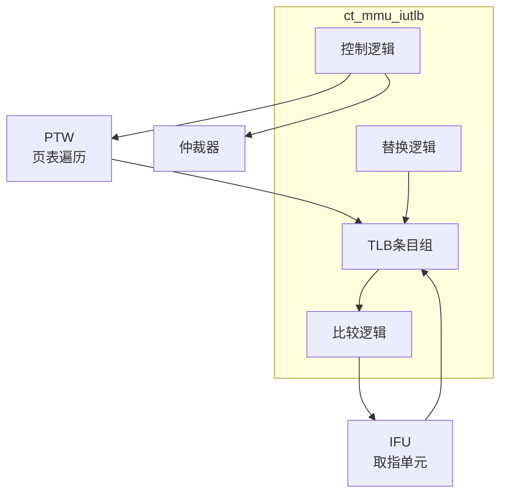

# ct_mmu_iutlb 模块方案文档

## 1. 模块概述

### 1.1 模块简介

ct_mmu_iutlb 是 OpenC910 处理器的指令 TLB（Instruction Translation Lookaside Buffer）模块，负责缓存指令取指的虚拟地址到物理地址的转换结果。该模块实现了快速地址转换，加速指令取指过程。

### 1.2 主要特性

- 支持虚拟地址到物理地址的快速转换
- 实现TLB条目管理
- 支持TLB失效和无效化
- 支持多级页表结构

### 1.3 模块层次

- **层次级别**: Level 2
- **父模块**: ct_mmu_top
- **子模块**: TLB条目、替换逻辑

## 2. 模块接口说明

### 2.1 时钟与复位接口

| 信号名 | 方向 | 位宽 | 描述 |
|--------|------|------|------|
| forever_cpuclk | input | 1 | 永久CPU时钟 |
| cpurst_b | input | 1 | 核心复位信号 |

### 2.2 IFU接口

| 信号名 | 方向 | 位宽 | 描述 |
|--------|------|------|------|
| ifu_mmu_va | input | 40 | 虚拟地址 |
| ifu_mmu_va_vld | input | 1 | 虚拟地址有效 |
| mmu_ifu_pa | output | 28 | 物理地址 |
| mmu_ifu_pavld | output | 1 | 物理地址有效 |
| mmu_ifu_pgflt | output | 1 | 页错误 |

### 2.3 仲裁器接口

| 信号名 | 方向 | 位宽 | 描述 |
|--------|------|------|------|
| iutlb_arb_req | output | 1 | TLB请求 |
| iutlb_arb_vpn | output | 27 | 虚拟页号 |
| iutlb_arb_cmplt | output | 1 | 转换完成 |
| arb_iutlb_grant | input | 1 | 仲裁授权 |

### 2.4 PTW接口

| 信号名 | 方向 | 位宽 | 描述 |
|--------|------|------|------|
| iutlb_ptw_wfc | output | 1 | 等待PTW完成 |
| ptw_iutlb_fill | input | 1 | TLB填充 |

## 3. 模块框图

## 4. 模块实现方案

### 4.1 TLB结构

IUTLB 采用全相联结构：
- 多个TLB条目并行比较
- 支持快速命中检测
- 支持LRU替换策略

### 4.2 地址转换流程

1. 接收虚拟地址
2. 并行比较所有TLB条目
3. 命中时返回物理地址
4. 缺失时请求JTLB或PTW

### 4.3 TLB条目格式

每个TLB条目包含：
- VPN（虚拟页号）
- PFN（物理帧号）
- 权限位（R/W/X）
- 用户/超级用户位
- 全局位
- ASID（地址空间ID）

## 5. 内部关键信号列表

| 信号名 | 位宽 | 类型 | 描述 |
|--------|------|------|------|
| tlb_hit | 1 | wire | TLB命中 |
| tlb_miss | 1 | wire | TLB缺失 |
| vpn | 27 | wire | 虚拟页号 |
| pfn | 28 | wire | 物理帧号 |
| entry_vld | 1 | wire | 条目有效 |

## 6. 子模块方案

### 6.1 TLB条目

**功能描述**: 存储地址转换信息。

**设计要点**:
- 支持快速比较
- 支持权限检查
- 支持ASID匹配

### 6.2 替换逻辑

**功能描述**: 管理TLB条目替换。

**设计要点**:
- LRU替换算法
- 支持锁定条目
- 支持手动无效化

## 7. 修订历史

| 版本 | 日期 | 作者 | 描述 |
|------|------|------|------|
| 1.0 | 2024-01 | OpenC910 Team | 初始版本 |
