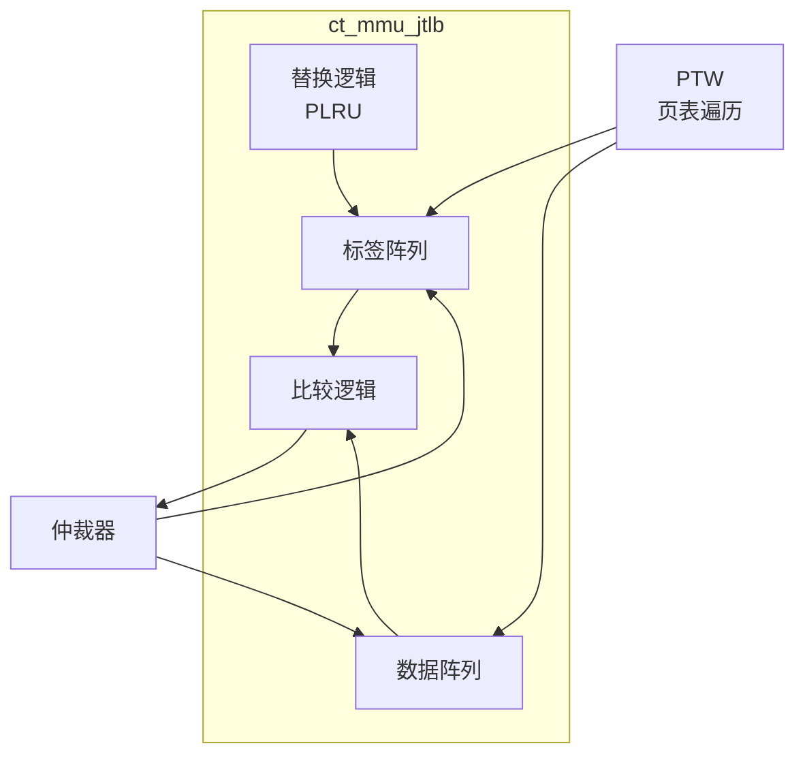

# ct_mmu_jtlb 模块方案文档

## 1. 模块概述

### 1.1 模块简介

ct_mmu_jtlb 是 OpenC910 处理器的联合 TLB（Joint Translation Lookaside Buffer）模块，是一个大容量的TLB，用于缓存大量的虚拟地址到物理地址的转换结果。当IUTLB或DUTLB缺失时，会查找JTLB。

### 1.2 主要特性

- 大容量TLB
- 支持多路组相联
- 支持多种页大小
- 支持ASID

### 1.3 模块层次

- **层次级别**: Level 2
- **父模块**: ct_mmu_top
- **子模块**: 标签阵列、数据阵列、替换逻辑

## 2. 模块接口说明

### 2.1 时钟与复位接口

| 信号名 | 方向 | 位宽 | 描述 |
|--------|------|------|------|
| forever_cpuclk | input | 1 | 永久CPU时钟 |
| cpurst_b | input | 1 | 核心复位信号 |

### 2.2 仲裁器接口

| 信号名 | 方向 | 位宽 | 描述 |
|--------|------|------|------|
| arb_jtlb_req | input | 1 | JTLB请求 |
| arb_jtlb_vpn | input | 27 | 虚拟页号 |
| arb_jtlb_idx | input | 9 | 索引 |
| jtlb_arb_hit | output | 1 | JTLB命中 |
| jtlb_arb_pfn | output | 28 | 物理帧号 |

### 2.3 PTW接口

| 信号名 | 方向 | 位宽 | 描述 |
|--------|------|------|------|
| arb_jtlb_write | input | 1 | JTLB写请求 |
| arb_jtlb_tag_din | input | 48 | 标签数据 |
| arb_jtlb_data_din | input | 42 | 数据 |

## 3. 模块框图

## 4. 模块实现方案

### 4.1 JTLB结构

JTLB 采用组相联结构：
- 多路组相联
- 索引由虚拟地址低位决定
- 支持伪LRU替换

### 4.2 标签阵列

标签阵列存储：
- VPN（虚拟页号）
- ASID（地址空间ID）
- 有效位
- 全局位

### 4.3 数据阵列

数据阵列存储：
- PFN（物理帧号）
- 权限位
- 脏位
- 访问位

### 4.4 替换策略

采用伪LRU（PLRU）替换策略：
- 每组维护替换状态
- 支持锁定条目
- 支持手动无效化

## 5. 内部关键信号列表

| 信号名 | 位宽 | 类型 | 描述 |
|--------|------|------|------|
| jtlb_hit | 1 | wire | JTLB命中 |
| jtlb_miss | 1 | wire | JTLB缺失 |
| way_sel | 4 | wire | 命中路选择 |
| pfn | 28 | wire | 物理帧号 |
| permission | 4 | wire | 权限位 |

## 6. 子模块方案

### 6.1 标签阵列

**功能描述**: 存储TLB标签信息。

**设计要点**:
- 支持快速比较
- 支持ASID匹配
- 支持奇偶校验

### 6.2 数据阵列

**功能描述**: 存储TLB数据信息。

**设计要点**:
- 支持快速读取
- 支持权限检查
- 支持脏位更新

### 6.3 替换逻辑

**功能描述**: 管理TLB条目替换。

**设计要点**:
- PLRU算法
- 支持锁定
- 支持无效化

## 7. 修订历史

| 版本 | 日期 | 作者 | 描述 |
|------|------|------|------|
| 1.0 | 2024-01 | OpenC910 Team | 初始版本 |
