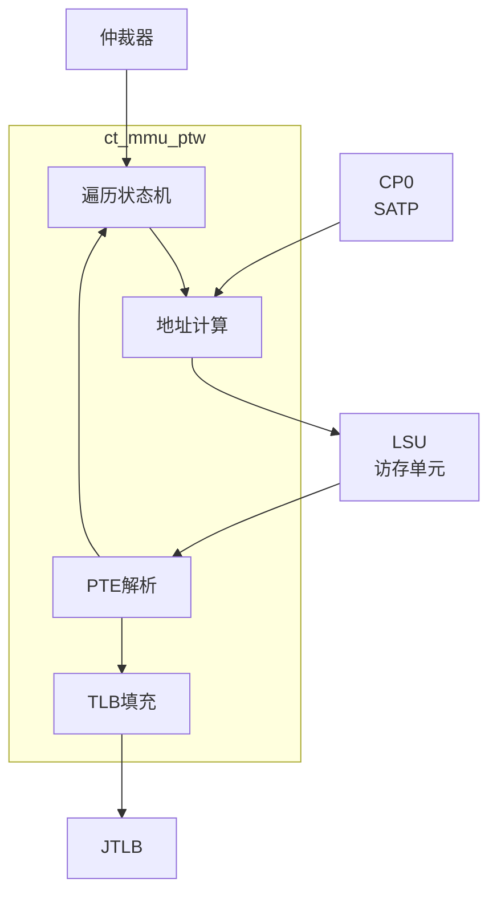

# ct_mmu_ptw 模块方案文档

## 1. 模块概述

### 1.1 模块简介

ct_mmu_ptw 是 OpenC910 处理器的页表遍历（Page Table Walker）模块，负责在TLB缺失时遍历内存中的页表，获取虚拟地址到物理地址的转换信息，并填充TLB。

### 1.2 主要特性

- 支持多级页表遍历
- 支持Sv39/Sv48虚拟内存模式
- 支持大页检测
- 支持页错误检测

### 1.3 模块层次

- **层次级别**: Level 2
- **父模块**: ct_mmu_top
- **子模块**: 页表遍历状态机、地址计算

## 2. 模块接口说明

### 2.1 时钟与复位接口

| 信号名 | 方向 | 位宽 | 描述 |
|--------|------|------|------|
| forever_cpuclk | input | 1 | 永久CPU时钟 |
| cpurst_b | input | 1 | 核心复位信号 |

### 2.2 仲裁器接口

| 信号名 | 方向 | 位宽 | 描述 |
|--------|------|------|------|
| arb_ptw_grant | input | 1 | 仲裁授权 |
| ptw_arb_req | output | 1 | PTW请求 |
| ptw_arb_vpn | output | 27 | 虚拟页号 |

### 2.3 LSU接口

| 信号名 | 方向 | 位宽 | 描述 |
|--------|------|------|------|
| mmu_lsu_data_req | output | 1 | 数据请求 |
| mmu_lsu_data_req_addr | output | 40 | 请求地址 |
| lsu_mmu_data | input | 64 | 页表数据 |
| lsu_mmu_data_vld | input | 1 | 数据有效 |

### 2.4 TLB填充接口

| 信号名 | 方向 | 位宽 | 描述 |
|--------|------|------|------|
| ptw_jtlb_fill | output | 1 | JTLB填充 |
| ptw_jtlb_tag | output | 48 | 标签数据 |
| ptw_jtlb_data | output | 42 | 数据 |

## 3. 模块框图

## 4. 模块实现方案

### 4.1 页表遍历流程

Sv39页表遍历流程：
1. 读取页全局目录（PGD）项
2. 读取页上级目录（PUD）项
3. 读取页中间目录（PMD）项
4. 读取页表（PT）项
5. 获取物理帧号

### 4.2 状态机设计

PTW状态机状态：
- IDLE: 空闲状态
- WALK: 遍历状态
- FILL: 填充状态
- ERROR: 错误状态

### 4.3 PTE解析

解析页表项（PTE）：
- 有效位（V）
- 读写执行权限（R/W/X）
- 用户位（U）
- 全局位（G）
- 访问位（A）
- 脏位（D）
- 物理帧号（PFN）

### 4.4 大页检测

检测大页：
- 在任意级别检测到大页标志
- 提前终止遍历
- 填充相应的TLB

## 5. 内部关键信号列表

| 信号名 | 位宽 | 类型 | 描述 |
|--------|------|------|------|
| ptw_state | 3 | reg | PTW状态 |
| walk_level | 2 | reg | 遍历级别 |
| pte_data | 64 | wire | PTE数据 |
| pfn | 28 | wire | 物理帧号 |
| page_fault | 1 | wire | 页错误 |

## 6. 子模块方案

### 6.1 遍历状态机

**功能描述**: 控制页表遍历流程。

**设计要点**:
- 支持多级遍历
- 支持大页检测
- 支持错误处理

### 6.2 地址计算

**功能描述**: 计算下一级页表地址。

**设计要点**:
- 提取VPN各字段
- 计算页表基址
- 支持SATP配置

### 6.3 PTE解析

**功能描述**: 解析页表项内容。

**设计要点**:
- 提取PFN
- 检查权限
- 检测大页

## 7. 修订历史

| 版本 | 日期 | 作者 | 描述 |
|------|------|------|------|
| 1.0 | 2024-01 | OpenC910 Team | 初始版本 |
