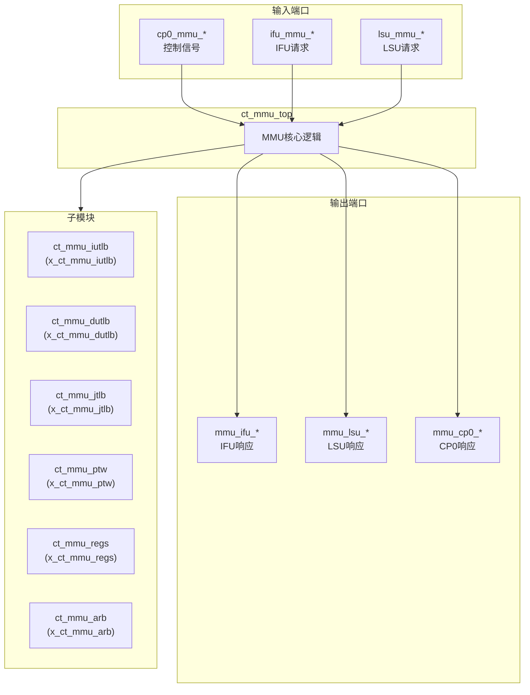
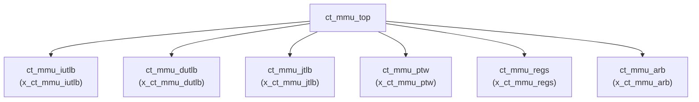

# ct_mmu_top 模块设计文档

## 1. 模块概述

### 1.1 基本信息

| 属性 | 值 |
|------|-----|
| 模块名称 | ct_mmu_top |
| 文件路径 | C910_RTL_FACTORY/gen_rtl/mmu/rtl/ct_mmu_top.v |
| 层级 | Level 1 |

### 1.2 功能描述

ct_mmu_top 是 OpenC910 处理器的内存管理单元(MMU)，负责虚拟地址到物理地址的转换。该模块实现了 RISC-V Sv39/Sv48 虚拟内存管理规范，支持分页机制和地址保护。

主要功能包括：
- 虚拟地址到物理地址转换
- TLB (Translation Lookaside Buffer) 管理
- 页表遍历 (Page Table Walk)
- 访问权限检查
- 地址空间隔离

### 1.3 设计特点

- 支持 Sv39/Sv48 虚拟地址模式
- 多级 TLB 架构 (IUTLB, DUTLB, JTLB)
- 硬件页表遍历
- 支持 ASID 地址空间标识
- 支持多种 TLB 操作指令

## 2. 模块接口说明

### 2.1 输入端口

| 信号名 | 方向 | 位宽 | 描述 |
|--------|------|------|------|
| biu_mmu_smp_disable | input | 1 | SMP禁用信号 |
| cp0_mmu_cskyee | input | 1 | CSKY扩展使能 |
| cp0_mmu_icg_en | input | 1 | 时钟门控使能 |
| cp0_mmu_maee | input | 1 | MAEE使能 |
| cp0_mmu_mpp | input | 2 | 权限模式 |
| cp0_mmu_mprv | input | 1 | 权限修改使能 |
| cp0_mmu_mxr | input | 1 | MXR标志 |
| cp0_mmu_no_op_req | input | 1 | 无操作请求 |
| cp0_mmu_ptw_en | input | 1 | PTW使能 |
| cp0_mmu_reg_num | input | 2 | 寄存器号 |
| cp0_mmu_satp_sel | input | 1 | SATP选择 |
| cp0_mmu_sum | input | 1 | SUM标志 |
| cp0_mmu_tlb_all_inv | input | 1 | TLB全失效 |
| cp0_mmu_wdata | input | 64 | 写数据 |
| cp0_mmu_wreg | input | 1 | 写寄存器使能 |
| cp0_yy_priv_mode | input | 2 | 特权模式 |
| cpurst_b | input | 1 | 复位信号 |
| forever_cpuclk | input | 1 | 核心时钟 |
| hpcp_mmu_cnt_en | input | 1 | 性能计数器使能 |
| ifu_mmu_abort | input | 1 | IFU中止信号 |
| ifu_mmu_va | input | 63 | IFU虚拟地址 |
| ifu_mmu_va_vld | input | 1 | IFU VA有效 |
| lsu_mmu_abort0 | input | 1 | LSU中止0 |
| lsu_mmu_abort1 | input | 1 | LSU中止1 |
| lsu_mmu_bus_error | input | 1 | 总线错误 |
| lsu_mmu_data | input | 64 | LSU数据 |
| lsu_mmu_data_vld | input | 1 | LSU数据有效 |
| lsu_mmu_id0 | input | 7 | LSU ID0 |
| lsu_mmu_id1 | input | 7 | LSU ID1 |
| lsu_mmu_st_inst0 | input | 1 | 存储指令0 |
| lsu_mmu_st_inst1 | input | 1 | 存储指令1 |
| lsu_mmu_stamo_pa | input | 28 | 原子操作物理地址 |
| lsu_mmu_stamo_vld | input | 1 | 原子操作有效 |
| lsu_mmu_tlb_all_inv | input | 1 | LSU TLB全失效 |
| lsu_mmu_tlb_asid | input | 16 | TLB ASID |
| lsu_mmu_tlb_asid_all_inv | input | 1 | ASID全失效 |
| lsu_mmu_tlb_va | input | 27 | TLB虚拟地址 |
| lsu_mmu_tlb_va_all_inv | input | 1 | VA全失效 |
| lsu_mmu_tlb_va_asid_inv | input | 1 | VA ASID失效 |
| lsu_mmu_va0 | input | 64 | LSU虚拟地址0 |
| lsu_mmu_va0_vld | input | 1 | VA0有效 |
| lsu_mmu_va1 | input | 64 | LSU虚拟地址1 |
| lsu_mmu_va1_vld | input | 1 | VA1有效 |
| lsu_mmu_va2 | input | 28 | LSU虚拟地址2 |
| lsu_mmu_va2_vld | input | 1 | VA2有效 |
| lsu_mmu_vabuf0 | input | 28 | VA缓冲0 |
| lsu_mmu_vabuf1 | input | 28 | VA缓冲1 |
| pad_yy_icg_scan_en | input | 1 | ICG扫描使能 |
| pmp_mmu_flg0 | input | 4 | PMP标志0 |
| pmp_mmu_flg1 | input | 4 | PMP标志1 |
| pmp_mmu_flg2 | input | 4 | PMP标志2 |
| pmp_mmu_flg3 | input | 4 | PMP标志3 |
| pmp_mmu_flg4 | input | 4 | PMP标志4 |
| rtu_mmu_bad_vpn | input | 27 | 错误VPN |
| rtu_mmu_expt_vld | input | 1 | 异常有效 |
| rtu_yy_xx_flush | input | 1 | 刷新信号 |

### 2.2 输出端口

| 信号名 | 方向 | 位宽 | 描述 |
|--------|------|------|------|
| mmu_cp0_cmplt | output | 1 | CP0访问完成 |
| mmu_cp0_data | output | 64 | CP0数据 |
| mmu_cp0_satp_data | output | 64 | SATP数据 |
| mmu_cp0_tlb_done | output | 1 | TLB操作完成 |
| mmu_had_debug_info | output | 34 | 调试信息 |
| mmu_hpcp_dutlb_miss | output | 1 | DUTLB缺失 |
| mmu_hpcp_iutlb_miss | output | 1 | IUTLB缺失 |
| mmu_hpcp_jtlb_miss | output | 1 | JTLB缺失 |
| mmu_ifu_buf | output | 1 | IFU缓冲属性 |
| mmu_ifu_ca | output | 1 | IFU缓存属性 |
| mmu_ifu_deny | output | 1 | IFU拒绝 |
| mmu_ifu_pa | output | 28 | IFU物理地址 |
| mmu_ifu_pavld | output | 1 | IFU PA有效 |
| mmu_ifu_pgflt | output | 1 | IFU页错误 |
| mmu_ifu_sec | output | 1 | IFU安全属性 |
| mmu_lsu_access_fault0 | output | 1 | LSU访问错误0 |
| mmu_lsu_access_fault1 | output | 1 | LSU访问错误1 |
| mmu_lsu_buf0 | output | 1 | LSU缓冲属性0 |
| mmu_lsu_buf1 | output | 1 | LSU缓冲属性1 |
| mmu_lsu_ca0 | output | 1 | LSU缓存属性0 |
| mmu_lsu_ca1 | output | 1 | LSU缓存属性1 |
| mmu_lsu_data_req | output | 1 | 数据请求 |
| mmu_lsu_data_req_addr | output | 40 | 数据请求地址 |
| mmu_lsu_data_req_size | output | 1 | 数据请求大小 |
| mmu_lsu_mmu_en | output | 1 | MMU使能 |
| mmu_lsu_pa0 | output | 28 | LSU物理地址0 |
| mmu_lsu_pa0_vld | output | 1 | PA0有效 |
| mmu_lsu_pa1 | output | 28 | LSU物理地址1 |
| mmu_lsu_pa1_vld | output | 1 | PA1有效 |
| mmu_lsu_pa2 | output | 28 | LSU物理地址2 |
| mmu_lsu_pa2_err | output | 1 | PA2错误 |
| mmu_lsu_pa2_vld | output | 1 | PA2有效 |
| mmu_lsu_page_fault0 | output | 1 | LSU页错误0 |
| mmu_lsu_page_fault1 | output | 1 | LSU页错误1 |
| mmu_lsu_sec0 | output | 1 | LSU安全属性0 |
| mmu_lsu_sec1 | output | 1 | LSU安全属性1 |
| mmu_lsu_sec2 | output | 1 | LSU安全属性2 |
| mmu_lsu_sh0 | output | 1 | LSU共享属性0 |
| mmu_lsu_sh1 | output | 1 | LSU共享属性1 |
| mmu_lsu_share2 | output | 1 | LSU共享属性2 |
| mmu_lsu_so0 | output | 1 | LSU强序属性0 |
| mmu_lsu_so1 | output | 1 | LSU强序属性1 |
| mmu_lsu_stall0 | output | 1 | LSU暂停0 |
| mmu_lsu_stall1 | output | 1 | LSU暂停1 |
| mmu_lsu_tlb_busy | output | 1 | TLB忙 |
| mmu_lsu_tlb_inv_done | output | 1 | TLB失效完成 |
| mmu_lsu_tlb_wakeup | output | 12 | TLB唤醒 |
| mmu_pmp_fetch3 | output | 1 | PMP取指3 |
| mmu_pmp_pa0 | output | 28 | PMP物理地址0 |
| mmu_pmp_pa1 | output | 28 | PMP物理地址1 |
| mmu_pmp_pa2 | output | 28 | PMP物理地址2 |
| mmu_pmp_pa3 | output | 28 | PMP物理地址3 |
| mmu_pmp_pa4 | output | 28 | PMP物理地址4 |
| mmu_xx_mmu_en | output | 1 | MMU使能 |
| mmu_yy_xx_no_op | output | 1 | 无操作标志 |

## 3. 模块框图

### 3.1 模块架构图



### 3.2 主要数据连线

| 源模块 | 目标模块 | 信号名 | 位宽 | 说明 |
|--------|----------|--------|------|------|
| ct_mmu_top | ct_mmu_iutlb | ifu_mmu_va | 63 | IFU虚拟地址 |
| ct_mmu_top | ct_mmu_dutlb | lsu_mmu_va0 | 64 | LSU虚拟地址0 |
| ct_mmu_top | ct_mmu_jtlb | tlb_entry | 128 | TLB表项 |
| ct_mmu_top | ct_mmu_ptw | ptw_req | 1 | PTW请求 |
| ct_mmu_top | ct_mmu_regs | cp0_mmu_wdata | 64 | CP0写数据 |

## 4. 模块实现方案

### 4.1 关键逻辑描述

MMU 采用多级 TLB 架构：

1. **IUTLB**：指令 TLB，专门处理取指请求
2. **DUTLB**：数据 TLB，专门处理访存请求
3. **JTLB**：联合 TLB，作为二级 TLB

### 4.2 地址转换流程

```
虚拟地址 -> TLB查找 -> 命中? -> 物理地址
                |
                v 未命中
           JTLB查找 -> 命中? -> 物理地址
                |
                v 未命中
           PTW -> 页表遍历 -> 更新TLB -> 重试
```

### 4.3 TLB 表项格式

| 位域 | 名称 | 描述 |
|------|------|------|
| [63:0] | PPN | 物理页号 |
| [67:64] | RSW | 保留位 |
| [69:68] | D | 脏位 |
| [70] | A | 访问位 |
| [72:71] | G | 全局位 |
| [87:73] | ASID | 地址空间ID |
| [88] | V | 有效位 |

## 5. 内部关键信号列表

### 5.1 寄存器信号

无寄存器信号。

### 5.2 线网信号

| 信号名 | 位宽 | 描述 |
|--------|------|------|
| mmu_cp0_cmplt | 1 | CP0访问完成 |
| mmu_cp0_data | 64 | CP0数据 |
| mmu_cp0_satp_data | 64 | SATP数据 |
| mmu_cp0_tlb_done | 1 | TLB操作完成 |
| mmu_had_debug_info | 34 | 调试信息 |
| mmu_hpcp_dutlb_miss | 1 | DUTLB缺失 |
| mmu_hpcp_iutlb_miss | 1 | IUTLB缺失 |
| mmu_hpcp_jtlb_miss | 1 | JTLB缺失 |
| mmu_ifu_buf | 1 | IFU缓冲属性 |
| mmu_ifu_ca | 1 | IFU缓存属性 |
| mmu_ifu_deny | 1 | IFU拒绝 |
| mmu_ifu_pa | 28 | IFU物理地址 |
| mmu_ifu_pavld | 1 | IFU PA有效 |
| mmu_ifu_pgflt | 1 | IFU页错误 |
| mmu_ifu_sec | 1 | IFU安全属性 |
| mmu_xx_mmu_en | 1 | MMU使能 |

## 6. 子模块方案

### 6.1 模块例化层次结构



### 6.2 子模块列表

| 层级 | 模块名 | 实例名 | 功能描述 |
|------|--------|--------|----------|
| 2 | ct_mmu_iutlb | x_ct_mmu_iutlb | 指令TLB，处理取指地址转换 |
| 2 | ct_mmu_dutlb | x_ct_mmu_dutlb | 数据TLB，处理访存地址转换 |
| 2 | ct_mmu_jtlb | x_ct_mmu_jtlb | 联合TLB，二级TLB |
| 2 | ct_mmu_ptw | x_ct_mmu_ptw | 页表遍历器 |
| 2 | ct_mmu_regs | x_ct_mmu_regs | MMU寄存器 |
| 2 | ct_mmu_arb | x_ct_mmu_arb | 仲裁器 |

### 6.3 子模块功能说明

#### ct_mmu_iutlb
指令TLB，专门处理取指请求的地址转换。特点：
- 小容量快速TLB
- 支持只读访问
- 与JTLB协同工作

#### ct_mmu_dutlb
数据TLB，专门处理访存请求的地址转换。特点：
- 支持读写访问
- 支持脏位管理
- 与JTLB协同工作

#### ct_mmu_jtlb
联合TLB，作为二级TLB。特点：
- 大容量TLB
- 支持多种页面大小
- 支持ASID管理

#### ct_mmu_ptw
页表遍历器，负责在TLB缺失时遍历页表。特点：
- 支持多级页表
- 支持Sv39/Sv48模式
- 自动更新TLB

#### ct_mmu_regs
MMU寄存器模块，管理MMU相关CSR。特点：
- SATP寄存器管理
- 页表基地址管理
- ASID管理

#### ct_mmu_arb
仲裁器，协调多个TLB请求。特点：
- IFU/LSU请求仲裁
- PTW请求管理
- 优先级处理

## 7. 修订历史

| 版本 | 日期 | 作者 | 说明 |
|------|------|------|------|
| 1.0 | 2026-03-12 | Auto-generated | 初始版本 |
