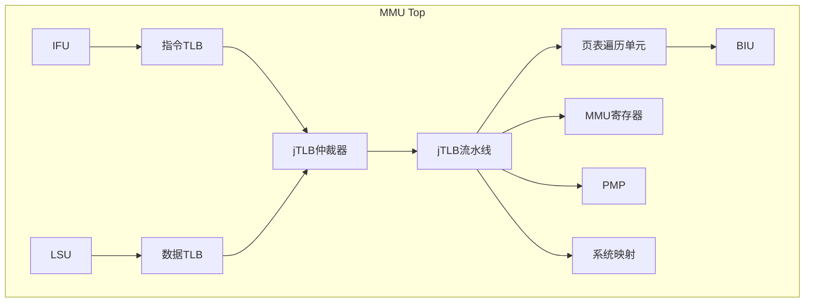

# OpenC910 MMU模块方案文档

## 文档信息

| 项目 | 内容 |
|------|------|
| 模块名称 | ct_mmu_top |
| 版本 | 1.0 |
| 作者 | OpenC910 Team |
| 日期 | 2024 |

---

## 1. 模块概述

### 1.1 功能简介

ct_mmu_top是OpenC910处理器的内存管理单元(Memory Management Unit, MMU)模块，负责实现RISC-V架构的虚拟内存管理机制。该模块支持Sv39和Sv48虚拟地址格式，能够将虚拟地址转换为物理地址，并提供访问权限检查和异常检测功能。

MMU是处理器核与外部内存系统之间的关键接口模块，承担着地址转换、内存保护、系统性能优化等重要职责。

### 1.2 主要功能

| 功能 | 描述 |
|------|------|
| 虚拟地址转换 | 将虚拟地址(VA)转换为物理地址(PA) |
| TLB管理 | TLB(TLB)缓存管理和一致性维护 |
| 页表遍历 | 硬件支持的页表遍历(PTW) |
| 访问控制 | 基于satp寄存器的权限检查 |
| 异常处理 | 缺页异常、访问权限异常检测 |
| TLB操作 | 支持TLBR/TLBWI/TLBWR/TLBP/TLBI指令 |

### 1.3 技术指标

| 指标 | 规格 |
|------|------|
| 虚拟地址宽度 | 39位(Sv39) / 48位(Sv48) |
| 物理地址宽度 | 40位 (最大支持1TB物理内存) |
| 页面大小 | 4KB, 2MB, 1GB |
| 指令TLB条目数 | 16/32/64条 (可配置) |
| 数据TLB条目数 | 16/32/64条 (可配置) |
| jTLB条目数 | 256/512条 (可配置) |
| 支持的特权模式 | M/S/U Mode |

---

## 2. 系统架构

### 2.1 整体架构图



### 2.2 子模块列表

| 模块名称 | 功能描述 |
|----------|----------|
| ct_mmu_iutlb | 指令TLB，缓存指令访问的地址转换结果 |
| ct_mmu_dutlb | 数据TLB，缓存数据访问的地址转换结果 |
| ct_mmu_regs | MMU相关控制寄存器管理 |
| ct_mmu_tlboper | TLB操作指令处理模块 |
| ct_mmu_arb | jTLB请求仲裁器 |
| ct_mmu_jtlb | jTLB联合TLB流水线处理 |
| ct_mmu_ptw | 页表遍历单元 |
| ct_mmu_sysmap | 系统地址映射缓存(4个实例) |

### 2.3 数据流

```
1. 指令访问地址转换:
   IFU -> ifu_mmu_va -> IUTLB -> (命中) -> mmu_ifu_pa
                     -> (未命中) -> ARB -> JTLB -> (命中) -> 返回结果
                                              -> (未命中) -> PTW -> 访问内存 -> 返回结果

2. 数据访问地址转换:
   LSU -> lsu_mmu_va -> DUTLB -> (命中) -> mmu_lsu_pa
                   -> (未命中) -> ARB -> JTLB -> (命中) -> 返回结果
                                         -> (未命中) -> PTW -> 访问内存 -> 返回结果

3. TLB操作:
   CP0 -> tlboper模块 -> TLB维护操作 -> JTLB -> 更新TLB
```

---

## 3. 接口定义

### 3.1 时钟和复位

| 信号名 | 方向 | 描述 |
|--------|------|------|
| forever_cpuclk | Input | CPU时钟输入 |
| cpurst_b | Input | 全局异步复位，低电平有效 |
| pad_yy_icg_scan_en | Input | 时钟门控扫描使能 |

### 3.2 CP0控制接口

| 信号名 | 方向 | 位宽 | 描述 |
|--------|------|------|------|
| cp0_mmu_cskyee | Input | 1 | C-Sky EE使能位 |
| cp0_mmu_icg_en | Input | 1 | MMU时钟门控使能 |
| cp0_mmu_mxr | Input | 1 | MXR(可执行读取)位 |
| cp0_mmu_sum | Input | 1 | SUM(可访问用户内存)位 |
| cp0_mmu_mprv | Input | 1 | MPRV(修改特权级)位 |
| cp0_mmu_mpp | Input | 2 | 机器模式先前的特权级 |
| cp0_mmu_ptw_en | Input | 1 | 页表遍历使能 |
| cp0_mmu_satp_sel | Input | 1 | SATP寄存器选择 |
| cp0_mmu_reg_num | Input | 2 | CP0寄存器编号 |
| cp0_mmu_wreg | Input | 1 | CP0写寄存器信号 |
| cp0_mmu_wdata | Input | 64 | CP0写数据 |
| cp0_mmu_tlb_all_inv | Input | 1 | TLB全局无效信号 |
| cp0_yy_priv_mode | Input | 2 | 当前特权级 |

### 3.3 IFU接口

| 信号名 | 方向 | 描述 |
|--------|------|------|
| ifu_mmu_va[62:0] | Input | 指令虚拟地址 |
| ifu_mmu_va_vld | Input | 虚拟地址有效 |
| ifu_mmu_abort | Input | 取指中止信号 |
| mmu_ifu_pa[27:0] | Output | 物理地址 |
| mmu_ifu_pavld | Output | 物理地址有效 |
| mmu_ifu_pgflt | Output | 页错误标志 |
| mmu_ifu_ca | Output | 缓存属性 |
| mmu_ifu_sec | Output | 安全状态 |
| mmu_ifu_deny | Output | 访问拒绝 |
| mmu_ifu_buf | Output | 缓冲使能 |

### 3.4 LSU接口

| 信号名 | 方向 | 描述 |
|--------|------|------|
| lsu_mmu_va0[63:0] | Input | 数据虚拟地址0 |
| lsu_mmu_va0_vld | Input | VA0有效 |
| lsu_mmu_va1[63:0] | Input | 数据虚拟地址1 |
| lsu_mmu_va1_vld | Input | VA1有效 |
| lsu_mmu_va2[27:0] | Input | 数据虚拟地址2 |
| lsu_mmu_va2_vld | Input | VA2有效 |
| lsu_mmu_st_inst0 | Input | 存储指令0 |
| lsu_mmu_st_inst1 | Input | 存储指令1 |
| lsu_mmu_abort0 | Input | 数据访问中止0 |
| lsu_mmu_abort1 | Input | 数据访问中止1 |
| lsu_mmu_bus_error | Input | 总线错误 |
| lsu_mmu_data[63:0] | Input | 内存返回数据 |
| lsu_mmu_data_vld | Input | 数据有效 |
| mmu_lsu_pa0[27:0] | Output | 物理地址0 |
| mmu_lsu_pa0_vld | Output | PA0有效 |
| mmu_lsu_pa1[27:0] | Output | 物理地址1 |
| mmu_lsu_pa1_vld | Output | PA1有效 |
| mmu_lsu_pa2[27:0] | Output | 物理地址2 |
| mmu_lsu_pa2_vld | Output | PA2有效 |
| mmu_lsu_pa2_err | Output | PA2错误 |
| mmu_lsu_page_fault0 | Output | 页错误0 |
| mmu_lsu_page_fault1 | Output | 页错误1 |
| mmu_lsu_access_fault0 | Output | 访问错误0 |
| mmu_lsu_access_fault1 | Output | 访问错误1 |
| mmu_lsu_stall0 | Output | LSU停顿0 |
| mmu_lsu_stall1 | Output | LSU停顿1 |

### 3.5 PMP接口

| 信号名 | 方向 | 描述 |
|--------|------|------|
| pmp_mmu_flg0[3:0] | Input | PMP标志0 |
| pmp_mmu_flg1[3:0] | Input | PMP标志1 |
| pmp_mmu_flg2[3:0] | Input | PMP标志2 |
| pmp_mmu_flg3[3:0] | Input | PMP标志3 |
| pmp_mmu_flg4[3:0] | Input | PMP标志4 |
| mmu_pmp_pa0[27:0] | Output | PMP物理地址0 |
| mmu_pmp_pa1[27:0] | Output | PMP物理地址1 |
| mmu_pmp_pa2[27:0] | Output | PMP物理地址2 |
| mmu_pmp_pa3[27:0] | Output | PMP物理地址3 |
| mmu_pmp_pa4[27:0] | Output | PMP物理地址4 |
| mmu_pmp_fetch3 | Output | 取指PMP检查完成 |

### 3.6 CP0返回接口

| 信号名 | 方向 | 描述 |
|--------|------|------|
| mmu_cp0_cmplt | Output | CP0操作完成 |
| mmu_cp0_data[63:0] | Output | CP0返回数据 |
| mmu_cp0_satp_data[63:0] | Output | SATP寄存器数据 |
| mmu_cp0_tlb_done | Output | TLB操作完成 |

### 3.7 性能和调试接口

| 信号名 | 方向 | 描述 |
|--------|------|------|
| hpcp_mmu_cnt_en | Input | 性能计数使能 |
| mmu_hpcp_iutlb_miss | Output | IUTLB未命中计数 |
| mmu_hpcp_dutlb_miss | Output | DUTLB未命中计数 |
| mmu_hpcp_jtlb_miss | Output | JTLB未命中计数 |
| mmu_had_debug_info[33:0] | Output | 调试信息 |

---

## 4. 功能描述

### 4.1 地址转换机制

#### 4.1.1 Sv39虚拟地址格式

```
63                30 29            21 20           12 11             0
+------------------+----------------+----------------+----------------+
|     VPN[2]       |    VPN[1]      |    VPN[0]      |    Offset     |
|    [31:21]       |   [20:12]      |   [11:3]       |    [2:0]      |
+------------------+----------------+----------------+----------------+
```

#### 4.1.2 地址转换流程

1. **TLB查找**: 首先在IUTLB/DUTLB中查找虚拟地址对应的物理地址
2. **jTLB查找**: TLB未命中时，在jTLB中查找
3. **页表遍历**: jTLB未命中时，PTW模块执行页表遍历
4. **结果返回**: 将转换结果返回给请求单元，并更新TLB缓存

### 4.2 TLB结构

#### 4.2.1 IUTLB/DUTLB

- 采用直接映射或组相联结构
- 存储最近使用的地址转换条目
- 支持4KB、2MB、1GB页面大小

#### 4.2.2 jTLB (联合TLB)

- 更大容量的后备TLB
- 被IUTLB和DUTLB共享使用
- 采用多路组相联结构

### 4.3 页表遍历(PTW)

当TLB未命中时，PTW模块执行以下操作：

1. 构造页表基地址
2. 访问多级页表
3. 获取页表项(PTE)
4. 验证访问权限
5. 返回物理地址
6. 更新TLB

### 4.4 TLB操作指令

| 指令 | 功能 |
|------|------|
| TLBR | 读TLB条目到寄存器 |
| TLBWI | 写索引TLB |
| TLBWR | 写随机TLB |
| TLBP | 查询TLB条目索引 |
| TLBI | TLB无效操作 |

### 4.5 系统映射(Sysmap)

系统映射模块提供快速访问特殊地址区域的机制：

- 用于访问外设寄存器
- 提供固定映射(identity mapping)
- 减少TLB压力

---

## 5. 实现方案

### 5.1 时钟门控

MMU模块采用细粒度时钟门控策略：

```verilog
assign utlb_clk_en = regs_utlb_clr
                  || tlboper_utlb_clr
                  || tlboper_utlb_inv_va_req
                  || !regs_mmu_en
                  || jtlb_top_utlb_pavld
                  || dutlb_top_scd_updt
                  || iutlb_top_scd_updt;
```

### 5.2 状态机设计

#### jTLB状态机

| 状态 | 描述 |
|------|------|
| IDLE | 空闲状态 |
| COMPARE | 地址比较状态 |
| REFILL | TLB重填状态 |
| WRITE | TLB写入状态 |

#### PTW状态机

| 状态 | 描述 |
|------|------|
| IDLE | 空闲状态 |
| PTE_FETCH | 页表项获取状态 |
| PTE_CHECK | 页表项检查状态 |
| DONE | 完成状态 |

### 5.3 异常检测

| 异常类型 | 触发条件 |
|----------|----------|
| TLB未命中 | 虚拟地址在TLB中不存在 |
| 页错误 | 页表项无效位为0 |
| 访问权限错误 | 违反了页表项中的权限位 |
| 地址错误 | 虚拟地址格式错误 |

---

## 6. 测试策略

### 6.1 功能验证

- 基本地址转换测试
- 页面大小切换测试
- 特权级切换测试
- TLB一致性测试
- 异常触发测试

### 6.2 边界条件

- 最大虚拟地址边界测试
- 跨页边界访问测试
- 并发TLB操作测试

### 6.3 性能测试

- TLB命中率测试
- PTW延迟测试
- 时钟门控效率测试

---

## 7. 附录

### 7.1 寄存器映射

| 地址 | 寄存器 | 描述 |
|------|--------|------|
| 0x180 | satp | 地址转换和保护寄存器 |
| 0x181 | mstatus | 机器状态寄存器 |
| 0x182 | mcause | 机器异常原因寄存器 |

### 7.2 页面大小编码

| 编码 | 页面大小 |
|------|----------|
| 0 | 4KB |
| 1 | 2MB |
| 2 | 1GB |

### 7.3 术语表

| 术语 | 全称 | 描述 |
|------|------|------|
| MMU | Memory Management Unit | 内存管理单元 |
| TLB | Translation Lookaside Buffer | 旁路转换缓冲 |
| VA | Virtual Address | 虚拟地址 |
| PA | Physical Address | 物理地址 |
| PTE | Page Table Entry | 页表项 |
| PTW | Page Table Walker | 页表遍历单元 |
| PMP | Physical Memory Protection | 物理内存保护 |
| VPN | Virtual Page Number | 虚拟页号 |
| PPN | Physical Page Number | 物理页号 |
