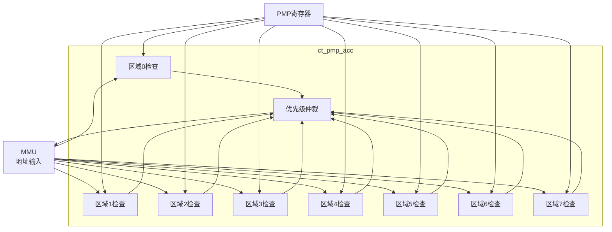

# ct_pmp_acc 模块方案文档

## 1. 模块概述

### 1.1 模块简介

ct_pmp_acc 是 OpenC910 处理器的 PMP 访问检查模块，负责检查内存访问请求是否符合 PMP 配置规则。该模块根据 PMP 寄存器的配置，判断访问是否被允许，并输出访问权限标志。

### 1.2 主要特性

- 支持多区域并行检查
- 支持多种寻址模式
- 支持特权级检查
- 支持锁定区域

### 1.3 模块层次

- **层次级别**: Level 2
- **父模块**: ct_pmp_top
- **子模块**: 无

## 2. 模块接口说明

### 2.1 时钟与复位接口

| 信号名 | 方向 | 位宽 | 描述 |
|--------|------|------|------|
| cpuclk | input | 1 | CPU时钟（用于时钟门控） |
| cpurst_b | input | 1 | 核心复位信号 |

### 2.2 地址输入接口

| 信号名 | 方向 | 位宽 | 描述 |
|--------|------|------|------|
| mmu_pmp_pa | input | 28 | 物理地址 |
| cp0_pmp_mpp | input | 2 | 之前的特权模式 |
| cur_priv_mode | input | 2 | 当前特权模式 |
| pmp_mprv_status | input | 1 | MPRV状态 |

### 2.3 PMP配置输入

| 信号名 | 方向 | 位宽 | 描述 |
|--------|------|------|------|
| pmpcfg0_value | input | 64 | PMP配置0 |
| pmpcfg2_value | input | 64 | PMP配置2 |
| pmpaddr0_value | input | 29 | PMP地址0 |
| pmpaddr1_value | input | 29 | PMP地址1 |
| ... | ... | ... | ... |

### 2.4 权限输出

| 信号名 | 方向 | 位宽 | 描述 |
|--------|------|------|------|
| pmp_mmu_flg | output | 4 | 访问权限标志 |

## 3. 模块框图

## 4. 模块实现方案

### 4.1 区域检查逻辑

每个PMP区域的检查：
1. 根据寻址模式计算区域范围
2. 检查地址是否在区域内
3. 检查访问权限
4. 检查特权级

### 4.2 寻址模式匹配

**TOR模式**:
- 地址 <= pmpaddr[i]
- 地址 > pmpaddr[i-1]

**NA4模式**:
- 地址在4字节对齐范围内

**NAPOT模式**:
- 地址在自然对齐幂次范围内

### 4.3 优先级仲裁

区域匹配优先级：
- 最高编号的匹配区域优先
- 锁定区域（L=1）优先级最高
- 无匹配时使用默认规则

### 4.4 权限标志

输出标志格式：
- [0]: 读权限
- [1]: 写权限
- [2]: 执行权限
- [3]: 访问允许

## 5. 内部关键信号列表

| 信号名 | 位宽 | 类型 | 描述 |
|--------|------|------|------|
| region_match | 8 | wire | 区域匹配向量 |
| region_perm | 32 | wire | 区域权限向量 |
| final_perm | 4 | wire | 最终权限 |
| addr_in_range | 1 | wire | 地址在范围内 |

## 6. 子模块方案

该模块为扁平化设计，无独立子模块。

## 7. 修订历史

| 版本 | 日期 | 作者 | 描述 |
|------|------|------|------|
| 1.0 | 2024-01 | OpenC910 Team | 初始版本 |
