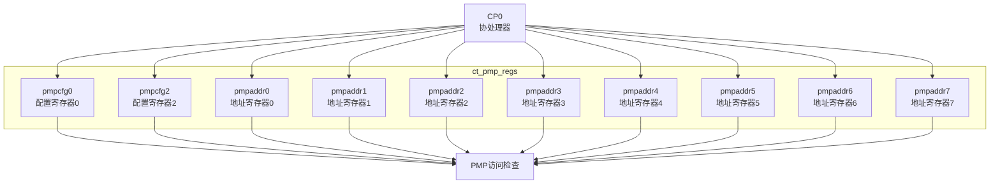

# ct_pmp_regs 模块方案文档

## 1. 模块概述

### 1.1 模块简介

ct_pmp_regs 是 OpenC910 处理器的 PMP 寄存器模块，负责存储和管理物理内存保护（Physical Memory Protection）配置寄存器。该模块实现了 RISC-V PMP 扩展中定义的配置寄存器和地址寄存器。

### 1.2 主要特性

- 支持8个PMP区域
- 实现pmpcfg和pmpaddr寄存器
- 支持多种寻址模式
- 支持特权级保护

### 1.3 模块层次

- **层次级别**: Level 2
- **父模块**: ct_pmp_top
- **子模块**: 无

## 2. 模块接口说明

### 2.1 时钟与复位接口

| 信号名 | 方向 | 位宽 | 描述 |
|--------|------|------|------|
| cpuclk | input | 1 | CPU时钟 |
| cpurst_b | input | 1 | 核心复位信号 |

### 2.2 CP0访问接口

| 信号名 | 方向 | 位宽 | 描述 |
|--------|------|------|------|
| cp0_pmp_wdata | input | 64 | 写数据 |
| pmp_csr_sel | input | 18 | CSR选择 |
| pmp_csr_wen | input | 18 | CSR写使能 |
| pmp_cp0_data | output | 64 | 读数据 |

### 2.3 PMP配置输出

| 信号名 | 方向 | 位宽 | 描述 |
|--------|------|------|------|
| pmpcfg0_value | output | 64 | PMP配置0 |
| pmpcfg2_value | output | 64 | PMP配置2 |
| pmpaddr0_value | output | 29 | PMP地址0 |
| pmpaddr1_value | output | 29 | PMP地址1 |
| pmpaddr2_value | output | 29 | PMP地址2 |
| ... | ... | ... | ... |

## 3. 模块框图

## 4. 模块实现方案

### 4.1 寄存器布局

PMP寄存器布局：
- pmpcfg0-pmpcfg1: 配置寄存器（每个8字节，包含8个区域配置）
- pmpaddr0-pmpaddr15: 地址寄存器（每个8字节）

### 4.2 配置寄存器格式

每个pmpcfg包含8个区域配置，每个区域配置8位：
- L: 锁定位
- [7:6]: 保留
- A[5:4]: 地址匹配模式
- X: 执行权限
- W: 写权限
- R: 读权限

### 4.3 地址寄存器格式

pmpaddr寄存器：
- 存储物理地址的高位
- 支持右移以支持不同粒度

### 4.4 寻址模式

支持的地址匹配模式：
- OFF (00): 禁用
- TOR (01): 顶部地址范围
- NA4 (10): 自然对齐4字节
- NAPOT (11): 自然对齐幂次

## 5. 内部关键信号列表

| 信号名 | 位宽 | 类型 | 描述 |
|--------|------|------|------|
| pmpcfg0_value | 64 | reg | 配置寄存器0 |
| pmpcfg2_value | 64 | reg | 配置寄存器2 |
| pmpaddr0_value | 29 | reg | 地址寄存器0 |
| pmpaddr1_value | 29 | reg | 地址寄存器1 |
| wr_pmp_regs | 1 | wire | 写寄存器使能 |

## 6. 子模块方案

该模块为扁平化设计，无独立子模块。

## 7. 修订历史

| 版本 | 日期 | 作者 | 描述 |
|------|------|------|------|
| 1.0 | 2024-01 | OpenC910 Team | 初始版本 |
