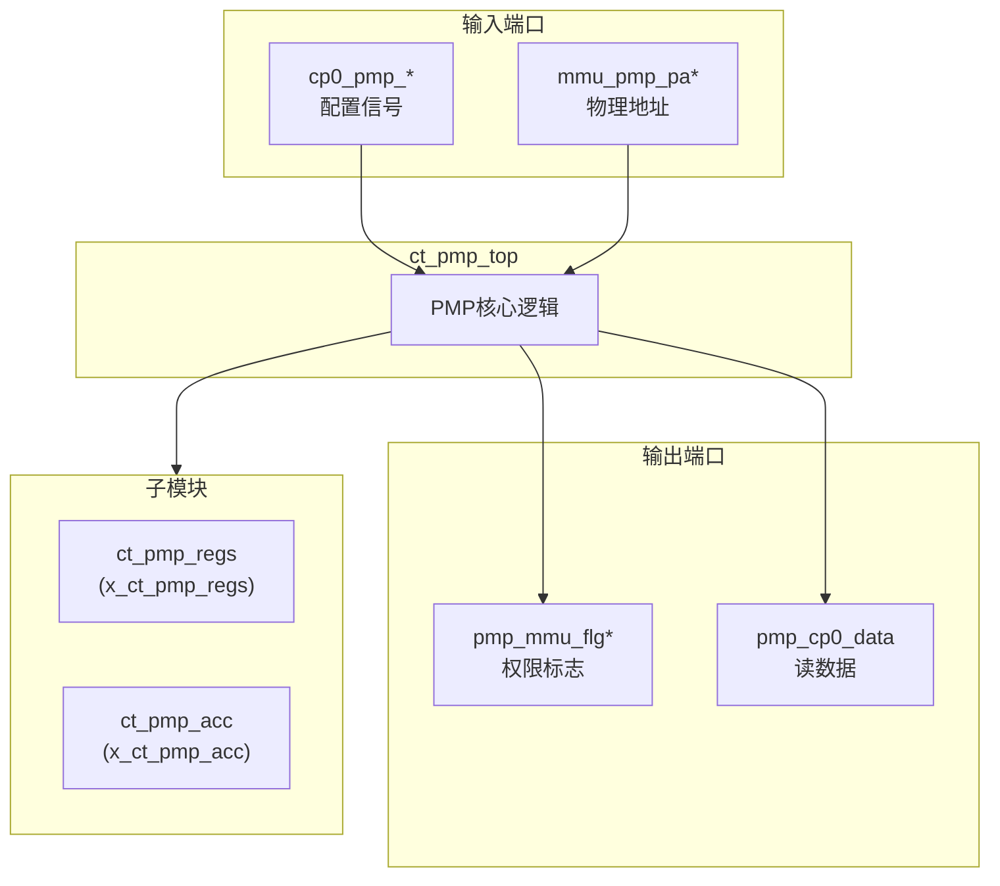
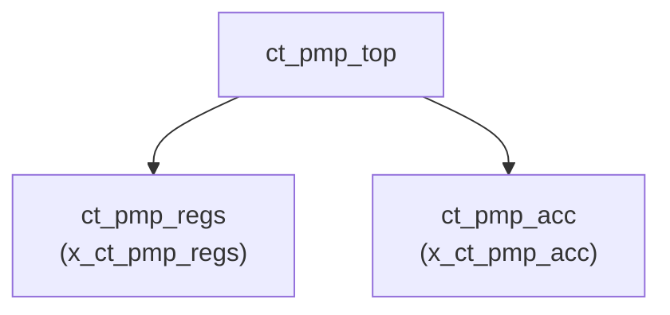

# ct_pmp_top 模块设计文档

## 1. 模块概述

### 1.1 基本信息

| 属性 | 值 |
|------|-----|
| 模块名称 | ct_pmp_top |
| 文件路径 | C910_RTL_FACTORY/gen_rtl/pmp/rtl/ct_pmp_top.v |
| 层级 | Level 1 |

### 1.2 功能描述

ct_pmp_top 是 OpenC910 处理器的物理内存保护单元(PMP)，负责实现物理内存区域的访问权限控制。该模块实现了 RISC-V PMP 规范，支持最多16个PMP区域的配置。

主要功能包括：
- 物理内存区域访问权限控制
- 支持多种访问模式 (R/W/X)
- 支持多种区域配置模式
- 与MMU协同工作

### 1.3 设计特点

- 支持16个PMP区域
- 支持NA4/NAPOT/TOR模式
- 支持M模式特权
- 支持锁定区域

## 2. 模块接口说明

### 2.1 输入端口

| 信号名 | 方向 | 位宽 | 描述 |
|--------|------|------|------|
| cp0_pmp_icg_en | input | 1 | 时钟门控使能 |
| cp0_pmp_mpp | input | 2 | 权限模式 |
| cp0_pmp_mprv | input | 1 | 权限修改使能 |
| cp0_pmp_reg_num | input | 5 | 寄存器号 |
| cp0_pmp_wdata | input | 64 | 写数据 |
| cp0_pmp_wreg | input | 1 | 写寄存器使能 |
| cp0_yy_priv_mode | input | 2 | 特权模式 |
| cpurst_b | input | 1 | 复位信号 |
| forever_cpuclk | input | 1 | 核心时钟 |
| mmu_pmp_fetch3 | input | 1 | 取指3标志 |
| mmu_pmp_pa0 | input | 28 | 物理地址0 |
| mmu_pmp_pa1 | input | 28 | 物理地址1 |
| mmu_pmp_pa2 | input | 28 | 物理地址2 |
| mmu_pmp_pa3 | input | 28 | 物理地址3 |
| mmu_pmp_pa4 | input | 28 | 物理地址4 |
| pad_yy_icg_scan_en | input | 1 | ICG扫描使能 |

### 2.2 输出端口

| 信号名 | 方向 | 位宽 | 描述 |
|--------|------|------|------|
| pmp_cp0_data | output | 64 | CP0读数据 |
| pmp_mmu_flg0 | output | 4 | PMP标志0 (R/W/X/L) |
| pmp_mmu_flg1 | output | 4 | PMP标志1 |
| pmp_mmu_flg2 | output | 4 | PMP标志2 |
| pmp_mmu_flg3 | output | 4 | PMP标志3 |
| pmp_mmu_flg4 | output | 4 | PMP标志4 |

## 3. 模块框图

### 3.1 模块架构图

### 3.2 主要数据连线

| 源模块 | 目标模块 | 信号名 | 位宽 | 说明 |
|--------|----------|--------|------|------|
| ct_pmp_top | ct_pmp_regs | cp0_pmp_wdata | 64 | 写数据 |
| ct_pmp_top | ct_pmp_acc | mmu_pmp_pa0 | 28 | 物理地址0 |
| ct_pmp_top | ct_pmp_acc | mmu_pmp_pa1 | 28 | 物理地址1 |
| ct_pmp_top | ct_pmp_acc | mmu_pmp_pa2 | 28 | 物理地址2 |

## 4. 模块实现方案

### 4.1 关键逻辑描述

PMP 模块实现物理内存保护：

1. **地址匹配**：检查访问地址是否在PMP区域内
2. **权限检查**：检查访问权限 (R/W/X)
3. **锁定检查**：检查区域是否被锁定

### 4.2 PMP 区域配置模式

| 模式 | 名称 | 描述 |
|------|------|------|
| NA4 | 自然对齐4字节 | 4字节自然对齐区域 |
| NAPOT | 自然对齐幂次 | 可变大小自然对齐区域 |
| TOR | 顶部地址 | 由当前和上一个地址定义的区域 |

### 4.3 权限标志

| 位 | 名称 | 描述 |
|----|------|------|
| 0 | R | 读权限 |
| 1 | W | 写权限 |
| 2 | X | 执行权限 |
| 3 | L | 锁定标志 |

## 5. 内部关键信号列表

### 5.1 寄存器信号

无寄存器信号。

### 5.2 线网信号

| 信号名 | 位宽 | 描述 |
|--------|------|------|
| cp0_pmp_addr | 12 | PMP地址 |
| pmp_csr_sel | 18 | CSR选择信号 |
| pmp_csr_wen | 18 | CSR写使能 |
| pmpaddr0_value | 29 | PMP地址0值 |
| pmpaddr1_value | 29 | PMP地址1值 |
| pmpaddr2_value | 29 | PMP地址2值 |
| pmpaddr3_value | 29 | PMP地址3值 |
| pmpaddr4_value | 29 | PMP地址4值 |
| pmpaddr5_value | 29 | PMP地址5值 |
| pmpaddr6_value | 29 | PMP地址6值 |
| pmpaddr7_value | 29 | PMP地址7值 |
| pmpcfg0_value | 64 | PMP配置0值 |
| pmpcfg2_value | 64 | PMP配置2值 |
| wr_pmp_regs | 1 | 写PMP寄存器 |
| cur_priv_mode | 2 | 当前特权模式 |
| pmp_mprv_status0 | 1 | MPRV状态0 |
| pmp_mprv_status1 | 1 | MPRV状态1 |
| pmp_mprv_status2 | 1 | MPRV状态2 |
| pmp_mprv_status3 | 1 | MPRV状态3 |
| pmp_mprv_status4 | 1 | MPRV状态4 |

## 6. 子模块方案

### 6.1 模块例化层次结构

### 6.2 子模块列表

| 层级 | 模块名 | 实例名 | 功能描述 |
|------|--------|--------|----------|
| 2 | ct_pmp_regs | x_ct_pmp_regs | PMP寄存器管理 |
| 2 | ct_pmp_acc | x_ct_pmp_acc | PMP访问检查 |

### 6.3 子模块功能说明

#### ct_pmp_regs
PMP寄存器管理模块，负责：
- pmpaddr0-15 寄存器管理
- pmpcfg0-3 寄存器管理
- CSR读写接口

#### ct_pmp_acc
PMP访问检查模块，负责：
- 地址匹配逻辑
- 权限检查逻辑
- 生成权限标志

## 7. 数据结构定义

### 7.1 CSR地址映射

| 寄存器 | 地址 | 描述 |
|--------|------|------|
| PMPCFG0 | 0x3A0 | PMP配置寄存器0 |
| PMPCFG2 | 0x3A2 | PMP配置寄存器2 |
| PMPADDR0 | 0x3B0 | PMP地址寄存器0 |
| PMPADDR1 | 0x3B1 | PMP地址寄存器1 |
| PMPADDR2 | 0x3B2 | PMP地址寄存器2 |
| PMPADDR3 | 0x3B3 | PMP地址寄存器3 |
| PMPADDR4 | 0x3B4 | PMP地址寄存器4 |
| PMPADDR5 | 0x3B5 | PMP地址寄存器5 |
| PMPADDR6 | 0x3B6 | PMP地址寄存器6 |
| PMPADDR7 | 0x3B7 | PMP地址寄存器7 |
| PMPADDR8-15 | 0x3B8-0x3BF | PMP地址寄存器8-15 |

## 8. 修订历史

| 版本 | 日期 | 作者 | 说明 |
|------|------|------|------|
| 1.0 | 2026-03-12 | Auto-generated | 初始版本 |
