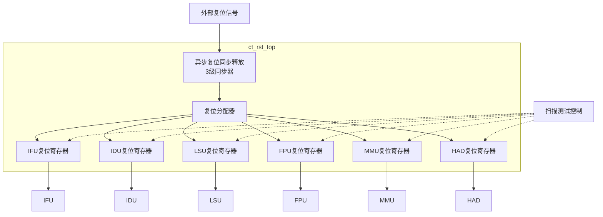

# ct_rst_top 模块方案文档

## 1. 模块概述

### 1.1 模块简介

ct_rst_top 是 OpenC910 处理器的复位控制顶层模块，负责处理器核心各模块的复位信号生成和管理。该模块实现了同步复位和异步复位的转换，支持扫描测试模式和 MBIST 模式下的复位控制。

### 1.2 主要特性

- 支持多级同步复位
- 支持异步复位同步释放
- 支持扫描测试模式
- 支持 MBIST 模式
- 为各模块生成独立复位信号

### 1.3 模块层次

- **层次级别**: Level 1
- **父模块**: ct_top
- **子模块**: 无（该模块为扁平化设计）

## 2. 模块接口说明

### 2.1 时钟与复位输入接口

| 信号名 | 方向 | 位宽 | 描述 |
|--------|------|------|------|
| forever_coreclk | input | 1 | 永久核心时钟 |
| pad_core_rst_b | input | 1 | 核心复位输入，低有效 |
| pad_cpu_rst_b | input | 1 | CPU复位输入，低有效 |

### 2.2 测试模式接口

| 信号名 | 方向 | 位宽 | 描述 |
|--------|------|------|------|
| pad_yy_scan_mode | input | 1 | 扫描测试模式 |
| pad_yy_scan_rst_b | input | 1 | 扫描测试复位，低有效 |
| pad_yy_mbist_mode | input | 1 | MBIST模式 |

### 2.3 复位输出接口

| 信号名 | 方向 | 位宽 | 描述 |
|--------|------|------|------|
| ifu_rst_b | output | 1 | IFU复位信号，低有效 |
| idu_rst_b | output | 1 | IDU复位信号，低有效 |
| lsu_rst_b | output | 1 | LSU复位信号，低有效 |
| fpu_rst_b | output | 1 | FPU复位信号，低有效 |
| mmu_rst_b | output | 1 | MMU复位信号，低有效 |
| had_rst_b | output | 1 | HAD复位信号，低有效 |

## 3. 模块框图



## 4. 模块实现方案

### 4.1 总体架构

ct_rst_top 采用两级复位架构：

1. **异步复位同步释放**: 将外部异步复位信号转换为同步复位信号，避免复位释放时的亚稳态问题。

2. **复位分配**: 为各模块生成独立的复位信号，支持各模块独立复位控制。

### 4.2 异步复位同步释放

采用3级触发器同步器实现异步复位同步释放：

```
外部复位 -> FF1 -> FF2 -> FF3 -> 同步复位
```

**工作原理**:
- 复位有效时，所有触发器立即清零（异步复位）
- 复位释放时，触发器依次置位（同步释放）
- 3级同步确保足够的建立时间，避免亚稳态

### 4.3 复位源组合

核心复位信号由多个源组合生成：

```verilog
async_corerst_b = pad_core_rst_b & pad_cpu_rst_b & !pad_yy_mbist_mode
```

- **pad_core_rst_b**: 核心全局复位
- **pad_cpu_rst_b**: CPU复位
- **pad_yy_mbist_mode**: MBIST模式（MBIST模式下保持复位）

### 4.4 扫描测试支持

在扫描测试模式下：
- 复位信号直接使用扫描测试复位（pad_yy_scan_rst_b）
- 绕过同步器，实现快速复位控制

### 4.5 各模块复位生成

每个模块的复位信号通过独立的寄存器生成：

```verilog
always @(posedge forever_coreclk or negedge corerst_b)
begin
  if (!corerst_b)
    ifurst_b <= 1'b0;
  else 
    ifurst_b <= corerst_b;
end
```

这种设计确保：
- 各模块复位信号与时钟同步
- 复位释放时间一致
- 支持独立的扫描测试控制

## 5. 内部关键信号列表

| 信号名 | 位宽 | 类型 | 描述 |
|--------|------|------|------|
| async_corerst_b | 1 | wire | 异步核心复位 |
| corerst_b | 1 | wire | 同步核心复位 |
| core_rst_ff_1st | 1 | reg | 复位同步第1级 |
| core_rst_ff_2nd | 1 | reg | 复位同步第2级 |
| core_rst_ff_3rd | 1 | reg | 复位同步第3级 |
| ifurst_b | 1 | reg | IFU复位寄存器 |
| idurst_b | 1 | reg | IDU复位寄存器 |
| lsurst_b | 1 | reg | LSU复位寄存器 |
| fpurst_b | 1 | reg | FPU复位寄存器 |
| mmurst_b | 1 | reg | MMU复位寄存器 |
| hadrst_b | 1 | reg | HAD复位寄存器 |

## 6. 子模块方案

该模块为扁平化设计，无独立子模块。所有复位控制逻辑在单一模块内实现。

### 6.1 复位同步器

**功能描述**: 将异步复位信号转换为同步复位信号。

**设计要点**:
- 3级触发器同步
- 异步复位、同步释放
- 避免亚稳态

### 6.2 复位分配器

**功能描述**: 为各模块生成独立复位信号。

**设计要点**:
- 每个模块独立复位寄存器
- 支持扫描测试模式切换
- 复位释放同步

## 7. 修订历史

| 版本 | 日期 | 作者 | 描述 |
|------|------|------|------|
| 1.0 | 2024-01 | OpenC910 Team | 初始版本 |
