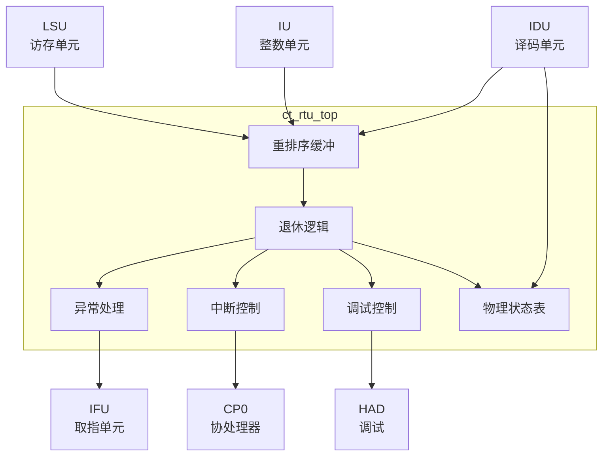

# ct_rtu_top 模块方案文档

## 1. 模块概述

### 1.1 模块简介

ct_rtu_top 是 OpenC910 处理器的退休单元（Retire Unit）顶层模块，负责指令的顺序提交、异常处理、中断响应和调试支持。该模块实现了重排序缓冲（ROB）、退休状态机和异常处理逻辑。

### 1.2 主要特性

- 实现重排序缓冲（ROB）
- 支持顺序指令退休
- 支持异常和中断处理
- 支持调试模式
- 支持精确异常

### 1.3 模块层次

- **层次级别**: Level 2
- **父模块**: ct_core
- **子模块**: 包含ROB、异常处理、中断控制等

## 2. 模块接口说明

### 2.1 时钟与复位接口

| 信号名 | 方向 | 位宽 | 描述 |
|--------|------|------|------|
| forever_cpuclk | input | 1 | 永久CPU时钟 |
| cpurst_b | input | 1 | 核心复位信号，低有效 |

### 2.2 IDU接口

| 信号名 | 方向 | 位宽 | 描述 |
|--------|------|------|------|
| idu_rtu_rob_create0_en | input | 1 | ROB创建0使能 |
| idu_rtu_rob_create0_data | input | 88 | ROB创建0数据 |
| idu_rtu_ir_preg0_alloc_vld | input | 1 | 物理寄存器分配有效 |
| idu_rtu_pst_dis_inst0_preg | input | 7 | 分发指令0目的寄存器 |

### 2.3 IU完成接口

| 信号名 | 方向 | 位宽 | 描述 |
|--------|------|------|------|
| iu_rtu_pipe0_cmplt | input | 1 | Pipe0完成 |
| iu_rtu_pipe0_iid | input | 7 | Pipe0指令ID |
| iu_rtu_ex2_pipe0_wb_preg_vld | input | 1 | 写回有效 |
| iu_rtu_ex2_pipe0_wb_preg | input | 7 | 写回物理寄存器 |
| iu_rtu_pipe0_expt_vld | input | 1 | 异常有效 |

### 2.4 LSU完成接口

| 信号名 | 方向 | 位宽 | 描述 |
|--------|------|------|------|
| lsu_rtu_wb_pipe3_cmplt | input | 1 | Pipe3完成 |
| lsu_rtu_wb_pipe3_iid | input | 7 | Pipe3指令ID |
| lsu_rtu_wb_pipe3_expt_vld | input | 1 | 异常有效 |
| lsu_rtu_wb_pipe3_mtval | input | 64 | 异常值 |

### 2.5 CP0接口

| 信号名 | 方向 | 位宽 | 描述 |
|--------|------|------|------|
| rtu_cp0_epc | output | 64 | 异常PC |
| rtu_cp0_expt_vld | output | 1 | 异常有效 |
| rtu_cp0_expt_mtval | output | 64 | 异常值 |
| cp0_rtu_xx_int_b | input | 1 | 中断请求 |

### 2.6 IFU接口

| 信号名 | 方向 | 位宽 | 描述 |
|--------|------|------|------|
| rtu_ifu_flush | output | 1 | 流水线刷新 |
| rtu_ifu_chgflw_vld | output | 1 | 控制流改变有效 |
| rtu_ifu_chgflw_pc | output | 39 | 新PC值 |
| rtu_ifu_xx_expt_vld | output | 1 | 异常有效 |
| rtu_ifu_xx_expt_vec | output | 1 | 异常向量 |

### 2.7 调试接口

| 信号名 | 方向 | 位宽 | 描述 |
|--------|------|------|------|
| had_rtu_hw_dbgreq | input | 1 | 硬件调试请求 |
| rtu_had_dbgreq_ack | output | 1 | 调试请求确认 |
| rtu_yy_xx_dbgon | output | 1 | 调试模式激活 |

## 3. 模块框图

## 4. 模块实现方案

### 4.1 总体架构

ct_rtu_top 采用集中式退休架构：

1. **重排序缓冲（ROB）**: 跟踪所有在飞行指令
2. **退休逻辑**: 按序提交完成的指令
3. **异常处理**: 检测和处理异常
4. **中断控制**: 响应外部中断
5. **调试控制**: 支持调试模式
6. **物理状态表**: 跟踪物理寄存器状态

### 4.2 重排序缓冲设计

ROB 特性：
- 循环缓冲结构
- 支持多条指令并行创建
- 支持多条指令并行退休
- 支持指令取消

### 4.3 退休机制

退休流程：
1. 检查ROB头部指令是否完成
2. 检查是否有异常
3. 提交指令结果
4. 释放物理寄存器
5. 更新架构状态

### 4.4 异常处理

异常处理流程：
1. 检测异常源
2. 刷新流水线
3. 保存异常信息
4. 跳转到异常处理程序

### 4.5 调试支持

调试功能：
- 支持调试模式进入/退出
- 支持单步执行
- 支持断点响应
- 支持调试异常

## 5. 内部关键信号列表

| 信号名 | 位宽 | 类型 | 描述 |
|--------|------|------|------|
| rob_head_ptr | 6 | wire | ROB头指针 |
| rob_tail_ptr | 6 | wire | ROB尾指针 |
| retire_inst0_vld | 1 | wire | 退休指令0有效 |
| expt_pending | 1 | wire | 异常待处理 |
| int_pending | 1 | wire | 中断待处理 |
| dbgon | 1 | wire | 调试模式激活 |

## 6. 子模块方案

### 6.1 重排序缓冲

**功能描述**: 跟踪所有在飞行指令，支持顺序退休。

**设计要点**:
- 循环缓冲结构
- 支持多指令创建
- 支持多指令退休

### 6.2 退休逻辑

**功能描述**: 按序提交完成的指令。

**设计要点**:
- 检查指令完成
- 处理异常
- 更新架构状态

### 6.3 异常处理

**功能描述**: 检测和处理异常。

**设计要点**:
- 检测异常源
- 优先级仲裁
- 生成异常响应

### 6.4 中断控制

**功能描述**: 响应外部中断请求。

**设计要点**:
- 中断优先级
- 中断使能控制
- 中断响应生成

## 7. 修订历史

| 版本 | 日期 | 作者 | 描述 |
|------|------|------|------|
| 1.0 | 2024-01 | OpenC910 Team | 初始版本 |
