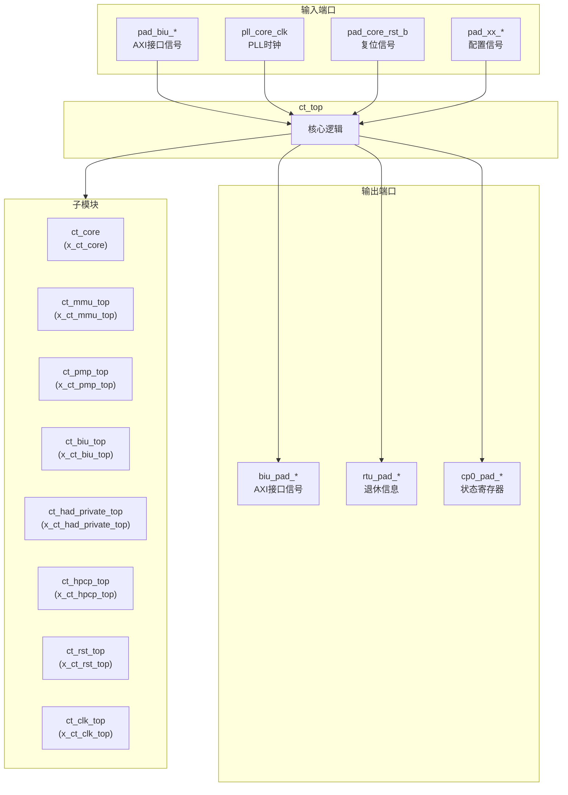
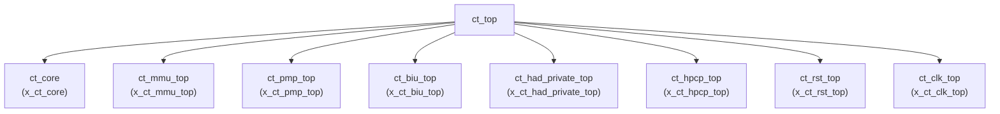

# ct_top 模块设计文档

## 1. 模块概述

### 1.1 基本信息

| 属性 | 值 |
|------|-----|
| 模块名称 | ct_top |
| 文件路径 | C910_RTL_FACTORY/gen_rtl/cpu/rtl/ct_top.v |
| 层级 | Level 0 |

### 1.2 功能描述

ct_top 是 OpenC910 处理器的顶层模块，负责集成和协调所有子模块的工作。该模块实现了完整的 RISC-V 64位处理器核心，包括取指单元、译码单元、执行单元、访存单元、MMU、调试单元等核心组件。

主要功能包括：
- 处理器核心与外部总线的接口管理
- 时钟和复位信号的分配
- 各功能模块的实例化和互连
- 中断和调试请求的处理

### 1.3 设计特点

- 包含 8 个一级子模块实例
- 支持 AXI4 总线协议
- 支持多核 SMP 配置
- 集成调试和性能监控功能
- 支持低功耗管理

## 2. 模块接口说明

### 2.1 输入端口

| 信号名 | 方向 | 位宽 | 描述 |
|--------|------|------|------|
| ir_corex_wdata | input | 64 | 调试接口数据输入 |
| pad_biu_acaddr | input | 40 | ACREQ 通道地址 |
| pad_biu_acprot | input | 3 | ACREQ 通道保护属性 |
| pad_biu_acsnoop | input | 4 | ACREQ 通道 snoop 类型 |
| pad_biu_acvalid | input | 1 | ACREQ 通道有效信号 |
| pad_biu_arready | input | 1 | AR 通道就绪信号 |
| pad_biu_awready | input | 1 | AW 通道就绪信号 |
| pad_biu_bid | input | 5 | B 通道 ID |
| pad_biu_bresp | input | 2 | B 通道响应 |
| pad_biu_bvalid | input | 1 | B 通道有效信号 |
| pad_biu_cdready | input | 1 | CD 通道就绪信号 |
| pad_biu_crready | input | 1 | CR 通道就绪信号 |
| pad_biu_csr_cmplt | input | 1 | CSR 访问完成信号 |
| pad_biu_csr_rdata | input | 128 | CSR 读数据 |
| pad_biu_dbgrq_b | input | 1 | 调试请求信号 |
| pad_biu_hpcp_l2of_int | input | 4 | L2 溢出中断 |
| pad_biu_me_int | input | 1 | 机器模式外部中断 |
| pad_biu_ms_int | input | 1 | 机器模式软件中断 |
| pad_biu_mt_int | input | 1 | 机器模式定时器中断 |
| pad_biu_rdata | input | 128 | R 通道读数据 |
| pad_biu_rid | input | 5 | R 通道 ID |
| pad_biu_rlast | input | 1 | R 通道最后一个数据 |
| pad_biu_rresp | input | 4 | R 通道响应 |
| pad_biu_rvalid | input | 1 | R 通道有效信号 |
| pad_biu_se_int | input | 1 | 超级用户模式外部中断 |
| pad_biu_ss_int | input | 1 | 超级用户模式软件中断 |
| pad_biu_st_int | input | 1 | 超级用户模式定时器中断 |
| pad_biu_wns_awready | input | 1 | WNS AW 通道就绪 |
| pad_biu_wns_wready | input | 1 | WNS W 通道就绪 |
| pad_biu_wready | input | 1 | W 通道就绪信号 |
| pad_biu_ws_awready | input | 1 | WS AW 通道就绪 |
| pad_biu_ws_wready | input | 1 | WS W 通道就绪 |
| pad_core_hartid | input | 3 | 硬件线程 ID |
| pad_core_rst_b | input | 1 | 核心复位信号 |
| pad_core_rvba | input | 40 | 复位向量基地址 |
| pad_cpu_rst_b | input | 1 | CPU 复位信号 |
| pad_xx_apb_base | input | 40 | APB 基地址 |
| pad_xx_time | input | 64 | 时间计数器值 |
| pad_yy_icg_scan_en | input | 1 | ICG 扫描使能 |
| pad_yy_mbist_mode | input | 1 | MBIST 模式 |
| pad_yy_scan_mode | input | 1 | 扫描模式 |
| pad_yy_scan_rst_b | input | 1 | 扫描复位信号 |
| pll_core_clk | input | 1 | PLL 核心时钟 |
| sm_update_dr | input | 1 | 状态机更新 DR |
| sm_update_ir | input | 1 | 状态机更新 IR |
| x_enter_dbg_req_i | input | 1 | 进入调试请求输入 |
| x_exit_dbg_req_i | input | 1 | 退出调试请求输入 |
| x_had_dbg_mask | input | 1 | 调试屏蔽信号 |

### 2.2 输出端口

| 信号名 | 方向 | 位宽 | 描述 |
|--------|------|------|------|
| biu_pad_acready | output | 1 | ACREQ 通道就绪信号 |
| biu_pad_araddr | output | 40 | AR 通道地址 |
| biu_pad_arbar | output | 2 | AR 通道屏障类型 |
| biu_pad_arburst | output | 2 | AR 通道突发类型 |
| biu_pad_arcache | output | 4 | AR 通道缓存属性 |
| biu_pad_ardomain | output | 2 | AR 通道域属性 |
| biu_pad_arid | output | 5 | AR 通道 ID |
| biu_pad_arlen | output | 2 | AR 通道长度 |
| biu_pad_arlock | output | 1 | AR 通道锁存类型 |
| biu_pad_arprot | output | 3 | AR 通道保护属性 |
| biu_pad_arsize | output | 3 | AR 通道传输大小 |
| biu_pad_arsnoop | output | 4 | AR 通道 snoop 类型 |
| biu_pad_aruser | output | 3 | AR 通道用户信号 |
| biu_pad_arvalid | output | 1 | AR 通道有效信号 |
| biu_pad_awaddr | output | 40 | AW 通道地址 |
| biu_pad_awbar | output | 2 | AW 通道屏障类型 |
| biu_pad_awburst | output | 2 | AW 通道突发类型 |
| biu_pad_awcache | output | 4 | AW 通道缓存属性 |
| biu_pad_awdomain | output | 2 | AW 通道域属性 |
| biu_pad_awid | output | 5 | AW 通道 ID |
| biu_pad_awlen | output | 2 | AW 通道长度 |
| biu_pad_awlock | output | 1 | AW 通道锁存类型 |
| biu_pad_awprot | output | 3 | AW 通道保护属性 |
| biu_pad_awsize | output | 3 | AW 通道传输大小 |
| biu_pad_awsnoop | output | 3 | AW 通道 snoop 类型 |
| biu_pad_awunique | output | 1 | AW 通道唯一属性 |
| biu_pad_awuser | output | 1 | AW 通道用户信号 |
| biu_pad_awvalid | output | 1 | AW 通道有效信号 |
| biu_pad_back | output | 1 | B 通道应答 |
| biu_pad_bready | output | 1 | B 通道就绪信号 |
| biu_pad_cddata | output | 128 | CD 通道数据 |
| biu_pad_cderr | output | 1 | CD 通道错误 |
| biu_pad_cdlast | output | 1 | CD 通道最后一个数据 |
| biu_pad_cdvalid | output | 1 | CD 通道有效信号 |
| biu_pad_cnt_en | output | 4 | 计数器使能 |
| biu_pad_crresp | output | 5 | CR 通道响应 |
| biu_pad_crvalid | output | 1 | CR 通道有效信号 |
| biu_pad_csr_sel | output | 1 | CSR 选择信号 |
| biu_pad_csr_wdata | output | 80 | CSR 写数据 |
| biu_pad_jdb_pm | output | 1 | JTAG 调试电源管理 |
| biu_pad_lpmd_b | output | 1 | 低功耗模式 |
| biu_pad_rack | output | 1 | R 通道应答 |
| biu_pad_rready | output | 1 | R 通道就绪信号 |
| biu_pad_wdata | output | 128 | W 通道写数据 |
| biu_pad_werr | output | 1 | W 通道错误 |
| biu_pad_wlast | output | 1 | W 通道最后一个数据 |
| biu_pad_wns | output | 1 | WNS 标志 |
| biu_pad_wstrb | output | 16 | W 通道写选通 |
| biu_pad_wvalid | output | 1 | W 通道有效信号 |
| cp0_pad_mstatus | output | 64 | MSTATUS 寄存器值 |
| rtu_cpu_no_retire | output | 1 | CPU 无退休指令标志 |
| rtu_pad_retire0 | output | 1 | 退休指令0标志 |
| rtu_pad_retire0_pc | output | 40 | 退休指令0 PC |
| rtu_pad_retire1 | output | 1 | 退休指令1标志 |
| rtu_pad_retire1_pc | output | 40 | 退休指令1 PC |
| rtu_pad_retire2 | output | 1 | 退休指令2标志 |
| rtu_pad_retire2_pc | output | 40 | 退休指令2 PC |
| x_dbg_ack_pc | output | 1 | 调试应答 PC |
| x_enter_dbg_req_o | output | 1 | 进入调试请求输出 |
| x_exit_dbg_req_o | output | 1 | 退出调试请求输出 |
| x_regs_serial_data | output | 64 | 寄存器串行数据 |

## 3. 模块框图

### 3.1 模块架构图

### 3.2 主要数据连线

| 源模块 | 目标模块 | 信号名 | 位宽 | 说明 |
|--------|----------|--------|------|------|
| ct_top | ct_core | biu_cp0_apb_base | 40 | APB基地址 |
| ct_top | ct_core | biu_cp0_cmplt | 1 | CP0访问完成 |
| ct_top | ct_core | biu_cp0_coreid | 3 | 核心ID |
| ct_top | ct_mmu_top | biu_mmu_smp_disable | 1 | SMP禁用信号 |
| ct_top | ct_mmu_top | cp0_mmu_cskyee | 1 | CSKY扩展使能 |
| ct_top | ct_mmu_top | cp0_mmu_icg_en | 1 | 时钟门控使能 |
| ct_top | ct_pmp_top | cp0_pmp_icg_en | 1 | PMP时钟门控使能 |
| ct_top | ct_pmp_top | cp0_pmp_mpp | 2 | PMP权限模式 |
| ct_top | ct_pmp_top | cp0_pmp_mprv | 1 | PMP权限修改 |
| ct_top | ct_biu_top | biu_cp0_apb_base | 40 | APB基地址 |
| ct_top | ct_biu_top | biu_cp0_cmplt | 1 | CP0访问完成 |
| ct_top | ct_biu_top | biu_cp0_coreid | 3 | 核心ID |
| ct_top | ct_had_private_top | biu_had_coreid | 2 | 调试核心ID |
| ct_top | ct_had_private_top | biu_had_sdb_req_b | 1 | 调试请求 |
| ct_top | ct_had_private_top | cp0_had_cpuid_0 | 32 | CPU ID |
| ct_top | ct_hpcp_top | biu_hpcp_cmplt | 1 | HPCP访问完成 |
| ct_top | ct_hpcp_top | biu_hpcp_l2of_int | 4 | L2溢出中断 |
| ct_top | ct_hpcp_top | biu_hpcp_rdata | 128 | HPCP读数据 |
| ct_top | ct_rst_top | forever_coreclk | 1 | 核心时钟 |
| ct_top | ct_rst_top | fpu_rst_b | 1 | FPU复位 |
| ct_top | ct_rst_top | had_rst_b | 1 | HAD复位 |
| ct_top | ct_clk_top | biu_xx_dbg_wakeup | 1 | 调试唤醒 |
| ct_top | ct_clk_top | biu_xx_int_wakeup | 1 | 中断唤醒 |
| ct_top | ct_clk_top | biu_xx_normal_work | 1 | 正常工作标志 |

## 4. 模块实现方案

### 4.1 关键逻辑描述

ct_top 模块主要是模块实例化和信号连接，不包含复杂的逻辑处理：

1. **时钟分配**：通过 ct_clk_top 模块生成 coreclk 和 forever_coreclk
2. **复位分配**：通过 ct_rst_top 模块生成各子模块的复位信号
3. **信号路由**：将外部接口信号路由到相应的子模块

### 4.2 时钟域划分

| 时钟信号 | 来源 | 用途 |
|----------|------|------|
| forever_coreclk | pll_core_clk | 全局核心时钟 |
| coreclk | BUFGCE输出 | 门控后的核心时钟 |

### 4.3 复位策略

| 复位信号 | 来源 | 目标模块 |
|----------|------|----------|
| mmu_rst_b | ct_rst_top | MMU, PMP, BIU, HPCP |
| ifu_rst_b | ct_rst_top | IFU |
| idu_rst_b | ct_rst_top | IDU |
| lsu_rst_b | ct_rst_top | LSU |
| fpu_rst_b | ct_rst_top | FPU |
| had_rst_b | ct_rst_top | HAD |

## 5. 内部关键信号列表

### 5.1 寄存器信号

无寄存器信号。

### 5.2 线网信号

| 信号名 | 位宽 | 描述 |
|--------|------|------|
| biu_cp0_apb_base | 40 | APB基地址 |
| biu_cp0_cmplt | 1 | CP0访问完成 |
| biu_cp0_coreid | 3 | 核心ID |
| biu_cp0_me_int | 1 | 机器模式外部中断 |
| biu_cp0_ms_int | 1 | 机器模式软件中断 |
| biu_cp0_mt_int | 1 | 机器模式定时器中断 |
| biu_cp0_rdata | 128 | CP0读数据 |
| biu_cp0_rvba | 40 | 复位向量基地址 |
| biu_cp0_se_int | 1 | 超级用户模式外部中断 |
| biu_cp0_ss_int | 1 | 超级用户模式软件中断 |
| biu_cp0_st_int | 1 | 超级用户模式定时器中断 |
| biu_had_coreid | 2 | 调试核心ID |
| biu_had_sdb_req_b | 1 | 调试请求 |
| biu_hpcp_cmplt | 1 | HPCP访问完成 |
| biu_hpcp_l2of_int | 4 | L2溢出中断 |
| biu_hpcp_rdata | 128 | HPCP读数据 |
| biu_hpcp_time | 64 | 时间计数器 |
| biu_ifu_rd_data | 128 | IFU读数据 |
| biu_ifu_rd_data_vld | 1 | IFU读数据有效 |
| biu_ifu_rd_grnt | 1 | IFU读授权 |
| biu_ifu_rd_id | 1 | IFU读ID |
| biu_ifu_rd_last | 1 | IFU读最后标志 |
| biu_ifu_rd_resp | 2 | IFU读响应 |
| biu_lsu_ac_addr | 40 | LSU访问地址 |
| biu_lsu_ac_prot | 3 | LSU访问保护 |
| biu_lsu_ac_req | 1 | LSU访问请求 |
| biu_lsu_ac_snoop | 4 | LSU访问snoop |
| biu_lsu_ar_ready | 1 | LSU AR就绪 |
| biu_lsu_aw_vb_grnt | 1 | LSU AW VB授权 |
| biu_lsu_aw_wmb_grnt | 1 | LSU AW WMB授权 |
| biu_lsu_b_id | 5 | LSU B ID |
| biu_lsu_b_resp | 2 | LSU B响应 |
| biu_lsu_b_vld | 1 | LSU B有效 |
| biu_lsu_cd_ready | 1 | LSU CD就绪 |
| biu_lsu_cr_ready | 1 | LSU CR就绪 |
| biu_lsu_r_data | 128 | LSU R数据 |
| biu_lsu_r_id | 5 | LSU R ID |
| biu_lsu_r_last | 1 | LSU R最后 |
| biu_lsu_r_resp | 4 | LSU R响应 |
| biu_lsu_r_vld | 1 | LSU R有效 |
| biu_lsu_w_vb_grnt | 1 | LSU W VB授权 |
| biu_lsu_w_wmb_grnt | 1 | LSU W WMB授权 |
| biu_mmu_smp_disable | 1 | MMU SMP禁用 |
| biu_xx_dbg_wakeup | 1 | 调试唤醒 |
| biu_xx_int_wakeup | 1 | 中断唤醒 |
| biu_xx_normal_work | 1 | 正常工作 |
| biu_xx_pmp_sel | 1 | PMP选择 |
| biu_xx_snoop_vld | 1 | Snoop有效 |
| biu_yy_xx_no_op | 1 | 无操作标志 |
| coreclk | 1 | 核心时钟 |
| cp0_biu_icg_en | 1 | BIU时钟门控使能 |
| cp0_biu_lpmd_b | 2 | 低功耗模式 |
| cp0_biu_op | 16 | BIU操作 |
| cp0_biu_sel | 1 | BIU选择 |
| cp0_biu_wdata | 64 | BIU写数据 |
| cp0_had_cpuid_0 | 32 | CPU ID |
| cp0_had_debug_info | 4 | 调试信息 |
| cp0_had_lpmd_b | 2 | 低功耗模式 |
| cp0_had_trace_pm_wdata | 2 | 跟踪电源管理数据 |
| cp0_had_trace_pm_wen | 1 | 跟踪电源管理使能 |
| cp0_hpcp_icg_en | 1 | HPCP时钟门控使能 |
| cp0_hpcp_index | 12 | HPCP索引 |
| cp0_hpcp_int_disable | 1 | HPCP中断禁用 |
| cp0_hpcp_mcntwen | 32 | HPCP计数器写使能 |
| cp0_hpcp_op | 4 | HPCP操作 |
| cp0_hpcp_pmdm | 1 | HPCP PMDM |
| cp0_hpcp_pmds | 1 | HPCP PMDS |
| cp0_hpcp_pmdu | 1 | HPCP PMDU |
| cp0_hpcp_sel | 1 | HPCP选择 |
| cp0_hpcp_src0 | 64 | HPCP源0 |
| cp0_hpcp_wdata | 64 | HPCP写数据 |
| cp0_mmu_cskyee | 1 | MMU CSKY扩展使能 |
| cp0_mmu_icg_en | 1 | MMU时钟门控使能 |
| cp0_mmu_maee | 1 | MMU MAEE使能 |
| cp0_mmu_mpp | 2 | MMU权限模式 |
| cp0_mmu_mprv | 1 | MMU权限修改 |
| cp0_mmu_mxr | 1 | MMU MXR |
| cp0_mmu_no_op_req | 1 | MMU无操作请求 |
| cp0_mmu_ptw_en | 1 | MMU PTW使能 |
| cp0_mmu_reg_num | 2 | MMU寄存器号 |
| cp0_mmu_satp_sel | 1 | MMU SATP选择 |
| cp0_mmu_sum | 1 | MMU SUM |
| cp0_mmu_tlb_all_inv | 1 | MMU TLB全失效 |
| cp0_mmu_wdata | 64 | MMU写数据 |
| cp0_mmu_wreg | 1 | MMU写寄存器 |
| cp0_pad_mstatus | 64 | MSTATUS寄存器 |
| cp0_pmp_icg_en | 1 | PMP时钟门控使能 |
| cp0_pmp_mpp | 2 | PMP权限模式 |
| cp0_pmp_mprv | 1 | PMP权限修改 |
| cp0_pmp_reg_num | 5 | PMP寄存器号 |
| cp0_pmp_wdata | 64 | PMP写数据 |
| cp0_pmp_wreg | 1 | PMP写寄存器 |
| cp0_xx_core_icg_en | 1 | 核心时钟门控使能 |
| cp0_yy_priv_mode | 2 | 特权模式 |
| forever_coreclk | 1 | 全局核心时钟 |
| fpu_rst_b | 1 | FPU复位 |
| had_biu_jdb_pm | 2 | JTAG调试电源管理 |
| had_cp0_xx_dbg | 1 | 调试标志 |
| had_idu_debug_id_inst_en | 1 | IDU调试使能 |
| had_idu_wbbr_data | 64 | IDU写回数据 |
| had_idu_wbbr_vld | 1 | IDU写回有效 |
| had_ifu_ir | 32 | IFU指令寄存器 |
| had_ifu_ir_vld | 1 | IFU IR有效 |
| had_ifu_pc | 39 | IFU PC |
| had_ifu_pcload | 1 | IFU PC加载 |
| had_lsu_bus_trace_en | 1 | LSU总线跟踪使能 |
| had_lsu_dbg_en | 1 | LSU调试使能 |
| had_rst_b | 1 | HAD复位 |
| had_rtu_data_bkpt_dbgreq | 1 | 数据断点调试请求 |
| had_rtu_dbg_disable | 1 | RTU调试禁用 |
| had_rtu_dbg_req_en | 1 | RTU调试请求使能 |
| had_rtu_debug_retire_info_en | 1 | 调试退休信息使能 |
| had_rtu_event_dbgreq | 1 | 事件调试请求 |
| had_rtu_fdb | 1 | FDB信号 |
| had_rtu_hw_dbgreq | 1 | 硬件调试请求 |
| had_rtu_hw_dbgreq_gateclk | 1 | 硬件调试请求时钟门控 |
| had_rtu_inst_bkpt_dbgreq | 1 | 指令断点调试请求 |
| had_rtu_non_irv_bkpt_dbgreq | 1 | 非IRV断点调试请求 |
| had_rtu_pop1_disa | 1 | POP1禁用 |
| had_rtu_trace_dbgreq | 1 | 跟踪调试请求 |
| had_rtu_trace_en | 1 | 跟踪使能 |
| had_rtu_xx_jdbreq | 1 | JTAG调试请求 |
| had_rtu_xx_tme | 1 | TME信号 |
| had_xx_clk_en | 1 | HAD时钟使能 |
| had_yy_xx_bkpta_base | 40 | 断点A基地址 |
| had_yy_xx_bkpta_mask | 8 | 断点A掩码 |
| had_yy_xx_bkpta_rc | 1 | 断点A RC |
| had_yy_xx_bkptb_base | 40 | 断点B基地址 |
| had_yy_xx_bkptb_mask | 8 | 断点B掩码 |
| had_yy_xx_bkptb_rc | 1 | 断点B RC |
| had_yy_xx_exit_dbg | 1 | 退出调试 |
| hpcp_biu_cnt_en | 4 | BIU计数器使能 |
| hpcp_biu_op | 16 | BIU操作 |
| hpcp_biu_sel | 1 | BIU选择 |
| hpcp_biu_wdata | 64 | BIU写数据 |
| hpcp_cp0_cmplt | 1 | CP0访问完成 |
| hpcp_cp0_data | 64 | CP0数据 |
| hpcp_cp0_int_vld | 1 | CP0中断有效 |
| hpcp_cp0_sce | 1 | SCE信号 |
| hpcp_idu_cnt_en | 1 | IDU计数器使能 |
| hpcp_ifu_cnt_en | 1 | IFU计数器使能 |
| hpcp_lsu_cnt_en | 1 | LSU计数器使能 |
| hpcp_mmu_cnt_en | 1 | MMU计数器使能 |
| hpcp_rtu_cnt_en | 1 | RTU计数器使能 |
| idu_rst_b | 1 | IDU复位 |
| ifu_rst_b | 1 | IFU复位 |
| lsu_rst_b | 1 | LSU复位 |
| mmu_rst_b | 1 | MMU复位 |

## 6. 子模块方案

### 6.1 模块例化层次结构

### 6.2 子模块列表

| 层级 | 模块名 | 实例名 | 功能描述 |
|------|--------|--------|----------|
| 1 | ct_core | x_ct_core | 处理器核心模块，包含取指、译码、执行、访存等单元 |
| 1 | ct_mmu_top | x_ct_mmu_top | 内存管理单元，实现虚拟地址到物理地址的转换 |
| 1 | ct_pmp_top | x_ct_pmp_top | 物理内存保护单元，实现内存访问权限控制 |
| 1 | ct_biu_top | x_ct_biu_top | 总线接口单元，实现AXI总线协议接口 |
| 1 | ct_had_private_top | x_ct_had_private_top | 调试单元，实现JTAG调试和跟踪功能 |
| 1 | ct_hpcp_top | x_ct_hpcp_top | 硬件性能计数器单元，实现性能监控功能 |
| 1 | ct_rst_top | x_ct_rst_top | 复位控制单元，生成各模块复位信号 |
| 1 | ct_clk_top | x_ct_clk_top | 时钟控制单元，生成各模块时钟信号 |

### 6.3 子模块功能说明

#### ct_core
处理器核心模块，是OpenC910的主要计算单元。包含以下子模块：
- IFU (取指单元)：负责从内存获取指令
- IDU (译码单元)：负责指令译码和分发
- IU (整数单元)：负责整数运算
- LSU (访存单元)：负责内存访问操作
- RTU (退休单元)：负责指令退休
- VFPU (向量浮点单元)：负责浮点和向量运算
- CP0 (协处理器0)：负责系统控制

#### ct_mmu_top
内存管理单元，实现Sv39/Sv48虚拟内存管理。包含：
- IUTLB：指令TLB
- DUTLB：数据TLB
- JTLB：联合TLB
- PTW：页表遍历器

#### ct_pmp_top
物理内存保护单元，实现RISC-V PMP规范。支持最多16个PMP区域配置。

#### ct_biu_top
总线接口单元，实现AXI4总线协议。包含：
- 读通道：处理读请求
- 写通道：处理写请求
- Snoop通道：处理缓存一致性

#### ct_had_private_top
调试单元，实现RISC-V调试规范。支持：
- JTAG调试接口
- 硬件断点
- 单步调试
- 跟踪功能

#### ct_hpcp_top
硬件性能计数器单元，实现RISC-V HPM规范。支持多个性能事件计数。

#### ct_rst_top
复位控制单元，生成同步复位信号。支持：
- 核心复位
- 扫描复位
- MBIST模式

#### ct_clk_top
时钟控制单元，实现时钟门控。支持：
- 全局时钟门控
- 模块级时钟门控
- 低功耗模式

## 7. 修订历史

| 版本 | 日期 | 作者 | 说明 |
|------|------|------|------|
| 1.0 | 2026-03-12 | Auto-generated | 初始版本 |
