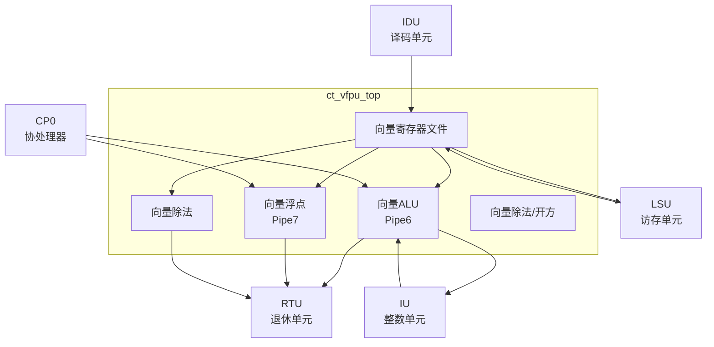

# ct_vfpu_top 模块方案文档

## 1. 模块概述

### 1.1 模块简介

ct_vfpu_top 是 OpenC910 处理器的向量浮点单元（Vector Floating Point Unit）顶层模块，负责执行向量运算和浮点运算。该模块实现了向量ALU、向量乘法、向量除法、浮点运算和向量寄存器文件等功能。

### 1.2 主要特性

- 支持 RISC-V 向量扩展（V扩展）
- 支持 RISC-V 浮点扩展（F/D扩展）
- 支持向量整数运算
- 支持向量浮点运算
- 支持向量加载存储
- 支持向量配置指令

### 1.3 模块层次

- **层次级别**: Level 2
- **父模块**: ct_core
- **子模块**: 包含向量ALU、浮点单元、向量寄存器文件等

## 2. 模块接口说明

### 2.1 时钟与复位接口

| 信号名 | 方向 | 位宽 | 描述 |
|--------|------|------|------|
| forever_cpuclk | input | 1 | 永久CPU时钟 |
| cpurst_b | input | 1 | 核心复位信号，低有效 |

### 2.2 IDU发射接口

| 信号名 | 方向 | 位宽 | 描述 |
|--------|------|------|------|
| idu_vfpu_rf_pipe6_sel | input | 1 | Pipe6选择 |
| idu_vfpu_rf_pipe6_func | input | 20 | Pipe6功能码 |
| idu_vfpu_rf_pipe6_srcv0_fr | input | 64 | Pipe6源向量0 |
| idu_vfpu_rf_pipe6_srcv1_fr | input | 64 | Pipe6源向量1 |
| idu_vfpu_rf_pipe6_dst_vreg | input | 7 | Pipe6目的向量寄存器 |
| idu_vfpu_rf_pipe7_sel | input | 1 | Pipe7选择 |
| idu_vfpu_rf_pipe7_func | input | 20 | Pipe7功能码 |

### 2.3 CP0配置接口

| 信号名 | 方向 | 位宽 | 描述 |
|--------|------|------|------|
| cp0_vfpu_fcsr | input | 64 | 浮点控制状态寄存器 |
| cp0_vfpu_fxcr | input | 32 | 浮点扩展控制寄存器 |
| cp0_vfpu_vl | input | 8 | 向量长度 |

### 2.4 RTU写回接口

| 信号名 | 方向 | 位宽 | 描述 |
|--------|------|------|------|
| vfpu_rtu_pipe6_cmplt | output | 1 | Pipe6完成 |
| vfpu_rtu_pipe6_iid | output | 7 | Pipe6指令ID |
| vfpu_rtu_ex5_pipe6_wb_vreg_vld | output | 1 | 向量写回有效 |
| vfpu_rtu_ex5_pipe6_wb_vreg_fr_vld | output | 1 | 向量写回FR有效 |

### 2.5 IU接口

| 信号名 | 方向 | 位宽 | 描述 |
|--------|------|------|------|
| iu_vfpu_ex1_pipe0_mtvr_inst | input | 1 | MTVR指令 |
| iu_vfpu_ex1_pipe0_mtvr_vreg | input | 7 | 目的向量寄存器 |
| vfpu_iu_ex2_pipe6_mfvr_data | output | 64 | MFVR数据 |
| vfpu_iu_ex2_pipe6_mfvr_data_vld | output | 1 | MFVR数据有效 |

### 2.6 IDU转发接口

| 信号名 | 方向 | 位宽 | 描述 |
|--------|------|------|------|
| vfpu_idu_ex3_pipe6_fwd_vreg_vld | output | 1 | 向量转发有效 |
| vfpu_idu_ex3_pipe6_fwd_vreg | output | 7 | 转发向量寄存器 |
| vfpu_idu_ex3_pipe6_fwd_vreg_fr_data | output | 64 | 转发FR数据 |

## 3. 模块框图

## 4. 模块实现方案

### 4.1 总体架构

ct_vfpu_top 采用双流水线架构：

1. **Pipe6**: 向量ALU，执行向量整数运算
2. **Pipe7**: 向量浮点单元，执行向量浮点运算
3. **向量除法**: 独立的除法单元
4. **向量寄存器文件**: 存储向量数据

### 4.2 向量ALU设计

向量ALU支持的操作：
- 向量整数加减
- 向量逻辑运算
- 向量移位
- 向量比较
- 向量归约

### 4.3 向量浮点单元设计

向量浮点单元支持：
- 向量浮点加减
- 向量浮点乘法
- 向量浮点乘累加
- 向量浮点除法/开方

### 4.4 向量寄存器文件

向量寄存器文件特性：
- 支持32个向量寄存器
- 支持向量寄存器分组
- 支持多端口读写
- 支持向量长度配置

### 4.5 向量配置

支持向量配置指令：
- VSETVLI: 设置向量长度
- VSETVL: 设置向量长度和类型
- 支持VLMAX计算

## 5. 内部关键信号列表

| 信号名 | 位宽 | 类型 | 描述 |
|--------|------|------|------|
| vstart | 7 | wire | 向量起始索引 |
| vl | 8 | wire | 向量长度 |
| vsew | 3 | wire | 向量元素宽度 |
| vlmul | 2 | wire | 向量寄存器分组 |
| vdiv_busy | 1 | wire | 向量除法忙 |

## 6. 子模块方案

### 6.1 向量寄存器文件

**功能描述**: 存储向量数据。

**设计要点**:
- 支持多端口读写
- 支持向量分组
- 支持部分写

### 6.2 向量ALU

**功能描述**: 执行向量整数运算。

**设计要点**:
- 支持多种向量操作
- 支持掩码操作
- 支持向量归约

### 6.3 向量浮点单元

**功能描述**: 执行向量浮点运算。

**设计要点**:
- 支持IEEE 754标准
- 支持多种舍入模式
- 支持浮点异常

### 6.4 向量除法

**功能描述**: 执行向量除法和开方运算。

**设计要点**:
- 迭代算法
- 支持中断
- 支持提前终止

## 7. 修订历史

| 版本 | 日期 | 作者 | 描述 |
|------|------|------|------|
| 1.0 | 2024-01 | OpenC910 Team | 初始版本 |
