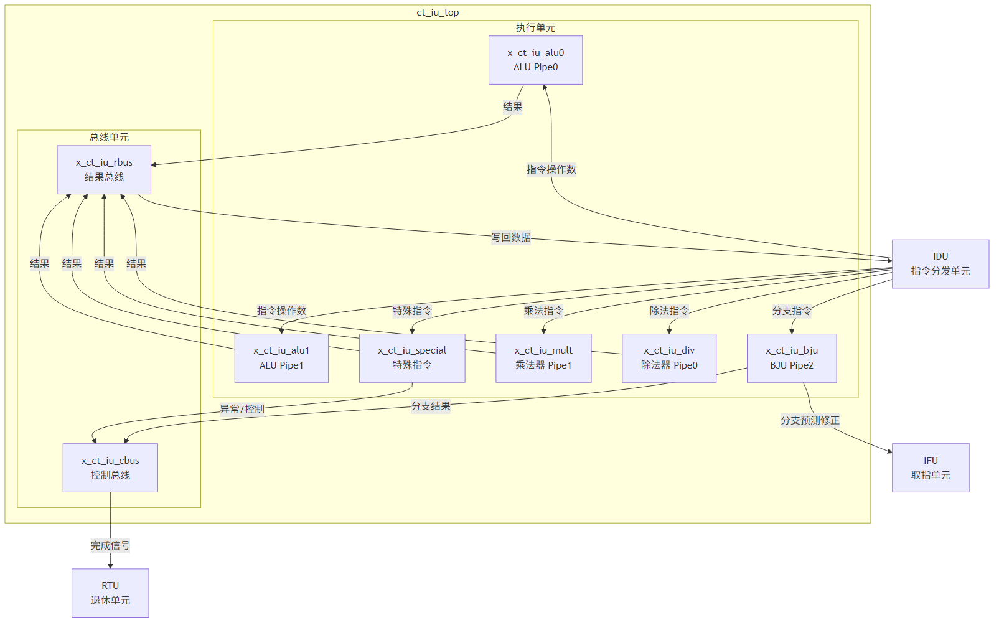
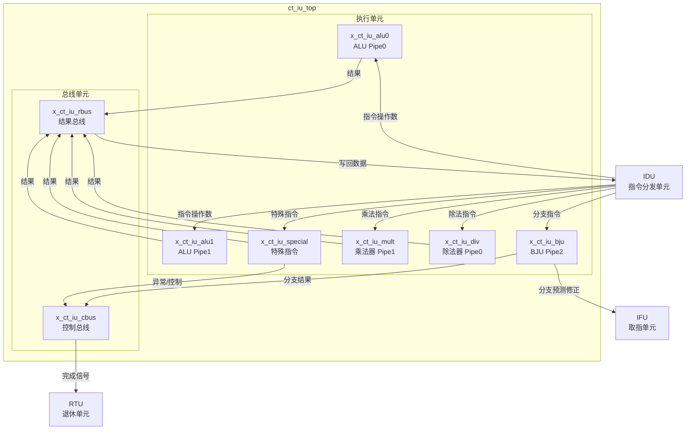
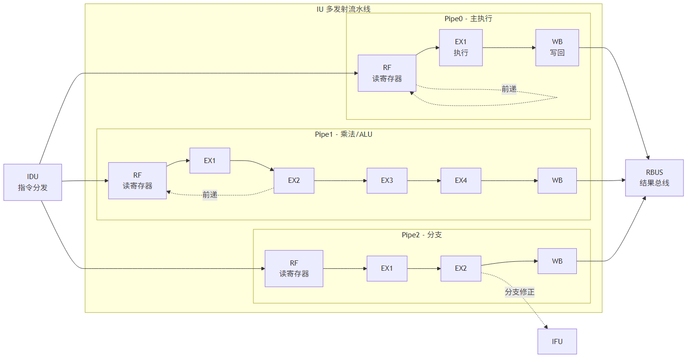
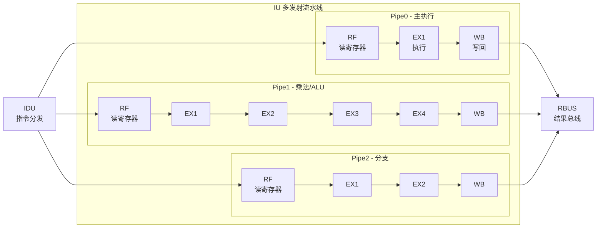
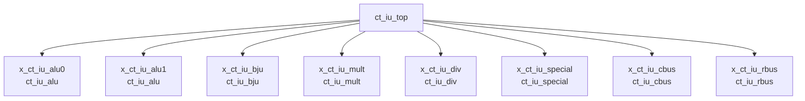

# ct_iu_top 模块方案文档

## 1. 模块概述

### 1.1 基本信息

| 属性 | 值 |
|------|-----|
| 模块名称 | ct_iu_top |
| 文件路径 | C910_RTL_FACTORY/gen_rtl/iu/rtl/ct_iu_top.v |
| 参数 | ALU_SEL = 21 |

### 1.2 功能描述

ct_iu_top 是 OpenC910 处理器的整数单元顶层模块，负责执行所有整数运算指令。该模块采用三发射乱序执行架构，包含两条 ALU 流水线、一条分支流水线、乘法器和除法器。

**主要功能：**
- 算术逻辑运算 (ADD, SUB, AND, OR, XOR, SLL, SRL, SRA 等)
- 乘法运算 (MUL, MULH, MULHSU, MULHU, MULW 等)
- 除法运算 (DIV, DIVU, REM, REMU 等)
- 分支跳转指令 (BEQ, BNE, BLT, BGE, JAL, JALR 等)
- 特殊指令 (ECALL, EBREAK, AUIPC, VSETVL 等)
- 分支预测验证与修正
- 数据前递与写回

### 1.3 设计特点

- **三发射架构**: 支持 Pipe0、Pipe1、Pipe2 三条独立流水线并行执行
- **乱序执行**: 支持指令乱序完成，提高执行效率
- **数据前递**: 支持 ALU、乘法、除法结果的前递，减少流水线停顿
- **分支预测**: 支持 BHT 分支预测验证，预测错误时自动修正
- **RISC-V 向量扩展**: 支持 VSETVL/VSETVLI 等 V 扩展指令

## 2. 模块接口说明

### 2.1 输入端口

#### 2.1.1 时钟复位信号

| 信号名 | 方向 | 位宽 | 描述 |
|--------|------|------|------|
| forever_cpuclk | input | 1 | CPU 主时钟 |
| cpurst_b | input | 1 | 系统复位 (低有效) |
| cp0_yy_clk_en | input | 1 | 全局时钟使能 |

#### 2.1.2 CP0 接口信号

| 信号名 | 方向 | 位宽 | 描述 |
|--------|------|------|------|
| cp0_iu_icg_en | input | 1 | IU 门控时钟使能 |
| cp0_yy_priv_mode | input | 2 | 当前特权模式 |
| cp0_iu_vl | input | 8 | 向量长度寄存器 |
| cp0_iu_vill | input | 1 | 向量长度非法标志 |
| cp0_iu_vstart | input | 7 | 向量起始索引 |
| cp0_iu_vsetvli_pre_decd_disable | input | 1 | VSETVLI 预解码禁用 |
| cp0_iu_div_entry_disable | input | 1 | 除法入口禁用 |
| cp0_iu_div_entry_disable_clr | input | 1 | 除法入口禁用清除 |
| cp0_iu_ex3_abnormal | input | 1 | EX3 异常标志 |
| cp0_iu_ex3_efpc | input | 39 | EX3 异常帧PC |
| cp0_iu_ex3_efpc_vld | input | 1 | EX3 异常帧PC有效 |
| cp0_iu_ex3_expt_vec | input | 5 | EX3 异常向量 |
| cp0_iu_ex3_expt_vld | input | 1 | EX3 异常有效 |
| cp0_iu_ex3_flush | input | 1 | EX3 冲刷标志 |
| cp0_iu_ex3_iid | input | 7 | EX3 指令ID |
| cp0_iu_ex3_inst_vld | input | 1 | EX3 指令有效 |
| cp0_iu_ex3_mtval | input | 32 | EX3 异常值 |
| cp0_iu_ex3_rslt_data | input | 64 | EX3 结果数据 |
| cp0_iu_ex3_rslt_preg | input | 7 | EX3 结果物理寄存器 |
| cp0_iu_ex3_rslt_vld | input | 1 | EX3 结果有效 |

#### 2.1.3 IDU 接口信号 (Pipe0)

| 信号名 | 方向 | 位宽 | 描述 |
|--------|------|------|------|
| idu_iu_rf_pipe0_sel | input | 1 | Pipe0 选择信号 |
| idu_iu_rf_pipe0_gateclk_sel | input | 1 | Pipe0 门控时钟选择 |
| idu_iu_rf_pipe0_iid | input | 7 | Pipe0 指令ID |
| idu_iu_rf_pipe0_pid | input | 5 | Pipe0 端口ID |
| idu_iu_rf_pipe0_dst_preg | input | 7 | Pipe0 目标物理寄存器 |
| idu_iu_rf_pipe0_dst_vld | input | 1 | Pipe0 目标有效 |
| idu_iu_rf_pipe0_dst_vreg | input | 7 | Pipe0 目标向量寄存器 |
| idu_iu_rf_pipe0_dstv_vld | input | 1 | Pipe0 目标向量有效 |
| idu_iu_rf_pipe0_func | input | 5 | Pipe0 功能码 |
| idu_iu_rf_pipe0_opcode | input | 32 | Pipe0 操作码 |
| idu_iu_rf_pipe0_src0 | input | 64 | Pipe0 源操作数0 |
| idu_iu_rf_pipe0_src1 | input | 64 | Pipe0 源操作数1 |
| idu_iu_rf_pipe0_src1_no_imm | input | 64 | Pipe0 源操作数1 (无立即数) |
| idu_iu_rf_pipe0_src2 | input | 64 | Pipe0 源操作数2 |
| idu_iu_rf_pipe0_imm | input | 6 | Pipe0 立即数 |
| idu_iu_rf_pipe0_rslt_sel | input | 21 | Pipe0 结果选择 |
| idu_iu_rf_pipe0_alu_short | input | 1 | Pipe0 ALU 短指令 |
| idu_iu_rf_pipe0_vl | input | 8 | Pipe0 向量长度 |
| idu_iu_rf_pipe0_vlmul | input | 2 | Pipe0 向量乘数 |
| idu_iu_rf_pipe0_vsew | input | 3 | Pipe0 向量元素宽度 |
| idu_iu_rf_pipe0_expt_vec | input | 5 | Pipe0 异常向量 |
| idu_iu_rf_pipe0_expt_vld | input | 1 | Pipe0 异常有效 |
| idu_iu_rf_pipe0_high_hw_expt | input | 1 | Pipe0 高优先级硬件异常 |
| idu_iu_rf_pipe0_special_imm | input | 20 | Pipe0 特殊立即数 |
| idu_iu_rf_pipe0_cbus_gateclk_sel | input | 1 | Pipe0 CBUS 门控时钟选择 |

#### 2.1.4 IDU 接口信号 (Pipe1)

| 信号名 | 方向 | 位宽 | 描述 |
|--------|------|------|------|
| idu_iu_rf_pipe1_sel | input | 1 | Pipe1 选择信号 |
| idu_iu_rf_pipe1_gateclk_sel | input | 1 | Pipe1 门控时钟选择 |
| idu_iu_rf_pipe1_iid | input | 7 | Pipe1 指令ID |
| idu_iu_rf_pipe1_dst_preg | input | 7 | Pipe1 目标物理寄存器 |
| idu_iu_rf_pipe1_dst_vld | input | 1 | Pipe1 目标有效 |
| idu_iu_rf_pipe1_dst_vreg | input | 7 | Pipe1 目标向量寄存器 |
| idu_iu_rf_pipe1_dstv_vld | input | 1 | Pipe1 目标向量有效 |
| idu_iu_rf_pipe1_func | input | 5 | Pipe1 功能码 |
| idu_iu_rf_pipe1_src0 | input | 64 | Pipe1 源操作数0 |
| idu_iu_rf_pipe1_src1 | input | 64 | Pipe1 源操作数1 |
| idu_iu_rf_pipe1_src1_no_imm | input | 64 | Pipe1 源操作数1 (无立即数) |
| idu_iu_rf_pipe1_src2 | input | 64 | Pipe1 源操作数2 |
| idu_iu_rf_pipe1_imm | input | 6 | Pipe1 立即数 |
| idu_iu_rf_pipe1_rslt_sel | input | 21 | Pipe1 结果选择 |
| idu_iu_rf_pipe1_alu_short | input | 1 | Pipe1 ALU 短指令 |
| idu_iu_rf_pipe1_vl | input | 8 | Pipe1 向量长度 |
| idu_iu_rf_pipe1_vlmul | input | 2 | Pipe1 向量乘数 |
| idu_iu_rf_pipe1_vsew | input | 3 | Pipe1 向量元素宽度 |
| idu_iu_rf_pipe1_mult_func | input | 8 | Pipe1 乘法功能码 |
| idu_iu_rf_pipe1_mla_src2_preg | input | 7 | Pipe1 MLA 源2物理寄存器 |
| idu_iu_rf_pipe1_mla_src2_vld | input | 1 | Pipe1 MLA 源2有效 |
| idu_iu_rf_pipe1_cbus_gateclk_sel | input | 1 | Pipe1 CBUS 门控时钟选择 |

#### 2.1.5 IDU 接口信号 (Pipe2/BJU)

| 信号名 | 方向 | 位宽 | 描述 |
|--------|------|------|------|
| idu_iu_rf_bju_sel | input | 1 | BJU 选择信号 |
| idu_iu_rf_bju_gateclk_sel | input | 1 | BJU 门控时钟选择 |
| idu_iu_rf_pipe2_iid | input | 7 | Pipe2 指令ID |
| idu_iu_rf_pipe2_pid | input | 5 | Pipe2 端口ID |
| idu_iu_rf_pipe2_func | input | 8 | Pipe2 功能码 |
| idu_iu_rf_pipe2_src0 | input | 64 | Pipe2 源操作数0 |
| idu_iu_rf_pipe2_src1 | input | 64 | Pipe2 源操作数1 |
| idu_iu_rf_pipe2_offset | input | 21 | Pipe2 偏移量 |
| idu_iu_rf_pipe2_length | input | 1 | Pipe2 指令长度 |
| idu_iu_rf_pipe2_pcall | input | 1 | Pipe2 PCALL 标志 |
| idu_iu_rf_pipe2_rts | input | 1 | Pipe2 RTS 标志 |
| idu_iu_rf_pipe2_vl | input | 8 | Pipe2 向量长度 |
| idu_iu_rf_pipe2_vlmul | input | 2 | Pipe2 向量乘数 |
| idu_iu_rf_pipe2_vsew | input | 3 | Pipe2 向量元素宽度 |

#### 2.1.6 IDU 接口信号 (DIV/MULT/SPECIAL)

| 信号名 | 方向 | 位宽 | 描述 |
|--------|------|------|------|
| idu_iu_rf_div_sel | input | 1 | DIV 选择信号 |
| idu_iu_rf_div_gateclk_sel | input | 1 | DIV 门控时钟选择 |
| idu_iu_rf_mult_sel | input | 1 | MULT 选择信号 |
| idu_iu_rf_mult_gateclk_sel | input | 1 | MULT 门控时钟选择 |
| idu_iu_rf_special_sel | input | 1 | SPECIAL 选择信号 |
| idu_iu_rf_special_gateclk_sel | input | 1 | SPECIAL 门控时钟选择 |
| idu_iu_is_div_issue | input | 1 | DIV 发射标志 |
| idu_iu_is_div_gateclk_issue | input | 1 | DIV 门控时钟发射 |
| idu_iu_is_pcfifo_inst_num | input | 3 | PC FIFO 指令数量 |
| idu_iu_is_pcfifo_inst_vld | input | 1 | PC FIFO 指令有效 |

#### 2.1.7 IFU 接口信号

| 信号名 | 方向 | 位宽 | 描述 |
|--------|------|------|------|
| ifu_iu_pcfifo_create0_en | input | 1 | PC FIFO 创建0使能 |
| ifu_iu_pcfifo_create0_gateclk_en | input | 1 | PC FIFO 创建0门控使能 |
| ifu_iu_pcfifo_create0_cur_pc | input | 40 | PC FIFO 创建0当前PC |
| ifu_iu_pcfifo_create0_tar_pc | input | 40 | PC FIFO 创建0目标PC |
| ifu_iu_pcfifo_create0_bht_pred | input | 1 | PC FIFO 创建0 BHT预测 |
| ifu_iu_pcfifo_create0_chk_idx | input | 25 | PC FIFO 创建0检查索引 |
| ifu_iu_pcfifo_create0_dst_vld | input | 1 | PC FIFO 创建0目标有效 |
| ifu_iu_pcfifo_create0_jal | input | 1 | PC FIFO 创建0 JAL标志 |
| ifu_iu_pcfifo_create0_jalr | input | 1 | PC FIFO 创建0 JALR标志 |
| ifu_iu_pcfifo_create0_jmp_mispred | input | 1 | PC FIFO 创建0跳转预测错误 |
| ifu_iu_pcfifo_create1_en | input | 1 | PC FIFO 创建1使能 |
| ifu_iu_pcfifo_create1_gateclk_en | input | 1 | PC FIFO 创建1门控使能 |
| ifu_iu_pcfifo_create1_cur_pc | input | 40 | PC FIFO 创建1当前PC |
| ifu_iu_pcfifo_create1_tar_pc | input | 40 | PC FIFO 创建1目标PC |
| ifu_iu_pcfifo_create1_bht_pred | input | 1 | PC FIFO 创建1 BHT预测 |
| ifu_iu_pcfifo_create1_chk_idx | input | 25 | PC FIFO 创建1检查索引 |
| ifu_iu_pcfifo_create1_dst_vld | input | 1 | PC FIFO 创建1目标有效 |
| ifu_iu_pcfifo_create1_jal | input | 1 | PC FIFO 创建1 JAL标志 |
| ifu_iu_pcfifo_create1_jalr | input | 1 | PC FIFO 创建1 JALR标志 |
| ifu_iu_pcfifo_create1_jmp_mispred | input | 1 | PC FIFO 创建1跳转预测错误 |

#### 2.1.8 RTU 接口信号

| 信号名 | 方向 | 位宽 | 描述 |
|--------|------|------|------|
| rtu_yy_xx_flush | input | 1 | 全局冲刷信号 |
| rtu_iu_flush_fe | input | 1 | 前端冲刷信号 |
| rtu_iu_flush_chgflw_mask | input | 1 | 分支跳转冲刷屏蔽 |
| rtu_iu_rob_read_pcfifo_gateclk_vld | input | 1 | ROB 读 PC FIFO 门控有效 |
| rtu_iu_rob_read0_pcfifo_vld | input | 1 | ROB 读0 PC FIFO 有效 |
| rtu_iu_rob_read1_pcfifo_vld | input | 1 | ROB 读1 PC FIFO 有效 |
| rtu_iu_rob_read2_pcfifo_vld | input | 1 | ROB 读2 PC FIFO 有效 |

#### 2.1.9 VFPU 接口信号

| 信号名 | 方向 | 位宽 | 描述 |
|--------|------|------|------|
| vfpu_iu_ex2_pipe6_mfvr_data | input | 64 | Pipe6 MFVR 数据 |
| vfpu_iu_ex2_pipe6_mfvr_data_vld | input | 1 | Pipe6 MFVR 数据有效 |
| vfpu_iu_ex2_pipe6_mfvr_preg | input | 7 | Pipe6 MFVR 物理寄存器 |
| vfpu_iu_ex2_pipe7_mfvr_data | input | 64 | Pipe7 MFVR 数据 |
| vfpu_iu_ex2_pipe7_mfvr_data_vld | input | 1 | Pipe7 MFVR 数据有效 |
| vfpu_iu_ex2_pipe7_mfvr_preg | input | 7 | Pipe7 MFVR 物理寄存器 |

#### 2.1.10 其他输入信号

| 信号名 | 方向 | 位宽 | 描述 |
|--------|------|------|------|
| had_idu_wbbr_data | input | 64 | HAD 写回数据 |
| had_idu_wbbr_vld | input | 1 | HAD 写回有效 |
| mmu_xx_mmu_en | input | 1 | MMU 使能 |
| pad_yy_icg_scan_en | input | 1 | 扫描模式门控时钟使能 |

### 2.2 输出端口

#### 2.2.1 IDU 接口信号 (写回/前递)

| 信号名 | 方向 | 位宽 | 描述 |
|--------|------|------|------|
| iu_idu_ex2_pipe0_wb_preg | output | 7 | Pipe0 写回物理寄存器 |
| iu_idu_ex2_pipe0_wb_preg_data | output | 64 | Pipe0 写回数据 |
| iu_idu_ex2_pipe0_wb_preg_vld | output | 1 | Pipe0 写回有效 |
| iu_idu_ex2_pipe0_wb_preg_expand | output | 96 | Pipe0 写回扩展数据 |
| iu_idu_ex2_pipe0_wb_preg_dup0-4 | output | 7 | Pipe0 写回物理寄存器副本 |
| iu_idu_ex2_pipe0_wb_preg_vld_dup0-4 | output | 1 | Pipe0 写回有效副本 |
| iu_idu_ex2_pipe1_wb_preg | output | 7 | Pipe1 写回物理寄存器 |
| iu_idu_ex2_pipe1_wb_preg_data | output | 64 | Pipe1 写回数据 |
| iu_idu_ex2_pipe1_wb_preg_vld | output | 1 | Pipe1 写回有效 |
| iu_idu_ex2_pipe1_wb_preg_expand | output | 96 | Pipe1 写回扩展数据 |
| iu_idu_ex2_pipe1_wb_preg_dup0-4 | output | 7 | Pipe1 写回物理寄存器副本 |
| iu_idu_ex2_pipe1_wb_preg_vld_dup0-4 | output | 1 | Pipe1 写回有效副本 |
| iu_idu_ex1_pipe0_fwd_preg | output | 7 | Pipe0 前递物理寄存器 |
| iu_idu_ex1_pipe0_fwd_preg_data | output | 64 | Pipe0 前递数据 |
| iu_idu_ex1_pipe0_fwd_preg_vld | output | 1 | Pipe0 前递有效 |
| iu_idu_ex1_pipe1_fwd_preg | output | 7 | Pipe1 前递物理寄存器 |
| iu_idu_ex1_pipe1_fwd_preg_data | output | 64 | Pipe1 前递数据 |
| iu_idu_ex1_pipe1_fwd_preg_vld | output | 1 | Pipe1 前递有效 |

#### 2.2.2 IDU 接口信号 (暂停/状态)

| 信号名 | 方向 | 位宽 | 描述 |
|--------|------|------|------|
| iu_idu_div_busy | output | 1 | 除法器忙 |
| iu_idu_div_inst_vld | output | 1 | 除法指令有效 |
| iu_idu_div_preg_dup0-4 | output | 7 | 除法物理寄存器副本 |
| iu_idu_div_wb_stall | output | 1 | 除法写回暂停 |
| iu_idu_ex1_pipe1_mult_stall | output | 1 | 乘法暂停 |
| iu_idu_ex2_pipe1_mult_inst_vld_dup0-4 | output | 1 | 乘法指令有效副本 |
| iu_idu_ex2_pipe1_preg_dup0-4 | output | 7 | 乘法物理寄存器副本 |
| iu_idu_mispred_stall | output | 1 | 分支预测错误暂停 |
| iu_idu_pipe1_mla_src2_no_fwd | output | 1 | MLA 源2无前递 |
| iu_idu_pcfifo_dis_inst0-3_pid | output | 5 | PC FIFO 分发指令PID |

#### 2.2.3 IFU 接口信号

| 信号名 | 方向 | 位宽 | 描述 |
|--------|------|------|------|
| iu_ifu_chgflw_vld | output | 1 | 分支跳转有效 |
| iu_ifu_chgflw_pc | output | 63 | 分支跳转目标PC |
| iu_ifu_chgflw_vl | output | 8 | 分支跳转向量长度 |
| iu_ifu_chgflw_vlmul | output | 2 | 分支跳转向量乘数 |
| iu_ifu_chgflw_vsew | output | 3 | 分支跳转向量元素宽度 |
| iu_ifu_cur_pc | output | 39 | 当前PC |
| iu_ifu_chk_idx | output | 25 | BHT 检查索引 |
| iu_ifu_bht_check_vld | output | 1 | BHT 检查有效 |
| iu_ifu_bht_pred | output | 1 | BHT 预测值 |
| iu_ifu_bht_condbr_taken | output | 1 | 条件分支跳转 |
| iu_ifu_mispred_stall | output | 1 | 预测错误暂停 |
| iu_ifu_pcfifo_full | output | 1 | PC FIFO 满 |

#### 2.2.4 RTU 接口信号

| 信号名 | 方向 | 位宽 | 描述 |
|--------|------|------|------|
| iu_rtu_pipe0_cmplt | output | 1 | Pipe0 完成 |
| iu_rtu_pipe0_iid | output | 7 | Pipe0 指令ID |
| iu_rtu_pipe0_flush | output | 1 | Pipe0 冲刷 |
| iu_rtu_pipe0_abnormal | output | 1 | Pipe0 异常 |
| iu_rtu_pipe0_expt_vld | output | 1 | Pipe0 异常有效 |
| iu_rtu_pipe0_expt_vec | output | 5 | Pipe0 异常向量 |
| iu_rtu_pipe0_mtval | output | 32 | Pipe0 异常值 |
| iu_rtu_pipe0_bkpt | output | 1 | Pipe0 断点 |
| iu_rtu_pipe0_high_hw_expt | output | 1 | Pipe0 高优先级硬件异常 |
| iu_rtu_pipe0_immu_expt | output | 1 | Pipe0 IMMU 异常 |
| iu_rtu_pipe0_efpc | output | 39 | Pipe0 异常帧PC |
| iu_rtu_pipe0_efpc_vld | output | 1 | Pipe0 异常帧PC有效 |
| iu_rtu_pipe0_vsetvl | output | 1 | Pipe0 VSETVL 标志 |
| iu_rtu_pipe0_vstart | output | 7 | Pipe0 向量起始索引 |
| iu_rtu_pipe0_vstart_vld | output | 1 | Pipe0 向量起始索引有效 |
| iu_rtu_pipe1_cmplt | output | 1 | Pipe1 完成 |
| iu_rtu_pipe1_iid | output | 7 | Pipe1 指令ID |
| iu_rtu_pipe2_cmplt | output | 1 | Pipe2 完成 |
| iu_rtu_pipe2_iid | output | 7 | Pipe2 指令ID |
| iu_rtu_pipe2_abnormal | output | 1 | Pipe2 异常 |
| iu_rtu_pipe2_bht_mispred | output | 1 | Pipe2 BHT 预测错误 |
| iu_rtu_pipe2_jmp_mispred | output | 1 | Pipe2 跳转预测错误 |
| iu_rtu_ex2_pipe0_wb_preg_vld | output | 1 | Pipe0 写回有效 (RTU) |
| iu_rtu_ex2_pipe0_wb_preg_expand | output | 96 | Pipe0 写回扩展 (RTU) |
| iu_rtu_ex2_pipe1_wb_preg_vld | output | 1 | Pipe1 写回有效 (RTU) |
| iu_rtu_ex2_pipe1_wb_preg_expand | output | 96 | Pipe1 写回扩展 (RTU) |
| iu_rtu_pcfifo_pop0-2_data | output | 48 | PC FIFO 弹出数据 |

#### 2.2.5 VFPU 接口信号

| 信号名 | 方向 | 位宽 | 描述 |
|--------|------|------|------|
| iu_vfpu_ex1_pipe0_mtvr_inst | output | 5 | Pipe0 MTVR 指令 |
| iu_vfpu_ex1_pipe0_mtvr_vld | output | 1 | Pipe0 MTVR 有效 |
| iu_vfpu_ex1_pipe0_mtvr_vreg | output | 7 | Pipe0 MTVR 向量寄存器 |
| iu_vfpu_ex1_pipe0_mtvr_vl | output | 8 | Pipe0 MTVR 向量长度 |
| iu_vfpu_ex1_pipe0_mtvr_vlmul | output | 2 | Pipe0 MTVR 向量乘数 |
| iu_vfpu_ex1_pipe0_mtvr_vsew | output | 3 | Pipe0 MTVR 向量元素宽度 |
| iu_vfpu_ex2_pipe0_mtvr_src0 | output | 64 | Pipe0 MTVR 源数据 |
| iu_vfpu_ex2_pipe0_mtvr_vld | output | 1 | Pipe0 MTVR 源有效 |
| iu_vfpu_ex1_pipe1_mtvr_inst | output | 5 | Pipe1 MTVR 指令 |
| iu_vfpu_ex1_pipe1_mtvr_vld | output | 1 | Pipe1 MTVR 有效 |
| iu_vfpu_ex1_pipe1_mtvr_vreg | output | 7 | Pipe1 MTVR 向量寄存器 |
| iu_vfpu_ex1_pipe1_mtvr_vl | output | 8 | Pipe1 MTVR 向量长度 |
| iu_vfpu_ex1_pipe1_mtvr_vlmul | output | 2 | Pipe1 MTVR 向量乘数 |
| iu_vfpu_ex1_pipe1_mtvr_vsew | output | 3 | Pipe1 MTVR 向量元素宽度 |
| iu_vfpu_ex2_pipe1_mtvr_src0 | output | 64 | Pipe1 MTVR 源数据 |
| iu_vfpu_ex2_pipe1_mtvr_vld | output | 1 | Pipe1 MTVR 源有效 |

#### 2.2.6 其他输出信号

| 信号名 | 方向 | 位宽 | 描述 |
|--------|------|------|------|
| iu_yy_xx_cancel | output | 1 | 指令取消 |
| iu_had_debug_info | output | 64 | HAD 调试信息 |

## 3. 模块框图

### 3.1 模块架构图





### 3.2 流水线结构图





### 3.3 主要数据连线

| 源模块 | 目标模块 | 信号名 | 位宽 | 说明 |
|--------|----------|--------|------|------|
| IDU | ALU0/ALU1 | idu_iu_rf_* | 64 | ALU指令输入 |
| IDU | BJU | idu_iu_rf_pipe2_* | 64 | 分支指令输入 |
| IDU | MULT | idu_iu_rf_pipe1_* | 64 | 乘法指令输入 |
| IDU | DIV | idu_iu_rf_pipe0_* | 64 | 除法指令输入 |
| ALU0/ALU1 | RBUS | alu_rbus_ex1_* | 64 | ALU结果 |
| MULT | RBUS | mult_rbus_ex4_data | 64 | 乘法结果 |
| DIV | RBUS | div_rbus_data | 64 | 除法结果 |
| BJU | IFU | iu_ifu_chgflw_* | 40 | 分支跳转 |
| RBUS | IDU | iu_idu_ex2_* | 64 | 结果写回 |
| CBUS | RTU | iu_rtu_pipe*_cmplt | 1 | 指令完成 |

## 4. 模块实现方案

### 4.1 流水线设计

#### 4.1.1 流水线概述

| 流水线 | 执行单元 | 级数 | 支持指令 |
|--------|----------|------|----------|
| Pipe0 | ALU0, DIV, SPECIAL | 2-多周期 | 简单ALU、除法、特殊指令 |
| Pipe1 | ALU1, MULT | 4 | ALU、乘法 |
| Pipe2 | BJU | 2 | 分支跳转指令 |

#### 4.1.2 Pipe0 - 主执行流水线

```
RF → EX1 → WB
```

| 阶段 | 说明 | 周期数 |
|------|------|--------|
| RF | 寄存器读取、操作数前递 | 1 |
| EX1 | ALU计算、除法迭代 | 1~64 |
| WB | 结果写回 | 1 |

**执行单元分配：**
- **ALU0**: 简单算术逻辑运算 (ADD, SUB, AND, OR, XOR, SLL, SRL等)
- **DIV**: 除法运算 (DIV, DIVU, REM, REMU) - 迭代执行
- **SPECIAL**: 特殊指令 (ECALL, EBREAK, AUIPC, VSETVL等)

#### 4.1.3 Pipe1 - 乘法/ALU流水线

```
RF → EX1 → EX2 → EX3 → EX4 → WB
```

| 阶段 | 说明 | 周期数 |
|------|------|--------|
| RF | 寄存器读取、操作数前递 | 1 |
| EX1 | 乘法第一级、ALU计算 | 1 |
| EX2 | 乘法第二级 | 1 |
| EX3 | 乘法第三级 | 1 |
| EX4 | 乘法结果合并 | 1 |
| WB | 结果写回 | 1 |

**执行单元分配：**
- **ALU1**: 算术逻辑运算 (与ALU0功能相同)
- **MULT**: 乘法运算 (MUL, MULH, MULHSU, MULHU, MULW等)

#### 4.1.4 Pipe2 - 分支流水线

```
RF → EX1 → EX2 → WB
```

| 阶段 | 说明 | 周期数 |
|------|------|--------|
| RF | 寄存器读取、PC FIFO管理 | 1 |
| EX1 | 分支条件计算 | 1 |
| EX2 | 分支目标计算、预测验证 | 1 |
| WB | 结果写回、分支修正 | 1 |

**执行单元：**
- **BJU**: 分支跳转指令 (BEQ, BNE, BLT, BGE, JAL, JALR等)

### 4.2 关键逻辑描述

#### 4.2.1 ALU 运算逻辑

ALU 支持以下运算类型：
- **加法器**: ADD, ADDI, ADDW, SUB, SUBW, SLT, SLTI, SLTU, SLTIU
- **逻辑运算**: AND, ANDI, OR, ORI, XOR, XORI
- **移位器**: SLL, SLLI, SRL, SRLI, SRA, SRAI
- **比较运算**: 使用加法器实现有符号/无符号比较

#### 4.2.2 乘法器逻辑

乘法器采用 65x65 位 Booth 编码乘法器：
- 使用 Booth 编码减少部分积数量
- 4级流水线实现高吞吐量
- 支持有符号和无符号乘法
- 支持乘累加 (MLA) 操作

#### 4.2.3 除法器逻辑

除法器采用 SRT-16 迭代算法：
- 每次迭代处理 4 位商
- 支持有符号和无符号除法
- 支持结果缓存加速重复除法
- 可变延迟 (1-64 周期)

#### 4.2.4 分支预测验证

BJU 执行分支预测验证：
- 从 PC FIFO 获取分支指令信息
- 计算实际分支结果
- 比较预测值与实际值
- 预测错误时发送修正信号给 IFU

### 4.3 数据前递机制

| 前递路径 | 源阶段 | 目标阶段 | 说明 |
|----------|--------|----------|------|
| ALU Forward | EX1 | RF | ALU结果前递 |
| MULT Forward | EX2/EX3/EX4 | RF | 乘法中间结果前递 |
| DIV Forward | WB | RF | 除法结果前递 |
| MFVR Forward | EX2 | RF | 向量寄存器数据前递 |

### 4.4 流水线控制信号

| 信号 | 说明 |
|------|------|
| iu_idu_div_wb_stall | 除法暂停 |
| iu_idu_ex1_pipe1_mult_stall | 乘法暂停 |
| iu_idu_mispred_stall | 分支预测错误暂停 |
| rtu_yy_xx_flush | 全局冲刷 |
| iu_yy_xx_cancel | 指令取消 |

## 5. 状态转移图

本模块不包含状态机结构，无需生成状态转移图。

## 6. 接口时序图

本模块为顶层模块，接口时序请参考各子模块文档。

### 6.1 握手协议时序

本模块主要使用 valid-ready 握手协议，具体时序请参考子模块文档。

### 6.2 数据传输时序

数据传输时序请参考各执行单元子模块文档。

## 7. 内部关键信号列表

### 7.1 寄存器信号

| 信号名 | 位宽 | 描述 |
|--------|------|------|
| alu_ex1_src0 | 64 | ALU EX1 阶段源操作数0 |
| alu_ex1_src1 | 64 | ALU EX1 阶段源操作数1 |
| alu_ex1_dst_preg | 7 | ALU EX1 阶段目标物理寄存器 |
| mult_ex1_src0 | 65 | 乘法器 EX1 阶段源操作数0 |
| mult_ex1_src1 | 65 | 乘法器 EX1 阶段源操作数1 |
| mult_ex4_result | 128 | 乘法器 EX4 阶段结果 |
| div_ex1_src0 | 64 | 除法器 EX1 阶段被除数 |
| div_ex1_src1 | 64 | 除法器 EX1 阶段除数 |
| div_cur_state | 6 | 除法器当前状态 |
| ex1_pipe2_pc | 40 | BJU EX1 阶段 PC |

### 7.2 线网信号

| 信号名 | 位宽 | 描述 |
|--------|------|------|
| alu_rbus_ex1_pipe0_data | 64 | ALU0 结果数据 |
| alu_rbus_ex1_pipe1_data | 64 | ALU1 结果数据 |
| mult_rbus_ex4_data | 64 | 乘法器结果数据 |
| div_rbus_data | 64 | 除法器结果数据 |
| iu_ifu_chgflw_pc | 63 | 分支跳转目标 PC |
| iu_ifu_chgflw_vld | 1 | 分支跳转有效 |

## 8. 数据结构定义

### 8.1 状态编码

本模块不包含状态机，状态编码请参考除法器子模块 (ct_iu_div)。

### 8.2 控制字格式

#### 8.2.1 ALU 功能码 (func)

| 位域 | 名称 | 描述 |
|------|------|------|
| [4:0] | func | ALU 功能选择码 |

#### 8.2.2 乘法功能码 (mult_func)

| 位域 | 名称 | 描述 |
|------|------|------|
| [7:0] | mult_func | 乘法功能选择码 |

#### 8.2.3 结果选择 (rslt_sel)

| 位域 | 名称 | 描述 |
|------|------|------|
| [20:0] | rslt_sel | 结果来源选择 |

### 8.3 配置寄存器

本模块不包含配置寄存器，配置信息来自 CP0 接口。

## 9. 模块表项设置

本模块不包含 RAM 表项配置。

## 10. 子模块方案

### 10.1 模块例化树



### 10.2 子模块列表

| 层级 | 模块名 | 实例名 | 文件路径 | 功能描述 |
|------|--------|--------|----------|----------|
| 1 | ct_iu_alu | x_ct_iu_alu0 | ct_iu_alu.v | 算术逻辑单元0 (Pipe0) |
| 1 | ct_iu_alu | x_ct_iu_alu1 | ct_iu_alu.v | 算术逻辑单元1 (Pipe1) |
| 1 | ct_iu_bju | x_ct_iu_bju | ct_iu_bju.v | 跳转分支单元 (Pipe2) |
| 1 | ct_iu_mult | x_ct_iu_mult | ct_iu_mult.v | 乘法器 (Pipe1) |
| 1 | ct_iu_div | x_ct_iu_div | ct_iu_div.v | 除法器 (Pipe0) |
| 1 | ct_iu_special | x_ct_iu_special | ct_iu_special.v | 特殊指令处理单元 |
| 1 | ct_iu_cbus | x_ct_iu_cbus | ct_iu_cbus.v | 控制总线 |
| 1 | ct_iu_rbus | x_ct_iu_rbus | ct_iu_rbus.v | 结果总线 |

### 10.3 子模块功能说明

#### ct_iu_alu (ALU0/ALU1)

**功能**: 算术逻辑运算单元

**支持的运算**:
- 加法/减法 (ADD, ADDI, ADDW, SUB, SUBW)
- 逻辑运算 (AND, ANDI, OR, ORI, XOR, XORI)
- 移位运算 (SLL, SLLI, SRL, SRLI, SRA, SRAI)
- 比较运算 (SLT, SLTI, SLTU, SLTIU)
- LUI, AUIPC

**特点**:
- 64位数据通路
- 支持RV64I/RV64M扩展
- 单周期执行

#### ct_iu_bju (BJU)

**功能**: 分支跳转单元

**支持的指令**:
- 条件分支 (BEQ, BNE, BLT, BGE, BLTU, BGEU)
- 无条件跳转 (JAL, JALR)
- 系统调用返回 (MRET, SRET)

**特点**:
- PC FIFO 管理分支指令PC
- BHT 分支预测验证
- 分支预测错误时自动修正

#### ct_iu_mult (MULT)

**功能**: 乘法运算单元

**支持的指令**:
- MUL, MULH, MULHSU, MULHU
- MULW (RV64M)

**特点**:
- 65x65 位乘法器
- 4级流水线
- 支持乘累加 (MLA)

#### ct_iu_div (DIV)

**功能**: 除法运算单元

**支持的指令**:
- DIV, DIVU, REM, REMU
- DIVW, DIVUW, REMW, REMUW (RV64M)

**特点**:
- SRT-16 迭代除法算法
- 支持结果缓存
- 可变延迟 (1-64周期)

#### ct_iu_special (SPECIAL)

**功能**: 特殊指令处理单元

**支持的指令**:
- ECALL, EBREAK
- AUIPC
- VSETVL, VSETVLI (向量扩展)
- FENCE, FENCE.I

**特点**:
- 异常检测与处理
- 向量配置管理

#### ct_iu_cbus (CBUS)

**功能**: 控制总线

**职责**:
- 收集各流水线完成信号
- 异常信息汇总
- 与RTU通信

#### ct_iu_rbus (RBUS)

**功能**: 结果总线

**职责**:
- 收集各执行单元结果
- 数据前递管理
- 写回数据分发

### 10.4 子模块文档链接

- [ct_iu_alu 详细文档](./ct_iu_alu.md)
- [ct_iu_bju 详细文档](./ct_iu_bju.md)
- [ct_iu_mult 详细文档](./ct_iu_mult.md)
- [ct_iu_div 详细文档](./ct_iu_div.md)
- [ct_iu_special 详细文档](./ct_iu_special.md)

## 11. 可测试性设计

### 11.1 测试信号

| 信号名 | 方向 | 位宽 | 描述 |
|--------|------|------|------|
| pad_yy_icg_scan_en | input | 1 | 扫描模式门控时钟使能 |
| had_idu_wbbr_data | input | 64 | HAD 写回数据 |
| had_idu_wbbr_vld | input | 1 | HAD 写回有效 |
| iu_had_debug_info | output | 64 | HAD 调试信息 |

### 11.2 调试接口

IU 模块提供以下调试接口：
- **HAD 接口**: 支持 HAD 调试器访问内部状态
- **写回旁路**: 支持调试器注入数据 (had_idu_wbbr_*)

### 11.3 扫描链支持

- 支持门控时钟扫描模式 (pad_yy_icg_scan_en)
- 所有门控时钟单元支持扫描链连接

## 12. 修订历史

| 版本 | 日期 | 作者 | 说明 |
|------|------|------|------|
| 1.0 | 2026-03-11 | Auto-generated | 初始版本 |
