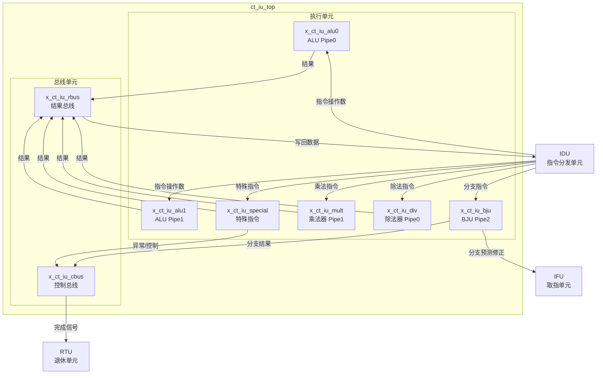

# ct_iu_top 模块框图

## 1. 模块层次结构

| 层级 | 模块名 | 实例名 | 说明 |
|------|--------|--------|------|
| 0 | ct_iu_top | - | 顶层模块，整数单元 |
| 1 | ct_iu_alu | x_ct_iu_alu0 | 算术逻辑单元0 (Pipe0) |
| 1 | ct_iu_alu | x_ct_iu_alu1 | 算术逻辑单元1 (Pipe1) |
| 1 | ct_iu_bju | x_ct_iu_bju | 跳转分支单元 (Pipe2) |
| 1 | ct_iu_mult | x_ct_iu_mult | 乘法器 (Pipe1) |
| 1 | ct_iu_div | x_ct_iu_div | 除法器 (Pipe0) |
| 1 | ct_iu_special | x_ct_iu_special | 特殊指令处理单元 |
| 1 | ct_iu_cbus | x_ct_iu_cbus | 控制总线 |
| 1 | ct_iu_rbus | x_ct_iu_rbus | 结果总线 |

## 2. 模块框图 (Mermaid)

## 3. 主要数据连线

| 源模块 | 源端口 | 信号名 | 位宽 | 目标模块 | 目标端口 | 说明 |
|--------|--------|--------|------|----------|----------|------|
| IDU | idu_iu_rf_* | 指令操作数 | 64 | ALU0/ALU1 | idu_iu_rf_* | ALU指令输入 |
| IDU | idu_iu_rf_pipe2_* | 分支指令 | 64 | BJU | idu_iu_rf_pipe2_* | 分支指令输入 |
| IDU | idu_iu_rf_pipe1_* | 乘法指令 | 64 | MULT | idu_iu_rf_pipe1_* | 乘法指令输入 |
| IDU | idu_iu_rf_pipe0_* | 除法指令 | 64 | DIV | idu_iu_rf_pipe0_* | 除法指令输入 |
| ALU0/ALU1 | alu_rbus_ex1_* | 计算结果 | 64 | RBUS | alu_rbus_ex1_* | ALU结果 |
| MULT | mult_rbus_ex4_data | 乘法结果 | 64 | RBUS | mult_rbus_ex4_data | 乘法结果 |
| DIV | div_rbus_data | 除法结果 | 64 | RBUS | div_rbus_data | 除法结果 |
| BJU | iu_ifu_chgflw_* | 分支目标 | 40 | IFU | iu_ifu_chgflw_* | 分支跳转 |
| RBUS | iu_idu_ex2_* | 写回数据 | 64 | IDU | iu_idu_ex2_* | 结果写回 |
| CBUS | iu_rtu_pipe*_cmplt | 完成信号 | 1 | RTU | iu_rtu_pipe*_cmplt | 指令完成 |

## 4. 接口信号分类

### 4.1 IDU 接口 (指令分发)

| 信号组 | 方向 | 位宽 | 说明 |
|--------|------|------|------|
| idu_iu_rf_pipe0_* | 输入 | 多位宽 | Pipe0 指令操作数 |
| idu_iu_rf_pipe1_* | 输入 | 多位宽 | Pipe1 指令操作数 |
| idu_iu_rf_pipe2_* | 输入 | 多位宽 | Pipe2 分支指令 |
| iu_idu_ex*_pipe*_wb_* | 输出 | 64bit | 写回数据 |

### 4.2 IFU 接口 (取指单元)

| 信号组 | 方向 | 位宽 | 说明 |
|--------|------|------|------|
| ifu_iu_pcfifo_create* | 输入 | 多位宽 | PC FIFO 创建 |
| iu_ifu_chgflw_* | 输出 | 40bit | 分支跳转目标 |
| iu_ifu_mispred_* | 输出 | 1bit | 分支预测错误 |

### 4.3 RTU 接口 (退休单元)

| 信号组 | 方向 | 位宽 | 说明 |
|--------|------|------|------|
| rtu_iu_flush_* | 输入 | 1bit | 流水线冲刷 |
| iu_rtu_pipe*_cmplt | 输出 | 1bit | 指令完成 |
| iu_rtu_pipe*_expt_* | 输出 | 多位宽 | 异常信息 |

### 4.4 CP0 接口 (协处理器)

| 信号组 | 方向 | 位宽 | 说明 |
|--------|------|------|------|
| cp0_iu_* | 输入 | 多位宽 | CP0 配置 |
| cp0_yy_clk_en | 输入 | 1bit | 时钟使能 |

### 4.5 VFPU 接口 (向量浮点单元)

| 信号组 | 方向 | 位宽 | 说明 |
|--------|------|------|------|
| iu_vfpu_ex*_mtvr_* | 输出 | 多位宽 | 整数到向量寄存器传输 |
| vfpu_iu_ex*_mfvr_* | 输入 | 多位宽 | 向量到整数寄存器传输 |
